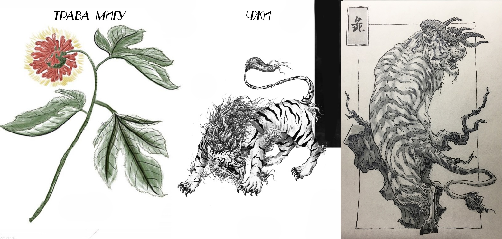

# Глава 11. Гудяо: божественный зверь у озера Тайху

И Чжисы рассмеялся:

— Если бы наш караван смог привлечь такого человека, нам бы не о чем было беспокоиться в пути. Это наш почетный гость, встреченный в дороге. Хоть он и молод, но весьма необычен. Господин Цзянли, перед вами — потрясающий мир своим именем Владыка города Цветущего Долголетия, Гэ Тянь.

Гэ Тянь полагал, что Цзянли — кто-то из младшего поколения, племянник или ученик И Чжисы. Но, услышав, с каким почтением говорит о нем Князь Алтаря, он поклонился юноше, приветствуя его как равного. Все присутствующие были поражены такой учтивостью Гэ Тяня и ожидали, что Цзянли проявит скромность. Однако тот лишь небрежно сложил руки в ответном жесте, не проронив ни слова вежливости.

Все подумали: «Какой невоспитанный юнец. Зачем И Чжисы привел с собой такого человека?»

……

Юсинь Бупо хотел было вернуться и найти Цзянли, но у ворот Крепости Великого Ветра его остановила стража. У него не было никакой возможности даже попросить передать весточку внутрь. Он бесцельно побродил по восточной части города, но не встретил ни одного знакомого лица. Живот начал урчать от голода, и он невольно почувствовал укол сожаления. Но, взглянув на небо, он быстро утешил себя: «Раньше у меня даже не было свободы голодать, когда вздумается. А теперь как хорошо — полная свобода, сам себе хозяин!»

Глядя на звезды, постепенно проступающие в сумерках, он с волнением мечтал о будущем: «Пока что прилипну к Цзянли, пойду с ним искать его Наставника. Этот парень такой важный, а о своем учителе говорит так таинственно — наверняка найти его будет непросто. И чем сложнее поиски, тем лучше — путешествие обещает быть веселым!»

В это время четыре старейшины торгового союза Юцюн уже хлопотали в западной части города, открывая первый ночной рынок сезона в Цветущем Долголетии. Они были главными героями этого торгового пика, и людской поток, естественно, хлынул туда, отчего восточная часть города казалась пустынной и холодной.

В одном из углов слепой сказитель рассказывал историю о герое Великой Пустоши. Он говорил с большим чувством, но вокруг не было ни единого слушателя.

Когда Юсинь Бупо услышал имя «И Линфу», он невольно вздрогнул. Это был самый прославленный и обсуждаемый молодой герой царства Шан последних лет. Юсинь Бупо имел несколько возможностей встретиться с ним, но каждый раз они разминулись по разным причинам. После исчезновения И Линфу Юсинь Бупо часто сожалел, что их пути так и не пересеклись, и никак не ожидал услышать о нем здесь. Он остановился и подошел поближе к слепому сказителю, чтобы послушать.

— Среди мириад воинов Поднебесной, кроме того человека, чье имя царь Ся запретил упоминать, лишь три легендарные личности взошли на вершину Боевого Пути. На первом месте, разумеется, стоит тот призрачный и туманный Патриарх Кровавого Меча. Он сам и его клинок существуют лишь в преданиях. Если бы не заброшенный десятки лет назад город Небесной Шелковицы, если бы не та гора иссохших костей, вздымающихся до небес, — быть может, сегодня никто и не поверил бы в существование такого человека и такого меча.

— Вровень с ним стоят Великий герой Цзидань Ломин, чья защита считается непробиваемой, и Божественный лучник Юцюн Жаоу, чья атака не знает преград. Мало кто в цзянху видел этих двух легендарных мастеров воочию, но чем они таинственнее, тем больше о них слухов. Особенно о Юцюн Жаоу рассказывают небылицы, выходящие за грань разумного. Если у луны не хватает кусочка — говорят, это Юцюн Жаоу упражнялся в стрельбе; если на небе недосчитываются звезд — говорят, Юцюн Жаоу сбил их к вину.

— В эту эпоху, когда все решают лук и конь, любая связь со школой Юцюн уже позволяет человеку зваться метким стрелком. И Чжисы — это меткий стрелок среди метких стрелков…

Юсинь Бупо не ожидал, что сказитель упомянет И Чжисы. Осознание того, что рядом с ним находится легендарный герой, вызвало в нем волну возбуждения. Он подумал: «Когда же и обо мне будут слагать легенды, как о них?»

Пока он размышлял, сказитель продолжил нараспев:

— Говорят, что искусство стрельбы И Чжисы было передано ему самим Юцюн Жаоу. И Линфу — старший сын И Чжисы. Его нрав подобен огню, а характер — ветру. Во всем государстве Юцюн никто не смеет коснуться его тетивы, ибо она остра, как лезвие меча; во всей Великой Пустоши нет чудовища, что не боялось бы его стрелы, ибо она быстра, как молния.

— Однажды в южной пустоши земель Юцюн он застрелил зверя Чжи (чудовище из «Канона гор и морей», похожее на тигра, но с бычьим хвостом, людоед). Когда Чжи с грохотом рухнул, герой услышал тихий девичий стон и увидел девушку с кожей, гладкой, как шелк.

— Но знал ли И Линфу, что в это время его жена с большим животом ждала его дома? Месяц назад ее молодой муж обещал вернуться через семь дней, но до сих пор она так и не дождалась его. Женщина молилась: «О боги Неба и Земли, прошу, защитите его. Ребенок скоро родится. Мне не нужно, чтобы он привозил редких зверей или птиц, я лишь хочу, чтобы он вернулся живым и здоровым». Но в этот самый миг И Линфу сжимал в объятиях спасенную из пасти чудовища девушку — неземную красавицу по имени Инь Хуань («Серебряное Кольцо»).

Юсинь Бупо замер. Инь Хуань? Разве не из ее комнаты он только что вышел? Но тут же усмехнулся про себя, решив, что это просто совпадение имен.

Голос сказителя изменился:

— Обнаженное тело в объятиях И Линфу было совсем не таким, как у его жены. С тревогой он взглянул на север, но когда мягкие, словно лишенные костей, руки Инь Хуань обвили его шею, а горячие губы заскользили по груди, шее, мочкам ушей и наконец слились с его губами, в жарком тумане мысли его вновь спутались. То упоение, которое дарила ему спасенная от зверя дева, было несравнимо даже с тем, что он знал с женой до беременности. Страсть в густой траве, любовные утехи в тумане заставили его почувствовать, что супружеская постель дома была лишь исполнением долга.

— Когда пламя страсти утихло, Инь Хуань спросила нашего юного героя: «Ты думаешь о ней?» И Линфу кивнул. Инь Хуань спросила снова: «Ты хочешь вернуться?» Юный герой ответил: «Она скоро должна родить, я должен быть рядом с ней. Я и так уже очень виноват перед ней». Инь Хуань с мукой в голосе произнесла: «Но я не хочу расставаться с тобой».

Сказитель продолжал:

— Инь Хуань прижалась лицом к его широкой груди, ее правая рука скользнула под мышку, поглаживая спину и затылок, а левая, словно гребень, ласкала волосы на его груди. Тело Инь Хуань постепенно разгорячилось, и дыхание И Линфу снова участилось…

Юный Юсинь Бупо покраснел, подумав: «Так вот они какие, народные баллады».

— «Ты… не надо так», — отказывался И Линфу, но голос его звучал как стон. Он сказал Инь Хуань: «Я обязательно должен вернуться». Инь Хуань ответила: «Тогда возьми меня с собой!» Но И Линфу отказал: «Нет. Нельзя».

— Дева Инь Хуань задрожала, ее голос наполнился волнением: «Почему? Я не собираюсь ничего у нее отнимать, я просто хочу быть с тобой. Ты можешь спрятать меня. Днем, вечером, когда у тебя будет время, мы…» Она снова начала стонать, и дыхание И Линфу вторило ее стонам. Но он все же сдержался и громко сказал: «Нет… нельзя!»