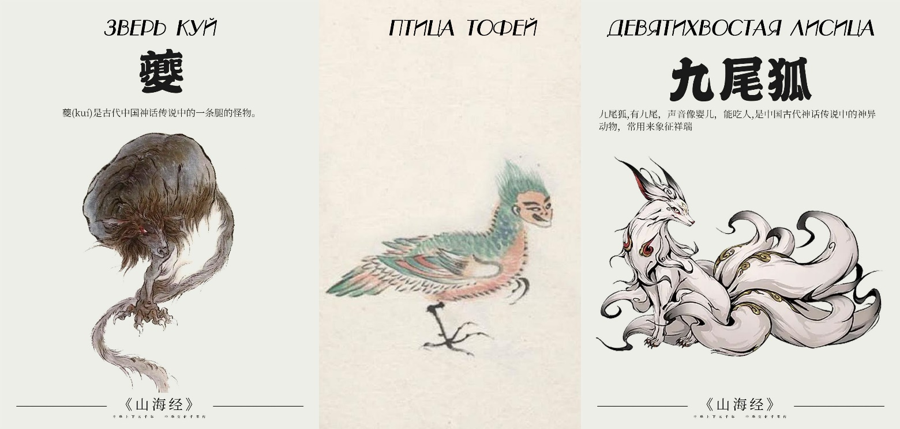

# Глава 2. Потомок Божественного Лучника Хоу И

Наконец, когда он в четвертый раз увидел один и тот же сугроб, по форме напоминающий человека, он понял: он сделал уже четыре круга и безнадежно заблудился. Но почему дорога перед глазами все еще кажется прямой? В ярости Юсинь Бупо ударил кулаком в воздух. Неожиданно перед ним мелькнула и исчезла странная тень. Юсинь Бупо понял, что попал под чары нечистой силы, но поделать ничего не мог. Припасы кончились, осталась лишь половина фляги крепкого вина. Ноги начали подкашиваться. В небе над ним уже полдня кружил стервятник.

«Неужели он ждет, пока я упаду, чтобы склевать мой труп?» — подумал юноша.

Вспомнив рассказы о том, что стервятники едят только мертвечину, Юсинь Бупо вдруг рухнул на тот самый сугроб, решив притвориться мертвым и выманить птицу. Хоть мясо орла и жесткое, его горячая кровь может дать тепло и силы.

Он медленно погружался в снег. Стервятник не спешил спускаться, но вдруг Юсинь Бупо почувствовал неладное под собой. Под снегом, где должна была быть мерзлая земля или камень, он нащупал человека. В бледно-зеленый шелк был закутан юноша, словно выточенный из горного хрусталя; черты его лица были прекраснее, чем у любого духа или феи. За десятилетия мира и просвещения в царстве Шан появилось немало красивых людей, но Юсинь Бупо никогда не видел никого столь совершенного.

«Неужто это оборотень?» — мелькнула мысль. Но даже для оборотня этот был слишком красив. Юсинь Бупо протянул руку, чтобы проверить, бьется ли сердце, но коснулся чего-то мягкого и пушистого — на груди у незнакомца свернулась клубком крошечная девятихвостая лисица [4]. Юсинь Бупо снова протянул палец, прижав его к жилке на виске юноши. Лишь спустя долгое время он ощутил слабое биение: этот человек был жив! Возможно, именно девятихвостая духовная лисица сберегла тепло жизни в его сердце.

[4] Согласно «Канону гор и морей» — лисица-людоед, но тот, кто съест ее мясо, не поддается чарам. Считается, что с каждой сотней лет жизни у нее отрастает новый хвост, и при девяти хвостах она достигает божественной силы. Может превращаться в прекрасную женщину.

«Спасать его или нет?»

Он знал, что заблудился. Сможет ли он сам выбраться из этой пустоши — большой вопрос, а с лишней обузой шансы на выживание станут ничтожными.

«Если я взвалю его на спину, через день в этой пустоши просто появится еще один сугроб, вдвое выше этого. Нет, я не так глуп».

Юсинь Бупо махнул рукой и пошел прочь.

Спустя время, достаточное, чтобы сгорела одна палочка благовоний, он снова оказался перед этим «сугробом». Но на этот раз не потому, что заблудился, а потому что вернулся сам.

«Наставник А-Хэн (А-Хэн — титул советника-регента И Иня при государе Шан, реальная историческая личность) учил меня принципам человеколюбия, и я всегда отвечал ему без запинки. Неужели перед лицом смерти я отброшу все, чему учился?»

«Но с другой стороны, — колебался он, — этими принципами сыт не будешь». Он отхлебнул вина и снова решительно зашагал прочь.

Белое солнце над головой сдвинулось лишь на толщину пальца, когда Юсинь Бупо снова вернулся на то же место. Он почесал затылок и пробормотал:

— Если я брошу его, буду ли я считаться мужчиной? Если дед узнает, он меня до смерти прибьет… Хотя, честно говоря, что для старика важнее: жизнь внука или жизнь незнакомца?

Поколебавшись, молодой человек в третий раз развернулся и ушел.

Когда Юсинь Бупо в четвертый раз оказался перед этим полумертвым юношей, он уже сам не понимал — заблудился ли он снова или намеренно сделал круг. На этот раз он ничего не сказал и ни о чем не подумал. Просто взвалил человека на спину и пошел.

В тот самый миг, когда он поднял прекрасного юношу, незримая тень, следовавшая за ним по пятам, издала неслышный для человеческого уха вопль ужаса и исчезла.

Два дня спустя, на самом краю Великой Пустоши, Юсинь Бупо упал без сил. Если бы он знал, что, пройдя еще четыре-пять ли, увидел бы сухие персиковые деревья на границе равнины, это, возможно, вдохнуло бы в него силы идти дальше. Если бы те полфляги вина не были влиты в рот незнакомцу, а выпиты им самим, возможно, он уже гулял бы на воле за пределами пустоши. И как только Юсинь Бупо рухнул, тот самый стервятник камнем упал с небес, приземлившись рядом с ним…

……

Грохот колес разрывал тишину.

Караван медных повозок из царства Юнцюн неспешно выбирался из Великой Пустоши. Тридцать шесть огромных быков (быкообразный зверь из «Канона гор и морей») тащили тридцать шесть огромных медных повозок, тяжко ступая по снегу; семьдесят два всадника сновали взад-вперед, прикрывая их с флангов; а высоко в небе, на высоте шестидесяти чжанов, кружил стервятник — такова была картина торгового похода одного из тридцати шести Великих торговых союзов, покоривших Поднебесную, — торгового союза Юнцюн.

Главу торгового союза именовали Князем Алтаря. В те времена власть тридцати шести караванов была столь велика, что в народе их почтительно величали князьями. Князем Алтаря каравана Юцюн был прославленный на весь мир великий мастер лука И Чжисы (И — фамилия, восходящая к Божественному Лучнику Хоу И, который сбивал солнца). В глубокой древности «Хоу» означало «государь», то есть «Хоу И» — «государь И». Некогда он отнял власть у династии Ся в эпоху царя Тай-кана, но позже был убит восставшими вассалами. Его потомки бежали на восток, взяв фамилию И, и И Чжисы был одним из них.

Под началом Князя Алтаря состояли четыре старейшины: Цан, Хао, F [1] и Шан. Под началом четырех старейшин служили шесть посланников. Посланники управляли ветроконями с серебряными рогами, и каждый ведал шестью колесницами и шестью всадниками. Под началом посланников стояли начальники колесниц. Они управляли ветроконями с железными хвостами и отвечали каждый за свою бронзовую повозку. К каждой колеснице был приписан один воин в легких доспехах; один возничий с кнутом и копьем, опоясанный коротким мечом (это были могучие мужи племени Гун, способные одной рукой удержать вес в восемь тысяч цзиней); один латник с бронзовой алебардой, коротким мечом и в мягкой броне; и три лучника с короткими клинками. Лучники Юцюн по праву считались непревзойденными среди всех тридцати шести Великих торговых союзов.

[1] Автор использует «F» как условное обозначение или инициал. Это стилистический прием, часто встречающийся в веб-новеллах, чтобы быстро ввести второстепенного, но узнаваемого персонажа без немедленного раскрытия полного имени. Ну или у автора иссякла фантазия.

В главной колеснице каравана Юцюн, выпрямив спину, восседал И Чжисы. По левую руку от него, скрестив ноги, расположились четыре старейшины.

Старейшина Цан слегка развернулся и склонился перед И Чжисы. Тот ответил поклоном, не вставая с места: так приветствовали друг друга старейшина и Князь Алтаря. В ту эпоху культура восточных царств была в расцвете, и даже в будничных делах этикет соблюдался неукоснительно.

— Князь Алтаря, закон каравана гласит: встретив на пути больного, слабого, утомленного или попавшего в беду, следует отдать ему одежду, чтобы согреть, и пищу, чтобы накормить. Но запрещено открывать двери колесниц и пускать чужаков внутрь, дабы избежать шпионов. Ныне мы идем через земли, где разбойников больше, чем шерсти на быках. Ради двух юношей без роду и племени мы сделали крюк в тридцать ли, да еще и пустили их в колесницу. Не есть ли это нарушение закона торгового союза Юнцюн?