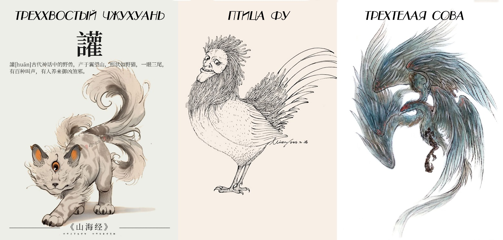

# Глава 22. Гудяо: божественный зверь у озера Тайху

— Ты уходишь прямо сейчас?

— Прямо сейчас.

— Ты пробыл здесь меньше получаса!

— Я знаю.

— Ты приходил сегодня только ради этой треснутой плошки?!

— Да!

— Собачье отродье! Ты не человек!

— Верно.

Ши Янь была в отчаянии. Этот разбойник был вторым мужчиной, сумевшим пробудить в ней интерес. Поначалу она сблизилась с ним ради мести. Она хотела отомстить И Чжисы, поэтому решила соблазнить мужчину, способного сравниться с ним в силе. Но, узнав его ближе, она начала терять голову. Она никогда не встречала такого странного разбойника и никогда не видела разбойника столь пессимистичного. Его тело было закаленным и грубым, но в постели он оказался удивительно чутким. Его безжалостные слова раз за разом разжигали в ней ярость, но его скорбный взгляд вновь и вновь дарил ей надежду.

— Убирайся! Забирай и проваливай!

— …

— Почему ты еще не ушел?

— В ближайшие два дня начнется великая смута. Что бы ни случилось, ты должна попасть в крепость. Я все устроил: завтра утром один из гостей Гэ Тяня потребует тебя к себе. Собери самое необходимое и, как только рассветет, отправляйся внутрь.

— Почему? Эй! Ты… не уходи!

Дверь закрылась. Снаружи послышались тяжелые, глухие удары шагов. Ши Янь осталась стоять, впервые осознав, насколько плохо она понимает мужчин.

……

Шестнадцатый день первого лунного месяца. Крепость Великого Ветра.

Торговый караван Юцюн вошел в город вечером четырнадцатого, и два дня подряд ночной рынок превращал город Цветущего Долголетия в арену непрерывного праздника. Однако после третьей стражи наступило похмельное затишье.

Это был третий день с тех пор, как И Чжисы вошел в город. Спокойствию пришел конец. Начиная с четвертой стражи ночи люди непрерывно докладывали о странных знамениях в городе и за его стенами: у северных водяных ворот внезапно появились целые полчища черных муравьев толщиной в палец; на западе города несколько десятков кур и уток были выпотрошены — почерк походил на почерк чудовища с тремя хвостами Чжухуань (чудовище из «Канона гор и морей» с одним глазом и тремя хвостами); в темных углах крысы начали сходить с ума, и старый ночной сторож сказал, что это потому, что они услышали крик птицы Фу (птица из «Канона гор и морей» с человеческим лицом, чье появление предвещает войну); на карнизах Крепости Великого Ветра перед самым рассветом внезапно опустились несметные полчища сов с тремя телами (чудовищные птицы из «Канона гор и морей» с одной головой и тремя телами), и никак их было не прогнать… Все это были мелкие твари яо, которых люди считают вредителями: они обладали мерзкими способами добывать пропитание, но им не хватало могучей силы для самозащиты, поэтому они редко осмеливались приближаться к человеческим поселениям — не то что целыми стаями стекаться в этот густонаселенный город.

— Небесное Бедствие? Смута яо? Или чей-то заговор?

— Докладываю: повозки Юцюн выстроились в круговую оборону. Действуют очень осторожно, никого не потревожили.

И Чжисы просил разрешения ввести караван во внутренний город, но получил отказ.

— Владыка города, возможно, стоит предупредить простых людей?

— О делах города Цветущего Долголетия, Князь Алтаря, прошу не беспокоиться. Я не могу допустить паники из-за какой-то выдумки.

Так ответил Гэ Тянь, поскольку совершенно не верил словам того юноши. Но теперь и он начал колебаться. У И Чжисы не было мотивов вредить ему. «Что же это за заговор… неужели и его втянули?»

— Докладываю: в восточном лагере Стенающего Зверя наблюдается активность.

С четырнадцатого числа Чжа Ло больше не появлялся в Крепости Великого Ветра, и Гэ Тянь чувствовал исходящую от него угрозу.

Будь то Небесное Бедствие или заговор, он понимал, что пора готовиться.

Наконец Гэ Тянь отдал тайный приказ. Пока мирные жители спали, ничего не подозревая, боеспособные силы города Цветущего Долголетия с конца четвертой стражи начали скрытно отступать в Крепость Великого Ветра. Кроме закрытых городских ворот, между невинными жителями внешнего города и надвигающимися ордами чудовищ не осталось никаких преград.

Бросить народ, чтобы избежать риска и сохранить боевые силы, — таков был выбор Гэ Тяня.

Цзинь Чжи встала рано. Спала она плохо. Вчера А-Сань радостно прибежал к ней и сказал, что сможет остаться на ночь, но едва они поужинали, как Мо Ло силком утащил его обратно, ссылаясь на срочное дело торгового союза, хотя никто из них толком не мог объяснить, в чем оно заключалось.

Если ночью не выспишься, на следующий день будешь чувствовать себя разбитым. Цзинь Чжи тупо лежала в постели, мучаясь от голода. Человеку, павшему на дно, трудно заставить себя взбодриться. Она знала, что уснуть все равно не сможет, и лежать так тоже не в радость, но ей было лень шевелиться. Когда солнце уже окрасило все в тускло-желтые тона, ее внезапно разбудил шум, охвативший весь город.

Уже с утра люди начали замечать в городе Цветущего Долголетия разные странности. Насекомых, змей, птиц и зверей стало беспричинно много. Но когда те, кто заметил неладное, попытались найти стражу, оказалось, что в городе не осталось ни одного солдата. До полудня паника распространялась медленно и тихо, ведь проникшие в город твари были мелкими, и жители, вооружившись палками, вполне могли справиться с ними и без помощи солдат.

Но когда люди заметили, что гости с востока и запада — отряд Чжа Ло и торговый караван Юцюн — развернули свои боевые порядки, а Крепость Великого Ветра явно готовится к обороне, самые догадливые начали кричать:

— Небеса! Случилось страшное! Владыка бросил нас!

Поначалу мало кто придал значение этим словам, но когда в полдень в город ворвались восемьдесят восемь белых волков, волна паники начала накрывать жителей одна за другой.

Волки, как и другие звери, пришли в город, спасаясь от беды. Инстинкт подсказывал им, что это единственное безопасное место. Но люди, уже жившие здесь, не могли стерпеть вторжения чудовищ на свою территорию. Сильные схватились за мечи, копья и дубины. В начавшихся стычках погибли десятки женщин и детей, причем больше половины были затоптаны обезумевшей толпой.

— В Крепость Великого Ветра! — крикнул кто-то.

И началась всеобщая смута.

Цзинь Чжи затерялась в толпе. Сначала она хотела пробиться к укрепленному лагерю повозок Юцюн, чтобы найти А-Саня, но стоило ей выйти, как людской поток повлек ее к крепости. По пути она перешагнула через десяток трупов; грязь, кровь и звериная шерсть облепили ее туфли. Она что-то бессвязно кричала, пока толпа несла ее к воротам.