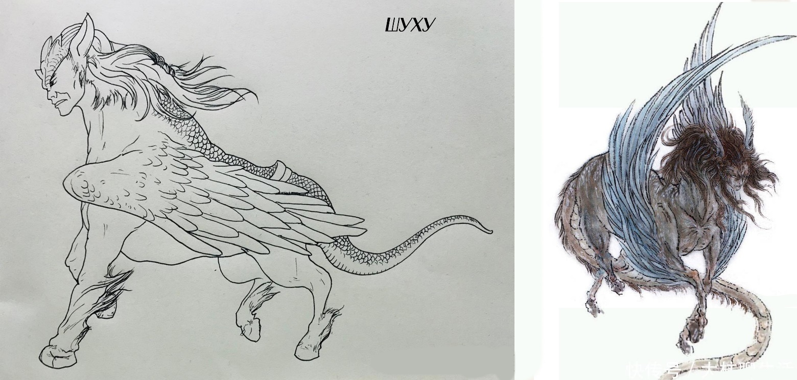

# Глава 23. Гудяо: божественный зверь у озера Тайху

Вторжение чудовищ поначалу не было массовым, но когда огромный зверь Шуху [1] с человеческим лицом, телом коня, птичьими крыльями и змеиным хвостом — одно из тех чудовищ Пустоши, что значились в списке особо опасных у Юцюн, — пробил городские ворота, чудовища хлынули внутрь целыми стаями. Проломленная стена превратилась в бесполезную декорацию.

[1] Согласно «Канону гор и морей», Шуху любит подбрасывать людей. Это не обязательно агрессивный акт — в мифах оно может делать это из шалости или любопытства, но для человека встреча с ним крайне опасна. Впрочем, это существо, с которым можно договориться, если понять его природу. Часто обитает у водоемов в глухих местах.

Старейшина Цан, командуя лучниками торгового дома, отстреливавшими зверей, ворчал:

— Гэ Тянь совершил ошибку, как он мог бросить внешний город!

— Если бы Гэ Тянь не отступил внутрь, внешний город, возможно, удалось бы удержать, — заметил Вэй Хао.

— Потому что больше всего он боится не чудовищ, а меня, — холодно усмехнулся Чжа Ло. — Теперь, даже если мы повернем оружие против него, для него это будет лишь занозой в пальце.

— Верно, если бы он защищал внешний город, мы стали бы ножом у него в животе.

— Он отгородился стенами крепости, значит, в его глазах главный враг — не эти твари, а я. Он не пустил внутрь караван Юцюн, значит, подозревает даже И Чжисы, — Чжа Ло смотрел на мечущихся в панике людей и невольно вспомнил прошлое. — Гэ Лао в свое время стал Владыкой, завоевав сердца людей и поддержку шести командиров. Если бы он увидел, как его сын предал этот народ… Хе-хе, интересно, какое бы у него было лицо?

— Молодой господин! — громко возразил Вэй Хао. — Предатель Гэ Лао стал Владыкой не потому, что завоевал сердца, а потому что использовал хитрость! Он обманул глупый народ своими интригами и узурпировал военную власть, поэтому…

— Ладно, ладно, в любом случае через два дня это уже не будет иметь значения. Когда мы победим, можешь рассказывать людям что угодно.

Одного Чжа Ло не сказал: «Если мы проиграем, говорить что-либо будет бесполезно».

Юсинь Бупо и Цзянли впервые видели подобный ужас. Раньше они слышали о таком от наставников, но никогда не видели своими глазами. Десятки тысяч людей, гонимые чудовищами, накатывали волной на закрытые ворота Крепости Великого Ветра. Вдали когти кровожадных тварей рвали отставших стариков, женщин и больных; вблизи тех, кто падал, затаптывал в кровавое месиво людской поток.

— Откройте! Откройте!

— Владыка, умоляю, пустите моего ребенка!

— Братец, сбрось веревку, дай мне подняться, я заплачу, заплачу… У меня много денег…

— Откройте, пустите меня! Смотритель Ха, я племянник четвертой тетушки соседа твоего дяди!

— Если не откроете, я пойду на штурм!

Цзинь Чжи была в гуще толпы. Она не знала, по скольким телам уже прошлись ее ноги, и не понимала, чьи это тела — зверей или людей. Все они были теплыми и мягкими, словно живые, а может, и вправду еще живые. Ей везло — она не упала, но надолго ли хватит этой удачи? Вой чудовищ за спиной становился все ближе, а впереди было не продвинуться ни на шаг. Неужели, когда умрут все, кто сзади, настанет ее черед?

Ее охватил дикий ужас, и хриплый крик инстинктивно вырвался из горла:

— Я не хочу умирать! Я не хочу умирать!

— А-а! Я тоже не хочу умирать!

— Мама-а-а!

— Все на штурм!

— Все равно помирать, вперед!

На закате шестнадцатого дня первого месяца жители города Цветущего Долголетия, оказавшись меж двух огней, начали штурм собственной крепости.

— Стрелять! — приказал смотритель Ха.

— Стой! — громко крикнул Цзянли, но град стрел уже обрушился вниз. За стенами крепости взметнулись брызги крови и плоти, плач и крики потрясли небо.

— Стой! — снова крикнул Цзянли.

Смотритель Ха холодно усмехнулся, не обращая на него внимания. Он поднял руку, собираясь отдать приказ для второго залпа, но вдруг заметил за спиной этого робкого с виду юноши пару глаз, сверкающих, как у тигра или леопарда. Сердце его похолодело, и он замешкался. Он презирал Цзянли, но опасался Юсинь Бупо.

— Этот сброд осмелился штурмовать крепость, бунтовать против власти — они сами ищут смерти. Вы двое — почетные гости Крепости Великого Ветра, прошу не вмешиваться в дела нашего города.

Цзянли впал в ярость:

— Убивать безоружных людей — у вас есть хоть капля человечности?!

— Вы же видели, молодой господин, они штурмуют крепость!

— Впустите их, и будем оборонять крепость вместе.

— Впустить? А если следом ворвутся чудовища? Я, Ха, не могу взять на себя такую ответственность!

— Об этом я позабочусь.

Не успел Цзянли договорить, как смотритель Ха расхохотался, и смех его был полон презрения.

Из-за спины Цзянли раздался голос Юсинь Бупо:

— Зачем ты тратишь на него слова? Дай я.

Смотритель Ха увидел, как тот разминает кулаки, и слегка изменился в лице: он помнил, с какой мощью Юсинь Бупо противостоял Цзинсиню. Он хотел что-то сказать, но Цзянли удержал друга:

— Не трогай его, иначе будет только хуже. Я пойду поговорю с Гэ Тянем. Смотритель Ха, прошу, не стреляйте, пока я не вернусь.

— Мой долг — защищать ворота, таков приказ Владыки крепости. Кто осмелится напасть — будет убит. Но за полпалочки благовоний этот сброд вряд ли сможет что-то сделать с неприступной Крепостью Великого Ветра.

Цзянли, видя, что тот пошел на уступку, сказал:

— Хорошо. Полпалочки и не понадобится. — И повернулся, чтобы уйти.

Юсинь Бупо вдруг спросил:

— Разве тебе не было безразлично, выживет этот город или нет?

Цзянли замер, помолчал и ответил:

— Я не знал, что люди будут умирать вот так. Не знал, что смерть — это настолько ужасно.

— Неужели ты никогда раньше не видел мертвецов?

— …Я раньше только слышал об этом. Возможно, наставник говорил о жизни и смерти слишком легкомысленно, — сказал Цзянли. — Поговорим потом. Ты пока пригляди здесь, а я найду Гэ Тяня.

— Не нужно, — сказал Юсинь Бупо.

— А?

— Он уже здесь.

Цзянли обернулся и увидел Гэ Тяня, Цзинсиня и И Чжисы.

— Открыть ворота? — холодно усмехнулся Гэ Тянь.

— Либо ты откроешь ворота и впустишь их, либо я спрыгну вниз.

— Спрыгнешь?

— Я вошел сюда как твой гость. Поднять на тебя руку здесь было бы предательством.

— Значит, ты хочешь спрыгнуть, чтобы вместе с этим сбродом напасть на меня? — снова усмехнулся Гэ Тянь.

Цзянли больше ничего не сказал.

— Ха-ха! Брат И, ты слышал? Этот ребенок грозится напасть на меня. На кого поставишь в этом споре?

И Чжисы спокойно ответил:

— Я не желаю, чтобы вы сражались, я хочу лишь мира. К тому же защита жителей города — долг Владыки.

Зрачки Гэ Тяня сузились:

— Ты тоже так считаешь?

— Владыка должен был понять мое мнение еще вчера.

Гэ Тянь холодно произнес:

— Но я не знаю, кто еще, кроме простолюдинов, ворвется следом, если открыть ворота.

Вдруг Цзянли сказал:

— Я могу отделить людей от чудовищ.

Все посмотрели на него как на хвастуна, который зарвался.

— Ты говоришь, что сможешь разделить десятки тысяч чудовищ и людей?

— Именно.

Гэ Тянь рассмеялся, но краем глаза заметил, что на лице И Чжисы, прославленного мастера, нет и тени насмешки над этими громкими словами.

— Если я это сделаю, ты откроешь ворота?

Гэ Тянь посмотрел на восток, колеблясь.