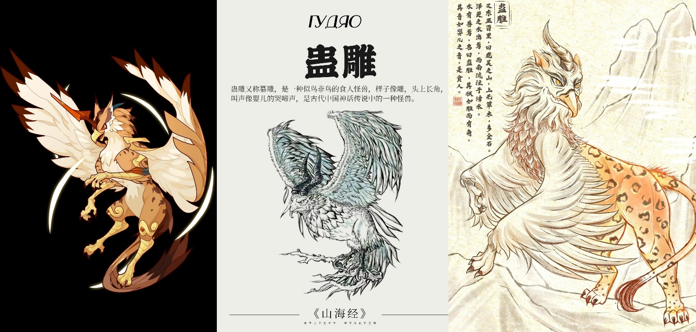

# Глава 25. Гудяо: божественный зверь у озера Тайху

— Драка, например?

— Угадал. Но кроме драки я иногда могу заняться чем-нибудь помягче.

— Например?

— Например, массаж ног.

— Массаж ног?! — воскликнул Цзянли. Он оглядел своего нового друга с ног до головы: никак не вязалось, что этот грубоватый парень станет кому-то прислуживать. — Небеса, кто осмелится доверить тебе свои ноги, молодой господин?

— Хе-хе, — усмехнулся Юсинь Бупо, — я выучился этому, чтобы деду помочь: его последние два года ревматизм мучает.

Цзянли рассмеялся:

— Тогда не надо, у меня ревматизма нет.

Но Юсинь Бупо вдруг схватил Цзянли за голую лодыжку. Тот вздрогнул и инстинктивно попытался вырваться:

— Ты чего?!

Юсинь Бупо улыбнулся:

— Меня научил наставник А-Хэн. Это очень приятно и быстро восстанавливает силы. — С этими словами он обхватил четырьмя пальцами подъем стопы, а большим пальцем начал втирать и массировать точку Юнцюань на подошве.

— Не надо… не надо… щекотно… ой, ха, прекрати… ай!

Он уже собрался пнуть Юсиня Бупо ногой, но вдруг почувствовал, как большой палец Юсиня Бупо, используя точку Шаошан [2], стал горячим, будто раскаленным, и по его телу потекла струя теплой энергии, поднимаясь вверх по меридианам.

[2] Точка Юнцюань переводится как «Бьющий родник» или «Кипящий источник». Это не просто анатомическая точка, а главные «ворота» в тело для энергии Земли. Точка Шаошан находится на большом пальце руки, переводится как «Младший купец» или «Малая торговля металла». Это последняя и одна из ключевых точек меридиана Легких, относящаяся к элементу Металл. Она ассоциируется с обменом, тонкостью, остротой и завершением цикла. Шаошан является «выходной» точкой меридиана, специально предназначенной для подобного энергообмена.

Цзянли перестал сопротивляться и лишь бросил:

— Не трать силы. «Истинная ци», которую я практикую, очень отличается от других.

— И чем же?

— Просто отличается. Если это не врожденная истинная ци моего наставника, она вступит в конфликт с моей. Ой! — Он осекся, обнаружив, что ци, переданная через пальцы Юсинь Бупо, беспрепятственно течет в его теле, сливаясь с его собственной, взращиваемой с детства, и стремительно циркулирует по двенадцати чудесным меридианам. Цзянли замолчал, позволив этой энергии течь свободно, но про себя удивился: «Почему его ци не конфликтует с моей? Неужели он практикует технику боковой ветви нашей школы? Не может быть — такую чистую ци можно получить, только следуя прямым учениям нашей школы. Неужели он ученик старшего брата-наставника?»

Погруженный в раздумья, Цзянли наслаждался теплым блаженством, словно зимой нежился в горячем источнике. Под большим пальцем Юсинь Бупо точки на подошве отзывались то легкой ломотой, то онемением, то щекоткой, то слабой болью. При ломоте — вдох, при онемении — выдох, от щекотки — смешок, от боли — стон. Постепенно он забыл о дневной резне, забыл о грядущей катастрофе, закрыл глаза, расслабился всем телом и под эти странные ощущения незаметно уснул.

……

Солнце клонилось к закату. Нижний этаж Крепости Великого Ветра был битком набит простолюдинами.

— Действует закон круговой поруки: один нарушит запрет — изгоняется весь квартал.

Под бдительным надзором атмосфера была напряженной, но спокойной.

Цзинь Чжи отрешенно жевала сухой паек, выданный старостой. Как и большинство людей, она не знала, что ждет ее завтра. Возможно, она просто исчезнет без следа, как многие ее знакомые. Жители ее квартала собрались вместе, но своей соседки Ши Янь она не видела. «Может, погибла там, снаружи…» Она боялась думать об этом дальше — не из-за глубокой привязанности к Ши Янь, а из страха, что ее постигнет та же участь. Вдруг она вспомнила об А-Сане. «Он из каравана Юцюн, может, он сможет вывезти меня из этого проклятого места». Мысль об этом простоватом мужчине была подобна соломинке для утопающего. Но она не знала, как с ним встретиться: кроме как по нужде, ей и ее соседям было запрещено даже передвигаться. «Ладно, лишь бы выжить».

……

Крепость Великого Ветра, Зал Безмятежности. Главы нескольких сил снова собрались вместе. Та же рассадка, те же гости, что и два дня назад, но атмосфера была совсем иной. Старый Неумирающий шарил глазами по залу, но не находил ни своего ненадежного талисмана Юсинь Бупо, ни всезнающего Цзянли. Цзинсинь, казалось, потерял к нему интерес и даже не смотрел в его сторону, но старик все равно трусил и потихоньку сдвигался поближе к И Чжисы, словно там было безопаснее.

— И что было потом? — Гэ Тянь и остальные расспрашивали о деталях Небесного Бедствия столетней давности. Жаль, но старик помнил немногое.

— Сначала мы держались, но потом появилось то чудовище. О! Это был настоящий кошмар. Когда оно пришло, наши люди падали, как скошенная трава, гнили в земле. Это чудовище не брали ни мечи, ни копья, а стоило ему поднять лапу, как мы теряли по двадцать храбрецов разом.

— Ты долго говоришь, но что это за тварь?

— У него тело леопарда, клюв орла и один рог. Жуткое создание.

— А голос — как у ребенка, верно? — перебил его голос, тяжелый и протяжный.

Старый Неумирающий уставился на И Чжисы и дрожащим голосом спросил:

— Т-ты… откуда ты знаешь?

— Ха-ха, откуда я знаю? Откуда я знаю… — И Чжисы горько усмехнулся. У человека, чье имя гремело на всю Великую Пустошь, все-таки был один зверь, которого он так и не смог покорить.

……

Гудяо похож на птицу, но не совсем: у него тело леопарда, клюв орла и рог на голове. Он людоед. Его огромная пасть способна проглотить человека целиком. Его крик подобен голосу ребенка. Изначально он обитал в Громовом Болоте, но со временем изменился, покинул воды и обосновался в Пустоши, став самым страшным чудовищем этих мест. Однако по сравнению с его дурной славой число жертв этого сильнейшего зверя Великой Пустоши в год было куда меньше, чем в иных людских войнах. Поскольку большую часть времени он спал и просыпался лишь раз в десять лет, чтобы поесть, а за раз съедал меньше сотни человек, за тысячу лет он погубил людей не больше, чем погибает в одной небольшой битве.

В этот день он еще не выспался, но жар, поднявшийся изнутри, пробудил его. Он открыл затуманенные глаза, взглянул на переменчивое небо и пробормотал:

— Опять… сто лет пролетели так быстро.

Его тело давно стало неуязвимым для воды и огня, поэтому даже во время спячки никто не мог его уничтожить. Напротив, те, кто знал о его мощи, — как И Чжисы, — всегда старались обходить стороной места его обитания. Потоки огня, вызванные Небесным Бедствием, не могли его убить, но находиться в них было крайне неприятно. К счастью, он знал одно прохладное местечко, куда можно было податься.

Гудяо поднял голову — небо едва серело. Он моргнул, и его состояние изменилось.

……

— Гудяо? Он очень силен? — спросил Юсинь Бупо.

Цзянли, проспав всю ночь, проснулся полным сил; истинная ци свободно текла в его теле. Восстановив энергию, он вместе с Юсинь Бупо пришел в Зал Безмятежности.

— У него нет каких-то особых умений, — горько усмехнулся И Чжисы. — Только три особенности. Во-первых, огромные размеры — его пасть легко проглотит человека. Во-вторых, чудовищная сила. Крепость Великого Ветра крепка, но выдержит ли она несколько его ударов — неизвестно. В-третьих, и это самое страшное, его шкура невероятно тверда, поистине неуязвима для клинков и копий, воды и огня. Любые атаки на него почти не действуют.

Чжа Ло холодно усмехнулся:

— Князь Алтаря И так хорошо осведомлен об этом чудовище. Неужели встречались?