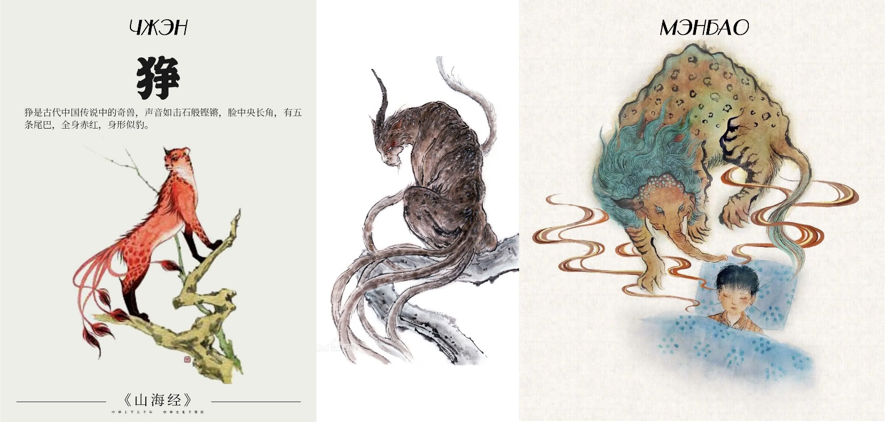
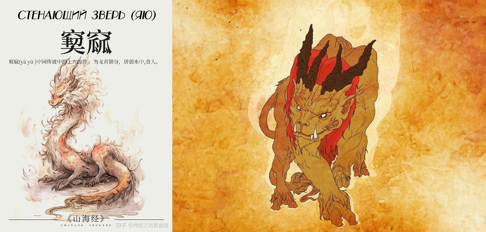

# Глава 4. Потомок Божественного Лучника Хоу И

— Откуда ты знаешь, что я трижды возвращался? Где ты был в то время? Неужто прятался в снегу? — Юсинь Бупо в упор смотрел на И Чжисы, ожидая ответа.

— Ха-ха-ха-ха… — рассмеялись все присутствующие.

И Линпин самодовольно произнес:

— Мой отец был не в снегу, он был в небесах.

— В небесах? Но тогда в небе была только лысая птица. Неужели… — снаружи колесницы вдруг раздался резкий клекот. Юсинь Бупо распахнул окно и действительно увидел того самого стервятника, которого хотел приманить, чтобы съесть. — Так этот орел — ваш питомец?!

Глава торгового союза Юцюн И Чжисы обладал способностью духовной связи с драконьим стервятником и мог видеть все, что видит птица.

«Именно этот человек выкопал меня», — глядя на широкую спину Юсинь Бупо, думал Цзянли. — «И именно этот мужчина наполнил повозку запахом вина, от которого я проснулся».

Осознание того, что он не продержался в снегу девяносто девять дней и не дождался Небесного Бедствия, наполнило его душу смятением и тревогой.

Он не держал зла на Юсинь Бупо, ибо не считал, что такой человек способен по-настоящему изменить его судьбу. Неужели все случившееся — воля Небес?

Но как же Наставник? Это испытание не пройдено. Задаст ли он новую задачу, чтобы проверить ученика? Или навсегда исчезнет из его жизни, и они больше никогда не встретятся? Этих вопросов Цзянли тогда не задал, ибо был уверен в своем успехе.

Увы, на его пути возник Юсинь Бупо, который так любит вмешиваться не в свои дела.

Цзянли очнулся от раздумий, заметив, как внезапно переменился всегда мягкий и спокойный И Чжисы. Взор непревзойденного лучника стал острым и пронзительным. Он резко встал и громко скомандовал:

— Боевое построение!

— К бою!

Вслед за приказом за пределами Великой Пустоши развернулось диковинное зрелище. Тридцать шесть бронзовых колесниц, словно гигантская змея, вдруг соединились головой и хвостом, образуя идеальный круг. Каждая повозка, влекомая могучими мужами Гун, развернулась задней частью наружу. Сверху, снизу, слева и справа из каждой повозки выдвинулись бронзовые плиты длиной в чжан: плиты соседних колесниц с лязгом сцепились, образуя единую кольцевую стену из бронзы. Нижние плиты наглухо закрыли зазоры у земли, а верхние сформировали зубчатые бойницы. Лучники заняли позиции на крышах, латники с алебардами замерли в ожидании, тетивы луков натянулись, мечи покинули ножны, а семьдесят два всадника натянули поводья, готовые к атаке. В одно мгновение посреди равнины выросла неприступная крепость с периметром в сотню чжанов.

Юсинь Бупо, Цзянли, И Линпин и четыре старейшины вслед за И Чжисы поднялись на крышу юго-западной колесницы. Вдали расстилалась ровная равнина, на которой сиротливо чернели несколько иссохших деревьев. Кроме редких порывов ветра, срывавших снег с ветвей, вокруг царило спокойствие.

— Да нет там ничего, — стоило Юсинь Бупо произнести это, как окружающие одарили его презрительными взглядами. Весь караван знал: их Князь Алтаря никогда не ошибается.

Цзянли наморщил нос и тихо произнес:

— Тяжелая, густая жажда убийства. Боюсь, там около семисот всадников.

И Чжисы удивленно взглянул на него и кивнул.

— Почему я ничего не чую? — спросил Юсинь Бупо.

— Дыхание Неба и Земли не предназначено для тех, чьи чувства притуплены, — ответил Цзянли.

— Ха! — фыркнул Юсинь Бупо. — Боюсь, ты просто набиваешь себе цену.

Цзянли нахмурился:

— Кто тут набивает цену? И перед кем?

— Конечно, ты, — усмехнулся Юсинь Бупо. — Увидел, что караван встал в оборону, и наугад назвал число, чтобы все восхитились. Хе-хе, еще и таинственность напускаешь. Разве носом можно учуять, сколько там людей — много или мало?

Глаза Цзянли сверкнули:

— А если их и вправду семь сотен?

— Значит, тебе просто повезло угадать!

В этот момент вдали началось движение, и Юсинь Бупо понял, что дело действительно нечисто.

Цзянли глубоко вздохнул и спросил:

— А если я скажу еще точнее?

— И насколько точнее?

— Семьсот человек или больше. Из них триста–четыреста на меднорогих конях, больше сотни — на серебрянорогих, остальные — на разномастном зверье. А тот, кто их возглавляет, восседает на звере пурпурного цвета.

Юсинь Бупо расхохотался:

— Если все так, как ты говоришь, я спрыгну вниз и позволю им растоптать себя!

Он обернулся к И Чжисы:

— Ни за что не поверю, что носом можно учуять даже цвет…

Его речь оборвалась, ибо он заметил, как изменилось лицо И Чжисы. Юсинь Бупо напрягся: «Неужели этот Цзянли попал в точку?»

Пока они спорили, на горизонте заклубилась пыль и снежная крошка, а затем послышался грохот, словно вдалеке гремел гром. Земля начала мелко дрожать.

Облако пыли приближалось, и лишь в сотне чжанов от каравана оно замедлило ход и остановилось. Впереди гарцевала сотня всадников на серебрянорогих конях, по флангам их прикрывали сотни на меднорогих. Когда эти два отряда выстроились, к ним подтянулись сотни всадников на самых разных тварях, рассыпавшись по бокам. Среди зверей были Мэнбао — похожие на медведей, но со слоновьими хоботами, и звери Чжэн — напоминающие леопардов, но с пятью хвостами и голосом, подобным удару камня о камень. Они задирали морды к небу, издавая вой, или рыли землю лапами, ревя так, что кровь стыла в жилах. Из шумящей толпы выдвинулось огромное знамя. На полотне было изображено чудовище: туловище как у быка, ноги как у коня, а голова — драконья! Под знаменем выехал всадник. Хоть до него было сто чжанов, от него исходила волна убийственной мощи. И зверь под ним был точь-в-точь как на знамени — и он действительно был пурпурным!

Юсинь Бупо надолго лишился дара речи, но все же признал поражение:

— Ладно, ладно, сдаюсь. Видно, я невежествен и глуп. Оказывается, цвет и вправду можно учуять носом. Брат Цзян…

— У меня нет фамилии Цзян, — поправил его юноша. — Меня зовут просто Цзянли.

— О, брат Цзянли, хе-хе! Не обижайся, что я так тебя называю. Я слышал, что можно определить расстояние и численность врага, слушая землю и глядя на небо. Но чтобы носом учуять число — слышу впервые. А уж учуять цвет — о таком я даже помыслить не мог. Объясни мне, в чем тут хитрость?

Цзянли, удивленный тем, как легко и честно собеседник признал проигрыш, ответил:

— Жажду убийства я и правда почуял. Но число я определил, глядя на небо. А что до цвета… я его угадал.

— Угадал? Даже не глядя? Как?

— Раз уж я определил число, то в радиусе трехсот ли есть только одна банда, способная собрать такую армаду. Кроме банды Стенающего Зверя [2], чья дурная слава гремит на горе Преград Трех Сыновей Неба, другой такой силы здесь нет.

 [2] Зверь Яюй из «Канона гор и морей». Древнее злобное божество или чудовище из мифов. В разных источниках описывается то как дракон с человеческим лицом и змеиным телом, то как бык с человечьим лицом и лошадиными копытами. Известно своей жестокостью и всегда связано с хаосом, убийствами и бедствиями. Его имя никак не переводится и состоит из иероглифов биморфемного звукоподражания воплей, стенаний, отсюда и название.

— Стенающий Зверь? — переспросил Юсинь Бупо. — Это имя того чудовища?