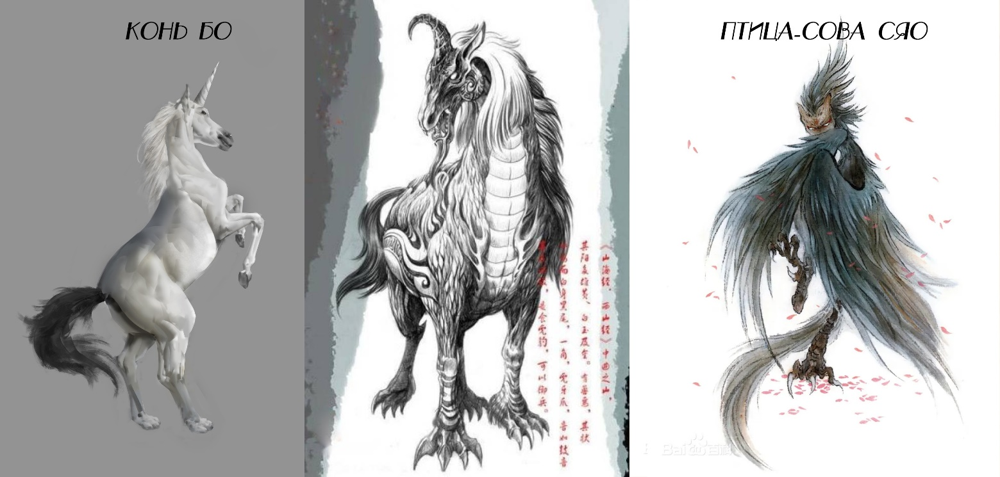

# Глава 6. Потомок Божественного Лучника Хоу И

Сердце И Линпина дрогнуло. Он действовал в порыве гнева и не ожидал, что Юсинь Бупо действительно спрыгнет вниз. Чувство вины кольнуло его. Он вспомнил многое: путников, убитых разбойниками, которых он видел прежде; наглое лицо Юсинь Бупо, который еще минуту назад беззаботно болтал рядом; вспомнил благородство своего старшего брата — будь он здесь… Внезапно он вспомнил о строгости отца и испугался. Одной фразой он отправил человека на смерть — как отец накажет его за это? Он украдкой взглянул на И Чжисы, но лицо того было суровым и непроницаемым, не выдавая ни единой мысли.

Цзянли же, казалось, вовсе не обращал внимания на несущуюся лавину из тысячи всадников. Когда Юсинь Бупо прыгал с повозки, он не стал его останавливать. Он просто смотрел, как Юсинь Бупо бежит навстречу вражескому строю, как он встает, подобно скале, как выставляет алебарду, ожидая удара.

Цзянли наблюдал за этим так, словно смотрел на озорного тигра, пробравшегося в отару овец с недобрыми намерениями. Он видел, как за медной стеной кольцевого укрепления мелькают копыта, взбивая снег, летящий по ветру. Он слегка скривил губы и пробормотал так тихо, что никто не услышал:

— А этот закат пугающе красен. Один человек преграждает путь тысяче коней — неплохая картина. Если бы Небесное Бедствие нагрянуло именно сегодня, зрелище было бы еще прекраснее.

Внезапный порыв ветра растрепал волосы Цзянли.

Авангард разбойников приходил во все большее возбуждение. Этот глупец, не ведающий страха смерти, был уже совсем близко. Десять чжанов, пять чжанов! Трое всадников, летящих впереди, казалось, уже видели будущее, что наступит через мгновение: алый блеск клинка, тело, кувыркающееся под копытами, кровавое месиво, втоптанное в грязь… Их глаза налились кровью, их звери обезумели от ярости.

— А-у-у-у… — всадник посередине с ревом снова вырвался вперед на голову, но вдруг увидел, как тот юнец в белом халате с боевым кличем бросился навстречу и в мгновение ока оказался перед мордой коня. Юноша взмыл вверх, и медный молот обрушился вниз.

«Он мертв», — подумал разбойник в тот миг. А затем сразу ощутил толчок, холод где-то в теле и чувство полета. В то краткое мгновение падения он увидел внизу хаос: конские головы, конскую кровь, человеческие головы, человеческую кровь… Нахлынувшая лавина разбойников, достигнув этого места, словно попала в водоворот, превращаясь в кровавую слякоть.

Лучники, латники и возничие каравана Юцюн начали испытывать необъяснимый трепет перед Юсинь Бупо. Этот юноша стоял там, и каждый взмах его алебарды означал смерть: смерть человека или смерть коня. Вскоре людей за ним стало не видно; еще позже исчезла из виду и алебарда. Лишь непрекращающаяся гибель врагов доказывала, что этот молодой человек все еще жив.

— Какое счастье, что он на нашей стороне, — произнес кто-то.

И в сердцах всех людей эхом отозвалось: «Истинно так!»

Взметнулся сигнальный флаг.

— Стрелять!

Бандитская орда была подобна побегу бамбука: сто восемь мощных луков Юцюн звенели одновременно, и с каждым залпом с «побега» сдирали один слой. Сможет ли этот «бамбук» докатиться до подножия медной стены прежде, чем его обдерут дочиста?

Поле битвы оставалось прежним. На земле несколько коней Бо (чудовище из «Канона гор и морей»: похоже на коня, но с белым телом, черным хвостом, одним рогом, тигриными клыками и когтями), пронзенных стрелами, все еще бились в агонии, раздирая мерзлую землю тигриными когтями. В небе кружили птицы-совы Сяо (чудовище из «Канона гор и морей»: похоже на сову, но с человеческим лицом, телом обезьяны и собачьим хвостом), их собачьи хвосты беспокойно дергались в воздухе…

Под знаменем Стенающего Зверя зазвучал гонг — сигнал к отступлению.

Выжившие отхлынули прочь с невероятной быстротой. И столь высокую эффективность бегства породил не сигнал из тыла, а тот юноша, танцующий в кровавой грязи, и тот ужас смерти, что исходил от него.

Когда бандиты скрылись, Юсинь Бупо, волоча за собой копье, вразвалочку побрел обратно. Алебарда давно сломалась, это копье он захватил в бою. Запрыгнув на повозку, он первым делом спросил Цзянли:

— Ну как?

Цзянли не дал ему договорить и двух слов. Зажав нос, он отскочил подальше и бросил лишь два слова:

— Ну и вонь!

……

Среди тридцати шести бронзовых колесниц каравана Юцюн только шесть не были нагружены товаром. Девятая колесница, именуемая «Сосновые объятия» (сосна в китайской традиции символизирует стойкость, долголетие и невозмутимость; вероятно, подразумевает прочную, укорененную, защитную позицию или состояние спокойной собранности), была одной из них. Это была гостевая повозка каравана Юцюн. Начальником колесницы был И Пусань, но все привыкли звать его А-Сань — во-первых, потому что имя И Пусань он получил совсем недавно, а во-вторых, потому что выговаривать полное имя было слишком хлопотно.

После великой битвы А-Сань обычно испытывал страх, скорбь, радость выживания и множество других чувств, но сегодня осталась лишь расслабленность после усталости.

А-Сань изначально был рабом без фамилии. Благодаря искусству управления колесницей он заслужил одобрение И Чжисы и в двадцать пять лет стал возничим девятой колесницы каравана. Во время недавнего происшествия он отважно спас жизнь начальнику девятой колесницы, и этот поступок превратил его, робкого от природы, в героя, восхваляемого всем караваном. После того похода начальник девятой колесницы, лишившийся правой руки, перед уходом на покой рекомендовал А-Саня своим преемником перед И Чжисы. Более того, великой честью стало то, что И Чжисы позволил ему взять фамилию И.

Это случилось всего несколько месяцев назад. Теперь, едва залечив раны, тридцатитрехлетний А-Сань правил ветроконями с железными хвостами и командовал девятой бронзовой колесницей. Это был его первый торговый поход в качестве начальника колесницы Юцюн. Его помощник Пан Лю, возничий А-Цай, тройняшки-лучники Мо Ло, Мо Инь и Мо Ци, а также латник Коротышка Лун — все они были его прежними боевыми товарищами, а теперь стали подчиненными и самыми важными партнерами. Конечно, в этот момент больше всего его заботили двое гостей в его девятой повозке.

«Слава богам, что он был здесь», — хоть А-Сань и не произнес этого вслух, он был переполнен благодарностью к гостю, Юсинь Бупо. Столкнувшись с таким могучим противником, как банда Стенающего Зверя, и пройдя через столь жестокую битву, весь караван Юцюн не потерял ни одного человека — раньше такое невозможно было даже представить. Если бы не Юсинь Бупо, если бы разбойники Стенающего Зверя прорвались к строю, роль братьев Мо отошла бы на второй план, а ему, Пан Лю и Коротышке Луну пришлось бы вступить в кровавую схватку с врагом.

«С такой ордой разбойников…» — при воспоминании об их свирепых лицах он невольно втянул голову в плечи.

«Какое счастье, что он был здесь».

Из двух гостей А-Сань недолюбливал Цзянли. Этот паренек только и умел, что выглядеть красиво. Во время битвы он и пальцем не пошевелил, но когда Князь Алтаря распорядился, чтобы они с Юсинь Бупо по-прежнему жили в «Сосновых объятиях», тот скривил такую недовольную физиономию, словно его смертельно оскорбили. Конечно, человеку простого происхождения, как А-Сань, трудно понять такую болезнь, как чистоплюйство.

У Цзянли была тяжелая форма мизофобии. Изначально он готов был умереть, но не жить в одной повозке с покрытым кровью и потом Юсинь Бупо, но, увы, гостевая повозка в караване Юцюн была только одна.