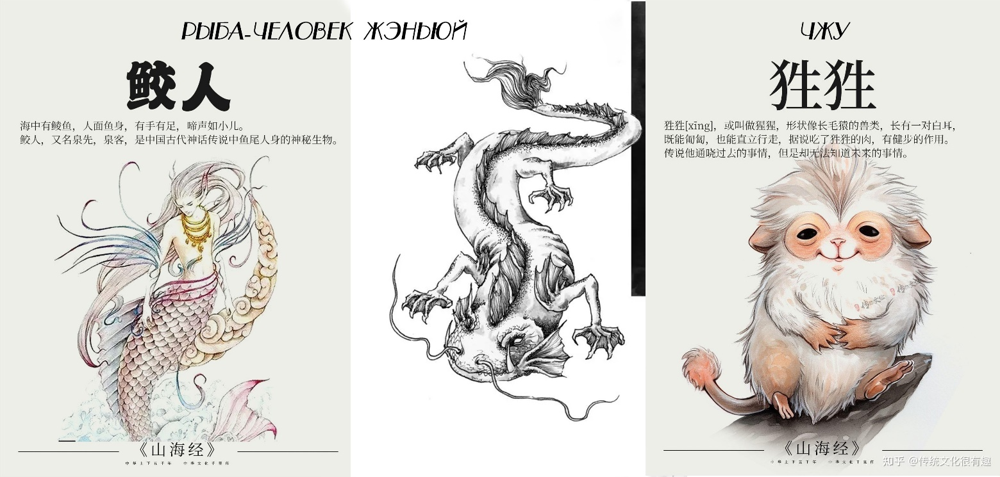

# Глава 7. Потомок Божественного Лучника Хоу И

И Линпин предложил:

— Может, переберешься в мою повозку?

Он был одним из шести посланников, и его главной колесницей была тринадцатая, под названием «Ответный Взгляд» (в боевом или социальном контексте это означает мгновенную ответную реакцию на действие противника, контрприем). К Цзянли он всегда питал симпатию, в отличие от Юсинь Бупо, вызывавшего у него неприязнь.

— Не стоит, — ответил Цзянли. — Я всего лишь временный гость. Нарушать правила каравана нехорошо.

На самом деле, помимо страсти к чистоте, у Цзянли была еще и тяжелая форма «человекофобии». Его самым чувствительным органом был нос, но необходимость находиться рядом с людьми, которые ему не нравились, была для него мучительнее, чем для обычного человека — соседство с человеко-рыбой Жэньюй (рыба-человек с четырьмя ногами из «Канона гор и морей», ныне известная как исполинская саламандра; их голос подобен плачу детей. Съешь ее — излечишь помрачение ума).

— Придется придумать способ отмыть этого Юсинь Бупо.

Услышав это, И Линпин сверкнул глазами, но промолчал.

Но как Цзянли собирался отмыть Юсинь Бупо?

Фучан (странное растение из «Канона гор и морей», на дереве которого растут три человеческие головы) и Чжу (зверь из «Канона гор и морей» с белыми ушами, ходящий прямо) — два чудовища Великой Пустоши, с которыми крайне опасно связываться. Фучан — это плотоядный растительный демон. У него три человеческие головы, и он способен пускать корни глубоко под землю, высасывая подземные воды и подземный огонь. Самый старый Фучан в Великой Пустоши имел за плечами сотни лет совершенствования; будучи растением-демоном, он развился настолько, что мог свободно передвигаться. Чжу — это странный зверь с человеческим лицом, белыми ушами, твердой кожей и жесткой шерстью; он неуязвим для мечей и копий, не боится ни воды, ни огня, и если он положил на кого-то глаз — несчастья не миновать.

Каждый раз, проходя через Великую Пустошь, четыре старейшины наставляли всех: в пустоши есть шесть вещей, которые нельзя тревожить. И Фучан, и Чжу входили в этот короткий список. Однажды, когда караван проходил через пустошь, А-Сань своими глазами видел, как Чжу разорвал и сожрал Бо — коня с тигриными когтями. И это зрелище той ночью трижды будило его в кошмарах. К счастью, эти чудовища боялись силы И Чжисы, и пока никто их не трогал, они тоже не искали проблем с караваном Юцюн.

Проводив молодого господина, А-Сань вдруг почувствовал странный запах. Затем он обнаружил, что рядом появились две огромные фигуры. Подняв голову, он едва поверил своим глазам: перед ним возвышались десятичжановый Фучан и скалящий зубы, размахивающий когтями Чжу, и до них было меньше трех чи. А-Сань остолбенел, его лицо дернулось в нервной улыбке:

— Опять кошмары на ровном месте снятся.

Он отвесил себе пощечину.

— Больно.

А чудовища никуда не исчезли.

— А-а-а!..

Под испуганный визг А-Саня, от которого у него душа ушла в пятки, весь караван пришел в боевую готовность. Братья Мо наложили стрелы на тетивы, целясь в чудовищ, которых здесь быть не должно.

Юсинь Бупо с любопытством подошел к А-Саню и, глядя на двух чудищ, сказал:

— Какие странные штуковины.

— Не… не трогай их, ни в коем случае не зли их! Я по… пойду позову Князя Алтаря, — задыхаясь, пролепетал А-Сань, но от страха не мог сделать и шагу: парализованный, он рухнул на землю.

Цзянли подошел и тоном, каким хозяин приказывает рабам, указал на Юсинь Бупо, обращаясь к Фучану и Чжу:

— Отмойте этого парня дочиста, и можете возвращаться.

И эти два чудовища действительно послушались Цзянли.

Фучан развернул огромный лист длиной в чжан, свернув его наподобие чана; вонзил глубокие корни в землю, раздул кроваво-красную пасть, похожую на бутон, и внезапно изверг струю воды прямо в лиственный чан, наполнив его до краев. Хоть погода стояла морозная, вода, поднятая из недр земли, была горячей и парящей.

Юсинь Бупо просиял:

— Великолепно!

Сорвав с пояса траву Мигу, он мигом сбросил одежду догола и запрыгнул в лиственный чан.

— Горячо! Как же хорошо!

Чжу вытянул свои две когтистые лапы с жесткой шерстью и принялся растирать все тело Юсинь Бупо. Клыкастая пасть и окровавленная глотка зверя находились совсем рядом с головой юноши, но тот продолжал улыбаться, словно играл с прирученным домашним питомцем. А Фучан протянул свои гибкие лианы, подхватил сброшенную одежду и принялся стирать ее в другом лиственном чане.

А-Сань, раскрыв рот, наблюдал за всем этим, словно во сне.

— Это… это просто возмутительно! — старейшина Цан в ярости большими шагами направился к главной колеснице каравана Юцюн — «Орлиному Глазу». Те двое, против кого он и так возражал, теперь вытворяли нечто неслыханное. И Линпин следовал за четырьмя старейшинами, терзаемый смутной тревогой. Он не любил Юсинь Бупо, но на этот раз гнев старейшин вызвал Цзянли.

— Князь Алтаря! — старейшина Цан поклонился, и хотя гнев сжигал его изнутри, он не отступил от этикета. — Этот Цзянли перешел все границы! Он призвал демонических зверей Великой Пустоши прямо в наш лагерь!

Он яростно изложил суть происходящего, но заметил, что взгляд И Чжисы рассеян, словно тот его не слушает.

— Князь Алтаря! — громко окликнул его старейшина Цан.

И Чжисы словно очнулся и медленно произнес:

— Отложим пока это мелкое дело.

Он помолчал, давая присутствующим в колеснице успокоиться, а затем так же медленно продолжил:

— «Море Юцюн» [1] исчезло.

[1] Еще можно перевести как «море Предела», но так как все связано с родом Юцюн, то оставляю так.

Когда старейшина Цан увидел, как Цзянли повелевает демонами, это вызвало в нем скорее потрясение, чем гнев. Очевидно, что ни Фучан, ни Чжу не были питомцами Цзянли, но эти дикие, свирепые твари перед лицом этого с виду хрупкого и утонченного юноши мгновенно стали послушными. Опытный взгляд старейшины Цана, закаленный десятилетиями, безошибочно определил: эта покорность была вызвана не привязанностью, а страхом. Какой же ужасающей силой должен обладать этот юноша! Старейшина тут же подумал: держать такого человека в караване — огромный, опасный риск.

Но все это меркло по сравнению с пропажей «Моря Юцюн».

«Море Юцюн» было не просто фамильной реликвией рода И, не просто главным сокровищем торгового союза Юцюн — его можно было назвать достоянием всего государства Юцюн. Это был символ, духовная скрепа, объединяющая всех людей каравана.

«Пока «Море Юцюн» с нами, даже если весь караван разграбят, если мы потеряем все деньги и товары, мы сможем подняться из пепла». Эта реликвия обладала непостижимой мистической силой, но для верхушки торгового союза куда важнее была ее способность сплачивать людей.

— Об этом не должен узнать седьмой человек, — таково было первое решение четырех старейшин. Если весть просочится, никто из них не мог предсказать, какие потрясения ждут караван.