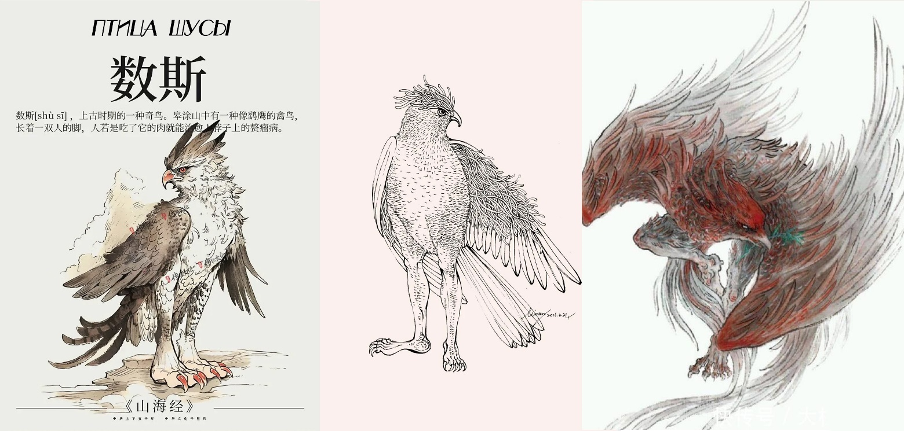
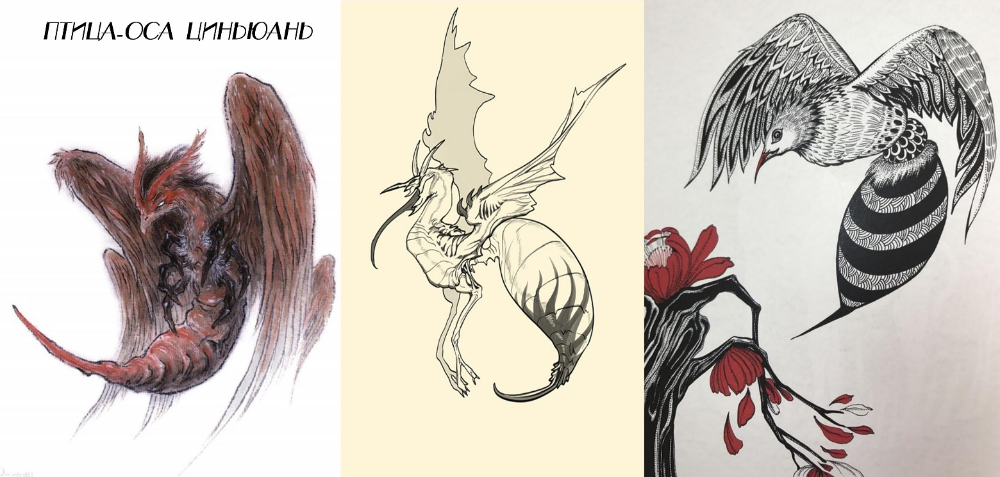

# Глава 9. Потомок Божественного Лучника Хоу И

— Благодарю, — сказал Цзянли. — И все же искусство стрельбы рода И славится на всю Поднебесную. Я был вашим гостем, мы вместе встретили грозного врага, но до сих пор я так и не увидел легендарного мастерства, способного сбить солнце. Было бы жаль уйти, не узрев этого.

И Чжисы спросил:

— Хочешь увидеть?

Цзянли показал язык:

— Я труслив, так что лучше не надо на мне. Вот поймаем вора — тогда и покажете. Только ждать тревожно.

И Чжисы усмехнулся:

— Ждать не обязательно.

Внезапно он встал и вышел из повозки. Все последовали за ним. На востоке уже занялась заря. Посланники, начальники колесниц и возничие уже приготовили коней и повозки, ожидая лишь приказа Князя Алтаря выступать.

И Чжисы вздохнул:

— «Сбивающий солнца»… Это лишь легенды цзянху. Человек, обладающий такой силой, непременно вызовет зависть демонов и богов.

Он сделал движение рукой, и в ней вдруг появился лук. Весь его облик мгновенно стал грозным и острым, подобно этому оружию. Он наложил стрелу, натянул тетиву и направил острие в зенит небосвода, строго перпендикулярно земле. Движения были стремительны, как ветер и гром, и плавны, как текущая вода. Всего несколько простых движений, но Цзянли смотрел на них с восхищением, чувствуя, как захватывает дух. Пока он втайне восторгался, внезапно раздался резкий свист, пронзающий барабанные перепонки. Этот звук был столь жутким, что спугнул отдыхающих птиц Шусы (чудовище из «Канона гор и морей»: тело как у ястреба, но с человеческими ногами) и обратил в бегство Фучана и Чжу.

Когда все снова посмотрели на И Чжисы, стрелы в его руках уже не было. Он махнул рукой, И Линпин передал приказ, и в мгновение ока караван перестроился из круга в линию, вновь отправляясь в путь.

Повозки и кони скрылись из виду, а стрела, выпущенная И Чжисы, все еще не упала на землю.

……

В южной части Великой Пустоши не было такого, как на севере, — четкой разделяющей черты, отделяющей границу владений людей и зверья — черты с местом обитания птиц-ос Циньюань (птица из «Канона гор и морей», видом похожая на осу, но размером с утку-мандаринку). Говорят, что Пустошь тянется на сотни ли с севера на юг, но никто точно не знал ее длины. Три сотни ли считались вотчиной демонов, змей и призраков, но чем дальше на юг, тем больше встречалось людей и тем меньше — нечисти. Поскольку караван Юцюн, часто пересекавший Великую Пустошь, считал ее южной границей полосу редко растущих персиковых деревьев шириной в сотню ли, другие постепенно приняли эту точку зрения. Но даже если следовать этому определению, по-настоящему густонаселенные земли лежали еще в пятистах ли за этой персиковой рощей.

Однако в самом сердце этой бесконечно дикой пустоши, посреди пятисот ли безлюдья, возвышался город, процветающий пугающим, неестественным образом, — Цветущее Долголетие (древнее место из «Канона гор и морей», к востоку от горы Куньлунь). Город, укрытый пеленой человеческих страстей.

К югу от Цветущего Долголетия простирались дикие земли варваров; на северо-западе он граничил с царством Гэ (одно из вассальных государств эпохи Ся, столица близ современного Шанцю, Хэнань) и через земли Куньу (древнее царство из «Канона гор и морей», к юго-западу от современного Пуяна, Хэнань) вел к столице империи Ся; на востоке упирался в море. Поэтому редкие товары с юга, оружие и доспехи из Куньу, изысканные изделия Великой Ся и даже диковины из заморских стран — все стекалось сюда. А с тех пор как караван Юцюн открыл путь через Великую Пустошь, здесь стали появляться и товары с северо-востока. Поэтому каждый приход каравана Юцюн в Цветущее Долголетие знаменовал начало одного из трех самых оживленных торговых сезонов города.

«В пределах Цветущего Долголетия насилие запрещено!» — это было единственное правило города. Пока оно соблюдалось, ворота были открыты для всех: будь то богатейший купец или последний вор. Но тот, кто осмеливался нарушить этот закон, сталкивался с карающей дланью Владыки Цветущего Долголетия. Посреди дикой пустоши лишь грубая сила могла гарантировать мир. Благодаря этому Цветущее Долголетие стало местом, где разбойники, наемные убийцы, торговцы и простые работяги могли спать спокойно.

Свободные торговые пути и мирная обстановка породили рынок с колоссальным оборотом. Толпы мужчин, влекомых жаждой наживы, устремлялись сюда. А где собираются такие люди, там нужна не только еда и питье, но и утехи плоти. С годами Цветущее Долголетие превратился не только в центр торговли, но и в самую развратную «пещеру, пожирающую золото». Здесь можно было купить любые редкости, насладиться любыми представлениями, сыграть по-крупному и найти женщину на любой вкус.

Женщины Цветущего Долголетия тоже делились на три разряда. Говорили, что лучшие красавицы скрыты во внутреннем городе — Крепости Великого Ветра, но, так как большинство их не видело, они редко становились предметом досужих сплетен. Женщин внешнего города вполне хватало, чтобы удовлетворить мужские языки и фантазии. В последнее время самым жарким спором было, кто достоин занять первое место в «Цветочном списке» Цветущего Долголетия — переменчивая Инь Хуань (имя означает «Серебряное Кольцо») или колючая Ши Янь («Каменная Ласточка»).

В отличие от блистательных Ши Янь и Инь Хуань, Цзинь Чжи («Златотканная») не была у всех на устах. Хотя Ши Янь жила по соседству, а Инь Хуань часто мелькала у ее порога, Цзинь Чжи оставалась в тени — возможно, именно потому, что яркое сияние двух знаменитых соседок затмевало ее. Впрочем, ее это устраивало: это ремесло все равно не могло быть судьбой женщины на всю жизнь.

Но был один мужчина, который всегда помнил о ней. Его звали А-Сань. Увы, этот мужчина был не слишком удачлив: сколько лет он скитался по свету, а так и не скопил состояния. Сколько раз приезжал в Цветущее Долголетие, денег ему хватало лишь на одну ночь с ней. Караван Юцюн приходил раз в год, и он приходил к ней раз в год. После его пятого визита Цзинь Чжи начала замечать в зеркале первые морщинки в уголках глаз. Когда А-Сань захрапел рядом с ней в девятый раз, у нее вдруг мелькнула мысль: а может, провести остаток жизни с ним? Сначала это была лишь искра, но после его ухода, когда другие мужчины без колебаний ложились в ее постель, эта мысль разгоралась все ярче. Спустя полгода она превратилась в тоску, которая казалась ей самой смешной и нелепой.

— Караван Юцюн вошел в город! — для всех в Цветущем Долголетии это означало начало очередного праздника.

Цзинь Чжи поспешно заперла окна и двери, подняла доски пола под кроватью, вытащила два тюка с постельным бельем и ворох старой одежды, открывая темный глиняный кувшин. Сунув туда руку, она осторожно извлекла старую шкатулку. Оглядевшись по сторонам, она открыла ее и пересчитала украшения — не дорогие, но и не дешевые. Это было приданое стареющей блудницы, ее мечта о второй половине жизни.

Такие, как Цзинь Чжи, могли жить только во внешнем городе Цветущего Долголетия. Лишь самые популярные куртизанки, вроде Ши Янь и Инь Хуань, имели доступ во внутренний город — Крепость Великого Ветра, но и они, отработав свое, вынуждены были возвращаться в свои норы во внешнем городе.