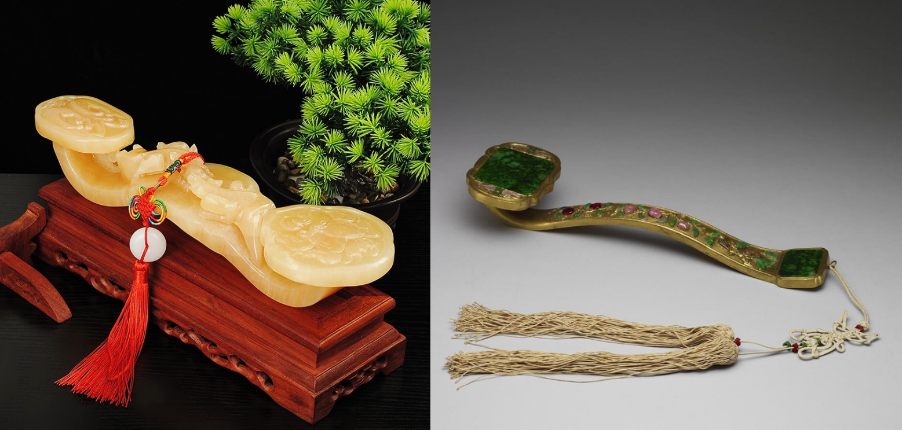
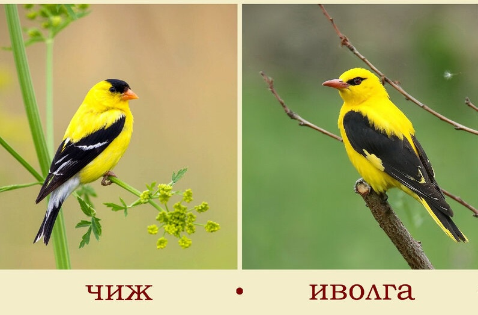
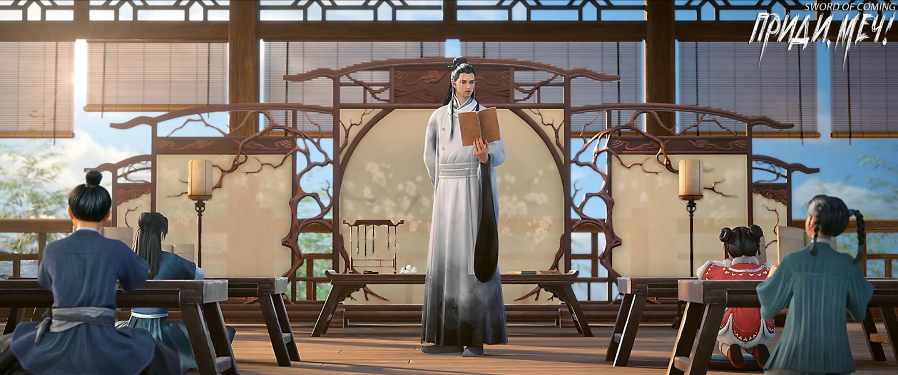

# Глава 03. Восход солнца

Городок был не большой и не маленький, в нем проживало более шестисот семей. Чэнь Пинъань знал большинство дверей бедняков, но что касается богатых семей с прочным фундаментом, их пороги были высоки, и мальчик с грязными ногами не мог переступить через них. Были некоторые просторные переулки, где скопились большие семьи, и Чэнь Пинъань никогда даже не ступал туда. Улицы там были в основном вымощены большими кусками зеленых каменных плит, и в дождливые дни, наступив на них, брызги грязи определенно не разлетались. Эти зеленые каменные плиты превосходного качества, после тысяч лет топтания и укатывания людьми, лошадьми и повозками, уже давно стали гладкими, как зеркало.

Четыре фамилии — Лу, Ли, Чжао и Сун — были большими семьями в городке. Частную школу основали на их деньги, и большинство из них владели двумя-тремя большими драконовыми печами за городом. Резиденции чиновников, надзирающих за работой печей, находились на одной улице с этими семьями.

По несчастливой случайности, почти все десять писем, которые Чэнь Пинъань должен был доставить сегодня, предназначались для известных богатых семей городка. Это было вполне разумно и естественно, потому что дракон рождает дракона, феникс рождает феникса, а мышь рождает детей, которые роют норы. Дети издалека, которые могли отправлять письма домой, определенно происходили из не бедных семей, иначе у них не было бы смелости отправиться в далекое путешествие. Девять из этих писем Чэнь Пинъань на самом деле доставил в два места: на улицу Благоденствия и Достатка и в переулок Персиковых Листьев. Впервые ступив на зеленые каменные плиты, большие, как доски кровати, Чэнь Пинъань почувствовал некоторое беспокойство и замедлил шаги. Он даже почувствовал себя немного неловко и невольно подумал, что его соломенные сандалии загрязнят улицу.

Первое письмо, которое доставил Чэнь Пинъань, предназначалось семье Лу, чьи предки когда-то получили от императора нефритовый жезл Жуи [1]. Стоя у ворот, Чэнь Пинъань чувствовал себя еще более неловко и неуверенно.

[1] Жуи (如意 — благопожелательный жезл), буквально переводится как «как пожелаешь» — это традиционный китайский символ власти и благопожелания в виде жезла с навершием в форме головы дракона или облака. Он олицетворяет пожелание, чтобы все было согласно желаниям, мечтам и воле владельца. Жезл Жуи часто изготавливался из нефрита и использовался в качестве подарка высокопоставленным лицам или символа власти. 

У богатых семей было много причуд. Не говоря уже о том, что поместье семьи Лу было огромным, у ворот еще стояли излучающие внушительную ауру две каменные статуи львов, высотой с человека. Сун Цзисинь говорил, что подобные вещи могут отгонять зло и подавлять нечисть. Чэнь Пинъань понятия не имел, что такое зло и нечисть, но ему было очень любопытно, как во рту львов оказался круглый каменный шар, и как его вырезали? Чэнь Пинъань сдержал порыв прикоснуться к каменному шару, поднялся по ступенькам и постучал молотком в бронзовой львиной голове на воротах. Вскоре вышел молодой человек. Услышав, что пришли доставить письмо, он с невозмутимым выражением лица взял конверт двумя пальцами за угол. Получив письмо, он тяжело захлопнул большие ворота, с нарисованным на ней богом богатства, повернулся и быстро зашагал в поместье.

После этого процесс доставки писем Чэнь Пинъанем проходил так же обыденно. На углу переулка Персиковых Листьев жила семья, не пользовавшаяся известностью. Дверь открыл низкорослый старик с добрым лицом, который, забрав письмо, с улыбкой сказал: 

— Молодой человек, ты устал. Не хочешь ли зайти отдохнуть и выпить горячей воды?

Чэнь Пинъань застенчиво улыбнулся, покачал головой и убежал.

Старик аккуратно положил письмо в рукав и не торопился возвращаться во двор. Вместо этого он поднял голову и посмотрел вдаль мутными глазами. Наконец, его взгляд опустился сверху вниз, с дальнего расстояния до ближнего, и остановился на персиковых деревьях по обеим сторонам улицы. Только тогда на лице низкорослого старика, казавшегося дряхлым и глухим, появилась тень улыбки, и он повернулся, чтобы уйти.

Вскоре на ветку персикового дерева села милая маленькая желтая птичка[2], клюв которой все еще был нежным, и тихо защебетала.

[2] 黄雀 — дословно: «желтый воробей», означает «чиж», но иногда его переводят как «иволга». П/п.: в романе подразумевается именно чиж, потому что иволга намного крупнее. Чиж — птица семейства вьюрковых. Размером меньше воробья, длина тела около 12 см. Иволга размером немного крупнее обыкновенного скворца: длина 24-25 см, размах крыльев около 45 см.

Последнее письмо Чэнь Пинъань должен был доставить учителю, преподающему в местной школе. По пути он прошел мимо палатки гадателя. Молодой даос в старой и поношенной мантии сидел за столом, держа спину прямо. На голове у него была высокая заколка, похожая на распустившийся цветок лотоса.

Увидев Чэнь Пинъаня, быстро проходящего мимо, молодой даос поспешно окликнул его: 

— Молодой человек, не проходи мимо, вытяни жребий, и этот бедный даос погадает тебе, чтобы помочь предсказать удачу и несчастья, благословения и бедствия. 

Чэнь Пинъань не остановился, но повернул голову и помахал рукой.

Молодой даос не сдавался. Он наклонился вперед и повысил голос: 

— Молодой человек, обычно этот бедный даос берет десять вэнь за толкование жребия, но сегодня сделаю исключение — всего три! Конечно, если вытянешь хороший жребий, можешь добавить еще один вэнь на удачу, а если выпадет большая удача, высший жребий, то этот бедный даос возьмет с тебя только пять вэнь. Как тебе?

Шаги Чэнь Пинъаня вдалеке явно замедлились. Молодой даос поспешно поднялся и, пользуясь моментом, громко сказал: 

— Этот бедный даос решил довести доброе дело до конца. Если ты сядешь и вытянешь жребий, я напишу несколько талисманов на желтой бумаге, которые помогут помолиться за твоих предков и накопить заслуги в загробном мире. С моими способностями я не осмелюсь утверждать, что обязательно обеспечу перерождение в богатой и знатной семье, но если говорить о том, чтобы получить немного больше благословений, то в конце концов стоит попробовать.

Чэнь Пинъань на мгновение опешил, затем с сомнением повернулся и вернулся, сев на длинную скамью перед палаткой.

Простой даос и бедный юноша, два нищих разного возраста, сидели друг напротив друга.

Молодой даос с улыбкой протянул руку, указывая Чэнь Пинъаню взять бамбуковый тубус с жребиями. Чэнь Пинъань колебался, но вдруг спросил: 

— Я не буду тянуть жребий. Ты можешь просто написать для меня желтый бумажный талисман?

Насколько Чэнь Пинъань помнил, этот молодой странствующий даос пробыл в городке по меньшей мере пять-шесть лет, и его внешность не сильно изменилась. Он был приветлив со всеми, обычно помогал людям гадать по костям, читать по лицу, предсказывать судьбу и тянуть жребии, а иногда даже писал письма для других. 

Интересно, что за эти годы, когда мужчины и женщины городка вытягивали жребии из бамбукового тубуса, в котором было сто восемь бамбуковых палочек, никто никогда не вытягивал ни самого благоприятного, ни неблагоприятного жребия. Казалось, что все сто восемь жребиев были умеренно благоприятными, без плохих. Поэтому, если это было во время праздников и жители городка просто хотели получить немного удачи, они могли смириться с тратой десяти монет. Но если у них действительно случались проблемы, то никто не хотел приходить сюда и быть обманутым. Однако было бы несправедливо назвать этого молодого даоса полным обманщиком. Городок был небольшим, и если бы он действительно занимался только обманом и мошенничеством, его бы давно выгнали. Поэтому можно сказать, что навыки этого молодого даоса определенно заключались не в чтении по лицу и толковании жребиев. При мелких болезнях и несчастьях многие люди, выпив чашу воды с талисманом от даоса, быстро выздоравливали, что было довольно эффективно.

Молодой даос покачал головой: 

— Этот бедный даос ведет дела честно, не обманывая ни старых, ни малых. Мы договорились, что за толкование жребия и написание талисмана вместе будет пять вэнь.

Чэнь Пинъань тихо возразил: 

— Три вэнь.

Молодой даос рассмеялся: 

— А что, если ты вытянешь самый благоприятный жребий? Разве это не будет стоить пять монет?

Чэнь Пинъань решился и протянул руку к тубусу с жребиями, но вдруг поднял голову и спросил: 

— Как даос узнал, что у меня есть ровно пять вэнь?

Молодой даос сел прямо: 

— Этот бедный даос всегда точно определяет, насколько человек удачлив и каково его денежное положение.

Чэнь Пинъань задумался и взял тубус с жребиями.

Молодой даос с улыбкой сказал: 

— Молодой человек, не нервничай. Если что-то суждено судьбой, в конце концов это произойдет. Если что-то не суждено судьбой, не стоит этого добиваться. Относиться к непостоянным вещам со спокойным сердцем — это лучший способ быть полностью готовым ко всему.

Чэнь Пинъань снова поставил тубус с жребиями на стол и серьезно спросил: 

— Даос, я отдам тебе все пять монет и не буду тянуть жребий. Можешь ли ты просто написать талисман на желтой бумаге лучше, чем обычно?

Молодой даос, не меняя улыбки, немного подумал и кивнул: 

— Можно.

На столе уже были приготовлены кисть, тушь, бумага и тушечница. Молодой даос тщательно расспросил Чэнь Пинъаня об именах, происхождении и датах рождения его родителей, затем вытащил лист желтой бумаги для талисманов и быстро написал его одним движением.

Чэнь Пинъань понятия не имел, что именно он написал.

Отложив кисть и подняв талисман, молодой даос подул на чернила: 

— Когда вернешься домой, встань внутри порога и сожги желтую бумагу снаружи порога. Вот и все.

Чэнь Пинъань торжественно принял талисман, аккуратно спрятал его, не забыв положить пять медных монет на стол, и поклонился в знак благодарности. Молодой даос махнул рукой, показывая Чэнь Пинъаню, чтобы тот шел по своим делам. Чэнь Пинъань побежал доставлять последнее письмо.

Молодой даос лениво откинулся на стуле, покосился на медные монеты и наклонился вперед, чтобы сгрести их к себе. В этот момент маленькая желтая птичка спикировала с высоты на стол, легонько клюнула одну из монет, но быстро потеряла интерес и улетела прочь.

— Желтая птичка хотела принести цветок, но персиковые деревья в твоем доме еще не расцвели[3], — неторопливо продекламировал молодой даос строку стихотворения, затем, притворно небрежно взмахнув рукавом, вздохнул: — Если судьбой отмерено восемь чи, не стремись к одному чжану[4].

[3] 黄雀始欲衔花来，君家种桃花未开 — «Желтая птичка хотела принести цветок, но персиковые деревья в твоем доме еще не расцвели». Цитата из стихотворения «Весеннее настроение в шутливых стихах, подаренных Ли Хоу» поэта Цэнь Шэня.

[4] 命里八尺，莫求一丈啊 — «Если судьбой отмерено восемь чи, не стремись к одному чжану». Буквально можно понять так: если суждено быть всего восемь чи ростом, то будет сложно достичь высоты в чжан (конечно, речь может идти не только о росте). Это своего рода мировоззрение. Другими словами, несмотря на ваши усилия, вы не можете достичь своих целей по тем или иным причинам. Если у вас нет желаний и стремлений, жизнь будет намного проще. Чи — мера длины, равная 32 см (в древности 24-27 см). Чжан — мера длины, в современном исчислении 3,2 м (в древности 1,9-3,4 м). 1 чжан = 10 чи.

С этим взмахом две бамбуковые палочки с жребиями выскользнули из его рукава и упали на землю. Молодой даос ахнул и поспешно поднял их, затем украдкой огляделся по сторонам. Убедившись, что никто не обратил внимания, он с облегчением спрятал палочки обратно в свой просторный рукав. Кашлянув, молодой даос нахмурился и продолжил ждать следующего клиента. Он со вздохом подумал, что зарабатывать деньги на женщинах все-таки немного проще.

На самом деле, две бамбуковые палочки с жребиями, спрятанные в рукаве, были самым благоприятным и самым неблагоприятным жребиями, которые использовались для того, чтобы заработать много денег. Об этом не стоило знать посторонним.

Чэнь Пинъань, естественно, не знал об этих тайнах. Он шел легкой походкой к зданию частной школы, окруженному пышными бамбуковыми рощами, которые выглядели свежо и зелено.

Чэнь Пинъань замедлил шаг. Изнутри дома донесся густой мужской голос: 

— Солнце восходит и сияет, ягнячья шкура мягка, как вода. 

Затем послышался ряд четких и звонких детских голосов: 

— Солнце восходит и сияет, ягнячья шкура мягка, как вода.

Чэнь Пинъань поднял голову и посмотрел на восходящее солнце, сияющее и величественное. Он невольно застыл в задумчивости.

Когда он пришел в себя, ученики уже покачивали головами, старательно декламируя отрывок по требованию учителя: 

— Во время пробуждения насекомых небо и земля оживают, все сущее начинает процветать. Ложитесь спать поздно и вставайте рано, широко шагайте по двору. Благородный муж ходит не спеша, чтобы развить свою волю…

Чэнь Пинъань стоял у входа в школу, не решаясь заговорить. Ученый средних лет с проседью на висках повернул голову, посмотрел на него и тихо вышел из дома.

Чэнь Пинъань протянул письмо обеими руками и почтительно сказал: 

— Это письмо для учителя.

Ученый в синем халате, приняв конверт, мягко сказал: 

— В будущем, когда у тебя будет свободное время, ты можешь приходить сюда послушать.

Чэнь Пинъань почувствовал некоторую неловкость, ведь он не был уверен, что у него действительно появится время приходить сюда и слушать, как этот учитель преподает. Но он не хотел обманывать учителя.

Ученый улыбнулся и с пониманием сказал: 

— Ничего страшного. Все принципы в книгах, но как быть человеком — это за пределами книг. Иди, занимайся своими делами.

Чэнь Пинъань с облегчением вздохнул и попрощался.

Когда Чэнь Пинъань убежал довольно далеко, он, сам не зная почему, обернулся. Он увидел, что учитель все еще стоял у входа, его фигура купалась в солнечном свете, и издалека он казался подобным божеству.