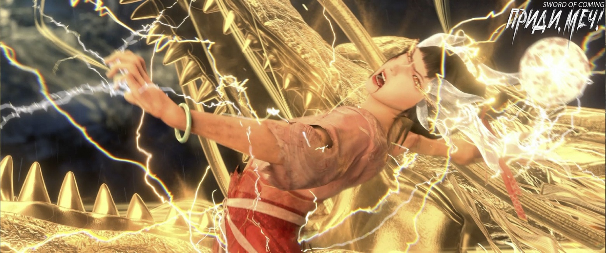

# Глава 15. Подавляющее превосходство

Чэнь Пинъань вышел из переулка Глиняных Кувшинов и как раз столкнулся с Чжигуй. После того, как она отнесла письмо Цай Цзиньцзянь в дом Гу Цаня, она не спешила возвращаться домой, а прошла через переулок и отправилась бродить по лавочкам в переулке Цветущих Абрикосов. Хотя она ничего не купила, ее настроение все равно было хорошим, и она весело и легко прыгала всю дорогу.

Выросшая в сельской местности девушка, казалось, несла с собой аромат зеленой травы, и ее поведение определенно отличалось от поведения благородных девиц из богатых домов с высокими карнизами и глубокими дворами.

Увидев Чэнь Пинъаня, она не стала, как обычно, опускать глаза и ускорять шаг, проходя мимо. Вместо этого она остановилась и пристально посмотрела на этого соседа, с которым редко общалась, словно хотела что-то сказать, но не решалась.

Чэнь Пинъань улыбнулся ей, пробежал мимо, слегка задев плечом, а затем побежал все быстрее и быстрее.

Чжигуй тихо стояла у входа в переулок Глиняных Кувшинов, повернув голову и глядя вслед. Бедно одетый юноша, бегущий в солнечном свете, был очень похож на живучего дикого кота, бродящего повсюду. Не особо привлекательного, но и не умирающего от голода.

Чжигуй не была популярна в городке, страдая от странного характера юного Сун Цзисиня. Набирая воду из колодца с железной цепью, покупая вещи на рынке или приобретая письменные принадлежности для юноши, она всегда производила впечатление человека, который не вписывается в общество. У нее не было друзей-сверстников, и когда она встречала знакомых, она никогда не любила много разговаривать. Для горожан, предпочитающих оживленные и праздничные мероприятия, такую девушку было действительно трудно полюбить.

В этом отношении положение Чэнь Пинъаня и служанки Чжигуй было в некотором роде схожим. Разница заключалась в том, что, хотя Чэнь Пинъань тоже не любил говорить, его характер сам по себе совершенно не вызывал неприязни. Напротив, Чэнь Пинъань был по натуре мягким и дружелюбным, никогда не проявлял резкости по отношению к людям. Просто из-за упадка его семьи и того, что он рано начал работать в драконовой печи, обжигая фарфор, чтобы зарабатывать на жизнь, казалось, что он не был так близок со своими соседями.

Конечно, жители переулка Глиняных Кувшинов испытывали некоторую необъяснимую опаску по отношению к дню рождения Чэнь Пинъаня. Пятый день пятого месяца по местным обычаям считался «злым днем, когда появляются пять ядовитых существ». Тот факт, что Чэнь Пинъань родился в этот день, в сочетании с последовательной смертью его родителей и тем, что он рано стал последним оставшимся в живых членом семьи, естественно, вызывал у людей беспокойство.

Особенно пожилые люди, любившие собираться у старой софоры, сторонились этого юноши из переулка Глиняных Кувшинов и втайне предостерегали своих детей не приближаться к нему. Но когда дети с недовольным видом спрашивали почему, старики не могли дать вразумительного ответа.

В этот момент из переулка вышла высокая фигура и встала рядом с девушкой. Служанка Чжигуй повернула голову и, не сказав ни слова, пошла вперед. Человек повернулся и пошел рядом с ней. Этим человеком был учитель Ци Цзинчунь, единственный образованный человек в городке и настоящий ученик конфуцианской школы.

Чжигуй шла, не останавливаясь, с холодным выражением лица.

— Разве не было бы лучше, если бы мы с вами, учитель, не пересекались, как вода из колодца и вода из реки? И не забывайте, учитель, что раньше вы действительно обладали преимуществом времени, места и людей, а я, маленькая низкорожденная рабыня, конечно, могла только сдерживаться и молчать. Но в последнее время, учитель, похоже, что ваше даосское святилище, расположенное в неизвестно скольких тысячах или десятках тысяч ли отсюда, столкнулось с некоторыми проблемами, не так ли? Поэтому теперь вы, учитель, всего лишь колодезная вода, а я — речная вода!

Незваный гость в переулке Глиняных Кувшинов слегка улыбнулся и сказал:

— Ван Чжу, ладно, пока что буду называть тебя Чжигуй, следуя местным обычаям. Чжигуй, задумывалась ли ты о том, что хоть и рождена под благосклонностью неба и земли в нужное время, действительно ли ты думаешь, что у меня нет средств одержать верх? Или ты полагаешь, что несколько тысяч лет назад четыре мудреца, неуловимые как драконы, вместе прибыли сюда и лично установили правила просто на словах, не оставив никаких запасных вариантов? В конце концов, ты как лягушка, просто смотришь на небо со дна колодца. Высота небес и просторы земли далеко не ограничиваются тем, что видно из устья колодца.

Чжигуй нахмурилась:

— Учитель Ци, не пытайтесь запугать меня своими речами. Я не мой молодой господин Сун Цзисинь, мне неинтересны, и я никогда не верила вашим высокопарным словам. Лучше говорите прямо, будь то смертельная схватка или мирное расставание, я готова ко всему.

Ци Цзинчунь медленно произнес:

— Я советую тебе, после того как ты вырвешься из этой клетки, не заходить слишком далеко. Выловить всю рыбу, осушив пруд, не принесет пользы никому. Особенно после того, как вы с ним вступите на путь совершенствования, независимо от того, станете ли вы партнерами в Дао или нет, вам следует сдерживать свою остроту и не быть высокомерными и своевольными. Это не угроза, а искренние слова на прощание, можно считать это добрым напоминанием.

По логике вещей, между этими двумя людьми была огромная разница в статусе, но служанка Чжигуй вела себя чрезвычайно спокойно и уверенно, и в данный момент ее присутствие даже слегка подавляло Ци Цзинчуня. Она насмешливо сказала:

— Доброжелательность? На протяжении тысяч лет вы, такие выдающиеся практикующие, свысока смотрели на других, высокомерно ограничивали это место, используя его как поле и собирая урожай год за годом, век за веком, ничего не меняя. Как же так получилось, что только сейчас вы вдруг вспомнили о «доброте» по отношению ко мне, отродью? Ха-ха, я слышала от молодого господина фразу, которую многие из вас считают золотым правилом: «Те, кто не принадлежит к нашему роду, непременно имеют иные помыслы», верно? Так что нельзя винить учителя Ци, ведь в конце концов…

Ци Цзинчунь продолжил идти вперед, легко сделав шаг, с едва заметной улыбкой спросил:

— О?

После этого шага служанка Чжигуй слегка изменилась в лице.

Неизвестно, когда эти они вдвоем оказались в каком-то месте, где вокруг кромешная тьма, хоть глаз выколи. Только вдалеке, сверху, лился вниз свет, наполненный священной аурой.

Они словно находились на дне бездонного колодца, а золотые солнечные лучи медленно падали сверху из устья колодца.

Ци Цзинчунь был одет в лазурный халат, на котором мерцали бесконечные блики света. Он излучал безмятежную и праведную ауру.

Сначала лицо Чжигуй исказилось, но очень быстро она вернула себе безразличное и безжизненное выражение. Она пробормотала:

— Шестьдесят лет буддийских песнопений, словно раскаты грома в ушах, звучат непрестанно. Шестьдесят лет даосских талисманов, как злокачественная опухоль, впиваются в кости. Шестьдесят лет благородной энергии ци заслоняют небо и солнце, негде укрыться. Шестьдесят лет боевой энергии меча, словно землетрясение, разбрызгивается повсюду. Каждые шестьдесят лет — это один цикл перерождения, прошло целых три тысячи лет, и нет ни дня покоя… Я просто хочу знать, где же на самом деле находится основа вашего так называемого Великого Дао. Я вижу и слышу слова учителя, написанные черным по белому в книгах, его глубокие наставления во время обучения, но не могу их найти…

Она тупо уставилась на этого праведного мужчину средних лет, который был безвестным школьным учителем из бедной деревни, но также и Ци Цзинчунем из конфуцианской академии Горного Утеса, ученым мужем, которого даже влиятельный храм Дяо [1] Великой Суй должен был почтительно называть «господин».

[1] Храм Дяо (大貂寺, Великий Соболиный храм). П/п.: Однако, «Дяо», скорее всего, это просто название храма, не обязательно связанное с соболем. Также, видимо имеется в виду тот самый храм, где евнух У Юэ получил свое прозвище.

Чжигуй внезапно рассмеялась и спросила:

— Чему вы, учитель, собираетесь меня учить? Как вы собираетесь убеждать меня стать добродетельной? Если я не ошибаюсь, ваш великий конфуцианский мудрец и один из основателей даосизма говорили, что «учить нужно всех без исключения»?

Ци Цзинчунь покачал головой и сказал:

— Даже если я скажу тебе десять тысяч наставлений мудрецов, это будет бесполезно.

Чжигуй, казалось, непринужденно беседовала с этим конфуцианским ученым, но на самом деле она была напряжена, как натянутый лук. Краем глаза она постоянно осматривала окрестности, ища малейшие признаки, которые могли бы помочь ей выбраться из этой ситуации.

Ци Цзинчунь, игнорируя это, холодно усмехнулся:

— Я знаю, что на самом деле в тебе бесконечный гнев, обида и жажда убийства. Я не против людей, отличающихся от других, просто ты должна знать, что произвольное проявление сострадания и безрассудное совершение милосердных поступков никогда не были истинными учениями трех религий.

— Наш молодой господин часто говорит, что нет ничего скучнее, чем спорить о принципах с учеными людьми. — Чжигуй скривила губы и прищурила свои странные золотые глаза с двойными зрачками. — Оказывается, учитель Ци действительно находится на пороге смерти, и естественно, что он стал еще более несносным, чем раньше…

Ци Цзинчунь лишь усмехнулся в ответ:

— Неважно, что ты не понимаешь принципов, но пока я, Ци Цзинчунь, жив и имею право находиться здесь, ты, неблагодарное и вероломное отродье, не смей и думать о том, чтобы показать свои когти!

Чжигуй указала на себя и с улыбкой спросила:

— Я неблагодарная и вероломная?

— В тот год, когда ты была в самом ослабленном состоянии и была вынуждена склонить голову и заключить контракт, кто спас тебя в переулке Глиняных Кувшинов в снежный день?! И кто все эти годы по кусочку поглощал его оставшуюся жизненную энергию?!

Чжигуй с улыбкой сказала:

— Когда голоден, нужно найти что-нибудь поесть и наполнить желудок. Разве это не естественно? К тому же, у него изначально не было большой удачи. Умереть раньше и переродиться — возможно, в следующей жизни у него появится хоть какая-то призрачная надежда. Если позволить такому бесполезному человеку остаться в городке, хе-хе, это действительно было бы…

Ци Цзинчунь взмахнул широким рукавом и тихо воскликнул:

— Замолчи! — Он гневно упрекнул: — Таинство великого пути, небесные принципы ясны как день, как ты смеешь судить об этом одним словом?! У каждого человека своя судьба и карма. Какое ты имеешь право делать выбор за других?!

Над головой Чжигуй внезапно появилась ослепительно сияющая золотая рука, величественная и внушительная, словно рука Будды, усмиряющая небесного демона, или рука Родоначальника Дао, подавляющая злых духов.

Она стремительно опустилась на ее голову, заставив мгновенно упасть на колени и сильно удариться лбом о землю. Звук удара головой громко разнесся по сторонам.

Чжигуй, опустив голову и упираясь руками в землю, пыталась подняться. Не видя ее лица, можно было услышать ее зловещий смех:

— Вы можете заставить меня склонить голову, но я никогда не признаю свою неправоту!

Могущественная золотая рука схватила Чжигуй за голову, подняла и снова опустила, заставив ее еще раз удариться головой о землю. На этот раз звук был громким, как весенний гром.

Ци Цзинчунь мрачно произнес:

— Не забывай! Этот шанс на жизнь дан тебе мудрецами, а не ты сама добилась его! Иначе, что стоило бы держать тебя в заточении не три тысячи лет, а тридцать тысяч?!

Чжигуй, чья голова все еще была прижата к земле, хрипло произнесла:

— Я не буду следовать вашему чертовому Великому Дао!

Ци Цзинчунь высоко поднял руку и резко опустил ее в пустоту перед собой:

— Дерзость! Усмирить!

В центре золотистых лучей, падающих из устья колодца, появилась белая нефритовая печать размером более трех метров в длину и ширину, квадратная и ровная. На печати были выгравированы восемь древних иероглифов ярко-красного, режущего глаз цвета. Бесчисленные фиолетовые молнии обвивали печать, потрескивая.

По команде Ци Цзинчуня, словно в легендах, где слово становится законом, огромная печать спустилась с небес, обрушившись на спину уже стоявшей на коленях Чжигуй.

Эта гигантская печать, наполненная силой небесного пути, казалось, не была материальной. Она не придавила Чжигуй к земле, а быстро погрузилась в землю, сопровождаемая ветром и громом, и исчезла без следа, словно малый гром после большой молнии. Но мгновение спустя Чжигуй словно была раздавлена тяжелым предметом, сломавшим все кости и плоть. Она лежала на земле, как груда грязи, в крайне жалком состоянии. Несмотря на это, пальцы одной руки девушки были согнуты, как крючки, и она изо всех сил пыталась что-то нацарапать ногтями на земле.

Ци Цзинчунь с бесстрастным лицом холодно произнес:

— Три поклона — это чтобы ты выразила почтение Небу и Земле! Всему живому! Великому Дао!

Чжигуй смотрела пустым взглядом, не отвечая.

Ци Цзинчунь легко взмахнул рукавом, рассеивая ту подавляющую величественную ауру:

— Я, Ци Цзинчунь, всего лишь скромный ученый, последователь мудрецов, но смог заставить тебя трижды поклониться. Когда ты выйдешь отсюда и начнешь делать все, что вздумается, не боишься ли ты встретить существо еще более неразумное, чем ты, которое одним пальцем сможет раздавить тебя?

Ци Цзинчунь вздохнул:

— Здесь ты действительно находишься в заточении, лишенная свободы, но задумывалась ли ты о том, что в мире нет абсолютной свободы? Когда наш конфуцианский мудрец устанавливал различные ритуалы, разве не стремился он дать всему живому другую форму свободы? Если ты не будешь преступать границ, нарушать правила и будешь строго соблюдать этикет, однажды весь мир будет открыт для тебя. Куда бы ты ни захотела пойти, ты сможешь это сделать.

Чжигуй подняла голову и пристально посмотрела на Ци Цзинчуня.

Ци Цзинчунь сделал шаг вперед. Мир вернулся в нормальное состояние, и они с служанкой Чжигуй снова оказались в переулке Глиняных Кувшинов, где светило теплое солнце и дул мягкий весенний ветерок.

Чжигуй пошатываясь поднялась на ноги, с бледной улыбкой, слегка обнажая зубы:

— Наставления учителя сегодня служанка запомнила.

Ци Цзинчунь больше ничего не сказал и повернулся, чтобы уйти.

Чжигуй внезапно спросила:

— Даже если я неблагодарна и вероломна по отношению к Чэнь Пинъаню, но почему учитель, будучи выдающимся учеником мудрецов, остается в стороне? Почему вы благосклонны только к ученику Чжао Яо и моему молодому господину, а к обычному Чэнь Пинъаню относитесь так равнодушно? Разве это не похоже на ведение торговли с купцами? Если товар редкий, то его тщательно культивируют, а с низкосортными товарами обращаются небрежно, совершенно не заботясь о том, можно ли продать их по хорошей цене?

Ци Цзинчунь улыбнулся:

— Небо в постоянном движении, так и благородный муж должен постоянно совершенствоваться.

Чжигуй растерялась.

Когда фигура Ци Цзинчуня исчезла в конце переулка, на лице Чжигуй мгновенно появилось презрение, и она яростно сплюнула.

Прихрамывая, она вернулась в свой двор. Проходя мимо дома Чэнь Пинъаня, она наморщила нос и нахмурилась, чувствуя некоторое замешательство. Однако из-за разрушения духовного пути того проклятого ученого, в городке теперь повсюду просачивались небесные тайны, словно маленькая лодка, протекающая со всех сторон. Ей едва хватало сил позаботиться о себе, не говоря уже о том, чтобы тщательно планировать будущее, поэтому она не стала вдаваться в мелочи.

Когда она открыла ворота двора, четвероногая змея, на первый взгляд неприметная, выскочила откуда-то из угла и быстро подползла к ее ногам. Она раздраженно пнула ее, отбросив прочь.

В комнате Чэнь Пинъаня молодой даос сидел прямо за столом, его глаза были устремлены на нос, а нос — на сердце[2].

[2] 眼观鼻鼻观心 — это идиоматическое выражение, которое описывает состояние глубокой медитации в даосской практике. Буквально означает «глаза смотрят на нос, нос смотрит на сердце», что подразумевает сосредоточение внимания на внутреннем мире и достижение состояния спокойствия и созерцания.

Девушка в черном, которая недавно была на грани смерти, теперь уже могла сидеть на кровати, скрестив ноги. Она не надела вэймао и ее лицо, которое трудно было забыть, осталось открытым.

Дело не в том, что девушка была необычайно красива, а в том, что она излучала такую сильную энергию, что это в значительной степени затмевало ее привлекательную внешность.

Брови девушки были не похожи на ивовые листья, а скорее напоминали узкие клинки. Когда она пристально посмотрела на молодого даоса, тот, что было редкостью, почувствовал себя неловко. Хотя он явно не сделал ничего плохого, он все же испытывал некоторое чувство вины.

Молодой даос кашлянул и поспешил оправдаться:

— Юная госпожа, позвольте сразу прояснить: это я вас спас, но внес в дом, снял вэймао, умыл вас и так далее — все это сделал другой человек. Его зовут Чэнь Пинъань, он хозяин этого обветшалого дома, бедный юноша, черный как уголь, сирота. Его родители умерли, он работал подмастерьем в гончарной мастерской и даже просил у меня, вашего покорного слуги, талисман. В общих чертах, это все. Если у вас есть еще вопросы, я отвечу со всей искренностью.

Чэнь Пинъань был таким образом полностью выдан.

Девушка кивнула, не рассердившись, а просто искренне и открыто сказала:

— Благодарю даоса за спасение моей жизни.

Еще более встревоженный молодой даос сухо рассмеялся:

— Не стоит благодарности, это пустяк. Главное, что юная госпожа в добром здравии.

Девушка спросила:

— Даос не родом с Восточного континента Водолея?

Молодой даос ответил вопросом на вопрос:

— Вы тоже нет, верно?

Она кивнула. Молодой даос тоже кивнул.

Молодой даос улыбнулся:

— Моя фамилия Лу, имя Чэнь[3], у меня нет даосского имени. Обычно меня называют даос Лу.

[3] Имя Лу Чэнь (陆沉) имеет глубокий философский и культурный подтекст. Лу — «суша», «материк». Чэнь — «погружаться», «тонуть», «исчезать». Дословно: «Погружение суши в воду» или «Исчезновение материка». Философский контекст: Добровольный уход от общества — мудрец, который «погружается» в хаос мира, оставаясь внутренне незапятнанным, как суша под водой. Сокрытие мудрости — отказ от славы и власти ради духовной свободы. Аллегория апокалипсиса — разрушение порядка и возврат к изначальному хаосу (как в мифе о потопе). Имя может отражать способность манипулировать миром (как вода, поглощающая сушу). Двойственность — он одновременно спаситель и разрушитель. Связь с архетипом трикстера — использует хаос для достижения своих целей.

Девушка слегка кивнула, бросив взгляд на даосскую заколку с лотосом Лу Чэня.

Лу Чэнь немного поколебался, затем набрался смелости и сказал:

— Хотя поступки этого юноши были не совсем уместны, но ситуация была чрезвычайной. К тому же я, ваш покорный слуга, не ожидал, что девушка так быстро поправится. Если были какие-то нарушения приличий, надеюсь, вы не будете его винить.

Девушка улыбнулась:

— Даос Лу, я не из тех, кто ведет себя неразумно.

Лу Чэнь засмеялся:

— Вот и хорошо, вот и хорошо.

Девушка приподняла бровь, и улыбка Лу Чэня тут же стала натянутой.

Она осмотрелась вокруг равнодушным взглядом и как бы между прочим сказала:

— Я слышала, что лучший кузнец мечей этого континента, мастер Жуань, собирается здесь открыть кузницу и ковать мечи. Я следовала за ним до этого места в надежде, что он сможет выковать для меня меч.

Лу Чэнь заметил с сожалением:

— Если это действительно он, то убедить его лично выковать меч будет нелегко.

Девушка явно тоже была обеспокоена:

— Да, это очень сложно.

В этот момент Чэнь Пинъань вошел, держа в левой руке мешочек с травами, а в правой — небольшой сверток. Он сначала символически постучал в дверь, затем быстро переступил порог, положил травы на стол и тихо сказал:

— Даос, проверьте, пожалуйста, нет ли ошибок. Если есть, я сразу же пойду и поменяю.

Чэнь Пинъань все еще держал в руках сверток. Он повернулся и посмотрел на девушку в черном одеянии, сидевшую, скрестив ноги, на деревянной кровати. Их взгляды встретились.

Девушка в черном спокойно сказала:

— Здравствуй, моего отца зовут Нин, а мою мать — Яо, поэтому меня зовут Нин Яо[4].

[4] Нин Яо (宁姚). Имя может быть интерпретировано как «спокойная и красивая» или «спокойствие и сияние». Баланс энергии.

Чэнь Пинъань машинально ответил:

— Здравствуй. Моего отца зовут Чэнь, и мою мать тоже зовут Чэнь, поэтому… — Он немного смутился, но быстро справился с собой и с улыбкой сказал: — Меня зовут Чэнь Пинъань!