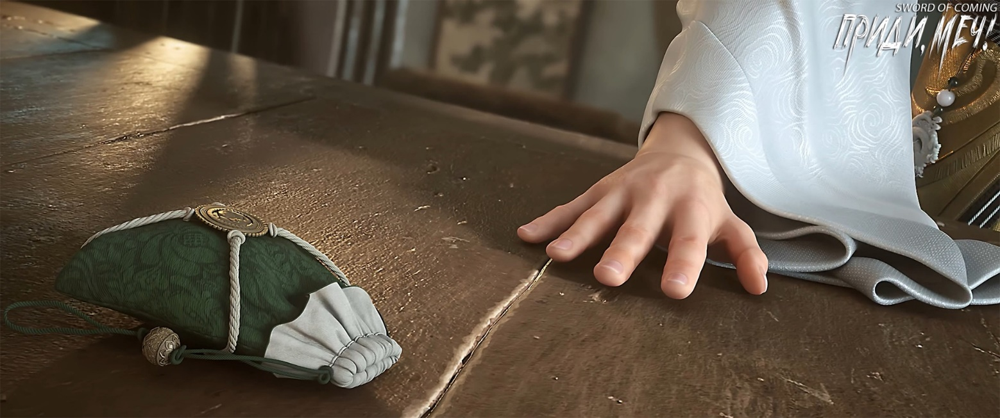
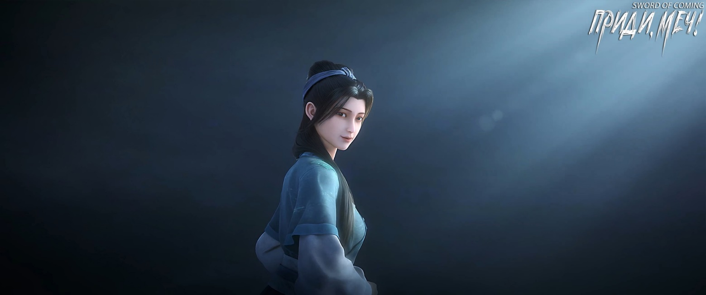
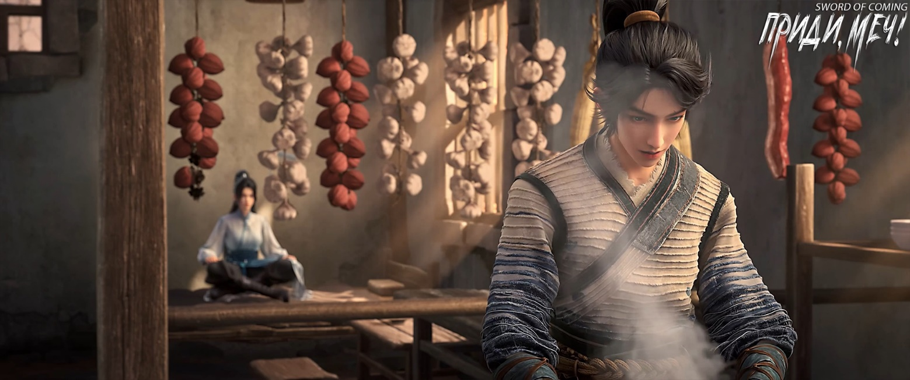

# Глава 17. Если есть несправедливость, то раздается звук

Фу Наньхуа, молодой глава города Старого Города Дракона, сейчас сидел напротив Сун Цзисиня, осторожно держа в руках маленький чайник с надписью «Горный Демон» на дне. Он так внимательно рассматривал гравировку, словно любовался изящным телом несравненной красавицы, не в силах насмотреться. Он разглядывал, поглаживал и дышал на чайник, уже полчаса вертел его так и эдак, не желая выпускать из рук. Есть люди или вещи, которые заставляют влюбиться в них с первого взгляда и вызывают радость в сердце. Для придирчивого Фу Наньхуа этот чайник для успокоения сердца был как раз из таких. Хотя между удачной находкой и ошибкой лишь тонкая грань, Фу Наньхуа был уверен, что в этот раз ему повезло, причем немало. Старый Город Дракона занимал одно из ведущих мест среди многочисленных школ на юге Восточного континента Водолея, поэтому Фу Наньхуа действительно был отпрыском богатой семьи небожителей, видавшим настоящую роскошь. Именно поэтому Цай Цзиньцзянь ранее во всем проявляла слабость.

Сун Цзисинь зевнул, съежился в кресле, устроившись поудобнее, и лениво спросил:

— Брат Фу, раз мы уже подтвердили подлинность вещи, не пора ли нам поговорить о цене?

Фу Наньхуа, которого редко называли братом, подавил легкое чувство дискомфорта в сердце, неохотно отложил чайник «Горный Демон» и с улыбкой сказал:

— Брат Сун, ты наверняка знаешь, насколько я искренен, иначе я бы не был так откровенен и не сказал бы сразу при встрече об истинной ценности этого чайника. Я бы также не мешкал и не показывал бы так прямо свое намерение заполучить этот чайник любой ценой. Все это делается для того, чтобы мы не торговались до бесконечности, впустую тратя время и портя братские чувства. Брат Сун, я, Фу Наньхуа, уже считаю тебя близким другом на будущем пути совершенствования. Сейчас мы можем спокойно вести дела, а сможем ли мы в будущем разделить радости и горести, и даже доверить друг другу свои жизни, зависит от того, насколько уверенно мы сделаем этот первый шаг сегодня.

Сун Цзисинь указал пальцем на этого искреннего молодого господина с высокой заколкой и с улыбкой сказал:

— Брат Фу, я человек очень приземленный, весь пропитан запахом денег. Конечно, я умею заводить друзей. Но когда дело доходит до деловых переговоров, если кто-то начинает говорить мне о братских чувствах, я невольно спрашиваю себя: не будет ли этот человек в будущем, когда ему понадобится апеллировать к братским чувствам, на самом деле в душе подсчитывать выгоду?

Лицо Фу Наньхуа похолодело, он откинулся назад, прислонившись к спинке стула, и легко постукивал пальцем по столу, делая это мягко и беззвучно.

Сун Цзисинь, казалось, не замечал перемены в настроении Фу Наньхуа:

— То, что я назвал тебя братом Фу и показал тебе этот чайник, уже демонстрирует мою искренность. Раз уж мы оба хотим заключить сделку, давай сделаем это быстро и четко. Брат Фу, ты назовешь цену, а я кивну или покачаю головой. У тебя будет две попытки назвать цену. После этого, считай, что упущенного не вернешь. Даже если ты пообещаешь мне горы золота и серебра, извини, брат, но я не продам.

— Тот нефритовый амулет, который я дал тебе ранее, считай подарком при встрече. Он называется «Старый Дракон Проливает Дождь» [1]. Это не какой-то мощный духовный артефакт, он лишь помогает избавиться от летней жары, очистить разум и отвести скверну. Особенно полезен он для медитации и самозабвения. Если использовать его вместе с секретными мантрами, передаваемыми в высших даосских школах, эффект удвоится.

[1] «Старый Дракон Проливает Дождь» (老龙布雨). Это китайское выражение описывает явление, когда дождь идет при ясном небе. В китайской мифологии драконы считались повелителями дождя и воды, поэтому такой природный феномен приписывался действиям древнего дракона.

Фу Наньхуа улыбнулся искренне, без тени высокомерия или снисходительности на лице. Он положил на стол вышитый мешочек и подвинул его ладонью в сторону Сун Цзисиня, торжественно произнеся:

— Эти медные монеты в мешочке называются «деньгами подношения». Это один из видов «денег благовоний» для подношений в мире. Обычно их подносят статуям божеств в храмах Городского Бога или павильонах Вэньчана[2]. Их можно держать во рту, прятать в животе или держать на ладони, и у каждого способа есть свои тонкости и применение. Но это не самое главное. Действительно важно то, что эти монеты, похожие на золотые, на самом деле сделаны из «эссенции золота», которая гораздо ценнее золота. Бессмертные говорили: «Возможно, можно добыть водяной нефрит, но о секретах эссенции золота нельзя говорить» — это как раз об этом. Мешочек с деньгами подношения из эссенции как плата за чайник — не скажу, что этого более чем достаточно, но цена справедливая. Если добавить к этому тот амулет Старого Дракона, я, Фу Наньхуа, осмелюсь сказать, что ты, младший брат Сун, определенно останешься в выигрыше.

[2] Павильон Вэньчан (文昌阁). Вэньчан — божество литературы и образования. Храм Городского Бога (храм Чэнхуана, 城隍庙). Чэнхуан — божество-хранитель города в китайской мифологии.

Закончив эти «искренние» слова, Фу Наньхуа стал спокойно ждать ответа.

Сун Цзисинь помолчал немного, моргнул и спросил:

— Все?

Фу Наньхуа горько усмехнулся:

— Да, это все.

Сун Цзисинь внезапно изменился в лице и хлопнул ладонью по столу:

— Фу, убирайся к чертям собачьим! Ты считаешь меня трехлетним ребенком, которого легко обмануть?! Перед тем, как вы вошли в городок, у вас должно было быть три мешочка с медными монетами. Один мешочек — для оплаты прохода, а затем за каждое приобретенное сокровище, большое или малое, полагается отдавать один мешочек. В мешочке обычно бывает от двадцати до тридцати монет, а в этом твоем тощем кошельке есть ли хотя бы двенадцать?! Вести дела без капли честности и еще пытаться получить удачу из моих рук?

Фу Наньхуа усилил нажим пальца и начал постукивать по столу, постепенно ускоряясь. Сун Цзисинь почувствовал дрожь в груди, и неожиданно ему стало трудно дышать. Его лицо покраснело, а в глазах появились кровяные прожилки. Он поспешно протянул руку и прижал ее к груди. Сердцебиение было таким сильным, словно барабанный бой, бум-бум-бум, как будто оно вот-вот пробьет грудную клетку.

Фу Наньхуа постепенно замедлил темп постукивания пальцем, и цвет лица Сун Цзисиня улучшился. Фу Наньхуа с улыбкой спросил:

— Раз уж первая цена не сошлась, то я назову цену еще раз. Двадцать четыре монеты подношения из эссенции золота. Продашь ли ты чайник «Горный Демон»?

Сун Цзисинь, обливаясь потом, колебался. Видя, что противник что-то предпринимает, он уже собирался попытаться смягчить ситуацию, как молодой господин Старого Города Дракона, привыкший к всеобщему вниманию, снова ускорил темп ударов, словно внезапный летний ливень.

Сун Цзисинь прижал руки к груди, его красивое лицо уже исказилось, в его свирепом выражении промелькнула жестокая усмешка.

Фу Наньхуа едва сдержался, подумав, что лучше было бы забить этого волчонка до смерти, но в последний момент великое искушение подняться на небеса шаг за шагом и достичь бессмертия все же пересилило личную неприязнь, поэтому он прекратил движения пальцами, пощадив Сун Цзисиня.

Сун Цзисинь тяжело дышал, его взгляд горел, он хрипло расхохотался. Фу Наньхуа никак не мог этого понять. В глазах Сун Цзисиня, казалось, не было ненависти, и Фу Наньхуа не счел это чем-то пугающим. На пути совершенствования встречается много странностей и необычных людей, поэтому он лишь с недоумением спросил:

— Над чем ты смеешься?

Дыхание Сун Цзисиня становилось все более ровным и спокойным. Он откинулся на спинку стула, вытер пот со лба и сказал, сверкая глазами:

— Стоит мне только подумать, что в недалеком будущем я тоже буду обладать такими же способностями, как у тебя, убивать людей щелчком пальцев, как сразу же становлюсь безмерно счастливым.

Фу Наньхуа улыбнулся и отбросил все мысли. Сун Цзисинь действительно был человеком, идущим по тому же пути, что и он, и это вызывало у него чувство взаимного восхищения.

С такими людьми легче всего иметь дело, если ты занимаешь более высокое положение, чем они. Но они также могут быть самыми проблематичными, если им удастся взобраться выше тебя…

Однако молодой глава Старого Города Дракона не считал, что после успешного обретения здесь удачной возможности он будет уступать юноше, который до девяти лет так и не смог покинуть маленький городок.

Сун Цзисинь взглянул на маленький чайник на столе и полмешка медных монет, затем поднял голову и сказал:

— Фу Наньхуа, у меня есть два условия. Если ты согласишься, я не только продам тебе чайник, но и предоставлю еще одну старинную вещь, не уступающую ему.

Фу Наньхуа подавил радость в сердце и постарался ответить как можно более равнодушно:

— Говори.

Сун Цзисинь, не ходя вокруг да около, сразу выпалил:

— Во-первых, я хочу, чтобы ты дал мне три мешочка золотых монет вместо двух!

Фу Наньхуа без колебаний ответил:

— Хорошо!

Сун Цзисинь пристально смотрел в глаза собеседнику.

Фу Наньхуа улыбнулся:

— Верить или нет — твое дело. Но прежде чем я уйду сегодня, ты должен показать мне вещь, стоящую два мешочка золота, чтобы я сам мог ее оценить.

Сун Цзисинь кивнул:

— Конечно!

Фу Наньхуа спросил:

— Тогда каково второе условие?

Сун Цзисинь медленно произнес:

— Убей для меня одного человека.

Фу Наньхуа покачал головой:

— Раз ты знаешь, сколько медных монет в мешке, то должен понимать, что мы, «чужаки», не можем здесь убивать по своему усмотрению. Иначе нас немедленно изгонят из городка, возможно даже лишат части «корня и кости». Мудрец с помощью даосских методов отнимет связанные возможности, это будет ужасно, и семья потеряет все шансы в этом месте.

Уголки рта Сун Цзисиня приподнялись:

— Не спеши отказываться. Можешь просто понаблюдать за ситуацией, как тебе?

Фу Наньхуа с улыбкой спросил:

— Мне любопытно, кого ты хочешь убить?

Сун Цзисинь ответил полушутя-полусерьезно:

— Я тоже над этим размышляю.

Фу Наньхуа снова взял маленький чайник, ощущая тонкую текстуру его поверхности, и небрежно сказал:

— Что ж, тогда я буду ждать и смотреть.

За столом напротив Сун Цзисинь машинально потер шею, его лицо было крайне бледным.

※※※※

Ранее Чжигуй проводила Цай Цзиньцзянь до ворот дома семьи Гу, а затем отправилась гулять по улицам. Когда Цай Цзиньцзянь вошла в ворота, она застыла на месте, словно пораженная громом. Глядя на старика, сидящего на длинной скамье, дрожащим голосом спросила:

— Уважаемый, не вы ли тот Истинный Господин, Рассекающий Реку, который тайно совершенствовался на озере Бамбукового Свитка[3]?

[3] П/п.: на самом деле, более дословный перевод — «Озеро Письма, 书简湖». Но в древнем Китае «书简» означало бамбуковые дощечки для письма, которые связывались вместе и скручивались в рулончик, образуя своеобразную «книгу» или «свиток», потому «озеро Бамбукового Свитка».

Старик спросил:

— Как ты узнала меня?

Цай Цзиньцзянь почтительно ответила:

— Младшая Цай Цзиньцзянь с горы Облачной Зари. Десять лет назад я сопровождала отца к озеру Бамбукового Свитка, чтобы увидеть чудесное зрелище появления черепахи, несущей каменную стелу. Мне посчастливилось издалека увидеть ваш благородный облик, и это воспоминание до сих пор свежо в моей памяти.

Старик кивнул:

— Понятно.

Цай Цзиньцзянь с некоторой тяжестью на сердце сказала:

— Истинный Господин, я хотела…

«Сказитель», известный как «Истинный Господин, Рассекающий Реку, мельком взглянул на нее и равнодушно произнес:

— Из уважения к патриарху горы Облачной Зари, я не буду обращать внимания на твой незваный визит, но пусть это будет в последний раз. Выходя со двора, не забудь закрыть дверь.

Цай Цзиньцзянь помолчала мгновение, затем кивнула:

— Младшая удаляется.

Она действительно ушла, не забыв аккуратно закрыть за собой дверь — ее движения были мягкими и безупречными.

Во дворе женщина посмотрела в сторону ворот и обеспокоенно спросила:

— Бессмертный мастер, она не похожа на человека, который так просто сдастся. Не будет ли из-за этого проблем?

Старик, удостоенный почетного титула «Истинный Господин», усмехнулся:

— Войдя в городок, даже вздох или выпущенные газы могут вызвать неприятности. Неужели из-за этого стоит отказываться от возможностей?

Женщина не нашлась, что ответить.

Старик улыбнулся:

— Позволь мне спросить тебя, Гу. Если бы у тебя был выбор, ты бы предпочла, чтобы Гу Цань отправился совершенствоваться на гору Облачной Зари или последовал за мной на озеро Бамбукового Свитка? Не торопись с ответом, — старик жестом остановил женщину, чтобы она не спешила высказываться. Он неторопливо продолжил: — Гора Облачной Зари — это второсортная, низкоуровневая школа на Восточном континенте Водолея. Однако если ты думаешь, что эта гора не стоит внимания, то глубоко ошибаешься.

— Камни Корня Облаков, добываемые на горе Облачной Зари — настоящие сокровища небес и земли. Не только на Восточном континенте Водолея, но и во всем мире они уникальны. Поэтому гора Облачной Зари занимает исключительное положение, и все относятся к ней с уважением, особенно даосская школа Алхимического Котла, которая поддерживает с ней тысячелетние связи. Я же всего лишь один из отшельников озера Бамбукового Свитка, владеющий островом посреди озера. Моих учеников можно пересчитать по пальцам, а слуг — меньше сотни.

Госпожа Гу, женщина средних лет, все еще очаровательная, улыбнулась:

— Разница между мной и той женщиной с горы Облачной Зари такая же, как между ней и вами, бессмертный мастер. Как я могу позволить Гу Цаню отказаться от благословенного места ради следования за той женщиной, чтобы он рылся в грязи в поисках пропитания?

Истинный Господин рассмеялся от души, но вдруг вспомнил кое-что и сказал серьезным тоном:

— Каково происхождение того юноши? Госпожа Гу, расскажи подробнее, на всякий случай.

Госпожа Гу на мгновение замешкалась, поправила прядь волос у виска и тихо сказала:

— Этого бедного мальчика зовут Чэнь Пинъань, его родители выросли в нашем городке. Его мать была моей хорошей подругой, ее внешность была обычной, но у нее был по-настоящему добрый характер. Кажется, я никогда не видела, чтобы она с кем-то ссорилась. Ее муж был некрасив и, честно говоря, не совсем ей подходил, но он был искусным гончаром. Если бы не его ранняя смерть, возможно, через двадцать лет упорного труда он смог бы стать главным мастером большой драконовой печи. Что касается того, как он умер… Одни говорят, что в ту дождливую ночь он боялся, что огонь в печи погаснет, поэтому поспешил в дорогу, поскользнулся, и случайно упал в ручей. Другие утверждают, что он пошел рубить дрова и жечь уголь, и, желая сэкономить, забрел в горы, запретные для входа по императорскому указу, где его утащил в глубь леса дикий зверь. В любом случае, тело так и не нашли. Этот мужчина был молчуном, из которого и палкой слова не выбьешь, но к своему ребенку относился хорошо. Каждый раз, возвращаясь в город, он приносил какие-нибудь подарки: маленький барабан, сахарного Будду, осколки старого фарфора. В целом, до смерти мужчины эта семья из трех человек жила довольно спокойно.

— После смерти отца Чэнь Пинъаня его мать, видимо, заболела душевно. Ее дух быстро ослаб, и без того хрупкое здоровье резко ухудшилось. Меньше чем за год она слегла, исхудав до костей. Мы, старые соседи, видя ее, приходили в ужас, совсем не узнавая в ней ту когда-то красивую и живую девушку. В то время за ней ухаживал маленький Чэнь Пинъань. Такой кроха, а делал все: покупал и варил лекарства, готовил еду. Он был так мал, что ему приходилось вставать на табурет во время готовки. Чтобы сэкономить деньги на лекарства для матери, он собирал легкодоступные травы по всей округе, а излишки продавал в аптеки. Предполагаю, что однажды он по ошибке съел не ту траву. Когда он вернулся в переулок Глиняных Кувшинов с корзиной за спиной, вдруг упал на землю, изо рта пошла пена, он катался по земле. Мы так испугались, думая, что вся семья из трех человек вот так и погибнет. Моя свекровь, которая тогда еще была жива, сказала, что лучше бы вся семья ушла разом, чтобы никто не остался страдать, а в загробном мире они могли бы воссоединиться.

— Позже ребенок каким-то образом выздоровел, пережив эту болезнь, но его мать не смогла пережить ту зиму. Ах да, почтенный даос, Чэнь Пинъань родился пятого числа пятого месяца. Старшее поколение соседей нашего переулка говорит, что это самый неблагоприятный день в году, который легко привлекает нечистые силы и может навлечь беду на семью. А после смерти родителей у мальчика не осталось ни одной медной монеты. Даже те маленькие подарки, которые приносил его отец, он почти все обменял у других детей в городке на еду…

Когда госпожа Гу дошла до этого места, Истинный Господин наконец заговорил:

— Пятого числа пятого месяца? Интересно, позвольте мне подсчитать. Он начал складывать пальцы в мудры, словно манипулируя небом и землей в своих рукавах.

Видя, что госпожа Гу замолчала, Истинный Господин, Рассекающий Реку улыбнулся:

— Продолжайте, пожалуйста.

Госпожа Гу ответила:

— Учитывая многолетнее соседство, мы, жители переулка Глиняных Кувшинов, хотя и опасались приводить Чэнь Пинъаня к себе домой, но время от времени помогали ему, приносили несколько мисок еды. Такое малое мы могли сделать. У всех есть сердце, и, честно говоря, если бы не его день рождения, который всех пугал, никто бы не смог не сочувствовать этому понятливому ребенку. Конечно, надо признать, что среди соседей были и недобросовестные люди, которые любили намеренно унижать мальчика, из-за чего ему в конце концов пришлось стать учеником гончара. Нужно знать, что перед смертью его мать взяла с него обещание, что в будущем он ни за что не пойдет работать в драконову печь, даже если придется стать нищим. Такой послушный и почтительный ребенок мог нарушить клятву только из-за чего-то очень серьезного.

Истинный Господин спросил:

— Ты знаешь имена родителей Чэнь Пинъаня и их даты рождения?

Госпожа Гу сказала, что знает только имена, но никто не знал точных дат рождения. Истинный Господин, Рассекающий Реку сказал, что это не имеет значения. Через некоторое время он холодно усмехнулся:

— Жалкие трюки, дьявольские уловки!

Госпожа Гу была в замешательстве.

Истинный Господин, Рассекающий Реку объяснил:

— Тот мужчина умер насильственной смертью, скорее всего, случайно узнав секрет городка. К сожалению, его удача была намного хуже, чем у вашей семьи, а благословение предков и подавно не сравнится с вашим. В конце концов, ради безопасности своего сына, мужчина тайно разбил тот самый фарфоровый сосуд, связанный с судьбой мальчишки. Таким образом, какая-то школа за пределами городка осталась ни с чем, а это большие вложения. Простой гончар никак не мог их возместить, поэтому ему пришлось расплатиться своей жизнью, и одной жизни оказалось недостаточно, так что добавили жизнь его жены. Смешно сказать, видимо, смерть этого гончара показалась кому-то слишком легкой, и они не хотели тратить лишние усилия, поэтому магия сокрытия, использованная для обмана, оказалась настолько примитивной, что это выглядит просто несерьезно.

Лицо госпожи Гу помрачнело.

Истинный Господин сразу же прочел мысли госпожи Гу и с улыбкой спросил:

— Что, чувствуете вину и сожаление?

Госпожа Гу горько усмехнулась:

— Да, я чувствую вину, в конце концов, я видела, как рос этот ребенок, так что оно определенно есть. Но сожаления? Ни в коем случае!

Истинный Господин, Рассекающий Реку кивнул:

— Я вижу.

Госпожа Гу пробормотала про себя:

— Если бы мать Чэнь Пинъаня оказалась на моем месте, я верю, что она поступила бы так же.

Истинный Господин, Рассекающий Реку покачал головой:

— В этом я не уверен.

Госпожа Гу вдруг громко сказала:

— Она точно так бы и сделала!

Истинный Господин не рассердился на ее грубость, лишь вздохнул:

— Родительское сердце достойно сочувствия во всем мире.

※※※※

Чэнь Пинъань сел на пороге:

— Юная госпожа Нин, могу я спросить тебя кое о чем?

Нин Яо прислонилась спиной к стене, сидя со скрещенными ногами и положив узкий меч в зеленых ножнах на колени:

— Конечно. Но если это касается секретов или личной жизни, я не отвечу.

Чэнь Пинъань спросил:

— Когда вы приходите сюда, как долго обычно остаетесь, прежде чем уйти?

Нин Яо нахмурилась:

— Нельзя сказать точно. Некоторым везет, они могут прийти и уйти в тот же день. Другим не везет, и они остаются здесь на всю жизнь. Если ты настаиваешь, чтобы я сделала предположение, я могу, но оно может быть неточным, так что сам решай, как с ним поступить. Две группы — богатые дураки с кучей денег, они явно не из тех, кто может быстро уйти, они пробудут в городке как минимум несколько дней. Тот молодой господин в высокой заколке и с нефритовой подвеской, вероятно, будет более удачлив. Есть один глупый верзила, который одержим идеей разобраться с тем колодцем. Теперь остается только посмотреть, позволит ли Небесный Владыка ему съесть эту чашу риса[4].

[4] П/п.: речь о том, что дальнейшая судьба человека зависит от высших сил или удачи.

Чэнь Пинъань спросил:

— А как насчет еще одного человека?

— Кого?

— Той высокой молодой женщины.

— Она тебе нравится?

Чэнь Пинъань у дверей усмехнулся, явно не воспринимая вопрос всерьез.

Нин Яо, похоже, тоже почувствовала, что пошутила неудачно, и ее выражение стало серьезным:

— Вообще-то я слышала твой разговор с даосом Лу. У тебя с ней какие-то счеты, поэтому ты хочешь… отомстить?

Она вздохнула:

— Позволь дать тебе совет: такие люди, как вы, находящиеся на середине горы, в глазах тех, кто на вершине, на самом деле ничем не отличаются от тех, кто у подножия. Дело не в том, что они слишком высокомерны или считают себя лучше других, а в том, что они действительно имеют право смотреть на вас свысока. После прибытия в это место, где царит «упадок Дхармы"[5], не говоря уже о девушке с горы Облачной Зари, даже тот ребенок в ярко-красном халате может одним ударом в грудь заставить тебя выплюнуть целую чашу крови. И наоборот, если бы кто-то изо всех сил ударил его, нельзя сказать, что это для него лишь щекотка, но самое большее, это заставит его почувствовать стеснение в груди или небольшое удушье, но определенно не повредит внутренние органы. Что касается причины, то ее трудно объяснить, главным образом потому, что я не очень хороша в этом

[5] «末法之地» — это буддийский термин, обозначающий эпоху или место, где учение Будды (дхарма) находится в упадке или близко к исчезновению.

Чэнь Пинъань стоял спиной к дому, глядя на дверной проем, и сказал:

— Я хочу знать, почему она захотела убить меня, ведь мы встретились впервые.

Нин Яо долго подбирала слова, прежде чем заговорить:

— Она не обязательно из тех, кто убивает невинных людей без разбора. Как бы это сказать… на пути совершенствования, карабкаясь по горам и переправляясь через реки, дорога то широкая, то узкая, это то солнечный путь, то бревно через ущелье. Если идешь быстро, можешь случайно раздавить муравья, а проголодавшись, поймать несколько рыб из ручья. Когда достигаешь некоторых успехов в методах Дао и свободно применяешь их, можешь случайно убить птиц, змей или мышей. Все это возможно. Я не очень хорошо объясняю, но ты понимаешь, что я имею в виду?

Чэнь Пинъань промычал в знак согласия:

— В общих чертах понял.

Затем он немного помрачнел и снова посмотрел на вход во двор. На самом деле он ничего не понял, не понимал, почему эти люди могут так пренебрегать жизнями других.

Спустя долгое время Чэнь Пинъань повернулся и с улыбкой сказал:

— Если ты не возражаешь, можешь оставаться здесь. Если что-нибудь понадобится, просто скажи.

— А ты?

— Я знаю одного человека, эти пару дней поживу у него. Не беспокойся, его зовут Лю Сяньян, он мой… друг. Хороший друг!

Нин Яо, глядя на худощавую фигуру на пороге, улыбнулась:

— Спасибо!

Чэнь Пинъань ухмыльнулся, почесал голову и не стал говорить никаких любезностей. Поколебавшись мгновение, он наконец набрался смелости и снова повернулся:

— Юная госпожа Нин, если однажды я не вернусь, передай, пожалуйста, мой мешочек с золотыми-медными монетами Лю Сяньяну. Пусть в будущем он присматривает за этим домом вместо меня. Не нужно даже убираться, просто иногда ремонтировать, добавлять новую черепицу, чтобы не протекала крыша.

— И еще, чтобы стены не рушились, а ворота не слишком обветшали. Если бы можно было в канун Нового года наклеить изображения духов-хранителей ворот и парные надписи с новогодними пожеланиями, было бы замечательно! Но если это слишком хлопотно, можно и не делать.

Нин Яо заметила, как в глазах Чэнь Пинъаня блеснул необычный свет, когда он говорил о духах-хранителях ворот и новогодних надписях.

Было очевидно, что этот сирота из переулка Глиняных Кувшинов уже много лет мечтал о том, чтобы в новогодние праздники на воротах его дома были изображения духов-хранителей, а на притолоке — иероглиф «весна». Сколько лет прошло после смерти родителей, столько лет он об этом мечтал.

Поэтому, когда этот беззаботный юноша, не обремененный ни привязанностями, ни душевными терзаниями, тихо выдохнул, похлопал себя по коленям и медленно встал, меч в ножнах, лежавший на столе в комнате, внезапно издал пронзительный звук.

※※※※

П/п.: Хочется добавить небольшое пояснение к последнему абзацу и его связью с названием главы. Идиому «Если есть несправедливость, то раздается звук, 不平则鸣» в названии довольно трудно перевести на русский. Ближайшая интерпретация «если есть несправедливость, то будет протест» или «кричать от несправедливости». Ключевое слово здесь — «鸣», которое означает «издавать звук», «кричать» или «высказываться». Оно не обязательно подразумевает плач в буквальном смысле, а скорее указывает на выражение недовольства или несогласия через слова или действия. Эта фраза часто используется для описания ситуации, когда невозможно промолчать, сталкиваясь с несправедливостью или неправильным обращением. Именно поэтому меч зазвенел после всего, что случилось с Чэнь Пинъанем.