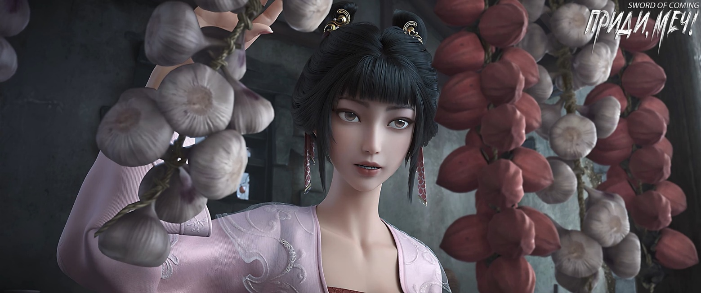
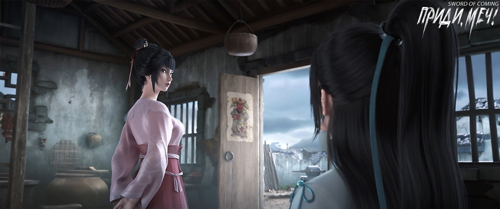
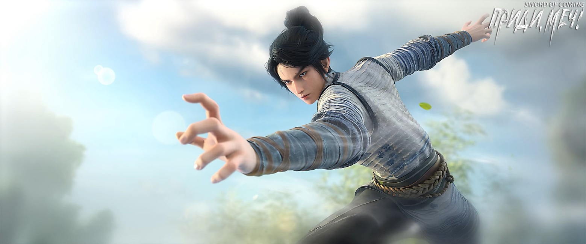

# Глава 19. Великое Дао

П/п.: «大道» — это важное понятие в китайской философии, особенно в даосизме. Оно может быть переведено как «великий путь», «великое Дао» или «великий принцип». Это понятие обозначает фундаментальный принцип, лежащий в основе вселенной, природы и человеческого существования. В зависимости от контекста, оно может также означать правильный образ жизни или высшую истину.

※※※※

Когда Чэнь Пинъань уже собирался выбежать со двора, Нин Яо внезапно крикнула:

— Подожди, мне нужно кое-что тебе сказать.

Чэнь Пинъань притворился, что не услышал, и когда он уже хотел открыть ворота, Нин Яо повысила голос:

— Чэнь Пинъань!

Ему пришлось повернуться и подбежать обратно к порогу. Лицо Нин Яо стало немного румянее, чем раньше, но голос все еще был немного хриплым. Она сказала:

— Во-первых, когда мы, чужаки, прибываем в этот городок, хотя, как я говорила тебе раньше, наши тела сильнее обычных людей, но кроме этого, мы теперь ничем не отличаемся от вас. Во-вторых, чужакам нельзя здесь убивать, если кто-то нарушит это правило, независимо от причины, его изгонят, и он гарантированно останется ни с чем. Эта цена очень высока, выше, чем ты можешь себе представить. В-третьих, ты должен понимать, что мы, чужаки, в критический момент, даже если придется уйти с пустыми руками, обязательно будем действовать, ведь возможность выжить — это самое главное.

Чэнь Пинъань подумал и спросил:

— Значит ли это, что когда нужно что-то сделать, нужно действовать быстро?

Нин Яо широко улыбнулась, ее глаза сияли, казалось, будто весь дом стал ярче от ее взгляда. Она похлопала по зеленым ножнам, лежащим на ее коленях, и кивнула:

— Верно! Действовать нужно быстро, еще быстрее, даже максимально быстро! Например, я ношу и меч, и клинок, и я стремлюсь стать самым быстрым человеком в мире, как в обнажении клинка, так и в выхватывании меча!

Она сделала паузу и вдруг из отважной воительницы из далеких краев превратилась в хвастливую девушку-соседку. Прищурившись, она с улыбкой спросила:

— Эй, а ты знаешь, сколько всего миров существует?

Чэнь Пинъань выглядел совершенно растерянным.

Нин Яо, похоже, заметила его незаинтересованность и тоже сразу потеряла интерес. Она махнула рукой, прогоняя его:

— Лучше купи кувшин, я жду, чтобы выпить лекарство.

На этот раз Чэнь Пинъань покинул двор более медленными и уверенными шагами.

Вскоре после того, как он покинул переулок Глиняных Кувшинов, незапертые ворота двора тихонько открылись. Нин Яо, находившаяся в доме, открыла глаза. Она только что практиковала странный метод дыхания. Сейчас она смотрела в сторону двери, готовая встретить врага.

Летающий меч в белоснежных ножнах на столе внезапно затих, но в воздухе появилось ощущение смертельной опасности, словно весенний холод, способный заморозить кости и убить человека.

Служанка Чжигуй неторопливо подошла к двери, как обычная соседка, заглядывающая в гости. Она не переступила порог, а лишь заглянула внутрь, осматриваясь по сторонам, и словно не замечая Нин Яо, сидящую на кровати с клинком на коленях.

Чжигуй долго осматривалась, прежде чем наконец заметить живого человека, и с невинным выражением лица спросила:

— Сестрица, кто ты? Почему сидишь на кровати Чэнь Пинъаня? Я не слышала, чтобы у него были дальние родственники.

Нин Яо взглянула на незваную гостью и закрыла глаза, игнорируя ее.

Увидев, что та притворяется глухонемой, Чжигуй не рассердилась, а лишь слегка покачала головой и скривила губы с выражением неодобрения.

Чжигуй взглянула на длинный меч в снежно-белых ножнах на столе: в глубине ее глаз скрывались крайняя ненависть и страх, а в зрачках едва заметно бешено метались золотые нити.

Она немного колебалась, затем подняла ногу, собираясь переступить порог, но вдруг отдернула ее, кашлянула и притворно сказала:

— Я захожу, хорошо? Если ты ничего не говоришь, значит, не возражаешь, верно? В конце концов, это дом Чэнь Пинъаня, я знаю его уже много лет… Ты ведь понимаешь, что я говорю? Ничего страшного, нам все равно не о чем особо разговаривать. Я просто пришла посмотреть, не нужно ли здесь чего-нибудь. Мы скоро переезжаем, и многие вещи можем оставить Чэнь Пинъаню. Ты не знаешь, как тяжело ему жилось все эти годы.

Ее болтовня и забота о Чэнь Пинъане создавали впечатление, будто они были друзьями детства.

После того как Чжигуй вошла в комнату, все осталось спокойным. Она направилась прямо к маленькому столу, села на стул, краем глаза постоянно поглядывая на меч.

В то же время Нин Яо достала три листа бумаги, оставленные Лу Чэнем для Чэнь Пинъаня, и внимательно их изучала, пытаясь найти в них какой-то смысл. К сожалению, даже после двух тщательных прочтений она не смогла ничего понять и разочарованно сказала:

— Эти иероглифы написаны совершенно без… вкуса.

Она ясно помнила, что на длинной стене ее родного города было восемнадцать иероглифов, вырезанных мечом. Каждый иероглиф содержал в себе могучую силу, способную усмирить десять тысяч демонов.

В детстве ее самым большим увлечением было стоять внутри одного из штрихов этих больших иероглифов и смотреть вдаль. Поэтому четыре иероглифа на арке городка «Ци, достигающая созвездия Северного Ковша» ее совершенно не впечатлили.

Чжигуй повернулась, тайком выпрямила тонкую талию и положила руки на колени, видимо, стараясь выглядеть более похожей на благородную даму. Глядя на Нин Яо, она нежно сказала с улыбкой:

— Ай-яй-яй, юная госпожа, ты такая невнимательная.

Нин Яо не удержалась и спросила:

— Ты кто?

Чжигуй воскликнула:

— Ой! и приложила руку к груди, притворно удивившись: — Юная госпожа, вы говорите на нашем местном диалекте?

Нин Яо снова спросила:

— У тебя дело?

Чжигуй указала на длинный меч на столе:

— Твой?

Нин Яо нахмурилась и ничего не сказала.

Видя, что Нин Яо не отвечает, Чжигуй не придала этому значения. Она встала и подошла к углу комнаты, внимательно рассматривая горшки и кувшины на деревянных полках. Эта служанка очень тщательно изучала эти недорогие пожитки.

Когда Чэнь Пинъань был учеником гончара, он босиком обошел все горы и реки вокруг городка. Он в одиночку ходил в горы копать глину и рубить дрова, быстро поднимаясь и спускаясь. Если кто-то был готов научить его чему-нибудь, будь то простые азы или сложные навыки, он прилагал все усилия, чтобы освоить это, не заботясь о том, насколько хорошо у него получится в итоге. Когда старик Яо учил его гончарному мастерству, он всегда был скуп на знания и никогда не хотел раскрывать свои настоящие секреты, но Чэнь Пинъань с особой тщательностью выполнял все, что старик Яо говорил или показывал. Позже, когда Лю Сяньян учил его делать деревянные луки и удочки, он также учился очень старательно. Сосед Сун Цзисинь, известный своими едкими замечаниями, говорил, что такая привычка Чэнь Пинъаня, согласно книгам, называется «делать все возможное и принимать судьбу». Но, к сожалению, у Чэнь Пинъаня не было хорошей судьбы, и поэтому, по мнению Сун Цзисиня, ему лучше было бы просто плыть по течению и не стараться.

Чжигуй помахала рукой и с сияющей улыбкой сказала:

— Ну, я пошла. Юная госпожа, выздоравливайте. Если что-то понадобится, просто позовите. Меня зовут Чжигуй, я живу в соседнем дворе.

Лицо Нин Яо оставалось бесстрастным.

Чжигуй вышла из дома и, оказавшись во дворе, пробормотала так, чтобы Нин Яо внутри как раз могла услышать:

— Да не такая она и красивая.

Нин Яо тоже как бы невзначай тихо произнесла:

— Какое вульгарное имя.

Закрывая ворота, Чжигуй приложила немного больше силы, отчего они громко хлопнули.

Нин Яо снова закрыла глаза, чтобы восстановить свою духовную энергию.

Визит странной девушки не вызвал у нее никаких эмоций.

Однако ей действительно очень не нравился этот городок, особенно те практикующие, которые пришли сюда в поисках возможностей. Они плели интриги, вели себя низко и подло. Хотя их называли бессмертными и великими людьми, это было лишь потому, что они стояли на вершине горы, а не из-за их собственного величия.

В сердце Нин Яо великое Дао не должно быть таким мелочным.

※※※※

Выйдя из переулка Глиняных Кувшинов, Чэнь Пинъань прищурился от яркого солнца. Он поднял правую руку, чтобы прикрыть лоб, и легко выдохнул. Затем он начал медленно бежать, его шаги были легкими. Несмотря на то, что он уже много раз пробегал по улицам и переулкам, он совсем не устал. Для человека, привыкшего к горам и рекам, такое расстояние было пустяком. По-настоящему трудным делом было подниматься в горы для обжига угля. Одна драконова печь ежегодно требовала двадцать-тридцать тысяч цзиней[1] древесного угля. Особенно тяжело приходилось в дождливые дни, когда приходилось жить в горах, рубить дрова и жечь уголь. Однажды он чуть не погиб при обрушении строящейся угольной печи. Почти вся работа, которую Чэнь Пинъань выполнял все эти годы, была физической. Требовалось немного мастерства, но после освоения основ все зависело только от силы. Поэтому его внешняя худоба и слабость были лишь видимостью — на самом деле он обладал внутренней закалкой, прошедшей через множество испытаний.

[1] Цзинь — мера веса, равна 0,5кг.

Одна его рука все время была сжата в кулак, а другой он затягивал соломенные сандалии.

В этот момент его сердце было спокойным, как вода. Он только немного скучал по своему единственному другу, Лю Сяньяну.

Этот парень однажды таинственно похвастался Чэнь Пинъаню, рассказав историю, которую слышал от своего деда. В детстве его дед якобы видел своими глазами, как кто-то стоял на берегу ручья, пробежал несколько шагов и одним прыжком перепрыгнул через весь ручей. Позже Лю Сяньян и Чэнь Пинъань попытались повторить это. Они выбрали самое узкое место ручья, отошли назад для разбега и одновременно прыгнули. В результате Лю Сяньян, который был на несколько лет старше Чэнь Пинъаня, быстро потерял силы после прыжка и упал в воду. Затем он увидел над головой темную тень, которая стремительно пронеслась вперед и приземлилась далеко на другом берегу. После этого случая Лю Сяньян больше никогда не упоминал о чудесных людях, способных перепрыгнуть ручей одним шагом.

Позже Лю Сяньян узнал, что Чэнь Пинъань часто ходил к ручью один, разбегался, прыгал и падал. С каждым разом Чэнь Пинъань все ближе подбирался к противоположному берегу, не теряя энтузиазма.

Однажды, не удержавшись, Лю Сяньян тайно наблюдал за ним издалека. Увидев это захватывающее зрелище, он понял, что смуглый юноша, которого он видел, сильно отличался от того простака, каким он его представлял.

Когда Чэнь Пинъань перепрыгивал через ручей, он был похож на ястреба-змееяда, часто парящего в небе над городком.

