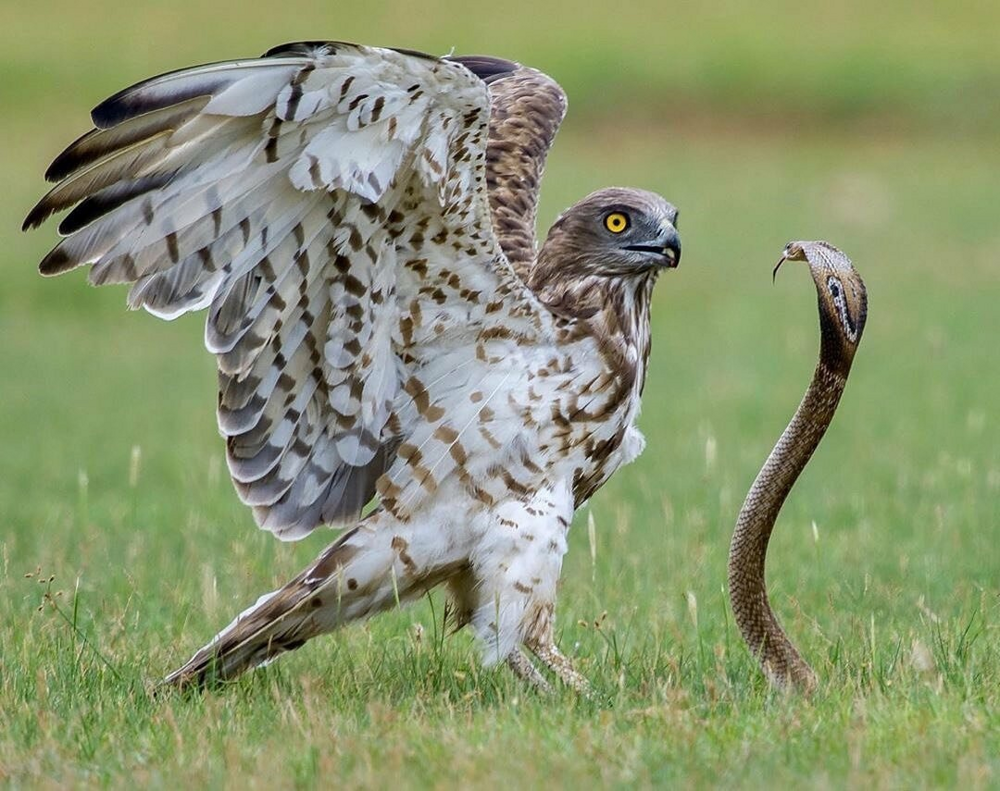
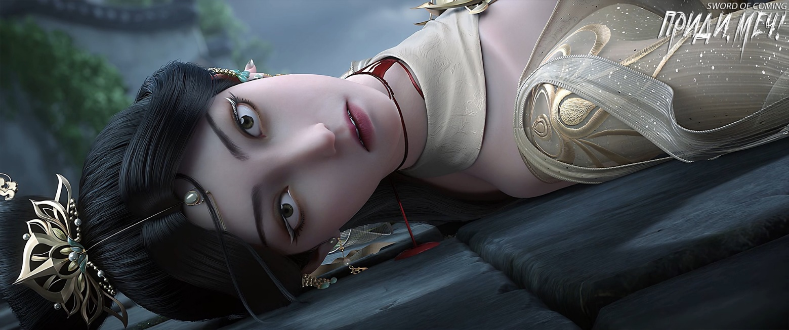
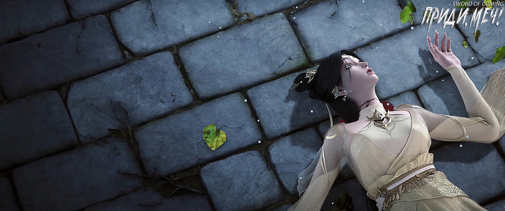
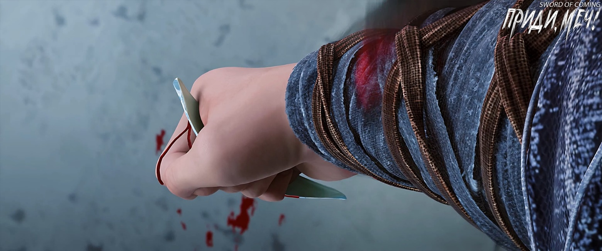
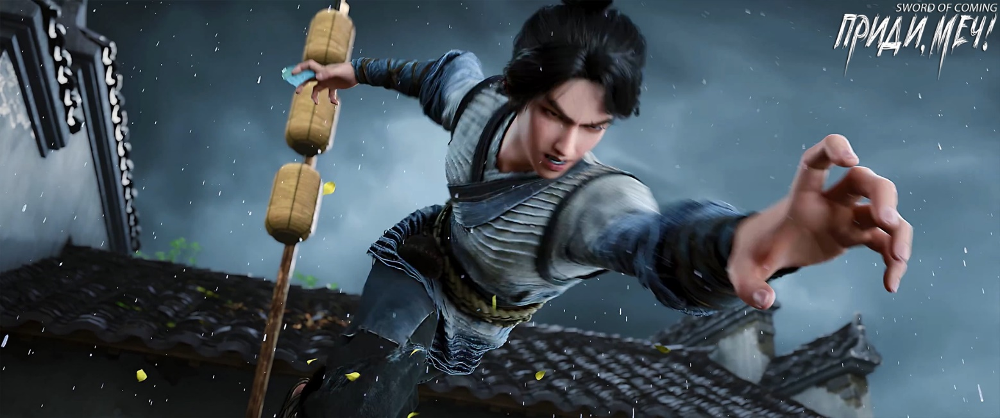

# Глава 21. Змееяд

П/п.: Змееяд — редкая хищная птица семейства ястребиных.

※※※※

Фу Наньхуа пришел в себя и осмотрелся вокруг, не упуская из виду даже крыши переулков. Не заметив ничего необычного, он быстро глубоко вздохнул, не делая шагов ни вперед, ни назад. Он снова машинально потянулся к нефритовому амулету, передававшемуся из поколения в поколение, но, не обнаружив его, поспешно прочитал про себя отрывок даосского заклинания. Это заклинание не было духовным искусством, а лишь помогало успокоить разум и сконцентрировать энергию. Если сравнить состояние ума с лодкой на озере, то это заклинание было якорем.

Он начал боком двигаться к стене, затем перешел на перекресток двух переулков. Его мышцы напряглись, он принял оборонительную позу, не осмеливаясь терять бдительность, и пристально смотрел в тот переулок. Он увидел юношу в соломенных сандалиях, стоящего рядом с лежащим в луже крови телом Цай Цзиньцзянь. Юноша слегка наклонился, сохраняя тонкую наступательную позицию, и также пристально смотрел на Фу Наньхуа. Они противостояли друг другу, как тигр и волк, один — чтобы разрешить загадку, другой — чтобы выжить, каждый по-своему. Внезапно появившийся юноша, казалось, был нацелен только на Цай Цзиньцзянь. Его поза, которую он инстинктивно принял при появлении Фу Наньхуа, скорее означала «если ты не тронешь меня, я не трону тебя».

Фу Наньхуа задал совершенно лишний вопрос:

— Ты убил ее?

Юноша молчал, продолжая сжимать орудие убийства — осколок фарфора, чуть меньше его ладони, но та часть, что выступала из кулака, была крайне острой. Его руки были все в крови, и было неясно, была ли это кровь Цай Цзиньцзянь или результат того, что осколок порезал его ладонь. Капли падали на землю переулка. Убедившись, что вокруг больше никого нет, Фу Наньхуа почувствовал одновременно и нелепость происходящего, и облегчение. Наконец он перевел взгляд на изящное тело Цай Цзиньцзянь — даже в таком жалком состоянии ее природная красота и грациозность оставались неизменными. Ее пышная грудь слегка вздымалась, алая кровь продолжала течь из шеи и рта, жизнь вот-вот должна была окончательно покинуть ее, но тело, закаленное многократной тренировкой ци, заставляло ее испытывать боль куда более сильную и продолжительную, чем у обычного человека.

На лице Фу Наньхуа появилась улыбка, хотя в глубине души таилась суровая холодность, и он спросил:

— Почему ты убил ее? У тебя не было вражды с этой старшей сестрой. Неужели только из-за того, что она пошутила над тобой в переулке Глиняных Кувшинов, ты решил убить? Когда это в нашем городке стало твориться такое беззаконие? Знаешь ли ты, что за убийство платят жизнью, а долги возвращают деньгами — это правило действует везде?

Юноша молчал, как немой. Фу Наньхуа не обращал внимания на его мысли и начал медленно двигаться вперед уверенным шагом.

Фу Наньхуа знал, что Цай Цзиньцзянь определенно мертва. Это место не было горой Облачной Зари, окутанной божественной атмосферой. Здесь магия была запрещена законами природы. Только если появится земной бессмертный с безграничным совершенствованием или архат с золотым телом, готовый отдать большую часть своего совершенствования, чтобы спасти ее жизнь, тогда, возможно, удастся удержать ее душу и вернуть к жизни. К сожалению, у Цай Цзиньцзянь не было такой удачи. Мудрец в городке, обремененный важной миссией и заботой о всех живых существах, не станет вмешиваться, а лишь будет следовать естественному ходу событий.

На пути совершенствования случается, что кто-то бессмысленно умирает на большой дороге или погибает на узком мосту, борясь за мимолетную возможность. Хотя такое случается не слишком часто, но и не является редкостью. Если бы достижение бессмертия означало, что все идет постепенно, шаг за шагом, без бедствий и несчастий, наслаждаясь всеми благами без риска, тогда беззаботные бессмертные в глазах простых людей стоили бы слишком дешево.

Поэтому, хотя Фу Наньхуа и был готов к смертельной схватке во время своего визита в городок, для младшего господина Старого Города Дракона это был первый раз, когда он своими глазами увидел, как его временную союзницу, шедшую рядом с ним, убили с молниеносной скоростью прямо под носом у местного мудреца. Не было ни ослепительного обмена духовными сокровищами, ни потрясающих небо и землю бессмертных техник — ее просто убил самый низкий деревенский простолюдин? Помимо потрясения, Фу Наньхуа просто не мог принять этот абсурдный факт. Если бы не этот городок, то для такой ничтожной личности, как этот юноша в соломенных сандалиях, чья жизнь дешевле полевой травы, даже мельком увидеть Цай Цзиньцзянь с горы Облачной Зари было бы недостижимой мечтой.

Лицо Фу Наньхуа стало торжественным, и он мрачно произнес:

— Хотя я и не успел спасти бессмертную Цай, и не могу убить тебя, чтобы отомстить за нее. Но раз я своими глазами видел твое злодеяние, то не могу ничего не предпринять. Если это разнесется, то репутация Старого Города Дракона будет разрушена. Поэтому, по всем правилам, я должен преподать тебе урок. А как потом гора Облачной Зари будет разбираться с этим и как воздаст справедливость за бессмертную Цай — это уже твои проблемы.

Эти высокопарные слова молодого господина Старого Города Дракона были сказаны для мудреца этого мира. Это были лишь любезности, чтобы не выглядеть слишком жадным и не вызвать неприязнь мудреца. Возможно, в будущем эти слова также предназначались для группы патриархов с горы Облачной Зари. Фу Наньхуа просто хотел показать свою добродетель на публике. В противном случае, он, уже давно намеревавшийся убить Цай Цзиньцзянь, действительно хотел бы хорошо отблагодарить юношу перед ним. Тот по неосторожности, действуя опрометчиво, сэкономил ему много хлопот, и его можно было бы назвать его собственным счастливым генералом.

Фу Наньхуа, продвигаясь вперед, сказал:

— Судя по тому, как ты только что убивал, это означает, что мгновенная взрывная сила твоего презренного тела немало превосходит обычных крепких мужчин, что на самом деле довольно редко. Если бы не сегодняшний инцидент, тебе нужно было бы только иметь возможность вступить в армию, быть готовым убивать и сражаться, а затем, с некоторой удачей, получить благосклонность какого-нибудь великого военачальника или полководца из семьи с военными традициями. Если бы он дал тебе военный метод закалки тела и тайную технику, и ты бы постепенно тренировал свое тело, через двадцать-тридцать лет ты, парень, возможно, открыл бы для себя новый мир.

Когда Фу Наньхуа шагнул вперед, юноша начал медленно отступать, не сводя с него глаз. Стройный Фу Наньхуа шел по переулку, изящный, словно нефритовое дерево на ветру, излучая природную элегантность и благородство.

Фу Наньхуа протянул руку ладонью вниз на уровне талии и с улыбкой сказал:

— Какая жалость. Тебе не повезло с судьбой, иначе, следуя моим словам, ты бы имел шанс достичь таких высот… что невозможно.

Фу Наньхуа развеселился от собственной шутки, его улыбка стала шире, и когда он сделал шаг вперед, его нога вдруг зависла в ладони от земли:

— Прошу прощения, вот такой высоты — правильнее будет.

Фу Наньхуа было трудно не радоваться. После входа в городок сначала была сделка с Сун Цзисинем, прибыль от которой превзошла все ожидания. Затем Цай Цзиньцзянь, которая вполне могла стать препятствием на его Великом Пути, внезапно погибла прямо на его глазах. При этом его руки остались чистыми от крови, и он мог безвозмездно получить два ее мешочка с монетами из эссенции золота, а возможно, найти одно или два секретных сокровища горы Облачной Зари. Даже если это не главные сокровища горы, они все равно должны быть весьма ценными — он не верил, что у Цай Цзиньцзянь не было при себе защитных талисманов. Например, у него, помимо подвески «Старый Дракон Проливает Дождь», которая была лишь для отвода глаз, были еще две небольшие вещицы превосходного качества и высокого ранга, практически лучшие сокровища Старого Города Дракона. Поэтому среди совершенствующихся, идущих окольными путями, была распространена поговорка: «Тот, кто собирает трупы за других, непременно получит хорошую награду» [1].

[1] 替人收尸，必有好报. «Собирать трупы за других» может означать присвоение себе чужих достижений, идей или результатов работы, особенно после того, как основная трудная часть уже выполнена другими. Грубо говоря, мародерство, когда человек наживается на чужих потерях или трудностях. Фраза «непременно будет хорошее воздаяние» в данном случае используется саркастически, намекая на то, что человек, занимающийся таким неэтичным поведением, получит незаслуженную выгоду или признание. Таким образом, эта идиома критикует оппортунистическое и корыстное поведение, когда люди присваивают себе чужие заслуги или наживаются на чужих несчастьях.

Фу Наньхуа, проходя мимо тела Цай Цзиньцзянь, даже не взглянул на нее. Однако легкий запах крови привел его в состояние необъяснимого возбуждения.

Шаг вперед, шаг назад, двое всегда находились на расстоянии более десяти шагов друг от друга.

Фу Наньхуа нужно было только убедиться, что юноша не сможет убежать из переулка, иначе в будущем поймать того, кто родился и вырос здесь, будет все равно, что искать иголку в стоге сена. К тому же теплое тело красавицы позади него было предостережением. Если дать юноше достаточно времени, чтобы отдышаться, «подарочек» мог обрушиться на его собственную голову.

Казалось, что Фу Наньхуа играл с юношей, как кошка с мышью, но на самом деле он настраивал ритм своего тела. Ведь с тех пор, как он в девять лет официально встал на путь совершенствования, у него не было возможности определить победителя в чисто рукопашной схватке.

Конечно, ему не нужно биться насмерть, это было бы невыгодно. Вместе с Цай Цзиньцзянь это были две легко достижимые возможности. Но необходимо было заставить этого неожиданного юношу спокойно лежать в постели в ближайшее время, не давая ему ни малейшей возможности устроить какие-либо проблемы.

Фу Наньхуа внезапно с улыбкой спросил:

— Кстати, как тебя зовут?

Юноша с руками, покрытыми непрерывно текущей кровью, ответил невпопад. На его смуглом лице отразилась стойкость, подобная дикой траве:

— Вы оба, возможно, не знаете, но у меня очень хорошее зрение. Поэтому в переулке Глиняных Кувшинов, когда она разговаривала со мной, ты смотрел на нее так само, как и на меня сейчас.

Фу Наньхуа на мгновение растерялся, теперь он действительно посмотрел на юношу по-новому и, цокая языком, сказал:

— Интересно, очень интересно.

Хотя поведение Фу Наньхуа казалось беззаботным, на самом деле он все время обращал внимание на то, что левая рука юноши продолжала кровоточить. Это означало, что юноша не ослаблял хватку. Обычный человек, вероятно, давно бы не выдержал такой пронизывающей боли.

Только теперь Фу Наньхуа понял, что его ранее брошенное вскользь замечание «какая жалость» оказалось на самом деле очень точным.

Решил, что время пришло, он задал последний интересующий его вопрос:

— Ты убил ее так решительно, определенно кто-то проинструктировал тебя заранее. Меня не интересует личность этого человека, но я не могу понять: как ты, ребенок, выросший здесь, так быстро преодолел этот внутренний барьер и убил человека так… спокойно? Понимаешь, о чем я? Знаешь, даже я после своего первого убийства, когда спало возбуждение, начал дрожать всем телом, и только после долгого чтения мантры успокоения сердца мне стало легче. А ты? Такой спокойный, будто поел или воды попил, это неправильно…

Юноша, до этого момента сохранявший безучастное выражение лица, вдруг посмотрел с ужасом и паникой куда-то за спину Фу Наньхуа, словно мертвая Цай Цзиньцзянь вернулась к жизни.

Осторожный Фу Наньхуа инстинктивно повернул голову. Когда его шея повернулась наполовину, его сердце сильно забилось. Когда он повернулся обратно, из-за большой разницы в росте в поле зрения Фу Наньхуа, направленном вперед и вниз, юноши уже не было!

Это был критический момент.

Оказалось, что после того, как юноша изобразил тот взгляд и выражение лица, он, ни секунды не колеблясь, начал стремительный рывок. После трех шагов он резко оттолкнулся левой ногой и высоко подпрыгнул. Затем, оттолкнувшись правой ногой от стены переулка, он молниеносно изменил направление и высоко поднял левую руку в сторону Фу Наньхуа…

Юноша действительно был похож на ястреба, охотящегося на змею.

