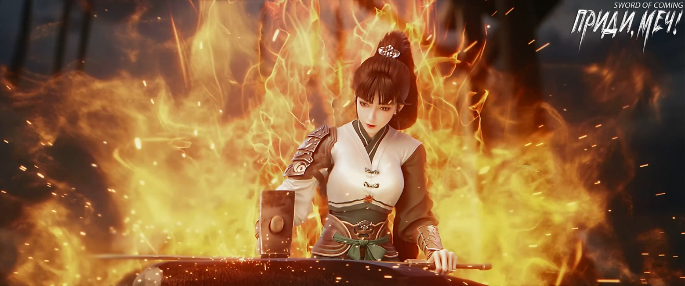
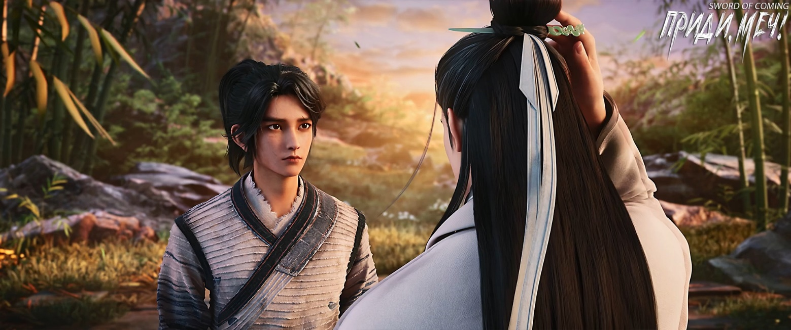
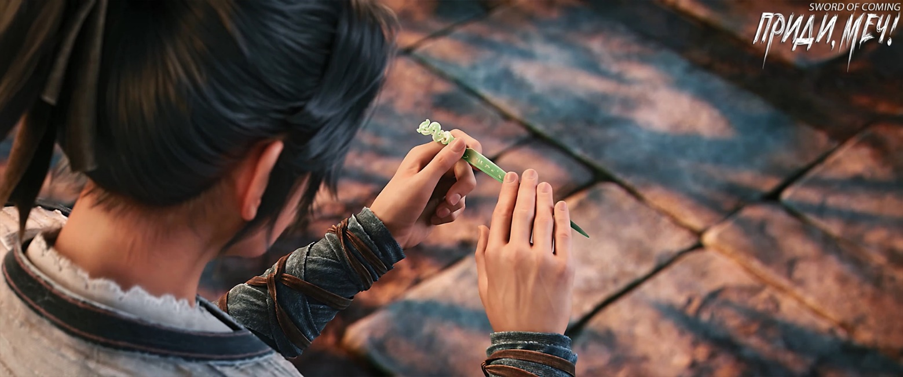

# Глава 24. Взаимный подарок

В одном из домов переулка Персиковых Листьев под навесом сидел добродушный старик на ротанговом стуле. Рядом с ним расположилась миловидная служанка в желтых штанах с узорами и легком платье цвета светлой зелени. Она слушала истории старика и медленно обмахивала его веером.

Внезапно старик спросил:

— Таоя[1], ветер снова задремал? Не пугаю тебя, но если бы ты так лениво себя вела в большом поместье за пределами городка, тебя бы непременно наказали.

[1] Таоя (桃芽) — Персиковый Росток.

Не получив ответа, старик, всегда снисходительный к слугам, хотел пошутить еще, но вдруг его лицо изменилось. Он поднял голову, глядя вдаль с серьезным выражением. Оказалось, что во дворике не только веер в руках молодой служанки замер без движения, но даже невидимый легкий ветерок остановился.

Старик поспешно затаил дыхание, мысленно произнес заклинание и погрузился в медитацию, чтобы не потерять свои духовные силы в этом кратком обратном течении реки времени. Он тихо вздохнул:

— Даже Ци Цзинчунь, самый строгий блюститель правил и ритуалов, в конце концов нарушил запрет и вмешался.

Похоже, надвигалась буря, и ветер уже наполнял башню[2].

[2] «山雨欲来风满楼» — известная китайская идиома. Дословный перевод звучит как «Ветер наполняет башню, горный дождь вот-вот придет», но ее истинное значение ближе к «Назревают большие события, подобно тому, как ветер наполняет башню перед горным ливнем». Идиома используется для описания ситуации, когда назревают важные или опасные события. Подразумевает, что можно предчувствовать приближение серьезных перемен или проблем по едва заметным признакам.

У колодца с железной цепью крепкий молодой человек из далеких краев сидел на корточках, пристально глядя на ворот колодца. Однако краем глаза он тайком поглядывал на силуэт пышной крестьянки. Женщина, наклонившись, поднимала ведро из колодца. Ее удивительно округлые бедра, тяжело свисающая грудь и несколько преувеличенные изгибы тела были полностью открыты взору, а ее фигура излучала дикую ауру спелых пшеничных колосьев, придавая ей, обычной с виду женщине, особое очарование.

Когда молодой человек осознал, что окружающая обстановка странным образом застыла, он не шевельнулся, но, набравшись смелости, прямо посмотрел на прекрасную картину черпающей воду женщины. Он украдкой сглотнул слюну и поспешно повернулся, изменив позу.

Неудивительно, что учитель говорил: женщина с подножия горы подобна тигрице, покинувшей лес — ее сила значительно уменьшается. Но стоит привести ее в горы, как она становится свирепой тигрицей, царящей на вершине и способной растерзать человека. Когда учитель выпивал, он всегда повторял, что все герои и удальцы Поднебесной проигрывали горным тигрицам, и не было ни единого исключения.

Однако молодой человек считал, что и «лесные тигрицы» весьма опасны. Взять хотя бы ту женщину перед его глазами: хоть и выглядела обычно, но была настолько обольстительна, что у него зудело внутри. Если бы она, не говоря ни слова, влепила ему пощечину безо всякой причины, молодой человек чувствовал, что даже не посмел бы дать сдачи, и более того — если бы она рассмеялась, он, возможно, тоже бы рассмеялся вместе с ней.

Размышляя об этом, молодой человек приуныл. Он опустил голову, взглянул на свою промежность и выругался:

— Бескостный, неудивительно, что нет силы духа!

※※※※

В переулке Глиняных Кувшинов Сун Цзисинь просматривал толстую старую книгу «Записи местного уезда». Он обнаружил множество закономерностей: книга дополнялась каждые шестьдесят лет, поэтому Сун Цзисинь частным образом назвал ее «Записями шестидесятилетнего цикла».

Еще одна особенность заключалась в том, что жители городка, уехавшие в молодости с дальними родственниками, почти никогда не возвращались на родину, словно не любили возвращаться к корням. Они принадлежали к тем, кто «цветет внутри стены, но благоухает снаружи». Многие семейные кланы разрастались за пределами родных мест, превращаясь в огромные, глубоко укоренившиеся деревья, поэтому Сун Цзисинь также дал книге ласковое прозвище «Книга из-за стены».

В этот момент он просматривал страницу с биографией человека по имени Цао Си[3]. Описание его жизни и деяний было скупым, что являлось еще одной особенностью этих «Записей местного уезда». Сун Цзисинь перечитывал эту страницу не менее семи-восьми раз и уже знал книгу наизусть. Теперь, читая ее на досуге, он выбирал только самые необычные истории о людях, воспринимая их как легенды, рассказанные сказителем. Достоверность этих историй невозможно было проверить, но Сун Цзисинь, конечно, и не заботился об этом.

[3] Цао Си (曹曦). Цао — фамилия, которая может означать «травянистое растение» или «высокий». Си — имя, означает «первые лучи солнца, рассвет», «утренний свет».

Он помнил только того мужчину в официальной одежде, который пришел глубокой ночью перед отъездом в столицу для доклада о проделанной работе. Мужчина с необычайной серьезностью сказал ему, что нужно запомнить одну важную вещь: выучить наизусть каждое имя, появляющееся в книге, а также сотни и тысячи чисел, и происхождение их предков в городке, особенно связи с четырьмя фамилиями и десятью кланами.

В этот момент Сун Цзисинь оставался неподвижным, подобно разбитым глиняным статуям божеств на юго-востоке городка. Они беспорядочно лежали в траве и грязи, оставаясь недвижимыми несмотря на ветер и дождь.

Свет, проникающий через окно и падающий на письменный стол, сохранял необычайное состояние неподвижности.

В этом доме единственными, кто мог двигаться, были служанка Чжигуй и неприметная четвероногая змея. Она давно заметила что-то необычное, и первой мыслью, пришедшей ей в голову, было пойти во двор по соседству и отругать ту девушку с каменным лицом, пока та не истекла кровью. Однако, вспомнив о существовании меча, отказалась от этой заманчивой идеи.

Сначала она пришла в комнату своего молодого господина, мельком взглянула на содержание страницы, увидела два иероглифа «Цао Си» и, посчитав их скучными, перелистнула несколько страниц назад. Увидев раздел о «Се Ши»[4], она радостно улыбнулась. Вскоре разочарованно вернула страницы обратно, чтобы не раскрыть небесные тайны и не выдать себя.

[4] Се Ши (谢实). Се — фамилия, которая может означать «благодарить» или «увядать». Ши — имя, означает «реальный, истинный, надежный».

Все эти годы проницательный и хитрый молодой господин лишь из любопытства подозревал ее происхождение и личность, но так и не нашел настоящих убедительных доказательств. Она не хотела потерпеть неудачу в решающий момент, когда успех был так близок.

Сопровождая молодого господина в сельскую школу, она считала, что некоторые высказывания ученых людей звучат лицемерно и нелепо, например, «отдать жизнь во имя справедливости». Однако некоторые суждения ей нравились, например: «Из пути в сто ли, половиной считай девяносто»[5] — эта фраза действительно глубоко раскрывала суть вещей.

[5] Из пути в сто ли, половиной считай девяносто (行百里者半于九十). Смысл в том, что последние десять будут самыми сложными. Искушение сдаться будет особенно сильным незадолго до победы. Многие из нас сдаются на полпути, испугавшись трудностей, и никогда не достигают желаемых результатов.

Желто-коричневая четвероногая змея лежала на пороге, греясь на солнце. В этот момент предела она была неподвижна и вернулась к своему «истинному облику». В лучах света она сверкала и переливалась, кристально чистая, а ее тело напоминало кусок цветного стекла.

В комнате соседнего двора Нин Яо погрузилась в глубокое состояние «эмбрионального дыхания». Она не дышала ртом или носом, словно младенец, все еще находящийся в утробе матери, — ее дух вернулся к корням, а мысли остановились.

Внутри белоснежных ножен летающий меч, словно получив помилование, медленно вышел наружу и легко парил вокруг своей хозяйки. Его движения напоминали нежность прирученной птицы и грацию развевающегося платья юной девушки. Меч летал не беспорядочно, а будто рисуя волшебные символы, создавая для своей исцеляющейся хозяйки наилучшее место с точки зрения фэн-шуй.

И действительно, окружающая энергия стремительно хлынула в тело Нин Яо, не подающей никаких признаков дыхания. Она, подобно киту, поглощающему воду, неистово впитывала изначальную духовную энергию этого мира. В этот момент мертвая тишина городка резко контрастировала с бурлящей жизнью в доме.

На южном берегу ручья за пределами городка находился коренастый мужчина с густыми бровями и большими глазами, излучающий острую энергию. С обнаженной грудью и животом он держал в руках железный молот и ковал железо. С каждым ударом молота разлетались искры, наполняя комнату сиянием. Бесчисленные искорки беспорядочно летали по просторному помещению, создавая великолепное зрелище. Каждый взмах молота был словно целая картина.

Напротив мужчины стояла миниатюрная девушка с собранными в опрятный конский хвост волосами. Она была одета в накидку из желтой воловьей кожи, чтобы защититься от разлетающихся искр, так как обычная хлопковая одежда легко прожигалась.

После одного удара молота миллионы искр внезапно застыли в воздухе.

Девушка с конским хвостом, нахмурившись, спросила:

— Отец?

Мужчина низким голосом ответил:

— Теперь твоя очередь ковать меч. Это хорошая возможность закалить твой дух.

Девушка отложила старый меч и отмахнулась от искр перед собой. Искры, которые она небрежно отогнала, привели в движение все остальные. Те, что должны были оставаться неподвижными в реке времени, начали сталкиваться друг с другом, снова и снова создавая хаотичное освещение в комнате.

По сравнению с пожилыми мастерами в городке, которые были подобны «притаившимся в бездне драконам» и сосредоточенно медитировали с затаенным дыханием, действия девушки казались слишком своевольными и дерзкими.

Особенно когда она взяла молот, ее удары были мощными и тяжелыми, движения — быстрыми и резкими, даже более дикими и необузданными, чем у опытного мужчины.

Искры, разлетавшиеся при каждом ударе, не исчезали в этом застывшем мгновении. После многократных ударов густое скопление искр, подобное ярким звездам, окружило их в воздухе.

В кузнице, где ковали меч, было бесчисленное множество искр.

Мужчина, пристально глядя на раскаленную заготовку меча, низким голосом приказал:

— Мысленно повторяй про себя главу «Потрясение дракона» из «Канона ковки мечей».

Энергия девушки внезапно упала, и она тихо сказала:

— Отец?

Мужчина раздраженно спросил:

— Что такое?

Энергия девушки упала еще больше, и она робко сказала:

— Я мало поела в обед, проголодалась и больше не могу бить молотом.

Мужчина разозлился еще больше. Если бы не процесс ковки меча, он бы уже начал ругаться:

— Стоит только попросить тебя выучить текст, ты ведешь себя так, будто я прошу тебя умереть. Ищешь какие-то оправдания… Черт возьми, дочка, с твоим аппетитом неудивительно, что ты голодна. Это действительно не оправдание…

Девушка украдкой улыбнулась. Хотя она и говорила, что голодна, ее движения ничуть не ослабли. В мгновение ока ее осенило, и она громко закричала, вкладывая всю свою силу в удар молотом:

— Выходи!

На этот раз разлетелось необычайно много искр, особенно ярких.

Лицо мужчины оставалось бесстрастным, но в душе он подумал:

«Получилось».

※※※※

Во дворе дома Гу Цаня госпожа Гу медленно пришла в себя. У нее раскалывалась голова, и с помощью Гу Цаня она села обратно на длинную скамью. Истинный Господин сидел с закрытыми глазами, медитируя, медленно перебирая большим и указательным пальцами в рукаве.

Госпожа Гу, усадила Гу Цаня рядом с собой и тихо спросила:

— Бессмертный мастер, что происходит?

Лю Чжимао, не открывая глаз, ответил:

— Старик обрел хорошего ученика, а у вас прекрасный сын. Госпожа Гу, вы можете спокойно ждать, когда обретете почет благодаря своему сыну.

Госпожа Гу была вне себя от радости, со слезами на глазах она обняла Гу Цаня и прошептала:

— Отец ребенка, ты слышал? Наш Гу Цань обязательно добьется больших успехов…

Лю Чжимао вдруг удивленно воскликнул, открыл глаза и посмотрел на линии ладони, словно там появился новый путь. Он тихо пробормотал:

— Почему так? Не должно быть. Юноша не умер, а вместо этого почему-то умерла та ученица бессмертных?

Ему пришлось встать и медленно прохаживаться по двору, нервно перебирая пальцами:

— Бесполезная! Проиграть какому-то городскому юнцу — тысячелетняя репутация горы Облачной Зари разрушена в одночасье.

Госпожа Гу с тревогой обратилась:

— Почтенный бессмертный мастер, раз наш Цань уже стал учеником, может, отпустим Чэнь Пинъаня?

Лю Чжимао гневно воскликнул:

— Женская слабость! Если бы у тебя действительно было милосердное сердце, ты бы не захотела убить его при нашей первой встрече. Сейчас ты притворяешься бодхисаттвой, но есть ли у тебя совесть?

Госпожа Гу побледнела от этих упреков и не осмелилась возразить.

Лю Чжимао, все еще кипя от гнева, указал на нее и продолжил:

— Узколобая деревенская баба! После того как Гу Цань вернется со мной к озеру Бамбукового Свитка, вы с сыном не должны видеться слишком часто, чтобы не мешать его совершенствованию. Возражения есть?

Госпожа Гу поспешно замахала руками:

— Не смею перечить!

Лю Чжимао мрачно посмотрел на нее.

Госпожа Гу на мгновение растерялась, но быстро опомнилась и с несчастным видом прошептала:

— Никаких возражений, ни единого!

Лю Чжимао резко взмахнул рукавом и холодно фыркнул:

— Как же ты меня разозлила!

Раньше он считал, что госпожа Гу обладает некоторым изяществом, и даже думал сделать ее личной служанкой. Но сейчас она показала себя настолько вульгарной и невыносимой, что утратила всякую возможность вступить на путь совершенствования.

Лю Чжимао внезапно насторожился, словно перед лицом великого врага, и огляделся. Действительно, эта часть мира была искусственно остановлена в «предельном состоянии». «Предел» был одним из множества малых благословенных мест в мире. Даже земные бессмертные и архаты с золотым телом не могли и мечтать о создании подобного.

Такое великое искусство можно было считать вершиной совершенства. Хотя в значительной степени это заслуга той великой формации, оно все равно внушало глубокое благоговение.

Только представьте: находясь в этой части мира, кем бы ты ни был — бессмертным, буддой, божеством, демоном или призраком — все должны были бы склониться перед тобой. Какое это чувство?

Истинный Господин, Рассекающий Реку, Лю Чжимао даже во сне мечтал достичь такого уровня. Использовать высокое мастерство? Да к черту! Если бы у Лю Чжимао было такое малое небесное царство, он бы непременно затащил сюда учеников третьего поколения Будды, Патриарха Дао и Главу Конфуцианства. Он не осмеливался утверждать, что заставит их склонить головы, но, по крайней мере, они могли бы сидеть рядом, называя друг друга собратьями.

Внезапно он выплюнул кровь, кровь брызнула и из его ладони, словно кто-то с силой разрезал ее острым оружием. В другой руке помимо воли появилась белая чаша — вода в ней была неспокойной, черные линии метались хаотично, ударяясь о стенки.

Не колеблясь, он сложил руки, положив ладонь на тыльную сторону другой руки. Несмотря на принадлежность к даосской школе, он поклонился по-конфуциански, склонившись до земли с крайним благоговением, и дрожащим голосом произнес:

— Лю Чжимао, хозяин острова Лазурного Ущелья на озере Бамбукового Свитка, умоляет учителя Ци пожалеть искреннее стремление младшего к Дао. Если я чем-то оскорбил вас, надеюсь, что вы, великий учитель… мудрец, не будете помнить ошибок маленького человека!

Спустя долгое время.

— Немедленно уходи! — эти четыре слова прогремели как весенний гром.

Лю Чжимао с огромной радостью воскликнул:

— Учитель, не беспокойтесь, я сейчас же покину городок вместе с госпожой Гу и ее сыном.

Он, все еще считая себя младшим, вспомнил о чем-то и осторожно спросил:

— Осмелюсь узнать, как мне поступить с двумя мешочками монет из эссенции золота, что находятся у меня?

Величественный голос снова прозвучал:

— По одному предмету на человека, как раз две возможности. Оставь их во дворе. В течение тридцати лет тебе запрещено покидать озеро Бамбукового Свитка даже на шаг.

Лю Чжимао почувствовал облегчение. На этот раз он не стал угодливым и намеренно не кланялся по-конфуциански, а лишь совершил почтительный даосский поклон:

— Не смею отказываться от дара старшего. Великая милость учителя Ци глубоко тронула сердце младшего, и я никогда не забуду об этом до конца своих дней!

После этого голос Ци Цзинчуня больше не раздавался, и Предел вскоре исчез. Лю Чжимао, не тратя слов, немедленно приказал госпоже Гу взять Гу Цаня и следовать за ним, чтобы покинуть городок. Когда женщина хотела что-то возразить, Лю Чжимао бросил на нее такой свирепый взгляд, что она замолчала, словно цикада зимой.

Лю Чжимао достал два мешочка. Хотя в душе ему было немного жаль, он без колебаний положил их на длинную скамью. Однако у самых ворот маленького двора внезапно спросил:

— Не осталось ли в вашем доме каких-нибудь старых вещей?

Госпожа Гу растерялась, но сообразительный Гу Цань тут же напомнил:

— Разве отец не оставил шкатулку сокровищ? Ту самую, что пылится под кроватью?

Глаза Лю Чжимао загорелись, и он, не говоря ни слова, велел госпоже Гу показать дорогу, чтобы лично все проверить.

Раз тот мудрец признал, что сам Гу Цань является возможностью, это означало, что ребенок может забрать с собой принадлежащие ему возможности. Что касается их окончательной принадлежности, в городке, вероятно, даже сам Небесный Владыка должен был бы подчиниться Ци Цзинчуню, но на озере Бамбукового Свитка это было бы уже не так очевидно.

Между тем оставленный без присмотра Гу Цань, дождавшись, когда двое вошли в дом, схватил по мешочку в каждую руку, тихонько вытащил дверной засов и бросился бежать к другому концу переулка Глиняных Кувшинов.

Внутри дома госпожа Гу стояла на коленях, засунув руки под кровать и пытаясь достать ящик. Он был небольшим, но очень тяжелым, что вызывало у нее значительные трудности. Женщина тяжело дышала, силясь его вытащить.

В результате Лю Чжимао сильно пнул ее по пухлым ягодицам и насмешливо произнес:

— Госпожа Гу, тебе повезло, что ты неплохо следишь за собой, но даже с этим на острове Лазурного Ущелья быть служанкой второго ранга будет для тебя затруднительно. Однако служанкой третьего ранга — более чем достаточно. Старик на тебя и не взглянет, однако на острове есть несколько гостей-отшельников, которым ты, возможно, придешься по вкусу. Когда придет время, постарайся хорошенько себя показать, не стесняйся, чтобы не упустить счастливую возможность.

Госпожа Гу слегка напряглась, но большая часть ее тела все еще находилась под кроватью, и выражение лица было неразличимо.

※※※※

Подойдя к входу в переулок, Ци Цзинчунь сказал Чэнь Пинъаню:

— Цай Цзиньцзянь и Фу Наньхуа — моя забота. Теперь, когда у тебя есть этот лист софоры от предков, не относись легкомысленно к жизни и смерти. Живи достойно — это будет лучшей благодарностью твоим родителям.

— Что касается трех сил: горы Облачной Зари, Старого Города Дракона и Истинного Господина, Рассекающего Реку, я не могу гарантировать, что они никогда не побеспокоят тебя, но в ближайшие десять лет точно не будут создавать тебе проблем. Если повезет, сможешь оставаться обычным горожанином и прожить спокойно тридцать лет.

Ци Цзинчунь улыбнулся:

— Не стоит опасаться этого маленького городка. В будущем… вскоре, вероятно, все эти интриги прекратятся. Хочешь спокойной жизни на двадцать-тридцать лет — женись и обоснуйся. Желаешь выйти за пределы городка и увидеть настоящий мир — тоже хорошо. Прочитать десять тысяч свитков и пройти десять тысяч ли — долг каждого ученого. Позже ты поймешь: в городке трудно читать книги, но легко путешествовать, а за его пределами многим ученым легко покупать, читать и хранить книги, но они не любят далеко ходить, жалуясь на тяготы. Так называемое «путешествие с книгами за плечами» для них — не более чем прогулка за город в повозке.

Чэнь Пинъань удивленно спросил:

— Учитель Ци, разве ходьба считается тяготой?

Ци Цзинчунь громко рассмеялся:

— Даже не говоря о том, что за пределами городка, просто взгляни на своих ровесников с улицы Благоденствия и Достатка и переулка Персиковых Листьев. Много ли среди них таких, кто, как ты, бродит по горам и долам?

Чэнь Пинъань кивнул:

— И правда.

Ци Цзинчунь задумался, затем вынул из своей прически нефритовую шпильку и, наклонившись, протянул ее Чэнь Пинъаню:

— Пусть это будет прощальным подарком. Это не ценная вещь и не предмет бессмертных, так что не стесняйся принять. На самом деле, я такой же, как ты. Когда-то я был юношей из бедного переулка, усердно учился, преодолевал множество трудностей и препятствий. Конечно, были и удачные моменты, и в итоге я поступил в Академию Горного Утеса. Время, когда я учился у наставника, было самым счастливым в моей жизни. Когда учитель покидал гору, он дал мне эту шпильку как знак своих надежд и наставлений. К сожалению, оглядываясь назад, я понимаю, что все эти годы не оправдывал ожиданий. Уверен, если бы учитель был жив, он был бы разочарован.

Чэнь Пинъань не решался принять подарок. Нефритовая шпилька, казалось, хранила в себе чувства, связывающие учителя и Ци Цзинчуня как наставника и ученика. Не говоря уже о глубоком смысле, это был и немалый дар сам по себе. Хотя Чэнь Пинъань и не был особо искушен, но, будучи выходцем из мастеров по обжигу императорского фарфора, он все же обладал некоторым чутьем в оценке качества вещей.

Ци Цзинчунь мягко сказал:

— Если она останется у меня, эта реликвия учителя будет похоронена вместе со мной. Лучше передать ее тебе. К тому же, ты заслужил это. Я провел в этом городке почти шестьдесят лет, и у меня всегда была одна нерешенная загадка. К сожалению, учитель уже ушел, и я думал, что никогда не получу ответа, но ты невольно помог мне разгадать ее. Поэтому, подарив тебе эту шпильку, я поступаю правильно и по чувствам, и по разуму, и по этикету. Чэнь Пинъань, я смог помочь тебе получить только лист софоры и не могу дать тебе больше возможностей.

Чэнь Пинъань обеими руками принял простую нефритовую шпильку и искренне сказал, подняв голову:

— Учитель уже сделал очень много.

Ци Цзинчунь улыбнулся, не придав этому значения. Видя, что ему удалось убедить Чэнь Пинъаня принять шпильку, он почувствовал облегчение. Шпилька действительно была обычной и простой, но все же это была реликвия его учителя, и было хорошо, что он смог подарить ее юноше, который не опозорит надпись на ней.

Поэтому в заключение Ци Цзинчунь наставлял:

— Чэнь Пинъань, запомни, что бы ни случилось в будущем, никогда не теряй надежду на этот мир.