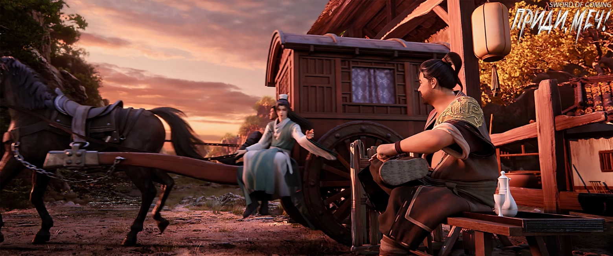
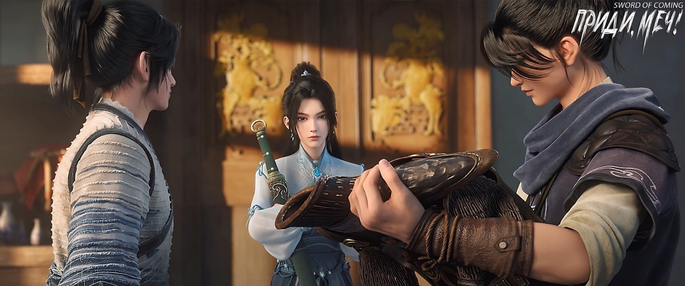
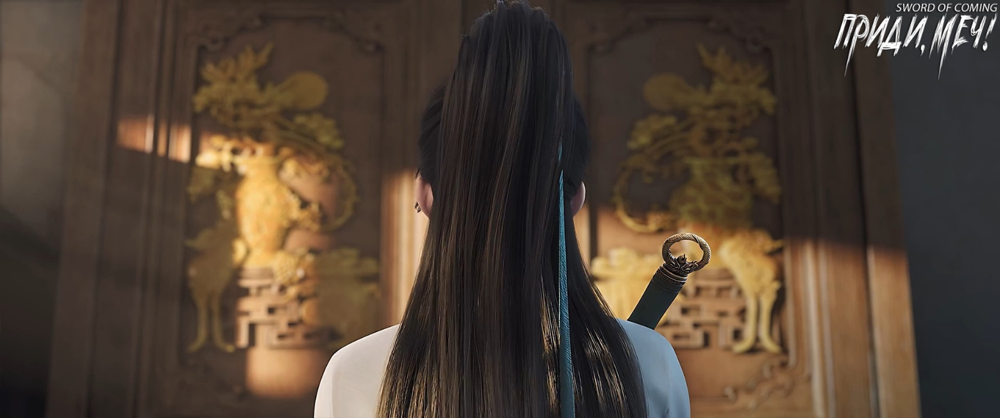

# Глава 28. Одержимость богатством

В сумерках, когда Чэнь Пинъань возвращался в городок и проходил мимо восточных ворот, неряшливый привратник, все еще напевал мелодию, как раз дойдя до строчки «Каждый миг времени нельзя тратить впустую, богатство и слава — все можно отбросить»[1].

[1] Идиома, означающая ценность времени и преходящую природу материальных благ.

Возможно, потревоженный торопливыми шагами Чэнь Пинъаня, он открыл глаза и встретился взглядом с вбегающим в ворота юношей. Увидев этого «демона-сборщика долгов», мужчина крайне расстроился и раздраженно махнул рукой:

— Пошел, пошел! Твое время и ломаного гроша не стоит. Из слов «слава и богатство», если хоть одно будет иметь к тебе отношение, можешь возжечь благовония в благодарность [2].

[2] Выражение означает, что у Пинъаня нет шансов на успех.

После того как Чэнь Пинъань пробежал мимо, он высоко поднял ладонь, растопырив пять пальцев, и энергично потряс ею. Очевидно, он напоминал привратнику, что между ними существует долг в пять вэней.

Охранник ворот яростно сплюнул и выругался:

— И не такая ты уж хорошая птица!

Силуэт Чэнь Пинъаня быстро исчез. Привратник поднял голову и посмотрел на ясное голубое небо, которое было похоже на красивый слой глазури.

Привратник, потирая заросший щетиной подбородок, цокнул языком и сказал:

— Учитель Ци как-то процитировал стихотворение, что там было? Что-то про «хорошие вещи» и «стекло»?

Повозка, запряженная быком, медленно выезжала из городка. В ней сидел тот самый всеми уважаемый молодой ученый в синем халате Чжао Яо, а возницей был угрюмого вида мужчина средних лет.

Привратник тут же замахал рукой и громко рассмеялся:

— Братец Яо, не спеши уезжать! Я забыл одну фразу, помню только «хорошие вещи» и «стекло», а остальное никак не могу вспомнить. Ты, парень, ученый, растолкуй-ка мне!

Воодушевленный Чжао Яо, держа в руках дорожную сумку, звонко продекламировал:

— Лучшие вещи в мире непрочны, разноцветные облака легко рассеиваются, а стекло хрупко![3]

[3] Идиома, означающая непостоянство и хрупкость прекрасного в мире.

Мужчина выставил большой палец вверх:

— Недаром ты, братец Ю, твои знания превосходны! Когда добьешься успеха в будущем, не забудь вернуться в родной город навестить старшего брата. Глядишь, сможешь заменить своего учителя и стать наставником для детей нашего городка. Это было бы здорово!

Чжао Яо на миг опешил, но затем почтительно сложил ладони и с улыбкой ответил:

— Благодарю старшего брата за добрые слова!

Привратник, обрадовавшись, вытащил из рукава вышитый кошелек, встряхнул запястьем и, широко улыбаясь, высоко подбросил его Чжао Яо:

— Столько лет ты бесплатно писал для меня парные надписи к празднику весны, и главное, ты всегда был добр и никогда не считал это хлопотным. Старший брат никогда не ошибается в людях. Вот тебе небольшой подарок, счастливого пути!

Чжао Яо поспешно поймал кошелек:

— До новых встреч!

Привратник, улыбаясь, кивнул и помахал рукой повозке Чжао Яо, но пробормотал:

— Вряд ли.

Чэнь Пинъань направился вглубь городка, а повозка Чжао Яо покатила прочь из городка, и они лишь словно соприкоснулись плечами, разминувшись.

Сидя на пне, охранник ворот стал загибать пальцы и считать:

— Юноша из Великой Суй с золотым карпом в бамбуковой корзине, сын вдовы Гу из переулка Глиняных Кувшинов, и теперь еще братец Яо с улицы Благоденствия и Достатка — уже трое. Но ведь еще столько людей ринутся сюда, в конце концов останется только работа старьевщика? А может, и мне воспользоваться случаем и найти усердного ученика, который бы мог массировать плечи и похлопывать по спине?

Привратник провел рукой по своей морщинистой, загорелой щеке и ухмыльнулся:

— А если бы это была красивая ученица с ясным лицом и стройной фигурой, было бы еще лучше. Хм, с не очень красивым лицом я бы еще смирился, но ноги обязательно должны быть длинными!

Этот известный в городке холостяк обхватил руками затылок, запрокинул голову к небу и тихонько посмеивался про себя. Подумав об этих радостных вещах, он сразу забыл о своих тревогах и ощутил, что между небом и землей есть великая красота.

Перед тем как покинуть переулок Глиняных Кувшинов, Чэнь Пинъань договорился с Лю Сяньяном и Нин Яо встретиться прямо в доме Лю Сяньяна. Когда Чэнь Пинъань добежал до дома друга, дверь была не заперта, и он вошел. Добравшись до главного зала, он увидел, как Лю Сяньян чистым хлопковым полотенцем мыл и протирал тот самый драгоценный доспех, передававшийся из поколения в поколение.

Девушка в черном, юная госпожа Нин, снова надела слегка приоткрытое вэймао, на поясе у нее висел клинок, а длинный меч в белоснежных ножнах она небрежно держала в руке. Почему-то Чэнь Пинъаню казалось, что юная госпожа Нин как будто немного пренебрегала этим мечом.

На столе лежала старинная семейная реликвия клана Лю — так называемые драгоценные доспехи, которые казались Чэнь Пинъаню поистине уродливыми и пугающими. Огромные латы были покрыты выпуклыми железными прожилками, напоминающими наросты на сухих деревьях, а также пятью глубокими параллельными бороздами, тянущимися от левого плеча вниз к правому боку.

Оба юноши ломали голову, но никак не могли представить, какой же огромный лесной зверь мог оставить такие ужасающие следы. Позже, когда власти неоднократно запрещали доступ в горы, не позволяя простым людям ходить туда рубить дрова и жечь уголь, Чэнь Пинъань и Лю Сяньян почти никогда не нарушали этот запрет, и во многом причина была именно в этом.

Чэнь Пинъаню было странно, что эти уродливые, словно обугленные железные доспехи Лю Сяньян по-настоящему считал семейной драгоценностью. Даже такому близкому другу, как Чэнь Пинъань, они показывались лишь раз в много лет, не более чем на полчаса, после чего их быстро и бережно упаковывали обратно в лакированный сундук для хранения.

Однако, заметив, что Лю Сяньян то и дело бросает взгляды на Нин Яо, Чэнь Пинъань немного успокоился. Лю Сяньян всегда был таким: увидев красивую девушку, не мог оторвать глаз, но на самом деле он не испытывал настоящей симпатии, а просто любил покрасоваться и похвастаться.

Например, раньше летом на крытом мосту, когда они купались с голым торсом в ручье, если проходили несущие рисовую рассаду или ведущие желтых буйволов девушки их возраста, Лю Сяньян обязательно проделывал три коронных трюка. Сначала он вскакивал, как ошпаренный, на большой прибрежный камень, затем громко кашлял — что Сун Цзисинь называл «оповещением всего мира» — и, наконец, эффектно прыгал в воду.

У Чэнь Пинъаня было хорошее зрение, и он ясно видел взгляды и выражения лиц проходящих девушек. Поэтому он очень хотел рассказать Лю Сяньяну правду: некоторые из этих миловидных сестричек закатывали глаза, другие бормотали ругательства, а большинство просто не обращали на него внимания. Но никто не бросал на него восхищенных взглядов и не считал его героем.

Позже Лю Сяньян увлекся служанкой Сун Цзисиня, Чжигуй, и необъяснимо глубоко погрузился в это чувство. После этого, казалось, Лю Сяньян больше не замечал других красивых девушек. Даже сейчас, хвастаясь перед Нин Яо, он в основном надеялся, что гордая и холодная Нин Яо не будет смотреть на него свысока: не думай, что если ты носишь кинжал и меч, то можешь вести себя как царь горы, у меня, Лю Сяньяна, есть эта семейная реликвия, единственная в своем роде во всем городке.

Когда Нин Яо дождалась Чэнь Пинъаня, она осмотрелась вокруг и, в конце концов, положила длинный меч поперек старого антикварного шкафа с расписными золочеными цветами. Краска на шкафу облупилась и потрескалась. Чтобы освободить место для меча, ей пришлось сдвинуть много разных сосудов и мелочей. Она обнаружила, что на внутренней стенке шкафа инкрустирована картина: золотистое османтусовое дерево на фоне полной луны.

Нин Яо повернулась и сказала:

— Я оставляю меч здесь, не трогайте его, иначе последствия будут плачевными. Я не шучу.

Лю Сяньян усердно протирал драгоценные доспехи, время от времени дыша на него и легко поглаживая пальцами, явно получая от этого истинное удовольствие.

— Конечно, — пообещал Чэнь Пинъань.

Нин Яо сказала Лю Сяньяну:

— Этот шкаф не представляет ценности, но инкрустированную картину золотистого османтусового дерева под луной не продавай дешево.

Лю Сяньян, не поднимая головы, ответил:

— Эта штука мне с детства не нравилась. Юная госпожа, если тебе нравится, можешь сама соскрести ее.

Нин Яо, конечно, не стала бы совершать такой варварский поступок, как сжигание циня и варка журавля[4], но с любопытством спросила:

— Из какого материала сделана эта картина?

[4] Идиома «焚琴煮鹤» буквально означает «сжечь цинь и сварить журавля». Согласно легенде, король царства Чу по имени Хуай-ван был известен своей любовью к музыке. Однажды он услышал прекрасную игру на цине и был настолько очарован, что приказал доставить музыканта во дворец. Однако, когда музыкант прибыл, король был пьян и уже забыл о своем приказе. В гневе он приказал сжечь цинь и сварить журавля, которого музыкант привел с собой. Этот поступок стал символом глупости, невежества и пренебрежения к искусству.

Лю Сяньян оглянулся и бросил взгляд:

— Этой вещи несколько сотен лет, откуда мне знать? Даже мой дедушка не мог сказать ничего определенного.

Чэнь Пинъань тихо сказал:

— Должно быть, это камни из ручья, они бывают разных цветов. Но предки Лю Сяньяна, вероятно, отбирали только золотисто-желтые, измельчали их и склеивали вместе. Мы называем эти камни «змеиная желчь».

Нин Яо спросила:

— Камешки? Их много в ручье?

Чэнь Пинъань рассмеялся:

— Если госпожа Нин захочет, я за день наберу тебе целую корзину. Здесь никто их не ценит, только Гу Цань любит их и часто сам ходил собирать.

Нин Яо вздохнула и пристально посмотрела на бедного юношу из переулка Глиняных Кувшинов:

— Бедняки, живущие на золотых и серебряных горах.

Чэнь Пинъань удивленно спросил:

— Эти камни ценятся за пределами города?

Нин Яо поправила вэймао и сказала:

— Цена зависит от того, в чьи руки они попадут. Кроме того, даже если они окажутся у знающего человека, успех зависит от удачи. При хорошей удаче достаточно одного камешка, при плохой — даже гора камней не принесет пользы. Но в любом случае, они ценные, и очень ценные. Вопрос в том, можно ли их вывезти из этого городка — это очень важно.

Лю Сяньян вставил:

— У этих камней есть одна странность: как только их вынимают из ручья, при воздействии ветра и солнца их цвет бледнеет, особенно сильно они теряют окраску после дождя или снега. Больше в них ничего особенного.

— Выходит, так и есть, — с сожалением сказала Нин Яо.

Чэнь Пинъань немного поколебался:

— Может, я завтра пойду и соберу полную корзину, попробуем? Вдруг найдется исключение?

Нин Яо покачала головой:

— Для меня это не имеет смысла.

Лю Сяньян уже убрал драгоценный доспех обратно в комнату и спрятал его. Теперь он прислонился к двери и усмехнулся:

— Чэнь Пинъань большой любитель наживы, не удивлюсь, если сегодня ночью он пойдет к ручью искать камни.

Нин Яо бросила:

— Я ухожу.

Подойдя к двери, она обернулась и спросила:

— Шпильку и рецепт лекарства я буду хранить для тебя. Но завтра тебе все равно нужно будет пойти в переулок Глиняных Кувшинов, чтобы помочь сварить лекарство.

Чэнь Пинъань кивнул:

— Без проблем.

Она задумалась, и с серьезным выражением лица предупредила:

— Среди чужаков, прибывших в городок примерно в то же время, что и я, самый опасный, вероятно, тот старик с горы Истинного Ян. В этот раз он специально сопровождает маленькую девочку. Затем идет тот евнух из Великой Суй, который ранил меня, потом Лю Чжимао, забравший Гу Цаня, и не стоит недооценивать ту женщину с кинжалом под личиной улыбки. Поэтому, если вы встретите того старика с горы Истинного Ян, постарайтесь избежать конфликта. Но если конфликт неизбежен, просто тяните время и не вступайте в драку. Обязательно дождитесь моего появления.

Лю Сяньян тихо сказал:

— Неужели эти чужаки, не знающие местности, действительно осмелятся убивать людей на нашей территории?

Чэнь Пинъань взглянул на него и кивнул:

— Осмелятся.

Лю Сяньян сглотнул.

Чэнь Пинъань внезапно спросил:

— Помнишь, что тебе сказал даос Лу… тот гадальщик, который раскладывал лоток?

У Лю Сяньяна разболелась голова, он напряженно вспоминал, почесывая уши и щеки:

— Как я могу это точно помнить? Знаю только, что это были какие-то неприятные, зловещие слова. Что-то про большую беду, необходимость жечь благовония и тому подобное, все вперемешку. Я тогда подумал, что он просто несет чушь, пытаясь обмануть людей и выманить деньги…

Чэнь Пинъань повернулся к Нин Яо.

Нин Яо сердито сказала:

— Если он сам не может вспомнить текст предсказания, как я могу его истолковать? Вы что, принимаете меня за бессмертную?

Чэнь Пинъань был озадачен, не понимая, почему юная госпожа Нин вдруг так разозлилась.

Нин Яо быстрым шагом покинула дом, двигаясь гораздо более решительно, чем когда пришла. Идя по широкому переулку, она размышляла, не стоит ли на обратном пути найти пару книг и почитать?

Она представила, как в будущем будет путешествовать по миру, решительно отсекая головы летающим мечом, а затем декламировать вдохновенные импровизированные стихи. Даже если никого не будет вокруг, это все равно казалось ей очень впечатляющим!

Пока Нин Яо была полна мечтаний, знакомая фигура промчалась мимо нее.

— До встречи завтра, госпожа Нин!

Когда голос затих, силуэт уже почти достиг конца переулка.

Юноша в соломенных сандалиях, с корзиной за спиной, шагал так быстро, словно летел.