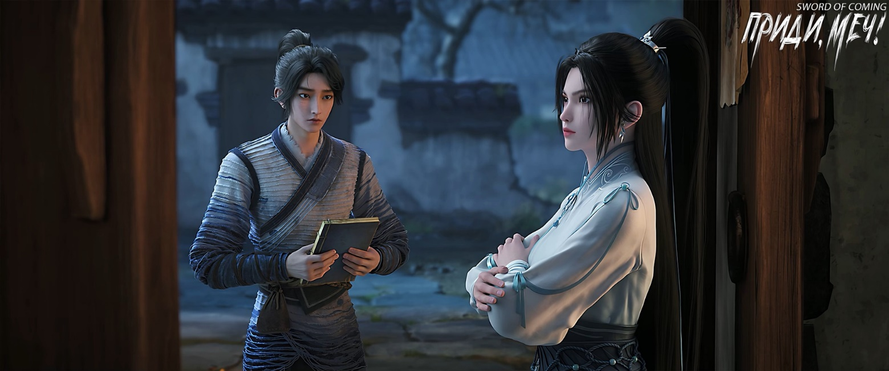
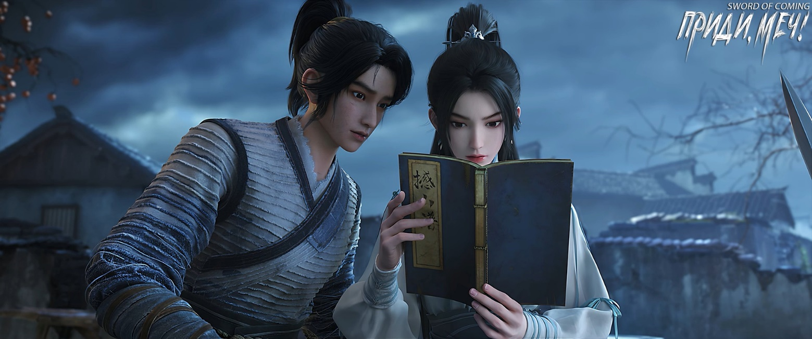

# Глава 37. Руководство по кулачному искусству

Нин Яо нахмурилась и потянулась к древней книге, но Чэнь Пинъань неожиданно отпрянул. В этот момент Нин Яо застыла на месте, пылая от ярости. Казалось, ее никогда еще так не оскорбляли.

Великая Нин Яо, чьи родители были мастерами меча выше двенадцатого уровня, с рождения считалась самым выдающимся потенциальным бессмертным мечником. И пусть она годами скиталась вдали от дома, проигрывая лишь в поединках на мечах или духовных состязаниях, никто не смел так оскорблять ее достоинство. Неужели ей, Нин Яо, нужно прибегать к уловкам, чтобы просмотреть, подглядеть или завладеть какой-то потрепанной книгой?

Нин Яо крепко сжала рукоять меча, нахмурив выразительные длинные брови. Узкие глаза и алые губы — так можно описать эту юную госпожу. При внимательном взгляде Нин Яо оказывалась очень красивой, но исходящая от нее героическая аура полностью затмевала женственность.

Следующая фраза Чэнь Пинъаня едва не заставила Нин Яо подавиться от возмущения:

— Юная госпожа Нин, эту книгу я взял из дома Гу Цаня, и хотя не считаю это воровством, в будущем ее нужно вернуть. Мы теперь друзья, поэтому что бы ни было написано здесь, надеюсь, прочитав, вы сохраните это при себе.

Нин Яо глубоко вздохнула, ударила по столу и, выпучив глаза, воскликнула:

— Чего уставился? Сам читай, мне не нужно!

— Юная госпожа Нин, но я же не умею читать, ты можешь меня научить?

Эта фраза заставила Нин Яо растеряться — не знала, плакать ей или смеяться.

— А ты не боишься, что я воспользуюсь этим в своих интересах? — насмешливо произнесла она, поразмыслив. — Подумай сам, Гу Цань явно унаследовал огромное наследие предков. Даже Лю Сяньян с его природным талантом мечника не может с ним сравниться, за тысячу лет в этом городке мало кто мог. Разве может быть плохим семейное сокровище, которое он так бережно хранит? Ты не боишься, что я, увидев такую ценность, присвою себе этот бесценный манускрипт?

В желтоватом свете масляной лампы Чэнь Пинъань лишь слегка улыбнулся, ничего не объясняя. Нин Яо холодно фыркнула, подвинулась и жестом предложила ему сесть рядом. Он долго не решался пошевелиться.

— Я, Нин Яо, одной рукой могу победить сотню таких, как ты… — со смехом произнесла она и подумала про себя: «Неужели ты боишься, что я воспользуюсь тобой?»

Чэнь Пинъань сел рядом, заметно нервничая и волнуясь.

Нин Яо, погруженная в свои мысли, бормотала себе под нос:

— Одной рукой победить сотню Чэнь Пинъаней… хм, это выражение можно использовать во многих случаях. Встретив кого-нибудь и победив в поединке, можно сказать: «У тебя сила всего лишь трех тысяч Чэнь Пинъаней, и ты осмелился сразиться со мной», неплохо звучит. А встретив древнего свирепого зверя или злобного болотного дракона, можно сказать себе: «Эта тварь равна тридцати тысячам Чэнь Пинъаней, надо бежать». Ха-ха, отлично, отлично…

Чэнь Пинъань только успел удивиться, как сидящая рядом с ним плечом к плечу Нин Яо вдруг глупо рассмеялась. От ее смеха он, живущий в полной нищете, вдруг почувствовал себя богачом.

В тот момент ни Чэнь Пинъань, ни Нин Яо еще не осознавали, какой вес и силу обретет в будущем эта шутливая фраза «одной рукой побеждаю сотню Чэнь Пинъаней». Особенно когда Чэнь Пинъань перестанет быть юношей, это будет становиться все более очевидным.

Наконец Нин Яо пришла в себя, кашлянула и выпрямила спину. Взяв древнюю книгу, она быстро пролистала несколько страниц, затем закрыла ее, дважды постучала пальцем по обложке и равнодушно повернулась к Чэнь Пинъаню:

— Это руководство по кулачному искусству, называется «Сотрясающий горы». Если следовать правилам боевого мира, ты можешь называть его «Руководство Сотрясающего горы».

— А что дальше? — с нетерпением спросил Чэнь Пинъань.

Сдерживая желание закатить глаза, Нин Яо как можно серьезнее открыла страницу. Ее нежный, словно молодой лук, тонкий палец указал на предисловие. Водя пальцем по тексту, она начала читать:

— «В моем родном краю есть маленькое насекомое, называемое муравьиным львом. Всю свою жизнь, в отличие от своих сородичей в других местах, оно проводит, перенося камни с гор в воду. Мое кулачное искусство различает жизнь и смерть, но не различает победу и поражение, важен дух, а не приемы. Когда шесть приемов этого кулачного искусства отточены до совершенства, их убийственная сила становится огромной, каждое движение может нанести глубокие раны внутренним органам… Хотя «Руководство Сотрясающего горы» никогда не входил в число изысканных и высших боевых искусств современности, я всегда верил, что среди всех боевых искусств Поднебесной для него найдется свое место. Надеюсь, что тот, кому суждено, сможет развить и прославить его…»

Нин Яо терпеливо зачитывала предисловие фразу за фразой. Тонкая книжица содержала всего шесть приемов кулачного искусства, хотя предисловие оказалось довольно объемным.

Закончив читать, она придвинула руководство к Чэнь Пинъаню, похлопала его по плечу и небрежно сказала:

— Храни хорошенько, не дай ворам украсть.

Чэнь Пинъань кивнул и осторожно положил руки на древнее руководство. Глядя на это, Нин Яо с трудом сдерживала смех — книга лежала на столе, неужели она могла отрастить ноги и убежать, или Чэнь Пинъань боялся, что она споткнется?

Чэнь Пинъань тщательно вытер правую руку о полу одежды, открыл книгу и начал читать предисловие знак за знаком. Дальше шли иллюстрации с текстом, но он по-прежнему ничего не понимал.

Нин Яо села боком, облокотившись на стол, взглянула на профиль Чэнь Пинъаня и с иронией спросила:

— Небось думаешь, что разбогател? Теперь будешь рубить дрова золотым топором и есть из золотой чаши?

Чэнь Пинъань, не поднимая головы и разглядывая иллюстрации с непонятными письменами, ответил:

— На самом деле, увидев твой взгляд, я понял, что руководство не слишком хорошее, но для меня оно достаточно подходящее.

Нин Яо приподняла бровь:

— Среди вещей, которые я видела или о которых слышала, есть действительно стоящие. Но я могу только различить, что хорошо, а что плохо. Насколько именно — сказать трудно.

Чэнь Пинъань поднял голову:

— Значит, это «Руководство Сотрясающего горы» относится к категории «хорошее, но не слишком»?

— Я даже не знаю, как описать, насколько ужасно это дрянное руководство о кулачном искусстве! — раздраженно воскликнула Нин Яо.

Чэнь Пинъань моргнул, в уголках его губ появилась улыбка. Он давно все понял и просто подшучивал над Нин Яо.

— Хочешь, чтобы тебя зарубили? — угрожающе произнесла Нин Яо, вытащив меч из ножен на ширину пальца.

— Очень красивый, — искренне похвалил Чэнь Пинъань, глядя на длинный меч в зеленых ножнах на ее поясе.

— Меч, который выбрала я, Нин Яо, не может быть плохим! — Нин Яо с достоинством приняла похвалу.

Чэнь Пинъань смотрел на нее с восхищением и завистью к ее уверенности. Несмотря на то, что она была его ровесницей и находилась в чужих краях, где никого не знала, в любой ситуации она напоминала восходящее солнце — неудержимая и величественная. Это Чэнь Пинъань, с его острой наблюдательностью, заметил еще по тому, как осторожно обращался с ней достопочтенный даос.

— Было бы здорово, если бы солнечный свет можно обменять на медные монеты! — невольно произнес Чэнь Пинъань.

— Чэнь Пинъань, ты что, с ума сошел от мыслей о деньгах? — недоуменно спросила Нин Яо.

Чэнь Пинъань поспешил сменить тему, открыв страницу с первым приемом:

— Юная госпожа Нин, не могла бы ты прочитать мне текст к этому рисунку?

— Знаешь, почему я с первого взгляда определила, что это руководство не очень хорошее? — помедлив, спросила Нин Яо.

— Мне тоже это любопытно, — покачал головой Чэнь Пинъань.

Нин Яо улыбнулась и, повернувшись к Чэнь Пинъаню, села на скамью, скрестив ноги. Указав на раскрытое руководство, она терпеливо объяснила:

— Боевые секреты воинов и методы совершенствования ци практикующих обычно записываются тремя способами. Первый — как в этом «Руководстве Сотрясающего горы», на обычной бумаге. Сколько лет такая книга сохранится — зависит от удачи. Не говоря уже о войнах и бедствиях, со временем она может исчезнуть из-за сырости, насекомых и прочего, верно?

Чэнь Пинъань понимающе кивнул.

— Поэтому среди способов записи текстов появилось негласное правило — особое внимание уделять редкости материала. То есть материал, на котором записан текст, должен соответствовать ценности самого содержания. Это как если бы ты не стал хранить императорскую печать в шкатулке из вяза.

Чэнь Пинъань задумчиво кивнул.

Нин Яо помедлила, но решила быть откровенной:

— Следующий способ — это устная передача, без записи текста. Такие знания обычно являются самыми сокровенными техниками школ и кланов. Их часто держат в строжайшем секрете или следуют сложным правилам, например, передают только мужчинам, но не женщинам. Даже многие так называемые прямые ученики или ученики внутреннего круга не обязательно получают полную истинную передачу. Устная передача и есть устная передача.

— Что касается последнего способа — его можно только постичь, но нельзя передать словами, о нем даже нельзя говорить, да и невозможно описать, — вздохнула Нин Яо. — Например, возьмем две силы, пришедшие в городок — Цай Цзиньцзянь с горы Облачной Зари. На ее горе есть явление «Созерцание облачного моря». Облачное море бескрайнее, облака и туманное сияние особенны, они содержат духовную энергию. Практики континента Водолея называют это «небесным сокровищем». Некоторые облака могут сами превращаться в патриархов прошлых поколений, и если повезет, можно встретиться и пообщаться с ними. А на вершине горы Истинного Ян густая ци меча, говорят, иногда может явить духов мечей древних патриархов всех пиков, демонстрируя Дао меча. Сможешь ли ты их увидеть, зависит только от величины твоей удачи, а не от знатности происхождения или высоты совершенствования.

— Конечно, между этими тремя способами нет строгого разделения по важности, — продолжила Нин Яо. — Если говорить о первом способе, то когда текст вырезан на нефритовой пластине это одно, если на смывающем письмена таинственном бамбуке из Бамбукового Моря, одной из семидесяти двух благословенных земель — это уже совсем другое дело. Кроме того, существует бесчисленное множество удивительных предметов, и чем дальше ты путешествуешь, тем больше приятных подарков встречаешь. В этом огромном мире есть все, что только можно вообразить. В будущем тебе лучше бы путешествовать, и даже если не получится покинуть континент Водолея или этот мир, то хотя бы постарайся дойти до границ династии Дали.

Чэнь Пинъань кивал, поглощенный руководством по боевому искусству, и указал на один иероглиф:

— Юная госпожа Нин, как это читается?

— Катись! — рассердилась Нин Яо.