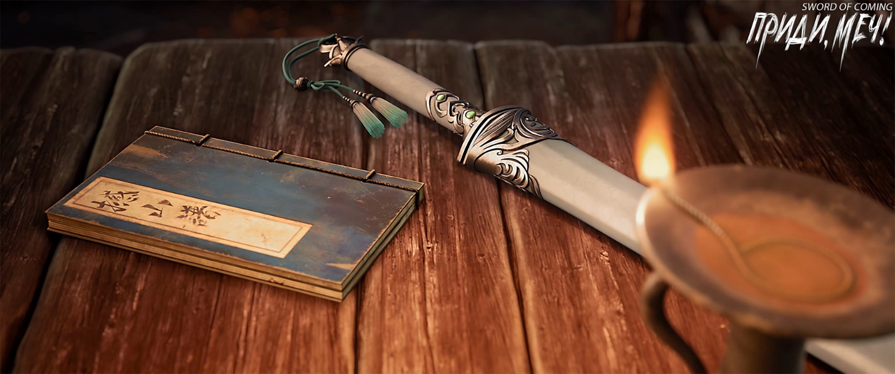
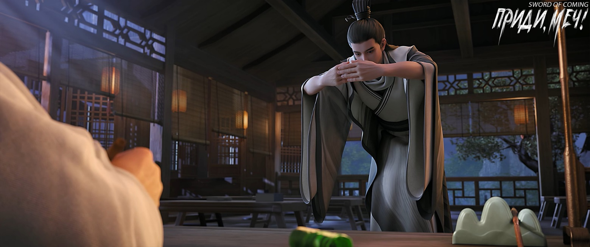
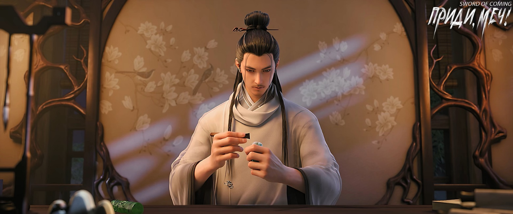
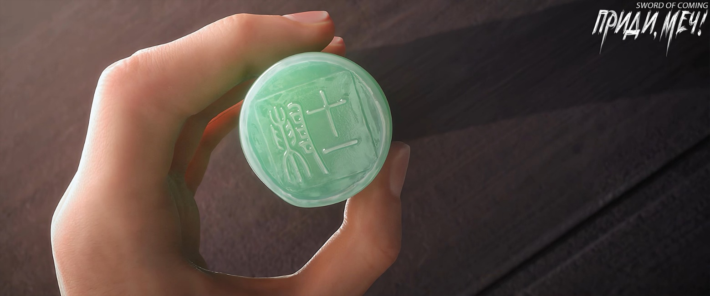

# Глава 38. Девять сфер

Чэнь Пинъань с недоверием посмотрел на Нин Яо. Она гневно взглянула на него и указала на строчки текста:

— Это действительно читается как «Катящийся»! Этот прием постигнут во время наблюдения за дождем в Дали. Сила кулака подобна катящемуся потоку, а энергия удара — хлынувшим чернилам дождя, который, упав на землю, катится по драконьей стене императорского дворца Дали и стремительно низвергается вниз!

Чэнь Пинъань сосредоточенно рассматривал несколько нарисованных одним махом изображений боевых приемов, расположенных на странице словно построение войск. Рисунки с фигурками, наносящими удары, оказались небольшими, а работа угольным карандашом не отличалась тщательностью. К счастью, острое зрение позволяло ему разглядеть все детали даже при тусклом свете. Услышав не совсем понятные слова юной госпожи Нин, он пробормотал:

— Судя по описанию, этот боевой прием очень мощный.

Нин Яо слегка наклонила голову, глядя на рисунки, и кивнула:

— Есть один стиль кулачного боя, который передавался в мире боевых искусств на протяжении нескольких тысяч лет и до сих пор не утерян. Он имеет некоторое сходство с этим руководством.

— Что ты имеешь в виду? — с любопытством повернулся к ней Чэнь Пинъань.

В тусклом свете лампы длинные брови Нин Яо слегка изогнулись, напоминая склоненную ветром весны ветвь персикового дерева.

— В мире боевых искусств есть стиль кулачного боя, подходящий и старым, и малым. Так называемый «Кулак черепахи», — сдерживая смех, сказала она. — Говорят, если хаотично размахивать кулаками, то наверняка можно случайно забить до смерти даже старого мастера.

— Как ты можешь так говорить, — беспомощно ответил Чэнь Пинъань.

Чэнь Пинъань мысленно представил — разве это не коронный прием и прославленная техника Гу Цаня? Много лет назад мать Гу Цаня пережила не самый приятный конфликт в переулке Цветущих Абрикосов у дверей лавки, где продавали румяна и пудру. Тогда Гу Цань только научился ходить, а его отец, будучи чужаком и отсутствуя дома много лет, уже забылся соседям из переулка Глиняных Кувшинов. Женщины начали беспокоиться, что их мужья, проходя мимо дома вдовы Гу, невольно замедляли шаг — даже обычная женская одежда, сушившаяся на бамбуковых шестах, легко похищала души мужчин.

Позже бабушка Ма собрала пять-шесть женщин, и они вместе отправились преградить путь к воротам дома Гу. В той схватке вдова Гу понесла немало потерь, хотя и бабушке Ма с подругами не удалось добиться большого преимущества — обе стороны пострадали. Однако, чем дальше, тем сложнее становилось вдове Гу — она одна противостояла многим, и даже ее одежда оказалась разорвана. Ее наряд и так выглядел легким, и в какой-то момент неизбежно обнажилась ее красота, что еще больше разъярило этих завистливых женщин, стыдящихся своей внешности. Они царапались и кусались, используя все возможные способы, в то время как мужчины вокруг переулка, наблюдая сцену, один за другим глотали слюну.

К счастью, в тот момент Чэнь Пинъань вернулся в городок от драконовой печи. Все эти годы получая заботу от госпожи Гу, он вступился за мать Гу Цаня, отражая множество коварных приемов. От начала до конца Чэнь Пинъань не осмеливался наносить ответные удары не из страха перед проблемами, а опасаясь одним ударом убить кого-нибудь.

В те времена он, под крики и ругань старика Яо, прошел через бесчисленные горы и реки. Ему исполнилось всего двенадцать-тринадцать лет, но он уже преодолел расстояние, которое многие старики в городке не могли пройти за несколько жизней.

Тогда они с госпожой Гу сидели у ворот двора, а Гу Цань оставался взаперти за дверью — вероятно, она не хотела, чтобы ребенок видел свою мать в столь жалком состоянии.

Чэнь Пинъань повернул голову и указал госпоже Гу на уголок рта. Госпожа Гу небрежно скривила губы, затем большим пальцем сильно стерла кровь.

Гу Цань рыдал во дворе, его крики разрывали сердце, он снова и снова звал свою мать. Госпожа Гу сначала улыбнулась Чэнь Пинъаню, а потом из ее глаз внезапно покатились слезы.

На следующий день рядом с Чэнь Пинъанем появился нежеланный «довесок».

— О чем ты думаешь? — вопрос Нин Яо прервал глубокие размышления Чэнь Пинъаня.

— Как думаешь, после того как Гу Цань с матерью покинули городок и последовали за Истинным Господином, Рассекающим Реку, к озеру Бамбукового Свитка, смогут ли они действительно зажить хорошей жизнью?

— Ты считаешь, что им жилось плохо в переулке Глиняных Кувшинов?

— Этот малый Гу Цань бессердечный, да и возраст у него маленький, он определенно не чувствовал, что жизнь тяжела. Но вот его мать… Наверное она не считала, что городок — хорошее место, особенно она не любила женщин из переулка Глиняных Кувшинов и переулка Цветущих Абрикосов. К тому же, думаю, его мать словно от рождения не должна была быть в этом городке, она всегда чувствовала себя очень неудовлетворенной. Если говорить словами старика Яо, то ее сердце было не на месте. Если у мужчины сердце не на месте, то говорят, что его устремления далеко. А если у женщины сердце не на месте, то она захочет сбежать из дома, как «абрикосовая ветвь перевесится через стену»[1]. Но я думаю, эти слова не совсем верны…

[1] Идиома, означающая неверность жены.

Нин Яо внезапно выпрямилась и хлопнула рукой по столу:

— Что за чушь ты несешь, будешь учить руководство по кулачному бою или нет?!

— Продолжай, юная госпожа Нин, — вздрогнул Чэнь Пинъань.

— Нет смысла говорить с тобой о совершенствовании, потому что ты явно не способен к этому. Поэтому я могу только говорить с тобой о боевых искусствах, о боевом пути, — раздраженно сказала Нин Яо.

Чэнь Пинъань только хотел что-то сказать, как Нин Яо продолжила:

— Боевые искусства в мире делятся на девять сфер, или уровней, хотя некоторые говорят, что на самом деле выше девяти уровней есть еще десятый, подобно тому, как каждая великая династия содержит группу игроков в вэйци «ожидающих императорского указа»…

Дойдя до этого места, настроение Нин Яо заметно улучшилось, и она с улыбкой спросила:

— Чэнь Пинъань, знаешь, кто такие придворные игроки в вэйци?

Чэнь Пинъань честно покачал головой.

Лицо Нин Яо засияло:

— В вэйци высший ранг — это девятый дан, что равносильно чиновнику первого ранга при дворе. Но некоторые гении, появляющиеся раз в столетие, удостаиваются звания «мастер десятого дана», и у них есть различные вычурные уникальные титулы. Придворные игроки вашей династии Дали особенно позорны, говорят, что ваши игроки девятого дана равны по силе лишь игрокам седьмого дана династии Суй. Во всей Дали только один человек по прозвищу «Вышитый Тигр» считается достойным соперником в глазах игроков династии Суй. Ах да, ты вообще знаешь, что такое вэйци?

— Знаю, и правила немного понимаю, просто сам играть не умею. У Сун Цзисиня и Чжигуй дома есть доска и камни.

— Вот как, — разочарованно произнесла Нин Яо.

Несмотря на долгие объяснения, Чэнь Пинъань все еще не понимал, что же такое «девять сфер».

Нин Яо, осознав, что отклонилась от темы, кашлянула и торжественно произнесла:

— Моя мать говорила, что девять сфер боевого пути — это как подъем по ступеням, шаг за шагом. Но даже когда ты достигнешь вершины девятого уровня, конечная картина будет подобна тому, как стоя на одной горе и глядя на другую вдалеке, ты видишь только ее склон.

— Я понял, — задумчиво произнес Чэнь Пинъань.

Он своими глазами видел такую картину.

Нин Яо, не обращая внимания на то, действительно ли он понял, продолжила:

— Девять сфер боевого пути делятся на совершенствование тела, совершенствование ци и совершенствование духа, каждый включает три уровня. Поднимаясь шаг за шагом, нельзя пропустить ни одного шага или ошибиться. Чем прочнее основание, тем лучше. Скорость продвижения не так важна — в этом отличие от обычного совершенствования.

— Три уровня совершенствования тела начинаются с сферы комка глины. Как следует из названия, он напоминает переулок Глиняных Кувшинов, где находится твой дом — грубый и несформированный. На вершине этой сферы человек становится подобен глиняному Будде: хоть и создан из глины, но обретает благородный вид. Ци опускается в даньтянь[2], человек становится неподвижен, как гора — это считается истинным вступлением на путь боевых искусств. Суть этой сферы заключается в двух понятиях: «рассеивание» и «погружение». Учитель сразу может определить природный талант и способности ученика боевых искусств.

[2] П/п.: подробности в конце главы.

— Второй уровень — сфера деревянной основы — означает, что тело начинает постепенно переходить от грубого к утонченному. При достижении этой стадии кожа и текстура мышц становятся точными и упорядоченными, словно тело покрыто вырезанными символами и талисманами. Это похоже на камень змеиной желчи, найденный в ручье — внутри он совершенно отличается от обычной гальки. Глубинный смысл этой сферы — «рассечения горы»: расширение меридианов, превращение узкой овечьей тропы в широкий солнечный тракт, по которому может проехать повозка. На этом уровне становится ясно, хорош или плохврожденный потенциал практикующего боевые искусства.

Говоря это, Нин Яо высоко подняла камешек, подаренный Чэнь Пинъанем.

Глядя на красивый камень в отблесках огня, она тихо произнесла:

— Последний уровень совершенствования тела называется «сфера ртути». Кровь становится густой как ртуть, но при этом более легкой, ци и кровь сливаются воедино. Чтобы преодолеть этот порог, нужно пройти испытание под названием «глиняный Будда переходит реку». Сможет ли практикующий успешно преодолеть последний порог, как карп, перепрыгивающий через Драконьи Врата, зависит от его удачи.

Чэнь Пинъань слушал в легком замешательстве, рассеянно глядя на масляную лампу — его дух колебался вместе с пламенем.

Нин Яо зевнула, склонилась на стол и лениво сказала:

— На этом, пожалуй, достаточно. Три уровня совершенствования тела останавливают восемь из десяти практикующих, которым сложно продвинуться дальше. Принцип «бедные учатся грамоте, богатые учатся боевым искусствам» верен везде, кроме моей родины. Учитывая твое происхождение и понимание, полагаю, если в этой жизни ты достигнешь второго уровня, то должен будешь возжечь благовония в знак благодарности.

— А как практиковать это боевое руководство? — спросил Чэнь Пинъань.

Нин Яо приподняла бровь:

— Поговорим завтра, я немного устала.

— Тогда я возьму корзину и пойду собирать камни, завтра снова навещу юную госпожу Нин, — промычал в знак согласия Чэнь Пинъань.

— Если ты не против, оставь руководство здесь, я проверю, нет ли в нем ошибок или ловушек, — сказала Нин Яо.

Чэнь Пинъань улыбнулся:

— Хорошо, только будь осторожна, юная госпожа. Это «Руководство Сотрясающего горы» я должен в целости вернуть Гу Цаню.

Нин Яо повернула голову и нахмурилась:

— Сколько раз ты еще будешь это повторять?!

Чэнь Пинъань с улыбкой взял корзину из угла и, выходя из комнаты, не забыл напомнить:

— Юная госпожа Нин, не забудь запереть ворота двора.

Нин Яо, лежа на столе и не поворачиваясь, махнула рукой и вяло ответила:

— Знаю, знаю, почему ты болтаешь больше, чем мой отец?

Чэнь Пинъань, легкий как ласточка, растворился в переулке.

Когда Нин Яо решила, что Чэнь Пинъань уже покинул переулок Глиняных Кувшинов, она тут же выпрямилась и уставилась на «Руководство Сотрясающего горы» взглядом, полным ненависти. Затем вся как-то сникла, снова упала на стол и, нахмурившись, пробормотала:

— Как же мне этому учить? Я родилась с телом первейшего в мире мастера меча, откуда мне знать эти начальные этапы пути? Я даже названия всех трехсот шестидесяти пяти точек-меридианов не помню полностью. Как естественно циркулирует ци — я знала это с тех пор, как была в утробе матери…

Девушка в отчаянии схватилась за голову обеими руками.

Вдруг снаружи робко прозвучал голос:

— Юная госпожа Нин?

Нин Яо медленно повернулась всем телом и увидела крайне раздражающее смуглое лицо. Она нахмурилась и промолчала.

Чэнь Пинъань сглотнул и виновато сказал:

— Я боялся, что ты забудешь запереть дверь, поэтому пришел напомнить. И еще, если госпожа Нин проголодается ночью, я могу сначала пойти к Лю Сяньяну и приготовить какие-нибудь закуски, принести их госпоже Нин, а потом уже пойти к ручью.

Нин Яо махнула рукой, и Чэнь Пинъань тут же убежал.

По пути в его голове постоянно всплывала картинка первого движения из руководства: кулак следует за движением тела, ноги не отрываются от земли, словно идешь по топкой грязи, движения подобны медленной ходьбе по колено в глубоком снегу.

Чэнь Пинъань даже не заметил, что, пытаясь практиковать позиции кулаков в соответствии с руководством, он невольно менял скорость и продолжительность каждого вдоха и выдоха. Ему даже подумалось, что практиковать движения в ручье было бы еще лучше.

※※※※

Перед Ци Цзинчунем лежали две печати, вырезанные из лучшего камня змеиной желчи, обе небольшие и еще без гравированных надписей.

Днем его посетил подобный нефриту ученый человек с утонченными манерами. После их частной беседы прибывший издалека конфуцианский благородный муж спросил:

— Хочет ли учитель унаследовать последнюю волю некоего человека и продолжить открывать великий мир для десяти тысяч поколений?[3]

[3] Десять тысяч поколений (万世), в переносном смысле — все будущие поколения, навеки. В принципе все фразы «десять тысяч», в зависимости от контекта, означают великое множество, навеки, или мириады, а не буквальное количество. Создавать великий мир (开太平) — устанавливать всеобщее благоденствие. Это очень значимая фраза в китайской культуре, отражающая конфуцианский идеал создания совершенного общества и достижения всеобщего благоденствия. В общем, Ци Цзинчуню предложили принять наследие и создать идеальное состояние общества.

— Позвольте мне подумать, — ответил тогда Ци Цзинчунь.

Это явно не был удовлетворительный ответ, однако молодой благородный муж, известный на половине континента, не стал настаивать. Он побеседовал с давно уважаемым им учителем Ци о местных обычаях городка и переменах за его пределами, после чего откланялся и ушел.

От начала и до конца молодой благородный муж не спрашивал о том, как распорядиться той нефритовой табличкой.

Но Ци Цзинчунь прекрасно понимал: если этот благородный муж из Конфуцианской академии Восточного континента Водолея мог проявить терпение, то три другие силы вряд ли будут считаться с репутацией Академии Горного Утеса, и тем более не станут следовать его желаниям. Ни пара небожителей из даосской школы — золотой отрок и нефритовая дева, ни защитники сутр из больших и малых чань-буддийских храмов, ни прославленный за морями аскет, ни представитель школы военного искусства. Они несомненно без колебаний заберут назад талисманы, принадлежащие их силам[4].

[4] Золотой отрок и нефритовая дева (金童玉女), традиционный титул для молодых даосских бессмертных. Защитник сутр (护经师), монах-хранитель буддийских священных текстов. Талисманы победы (压胜之物), духовные предметы, обеспечивающие превосходство. Чань-буддизм (禪宗) делает особый акцент на медитативной практике и прозрении как средства достижения просветления.

Впрочем, все это было ожидаемо.

Ци Цзинчунь сидел прямо, держа в руках резец, и впервые испытывал затруднение, не зная, какие древние письмена выгравировать на печатях.

«Отдать жизнь во имя человеколюбия, пожертвовать собой ради справедливости»[5] — для этого ребенка, пожалуй, слишком тяжело, неуместно и не к добру. «Умиротворение в спокойствии, стойкость в праведности»[6] — не слишком ли абстрактно? Но если эти две печати будут вырезаны небрежно, второпях, то это будет выглядеть неискренне.

[5] Это выражение происходит из конфуцианского канона и представляет собой один из высших моральных идеалов конфуцианства.

[6] Классическое конфуцианское изречение отражает традиционный китайский идеал самосовершенствования, где внутреннее состояние (спокойствие сердца) должно гармонично сочетаться с внешними проявлениями (праведными поступками).

Ци Цзинчунь повернул голову и посмотрел на ночное небо за окном. На небосводе звезды сверкали, словно жемчужины на черном занавесе. Он долго сидел в оцепенении и только спустя время очнулся, взял печать и начал вырезать.

В конце концов он выгравировал несколько древних иероглифов «В спокойствии сердца обретается смысл»[7]. Особенно первый иероглиф «Спокойствие» получился наполненным глубоким смыслом, вмещающим все сущее.

[7] Выражение несет глубокий философский смысл: только когда сердце спокойно и умиротворено, человек может достичь истинного понимания и найти смысл. Это особенно важно в контексте совершенствования и боевых искусств, где спокойствие духа является основой для достижения мастерства.

Ци Цзинчунь осторожно положил печать текстом вниз, словно сбросив с плеч тяжелую ношу.

Сердце этого конфуцианского ученого с сединой на висках слегка дрогнуло, и он небрежно взмахнул рукавом. На столе вдруг «родился ветер, вода поднялась», горы и реки вздымались, последовательно раскрываясь. Наконец, Ци Цзинчунь сосредоточился и увидел в обветшалом доме в бедном переулке городка Чэнь Пинъаня и Нин Яо, сидящих бок о бок и беседующих об общих чертах девяти сфер боевого пути.

Выше девяти сфер боевого пути существовал десятый уровень.

Ци Цзинчунь, прочитавший бесчисленное множество книг и хорошо знакомый с делами императорского двора и мира боевых искусств, естественно, знал о боевом Дао.

На его почти строгом лице появилась легкая улыбка.

Затем этот конфуцианский мудрец, охраняющий целый мир, пошутил безобидную шутку. На второй личной печати он вырезал иероглифы: «Чэнь Одиннадцатый».

※※※※

Даньтянь (丹田) — это важное понятие в традиционной китайской культуре, особенно в даосизме, цигун и боевых искусствах. Буквально «даньтянь» переводится как «киноварное поле» или «элексирное поле». Это области в теле, которые считаются центрами жизненной энергии (ци). В практиках цигун и боевых искусствах особое внимание уделяется нижнему даньтяню как основному источнику энергии.

В китайской философии и медицине выделяют три основных даньтяня:

Нижний даньтянь (下丹田): расположен на два пальца ниже пупка и на три пальца внутрь тела. Считается физическим центром тела и хранилищем жизненной энергии. В боевых искусствах и цигун нижний даньтянь — источник силы и равновесия.

Средний даньтянь (中丹田): находится на уровне сердца. Это центр дыхания, эмоций и духовной энергии.

Верхний даньтянь (上丹田): расположен между бровями или в центре мозга. Это центр духовной энергии, интуиции и просветления.

Нейдан (内丹), буквально означающий «внутренний эликсир» или «внутренняя пилюля», относится к даосской практике внутренней алхимии. Цель этой практики — культивировать жизненную энергию (ци) и достичь духовного совершенства, бессмертия или просветления. Нейдан фокусируется на медитации, дыхательных упражнениях и визуализации для преобразования и очищения энергии тела и ума.

Нэйдань это не одно и то же, что даньтянь.

Даньтянь (丹田) — это важное понятие в традиционной китайской культуре, особенно в даосизме, цигун и боевых искусствах. Буквально «даньтянь» переводится как «киноварное поле» или «элексирное поле». Также его еще называют золотое ядро, море ци; иногда его называют: духовные корни или духовная основа. Относится к трем основным энергетическим центрам в теле, согласно даосской практике и традиционной китайской медицине. В практиках цигун и боевых искусствах особое внимание уделяется нижнему даньтяню как основному источнику энергии. Эта особая точка расположена на 1,5 дюйма ниже пупка.

Таким образом, нейдан — это общая практика внутренней алхимии, в то время как даньтянь — это конкретные энергетические центры, на которых часто фокусируются во время практики нейдан.

Три даньтяня: Нижний даньтянь (下丹田): расположен на два пальца ниже пупка и считается центром жизненной энергии и физической силы. Средний даньтянь (中丹田): расположен на уровне сердца и считается центром эмоциональной и духовной энергии. Верхний даньтянь (上丹田): расположен между бровями и считается центром ментальной энергии и интуиции.

В практике нейдан практикующие часто концентрируются на этих даньтянях, особенно на нижнем даньтяне, чтобы культивировать, накапливать и преобразовывать свою энергию ци.