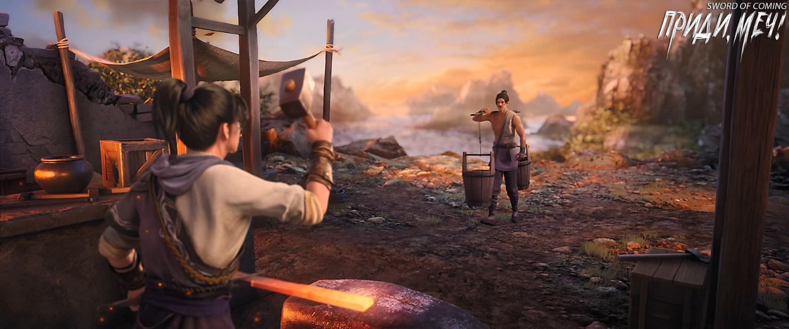
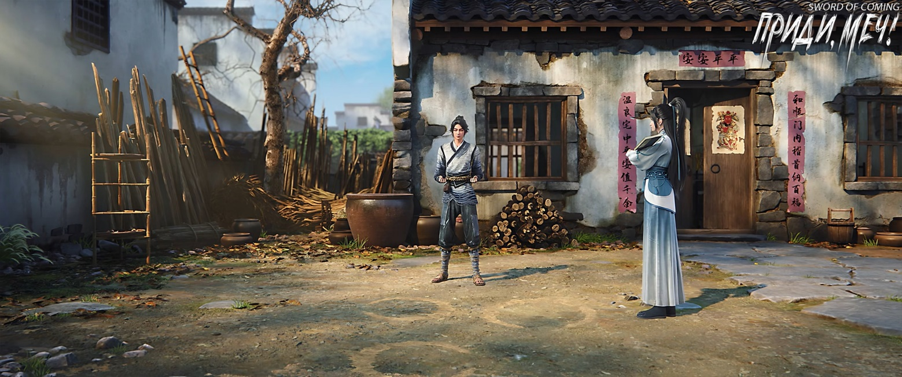
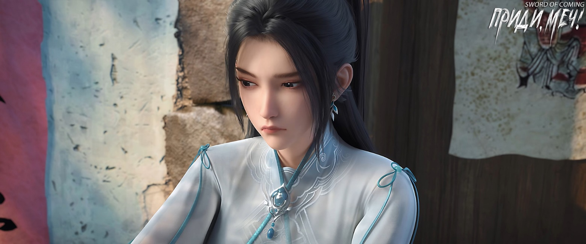

# Глава 41. Тренировка кулачного искусства

Ночь была глубокой и темной. В канцелярию надзирающего чиновника Сун Чанцзин вернулся один. Юноша Сун Цзисинь уже отправился в переулок Глиняных Кувшинов, напоминавший собачью конуру, и мужчина не стал его удерживать. Проведя много лет полководцем на полях сражений, где мог спокойно храпеть среди гор трупов и морей крови, он не чувствовал, что задолжал своему предоставленному самому себе племяннику, который все эти годы жил не совсем подобающе своему знатному происхождению. Уже хорошо, что смог вернуться живым в столицу Дали.

Пожилой управляющий резиденции все это время ждал у ворот с фонарем в руках.

Сун Чанцзин первым переступил через порог приоткрытой боковой створки ворот и, широко шагая вперед, сказал:

— Не нужно меня провожать.

Пожилой управляющий молча кивнул, замедлил шаг и тихо удалился.

Здание канцелярии на улице Благоденствия и Достатка было построено без излишней роскоши, занимая территорию гораздо меньшую, чем владения семейств Лу и Ли. Предыдущий надзирающий чиновник по делам печей жил скромно и экономно, и местные богатеи не находили в этом ничего предосудительного.

Но Сун Чанцзин был особенным — родной брат нынешнего императора Дали по матери, он совершил беспрецедентный подвиг в расширении границ империи и был одним из лучших мастеров боевых искусств на Восточном континенте Водолея. Его появление было подобно дракону, переплывшему реку и вторгшемуся в маленькое озеро: местные воротилы, хоть и не испытывали особого страха, перед такой личностью, как Сун Чанцзин, непременно демонстрировали подобающее почтение.

Проходя мимо маленького двора, Сун Чанцзин заметил человека, который все еще читал при свете лампы. Тот сидел с безупречно прямой осанкой и даже в одиночестве сохранял безукоризненные манеры — воистину достойный благородный муж.

Сун Чанцзин, взмахнув широкими рукавами, быстро прошел мимо, и на его губах появилась насмешливая улыбка.

Много лет назад один юноша учился в Академии Созерцания Озера. Его каллиграфия была божественной и прославила его при дворе. Правитель Южной Вэй призвал его во дворец писать указы в боковом зале. Стояла суровая зима со снегом, и кисть замерзала, не давая писать. Император повелел более десяти дворцовым наложницам прислуживать юноше и согревать дыханием его кисти. Эта история быстро разлетелась по всему Восточному континенту Водолея и превратилась в прекрасную легенду. Только никто не задумывался: при такой строгости дворцовых запретов, когда ни император, ни евнухи, ни наложницы об этом не рассказывали, как простой народ мог узнать об этом?

Идя по темной тропинке, Сун Чанцзин внезапно громко расхохотался.

Одетый в простое чистое одеяние Сун Цзисинь вернулся в переулок Глиняных Кувшинов. Увидев, что ворота не заперты, он открыл дверь дома и заметил служанку Чжигуй, которая сидела на стуле в главном зале. Она дремала, прикрыв глаза и склонив голову набок. Когда голова наклонялась до определенного угла, она тут же выпрямлялась, а затем снова начинала клониться. Похоже, Чжигуй действительно устала. Сун Цзисинь наклонился и легонько потряс ее за плечо, мягко произнеся:

— Чжигуй, Чжигуй, проснись, быстрее иди спать в свою комнату, а то простудишься.

Сонная Чжигуй, протирая глаза, пробормотала:

— Молодой господин, почему вы так поздно вернулись?

Сун Цзисинь улыбнулся:

— Ходил к крытому мосту, путь неблизкий, поэтому задержался.

Заметив на Сун Цзисине незнакомое парадное одеяние, Чжигуй удивленно воскликнула:

— Ой? Почему молодой господин переоделся?

Сун Цзисинь, не желая развивать эту тему, сказал:

— Не будем об этом. Как твои успехи в чтении после того, как я одолжил тебе «Записи местного уезда»? Нужна ли моя помощь в обучении?

Чжигуй покачала головой:

— Не нужно.

Сун Цзисинь вернулся в свою совершенно темную комнату. Сняв верхнее одеяние, скинув сапоги и забравшись на кровать, он прошептал:

— Ван Чжу, Ван Чжу, так вот оно что.

Чжигуй вернулась в свою комнату, потушила свет и легла спать. Забравшись под одеяло, она издавала легкие звуки, словно тайком что-то ела. В конце концов она даже икнула от сытости.

※※※※

В кузнице, где ковали мечи, хотя Лю Сяньян еще и не стал официально учеником мастера Жуаня, всем было очевидно, что мастер высоко ценил этого высокого юношу. Иначе он не стал бы лично, рука об руку, обучать его ковке клинков. Теперь не каждому было позволено входить в тот ряд помещений для ковки мечей.

Во время полуденного отдыха какой-то молодой работник печей для фарфора подбежал к Лю Сяньяну и, подмигивая с многозначительным видом, сообщил, что его ищет некая красавица, превосходящая своей красотой всех дам с улицы Благоденствия и Достатка.

Лю Сяньян последовал за ним с улыбкой на лице, хотя на душе у него сразу стало тяжело.

И действительно, у колодца стояла стройная женщина, а вокруг множество крепких молодых мужчин, копающих колодец и таскающих землю, работали с особым усердием.

Как презрительно заметил бы молодой книжник Сун Цзисинь, Лю Сяньян и правда был неотесанным мужланом, но способность различать женскую красоту никак не зависела от умения читать и писать. Возможно, Лю Сяньян и не знал, что в общем понятии красоты существует особый вид, называемый «очаровательность», а сочетание благородства и обольстительности особенно пленяет душу.

Если разобрать иероглиф «очаровательный», то он изначально означает «женщина, которая красит брови».

У стоявшей перед ним женщины, чье имя и происхождение были неизвестны, брови были тонкими и изящными, словно усики мотылька, а лоб, подобно цикаде, был широким и правильной формы, гладким и полным.

Сегодня она пришла одна, без намерения устраивать разбирательство, и не похоже было, что собиралась злоупотреблять своим положением, отчего Лю Сяньян немного расслабился.

Лю Сяньян не отрицал, что лицо этой величественной и благородной дамы действительно было красивым. Раньше, случись ему встретить такую на улице, он, возможно, даже присвистнул бы ей вслед, но это вовсе не значило, что она могла тронуть его сердце. Девушка, к которой он питал чувства, раньше была той служанкой из переулка Глиняных Кувшинов, оставалась ею сейчас и останется в будущем.

Лю Сяньян повел красивую женщину к ручью и твердо произнес:

— Госпожа, если вы хотите убедить меня продать вам ту семейную ценность, я советую вам даже не заикаться об этом.

Женщина очаровательно улыбнулась:

— Не спешите отказываться. Позвольте мне объяснить вам все «за» и «против», а потом вы сможете принять решение.

Лю Сяньян сохранил невозмутимое выражение лица, притворяясь беспечным, хотя сердце его мгновенно ушло в пятки.

Вдалеке Жуань Сю сидела на корточках у порога кузницы с чашкой риса. Белый рис был насыпан горкой, возвышаясь над краями большой белой чашки. Проглотив «вершину горы», она с удовольствием обнаружила спрятанную под рисом тушеную свинину, и все ее лицо засияло от счастья. Она тайком повернулась спиной к мужчине, который медленно жевал на другом конце порога, и спросила:

— Отец, ты не собираешься разобраться с этой чужеземной теткой?

Мужчина глухо ответил:

— Не собираюсь.

Жуань Сю обеспокоенно сказала:

— Но ведь он твой будущий старший ученик здесь, не боишься, что он собьется с пути?

Мужчина равнодушно ответил:

— Тогда этому парню не повезет.

Жуань Сю недоуменно спросила:

— Отец, разве ты не пожалеешь об этом?

Она подумала: «Вот, например, когда видишь в лавке вкусные изысканные пирожные, и если нет денег — ладно, но когда есть деньги, купишь, а потом случайно уронишь на землю — тут точно заслуживаешь, чтобы в тебя пять молний ударило».

Мужчина ответил невпопад:

— Тушеная свинина вкусная?

Жуань Сю непроизвольно радостно закивала:

— Вкусная-вкусная!

Вдруг она напряглась всем телом. Отец установил правило, что ей можно есть мясное блюдо только раз в день, поэтому она притворилась, будто положила себе только белый рис, спрятав тушеную свинину внутри. Все для того, чтобы вечером можно было открыто съесть еще одну порцию мяса.

Она смущенно повернулась, высоко подняла белую чашку и с напускной уверенностью сказала:

— Там только один кусочек, я не нарушила правила!

Мужчина усмехнулся и спросил:

— А не жалко будет тот кусок тушеной свинины, что спрятан на дне чашки и который теперь не удастся съесть?

Жуань Сю слегка приоткрыла рот, словно громом пораженная, и душа ее погрузилась в отчаяние.

Мужчина продолжил сыпать соль на рану дочери:

— Если бы ты не совала нос в дела Лю Сяньяна, отец бы и закрыл на это один глаз.

Жуань Сю молча ела тушеную свинину маленькими кусочками, и было очевидно, что впредь ей придется быть более экономной.

Закончив есть, мужчина посмотрел в сторону ручья, где стояли женщина и юноша, и сказал:

— Пока этот парень не достигнет пятой средней ступени, отец не будет вмешиваться в его дела. Даже когда достигнет, я вмешаюсь раз или два, но не более того, всему есть предел. Счастье и беда не имеют дверей, все зависит от самого человека[1].

[1] «福祸无门，唯人自召» — пословица, означающая, что человек сам творец своей судьбы.

Жуань Сю раздраженно спросила:

— Почему бы не вмешаться?!

Мужчина недовольно ответил:

— Когда ученые берут учеников, а воины — последователей, это не то же самое, что главари банд набирают мелких прихвостней, чтобы потом в случае споров полагаться на численное превосходство в ссорах или драках. В конце концов, в моих глазах, будь то учитель и ученик или наставник и ученик — все они единомышленники. Тем более, Лю Сяньян пока даже не мой ученик.

Жуань Сю промолчала.

Мужчина вздохнул:

— Глупая дочка, знаешь, сколько людей только в этой отдаленной династии Дали? Более двадцати миллионов дворов! Со столькими людьми и их заботами, разве можно за всем уследить? Отцу предстоит в следующие шестьдесят лет принять управление городком от Ци Цзинчуня, так что и ты перестань слоняться без дела, сосредоточься на ковке мечей и фехтовании здесь у печи. Иначе, если попадешь в беду, мне вмешиваться или нет?..

Не дав отцу договорить, Жуань Сю выпалила:

— Не нужно вмешиваться.

Эта фраза чуть не довела мужчину до внутренних повреждений, сила ее воздействия была не слабее коронного приема некоего мастера меча.

Мужчину так и подмывало стукнуть по дубовой голове этой глупой дочери: разве может он не вмешиваться в ее дела? Мужчина загрустил.

Жуань Сю с «удивленным» лицом воскликнула:

— Ой, а на дне чашки откуда-то взялся еще кусок тушеной свинины. Ах, я ведь уже исчерпала сегодняшнюю норму, может, тебе отдать? Отец?

Мужчине не нужно было оборачиваться, чтобы почувствовать неуклюжую игру глупой дочери. Он обреченно произнес:

— Ладно уж, ешь. Будем считать, что сегодня ты съела только один кусок тушеной свинины. Только не забудь после обеда заняться ковкой, и больше не ленись.

На этот раз благодарность Жуань Сю была искренней:

— Отец, ты такой хороший!

Мужчина рассмеялся:

— Это тушеная свинина хороша, не так ли?

Жуань Сю опустила голову, зачерпнула ложку риса и тихо сказала:

— И отец тоже хороший.

Мужчина, сдерживая улыбку, подумал, что все-таки хорошо иметь дочь.

Вдруг раздался голос:

— Отец, а вечером можно еще один кусочек? Между двумя и тремя кусками разница небольшая, правда ведь? Раз ты молчишь, я считаю, что ты согласен!

Жуань Сю умчалась со скоростью молнии. Последнюю фразу она прокричала уже издалека.

Мужчина потер щеку и пробормотал себе под нос:

— Моя Сюсю думает только о еде.

※※※※

После того как Чэнь Пинъань закончил доставлять письма, пройдя через улицы и переулки, он купил завтрак и отнес его юной госпоже Нин в переулок Глиняных Кувшинов, после чего привычно занялся приготовлением лекарственного отвара.

Нин Яо сегодня была одета в новое темно-зеленое длинное платье, выглядевшее опрятно и строго. От природы обладая героической внешностью, в этом наряде и с длинным мечом у пояса она выглядела даже благороднее богатых юношей с улицы Благоденствия и Достатка и переулка Персиковых Листьев.

Нин Яо, поколебавшись, сказала:

— На данный момент, если ты действительно хочешь изучить «Руководство Сотрясающего горы», то прежде чем учить боевые позиции, тебе нужно сделать три вещи: стоять столбом, ходить столбом и спать столбом[2]. Последнее требует особого понимания точек накопления энергии и циркуляции ци, это трудно объяснить словами, так что пока об этом не будем. В любом случае, первые два упражнения не требуют особого природного таланта или физических данных. Если ты будешь честно следовать позициям, изображенным в руководстве, и продолжать практиковаться, это обязательно принесет пользу. Даже если это не позволит тебе достичь высот в боевых искусствах, укрепление тела и продление жизни вполне возможны.

[2] П/п.: Да, именно так, а не «ходить по столбам» или «спать на столбе». Это не упражнение на деревянных столбах, а особая техника передвижения с прямым корпусом в китайских боевых искусствах, при которой практикующий должен представлять себя «столбом» — двигаться прямо, крепко и устойчиво. Эта техника развивает устойчивость, координацию и силу ног.

Чэнь Пинъань поделился своей мыслью:

— А можно ли практиковать ходьбу столбом в ручье?

Нин Яо кивнула:

— Конечно. Начни с уровня колен, потом до пояса, и наконец до шеи.

Чэнь Пинъань продолжил ее мысль:

— А в конце разве не нужно погружаться полностью?

Нин Яо холодно усмехнулась:

— Что, хочешь тренировать задержку дыхания под водой и превратиться в тысячелетнюю черепаху или десятитысячелетнего краба?

Чэнь Пинъань смущенно замолчал.

Нин Яо сказала:

— Давай, я покажу тебе, как ходить столбом. Смотри внимательно!

Нин Яо попросила Чэнь Пинъаня отодвинуть стол, затем сделала шесть шагов вперед — три коротких и три длинных. Когда она тяжело опустила ногу на последнем шаге, казалось, что глиняный пол всего дома издал глухую вибрацию.

Нин Яо выполнила все на одном дыхании, внешне без видимых усилий. Ее движения были плавными, как течение воды, вызывая у Чэнь Пинъаня неописуемые чувства. Словно водопад, низвергающийся вниз — естественно и неизбежно, таящий в себе огромную силу. И в то же время подобно листу, кружащемуся в потоке ручья — гармонично и невероятно мягко.

Заметив растерянное выражение лица Чэнь Пинъаня, Нин Яо вернулась на исходную позицию и повторила движения.

Закончив, она повернулась и спросила:

— Понял? Попробуешь?

Чэнь Пинъань глубоко вздохнул и попытался повторить. Его качающиеся движения напоминали походку пьяного человека. Он остановился и почесал голову, явно понимая, что получилось не очень удачно.

— Еще раз! — строго произнесла помрачневшая Нин Яо.

После третьей попытки у Чэнь Пинъаня наметился небольшой прогресс, но лицо Нин Яо уже потемнело, как небо перед грозой.

Она не могла поверить, что на свете мог существовать такой бестолковый ученик, как Чэнь Пинъань, настолько лишенный понимания боевых искусств и обладающий такими ужасными природными данными!

У Нин Яо не было выбора. С самого детства она находилась на вершине пути меча — и по происхождению, и по врожденным талантам, и по проницательности. Поэтому она совершенно не понимала, как люди у подножия горы, находящиеся от нее на расстоянии в сто тысяч ли, шаг за шагом поднимаются вверх, и тем более не могла понять, почему они идут, спотыкаясь и шатаясь.

В конце концов Нин Яо совсем растерялась. Опасаясь, что не сдержится и выхватит меч, она внезапно нашла выход. Похлопав Чэнь Пинъаня по плечу, она через силу произнесла:

— Чэнь Пинъань, как говорится, «прочти сто раз, и смысл сам откроется». В боевых искусствах действует тот же принцип — если не получается почувствовать вкус после десятков тысяч повторений, делай сотни тысяч, миллион! Иди, собирай свои камни. Глупая птица должна вылетать первой[3]. Не отчаивайся, постепенно осваивай эту ходьбу столбом в ручье.

[3] «笨鸟先飞» — поговорка о том, что менее способным нужно начинать раньше и стараться больше.

Чэнь Пинъань подумал, что в этом действительно есть смысл.

Раньше он слышал от Сун Цзисиня выражение, похожее на то, что сказала юная госпожа Нин: «Прочитай десять тысяч свитков, и твоя кисть будет двигаться как по волшебству». Однако более правильным ему казались слова госпожи Нин: если десятков или сотен тысяч недостаточно, нужно практиковаться миллион раз.

Чэнь Пинъань с улыбкой выбежал из переулка Глиняных Кувшинов, по пути повторяя про себя «три коротких, три длинных» и пытаясь повторить походку Нин Яо по памяти.

В глубине души он говорил себе: «После миллиона повторений я, возможно, достигну начального успеха в практике боевых искусств».

Для освоения этого «Руководства Сотрясающего горы» начальной точкой был миллион повторений, и только после этого он, Чэнь Пинъань, получит право говорить о чем-то другом.

Нин Яо, сидя в одиночестве на пороге, пробормотала себе под нос:

— Почему у меня такое чувство, будто я вырыла огромную яму? Сможет ли этот парень выбраться из нее?

※※※※

П/п.: «Стояние столбом» — это базовая техника в китайских боевых искусствах, особенно в стилях внутренней алхимии, таких как тайцзицюань и цигун. Практикующий стоит неподвижно в определенной позе, напоминая столб. Это упражнение помогает развивать правильную осанку, укреплять ноги, усиливать циркуляцию ци (жизненной энергии) и улучшать общее состояние здоровья.

«Ходьба столбом» — техника передвижения в боевых искусствах, при которой практикующий должен представлять себя «столбом» — двигаться прямо, крепко и устойчиво. Это упражнение развивает координацию, равновесие и силу ног, а также способствует правильному переносу веса тела при движении.

«Сон столбом» или «сон в столбовой позе» — продвинутая техника в некоторых стилях боевых искусств и даосских практиках. Практикующий спит или медитирует сидя или стоя в определенной позе, сохраняя прямую осанку. Считается, что эта практика помогает восстанавливать энергию, улучшать циркуляцию ци во время сна и развивать способность сохранять осознанность даже в состоянии сна или глубокой медитации.