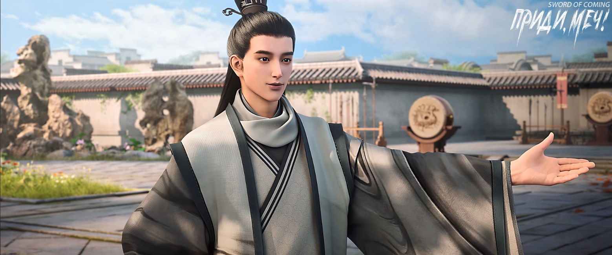
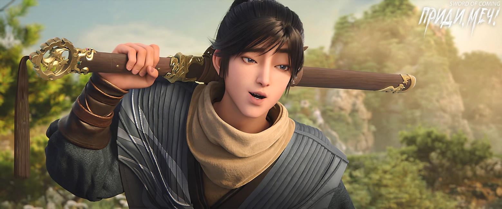
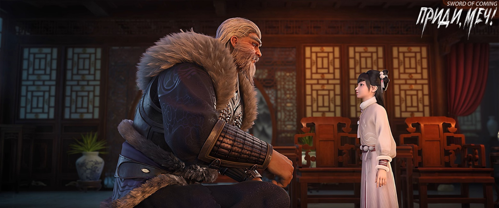
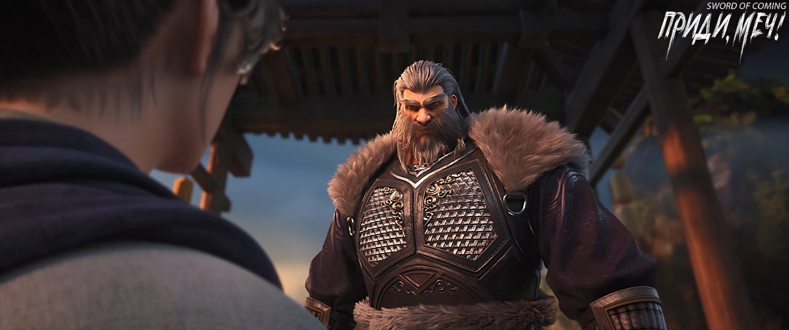
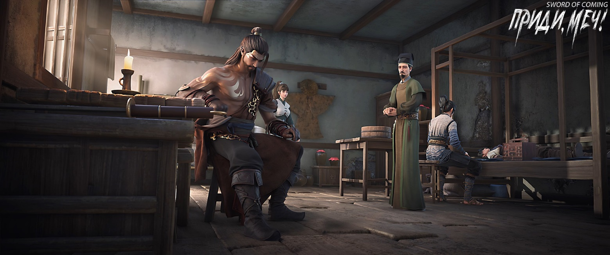
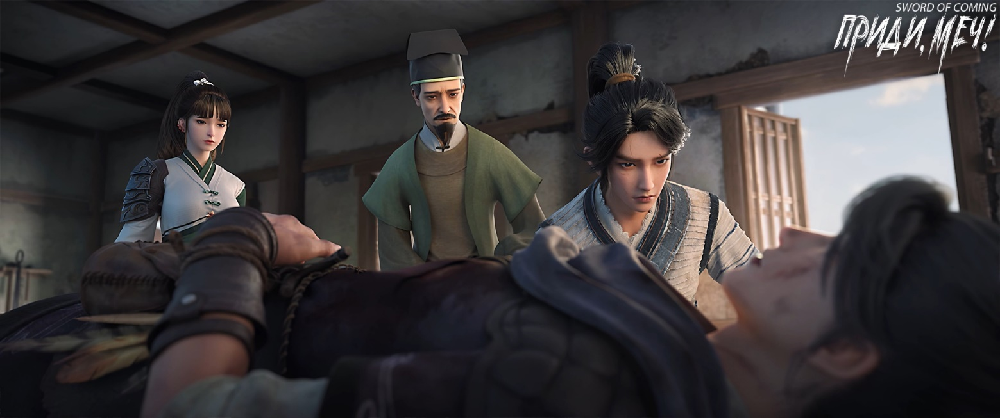
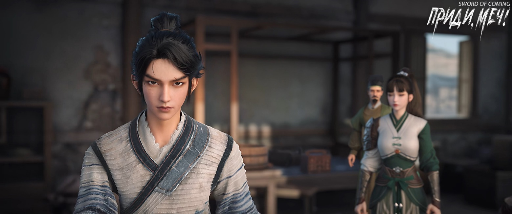

# Глава 45. Солнечный свет

В канцелярию надзирающего чиновника прибыли двое покрытых дорожной пылью путников. Оба были молоды, лет двадцати, прекрасны, как кипарис и сосна, — первейшие красавцы. Услышав, что они пришли навестить господина Цуя, привратник даже не спросил их личности, а поспешно проводил в усадьбу, к отдельному двору, где временно проживал господин Цуй. Помог постучать в дверь и почтительно удалился.

Открывший дверь был тем самым благородным мужем, представлявшим конфуцианство и пришедшим сюда требовать предмет, приносящий победу. В молодости он получил прозвище «господин, чистящий кисти» и всегда считался единственным кандидатом на пост будущего главы Академии Созерцания Озера. Увидев двух молодых людей, он испытал и радость, и удивление. Глядя на одного из них, прислонившегося к дверному косяку, он с улыбкой спросил:

— Бацяо[1], кто этот друг рядом с тобой?

[1] Лю Бацяо (刘灞桥). Имя буквально означает «Мост через реку Ба».

Молодой человек, названный Бацяо, с озорной улыбкой ответил:

— Этот молодой человек — отпрыск семьи Чэнь из округа Драконового Хвоста династии Великая Юн. Брат Цуй, можешь звать его Сунфэн[2]. Этот тип равнодушен к красоте и вину, у него только одна страсть — каменные тушечницы. Он услышал, что в здешних ручьях есть несколько старых карьеров, вот и решил попытать удачу. С нами также путешествует его дальняя родственница. Если бы не она, мы с Сунфэном прибыли бы в городок на два дня раньше. Она не любит общаться с людьми и пошла гулять по городку сама. Эх, жаль, жаль! По дороге сюда я услышал, что один принц из Великой Суй получил невероятную удачу — добыл золотого карпа-дракона, в будущем есть большие шансы, что он выйдет в реку драконом. У меня аж глаза покраснели от зависти. Брат Цуй, посмотри, все в красных прожилках, правда?

[2] Чэнь Сунфэн (陈松风). Имя означает «сосновый ветер».

Молодой человек придвинулся к конфуцианскому благородному мужу, тот со смехом отстранил его голову пальцем и напомнил:

— Лю Бацяо, раз уж задержался в пути, быстрее займись делом. Зачем попусту тратить время у меня? Когда это сад Ветра и Грома стал таким нерасторопным?

Отпрыск семьи Чэнь из округа Драконового Хвоста с виноватым видом горько усмехнулся:

— По дороге случилось неожиданный конфликт. Брат Бацяо повредил энергетические полости внутренних органов, служащие комнатой для взращивания меча. Пришлось рискнуть и переместить «меч судьбы» в полость Светлого Зала[3]. Если бы не моя слабая культивация, из-за которой я стал обузой, брат Бацяо не получил бы ранения.

[3] П/п.: Интересная информация по аспектам культивации в конце главы.

Лю Бацяо громко рассмеялся:

— Всего лишь несколько подозрительных бродячих практиков! Только благодаря своим грязным приемам им повезло ранить вашего молодого господина. В любом случае, они уже стали призраками под моим мечом, не стоит о них и упоминать! Если бы я не спешил в путь, я бы соорудил им несколько символических могил, поставил надгробия и написал, что такого-то года, такого-то месяца, такого-то дня они пали от меча Лю Бацяо. В будущем, когда я стану первым мастером меча, эти места, возможно, даже станут достопримечательностью, как думаешь?

Конфуцианский благородный муж давно знал этого гениального мастера меча из сада Ветра и Грома и был знаком с его природной легкомысленностью. Он провел обоих во двор, и Лю Бацяо внезапно понизил голос:

— Брат Цуй, скажи мне правду, небо и земля здесь вот-вот рухнут? Учитель Ци, изгнанный в эти места из Академии Горного Утеса, действительно намерен пойти против воли небес?

Ученый по фамилии Цуй сделал вид, что не слышал.

Лю Бацяо усмехнулся и указал на господина Цуя:

— Я уже понял.

Конфуцианский благородный муж как бы между прочим сказал:

— Сунфэн, раньше я навещал учителя Ци в школе, и когда учитель говорил о самосовершенствовании, он вздыхал, что «время не ждет».

Самосовершенствование, упорядочение семьи, управление государством, умиротворение Поднебесной — этот отпрыск семьи Цуй, обещающий стать мудрецом, остановился лишь на самосовершенствовании.

Чэнь Сунфэн поначалу думал, что это была просто вежливая беседа между учеными мужами, но, заметив взгляд собеседника, он моментально уловил намек и, сложив руки в почтительном жесте, произнес:

— Господин Цуй, я пойду поищу свою дальнюю кузину, а по возвращении попрошу вашего наставления в искусстве управления государством.

В своих словах Чэнь Сунфэн намеренно пропустил тему управления семьей, упомянув лишь об управлении государством.

Чэнь Сунфэн поспешно удалился. Ученый муж по фамилии Цуй вздохнул и сел за каменный стол во внутреннем дворике с Лю Бацяо.

Лю Бацяо, закинув ногу на ногу, прямо высказался:

— Этот Чэнь Сунфэн хоть и умен, схватывает на лету, но манеры у него никудышные. Мог бы хоть посидеть, поболтать с тобой немного, а потом уже идти. К чему так спешить за листом софоры? По-моему, это лишнее. Кроме рода Чэнь из округа Драконового Хвоста, какие еще именитые семьи остались на нашем Восточном континенте Водолея? Разве эти листья софоры достанутся кому-то из простолюдинов нашего городка, а не окажутся в кармане у Чэнь Сунфэна?

Род Чэнь на Восточном континенте Водолея, представленный семьей из округа Драконового Хвоста, считался самым почитаемым. Хотя они и пребывали в забвении долгое время, но, как говорится, «даже дохлый тощий верблюд больше лошади»[4]. Несмотря на утрату былого величия, они оставались тысячелетним могущественным кланом, породившим множество выдающихся героев. Поэтому даже такие процветающие школы, как сад Ветра и Грома, где состоял Лю Бацяо, не смели их недооценивать, и даже такие люди, как Лю Бацяо, были готовы водить с ними дружбу, считая их почти равными.

[4] «瘦死的骆驼比马大» — даже дохлый верблюд больше лошади. Метафора учит не недооценивать тех, кто временно ослаблен, но обладает внутренним потенциалом, а также напоминает, что исходные преимущества (размер, опыт, ресурсы) часто сохраняют значение даже в упадке.

Ученый муж с любопытством спросил:

— Ты пришел сюда искать мастера Жуаня, чтобы попросить его выковать для тебя меч?

Лю Бацяо начал мямлить что-то невнятное. Суть была в том, что он выполнял поручение для школы, и если бы справился, сад Ветра и Грома походатайствовал бы за него перед мастером Жуанем насчет ковки меча. Что же касается самого поручения, Лю Бацяо, похоже, было неловко о нем говорить.

Ученый муж добавил:

— Знаешь ли ты, что с горы Истинного Ян тоже прибыли люди, причем господин со слугой?

Лю Бацяо замер в изумлении:

— Я об этом даже не слышал! Кто же прибыл с горы Истинного Ян?

Затем этот известный своей заносчивостью молодой мастер меча из сада Ветра и Грома закрыл глаза, сложил ладони и начал бормотать молитву:

— Только бы не несравненная фея Су, умоляю, пусть это будет не она! Иначе как мне быть — обнажать меч или нет? Стоит фее Су взглянуть на меня, как я растаю, и как тогда смогу призвать свой летающий меч…

Ученый муж с некоторым разочарованием ответил:

— Не беспокойся, это не твоя возлюбленная фея Су, а горный страж — белая обезьяна, которая сопровождает драгоценную внучку Тао Куя[5], патриарха меча с горы Истинного Ян.

[5] Тао Куй (陶魁). Фамилия «Тао», может означать «гончарное дело, керамика». Имя «Куй» — лидер, глава, выдающийся человек.

— Старина Цуй, ты мой счастливый талисман! Раз это не фея Су, все прекрасно! — Лю Бацяо тут же принялся скакать от радости и расхохотался. — Чего мне бояться?! Неужели я испугаюсь какого-то старого зверя?! Наш сад Ветра и Грома может бояться кого угодно, но только не гору Истинного Ян!

Ученый муж поколебался:

— Сад Ветра и Грома и гора Истинного Ян имеют общие корни в истинной традиции меча, почему же нельзя разрешить этот смертельный узел?

Лю Бацяо перестал шутить и мрачно произнес:

— Цуй Минхуан[6], когда будешь в Саду Ветра и Грома, ни в коем случае не произноси ни слова об этом.

[6] Цуй Минхуан (崔明皇). Имя можно интерпретировать как «просвещенный император». Претензия на величие.

Цуй Минхуан глубоко вздохнул.

Между садом Ветра и Грома и горой Истинного Ян, от патриархов-мастеров меча до только что вступивших в школу учеников, часто даже не требовалось повода для ссоры — при встрече они сразу обнажали мечи.

Вдруг к воротам двора спешно подбежали привратник и пожилой управляющий канцелярии. Цуй Минхуан и Лю Бацяо одновременно поднялись.

Управляющий вошел во двор, поклонился и сказал:

— Господин Цуй, только что пришла весть — люди с горы Истинного Ян напали на юношу по имени Лю Сяньян.

Лю Бацяо внезапно пришел в ярость:

— Какого именно Лю Сяньяна?!

Управляющий относился к господину Цую с большим почтением, но этого незнакомого молодого господина старик совершенно не боялся и спокойно ответил:

— Докладываю молодому господину, в нашем городке только один человек носит имя Лю Сяньян.

Лицо Лю Бацяо резко изменилось, и он холодно усмехнулся:

— Ну и ну, гора Истинного Ян, это уже слишком!

Цуй Минхуан сохранял спокойствие:

— Учитель Ци вмешался?

Управляющий покачал головой:

— Пока нет. Говорят, юношу отнесли в оружейную лавку мастера Жуаня. Думаю, если он еще не мертв, то едва дышит. Люди видели своими глазами, как ему одним ударом проломили грудь — разве можно выжить после такого?

Цуй Минхуан слегка улыбнулся:

— Благодарю почтенного за известие.

Пожилой управляющий поспешно замахал руками:

— Что вы, что вы, это мой долг. Прошу прощения за беспокойство, господин Цуй.

После того как управляющий удалился вместе с привратником, Цуй Минхуан увидел, как Лю Бацяо тяжело опустился на каменную скамью, и с недоумением спросил:

— Неужели ты пришел именно из-за этого юноши?

Лицо Лю Бацяо то темнело, то светлело:

— Наполовину. Теперь будут большие проблемы, очень большие.

Цуй Минхуан спросил:

— Дело не только в вражде между садом Ветра и Грома и горой Истинного Ян?

Лю Бацяо кивнул:

— Далеко не только.

Цуй Минхуан сидел, спрятав руки в рукава, и тихо произнес:

— «Дерево хочет покоя, но ветер не утихает»[7]. Похоже, мне действительно пора отправляться забрать тот четырехгранный церемониальный жезл, даже если учитель Ци решит, что наша Академия Созерцания Озера пользуется чужой бедой.

[7] «树欲静而风不止». Метафора отражает противоречие между желанием человека обрести стабильность, гармонию или покой и непрерывным воздействием внешних обстоятельств.

Цуй Минхуан встал:

— Я схожу в школу и скоро вернусь.

Покинув резиденцию надзирающего чиновника на улице Благоденствия и Достатка, он проходил мимо двенадцатиколонной мемориальной арки и остановился, подняв голову к табличке с четырьмя иероглифами «В гуманности нельзя уступать».

Под солнечными лучами Цуй Минхуан прикрыл лоб рукой. После минутного колебания он неожиданно развернулся и вернулся в канцелярию.

※※※※

На улице Благоденствия и Достатка статный старик с белыми волосами вел за руку девочку с изящным, словно у фарфоровой куклы, личиком. Они не стали заходить в большой особняк семьи Лу, а направились к дому семьи Ли. У входа их уже ждали и проводили внутрь. В главном зале под табличкой «Павильон Сладкой Росы» поднялся величественный старик и, выйдя к дверям, сложил руки в приветствии:

— Ли Хун[8] приветствует почтенного Юаня.

[8] Ли Хун (李虹). Имя можно интерпретировать как «Слива, озаренная радугой» или «Яркий, как радуга, и стойкий, как слива». Символ надежды/преображения.

Старая обезьяна с горы Истинного Ян небрежно кивнул главе семьи Ли, отпустил руку девочки и, наклонившись, мягко произнес:

— Юная госпожа, ваш старый слуга будет ждать вас на вершине горы.

Девочка села на порог главного зала, надувшись и храня молчание.

Глава семьи Ли тихо сказал:

— Почтенный, не беспокойтесь, наша семья Ли непременно обеспечит безопасный выезд юной госпожи Тао из городка.

Старая обезьяна хмыкнул:

— За эту помощь в заботе о юной госпоже гора Истинного Ян будет в долгу перед вами. Позвольте мне поговорить с юной госпожой.

Ли Хун немедленно покинул главный зал и приказал всем членам семьи не приближаться к павильону Сладкой Росы.

Старая обезьяна тоже сел на порог и, поразмыслив, сказал:

— Юная госпожа, некоторые вещи не следовало бы вам говорить, но раз уж дело дошло до этого, нет смысла дальше скрывать, и ваш старый слуга расскажет вам все. Этот визит в городок, скорее всего, — тщательно спланированная ловушка. Та женщина из семьи Сюй из города Чистого Ветра точно замешана, хотя вряд ли она самая важная фигура. Коварство этой ловушки в том, что даже если ваш старый слуга и догадывался о ней, у него не было выбора, кроме как в нее попасть. Вы не знаете, но владелец того «Канона Меча» был когда-то отступником, предавшим путь меча горы Истинного Ян, и создал его сам. По словам вашего дедушки, самое ценное в этом каноне то, что хотя его создатель в итоге лишь коснулся порога мастерства меча, содержание канона указывает прямо на великий путь. Подумайте, юная госпожа, даже патриарх семьи Се, дружественной нашей горе Истинного Ян, с его невероятным кругозором, оценил этот канон как «выдающийся».

Далее голос старой обезьяны стал немного холоднее:

— А этот гений меча, предавший учителя и предков, в безвыходном положении примкнул к нашему давнему врагу — саду Ветра и Грома, который действительно защищал его большую часть жизни. Он полжизни прожил как трус, а потом, чтобы подтвердить истинность канона, тайно покинул сад Ветра и Грома и искал встречи с несколькими великими мастерами меча, достигшими Дао, включая патриарха семьи Се. И хотя все они презирали его характер, но не могли не восхищаться содержанием канона. Патриарх семьи Се как-то сказал наедине, что канон объединяет духовные основы искусства меча обеих школ — горы Истинного Ян и сада Ветра и Грома, и если кто-то из одной стороны освоит его, то спор двух школ о превосходстве наконец разрешится.

Старая обезьяна мрачно добавил:

— Поэтому было бы лучше всего, если бы ваш старый слуга смог заполучить этот «Канон Меча» и передать его вам для изучения, юная госпожа. В крайнем случае, если мы с горы Истинного Ян не получим его, и он достанется молодым талантам из Старого Города Дракона или горы Облачной Зари, мы сможем это стерпеть. Но есть одно, в чем мы не можем уступить ни на шаг — нельзя допустить, чтобы эти псы из сада Ветра и Грома заполучили канон!

Лицо старой обезьяны исказилось от гнева:

— Юная госпожа, не забывайте, что в самой глубине сада Ветра и Грома, на площадке для испытания мечей, покоится патриарх нашей горы Истинного Ян — ваш прямой предок. Когда наша гора была в самом слабом положении, она отважно бросила вызов тогдашнему главе сада Ветра и Грома. После того как она достойно пала в бою, сад Ветра и Грома не только не вернул ее тело горе Истинного Ян для погребения, но оставил его на солнцепеке, да еще и воткнул в ее голову меч одного из своих мечников, намеренно выставив на всеобщее посмешище! Триста лет, целых триста лет, несмотря на множество признанных талантов горы Истинного Ян, мы не можем вытащить даже один меч сада Ветра и Грома! Поколение за поколением мастеров меча нашей горы несут это невыносимое унижение. Пока гора Истинного Ян не уничтожит сад Ветра и Грома, мы будем посмешищем всего Восточного континента Водолея.

— Почему же ни один патриарх нашей горы после достижения статуса мастера меча не желает устраивать праздник и объявлять об этом всему миру?!

Эти давние истории маленькая девочка, конечно, знала наизусть, уши уже мозолями покрылись от них.

Но когда об этом рассказывали родные и старшие, они старались говорить об этой вражде как можно более спокойно и отстраненно, совсем не так, как сейчас изливал свой гнев старая обезьяна.

Девочка по-детски спросила:

— Дедушка Юань, почему ты просто не убил одним ударом этого упрямого юношу? Пусть даже его энергетические каналы теперь разорваны, ци разрушена и хаотична, и «Канон Меча» естественным образом уничтожен вместе с ним так, что даже небожители не смогли бы его восстановить. Но ведь «бояться надо не одного, а десяти тысяч»[9]! Вдруг его спасут? Вдруг кто-то добудет свиток? Что тогда будет с нашей горой Истинного Ян?

[9] «不怕一万就怕万一» — идиома, аналог «береженого бог бережет» или «лучше перестраховаться».

Способ передачи этого канона был крайне особенным и таинственным, его нельзя было передать словами. Тот отступник с горы Истинного Ян оставил в телах своих потомков переходящую из поколения в поколение сущность меча, которая ждала появления потомка с выдающимся талантом, способного овладеть этой сущностью, содержащей знания канона. Поэтому если Лю Сяньян умрет, то и его покупатель фарфора, и сад Ветра и Грома окончательно лишатся шансов. Этот никогда по-настоящему не явленный миру «Канон Меча» исчезнет, как дым.

На лице старой обезьяны появилась улыбка:

— Если бы ваш старый слуга убил этого юношу на месте, его бы тут же выдворили из этого маленького мирка. Как тогда быть с юной госпожой? Неужели ей пришлось бы в одиночку противостоять людям из сада Ветра и Грома? К тому же, здесь запрещены любые духовные искусства. Мастер Жуань умеет ковать мечи и убивать, но вот в искусстве исцеления он, прямо скажем, не силен. Что касается Ци Цзинчуня, он точно не станет вмешиваться — сейчас он сам как глиняный Будда, переходящий реку, едва может о себе позаботиться. А если ваш старый слуга по-настоящему разозлится, он просто примет свой истинный облик. Посмотрим тогда, выдержат ли небеса этого мира мою тысячесаженную истинную форму!

Старая обезьяна поднялся, излучая внушительную ауру:

— Юная госпожа, о юноше с крытого моста можно больше не беспокоиться. Позвольте вашему старому слуге расправиться с людьми из сада Ветра и Грома, а затем ждать вас у входа на той горной вершине. Если Ци Цзинчунь окажется благоразумным, пусть наблюдает со стороны. Но если он посмеет вмешаться, я разобью его вдребезги. Даже если появится мастер Жуань, я буду биться с ним до конца — тогда этот визит точно не будет напрасным!

Девочка задумалась и ярко улыбнулась:

— Дедушка Юань, иди, не волнуйся за меня.

Старая обезьяна беззаботно рассмеялся:

— А юной госпоже тем более не стоит тревожиться о своем старом слуге.

※※※※

В комнате оружейной лавки у ручья стоял тяжелый запах крови. Слуги выносили тазы с окровавленной водой и приносили обратно чистую.

Старик, которого Жуань Сю притащила, как цыпленка — владелец аптеки семьи Ян — сидел на маленькой табуретке у окна. Смыв кровь с рук и вытерев выступивший на лбу пот, он поднял голову и безнадежно покачал ею:

— Мастер Жуань, раны этого юноши слишком тяжелы. Если бы это было за пределами городка…

Мастер Жуань, скрестив руки на груди, хмуро произнес:

— Не говори лишнего.

Управляющий Ян мог только горько усмехнуться. Он действительно сказал лишнее — за пределами городка его помощь вообще бы не понадобилась.

Девушка в зеленом одеянии, Жуань Сю, пристально смотрела на лист софоры на лбу юноши — потускневший, хоть и зеленый, но без малейшего признака жизненной силы. Она резко повернулась и гневно спросила:

— Разве не говорили, что если Чэнь Пинъань отдаст свой лист софоры, у Лю Сяньяна будет хотя бы половина шанса выжить?

Старый управляющий аптеки семьи Ян вздохнул:

— Если бы владелец листа софоры сам получил такие раны и принял благословение предков через лист, шанс на спасение действительно составил бы пятьдесят процентов. Но когда благословение используется для другого человека — это совсем иное дело.

Жуань Сю в ярости воскликнула:

— Ян! Почему же ты раньше говорил чепуху о пятидесятипроцентном шансе?! Почему не сказал сразу?!

Управляющий Ян с несчастным видом, крайне обиженно ответил:

— Если бы я тогда не сказал так, боюсь, юноша бы еще не умер, а вы бы меня уже забили до смерти.

Жуань Сю побелела от гнева и только собралась разразиться бранью, как мужской голос строго произнес:

— Сюсю, не смей грубить управляющему Яну.

Жуань Сю стиснула зубы и замолчала.

Помолчав некоторое время, мужчина бросил взгляд на застывшего, словно деревянный столб, старого управляющего и вдруг, как весенний гром, разразился бранью:

— Управляющий Ян, какого черта ты торчишь тут как бревно?! Жить надоело?!

Столкнувшись с таким отцом и дочерью, управляющий Ян был готов расплакаться, но не смел выказать и тени недовольства. Он лишь продолжал свое безнадежное дело.

Все это время Чэнь Пинъань не кричал и не рыдал, а только раз за разом выносил тазы с водой и возвращался, меняя кровавую воду на чистую.

Спустя четверть часа управляющий аптекой Ян, дойдя до крайней степени раздражения, посмотрел на таз с чистой водой, с силой ударил по воде ладонью, подняв брызги, и в отчаянии обратился к мастеру Жуаню:

— Мастер Жуань! Лучше сразу убейте меня мечом! Я всего лишь продавец лекарств, а не чудотворный целитель, воскрешающий мертвых!

Кузнец медленно нахмурился.

Управляющий Ян тут же втянул голову в плечи.

Наконец заговорил Чэнь Пинъань:

— Управляющий Ян, попробуйте еще раз.

Управляющий Ян повернулся к Чэнь Пинъаню. Тот смотрел чистым взглядом и с легким нажимом повторил:

— Попробуйте еще раз!

Управляющий Ян выдохнул и с сочувствием сказал:

— Дитя, я действительно бессилен.

Чэнь Пинъань с трудом выдавил улыбку:

— Управляющий Ян, прошу вас.

На изможденном лице управляющего Яна отразилась усталость, и он снова покачал головой.

Последний проблеск надежды в глазах Чэнь Пинъаня угас.

Он опустился на колени, поставил таз, сел у кровати и взял уже остывающую руку Лю Сяньяна. С улыбкой, больше похожей на гримасу рыдания, он тихо произнес:

— Я вернусь.

Чэнь Пинъань встал и направился к выходу. У порога он вдруг обернулся и отвесил глубокий поклон отцу и дочери Жуань и старому управляющему, трудившимся все это время.

Переступив порог, Чэнь Пинъань зажмурился от яркого солнца, помедлил мгновение и широко зашагал вперед.

«Если Небеса не дают справедливости — ничего! Я сам ее возьму. Сколько смогу — столько и будет».

※※※※

[3] П/п.: Дополнительная информация по аспектам культивации,

养剑室 — досл. «комната для взращивания меча». В практике культивации — специальная область тела (часто связанная с энергетическими каналами внутренних органов), где меч «питается» ци владельца, усиливая связь с носителем.

脏腑窍穴 — досл. «полости органов цзан-фу», «энергетические полости внутренних органов». Цзан-фу — система внутренних органов в традиционной китайской медицине, включающая «плотные» (цзан: сердце, печень, селезенка, легкие, почки) и «полые» (фу: желудок, желчный пузырь, тонкий кишечник и др.). 窍穴 — энергетические точки/полости, связанные с этими органами. Повреждение таких точек критично для культиватора.

本命剑 — досл. «меч судьбы/жизненный меч». Оружие, связанное с «корнем жизни» (本命) владельца. Обычно выращивается внутри тела, питаясь ци хозяина. Перемещение его в другую полость — рискованный шаг, нарушающий энергетический баланс.

明堂窍 — досл. «полость Светлого Зала» или «Минтан». 明堂 — в даосизме и медицине: область между бровями («третий глаз»), считающаяся центром духовной силы. 窍 — полость/проход, энергетический узел (не путать с меридианами или акупунктурным точкам). Перемещение меча сюда может временно стабилизировать его, но чревато обратными эффектами (например, давлением на сознание).