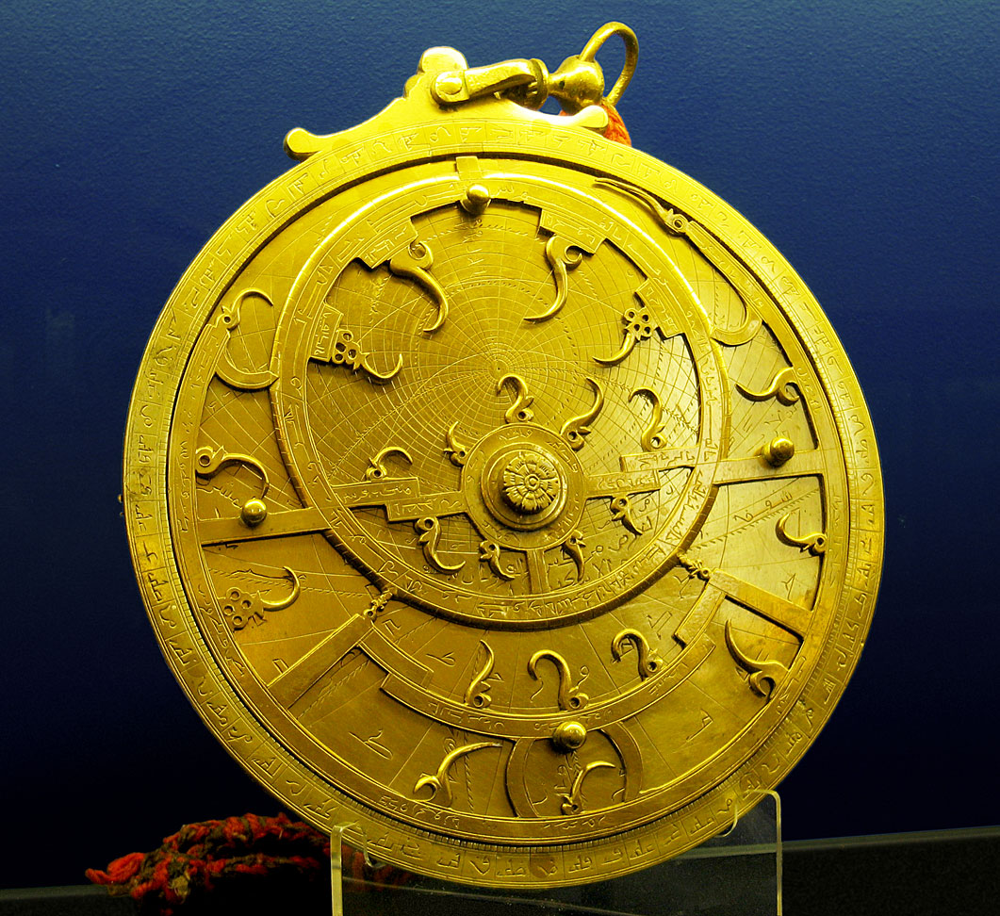
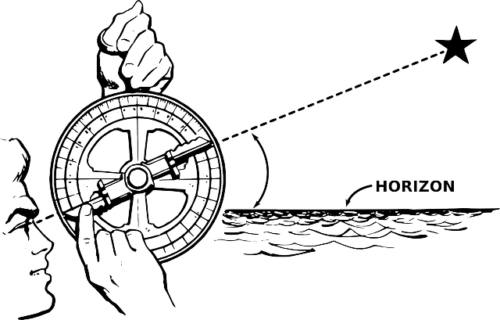

# Глава 189. Ужасные последние годы Небесного Мастера

— Так ты все-таки решил пойти туда? — Старик Чжан уже понял намерения Е Фаня и знал, что ничто не сможет его остановить. Вздохнув, он сказал: — Подожди минутку.

Он вошел в каменный домик и вскоре с трудом вытащил большой старый деревянный сундук, пожелтевший от времени — явно древнюю реликвию.

— Что это? — полюбопытствовал Е Фань.

— Тысячу лет назад наш предок тщательно готовился перед тем, как войти в Фиолетовую гору. Это вещи, которые он оставил.

Старик Чжан отодвинул железный замок и открыл сундук, из которого повеяло затхлым запахом гнили — неудивительно, ведь прошли столетия, и содержимое частично истлело.

— Это же… — первое, что увидел Е Фань, был каменный доспех, собранный из нанизанных кусочков камня, простой и неприметный, но аккуратно сложенный. — Для чего он?

Этот каменный доспех был искусно сделан, над ним явно хорошо поработали.

Старик Чжан бережно вынул каменный доспех и провел по нему рукой.

— Его собственноручно изготовил наш предок тысячу лет назад. Он взял один комплект с собой, а второй оставил здесь.

Е Фань взял каменный доспех в руки, но не почувствовал в нем ничего особенного. Это была та самая каменная корка, в которой обычно находятся источники. Такая каменная кора может блокировать духовное чутье культиваторов, не позволяя им проникнуть внутрь. Поэтому пока его не разобьешь невозможно разгадать, содержится ли в том или ином куске руды ценный ресурс. Отсюда и возникла практика ставок на камни.

Е Фань был уверен, что при желании он с легкостью сможет раздробить эту каменную кору. Такой доспех бесполезен для него.

— Не стоит недооценивать этот каменный доспех. Это не просто вещь, в нем заключена могущественная духовная сила, — сказал старик Чжан, словно прочитав его мысли.

— В нем есть духовная сила? — Е Фань снова тщательно ощупал доспех, но не почувствовал в нем ничего особенного.

— Это не обычная каменная кора, — старик Чжан провел рукой по доспеху, неохотно его отпуская. — Это кора, отслоившаяся от Божественного Источника, материал, позволяющий Небесному Мастеру видеть суть вещей.

— Эта старая кора покрывала Божественный Источник? — Е Фань поднес доспех поближе, но все равно ничего не увидел.

— То, что понятно одному, может быть неясным для другого. Ты культиватор и не понимаешь, насколько ценен такой каменный доспех. — Старик Чжан развернул доспех. — Каждый рудокоп мечтает обладать таким. Ведь постоянно работая под землей, легко столкнуться с неприятностями, а этот доспех способен отгонять нечисть и защищать от скверны.

Е Фань кивнул, вспомнив о своем пребывания в рудном районе Мерцающего Света, где произошло несколько таинственных событий. Он отлично знал об имеющихся там опасностях.

— Кора Божественных Источников обладает уникальной духовной силой, способной отвращать нечистое…

Как объяснил старик Чжан, эта кора так долго пребывала в симбиозе с Божественным Источником, что впитала его духовную силу и теперь могла притягивать благоприятное и отталкивать зловредное.

В старом деревянном сундуке также был каменный шлем, полностью закрывающий лицо.

— Ты обязательно должен надеть их и скрыть все следы своего присутствия. Возможно, они недостаточно прочные, но смогут изолировать тебя от внешнего мира и, быть может, помогут избежать зловещих существ Фиолетовой горы, — серьезно наставлял старик Чжан.

В сердце Е Фаня зародилась тревога:

— Разве могучие древние существа не были запечатаны внутри Божественных Источников?

— О том, что происходит на Фиолетовой горе, никто не может сказать наверняка. Лучше перестраховаться. Хотя, честно говоря, я все равно не хочу, чтобы ты рисковал.

— На самом деле, я не собираюсь углубляться в Фиолетовую гору, а лишь хочу найти «Небесную Книгу» и сразу же выйти оттуда. Я не желаю беспокоить каких-либо древних существ, — с сомнением произнес Е Фань.

— А еще возьми этот каменный амулет, — старик Чжан достал из сундука каменную подвеску. — Он изготовлен моими предками. Если демоны действительно обратят на тебя внимание, он может оказать удивительное действие.

Старик Чжан также вытащил каменный нож. Деревянные ножны уже истлели, и как только он вынул клинок, они рассыпались. Нож был всего чуть больше полуметра длиной, с выгравированным на нем солнцем, луной, звездами и еще какими-то странными узорами.

— Под землей ты можешь увидеть непонятные, причудливые вещи. Если нет крайней необходимости, ни в коем случае не вступай в бой, — серьезным тоном произнес старик Чжан. — Будь то призраки или что-либо еще, если они не нападают первыми, считай их иллюзией и используй этот нож, чтобы пробиваться дальше.

Речи старика Чжана начали беспокоить Е Фаня. Раньше он не придавал им значения, но теперь засомневался.

В завершение старик протянул ему астролябию[1].

[1] Астролябия (星— звезда, 盘— диск, плита, тарелка). Это инструмент с единственной функцией — измерения высоты Солнца или звезд над горизонтом. Двигая и совмещая несколько пластин с криволинейными шкалами, можно предсказать, как будут выглядеть звезды на небе в определенный момент, или наоборот: по их положению определить свое положение на местности. Использовалась моряками для навигации. Словами не описать, лучше увидеть эту красоту.

— Этот инструмент передавался в нашем роду из поколения в поколение и содержит мощную силу звездных духов. Бережно храни его — в критический момент астролябия может пригодиться. Если ты окажешься в адском руднике, она поможет тебе найти выход.

Е Фань немного растерялся.

— Дедушка Чжан, вы поддерживаете меня или пугаете? Чем больше вы говорите, тем больше я нервничаю!

Каменный доспех, подвеска, нож и астролябия были вырезаны из древней коры Божественных Источников. Хотя они не выглядели особенными, старик утверждал, что в них заключена духовная сила.

— А что стало с вашим прародителем, тем самым Небесным Мастером? Он мирно встретил старость в этом поселении?

Ранее Е Фань уже спрашивал о судьбе Небесного Мастера, но старик ответил уклончиво, лишь упомянув, что поздние годы Мастера были омрачены неким роковым событием из-за слишком глубокого проникновения в тайны источников.

— Его жизнь и смерть — загадка, — покачал головой старик.

— Что же произошло в действительности?

— В те века на севере один за другим появились пять Небесных Мастеров. В преклонном возрасте с ними происходили крайне загадочные события. Предок нашего семейства Чжан не стал исключением.

— Что за странные события? — допрашивался Е Фань.

— В старости он видел много нечистых вещей, которые были невидимы для других. Он говорил, что в итоге такова судьба всех Небесных Мастеров Источников.

— Нечистые вещи?! — удивился Е Фань.

— Да. В конце концов он исчез, неизвестно куда. В ту ночь, когда он ушел, поднялся красный песчаный вихрь, и раздавались ужасные стоны загадочных существ. Они выли всю ночь напролет.

— Послушайте, дедушка Чжан, меня не так-то просто запугать. Если хотите отговорить меня, лучше скажите прямо, незачем все это…

— Я не пугаю тебя. Все сказанное — правда. Прародитель семьи Чжан действительно исчез именно так. Святая дева из Нефритового Озера, узнав об этом, обошла весь северный регион ища его, но безрезультатно. В итоге она своими руками воздвигла ему могилу с памятником. — Старик вздохнул. — Он был удивительным человеком своей эпохи, вызывавшим зависть у всех великих святых земель. Но в старости умер такой необъяснимой смертью.

Е Фань испытывал смешанные чувства.

— Неужели не осталось никаких зацепок?

— В ту ночь рядом с предком находился четырехлетний ребенок из нашего семейства и он чуть не сошел с ума от страха, — покачал головой старик. — Лишь через полгода его вылечили. По его словам…

— Что рассказал тот ребенок? — спросил Е Фань, заметив, что старик замолчал.

— Он сказал, что в ту ночь увидел, как одна рука предка покрылась красным мехом. Также он видел, как за окном двигались человекоподобные существа. Стоило ему лишь отвернуться, как предок исчез навсегда.

— Дедушка, вам не стоит так запугивать людей. Вы же знаете, что я собираюсь к Фиолетовой горе…

— Это все передавалось из поколения в поколение в нашем роду. Я никогда ранее не рассказывал об этом посторонним, — покачал головой старик Чжан.

Е Фань содрогнулся, осознав, что север полон загадок, многие из которых, возможно, выходят за пределы воображения.

— Так каковы же истинные способности Небесных Мастеров?

— Ты имеешь в виду боевую мощь?

— Да, — кивнул Е Фань.

— В молодости мой предок сражался на равных с святой девой Нефритового Озера, — спокойно сказал старик Чжан.

Е Фань ахнул. Такого человека действительно можно назвать удивительным — будучи Небесным Мастером, он обладал подобной силой. Неудивительно, что в конце концов святая дева стала его возлюбленной.

— После становления Небесным Мастером можно определять путь Драконьих Жил и запечатывать Божественные Источники. Чтобы достичь этого, нужна колоссальная сила, — с восхищением произнес старик.

В конце концов, Е Фань все же отправился в путь.

— Братец Е, когда ты вернешься? — его провожал Ван Шу. Он не знал, что Е Фань идет к Фиолетовой горе, и думал, что тот просто уходит в дальнюю дорогу.

— Не волнуйтесь, я вернусь через несколько дней. Тогда мы все вместе отправимся играть в камни и выиграем у святых земель все, что они имеют, даже заполучим какую-нибудь святую деву.

— Ветер воет, воды реки Ишуй холодны, герой уходит и не вернется вновь…[2] — простодушно процитировал Эр Лэньцзы и помахал рукой.

[2] 风萧萧兮易水寒，壮士一去兮不复还…Эти строки происходят из древнекитайской поэмы «Песня о Цзин Кэ».易水 (Ишуй): название реки, берущей начало в уезде И провинции Хэбэй, которая была южной границей царства Янь в эпоху Воюющих царств. Слово «герой» здесь относится к Цзин Кэ. Эта фраза создает меланхоличную и торжественную атмосферу через описание завывающего ветра и холода реки Ишуй. Она выражает героический дух Цзин Кэ, отправляющегося на миссию по убийству императора Цинь, и его твердую решимость не возвращаться, пока задание не будет выполнено. Эта фраза воплощает вечные чувства, выходящие за рамки времени и пространства.

— Я… Из всего, чему я тебя учил ты запомнил только эту строчку? — Е Фань был поражен.

— Я боюсь, что ты не вернешься… — Эр Лэньцзы почесал голову.

Е Фань почувствовал, что не может сердиться на него, рассмеялся и помахал рукой на прощание, уходя и вскоре исчезая из виду.

Как объяснял старик Чжан, чтобы попасть в Фиолетовую гору, нужно углубиться в одну из девяти Драконьих Жил, а затем рассечь Фиолетовую гору под землей и проникнуть внутрь. В противном случае, если попытаться войти снаружи, это приведет к безвыходной ситуации.

Е Фань выбрал Драконью Жилу, идущую строго на восток, намереваясь углубиться через нее, ибо тысячу лет назад предок семьи Чжан прошел именно этим путем.

Он про себя повторял древний трактат, записанный на бронзовом гробу, и временами вырезал несколько иероглифов на своем котле. Он делал это на протяжении последних двух месяцев. Хотя иероглифы недолго оставались на котле и быстро исчезали, он не переставал их вырезать.

В настоящее время материнская ци была его главной опорой. Даже если пространство вокруг разрушится, укрывшись в котле, он сможет избежать катастрофы.

Величественные горные хребты преграждали путь подобно свернувшимся гигантским драконам. Высокие скалы были совершенно лысыми, красновато-коричневого цвета, без растительности, с легким фиолетовым оттенком, напоминая ту самую Фиолетовую гору поблизости.

Согласно словам старика Чжана, эта драконья жила была давно истощена, и под землей остался путь, ведущий прямо к Фиолетовой горе.

Е Фань не стал сразу пробивать землю и углубляться внутрь, боясь разрушений и опасаясь нежелательных последствий. Он терпеливо искал и в конце концов обнаружил древнюю шахту, куда много веков назад вошел предок семьи Чжан.

Е Фань облачился в каменное одеяние и тотчас ощутил полную герметичность, вся его энергия запечаталась внутри, не просачивалось ни капли.

Он взвалил на спину астролябию, сжал в руке каменный нож, повесил каменный амулет и плавно опустился в древнюю шахту. Втайне прикинув глубину, он был поражен — прежде чем достиг дна, пришлось опускаться целых три тысячи метров.

Древняя черная шахта была прорыта более ста тысяч лет назад и пропиталась духом времени. Здесь царила абсолютная тишина.

Е Фань ступал осторожно, не прибегая к божественным силам, а лишь шаг за шагом продвигаясь вперед и внимательно ощупывая все вокруг.

Все здесь было связано с древним императором. Тяжелое давление, с каким Е Фань ранее не сталкивался, заставляло его быть предельно осторожным.

Е Фань бесшумно прошел около километра, древняя шахта становилась все темнее и темнее.

«Что это?!» — внезапно он встревожился, услышав впереди взмахи крыльев и смутно разглядев приближающуюся человекоподобную фигуру.

— Я только пришел, а уже столкнулся с представителем древней расы? — в ужасе воскликнул Е Фань.