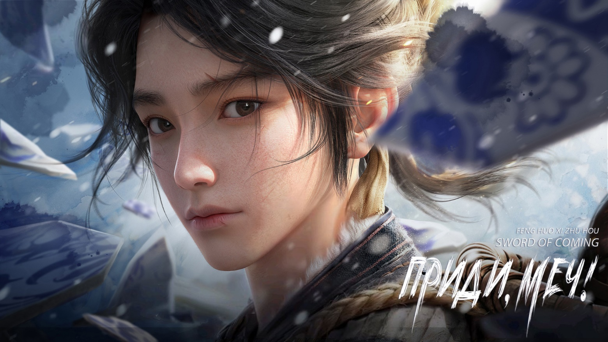

# Глава 00. Введение от переводчика и немного интересных фактов

Роман «Приди, меч!», также известный как «Цзянь Лай — 剑来», написан известным китайским автором Фэнхо Си Чжухоу (烽火戏诸侯).

«Обычный мальчик с духом воина отправляется в наполненное испытаниями путешествие, требующее мужества и отваги. Управляя стихиями и сталкиваясь с грозными противниками, он проходит через легендарные сражения. Его подвиги вдохновляют, символизируя его восхождение от скромных начал к исторической значимости».

Фэн Хо Си Чжухоу (псевдоним), настоящее имя — Чэнь Чжэнхуа (陈政华). Родился в 1985 году в уезде Чуньань, город Ханчжоу, провинция Чжэцзян (Китай). Член Союза писателей Китая, заместитель председателя Ассоциации сетевых писателей провинции Чжэцзян, председатель Ассоциации сетевых писателей г. Ханчжоу, член 12-го Национального комитета Всекитайской федерации молодежи. Его самые известные произведения:«极品公子» — «Молодой господин высшего сорта»; «陈二狗的妖孽人生» — «Чудовищная жизнь Чэнь Эргоу»; «老子是癞蛤蟆» — «Я — жаба»; «桃花» —«Цветы персика»;«天神下凡» —«Нисхождение небесного бога»;«雪中悍刀行» — «Снежный путь отважного клинка» (эпическое уся-фэнтези, его самый известный роман до «Меч, приди!»); «剑来» — «Меч, приди!».

Все его книги активно издаются, записываются аудиокниги, по ним снимают дорамы и анимацию. На данный момент 1 сезон «Меч, приди!» уже завершен, второй ожидается к концу 2025 года.

Аниматоры дунхуа акцентируют внимание на детализации боевых сцен и проработке духовных миров. Из-за высокой сложности анимации (особенно стилизованные под китайскую акварель пейзажи) и желания сохранить соответствие оригинальному роману, возможны задержки. Автор лично участвует в сценарной адаптации, что также замедляет процесс.

Фэнхо Си Чжухоу выбрал необычный литературный псевдоним, который можно перевести как «Дразнить князей сигнальными огнями» или «Играть с князьями, зажигая сигнальные огни».

Псевдоним отсылает к легенде о Бао Си (эпоха Западная Чжоу, XI век до н.э.): Царь Ю ради смеха своей наложницы Бао Си ложно зажигал сигнальные огни, чтобы князья с войсками спешили на помощь. Когда реальное вторжение произошло, князья не поверили огням, и династия пала. Эта история — символ глупой шутки с опасными последствиями, а также критики власти, пренебрегающей ответственностью.

Псевдоним отражает игру с традиционными сюжетами, сатиру на власть и человеческую глупость, провокационный стиль (как «ложные сигналы» в литературе).

Автор в принципе известен провокационными сюжетами — его романы часто ломают шаблоны жанра сянься. Политическими аллюзиями — например, в «Меч, приди!» герой бросает вызов несправедливым «богам» и системам. Игрой с читательскими ожиданиями — как те самые «ложные сигнальные огни».

На начало 2025 года выпущено 1200+ глав и около 200 дополнительных записей (бонусных). Ожидается, что серия «Приди, меч!» завершится в 2025 году, но точных сроков нет.

Когда Фэнхо Си Чжухоу составлял план для «Приди, меч!», он выдвинул два требования к книге:

Первая — это его собственное требование: построить целостный, логически последовательный мир сянься (仙侠, жанр китайского фэнтези о бессмертных и боевых искусствах). Несмотря на то, что это вымышленный мир, горести и печали, встречи и разлуки в этом произведении должны быть связаны с реальностью. Это должно вызвать у читателей ряд эмоциональных откликов, а ощущение погружения не должно уступать произведению на реалистичную тему.

Вторая задача — быть «не таким, как все». Фэнхо Си Чжухоу особо подчеркнул эти три слова (в китайском оригинале «不一样», «бу и ян», что означает «отличающийся», «особенный»).

※※※※

Хочу объяснить, почему я перевела название книги «剑来» как «Приди, меч!», а не «Меч грядущего», как уже «назвали» дунхуа. Слово 来 (приходить, происходить, наступать) является глаголом направления движения. 来 — индикатор того, что действие приближается к говорящему: кто-то приходит, прибегает, прилетает, грядет и прочее. За точку отсчета берется говорящий, и все, что движется к нему — это 来. Поэтому «剑来» можно перевести как «Приди, меч!» как действие, призыв к говорящему, либо «Призыв меча» — то есть движение куда-то по направлению к нам.

※※※※

Название романа «Меч, приди!» (дословно) или «Призыв меча».

В контексте сюжета название символизирует связь героя с мечом как орудием судьбы и духовным проводником.

Сюжет: Главный герой Чэнь Пинъань, сирота из глухой деревни, случайно становится обладателем таинственного меча, связанного с древними сектами и богами. Его путь — это поиск истины, преодоление предательств и раскрытие тайн мироздания.

Основные темы: «Человек vs Судьба», конфликт между простыми людьми и бессмертными, этика силы.Роман насыщен отсылками к китайской мифологии, классической поэзии и конфуцианским идеалам.

Акцент на моральных дилеммах: герой часто отказывается от «лёгких» решений, выбирая путь справедливости.

Популярность: Один из самых читаемых романов на платформе Qidian (миллионы просмотров и 4,9/5 оценка). Адаптирован в дунхуа, маньхуа и аудиодрамы.

Интересные факты:

Автор вставляет в текст стихи собственного сочинения, имитируя классическую китайскую поэзию.

Роман критикуют за медленный темп, но хвалят за диалоги и миропостроение.

Чэнь Пинъань — антипод типичных OP (overpowered/слишком сильных) протагонистов: он слаб физически, но силён духом.

※※※※

Ну и небольшое отступление, почему я взялась за перевод данной истории. В Китае вокруг нее довольно много шумихи: покупаются книги (а их там много томов), тысячи оценок, отзывов, рецензий, фанартов. Фанаты активно ожидают выхода дунхуа, на форумах оживленно обсуждают все последние события и новости.

Англоязычные читатели тоже не безразличны к истории, и также активно ею интересуются.

Но это все, конечно, мишура. Многие громкие проекты бывают провальными. Самое главное, почитав отзывы и рецензии, я надеюсь увидеть до мелочей продуманный мир, шикарную боевку — многие заявляют, что она одна из лучших, ну и интересных, незаурядных персонажей. Не знаю, насколько оправдаются наши ожидания, но я люблю продуманные вещи, а потому хочу перевести «Приди, меч!». Хорошего много не бывает! Благодарю каждого за ваше внимание и поддержку. 

Всем приятного чтения! 

※※※※

Рецензия на «Приди, меч!» от HongKongFilm

Основная идея «Приди, меч!» Фэнхо Си Чжухоу на самом деле никогда не менялась.

Достоинства и недостатки «Приди, меч!» очень экстремальны, как и его оценки, что заставляет читателей хотеть читать, но они не представляют, чего ожидать.

Что касается того, почему он окутан туманом и заставляет читателей следовать за противоречиями, нельзя не признать мастерство автора в написании. Хотя он часто использует литературные аллюзии, в большинстве случаев у него действительно есть свой стиль в выборе слов и выражений — изысканный и причудливый. Что касается сцен, особенно боевых, честно говоря, в настоящее время мало сетевых писателей могут сравниться с ним — грандиозные, величественные, ослепительные, можно сказать, что масштаб впечатляет.

Хотя «Приди, меч!» — это сетевой роман в жанре сянься, который, возможно, не может считаться высокой литературой и сравниваться со многими известными произведениями, уровень рассказывания историй Фэнхо определенно первоклассный в мире сетевой литературы.

В огромном мире книги, где доминирует конфуцианство, несмотря на то, что мудрецы установили рамки, полумудрецы установили правила, а мудрецы ритуалов установили законы этикета, мудрецы все еще видят, что вокруг много неправильного, и становится все хуже. Людей, которые говорят разумно, очень мало, а те, кто хочет говорить разумно, часто не могут донести свою мысль. Конечно, это лишь часть общего фона книги, я упомянул только те аспекты, которые легко соотносятся с нынешним миром.

Мир, в котором мы живем, точно такой же. Слишком много людей считают само собой разумеющимся, что «у кого кулак больше, тот и прав». В конечном счете, сила и выгода стали основой того, кто может говорить, и эти два понятия можно смешать: имея выгоду, у вас есть и сила, и наоборот, имея силу, вы легко можете превратить ее в выгоду. 

Одна из вещей, которую делает Чэнь Пинъань в книге — это пытается объяснить людям, что правда не зависит от силы кулака. Если то, что вы делаете, правильно, то вы правы, независимо от того, насколько вы слабы. И наоборот, если вы ошибаетесь, то неважно, насколько вы сильны, ошибка есть ошибка.

Однако Чэнь Пинъань в конечном итоге живет в не совсем правильном мире, и даже такую простую и понятную истину никто не хочет слушать. Он может только идти шаг за шагом, и на этом пути его единомышленники — это его друзья, а те, кто готов слушать его рассуждения — его близкие друзья. Когда наступит день, когда его кулак станет сильнее всех в мире, он хочет хорошенько объяснить миру, что истина никогда не менялась. 

Возможно, кто-то спросит: если кулак Чэнь Пинъаня станет больше неба, это будет означать, что его правда велика, или это снова подтвердит фразу «у кого кулак больше, тот и прав»?

 Истина, которую хочет донести Чэнь Пинъань, никогда не менялась. Прошу всех задуматься об этом и честно ответить самим себе!