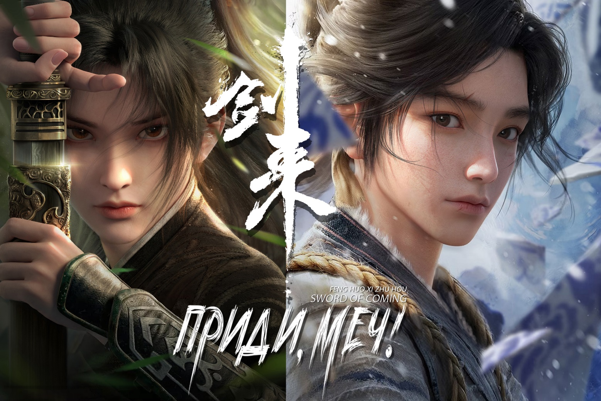
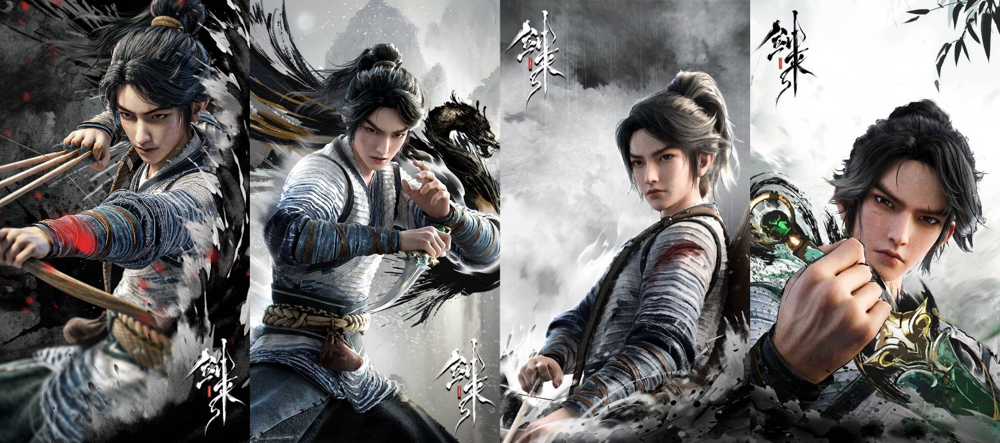

# Глава 000. Приди, меч! / Sword of Coming! / Jian Lai /剑来

Автор: 烽火戏剧王子(Fēng Huǒ Xì Zhū Hóu)

Перевод: Microcosmos Komataguri 

Boosty: https://boosty.to/komataguri

Год выпуска: 2017; Выпуск: продолжается;Количество глав: ~1205

Альтернативное название: Меч грядущего

Жанры: боевые искусства, драма, приключения, сёнэн, сянься, XianXia, фэнтези

Тэги: алхимия, буддизм, главный герой мужчина, древний мир, культивация, сирота, спокойный главный герой, адекватный главный герой

Аннотация:

Каких только чудес не бывает на свете.В центре мироздания обитает ученый, который однажды мечом рассек водопад Небесной реки, и никто из людей не гордится собой так, как он.

На краю утесов Восточного моря обосновался безымянный даос, не пожелавший вознестись и прозябать на вершине горы. Он лишь хочет, чтобы прохладный ветерок овевал его лицо.

В Западном раю живет старый монах, что любит рассказывать людям истории. Он держит девять небесных драконов.

В Диких землях на южных окраинах живет слепой художник, заставивший марионеток в золотых доспехах сдвинуть множество огромных гор для создания прекрасной картины.

Однажды бедный юноша, выросший на севере, увидел над головой тысячи бессмертных, летящих на мечах, подобно стае саранчи. Тогда ему захотелось пойти и своими глазами увидеть того ученого мужа, о котором рассказывал сказитель, а также бушующие приливы Восточного моря, бескрайние пески Запада и величественные горы Южной пустоши.

И вот настал день, когда юноша взял деревянный меч и отправился на юг.

Аннотация 2:

В безграничном, необъятном мире существуют все виды редких и удивительных вещей.

Я, Чэнь Пинъань, владею лишь одним мечом, способным двигать горы, переворачивать моря, усмирять демонов, повелевать богами, срывать звезды, разрушать реки, сокрушать города и открывать врата небесных обителей!

Меня зовут Чэнь Пинъань, Безмятежный Пинъань, и я — мечник.

