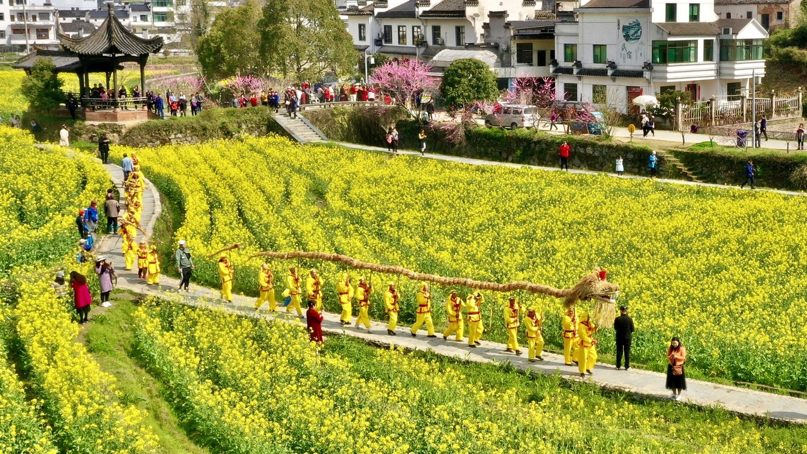
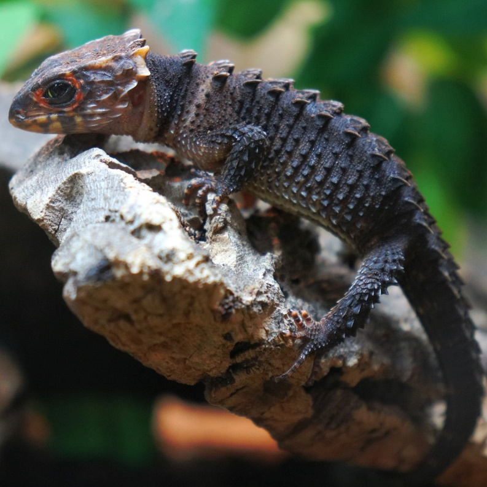

# Глава 01. Пробуждение насекомых

П/п.: Название главы (惊蛰 — Цзинчжэ) относится к 3-му из 24 солнечных сроков в традиционном китайском календаре, и этот термин буквально переводится как «Пробуждение насекомых» или «Пора пробуждения личинок».

«Чжэ» означает «спячка», когда насекомые зимой прячутся в земле; «Цзин» означает «пробуждение», когда весенний гром с неба будит спящих насекомых. Выражение «весенний гром будит сотни насекомых» относится к тому, что в сезон Цзинчжэ первый гром пробуждает насекомых, зимовавших под землей.

В древние времена в день Цзинчжэ в некоторых местах люди окуривали углы дома ароматными травами и полынью, чтобы отпугнуть «змей, насекомых, комаров и мышей», а также плесень.

※※※※

Во второй день второго месяца по лунному календарю наступал день, когда дракон поднимал голову[1].

[1] Фестиваль Лунтайтоу (龙抬头), дословно «дракон, поднимающий голову». Праздник, который отмечается на второй день второго месяца по лунному календарю. Этот день считается началом весны, когда дракон, символизирующий силы природы, «поднимает голову» после зимней спячки, знаменуя начало нового сельскохозяйственного сезона и пробуждение природы.

В сумерках маленького городка, в тихом местечке под названием переулок Глиняных Кувшинов, жил-был одинокий худощавый юноша. В этот момент, следуя обычаю, он держал в одной руке свечу, а в другой — ветку персикового дерева. Он освещал балки, стены, деревянную кровать и другие места, постукивая веткой персика, пытаясь таким образом прогнать змей, скорпионов, сколопендр и прочих тварей. Юноша бормотал старинное заклинание, передаваемые из поколения в поколение в этом городке:

— Второго числа второго месяца свеча освещает балки, персик стучит по стенам, и змеям с насекомыми негде укрыться в мире людей.

Юношу звали Чэнь Пинъань, [2] он рано осиротел.

[2] Чэнь Пинъань (陈平安). Чэнь — это фамилия, одна из самых распространенных в Китае, означает «изложить, выразить, или древний». Имя Пинъань можно перевести как «спокойствие и безопасность», «благополучный или безмятежный».

Керамика этого маленького городка была очень известна. С начала правления нынешней династии город взял на себя важную задачу «изготовления по императорскому указу ритуальных сосудов для императорских гробниц». Здесь постоянно находились придворные чиновники, контролирующие дела императорских мастерских.

Юноша, оставшийся без опоры и поддержки, с ранних лет стал гончаром, обжигающим керамику. Поначалу он мог выполнять только черновую работу, учась у вспыльчивого мастера-самоучки. После нескольких лет тяжелого труда, когда он только начал постигать азы обжига керамики, судьба неожиданно повернулась: городок внезапно лишился защиты императорской мастерской. Десятки печей вокруг городка, напоминающие по форме спящих драконов, в одночасье были потушены и закрыты по приказу властей.

Юноша до сих пор ясно помнил, как в прошлом году поздней осенью на рассвете обнаружили своего старого мастера по фамилии Яо, который признавал его своим учеником лишь наполовину, сидящим на маленьком бамбуковом стуле лицом к печи с закрытыми глазами.

Однако таких упрямых людей, как старик Яо, было немного.

Мастера маленького городка, поколениями занимавшиеся только обжигом керамики, не осмеливались ни производить изделия для императорского двора, ни тайно продавать хранящуюся керамику простым людям. Им пришлось искать другие пути заработка. Четырнадцатилетнего Чэнь Пинъаня тоже выгнали.

Вернувшись в переулок Глиняных Кувшинов, он продолжал жить в обветшалом старом доме. Картина была удручающей — голые стены, практически пустые комнаты. Даже если бы Чэнь Пинъань захотел растратить семейное имущество, ему было бы нечего тратить.

Некоторое время юноша скитался как неприкаянная душа, не в силах найти способ заработать. Он едва сводил концы с концами на свои скудные сбережения. Несколько дней назад он услышал, что в переулке Драконьих Наездников появился кузнец по фамилии Жуань из другого города. Тот объявил, что набирает семь-восемь учеников для обучения кузнечному делу. Зарплаты не обещал, но кормить брался. Чэнь Пинъань поспешил испытать удачу, но не ожидал, что мужчина средних лет лишь мельком взглянет на него и откажет. Тогда Чэнь Пинъань удивился: неужели в кузнечном деле важна не сила рук, а внешность?

Хотя Чэнь Пинъань выглядел слабым, его силу нельзя было недооценивать. Это была физическая подготовка, выработанная за годы обжига керамики и работы на гончарном круге. Кроме того, Чэнь Пинъань вместе со стариком Яо обошел все горы и реки в радиусе ста ли[3] вокруг городка, попробовал вкус всех видов почвы в округе. Он был трудолюбив и готов выполнять любую грязную и тяжелую работу без промедления. К сожалению, старик Яо никогда не любил Чэнь Пинъаня, считая, что у юноши нет таланта, что он тупой как пробка, и далеко не так хорош, как старший ученик Лю Сяньян[4]. Нельзя винить старика за предвзятость — мастер может только открыть дверь, а совершенствование зависит от самого человека. Например, в такой монотонной работе, как формовка на гончарном круге, Лю Сяньян за полгода достиг уровня, которого Чэнь Пинъань добился только за три года упорного труда.

[3] Ли (里) — китайская мера длины для больших расстояний, в древности ли составляла 300 или 360 шагов, стандартизированное метрическое значение — 500 метров. П/п.: В общем, если видите расстояние в ли, просто делите его на два, и получите привычные километры.

[4] Лю Сяньян (刘羡阳). Лю — одна из самых распространенных фамилий в Китае. Имя Сяньян может означать «Завидовать солнцу», «Стремиться к свету» или «Желать хорошего». Родители, дающие ребенку такое имя, вероятно, хотят, чтобы он вырос достойным человеком с хорошими качествами, добился успеха в жизни и вызывал восхищение у других.

Хотя, возможно, это ремесло и не пригодится ему в жизни, Чэнь Пинъань, как и раньше, закрыл глаза и представил, что перед ним лежит гранитная плита и гончарный круг. Он начал практиковаться в формовке глины, ведь, как известно, навык приходит с практикой.

Примерно каждые четверть часа юноша недолго отдыхал, встряхивая запястья, и так повторялось, пока он полностью не выматывался. Только тогда Чэнь Пинъань вставал и начинал прогуливаться по двору, медленно разминая мышцы. Никто никогда не учил Чэнь Пинъаня этому, он сам додумался до такого метода.

В окружающей тишине Чэнь Пинъань вдруг услышал резкий насмешливый хохот. Он остановился и, как и ожидал, увидел своего ровесника, сидящего на стене. Тот ухмылялся, не скрывая своего презрения.

Этот мальчишка был давним соседом Чэнь Пинъаня и, по слухам, внебрачным сыном бывшего главного надзирателя. Тот чиновник, опасаясь осуждения со стороны честных служащих и доносов цензоров, в конце концов для отчета о службе вернулся в столицу один, оставив ребенка на попечение сменившего его чиновника, с которым у него были дружеские отношения. Теперь, когда городок необъяснимо по какой причине потерял право на производство императорской керамики, даже главный надзиратель, отвечавший за контроль над производством для двора, сам оказался в трудном положении. Ему было уже не до внебрачного сына коллеги. Оставив немного денег, он поспешил в столицу налаживать связи.

Соседский юноша, сам того не осознавая, уже стал брошенным ребенком, но все еще жил беззаботно. Целыми днями он водил свою личную служанку по городку и окрестностям, круглый год бездельничал и никогда не беспокоился о деньгах.

Глиняные стены дворов в переулке Глиняных Кувшинов были очень низкими, и соседскому юноше даже не нужно было вставать на цыпочки, чтобы увидеть, что происходит во дворе. Однако каждый раз, разговаривая с Чэнь Пинъанем, он предпочитал сидеть на стене.

По сравнению с простым и обыденным именем Чэнь Пинъаня, имя соседского юноши было гораздо изысканнее — Сун Цзисинь. Даже его верная служанка носила претенциозное имя — Чжигуй.

[5] Сун Цзисинь (宋集薪). Сун — фамилия, которая может означать «сосна» или относиться к династии Сун. Цзисинь:集 = «собирать», 薪 = «дрова» (подготовленное топливо, часто метафора для «запаса знаний/силы»). Имя можно трактовать как «Сун, собирающий дрова», но в контексте китайской культуры это звучит возвышенно, почти философски (как подготовка к великому делу).

[6] Чжигуй (稚圭). (稚 = юный, незрелый;圭 = нефритовый скипетр). На первый взгляд символ чистоты и статуса. Но «нефритовый скипетр» — атрибут мудрецов и правителей, а с добавлением «незрелый» это становится насмешкой.

Девушка стояла по ту сторону стены, у нее были миндалевидные глаза и робкий вид.

Со стороны ворот двора послышался чей-то голос:

— Ты продаешь эту служанку?

Сун Цзисинь на мгновение растерялся, затем обернулся на голос. Он увидел стоящего за воротами улыбающегося юношу в роскошной одежде. Лицо было совершенно незнакомым.

Рядом с юношей в богатых одеждах стоял высокий пожилой мужчина с светлым лицом и добродушным выражением.

Он слегка прищурился, разглядывая юношу и девушку во дворах двух соседних домов.

Взгляд старика мимолетно скользнул по Чэнь Пинъаню, не задерживаясь, но на Сун Цзисине и служанке он задержался дольше, и его улыбка постепенно становилась все более явной.

Сун Цзисинь искоса взглянул и сказал:

— Продаю! Почему бы не продать!

Юноша улыбнулся:

— Тогда назови цену.

Девушка широко раскрыла глаза, на ее лице проступило недоумение, она выглядела как испуганный олененок.

Сун Цзисинь закатил глаза, поднял один палец и помахал им:

— Десять тысяч лянов[7] серебра!

[7] Лян (兩) — мера веса, а также денежная единица. Возникла в Китае, появилась не позднее династии Хань. Серебряные слитки (ямбы), вес которых измерялся в лянах, служили валютой. Вес в разные эпохи отличался, от 37 до 50 граммов.

Юноша в парчовой одежде сохранял невозмутимое выражение лица и кивнул:

— Хорошо.

Видя, что юноша, похоже, не шутит, Сун Цзисинь поспешно изменил цену:

— Десять тысяч лянов золота!

Уголки губ юноши в роскошной одежде приподнялись:

— Я просто подшучиваю над тобой.

Лицо Сун Цзисинь помрачнело.

Юноша в роскошной одежде больше не обращал внимания на Сун Цзисиня и перевел взгляд на Чэнь Пинъаня:

— Сегодня благодаря тебе я смог купить того карпа. Когда я принес его домой, он мне понравился еще больше. Я подумал, что обязательно должен лично поблагодарить тебя, поэтому попросил дедушку У привести меня к тебе ночью.

Он бросил тяжелый вышитый мешочек Чэнь Пинъаню, улыбаясь:

— Это благодарность, теперь мы в расчете.

Чэнь Пинъань только хотел что-то сказать, но юноша уже повернулся и ушел.

Чэнь Пинъань нахмурился.

Днем он случайно увидел мужчину средних лет, идущего по улице с корзиной для рыбы. В ней был пойман золотистый карп длиной с ладонь. Рыба сильно билась в бамбуковой корзине. Чэнь Пинъань, лишь мельком взглянув, бросил лишь один взгляд и сразу почувствовал радость, поэтому спросил, нельзя ли купить рыбу за десять вэнь[8]. Мужчина изначально хотел просто побаловать свой желудок, но, увидев возможность заработать, сразу заломил непомерную цену, запросив тридцать вэнь. У бедного Чэнь Пинъаня не было столько лишних денег, но ему очень хотелось получить эту золотистую рыбку. Он пошел за мужчиной, уговаривая его снизить цену до пятнадцати или хотя бы до двадцати монет. Когда мужчина, казалось, был готов уступить, мимо проходили юноша в богатой одежде и высокий старик. Они без лишних слов купили и рыбу, и корзину за пятьдесят вэнь. Чэнь Пинъаню оставалось только беспомощно смотреть, как они уходят.

[8] Вэнь или вэньцянь (文钱) — медная монета. Самая маленькая древняя денежная единица.

Пристально глядя на удаляющиеся фигуры деда и внука, Сун Цзисинь отвел свой злобный взгляд, спрыгнул со стены и, словно что-то вспомнив, сказал Чэнь Пинъаню:

— Ты помнишь то четвероногое существо в первом месяце года?

Чэнь Пинъань кивнул.

Как он мог забыть, воспоминания были все еще свежи.

Согласно многовековой традиции этого городка, если змея заползает в чей-то дом, это считается хорошим знаком, и хозяева ни в коем случае не должны ее прогонять или убивать. В первый день нового года Сун Цзисинь сидел на пороге, греясь на солнце, когда маленькое существо, известное как «четвероногая змея»[9], проскользнуло в дом прямо у него на глазах. Сун Цзисинь схватил его и выбросил во двор. Кто бы мог подумать, что эта тварь, уже изрядно потрепанная, становилась все настойчивее с каждой попыткой. Это разозлило Сун Цзисиня, который никогда не верил в суеверия. В гневе он забросил змею во двор Чэнь Пинъаня. Однако на следующий день Сун Цзисинь обнаружил ту же змею, свернувшуюся под его собственной кроватью.

[9] «四脚蛇» буквально переводится как «четвероногая змея». Это народное название для некоторых видов ящериц, чаще всего подразумевается крокодиловый сцинк (они очень милые, похожие на мини-дракончиков). Это редкая ящерица, обитающая в некоторых районах южного Китая и северного Вьетнама. Она имеет длинное змееподобное тело и четыре небольшие ноги. Также относятся некоторые виды веретеницевых. Эти ящерицы часто имеют удлиненное тело и маленькие ноги, что делает их похожими на змей с ногами. Иногда этот термин может относиться к саламандрам или тритонам, особенно к видам с длинным телом и короткими ногами.

Сун Цзисинь почувствовал, как служанка потянула его за рукав.

Юноша интуитивно понял ее и проглотил слова, которые уже были на кончике его языка.

Он хотел сказать, что у той уродливой четвероногой змеи недавно появилась выпуклость на лбу, словно пробивался рог.

Вместо этого Сун Цзисинь сказал:

— Возможно мы с Чжигуй покинем это место в следующем месяце.

Чэнь Пинъань вздохнул:

— Будьте осторожны в пути.

Сун Цзисинь полушутя-полусерьезно сказал:

— Некоторые вещи я точно не смогу забрать. Смотри, не вздумай бесстыдно воровать, когда в моем доме никого не будет.

Чэнь Пинъань покачал головой.

Сун Цзисинь внезапно расхохотался, указывая пальцем на Чэнь Пинъаня, и с ухмылкой сказал:

— Трусливый как мышь. Неудивительно, что из бедных семей не выходят знатные люди. Не только в этой жизни ты будешь бедным и униженным, но, возможно, и в следующей не сможешь избежать этой участи.

Чэнь Пинъань промолчал.

Они разошлись по своим домам. Чэнь Пинъань закрыл дверь, лег на жесткую деревянную кровать, закрыл глаза и тихо прошептал:

— Спокойствие и безопасность, год за годом, покой и благополучие, из года в год…[10]

[10] 碎碎平，岁岁安，碎碎平安，岁岁平安 (Суйсуй пин, суйсуй ань, суйсуй пинъань, суйсуй пинъань…» Игра слов, связанная с значением имени Пинъаня: «пусть каждый год будет спокойным и безопасным».