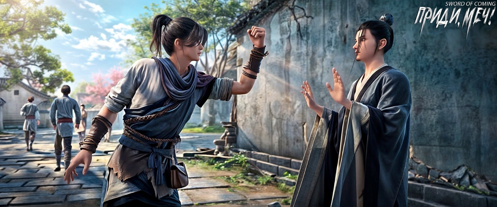

# Глава 02. Открыть дверь

Небо едва начало светлеть, петухи еще не пропели, а Чэнь Пинъань уже встал с постели. Тонкое одеяло совсем не удерживало тепло, к тому же, будучи учеником гончара, Чэнь Пинъань уже привык рано вставать и поздно ложиться. Он открыл дверь дома и вышел во дворик с рыхлой землей. Сделав глубокий вдох и потянувшись, он вышел со двора и, обернувшись, увидел хрупкую фигуру, сгорбившуюся под тяжестью ведра с водой в обеих руках. Это была Чжигуй — служанка Сун Цзисиня. Похоже, она только что вернулась от колодца с железной цепью в переулке Цветущих Абрикосов.

Чэнь Пинъань отвел взгляд и побежал трусцой через улицы и переулки в сторону восточной части городка. Переулок Глиняных Кувшинов находился в западной части городка, а у самых восточных ворот находился человек, отвечающий за въезд и выезд торговцев и путешественников, а также за ночной дозор. Обычно он также принимал и передавал письма, присылаемые из-за пределов городка. Следующим делом Чэнь Пинъаня было разнести эти письма местным жителям. Плата составляла одну медную монету за письмо — этот заработок дался ему нелегко. Чэнь Пинъань уже договорился, что возьмется за это дело после праздника во второй день второго месяца.

По словам Сун Цзисиня, раз Чэнь Пинъань родился в бедности, то даже если удача постучится в его дверь, он не сможет ее удержать. Сун Цзисинь часто говорил загадочные и трудные для понимания слова, вероятно, заимствованные из книг. Например, пару дней назад Сун Цзисинь бормотал что-то о том, как весенний холод убивает молодых людей, и Чэнь Пинъань совершенно не понял смысла. Однако он на собственном опыте знал, что после зимы в начале весны бывает период, когда становится еще холоднее. Сун Цзисинь называл это обратным весенним холодом, говоря, что он также опасен, как и внезапная атака с тыла на поле боя, и что многие люди умирают в это время.

Городок не был окружен стенами, ведь здесь редко встречались не только бандиты и разбойники, но даже воры и карманники. Поэтому то, что называлось городскими воротами, на самом деле было рядом покосившихся старых изгородей с кое-как обустроенным проходом для пешеходов и повозок, что и считалось «лицом» этого маленького городка. Когда Чэнь Пинъань бежал мимо переулка Цветущих Абрикосов, он увидел много женщин и детей, собравшихся у колодца с железной цепью. Колодезный ворот постоянно скрипел.

Пройдя еще одну улицу, Чэнь Пинъань услышал знакомый звук чтения вслух. Там находилась сельская школа, открытая на средства нескольких зажиточных семей. Учитель был приезжим. В детстве Чэнь Пинъань часто бегал туда, прятался за окном и, присев на корточки, внимательно слушал. Хотя учитель был очень строг во время занятий, он не прогонял таких детей, как Чэнь Пинъань, которые «подслушивали» уроки и учились украдкой. Позже, когда Чэнь Пинъань стал учеником на драконовой печи за пределами городка, он перестал посещать школу.

Идя дальше, Чэнь Пинъань прошел мимо каменной арки[1]. Поскольку она была построена на двенадцати каменных колоннах, местные жители любили называть ее Крабовой. Настоящее название было предметом спора между Сун Цзисинем и Лю Сяньяном. Сун Цзисинь решительно утверждал, что в старой книге под названием «Записи местного уезда» это место называлось аркой Великого Ученого — императорской мемориальной аркой, воздвигнутой в память о гражданских и военных заслугах великого чиновника в истории. Лю Сяньян, такой же деревенщина, как и Чэнь Пинъань, говорил, что это просто Крабовая арка, и что все называли ее так на протяжении сотен лет, поэтому нет причин называть ее какой-то непонятной аркой Великого Ученого.

[1] — мемориальная арка. Называется еще пайфан или пайлоу — это резные орнаментированные триумфальные ворота из камня или дерева, возводившиеся в Китае в честь правителей, героев, выдающихся событий. Перекрыты одной или несколькими крышами в зависимости от числа пролетов. 

— Насколько велика шляпа Великого Ученого? Она больше, чем отверстие колодца с железной цепью? — Этот вопрос заставил Сун Цзисиня покраснеть.

В этот момент Чэнь Пинъань обежал вокруг арки. На каждой стороне арки странным почерком было написано по четыре больших иероглифа. Шрифты были необычными и казались непохожими друг на друга. Надписи гласили: «В гуманности нельзя уступать», «Естественность в немногословности», «Не ищи вовне» и «Ци, устремленная к созвездию Северного Ковша»[2].

[2] П/п.: примечание получилось большое, потому я перенесла его в конец главы.

По словам Сун Цзисиня, за исключением одной надписи из четырех иероглифов, остальные три каменные таблички с надписями когда-то были стерты и изменены. Чэнь Пинъань мало что понимал в этом и никогда глубоко не задумывался, да и если бы захотел докопаться до сути, это было бы напрасно — он даже не знал, что такое «Записи местного уезда», которые Сун Цзисинь часто упоминал.

Недалеко от арки вскоре показалась раскидистая старая софора. Под ней лежало неизвестно кем принесенное бревно. После небольшой обработки и подложенных под концы двух каменных плит, оно превратилось в простую скамью. Каждое лето местные жители любили отдыхать здесь в тени. Более зажиточные семьи приносили из колодца корзину охлажденных фруктов, и дети, наевшись и напившись, собирались в группы и играли в тени дерева.

Чэнь Пинъань, привыкший к дальним походам в горы и к водоемам, легко добежал до ворот с изгородью и остановился у одинокого глиняного домика. Дыхание его даже не сбилось.

В городке было немного приезжих, и теперь, когда «денежное дерево», которое обжигали в официальных печах, рухнуло, новых лиц должно стать еще меньше. Когда старик Яо был еще жив, он однажды напился и сказал Чэнь Пинъаню и другим ученикам:

— Мы занимаемся единственным в мире официальным производством керамики, изготавливаем императорский фарфор для Его Величества. Даже если обычные люди богаты или занимают высокие должности, они не смеют прикасаться к нему — за это могут казнить.

В тот день старик Яо выглядел особенно воодушевленным.

Сегодня, глядя за ограду, Чэнь Пинъань увидел, что несколько человек ждут открытия городских ворот — не менее семи-восьми, мужчины и женщины, молодые и старые, и все незнакомцы. Местные жители, независимо от того, шли ли они обжигать фарфор или работать в поле, почти не пользовались восточными воротами по очень простой причине: дорога, ведущая от восточных ворот городка, не вела ни к драконовым печам, ни к полям.

Теперь Чэнь Пинъань и эти приезжие смотрели друг на друга через деревянную ограду.

В тот момент Чэнь Пинъань, одетый в самодельные соломенные сандалии, немного завидовал толстой одежде этих людей. Она наверняка очень теплая и защищает от холода.

Люди за воротами разделились на несколько групп и явно не были одной компанией, но все посмотрели на худощавого юношу внутри. Большинство выглядели равнодушно, лишь один-два человека уже смотрели мимо Чэнь Пинъаня, вглубь городка.

Чэнь Пинъань удивился: неужели эти люди не знают, что правительство закрыло все драконовые печи? Или они знают правду и поэтому думают, что у них есть шанс?

Стройный молодой человек в странном высоком головном уборе и с зеленой нефритовой подвеской на поясе, казалось, потерял терпение. Он вышел из толпы и попытался открыть незапертые ворота. Но когда его пальцы почти коснулись деревянной двери, он резко остановился, медленно отвел руку, сложил руки за спиной и с улыбкой посмотрел на Чэнь Пинъаня, не говоря ни слова. Просто стоял, улыбаясь.

Краем глаза Чэнь Пинъань заметил, что люди позади молодого человека проявляли разные эмоции: кто-то выглядел разочарованным, кто-то заинтригованным, кто-то хмурился, а кто-то ухмылялся.

В этот момент человек средних лет с растрепанными волосами резко открыл дверь и начал ругать Чэнь Пинъаня:

— Ах ты, паршивец, деньги тебе глаза застили? Так рано приперся выбивать душу! Ты что, спешишь переродиться, чтобы увидеть своих покойных родителей?!

Чэнь Пинъань закатил глаза, не обращая внимания на эти язвительные слова. Во-первых, живя в этой деревенской местности, где было всего несколько книг, если бы он раздражался от каждого оскорбления, то проще было бы найти колодец и прыгнуть в него, сэкономив силы и нервы. Во-вторых, этот средних лет холостяк-привратник сам часто становился объектом насмешек жителей городка. Особенно со стороны смелых и дерзких женщин, которые не только бранили его, но и нередко били. К тому же он очень любил хвастаться перед маленькими детьми, носящими открытые штанишки[3] рассказывая истории вроде: «Когда-то давно я участвовал в жестокой битве у городских ворот и побил пять-шесть здоровых мужиков так, что они зубы на земле собирали. Всюду была кровь, вся дорога шириной в шесть метров перед воротами была как грязная дорога в дождливый день!

[3] Речь идет о традиционных детских штанах, которые назывались «кайдангку» (开裆裤), штаны с прорезью. Это штаны с открытым швом в области промежности, которые обычно носят малыши. Они использовались для облегчения процесса приучения детей к туалету.

Он недовольно сказал Чэнь Пинъаню:

— Твои жалкие дела подождут.

Никто из местных не воспринимал этого мужчину всерьез. Однако он обладал полной властью над тем, кому из приезжих позволено войти в городок.

Подтягивая штаны, он направился к деревянной калитке.

Этот мужчина стоял спиной к Чэнь Пинъаню. Открыв калитку, он время от времени забирал у людей маленькие вышитые мешочки, прятал в рукав, а затем пропускал их одного за другим.

Чэнь Пинъань давно уступил дорогу. Восемь человек, разделившись примерно на пять групп, направились в городок. Помимо молодого человека в высоком головном уборе и с нефритом на поясе, прошли также два ребенка семи-восьми лет: мальчик в праздничном красном халате и девочка с нежной розовой кожей, похожая на изысканный фарфор.

Мальчик был на полголовы ниже Чэнь Пинъаня. Проходя мимо него, он открыл рот, и хотя не издал ни звука, было очевидно по движению губ, что он произнес два грубых слова. Женщина средних лет, державшая мальчика за руку, слегка кашлянула, и мальчик немного присмирел.

За женщиной с мальчиком шла маленькая девочка, которую вел за руку крепкий старик с седой головой. Девочка повернулась к Чэнь Пинъаню и произнесла длинную тираду, не забывая указывать на мальчика перед собой. Чэнь Пинъань совершенно не понимал, что говорила маленькая девочка, но догадывался, что она жаловалась.

Крепкий старик искоса взглянул на Чэнь Пинъаня.

Лишь от одного преднамеренного или непреднамеренного взгляда Чэнь Пинъань, словно мышь, увидевшая кошку, чисто инстинктивно отступил на шаг назад.

Увидев это, маленькая девочка, до этого щебетавшая как маленький чижик, мгновенно потеряла интерес к разжиганию раздора. Она отвернулась и больше не смотрела на Чэнь Пинъаня, словно еще один взгляд на него мог запачкать ее глаза.

Чэнь Пинъань действительно не видел мира, но это не значит, что он не умел читать выражения лиц.

Когда эта группа людей ушла далеко, мужчина, охранявший ворота, с улыбкой спросил:

— Хочешь знать, что они сказали?

Чэнь Пинъань кивнул:

— Хочу.

Мужчина рассмеялся и весело сказал:

— Они похвалили тебя за красивую внешность, говорили только хорошее.

Чэнь Пинъань слегка скривил рот и подумал:

«Ты за дурака меня принимаешь?»

Мужчина разгадал мысли Чэнь Пинъаня и засмеялся еще радостнее:

— Если бы ты не был дураком, разве я позволил бы тебе прийти доставить письмо?

Чэнь Пинъань не осмелился возражать, опасаясь, что если он разозлит этого человека, то медные монеты, которые вот-вот окажутся в его руках, улетучатся.

Мужчина повернул голову, глядя вслед ушедшим людям и, потирая свой небритый подбородок, тихо присвистнул:

— Женщина, что только что прошла, своими ногами могла бы человека насмерть задушить.

Чэнь Пинъань поколебался мгновение и с любопытством спросил:

— Та госпожа практикует боевые искусства?

Мужчина изумленно посмотрел на Чэнь Пинъаня, наклонил голову и серьезно сказал:

— Парень, ты действительно глуп.

Чэнь Пинъань остался в полном недоумении.

Мужчина велел Чэнь Пинъаню подождать, быстро направился к дому и вернулся с пачкой писем в руках, не толстой и не тонкой, примерно десять конвертов. Передав их Чэнь Пинъаню, он спросил:

— Дуракам везет, добро возвращается добром. Веришь ли ты в это?

Чэнь Пинъань, держа письма в одной руке, раскрыл другую ладонь и, моргнув, сказал:

— Мы договаривались на одну медную монету за письмо.

Мужчина рассердился от стыда, с силой шлепнул пять заранее приготовленных медных монет на ладонь Чэнь Пинъаня, а затем широко взмахнул рукой и с показным великодушием произнес:

— Оставшиеся пять монет пока останусь должен!

※※※※

[2] «В гуманности нельзя уступать» (当仁不让) — это китайская идиома, происходящая из главы «Вэй Лин-гун» в «Беседах и суждениях» (Аналекты Конфуция). Первоначальное значение заключалось в том, чтобы считать человеколюбие своим долгом и не уступать в этом никому. Позже это выражение стало означать активное и инициативное выполнение того, что должно быть сделано, без уклонения от ответственности. 

«Естественность в немногословности» или «Редкие слова заключают в себе самые достоверные мысли…» (希言自然) — «Дао дэ цзин», «Книга о пути и добродетели». 

«Не ищи вовне» (莫向外求) — Не ищи вовне, а ищи внутри себя — это путь духовной практики или буддийского совершенствования. Хотя «не ищи вовне» и означает не искать внешних учений, но в большей степени это относится к «поиску» в своем собственном сердце, желанию совершать все добрые дела, желанию избавиться от всего злого, усердно повышать свой уровень практики и накапливать свои заслуги и благословения. 

«Ци, устремленная к созвездию Северного Ковша» (气冲斗牛) — китайская идиома, происходит из стихотворений Тан, Цуй Жун «Воспевание драгоценного меча»: «Дух меча в ножнах достигает созвездий Ню и Доу, форма горы вращается как ворот колодца» и «Надпись на Красной скале в Циннине». Ню и Доу относятся к созвездиям Волопаса и Большой Медведицы (Северного Ковша) в 28 лунных стоянках, символизируют небо. Имеет переносный смысл «неукротимый боевой дух, рвущийся в бой». Может использоваться как сказуемое или дополнение; описывает энергию, настолько мощную, что она может устремляться прямо в небеса. Северный Ковш — именно так называют китайцы созвездие Большой Медведицы, потому что он похоже на ковш с ручкой.