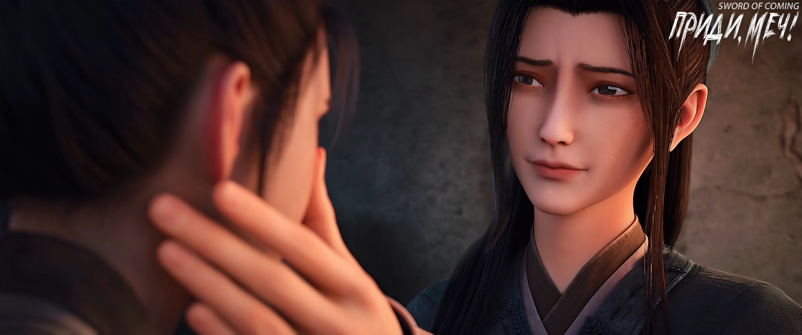
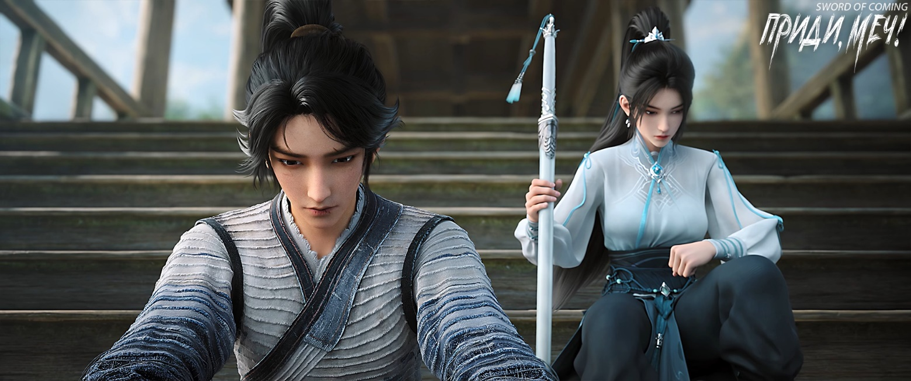

# Глава 04. Желтая птица

Если бы Чэнь Пинъань не побывал на улице Благоденствия и Достатка или в переулке Персиковых Листьев, он, возможно, никогда бы не осознал, насколько темным и узким был переулок Глиняных Кувшинов. Однако он не только не почувствовал разочарования, но наконец ощутил спокойствие. Он с улыбкой протянул обе руки, и его ладони как раз коснулись желтых глиняных стен по обеим сторонам. Он вспомнил, что примерно три-четыре года назад он мог дотянуться до них только кончиками пальцев.

Подойдя к своему дому, он обнаружил, что ворота во двор широко открыты. Подумав, что его ограбили, он поспешно вбежал во двор, но увидел Лю Сяньяна, сидящего на пороге. Прислонившись спиной к запертой двери дома, тот лениво зевал. Увидев Чэнь Пинъаня, Лю Сяньян вскочил, словно ему подожгли штаны, подбежал и крепко схватил его за руку, резко потянул к дому и шепотом прокричал: 

— Быстрее открывай дверь, у меня есть срочное дело, о котором нужно тебе рассказать!

Чэнь Пинъань не смог вырваться из хватки и был вынужден открыть дверь дома. Лю Сяньян, который был на два года старше и крепче телосложением, быстро оттолкнул Чэнь Пинъаня, на цыпочках пробрался к деревянной кровати, плотно прижал ухо к стене и начал подслушивать, что происходит за стеной у соседей.

Чэнь Пинъань с любопытством спросил: 

— Что ты делаешь?

Лю Сяньян проигнорировал вопрос. Примерно через полпалочки благовоний[1] он наконец пришел в себя и сел на край деревянной кровати с сложным выражением лица, в котором смешались облегчение и сожаление.

[1] П/п.: Палочка благовоний горит примерно 30 минут. 

Только тогда Лю Сяньян заметил, что Чэнь Пинъань занимался странным делом: он присел у двери внутри дома, наклонившись наружу, и сжигал желтую бумагу огарком свечи размером с большой палец, позволяя пеплу падать за порог. Казалось, Чэнь Пинъань что-то бормотал, но Лю Сяньян был слишком далеко, чтобы разобрать слова.

Лю Сяньян был единственным учеником старого мастера Яо, работавшего в старинной драконовой печи. Что касается бездарного Чэнь Пинъаня, старик с самого начала и до конца так и не признал его настоящим учеником. В этих краях, если ученик не поклонился учителю с чаем или учитель не выпил эту чашку чая, это означало, что между ними нет официальных отношений учителя и ученика.

Чэнь Пинъань и Лю Сяньян не были соседями, их родовые дома находились довольно далеко друг от друга, и причина, по которой Лю Сяньян в то время представил Чэнь Пинъаня старику Яо, заключалась в том, что между двумя юношами существовала давняя вражда. Лю Сяньян когда-то был известным бедовым сорванцом в их городке. Пока был жив его дед, в доме был кто-то, кто присматривал за ним, ситуация еще держалась, но после смерти деда, когда Лю Сяньяну было всего двенадцать-тринадцать лет, он возмужал и стал бедой для всех соседей.

Позже по какой-то причине Лю Сяньян навлек на себя гнев группы молодых людей из семейства Лу, в результате чего его крепко зажали в переулке Глиняных Кувшинов и жестоко поколотили. Нападавшие были разгоряченными юнцами, не жалевшими сил, и Лю Сяньян быстро был избит до рвоты кровью. Жители более десятка домов, расположенных в переулке, в основном были бедными ремесленниками, перебивающимися с хлеба на квас, и не решались вмешаться в эту заваруху.

В это время Сун Цзисинь совершенно не боялся, а наоборот, сидел на стене и с удовольствием наблюдал за происходящим, опасаясь только, как бы все это не закончилось.

В конце концов, только один тщедушный ребенок тайком выбрался из своего двора и выбежал на улицу, отчаянно крича: 

— Человек умер!

Услышав слова «мертвец», молодые люди из семьи Лу наконец очнулись от наваждения. Они увидели, что лежащий на земле Лю Сяньян весь в крови и уже находится при смерти. Эти богатые юноши, наконец, почувствовали страх. Переглянувшись, они убежали через другой конец переулка.

Однако после этого Лю Сяньян не только не был благодарен ребенку, спасшему ему жизнь, но и стал часто приходить сюда, чтобы подразнить и поиздеваться над ним. Сирота был упрямым, и как бы над ним ни издевались, он не плакал, что еще больше злило Лю Сяньяна. Только позже, в один из годов, Лю Сяньян, видя, что этот маленький сирота по фамилии Чэнь, вероятно, не сможет пережить зиму, наконец проявил совесть. Поэтому он, уже будучи учеником мастера, взял сироту с собой в ту драконову печь, расположенную на берегу реки Драгоценной. Выйдя из городка и направившись на запад, они прошли несколько десятков ли по горной дороге в сильный снегопад. До сих пор Лю Сяньян не мог понять, как этот маленький мальчик, похожий на уголек, с ногами тонкими, как бамбуковые палки, смог дойти до нужного места. Хотя старик Яо в конце концов оставил Чэнь Пинъаня, отношение к двум ученикам было совершенно разным. К своему главному ученику Лю Сяньяну он был строг, и бил, и ругал, но даже слепой мог почувствовать в этом добрые намерения. Иногда он бил Лю Сяньяна слишком сильно, так, что у него на лбу выступала кровь. Крепкий мальчишка этого даже не замечал, а вот старик Яо, сильно переживал. Этот обычно сдержанный и строгий наставник, несмотря на свой авторитет перед учеником, не решался что-либо сказать. Он всю ночь расхаживал по дому, не находя себе места от беспокойства за Лю Сяньяна, а в итоге позвал Чэнь Пинъаня и отправил ему бальзам.

Все эти годы Чэнь Пинъань очень завидовал Лю Сяньяну. Не его таланту, силе или известности, а безрассудству, его неустрашимости и беззаботности. Куда бы ни пришел Лю Сяньян, он сразу находил общий язык с окружающими, запросто обнимался и называл их братьями, вместе выпивая и развлекаясь. Из-за слабого здоровья своего деда Лю Сяньян очень рано начал самостоятельную жизнь, став своего рода лидером среди детей. Он умело ловил змей, рыбу и разорял птичьи гнезда. Казалось, он мог сделать что угодно: деревянные луки, удочки, рогатки и ловушки для птиц. Особенно в двух вещах Лю Сяньян, несомненно, был лучшим в городке: в ловле вьюнов на рисовых полях и в ужении угрей.

На самом деле, когда Лю Сяньян в свое время бросил учебу в сельской школе, тот учитель Ци специально пришел к дедушке Лю Сяньяна, который лежал больной в постели, и сказал, что может учить его бесплатно. Но Лю Сяньян ни в какую не соглашался, говоря, что хочет только зарабатывать деньги, а не учиться. Учитель Ци сказал, что может платить Лю Сяньяну, чтобы тот был его помощником, но Лю Сяньян все равно не соглашался. На самом деле, у Лю Сяньяна все было хорошо. Даже когда старик Яо умер и драконову печь запечатали, через несколько дней его заметил кузнец из переулка Драконьих Наездников: он начал строить хижину и печь на южной окраине городка, и с тех пор был очень занят.

Лю Сяньян смотрел, как Чэнь Пинъань задул свечу и положил ее на стол, и тихо спросил: 

— Ты когда-нибудь слышал странные звуки рано утром, похожие на…

Чэнь Пинъань сидел на длинной скамье, молча ожидая продолжения.

Лю Сяньян немного помедлил и, впервые в жизни слегка покраснев, сказал: 

— Похожие на кошачье мяуканье весной.

Чэнь Пинъань спросил: 

— Это Сун Цзисинь имитирует кошку, или Чжигуй?

Лю Сяньян закатил глаза, больше не желая попусту тратить слова. Он уперся руками в доски кровати, медленно согнул локти, затем выпрямил руки, оторвав ягодицы от досок и ноги от пола. Его задница торчала в воздухе, когда он, кривя губы, язвительно произнёс:

— Какая еще Чжигуй? Её настоящее имя — Ван Чжу[2]. Этот Сун с детства любил выпендриваться — где-то увидел иероглифы «Чжигуй» и бездумно их прилепил, даже не вникая в смысл. Бедной Ван Чжу достался такой господин — видно, в прошлой жизни она наломала дров, раз теперь страдает рядом с этим Сун Цзисинем.

[2] Ван Чжу (王朱). 王 — «царь», «монарх», символ абсолютной власти. 朱 — «алый» (цвет), но также исторически связано с императорской фамилией династии Мин. Общее значение: «Алый монарх» или «Царственная алчность». Указывает на кровь, власть, императорские амбиции. Ирония в сочетании иероглифов имени Чжигуй (значение: «незрелый скипетр»). Сяньян подумал, что Сун Цзисинь, не понимая значения иероглифов, дал ей имя, которое унижает её достоинство.

Чэнь Пинъань не согласился со словами Лю Сяньяна.

Лю Сяньян, все еще сохраняя ту же позу, холодно фыркнул: 

— Ты действительно не понимаешь? Почему после того, как ты один раз помог Ван Чжу поднять ведро с водой, она больше никогда не разговаривала с тобой? Наверняка этот мелочный и завистливый Сун Цзисинь опрокинул бочку с уксусом[3], приревновал, и пригрозил Ван Чжу, чтобы она не строила тебе глазки, иначе ее ждет семейное наказание — не только переломают ноги, но и выбросят в переулок Глиняных Кувшинов…

[3] «Пить уксус» означает ревновать, а «кувшин с укусом» является образным выражением в отношении ревнивых людей, чаще женщин.

Чэнь Пинъань не мог больше этого слушать и прервал Лю Сяньяна: 

— Сун Цзисинь неплохо к ней относится.

Лю Сяньян, раздраженный и смущенный, возразил: 

— Откуда ты знаешь, что хорошо, а что плохо?

Чэнь Пинъань тихо сказал: 

— Иногда, пока она работает во дворе, Сун Цзисинь сидит на скамейке и читает какие-то «Записи местного уезда». Когда она смотрит на Сун Цзисиня, она часто улыбается.

Взгляд Лю Сяньяна остекленел.

Внезапно тонкая деревянная кровать не выдержала веса Лю Сяньяна и сломалась пополам. Высокий юноша плюхнулся на пол.

Чэнь Пинъань присел на корточки, обхватив голову руками, вздыхая и охая, у него немного болела голова.

Лю Сяньян почесал голову, встал, но не сказал ничего о своем сожалении. Он лишь слегка пнул Чэнь Пинъаня и с улыбкой добавил: 

— Ладно, подумаешь, маленькая старая кровать. Я сегодня пришел, чтобы сообщить тебе потрясающую новость, которая в любом случае ценнее твоей развалившейся кровати!

Чэнь Пинъань поднял голову.

Лю Сяньян самодовольно сказал: 

— После того, как мой мастер Жуань покинул городок, он внезапно решил выкопать несколько колодцев у ручья на юге. У него не хватало рабочих рук и нужно было позвать людей на помощь. Я мимоходом упомянул о тебе, сказав, что есть один коротышка с неплохой силой. Мастер Жуань согласился и сказал, чтобы ты сам пришел в ближайшие дни.

Чэнь Пинъань резко поднялся, собираясь поблагодарить, но Лю Сяньян поднял ладонь: 

— Стой, стой! За большую доброту не благодарят! Просто держи это в сердце!

Чэнь Пинъань скривился.

Лю Сяньян осмотрелся вокруг. В углу комнаты стояла удочка, на подоконнике лежала рогатка, а на стене висел деревянный лук. Он хотел что-то добавить, но в итоге сдержался. Широкими шагами перешагнул через порог, явно намеренно обошел пепел от талисманов. Чэнь Пинъань смотрел на его высокую удаляющуюся фигуру.

Лю Сяньян внезапно обернулся лицом к стоящему в дверном проеме к Чэнь Пинъаню. Он присел, не отрывая ног от земли сделал несколько быстрых шагов вперед и с силой нанес удар кулаком, затем разжал кулак, выпрямился и громко рассмеялся: 

— Мастер Жуань наедине сказал мне, что если я буду практиковать этот кулачный метод всего год, то смогу убить человека!

Лю Сяньяну, казалось, этого было недостаточно. Он сделал странное движение ногой и снова засмеялся: 

— Это называется «хорошая нога должна попасть в пах», так можно сбить с ног даже осла!

Наконец, Лю Сяньян поднял большой палец, указывая на свою грудь, и высокомерно сказал: 

— Когда мастер Жуань обучал меня боевому искусству, у меня появились некоторые идеи и мысли, и я поделился ими с ним. Например, я рассказал о своем понимании уникальной техники старика Яо в изготовлении фарфора, называемой «прыгающий нож». Мастер Жуань похвалил меня, сказав, что я редкий талант в боевых искусствах, который встречается раз в сто лет. В будущем просто держись меня, и ты не будешь знать нужды!

Краем глаза Лю Сяньян заметил, что служанка из соседнего двора вошла в свой дом, и сразу потерял интерес к игре в героя. Он небрежно сказал Чэнь Пинъаню: 

— Ах, да! Когда я проходил мимо старой софоры, там появился старик, называющий себя сказителем. Он как раз устраивал свое место и говорил, что накопил множество интересных историй о необычных людях, которыми хочет поделиться с нами. Если у тебя будет время, можешь пойти посмотреть. 

Чэнь Пинъань кивнул.

Лю Сяньян широкими шагами покинул переулок Глиняных Кувшинов.

Об этом своенравном юноше, который всегда держался особняком, в городке ходило множество слухов. Сам Лю Сяньян любил называть себя потомком генерала, который командовал войсками в сражениях, и поэтому в его семье сохранился этот передающийся из поколения в поколение драгоценный доспех. Хотя он называл его«драгоценный доспех», Чэнь Пинъань однажды видел его своими глазами — на самом деле он был уродливым, напоминая одновременно бородавки на теле человека и наросты на старом дереве. 

Однако сверстники Лю Сяньяна говорили иное. Они утверждали, что предок Лю Сяньяна был дезертиром, который бежал в этот городок и стал приемным зятем в чужой семье, и ему просто повезло избежать поимки властями. Они говорили об этом с такой уверенностью, словно сами видели, как предок Лю Сяньяна бежит с поля боя и после долгих скитаний добирается до этого городка.

Чэнь Пинъань задумался, присел у порога и начал сдувать пепел.

Сун Цзисинь неожиданно оказался у стены двора, рядом с ним стояла служанка Чжигуй. Он крикнул: 

— Не хочешь пойти с нами поиграть у софоры?

Чэнь Пинъань поднял голову: 

— Нет, не пойду.

Сун Цзисинь скривил губы: 

— Зануда.

Он повернулся к своей служанке и с улыбкой сказал: 

— Чжигуй, пойдем! Купим тебе персиковой пудры в горшке размером с живот генерала.

Чжигуй застенчиво ответила: 

— Маленького горшочка размером со сверчка будет достаточно.

Сун Цзисинь заложил руки за спину, выпятил грудь и зашагал вперед: 

— Мы, семья Сун, живем в роскоши, поколениями носим шпильки и пояса чиновников. Как мы можем быть мелочными? Разве это не противоречит нашим семейным традициям?!

Чэнь Пинъань сидел на пороге, потирая лоб. Этот Сун Цзисинь, когда не говорил странных и бессмысленных вещей, производил неплохое впечатление. Но в такие моменты, как сейчас, если бы Лю Сяньян был здесь, он наверняка сказал бы, что очень хочет ударить Сун Цзисиня кирпичом по затылку.

Чэнь Пинъань прислонился к двери дома, размышляя о завтрашнем дне. Скорее всего, он будет похож на сегодняшний, а послезавтра будет похоже на завтра, и так далее. Таким образом, жизнь Чэнь Пинъаня будет продолжаться до тех пор, пока он не станет похож на старика Яо.

Человек ест землю всю жизнь, земля съедает человека один раз[4].

[4] 人吃土一生，土吃人一回。Это значит, что люди всю жизнь живут на земле и после смерти их закапывают в землю. 

В конце концов, закрыв глаза и открыв их снова, возможно, это уже будет дело следующей жизни.

Он опустил взгляд на свои соломенные сандалии и вдруг улыбнулся.

Ступать по каменным плитам и по грязи — ощущения совсем разные.

※※※※

Когда Лю Сяньян покидал переулок и проходил мимо лотка гадателя, молодой даос помахал ему: 

— Подходи, подходи! Я вижу, что твоя аура пылает как масло на огне, это совсем недобрый знак. Но не бойся, у меня есть метод, который поможет тебе избежать несчастий…

Лю Сяньян немного удивился. Он помнил, что этот молодой даос раньше толковал знамения и предсказывал судьбу, и, независимо от точности предсказаний, никогда не зазывал клиентов так активно, наоборот, почти всегда ждал, пока кто-нибудь сам не клюнет. Неужели теперь, когда драконовы печи закрыты правительственными чиновниками, этому даосу тоже не повезло, и он не может свести концы с концами, поэтому готов лучше ошибиться, чем упустить клиента?

Лю Сяньян с насмешкой выругался: 

— Твой способ избавиться от беды — это потратить деньги, верно? Иди к черту! Хочешь выманить деньги из моего кармана? В следующей жизни, может быть!

Молодой даос не рассердился и громко крикнул вслед Лю Сяньяну: 

— Надеешься, что в этом году все будет хорошо, но кто знает, какие беды уготованы судьбой. Без несчастья не вспомнишь о богах, а чтобы обрести покой, нужно воскурить благовония… Нужно воскурить благовония…

Лю Сяньян неожиданно развернулся и быстро побежал к гадательному лотку, потирая руки и крича: 

— Воскурить благовония, говоришь? Я сейчас сожгу твой лоток!

Молодой даос, очевидно сильно испугавшись, вскочил и, не заботясь о своем лотке, бросился бежать, закрыв голову руками.

Лю Сяньян, стоя рядом с лотком и глядя на жалкую фигуру убегающего даоса, громко рассмеялся. Заметив тубу с гадательными палочками на столе, он небрежно протянул руку и опрокинул ее. Бамбуковые палочки с шумом высыпались, образовав на столе веерообразную форму.

Лю Сяньян указал пальцем на остановившегося вдалеке молодого даоса: 

— Как увижу тебя в следующий раз — побью!

Молодой даос сложил руки в поклоне, умоляя о пощаде. Только тогда Лю Сяньян отступил.

Даос осмелился вернуться на свое место только после того, как Лю Сяньян ушел далеко. Он вздохнул: 

— Времена тяжелые, люди уже не те, что раньше. Даже мне, бедному даосу, трудно заработать на пропитание.

В этот момент глаза молодого даоса загорелись, он быстро закрыл их и громко произнес: 

— В пруду полно лягушек, их кваканье раздражает желудок. Здешняя слава подобна ряске на воде, лишь ветер может разнести ее по четырем сторонам света!

Юноша и девушка, проходящие мимо, услышали слова молодого даоса, но, к сожалению, не проявили намерения остановиться.

Молодой даос слегка приоткрыл глаза и, видя, что снова упускает клиентов, хлопнул ладонью по столу и повысил голос: 

— Первый ученый [5] изначально — сын человеческий, министр — не более чем человек в миру. Ученость, охватывающее небо и людей, прославит имя в городе, успех принесет воодушевление и энергию! 

[5] Первый ученый (状元) — титул, присваиваемый ученому, занявшему первое место на высшем уровне императорских экзаменов в древнем Китае.

Сун Цзисинь и служанка Чжигуй продолжали идти.

Молодой даос, разочарованный, пробормотал: 

— Так жить невозможно.

Сун Цзисинь неожиданно обернулся и издалека бросил молодому даосу монету и, сияя, улыбнулся: 

— Одалживаю у тебя счастливые слова!

Молодой даос поспешно поймал монету и, раскрыв ладонь, увидел, что это всего лишь самая мелкая монета в один вэнь. Он нахмурился, но все же осторожно положил ее на стол. В мгновение ока на стол опустилась желтая птичка, склонила голову и легонько клюнула монету, затем взяла ее в клюв. Подняв голову, птичка посмотрела на молодого даоса. Глаза у нее были живыми и выразительными, словно человеческие.

Молодой даос тихо сказал: 

— Лети, здесь не стоит долго задерживаться. 

Желтая птичка мгновенно исчезла.

Молодой даос осмотрелся вокруг, и его взгляд остановился на высокой мемориальной арке вдалеке, как раз на табличке с надписью: «Ци, устремленная к созвездию Северного Ковша». 

Он вздохнул: 

— Какая жалость. 

Затем добавил: 

— Если бы можно было вынести ее и продать снаружи, она бы стоила не меньше тысячи восьмисот лянов серебра[6], не так ли?

[6] Лян серебра в разные эпохи весил от 37 до 50 граммов. То есть тут говорится о сумме от 68 до 90кг серебра.
