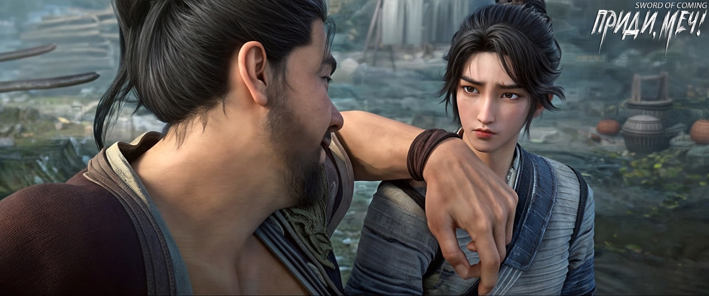

# Глава 5. Докопаться до истины

Сун Цзисинь вместе со служанкой Чжигуй пришел к старой софоре и обнаружил, что в тени дерева яблоку негде упасть. Около пятидесяти человек сидели на принесенных из дома скамейках и стульях, а дети продолжали подтягиваться, таща за собой старших, чтобы присоединиться к суматохе.

Сун Цзисинь и Чжигуй стояли плечом к плечу на краю тени и увидели старика, стоящего под деревом. Одной рукой он держал большую белую чашу, а другую заложил за спину. С воодушевленным выражением лица он громко говорил:

— Я уже рассказал об общем направлении драконьих вен, теперь расскажу о настоящем драконе. Тц-тц, это действительно нечто невероятное. Примерно три тысячи лет назад в мире появился выдающийся бессмертный. После долгих лет усердной практики он постиг великое Дао[1]. Он демонстрировал доблесть трех чи, показывая непревзойденное мастерство. Но почему-то этот человек особенно не ладил с водяными драконами. На протяжении трехсот лет он убивал драконов везде, где их находил, пока в мире не осталось ни одного истинного дракона. Только тогда он остановился, и его дальнейшая судьба неизвестна. Некоторые говорят, что он отправился в место, где зародились высшие даосские практики, чтобы обсуждать путь человека с патриархом Дао. Другие говорят, что он отправился в далекую Западный Рай[2], чтобы обсуждать сутры[3] и дхарму[4] с Буддой. А еще говорят, что он лично охраняет ворота подземного города Фэнду[5], чтобы предотвратить бедствия, вызванные злыми духами в мире смертных…

[1] Да́о (кит. 道, буквально — «путь») — одна из важнейших категорий китайской философии. В зависимости от контекста, самыми близкими интерпретациями термина могут быть такие понятия как «путь»: духовный путь, путь человека, Абсолют и его вечное действие. Наиболее известная даосская интерпретация Дао как Абсолюта содержится в трактате «Дао дэ цзин» где Дао даются такие характеристики как: неизреченное, пустое, невидимое, вечное, начало всех вещей. Конфуций и ранние конфуцианцы придали термину Дао этическое значение, истолковывая его как «путь человека», то есть нравственное поведение и основанный на морали социальный порядок.

[2] Западный Рай, Западная Чистая Земля (西方净土) — буддийский рай. В буддизме считается местом обитания Будды Амитабхи, идеальным местом для духовной практики.

[3] Слово «дхарма» буквально переводится как «то, что удерживает или поддерживает». В зависимости от контекста, дхарма может означать «нравственные устои», «религиозный долг», «универсальный закон бытия» и т. п. Сутры (переводится как «нить») — это священные тексты, содержащие учения. Сутры предназначены для изучения, понимания и применения учений. Примеры сутр: Сутра сердца, Алмазная сутра, Лотосовая сутра.

[4] Город-призрак Фэнду (酆都), одно из названий преисподней в Китае, там находятся врата в подземный мир. В ранних китайских источниках сказано о людях, идущих после своей смерти к Желтому источнику в горы Тайшань, Цзююань, Цзюцюань или Фэнду, где их участь отдана во власть земных и горных духов.

Старик говорил, разбрызгивая слюну, но все жители маленького городка оставались безучастными, с растерянными выражениями на лицах.

Служанка Чжигуй тихо и с любопытством спросила: 

— Что такое «доблесть трех чи»[5]?

[5] 三尺气概 — Вместе эти иероглифы образуют идиоматическое выражение, которое буквально можно перевести как «трехфутовый дух» или «доблесть трех чи». Это метафора, обозначающая величественный дух и мощную ауру, исходящую от меча (который обычно имеет длину около трех чи, то есть около метра. 1чи = 33см). В более широком смысле это выражение может использоваться для описания сильного характера или впечатляющего присутствия человека.

Сун Цзисинь усмехнулся: 

— Это меч.

Чжигуй раздраженно сказала: 

— Молодой господин, этот старик слишком любит хвастаться своими знаниями и не может говорить нормально.

Сун Цзисинь, бросив взгляд на старика, злорадно заметил: 

— В нашем городке мало кто умеет читать, этот сказитель словно строит глазки слепому.

Чжигуй снова спросила: 

— А что такое «благословенное место»? Действительно ли есть люди, способные прожить триста лет? И разве подземное царство Фэнду не место, куда попадают только после смерти?

Сун Цзисинь был озадачен вопросами, но не желая показывать свою некомпетентность, небрежно ответил: 

— Все это чепуха. Вероятно, он прочитал несколько низкопробных исторических романов и использует их, чтобы дурачить деревенщину.

В этот момент Сун Цзисинь остро заметил, что старик намеренно или нет бросил на него взгляд. Хотя это был лишь мимолетный взгляд, быстро скользнувший мимо, Сун Цзисинь все же внимательно уловил его, но не придал значения, считая простым совпадением.

Чжигуй подняла глаза к старой софоре, и тонкие лучи света, пробивающиеся сквозь листву, заставили ее невольно прищуриться. Сун Цзисинь повернул голову и вдруг замер.

Сейчас Чжигуй имела профиль, с которого только начинал сходить детский жирок, и она сильно отличалась от той субтильной тощей маленькой служанки, которую он помнил.

Согласно обычаям городка, когда девушка выходила замуж, нанимали человека, у которого были живы оба родителя и дети, а дом считался полным счастья, чтобы он удалил пушок с лица невесты, подровнял челку и виски. Это называлось «открытием лица» или «поднятием бровей».

Сун Цзисинь также читал в книгах об обычае, которого не было в их городке. Поэтому, когда Чжигуй исполнилось двенадцать лет, он купил лучшее молодое вино, достал тайно спрятанный красиво глазурованный фарфоровый кувшин цвета зеленой сливы, налил в него вино, аккуратно запечатал глиной и, наконец, закопал в землю.

Сун Цзисинь внезапно заговорил: 

— Чжигуй, хотя этот парень по фамилии Чэнь, согласно словам наших предков-учителей, относится к категории «гнилое дерево нельзя вырезать, стену из навоза нельзя оштукатурить»[6], как бы то ни было, он все-таки сделал в своей жизни одну значимую вещь.

[6] 朽木不可雕也，粪土之墙不可圬也 — «Гнилое дерево нельзя резать (использовать для резьбы), а стену из навозной земли нельзя штукатурить».

Чжигуй не ответила. Она опустила глаза, и можно было смутно разглядеть как трепещут ее ресницы.

Сун Цзисинь продолжал говорить сам с собой: 

— Чэнь Пинъань — неплохой человек, просто у него слишком упрямый характер. Что бы он ни делал, он признает только непреложные истины. Хотя он и стал гончаром, но как бы усердно он ни трудился и ни практиковался, ему не суждено создать ни одной по-настоящему одухотворенной вещи. Поэтому учитель Лю Сяньяна, тот старик Яо, который ни в грош не ставит Чэнь Пинъаня, имеет свое особое видение. Это и называется «гнилое дерево нельзя вырезать». Что касается «стену из навоза нельзя оштукатурить», то это примерно означает, что такой нищий, как Чэнь Пинъань, даже если ты оденешь его в императорские одежды, все равно останется неотесанным деревенщиной… — Дойдя до этого места, Сун Цзисинь самоиронично добавил: — На самом деле я еще более жалок, чем Чэнь Пинъань.

Чжигуй не знала, как утешить своего молодого господина.

Сун Цзисинь и его служанка Чжигуй всегда были горячей темой для разговоров во время чаепития и после еды среди богатых людей с улицы Благоденствия и Достатка и переулка Персиковых Листьев. И все это благодаря «приемному отцу» Сун Цзисиня, господину Суну.

В городке не было больших персон и не происходило особых событий, поэтому назначенный правительством инспектор по надзору за гончарным производством, несомненно, был подобен справедливому чиновнику из театральных пьес. Среди нескольких десятков чиновников-надзирателей в истории, господин Сун, предшественник нынешнего надзирателя, пользовался наибольшей любовью народа. В отличие от прежних высокомерных чиновников, он не прятался в своей резиденции, не занимался самосовершенствованием, не закрывал двери для посетителей и не посвящал все свое время учебе в кабинете. Вместо этого он лично занимался обжигом фарфора на императорских печах, больше походя на простого деревенского жителя, чем на ремесленника или гончара. За более чем десять лет этот изначально пропитанный ученостью господин Сун загорел до черного блеска, его повседневная одежда ничем не отличалась от одежды крестьянина, и он общался с людьми без всякого высокомерия. 

К сожалению, производимый в драконовых печах городка фарфор для императорского двора, не соответствовал ожиданиям ни по качеству глазури, ни по форме больших и малых изделий. Точнее говоря, по сравнению с прежними стандартами он даже немного уступал, что приводило в недоумение старых мастеров-гончаров.

В конце концов правительство решило, что усердный господин Сун, если и не достиг больших успехов, то по крайней мере приложил много усилий. В указе о его переводе обратно в столичное Министерство чинов он получил оценку «удовлетворительно». Перед отъездом в столицу господин Сун неожиданно потратил все свое состояние на строительство крытого моста. Когда позже обнаружилось, что в отъезжающем обозе господина Суна не было ребенка, несколько влиятельных семей городка вдруг все поняли. Можно сказать, что господин Сун установил неплохие отношения с жителями городка, и благодаря особому покровительству нынешнего инспектора, юный Сун Цзисинь все эти годы жил беззаботно, не зная нужды в еде и одежде. 

Что касается происхождения служанки, ныне известной как Чжигуй, ходили разные слухи. Местные жители из переулка Глиняных Кувшинов рассказывали, что однажды снежной зимой некая девочка из других мест, прося милостыню по дороге, упала без сознания у ворот дома Сун Цзисиня. Если бы ее не обнаружили вовремя, девочка уже отправилась бы к Владыке Яме, богу загробного мира, чтобы переродиться. Старики, работавшие в канцелярии, рассказывали другую историю, уверяя, что господин Сун в молодости купил сироту из другого места специально для того, чтобы найти для своего внебрачного сына Сун Цзисиня близкого человека, который будет понимать его и заботиться о нем, компенсируя таким образом невозможность признать отцовство.

Как бы то ни было, после того как служанка была названа Сун Цзисинем «Чжигуй», это окончательно подтвердило их отношения отца и сына. Ведь все знатные и богатые люди в городке знали, что на любимой чернильнице господина Суна выгравированы два иероглифа «Чжи Гуй».

Сун Цзисинь пришел в себя и расплылся в улыбке: 

— Почему-то вспомнил ту назойливую четвероногую змею. Подумай, Чжигуй, я даже бросил ее во двор Чэнь Пинъаня, а она все равно норовила пробраться к нам домой. Как ты думаешь, насколько же непривлекательной должна быть собачья конура Чэнь Пинъаня, чтобы даже маленькая змея не хотела туда заползти?

Чжигуй задумалась на мгновение и ответила: 

— Некоторые вещи зависят от судьбы, не так ли?

Сун Цзисинь поднял большой палец вверх и весело сказал: 

— Именно так! Чэнь Пинъань — человек с неглубокой судьбой и небольшой удачей. Он должен быть доволен уже тем, что просто живет.

Чжигуй промолчала.

Сун Цзисинь продолжал говорить сам с собой: 

— После нашего отъезда из города Чэнь Пинъань будет присматривать за вещами в доме. Интересно, не украдет ли он что-нибудь?

Чжигуй тихо сказала: 

— Молодой господин, неужели он способен на такое?

Сун Цзисинь рассмеялся: 

— О, Чжигуй, ты даже знаешь, что означает «присвоить вверенное имущество»?

Чжигуй моргнула своими прекрасными длинными глазами, подобными осенним водам [7]:

— Разве это не буквальное значение?

[7] 秋水长眸 — Это литературное выражение, описывающее красивые глаза. «Осенняя вода» (秋水) используется как метафора для ясных, чистых глаз, а «длинные глаза» (长眸) описывают привлекательную форму глаз. В китайской эстетике «длинные глаза» традиционно считаются признаком красоты. Они описывают форму, которая кажется удлиненной, с изящным разрезом. Это может включать в себя слегка приподнятые внешние уголки глаз. 

Сун Цзисинь улыбнулся и, глядя на юг, с тоской произнес: 

— Я слышал, что в столице книг даже больше, чем цветов, трав и деревьев в нашем городке!

В этот момент сказитель произнес: 

— Хотя в мире больше нет истинных драконов, их родственники, такие как цзяо, цю, чи[8] и другие, все еще действительно живут в мире людей. Кто знает, может быть… — Старик намеренно сделал паузу, но, увидев, что слушатели осталась равнодушными и не собираются подыгрывать, продолжил: — Возможно, они даже скрываются рядом с нами. Бессмертные даосы называют это «притаившийся в бездне дракон»![9]

[8] Цзяо (蛟龍) — Дракон в китайской мифологии, часто определяемый как «чешуйчатый дракон»; по мнению некоторых ученых, он безрогий и обитает в воде или реках. Возможно, это относится к виду крокодилов.

Цю (虬龍) — «свивающийся дракон», по одним версиям дракон с рогами, по другим — без. В нескольких классических китайских текстах и ​​комментариях времен династии Хань описывается как «дракон без рогов», что интерпретируется как «молодой или незрелый дракон».  Чи (螭龍) — «демон-дракон», безрогий дракон и горный демон.

[9] «Притаившийся в бездне дракон» (潜龙在渊) — даосское выражение, означающее, что талантливый или выдающийся человек скрывает свои способности, ожидая подходящего момента для их проявления. Это выражение происходит из классического китайского текста «И Цзин» («Книга Перемен»). Фраза из «Книги Перемен», обозначающая скрытый потенциал или талант, который еще не проявился.

Сун Цзисинь зевнул. Внезапно сверху упал лист софоры и приземлился прямо ему на лоб: такой свежий и зеленый, что казалось, с него вот-вот закапает роса. Сун Цзисинь протянул руку, схватил лист и покрутил черешок между пальцами.

※※※※

Думая о том, что ему все же следует отправиться к восточным воротам города, чтобы попытаться взыскать долг, Чэнь Пинъань приблизился к старой софоре и тоже увидел падающий перед ним лист. Он ускорил шаг, намереваясь поймать его, но порыв ветра пронесся мимо, и лист выскользнул из рук.

Чэнь Пинъань был проворным и быстро сделал шаг в сторону, намереваясь перехватить лист. Однако тот внезапно закрутился в воздухе.

Чэнь Пинъань не сдавался и несколько раз переступал и маневрировал, но в итоге так и не смог поймать лист софоры. Он ничего не мог поделать.

Юноша в синей одежде[10], сбежавший с занятий в деревенской школе, прошел мимо Чэнь Пинъаня, едва не задев его плечом. Юноша в синем даже не заметил, что на его плече каким-то образом оказался лист софоры.

[10] Одежда синего цвета (青衫). Часто это была форма чиновников низкого ранга, учеников или одежда простолюдинов. Также может означать повседневную одежду.

Чэнь Пинъань продолжил свой путь к восточным воротам города, думая, что даже если не получит денег, то хотя бы напомнит о долге.

Вдалеке, у лотка гадальщика, с закрытыми глазами отдыхал молодой даос и бормотал себе под нос: 

— Кто сказал, что небесная воля в своем круговороте не имеет предпочтений?[11]

[11] 是谁说天运循环无厚薄 — фраза отсылает к китайской философской концепции о том, что судьба или небесная воля (天运) действует циклично и непредвзято. Вопрос, заданный в этой фразе, ставит под сомнение эту идею, предполагая, что, возможно, судьба все-таки не так беспристрастна, как принято считать.

※※※※

П/п.: Итак, я не выдержала, и хочу немного поговорить о прочитанном. Хотя было всего немного глав, но как вы заметили, история не такая простая, как, возможно, кто-то ожидал. Друзья, также хочу услышать ваше мнение и о сюжете, и о том, нравится ли вам начало истории. Я не читала новеллу и знаю буквально на пару глав больше чем вы, потому спойлеров не будет:)

Судя по всему, автор нам постоянно намекает на то, какой Пинъань при всей своей старательности и трудолюбивой неудачник – судьба все время повернута к нему пятой точкой. Четвероногая змея, которая заползает в дом и приносит удачу, не захотела находиться в его доме, и все время лезла к Сун Цзисиню, хотя тот ее вышвыривал. Листья софоры пролетают мимо и их невозможно поймать (видимо они тоже тут играют не последнюю роль). Хотел купить золотистого карпа и упустил, деньги за работу ему не отдали.… Все в маленьком городке завязано на удаче и возможностях, данных судьбой, а также на том, как быстро эти возможности можно упустить, даже если они сваливаются на голову… Мне такой мир кажется весьма незаурядным на фоне других историй. Да и авторский стиль написания мне понравился. А как вам?

Также хотела спросить — почти в каждой главе получается довольно много сносок. Возможно я расшифровываю очевидные вещи и сноски вам мешают? Я могу попытаться адаптировать все под русский язык, но тогда утратится изрядная доля китайского колорита.