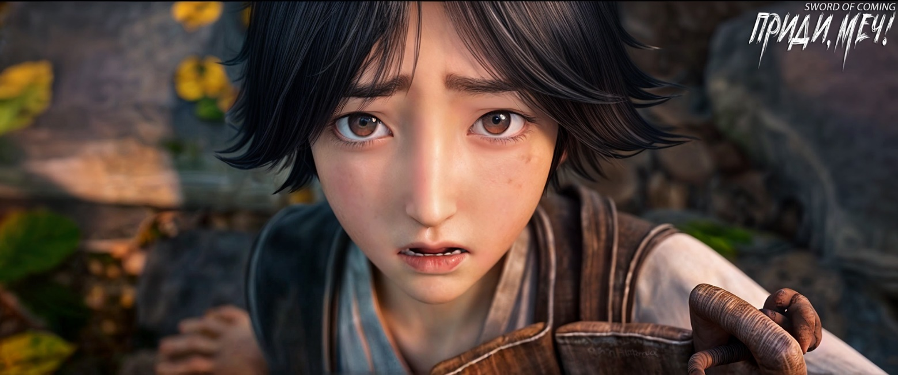

# Глава 6. Плохое предзнаменование

Чэнь Пинъань пришел к восточным воротам и увидел мужчину средних лет, сидящего со скрещенными ногами на пне у забора. Закрыв глаза, он лениво грелся на весеннем солнце, напевая мелодию и похлопывая руками по коленям.

Чэнь Пинъань присел рядом. Для него разговор о возврате долга был крайне неловким. Он молча смотрел на широкую дорогу на востоке, которая извивалась и тянулась вдаль, подобно толстой желтой змее.

По привычке он зачерпнул горсть земли, сжал ее в ладони и медленно растирал.

Раньше он сопровождал старика Яо в походах по горам вокруг городка, неся тяжелый рюкзак, полный различных инструментов, таких как мачете и мотыги. Под руководством старика Яо они останавливались в разных местах. Чэнь Пинъань часто «ел землю», беря горсть почвы прямо в рот, жуя и тщательно пробуя на вкус. Со временем он так наловчился, что мог определить качество почвы, просто растерев ее пальцами. Впоследствии он мог даже определить, из какой печи и каким мастером были изготовлены осколки керамики, просто взвесив их в руке.

Старик Яо был нелюдимым и бессердечным, часто бил и ругал Чэнь Пинъаня. Однажды, считая, что Чэнь Пинъань слишком туп и совершенно бестолков, в порыве гнева он бросил его в глухой местности и в одиночку вернулся к печи. Когда Чэнь Пинъань прошел шестьдесят ли по горной дороге и приблизился к той драконовой печи, была уже глубокая ночь. В тот день лил проливной дождь, и когда он, спотыкаясь, шел по грязи и наконец увидел вдалеке огонек, упрямый Чэнь Пинъань впервые после начала самостоятельной жизни почувствовал желание заплакать. Но он никогда не жаловался на старика и тем более не держал на него зла.

Чэнь Пинъань происходил из бедной семьи и не получил образования, но он понимал истину, которой нет в книгах: в мире, кроме родителей, никто не обязан быть к тебе добрым. А его родители умерли рано.

Он мог терпеливо сидеть в оцепенении. Неряшливый мужчина, казалось, понял, что ему вряд ли удастся выкрутиться, и, открыв глаза, с улыбкой сказал:

— Всего-то пять монет. Мужчина, который так мелочится, не добьется в будущем больших успехов.

Чэнь Пинъань с беспомощным видом сказал:

— Разве ты сам не мелочишься?

Мужчина ухмыльнулся, показав ряд неровных желтых зубов, и со смехом ответил:

— Поэтому, если не хочешь в будущем стать таким же холостяком, как я, не думай о тех пяти монетах.

Чэнь Пинъань вздохнул, поднял голову и серьезно сказал:

— Если тебе не хватает денег, забудь об этих пяти монетах. Но давай договоримся, что в будущем одно письмо будет стоить одну медную монету, и ты не будешь больше увиливать от оплаты.

Мужчина, от которого исходил кислый запах пота, повернул голову и с улыбкой сказал:

— Малец, с таким характером вонючего камня из выгребной ямы как у тебя, в будущем ты легко попадешь в большую беду. Разве ты не слышал старую поговорку, что терпеть убытки — это счастье? Если ты не хочешь терпеть даже небольшие убытки…

Он заметил глину в руках Чэнь Пинъаня, сделал паузу и насмешливо добавил:

— …то тебе суждено всю жизнь не разгибаясь гнуть спину на земле.

Чэнь Пинъань возразил:

— Разве я только что не сказал, что не нужно тех пяти монет? Разве это не считается небольшим убытком?

Мужчина немного растерялся, его лицо стало раздраженным, и он махнул рукой, прогоняя:

— Пошел вон, вон, вон! С тобой, малец, так утомительно разговаривать.

— На пне сыро…

Мужчина поднял голову, усмехнулся и выругался:

— Мне не нужны твои нравоучения, парень! Молодые люди полны сил, на их заднице можно лепешки печь!

Мужчина обернулся, бросил взгляд на удаляющуюся спину Чэнь Пинъаня, скривил рот и пробормотал что-то, похожее на ругательство в адрес небес.

※※※※

Сегодня учитель Ци, по неизвестной причине, неожиданно рано закончил занятия.

За школой располагался двор, в северной части которого была низкая маленькая калитка, ведущая в бамбуковую рощу.

Когда Сун Цзисинь и служанка Чжигуй слушали истории под старой софорой, кто-то позвал его играть в вэйци[1]. Сун Цзисинь не очень хотел идти, но тот человек сказал, что это желание учителя Ци, который хочет посмотреть, улучшились ли их навыки игры. У Сун Цзисиня было неопределенное чувство к сдержанному учителю Ци, которое можно было бы назвать смесью уважения и страха, поэтому, когда учитель лично отдал этот «императорский указ», Сун Цзисинь не мог отказаться.

[1] Вэйци (围棋) — логическая настольная игра с глубоким стратегическим содержанием, возникшая в Древнем Китае, по разным оценкам, от 2 до 5 тысяч лет назад. До XIX века культивировалась исключительно в Восточной Азии, в XX веке распространилась по всему миру. В Японии игра называется го.

Однако он настаивал на том, чтобы дождаться окончания истории сказителя, прежде чем отправиться во двор за школой. Юноша в синем халате, передавший послание от учителя, был вынужден уйти первым, не забыв напомнить Сун Цзисиню, чтобы тот не опаздывал, снова и снова повторяя старую песню о том, что его учитель больше всего ценит правила и не любит, когда люди не держат слово, и так далее.

Сун Цзисинь в тот момент ковырял в ухе и нетерпеливо сказал:

— Знаю, знаю.

Когда Сун Цзисинь привел Чжигуй во двор позади школы, дул прохладный ветерок. Утонченный и образованный юноша в синем, как обычно, уже сидел на скамейке с южной стороны, с прямой спиной и серьезным выражением лица. Сун Цзисинь плюхнулся на скамейку напротив него, лицом на юг. Учитель Ци сидел на западной стороне, как всегда молча наблюдая за игрой.

Каждый раз, когда молодой господин играл с кем-то в вэйци, служанка Чжигуй уходила гулять в бамбуковую рощу, чтобы не мешать трем ученым мужам. Сегодняшний день не был исключением.

В этом отдаленном городке не было так называемых «семей с литературными традициями», поэтому образованные люди были здесь редкостью.

Согласно старым правилам, установленным учителем Ци, Сун Цзисинь и юноша в синем халате должны были угадывать, кто будет играть черными камнями и ходить первым.

Сун Цзисинь и его сверстник напротив начали учиться играть в вэйци почти одновременно, но Сун Цзисинь был одаренным и быстро прогрессировал в игре, поэтому учитель Ци, обучавший обоих этому искусству, считал его игроком высокого уровня. При угадывании, Сун Цзисинь первым вынимал из шкатулки горсть белых камней, количество которых было неизвестно. Затем юноша в синем халате брал один или два черных камня, и если он угадывал четность или нечетность белых камней, то получал право играть черными и ходить первым, что давало преимущество. В первые два года их противостояния Сун Цзисинь не проиграл ни разу, независимо от того, играл ли он белыми или черными.

Однако Сун Цзисинь не проявлял большого интереса к вэйци и занимался ими нерегулярно. В отличие от него, менее одаренный юноша в синем халате, будучи учеником местной школы и помощником учителя, постоянно находился рядом с учителем Ци. Даже просто наблюдая за тем, как учитель сидит и анализирует партии, он извлекал большую пользу. Поэтому юноша в синем халате прогрессировал от редких случайных побед черными до того, что теперь, играя черными, имел равные шансы на победу с Сун Цзисинем. Прогресс в его мастерстве и тактике был очевиден. Учитель Ци никак не комментировал это изменение баланса сил, лишь молча наблюдая со стороны.

Когда Сун Цзисинь собирался взять камни, учитель Ци внезапно сказал:

— Сегодня вы сыграете партию с заранее расставленными камнями, белые ходят первыми.

Оба юноши были в замешательстве, не зная, что такое «партия с заранее расставленными камнями».

Учитель Ци неспешно и подробно объяснил правила, которые оказались несложными: нужно было просто поставить по одному черному и белому камню на четыре угловые точки.

Учитель Ци брал и ставил камни с изяществом, его движения были плавными и приятными для глаз.

Юноша в синем халате, обычно строго соблюдающий правила, услышав эту «плохую новость», застыл с открытым ртом, уставившись на доску, и наконец осторожно сказал:

— Учитель, похоже, что многие стандартные комбинации теперь нельзя будет использовать.

Сун Цзисинь нахмурился, задумавшись на мгновение, затем его лицо просветлело, и он с облегчением сказал:

— Игровое поле на доске уменьшилось. — Затем поднял голову и с улыбкой спросил, словно ища одобрения: — Верно, учитель Ци?

Учитель Ци кивнул и сказал:

— Действительно, так и есть.

Сун Цзисинь поднял бровь, глядя на сверстника напротив, и с улыбкой спросил:

— Хочешь, я дам тебе фору в два камня? Иначе ты точно проиграешь.

Юноша в синем халате мгновенно покраснел до ушей и начал заикаться. Он прекрасно понимал, что его все более частые победы в последнее время были не только результатом улучшения его навыков, но и следствием того, что Сун Цзисинь стал играть все более рассеянно и даже с некоторым раздражением. Во многих решающих моментах Сун Цзисинь намеренно поддавался или, заняв выгодную позицию в начале игры, к середине партии намеренно рисковал, пытаясь уничтожить большую группу противника.

Для талантливого Сун Цзисиня главным было то, насколько интересной и увлекательной была партия.

Юноша в синем с момента, когда впервые поставил камень на доску, был одержим идеей «победы или поражения».

Учитель Ци посмотрел на своего ученика:

— Ты можешь играть белыми и ходить первым.

Затем юноша в синем халате стал делать ходы медленно, осторожно, продумывая каждый шаг. Сун Цзисинь, напротив, ставил камни быстро, играя смело и решительно, словно антилопа, цепляющаяся за скалу. Их характеры различались, как небо и земля.

Не прошло и восьмидесяти ходов, как юноша в синем халате проиграл вчистую. Он плотно сжал губы и молча опустил голову.

Сун Цзисинь, упершись локтем в стол и подперев щеку, держал камень двумя пальцами другой руки, легко постукивая им по каменному столу и вглядываясь в позицию на доске.

По правилам учителя Ци, в конце партии проигравший должен был молча положить камень, признавая поражение, но ни в коем случае нельзя было произносить слова «Я проиграл».

Хотя юноша в синем халате был недоволен, он все же медленно положил камень.

Учитель Ци распорядился юноше в синем халате:

— Иди практиковаться в каллиграфии, не нужно убирать доску. Напиши иероглиф «вечность» триста раз.

Юноша поспешно встал и почтительно поклонился, прощаясь.

После того, как он ушел, Сун Цзисинь тихо спросил:

— Учитель тоже собирается покинуть это место?

Элегантный ученый с седыми висками кивнул:

— Да, в течение десяти дней.

Сун Цзисинь улыбнулся:

— Это хорошо, я смогу проводить учителя.

Учитель Ци помедлил мгновение, но в конце концов сказал:

— Не нужно меня провожать. Сун Цзисинь, когда ты окажешься за пределами городка, помни, не будь слишком высокомерным. У меня нет ничего особенного, но есть три книги для начального обучения: — «Начальное обучение», «Ритуалы и музыка» и «Созерцание совершенства». Ты можешь взять их все и часто перечитывать. Помни, что если прочитать книгу сто раз, ее смысл раскроется сам собой. Если же ты сможешь прочитать десять тысяч книг, то будешь писать, словно по божественному вдохновению. Истинный смысл этого… ты позже поймешь сам. Что касается трех книг для досуга: по математике «Тонкости искусства нумерологии», сборник партий вэйци «Персик и слива», и собрание сочинений «Стратегии гор и морей», ты можешь читать их в свободное время, это поможет успокоить душу и совершенствовать характер[2].

[2] Подробности в конце главы.

Сун Цзисинь был очень удивлен и немного смущен. Набравшись смелости, он сказал:

— Учитель, кажется, вы словно «передаете сироту на попечение», мне от этого не по себе.

Лицо учителя Ци озарилось улыбкой, и он мягко ответил:

— Ты преувеличиваешь. В жизни повсюду случаются встречи. Когда-нибудь наступит день, когда мы снова увидимся.

Когда учитель Ци улыбался, это было подобно ласковому весеннему ветру. Вдруг он сказал:

— Сходи к Чжао Яо[3], можешь попрощаться с ним заранее.

[3] Чжао Яо (赵繇).Чжаo — одна из самых древних китайских фамилий. Может означать «добрый», «мягкий», «спокойный».Яо —имя, которое может означать «путь судьбы».

Сун Цзисинь встал и с улыбкой сказал:

— Хорошо. Тогда побеспокою господина убрать эту партию вэйци.

Сказав это, он радостно убежал.

Господин Ци наклонился, чтобы собрать камни. На первый взгляд казалось, что они разбросаны в беспорядке, то тут, то там, но на самом деле он собирал их в определенном порядке: сначала черные, потом белые, начиная с последнего черного камня, поставленного Сун Цзисинем, восстанавливая ход игры в обратном порядке, не пропустив ни одного камня.

Незаметно служанка Чжигуй уже вернулась из бамбуковой рощи, но стояла за воротами, не заходя во двор.

Господин Ци, не оборачиваясь, низким голосом произнес:

— Веди себя хорошо.

Чжигуй, выросшая в переулке Глиняных Кувшинов, в этот момент выглядела совершенно растерянной, нежной, слабой и робкой, вызывая жалость. На лице утонченного и элегантного ученого появился намек на гнев, он медленно повернул голову и посмотрел на нее холодным взглядом. Чжигуй все еще выглядела сбитой с толку, невинной и наивной.

Господин Ци встал, величественный, как нефритовое дерево на ветру, посмотрел на Чжигуй и холодно усмехнулся:

— Порочное отродье!

Чжигуй медленно стерла с лица невинное выражение, ее взгляд постепенно стал холодным, а на губах появилась насмешливая улыбка. Казалось, она говорила: «Ну и что ты можешь мне сделать?»

Она продолжала прямо смотреть в глаза господину Ци. Внутри и снаружи маленького двора, казалось, противостояли друг другу два питона. Они смотрели друг на друга как на заклятых врагов.

Издалека раздался громкий голос Сун Цзисиня:

— Чжигуй, пора домой!

Чжигуй тут же встала на цыпочки и послушно ответила:

— Ах, хорошо, молодой господин.

Она толкнула ворота, проскочила мимо учителя, слегка задев его. Пробежав несколько шагов, не забыла обернуться и сделать глубокий поклон его спине, произнеся мелодичным и приятным голосом:

— Господин учитель, Чжигуй уходит первой.

Спустя долгое время господин Ци вздохнул.

Весенний ветер был мягким и теплым, листья бамбука колыхались, словно шелестели переворачиваемые страницы книги.

Молодой даос с высокой заколкой в форме лотоса собирал свои вещи, вздыхая и охая. Знакомые жители городка спрашивали о причине, но он лишь качал головой, не отвечая.

Одна новобрачная, которая когда-то гадала здесь о своей судьбе, проходя мимо и увидев такое странное поведение, застенчиво остановилась. Ее голос был мягким и нежным, она задавала вопросы, но ее влажные, говорящие глаза усердно блуждали по красивому лицу молодого даоса.

Молодой даос незаметно взглянул на женщину, его взгляд слегка опустился, осматривая пышный «пейзаж». Сглотнув слюну, он произнес загадочную фразу:

— Сегодня этот бедный даос погадал для себя и вытянул плохую палочку — грядет большая беда.

※※※※

[2] «小学» — «Начальное обучение» или «Элементарное образование». Это древний китайский учебник, который использовался для обучения детей основам грамотности и морали.

«礼乐» — «Ритуалы и музыка». Это название относится к двум из шести классических искусств (六艺) в древнем Китае. «Ритуалы» относятся к этикету, церемониям и надлежащему поведению, а «музыка» — к исполнению музыки и пониманию ее роли в гармонизации общества.

«观止» — «Созерцание предела» или «Созерцание совершенства». Это название может относиться к различным литературным произведениям, но чаще всего ассоциируется со сборником классических китайских эссе и стихотворений, составленным во времена династии Мин (1368-1644). Название подразумевает глубокое понимание и оценку прекрасного, достигнутые через тщательное наблюдение и размышление.

«术算 «精微» — «Тонкости искусства вычислений» или «Искусство нумерологии»: Тонкости». Это книга, посвященная древнекитайским методам гадания, нумерологии и другим эзотерическим практикам.

«棋谱 «桃李» — «Персик и слива» (сборник партий вэйци). «桃李» буквально означает «персик и слива», но это также может быть метафорой для учеников или последователей.

«文集 «山海策» — «Литературная коллекция: Записи о Горах и Морях» или «Собрание сочинений: Стратегии Гор и Морей». Это собрание литературных произведений или эссе. «Горы и Моря» могут представлять широту и разнообразие тем, охватываемых коллекцией, а «Записи» или «Стратегии» указывают на глубину и значимость содержания.