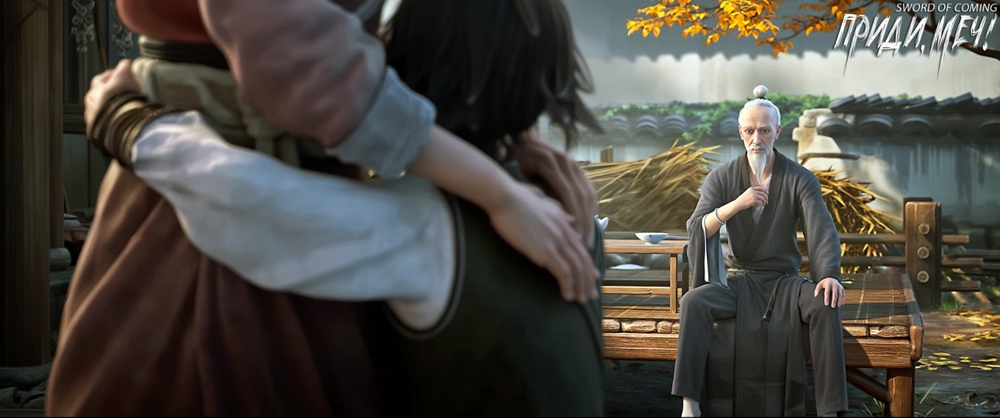

# Глава 07. Чаша с водой

В переулке Цветущих Абрикосов был колодец, называемый колодцем с железной цепью. Железная цепь, толщиной с руку молодого мужчины, год за годом свисала внутри колодца. Когда появился этот колодец и эта цепь, и кто совершил это странное и бессмысленное дело, давно уже никто не знал. Даже самые старые жители городка не могли рассказать об этом ничего определенного.

Ходили слухи, что когда-то в городке нашелся любопытный человек, который, несмотря на увещевания стариков, решил проверить, насколько длинная эта цепь. Он совершенно не принял во внимание старое правило, передаваемое из уст в уста: «Тот, кто вытащит железную цепь из колодца, потеряет один год жизни за каждую вытащенную треть метра». В результате, после того как он с усилием тянул цепь в течение времени, необходимого для сгорания одной благовонной палочки, он вытащил большую кучу железных звеньев, но так и не увидел конца. Человек был уже совершенно измотан, поэтому он оставил вытащенную из колодца цепь свернутой рядом с воротом, сказав, что вернется завтра, и что не верит в эти суеверия.

Однако, вернувшись домой, в тот же день у него пошла кровь из семи отверстий[1], и он умер в своей постели, причем с открытыми глазами. Как бы родственники ни старались, они никак не могли закрыть ему глаза. В конце концов, один старик, чья семья из поколения в поколение жила рядом с колодцем, попросил родственников отнести тело к колодцу. Покойник «широко открытыми глазами» наблюдал, как старик возвращал цепь обратно в колодец. Когда вся цепь снова полностью погрузилась в глубины колодца, глаза покойника наконец закрылись.

[1] Цицяо (七窍) — семь отверстий в голове: глаза, уши, ноздри и рот.

Старик и ребенок медленно подошли к колодцу с железной цепью. Малыш, у которого из носа свисали две сопли, рассказывал эту историю четко и последовательно, совсем не как деревенский ребенок, который учился всего полгода. Мальчик задрал голову, глядя большими, похожими на черные виноградины, глазами, слегка шмыгнули носом, и две маленькие сопли-змейки втянулись обратно. Посмотрев на сказителя, который держал в руке большую белую чашу, мальчик надул губы и сказал:

— Я закончил рассказывать, теперь ты можешь показать мне, что у тебя в чаше?

Старик усмехнулся и ответил:

— Не торопись, не торопись. Давай сначала сядем у колодца, а потом я покажу тебе все, что захочешь.

Ребенок «доброжелательно» напомнил:

— Не смей отступать, иначе плохо кончишь: как только подойдешь к колодцу с железной цепью, сразу в него упадешь, и я даже не стану вытаскивать твой труп! Или вдруг ударит гром и расколет тебя на обугленные куски, тогда я возьму камень и потихоньку раздроблю…

Старик, слушая, как ребенок сыплет словами, словно горохом из бамбуковой трубки, длинную череду недобрых выражений без повторов, почувствовал головную боль и поспешно сказал:

— Обязательно покажу тебе. Кстати, от кого ты нахватался этих выражений?

Ребенок решительно ответил:

— У моей матери, конечно!

Старик с чувством произнес:

— Воистину, край талантов и процветания.

Ребенок внезапно остановился и, нахмурившись, спросил:

— Ты что, ругаешься? Я знаю, некоторые любят говорить хорошие слова наоборот, как Сун Цзисинь!

Старик поспешно отрицал это, затем сменил тему:

— В городке часто происходят странные вещи?

Ребенок кивнул.

— Расскажи мне.

Ребенок показал пальцем на старика и серьезно сказал:

— Например, ты держишь большую белую чашу, но не разрешаешь людям класть в нее медные монеты. Еще до того, как ты закончил рассказывать историю, моя мама сказала, что ты рассказываешь неплохо, но туманно, и видно, что ты привык мошенничать. Поэтому она велела мне дать тебе несколько монет, но ты ни за что не хочешь их брать. Так что же на самом деле в твоей чаше?

Старик не знал, смеяться ему или плакать.

Оказалось, это был тот самый сказитель, который ранее рассказывал истории под старой софорой. Он попросил ребенка проводить его в переулок Цветущих Абрикосов, чтобы посмотреть на тот колодец. Поначалу ребенок не хотел идти, но старик сказал, что его белая чаша имеет большое значение и содержит невероятные редкости. Мальчик от природы был живым и непоседливым, и родители говорили, что при перерождении он забыл отрастить себе задницу. С малых лет он любил бродить повсюду с компанией бездельников во главе с Лю Сяньяном. Однако ради того, чтобы поймать угря или вьюна, маленький проказник мог неподвижно жариться под солнцем полдня, проявляя удивительное терпение. Поэтому, когда старик сказал, что в белой чаше что-то лежит, мальчик сразу же клюнул на приманку.

Даже когда старик сначала выдвинул странное требование — попробовать поднять его, чтобы узнать, насколько он тяжелый, и весит ли он сорок цзиней[2], ребенок без колебаний согласился, ведь от того, что его несколько раз поднимут, он не потеряет ни куска мяса.

[2] Цзинь — мера веса, равна 0,5кг.

Но затем произошло нечто, от чего мальчик раз за разом закатывал глаза: старик, державший чашу в левой руке, изо всех сил своей правой рукой пытался поднять его пять или шесть раз, но ни разу не смог успешно это сделать. В конце концов, мальчик покосился на тонкие руки и ноги старика, покачал головой и подумал, что хоть они оба худые, но сила того нищеброда Чэнь Пинъаня намного больше, чем у этого старика. Однако, помня о том, что он еще не увидел содержимое чаши, ребенок, словно повзрослевший не по годам, сдержался и не сказал ничего, что могло бы поставить старика в неловкое положение.

Надо сказать, что в районе переулков Глиняных Кувшинов и Цветущих Абрикосов, когда дело доходило до споров и ругани на улицах, особенно до саркастических замечаний, этот мальчик мог занять третье место, вторым был образованный Сун Цзисинь, а первой — мать этого ребенка.

Старик подошел к колодцу, но не сел на его край.

Древний колодец был сложен из серого кирпича, с небольшим устьем. Взглянув внутрь, старик не смог разглядеть дна, и более того, у него возникло смутное ощущение, будто кто-то смотрит на него в ответ.

Незаметно для себя старик начал тяжело дышать.

Мальчик подошел к колодцу, повернулся к нему спиной, подпрыгнул и приземлился ягодицами прямо на край.

Увидев это, старик покрылся холодным потом. Одно неосторожное движение, и мальчишка мог бы упасть прямо вниз. Учитывая историю этого древнего колодца, даже тело будет трудно найти.

Старик медленно сделал несколько шагов вперед, прищурился и наклонился, внимательно рассматривая железную цепь, один конец которой был крепко привязан к основанию ворота.

«Место с превосходным фэншуй, лучшее во всей области», — подумал он.

Старик оглядел окрестности, испытывая смешанные чувства, и подумал:

«Интересно, кому в конце концов достанется этот важный артефакт?»

Он вытянул свободную левую руку и пристально посмотрел на ладонь. Линии на ней были сложными и неясными. Но появилась новая линия, которая медленно удлинялась, напоминая трещину на фарфоре.

Мудрецы читают по ладони, как по карте гор и рек. Однако этот старик в данный момент просто смотрел на самого себя. Он нахмурился и с удивлением произнес:

— Всего за полдня ситуация стала такой печальной, тогда как же обстоят дела у тех нескольких человек?

Ребенок уже стоял на краю колодца, одной рукой упершись в бок, а другой указывая на старика, и громко торопил:

— Ты покажешь мне наконец белую чашу или нет?!

Старик беспомощно сказал:

— Быстро слезай, быстро слезай, я сейчас тебе покажу!

Ребенок, все еще сомневаясь, в конце концов спрыгнул с края колодца.

Старик на мгновение заколебался, затем с серьезным выражением лица сказал:

— Малыш, нам суждено было встретиться. Я могу показать тебе чудеса этой чаши, но после того, как увидишь, ты не должен рассказывать об этом посторонним, даже твоей матери. Но если не сможешь сдержать обещание, то даже если ты, малыш, будешь тыкать меня в спину, я и глазком не дам тебе заглянуть.

Ребенок моргнул:

— Начинай.

Старик торжественно подошел к краю колодца и, наклонив голову, обнаружил, что мальчишка на этот раз сидит на краю колодца, широко расставив ноги и немного пожалел, что связался с таким непослушным ребенком.

Отбросив посторонние мысли, старик повернулся лицом к колодцу, пятью пальцами обхватил дно большой белой чаши и начал едва заметно наклонять ладонь.

Ребенку казалось, что прошло довольно много времени, но белая чаша над его головой оставалась неподвижной, а старик сохранял ту же позу.

Как раз в тот момент, когда две струйки соплей у мальчика почти дошли до уголков рта, и его терпение было на исходе, из белой чаши полилась струйка воды толщиной с палец и беззвучно упала в глубину колодца.

Мальчик оскалил зубы, собираясь разразиться руганью, но внезапно закрыл рот, несколько удивленный. Через мгновение выражение его лица сменилось с шокированного на растерянное. Затем он начал испытывать страх, внезапно опомнился, спрыгнул с края колодца и побежал домой.

Оказалось, что количество воды, которое старик вылил из белой чаши в колодец, уже давно превысило объем большого кувшина. Но вода продолжала литься и литься.

Мальчик решил, что он определенно увидел призрака средь бела дня.

※※※※

Лю Сяньян небрежно сорвал у обочины дороги ветку с только что проклюнувшимися почками и начал практиковаться в фехтовании. Он крутился как безумный волчок, совершенно не жалея своих новых сапог и поднимая на тропинке бесчисленные клубы пыли.

Лю Сяньян покинул городок и шел с севера на юг. Ему нужно было только миновать крытый мост, построенный на деньги господина Суна, и пройти еще три-четыре ли, чтобы добраться до кузницы, открытой отцом и дочерью семьи Жуань. На самом деле, Лю Сяньян всегда был высокомерен, но мастер Жуань заставил его преклоняться перед собой всего одной фразой:

— Мы пришли сюда только для того, чтобы разжечь печь и выковать меч.

Ковка меча — это здорово! Как только Лю Сяньян подумал о том, что в будущем у него будет настоящий меч, он не мог сдержать своего возбуждения, бросил ветку и побежал, крича на ходу.

Лю Сяньян вспомнил несколько боевых стоек, которым мастер Жуань обучал его в частном порядке, и начал практиковаться. Его движения выглядели довольно правдоподобно и энергично.

Он приближался к крытому мосту. На ступенях у северного конца моста сидели четверо: изящная и пышная красавица, держащая на руках мальчика в ярко-красном халате. Мальчик высоко задрал подбородок, словно полководец, только что одержавший великую победу. На другом конце ступеней сидел высокий старик с седой головой, тихо утешая надувшуюся маленькую девочку. Девочка была изящна, как самая искусная фарфоровая кукла в мире, ее нежная кожа сияла на солнце, настолько прозрачная, что можно было ясно разглядеть голубые вены под ней.

Дети только что поссорились, маленькая девочка была готова расплакаться, а мальчик выглядел еще более довольным собой.

Старик был крупного телосложения, словно маленькая гора. Сидящая рядом женщина бросила на него извиняющийся взгляд, но величественный старик сделал вид, что не заметил этого.

Внизу лестницы стоял молодой человек, который был старшим внуком главы семьи Лу и звали его Лу Чжэнчунь[3]. Возможно, родная земля действительно взращивает своих людей, ведь уроженцы маленького городка всегда выглядели лучше, чем мужчины и женщины из других мест. Однако Лу Чжэнчунь уже давно растратил себя на вино и женщин, и в глазах четверых, сидящих на ступенях, выглядел просто неприглядно.

[3] Лу Чжэнчунь (卢正淳). Лу — распространенная китайская фамилия. Может означать «олень» или «спокойный, тихий». Имя Чжэнчунь можно интерпретировать как «истинная чистота».

Семья Лу владела драконовыми печами, которые превосходили все в городке как по количеству, так и по масштабам. Род Лу был тем родом, чьи члены чаще всего уезжали в другие места, чтобы пустить там корни. Однако Лу Чжэнчунь, который когда-то был весьма влиятелен в городке, теперь выглядел скованно, лицо его побледнело, и весь он был напряжен, словно малейшая оплошность могла привести к конфискации имущества и истреблению всего его рода до девятого колена.

Мальчик говорил слова, непонятные простым жителям городка:

— Матушка, этот маленький червячок по фамилии Лю, его предок действительно тот самый…

Как только он собирался произнести имя, женщина тут же закрыла ему рот:

— Сколько раз твой отец наказывал тебе перед выходом из дома, что здесь нельзя называть чьи-либо имена.

Мальчик разжал руки женщины, его глаза горели, и он спросил приглушенным голосом:

— В их семье правда из поколения в поколение передаются драгоценный доспех и «Канон Меча»[4]?

[4] «剑经» — «Канон Меча» или «Трактат о мече». Обычно относится к древним китайским текстам или трактатам, посвященным искусству владения мечом, техникам фехтования и философии боевых искусств, связанных с мечом.

Женщина ласково погладила мальчика по голове и мягко ответила:

— Клан Лу ручается половиной родословной, что эти два сокровища спрятаны в доме того юноши.

Мальчик вдруг капризно спросил:

— Матушка, матушка, можем ли мы обменяться сокровищами с семьей Сяо Бай? Та драгоценная броня, которую мы планировали получить, слишком уродлива. Подумай, мама, если мы обменяем ее на «Канон Меча», то сможем даже во сне летающим мечом отсекать головы, и никто этого не заметит — ни боги, ни духи. Разве это ненамного лучше, чем какой-то панцирь черепахи?

Не дожидаясь, пока женщина объяснит причину, стоявшая рядом девочка уже гневно воскликнула:

— Да как ты смеешь посягать на наше давно утраченное сокровище, охраняющее гору? Мы пришли сюда, чтобы по праву вернуть то, что принадлежит нам, а не как некоторые бессовестные люди, которые ведут себя как разбойники, воры или даже попрошайки!

Мальчик повернул голову, скорчил гримасу и насмешливо сказал:

— Вонючая девчонка, ты сама сказала, что это сокровище, охраняющее «гору». Подумаешь, всего лишь ранг в иерархии школы боевых искусств, велика важность?

Мальчик внезапно изменил свое насмешливое выражение лица. Встав с колен женщины, он посмотрел на маленькую девочку сверху вниз с сочувствием, словно учитель, отчитывающий наивного ученика:

— Великий путь к долголетию и противостоянию воле небес заключается лишь в слове «борьба». Если ты даже этого не понимаешь, как ты собираешься унаследовать семейное дело и соблюдать заветы предков? Вы, потомки горы Истинного Ян, обязаны каждые тридцать лет увеличивать высоту горы как минимум на сто чжанов[5]. Вонючая девчонка, ты думаешь, что твоему деду и отцу это давалось легко?

[5] Чжан — мера длины, 3,2 м.

Маленькая девочка несколько потеряла уверенность, ее вид стал удрученным, она опустила голову, не осмеливаясь смотреть мальчику в глаза.

Седовласый крепкий старик мрачно произнес:

— Хоть госпожа и говорит, что дети не ведают, что творят, но если из-за этого пострадает духовный путь нашего юного господина, вам придется отвечать за последствия.

Женщина очаровательно улыбнулась и снова притянула к себе нахмурившегося маленького сына, мягко, но с подтекстом сказала:

— Это всего лишь детская ссора. Уважаемый Юань[6], зачем так преувеличивать? Не стоит портить тысячелетнюю дружбу между нашими семьями.

[6] Имя Юань (猿) переводится как «Обезьяна».

Неожиданно старик, обладавший крайне вспыльчивым характером, прямо парировал:

— Наша гора Истинного Ян основана две тысячи шестьсот лет назад. За добро мы платим добром, даже если прошла тысяча лет, мы не забываем; за обиду мы мстим, и наша вражда никогда не длится дольше одной ночи!

Женщина улыбнулась, не желая вступать в спор.

В этой поездке в городок каждый нес тяжелую ответственность, особенно она, которая в этой рискованной игре поставила на кон свою жизнь, будущее сына и фамильные ценности.

Хотя одежда этой женщины была простой, она держалась с достоинством. Просто местные жители, не видавшие мира, не понимали всех тонкостей.

Все это время Лу Чжэнчунь стоял спиной к ступеням крытого моста.

Раньше, во время первого визита в поместье клана Лу, он увидел этих высокопоставленных гостей. Его собственный младший брат, будучи молодым и горячим, не обладал достаточной выдержкой и на мгновение позабыл наставления деда и непроизвольно бросил взгляд на грудь прекрасной госпожи. Разъяренный дед тут же велел слугам утащить его во двор и жестоко забить насмерть, причем ему даже рот заткнули тряпкой, чтобы заглушить отчаянные крики. Поэтому Лу Чжэнчунь, сопровождавший деда на заседании в главном зале, не слышал жалобных воплей брата и не видел растерзанного тела.

Когда переговоры закончились они вместе отправились на поиски того молодого человека по фамилии Лю. Лишь выйдя за порог главного зала, Лу Чжэнчунь заметил, что во дворе уже не осталось и следа крови. Те четверо гостей, прибывших издалека, включая двух детей, похожих на небесных созданий, совершенно не придавали этому значения, словно такое здесь в порядке вещей. В тот момент Лу Чжэнчунь почувствовал некоторую растерянность.

В прошлом году, накануне нового года, дед привел их, братьев, в тайную комнату и сообщил новость: семья Лу вскоре будет выполнять поручения для неких важных персон. Это было огромной удачей, и нужно было действовать очень осторожно. Если все пройдет успешно, семья Лу использует полученное вознаграждение, чтобы проложить путь для двух братьев. Достаточно лишь кивка от знатных людей, и перед братьями откроется широкая дорога, ведущая их к быстрому продвижению по службе и в конечном итоге к невообразимому богатству и славе. Именно тогда он понял, почему они с братом с детства изучали так много странных диалектов.

Лу Чжэнчунь смотрел на Лю Сяньяна, который все ближе подходил к крытому мосту, и вдруг почувствовал к нему сильную ненависть. Этот бедняк, которого он когда-то со своими людьми загнал в переулок, лежал тогда на земле, как дохлая собака. Если бы не какой-то маленький негодяй, который прибежал к входу в переулок и закричал: «Человек умер!», он и его приятели, как и договаривались, уже собирались снять штаны и обрушить на голову этого высокомерного юнца целый поток «благодатного дождя». Лу Чжэнчунь до сих пор не понимал, почему эти высокопоставленные особы вдруг обратили внимание на Лю Сяньяна. Что касается их так называемых драгоценных доспехов, «Канона Меча», горы Истинного Ян, великого пути долголетия, борьбы за удачу и судьбу — Лу Чжэнчунь вроде бы все понимал, но на самом деле ничего не понимал. Однако он был уверен в одном: он очень хотел, чтобы Лю Сяньян умер здесь. Что касается истинной причины, Лу Чжэнчунь не осмеливался признаться в ней даже себе и не хотел об этом глубоко задумываться.

В глубине души он абсолютно не желал, чтобы презренный, как собака, Лю Сяньян, увидел его, избалованного молодого господина семьи Лу, опустившегося до такого же жалкого состояния, как и он сам. Это было бы величайшим позором и унижением.

Красивая женщина, глядя на Лю Сяньяна, прошептала:

— Пришел.

Лю Сяньян шел, размахивая кулаками и в конце концов его удары стали стремительными, все быстрее и быстрее, до такой степени, что его тело было увлечено силой ударов, и он слегка пошатывался.

В глазах экспертов в его неотесанном, зачаточном кулачном искусстве уже проглядывали намеки на великолепный стиль, сочетающий твердость и мягкость.

В искусстве боевых кулаков есть поговорка для новичков: «Не постигнув истинного смысла кулака, останешься профаном и через сто лет. Постигнув истинный смысл кулака, через десять лет сможешь сражаться с демонами и богами».

Красивая женщина с облегчением подумала, что, как и ожидалось, этот юноша по фамилии Лю и есть тот, кого они искали. Его талант действительно незаурядный, даже в их бессмертных поместьях его врожденные качества нельзя недооценивать. Конечно же, в обширном мире, к которому принадлежали красивая женщина и крепкий седовласый старик, таких людей было больше всего.

Красавица поднялась с места и приказала стоящему внизу у ступеней Лу Чжэнчуню:

— Ступай и расспроси того юношу, что он хочет в обмен на передачу этих двух семейных реликвий — доспеха и «Канона Меча».

Лу Чжэнчунь тут же склонился в поклоне и ответил на диалекте простых жителей этого городка, словно слушая непонятные священные писания:

— Да, госпожа.

Красавица безразлично добавила:

— Помни, когда будешь говорить с тем юношей, будь мягок и сдержан, соблюдай субординацию.

Мальчик указал пальцем сверху вниз и грозным голосом сказал:

— Если хоть что-то испортишь, то мой господин тут же сдерет с тебя кожу, вырвет жилы, а твою душу превратит в фитиль для светильника. Ты будешь гореть в нем, пока совсем не угаснешь, и каждое мгновение будешь желать смерти!

Лу Чжэнчунь вздрогнул от страха, еще больше склонился и испуганно проговорил:

— Ваш слуга ни за что не допустит ошибки!

Маленькая девочка, наконец почувствовав себя победившей, насмешливо фыркнула:

— Перед этими простолюдинами ты такой грозный, а ведь по дороге сюда тебя собственные соратники открыто обзывали ублюдком, но ты даже не посмел дать сдачи.

Крепкий старик с самого начала испытывал крайне неприязненное впечатление от этой корыстной матери и сына, поэтому добавил:

— Барышня ошиблась, дело не в том, что он не смеет дать сдачи, а в том, что он не смеет огрызнуться.

Мальчик в ярко-красном халате, стиснув зубы, пристально посмотрел на маленькую девочку. Его лицо помрачнело, но он не произнес никаких угроз. В конце концов, он даже улыбнулся, и улыбка была очень яркой.

Красивая женщина все время смотрела на дорогу впереди, на ее лице было безмятежное выражение, и одному богу известно, держала ли она что-то за душой.

Девочка холодно фыркнула, сбежала по ступенькам и присела на корточки у ручья, опустив голову и глядя на рыб в воде. Время от времени мимо нее проплывали стайки карпов, разного размера и количества, красного и сине-зеленого цвета.

Некоторые пожилые люди в городке, болтая под старой софорой, часто рассказывали, что в дождливую и грозовую погоду, проходя по крытому мосту, они видели, как из-под моста выплывала золотистая рыбка. Однако одни старики говорили, что этот карп с золотистой чешуей был размером не больше ладони, а другие утверждали, что эта странная рыба была очень большой, не менее половины человеческого роста, и словно вот-вот обретет человеческий облик. Мнения расходились, старики спорили друг с другом так, что дети, слушавшие эту историю, не хотели верить никому из них.

В этот момент девочка, подперев щеки руками, не отрываясь смотрела на прозрачный до дна ручей.

Крепкий старик присел рядом с ней на корточки и тихо рассмеялся:

— Юная госпожа, если семья Лу не солгала, то эта большая удача уже попала в чужой карман.

Девочка повернула голову и, ухмыляясь, сказала:

— Дедушка Юань, может быть, их было две!

При этом она продемонстрировала забавное зрелище отсутствующего переднего зуба. Девочка быстро осознала это и поспешно прикрыла рот рукой.

Крепкий старик, сдерживая смех, объяснил:

— Драконы, которые еще не вышли в реки, очень щепетильны в разделении территорий и не позволяют своим сородичам приближаться. Поэтому…

Девочка издала «о», снова повернула голову, подперев щеки руками, и мечтательно пробормотала:

— А вдруг их все-таки двое.

Старик, который всегда был добр к маленькой девочке, впервые проявил суровость старшего. Он мягко положил руку ей на голову и сказал серьезным тоном:

— Юная госпожа, запомните, эти слова «а вдруг» — наш главный враг, нельзя полагаться на удачу! Хоть вы и благородного происхождения…

Девочка вытащила одну руку и энергично помахала ею, капризно жалуясь:

— Знаю, знаю, дедушка Юань, у меня уже мозоли на ушах.

Крепкий старик сказал:

— Барышня, я пойду присмотрю за ситуацией там. Хоть они и наши союзники на горе Истинного Ян, но характер и поведение всей этой семейки… хм, лучше не упоминать, чтобы не осквернять ваши уши.

Маленькая девочка лишь махнула рукой, прогоняя его.

Старику ничего не оставалось, как уйти с обреченным видом.

Крепкий старик, чей статус, казалось, был похож на домашнего слугу, шел с опущенными руками, слегка сгорбившись, словно неся тяжелый груз.

Девочка на берегу вдруг сильно потерла глаза. Она обнаружила, что уровень воды в ручье явно начал медленно подниматься, это было видно невооруженным глазом!

Если бы это происходило за пределами маленького городка, например, на горе Истинного Ян или в любом месте ее родного края, она бы нисколько не удивилась, даже если бы весь ручей мгновенно пересох.

Девочка с недоумением сказала:

— Разве не говорили, что здесь естественным образом запрещены все мистические искусства, божественные силы и методы Дао? И чем выше уровень совершенствования, тем сильнее обратный удар? Дедушка Юань говорил, что даже для того легендарного человека, если он пробудет здесь долгое время, ситуация станет настолько же тяжелой, как для глиняного Будды, переправляющегося через реку, и ему будет очень трудно по-настоящему помешать кому-либо вступить в борьбу…

В конце концов, девочка покачала головой, не желая больше думать над этой загадкой. Она обернулась и посмотрела на высокую удаляющуюся фигуру дедушки Юаня.

Она весело думала о том, что когда это место будет полностью открыто, она попросит дедушку[7] Юаня перенести Облачную Гору. А когда вернется домой, то сделает из нее свой маленький цветник.

[7] Имя «猿爷爷» можно перевести как «дедушка Юань» или «дедушка-обезьяна». Имеется в виду дедушка со стороны отца. Удвоение иероглифа «爷» подчеркивает уважительное отношение и статус «дедушки». Также выше мальчик в красном халате обращался к маме «матушка» или «мамочка», что является более ласковой формой, нежели просто «мама».
