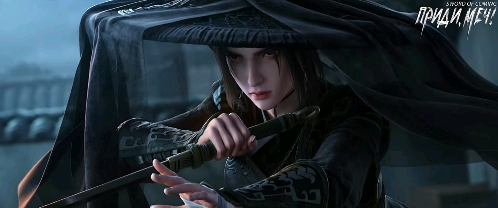

# Глава 08. Сорная трава

После возвращения во двор у Чэнь Пинъаня постоянно дергались веки: подергивание левого века предвещало богатство, а правого — беду.

Поэтому Чэнь Пинъань сел на порог и начал представлять, как он лепит глиняные заготовки, его руки парили в воздухе, и вскоре он вошел в состояние самозабвения. С одной стороны, это было усердие, а с другой — это помогало справляться с голодом, что тоже было важно, поэтому у Чэнь Пинъаня выработалась привычка лепить глиняные заготовки, как только у него появлялись какие-то заботы.

В обжиге керамики больше всего полагались на волю небес, потому что до открытия печи никто не знал, будут ли в конечном итоге цвет глазури и форма изделия соответствовать задуманному. Однако перед обжигом лепка глиняных заготовок, несомненно, была самым важным этапом. Но старик Яо считал, что у Чэнь Пинъаня нет таланта, поэтому тот в основном занимался физической работой по подготовке глины. Чаще всего он мог только внимательно наблюдать со стороны, а затем самостоятельно разминать глину и практиковаться в формовке, пытаясь найти правильные ощущения.

Из соседнего двора послышался звук открывающейся деревянной двери. Оказалось, что это Сун Цзисинь вернулся из школы вместе со служанкой Чжигуй. Красивый юноша разбежался и легко перепрыгнул через низкую стену. Присев, он разжал ладонь, в которой были разноцветные камешки размером с ноготь: цвета бараньего жира, зеленого боба, белого лотоса и так далее. Эти недорогие камни различных размеров можно было найти где угодно на галечных берегах ручьев в городке. Среди них наиболее привлекательными были ярко-красные камни, словно пропитанные куриной кровью. Учитель Ци из школы вырезал для своего ученика Чжао Яо печать из такого камня. Сун Цзисинь посчитал ее довольно приятной для глаз и несколько раз хотел обменять ее на что-нибудь, но тот ни за что не соглашался.

Сун Цзисинь без особой силы бросил камешек, попав Чэнь Пинъаню в грудь, но тот никак не отреагировал. Он бросил еще раз, на этот раз попав Чэнь Пинъаню в лоб, но Чэнь Пинъань по-прежнему оставался неподвижным, как гора.

Сун Цзисинь не удивился этому и быстро бросил семь-восемь камешков. Хотя Сун Цзисинь намеренно хотел отвлечь и причинить боль Чэнь Пинъаню, он все же не целился прямо в его руки и пальцы, так как считал, что это было бы нечестной победой.

Закончив бросать камни, Сун Цзисинь хлопнул в ладоши. Чэнь Пинъань глубоко вздохнул, встряхнул запястьем и, совершенно игнорируя Сун Цзисиня, задумался, опустил голову и сложил пальцы левой руки, имитируя резец.

Искусство «прыгающего ножа» не считалось уникальным навыком среди старых гончаров в городке, но техника старого Яо вызывала восхищение у всех, кто ее видел.

Старый Яо брал несколько учеников, но никто не мог по-настоящему удовлетворить его, пока не появился Лю Сяньян, которого он считал достойным преемником своего мастерства. Раньше, когда Лю Сяньян тренировался, Чэнь Пинъань, если у него было свободное время, всегда приседал рядом и внимательно наблюдал.

Лю Сяньян очень заботился о своей репутации и знал, что Чэнь Пинъань умеет хранить секреты, поэтому часто пытался впечатлить его секретными наставлениями старого Яо, например, «Чтобы линия ножа была устойчивой, рука не должна быть жестко стабильной, в конечном счете, все зависит от устойчивости сердца». Однако, когда Чэнь Пинъань спрашивал, что значит «устойчивость сердца», Лю Сяньян терялся.

Сун Цзисинь понаблюдал некоторое время, но, посчитав это скучным и утомительным, спрыгнул со стены и вошел в дом.

Служанка Чжигуй стояла у стены, и если она не вставала на цыпочки, была видна только верхняя половина ее лица. Даже так уже можно было заметить, что она была потенциальной красавицей.

Она задумалась, слегка приподнялась на носочки и осмотрела пространство вокруг Чэнь Пинъаня. Наконец, она нашла на земле два понравившихся ей камешка: один ярко-красный и прозрачный, другой белоснежный и гладкий. Оба были теми, что ее молодой господин только что выбросил.

Она немного поколебалась, затем понизила голос и робко сказала:

— Чэнь Пинъань, не мог бы ты поднять для меня те два камешка? Они мне очень нравятся.

Чэнь Пинъань медленно поднял голову, не прерывая движений рук, которые оставались очень устойчивыми, и взглядом попросил ее подождать немного.

Чжигуй очаровательно улыбнулась, казалось, что появились первые зеленые почки на ветвях после наступления весны — необычайно красиво.

Но Чэнь Пинъань уже опустил голову и пропустил этот трогательный момент.

Уголки губ Чжигуй приподнялись, а в глазах заиграли яркие огоньки, словно в них грациозно плавали крошечные живые существа.

Когда Чэнь Пинъань закончил свои дела и спросил, какие именно два камешка ей нужны, глаза служанки Чжигуй вернулись в нормальное состояние, мягкие, как всегда, словно весенняя грязь после дождя.

Чэнь Пинъань подобрал камешки в том направлении, куда указывал ее палец, подошел к стене, и как только Чжигуй подняла руку, он уже положил камешки на верхушку стены.

Чжигуй взяла их и крепко сжала в ладони.

Если кто-то намеренно ищет такие предметы, то это все равно что искать иголку в стоге сена, и встречаются они раз в десять лет. Но для того, кому повезло, даже если он и не ищет специально, они будут попадаться на каждом шагу, как мусор на улице, и все зависит от настроения — подбирать их или нет.

Чэнь Пинъань с улыбкой спросил:

— А не боишься, что сопливый мальчишка будет полдня ругаться у ваших ворот?

Она не признала, что ее молодой господин украл чужие вещи, но, казалось, у нее также не хватило смелости отрицать факты, поэтому она просто улыбнулась и промолчала.

В переулке Глиняных Кувшинов жили мать с сыном, и их мастерство ругани было непревзойденным в городке, только Сун Цзисинь мог с ними тягаться. Ребенок был особенно непослушным, постоянно ходил с двумя соплями и любил ловить рыбу и собирать камешки на берегу ручья. Пойманную рыбу он держал в большом чане с водой, а камешки складывал рядом с чаном. Сун Цзисинь любил дразнить этого маленького сорванца и время от времени прихватывал с собой несколько камешков. Один-два дня это было незаметно, но Сун Цзисинь делал это часто. Как только ребенок понимал, что потерял свои сокровища, он взрывался, как маленький дикий котенок, которому наступили на хвост, и мог ругаться у ворот целый час. Его мать никогда не пыталась его успокоить, а наоборот, подливала масла в огонь, намеренно упоминая, что Сун Цзисинь — незаконнорожденный сын бывшего надзирателя. Несколько раз это так разозлило Сун Цзисиня, что он чуть не выбежал с табуреткой в руках, чтобы подраться, и только служанка Чжигуй с трудом смогла его отговорить.

Внезапно раздался пронзительный голос:

— Сун Цзисинь, Сун Цзисинь, быстрее иди ловить любовников! Твоя служанка заигрывает с Чэнь Пинъанем, да так откровенно! Если ты немедленно не присмотришь за своей наложницей, ночью она, возможно, перелезет через стену, чтобы постучаться в дверь к Чэнь Пинъаню! Давай, вылезай скорее! Ах-ах-ах, Чэнь Пинъань уже гладит ту маленькую сучку по щеке, а ты даже не видел, как мерзко он при этом ухмыляется…

Сун Цзисинь даже не показался, а прокричал из дома:

— Ну и что с того? Вчера я сам видел, как Чэнь Пинъань обнимался с твоей мамкой, а когда я застал их, он с трудом вытянул свои лапы из выреза на ее платье. Да и твоя мать хороша, ее формы просто невероятны, бедный Чэнь Пинъань весь взмок от усилий…

В переулке кто-то яростно пинал ворота поместья семьи Сун Цзисиня, гневно крича:

— Сун Цзисинь, выходи, будем сражаться один на один! Если проиграешь, отдашь мне Чжигуй в служанки, чтобы она каждый день кормила меня, стелила постель и мыла ноги! Если я проиграю, отдам тебе Чэнь Пинъаня в слуги и для разных поручений. Ну как? Спрашиваю, хватит ли у тебя смелости? В любом случае, кто не осмелится, тот и будет трусливой черепахой!

Из дома Сун Цзисинь лениво ответил:

— Иди-ка ты прочь! Я, твой отец, посмотрел императорский календарь, и сегодня неблагоприятный день для битья сына. Гу Цань[1], считай, что тебе повезло!

[1] Гу Цань (顾璨). Гу — фамилия, которая означает «заботиться», «обращать внимание» или «смотреть назад». Цань — означает «сияющий», акцент на яркость/исключительность.

Снаружи ребенок изо всех сил колотил в дверь:

— Чжигуй, как же тебе, наверное, обидно быть с таким трусливым молодым господином. Лучше сбеги с Лю Сяньяном. В любом случае, этот глупый верзила смотрит на тебя так, будто хочет сожрать.

Служанка Чжигуй повернулась и направилась к дому. Внутри Сун Цзисинь тщательно протирал зеленую тыкву-горлянку, старинный предмет неизвестного возраста, который был одним из «наследств», оставленных тем господином Суном. Поначалу Сун Цзисинь не обращал на нее особого внимания, но позже случайно обнаружил, что во время грозы внутри тыквы-горлянки раздавалось жужжание. Однако когда Сун Цзисинь снимал крышку, как бы он ни махал и ни тряс ее, ничего не выпадало. Когда он наливал в нее воду или насыпал песок, выливалось или высыпалось ровно столько же, ни больше ни меньше. Сун Цзисинь был в полном недоумении.

Однажды, когда вспыльчивая мать Гу Цаня за дверью довела его до исступления, называя его «ублюдком, которого не признал отец», он взял нож и начал рубить тыкву-горлянку. Результат поразил его: лезвие ножа загнулось, а тыква-горлянка осталась целой и невредимой, без малейшей царапины.

В давно сожженном Сун Цзисинем письме было написано: «Золотые, серебряные и медные монеты, перевезенные из официальной резиденции в небольшой дворик, гарантируют, что вы, господин и слуга, будете обеспечены едой и одеждой. В свободное время можете собирать некоторые приятные сердцу антикварные вещи, считая это воспитанием характера. Хотя городок маленький, простая еда может насыщать желудок, книги могут питать дух, пейзажи могут радовать глаз, а уединение может успокаивать сердце. С сегодняшнего дня, исчерпав человеческие возможности, предайтесь воле Неба. Отныне делайте все, что в ваших силах, и доверьтесь судьбе. Затаившийся в бездне дракон непременно получит благословение в будущем».

Хотя Сун Цзисинь затаил обиду на того мужчину, но не тратить деньги, когда они есть, было бы настоящим преступлением. В городке с простыми нравами было сложно жить на широкую ногу. За эти годы Сун Цзисинь действительно полюбил собирать всякий хлам. У него был большой лакированный красный сундук, полный необычных предметов, таких как тыква-горлянка.

Однако у Сун Цзисиня было загадочное предчувствие, что из всего сундука, содержащего более тридцати разнообразных предметов, эта тыква-горлянка была самой ценной. Затем шел покрытый ржавчиной пурпурно-золотой колокольчик, при встряхивании которого было видно, как язычок ударяет о внутренние стенки, но, хотя он и должен был издавать звонкий звук, оставался совершенно беззвучным, что одновременно пугало Сун Цзисиня до мурашек и вызывало изумление. Последним был старинный чайник с подписью «Горный Демон». Остальные предметы нравились Сун Цзисиню довольно поверхностно и не могли считаться любовью с первого взгляда.

Ребенок по имени Гу Цань стоял за дверью и во весь голос кричал ругань. Но вскоре эти крики резко оборвались. Затем Чэнь Пинъань увидел, как Гу Цань быстро распахнул его ворота, лицо его было испуганным. Закрыв засов, он присел у двери, часто подмигивая Чэнь Пинъаню, чтобы тот тоже подошел и сел рядом с ним. Чэнь Пинъань не понимал, что происходит, но, пригнувшись, подбежал к Гу Цаню и, присев, тихо спросил:

— Что случилось? Опять разозлил свою мать?

Гу Цань сильно шмыгнул носом и приглушенным голосом ответил:

— Чэнь Пинъань, я тебе скажу: сейчас я встретил странного человека. В его руках была белая чаша, из которой вода лилась без остановки. Ты только посмотри, ведь это всего лишь небольшая чаша, а я своими глазами видел, как он лил из нее воду целый час! Когда этот тип проходил мимо входа в наш переулок Глиняных Кувшинов, он, кажется, остановился. Неужели он меня заметил? Ох, как же страшно…

Гу Цань показал руками размер белой чаши, а потом с тревогой ударил себя в грудь, сказав:

— Отец Сун Цзисиня до смерти перепугался.

Чэнь Пинъань спросил: — Ты говоришь о том сказителе под софорой?

Гу Цань энергично кивнул:

— Именно о нем! У старика почти нет силы в руках, даже меня поднять не может, но эта треснутая чаша действительно жуткая, очень жуткая! — Гу Цань внезапно схватил Чэнь Пинъаня за руку: — Чэнь Пинъань, на этот раз я правда тебя не обманываю! Я могу поклясться, если я тебя обману, пусть Сун Цзисинь умрет страшной смертью!

Чэнь Пинъань поднял палец, жестом призывая к тишине. Гу Цань сразу замолчал. Снаружи послышались шаги, постепенно приближающиеся, затем затихающие.

На каждого найдется управа. Ребенок, который раньше ничего не боялся, плюхнулся на землю, побледнев и беспорядочно вытирая лицо рукой. Очевидно, этот сопляк действительно был напуган до полусмерти.

Гу Цань неожиданно спросил:

— Этот тип ведь не пошел к моему дому? Что делать?

Чэнь Пинъань беспомощно ответил:

— Хочешь, я пойду с тобой к твоему дому посмотреть?

Гу Цань, видимо, только и ждал этих слов. Он резко встал, но тут же обессиленно сел обратно, с унылым лицом сказав:

— У меня ноги ослабели, я не могу идти.

Чэнь Пинъань встал, наклонился и схватил Гу Цаня сзади за воротник. Одной рукой он держал его, а другой открыл засов на двери и вышел со двора.

Дом Гу Цаня находился недалеко от дома Чэнь Пинъаня, всего в сотне шагов. Как и ожидалось, Гу Цань увидел, что старик уже во дворе его дома, а его мать даже принесла ему скамейку. В тот момент мальчишке показалось, что небо обрушилось, поэтому он решил спрятаться за спиной Чэнь Пинъаня, подставив того вперед. Чэнь Пинъань его не разочаровал, намеренно или нет защищая собой.

Озорной мальчишка схватился за рукав Чэнь Пинъаня, и вдруг без причины почувствовал прилив храбрости.

Старик не обратил на это внимания. Он сидел на скамейке, немного задумавшись, а белая чаша в его руках внезапно исчезла.

Гу Цань тут же снова ощутил слабость в ногах и, дрожа от страха, спрятался за спиной Чэнь Пинъаня.

Старик взглянул на эту на удивление спокойную деревенскую женщину, затем на Чэнь Пинъаня, который хмурил брови, и, наконец, сказал съежившемуся Гу Цаню:

— Малыш, знаешь ли ты, кого вы держите в своей бочке с водой?

Гу Цань крикнул из-за спины Чэнь Пинъаня:

— Что там может быть? Рыба, креветки и крабы, которых я поймал в ручье, а еще вьюны и угри, которых я выловил в поле! Если тебе нравится, забирай, не стесняйся......

Голос мальчика становился все тише и тише, явно не хватало уверенности.

Женщина поправила прядь волос у виска и, глядя на Чэнь Пинъаня, мягко произнесла:

— Пинъань.

Тот понял ее намерение, потрепал Гу Цаня по голове, а затем повернулся и ушел.

В глубине взгляда женщины скрывалась тень вины по отношению к этому юноше в соломенных сандалиях. Отбросив посторонние мысли, она повернулась к старику и спросила:

— Уважаемый мастер, пришедший издалека, вы хотите купить эту возможность или отнять ее?

Старик покачал головой и с улыбкой ответил:

— Купить? Я не могу себе этого позволить. Отнять? Я тоже не смогу этого сделать.

Женщина тоже покачала головой:

— Раньше было так, но в будущем, возможно, будет иначе.

Изначально расслабленный старик, услышав эти слова, словно пораженный молнией, резко взмахнул рукавом, его пять пальцев задвигались с молниеносной скоростью.

Старик глубоко вздохнул и сказал:

— До чего же дошло!

Женщина с холодным выражением лица насмешливо спросила:

— Неужели уважаемый мастер думает, что в этом маленьком городке могут быть хорошие люди?

Старик встал и пристально посмотрел на ничего не понимающего ребенка, словно приняв какое-то важное решение. Он взмахнул запястьем, и белая чаша снова появилась.

Старик подошел к большой бочке с водой высотой в половину человеческого роста и быстро зачерпнул чашу воды.

Хотя женщина притворялась спокойной, на самом деле ее ладони были полны пота.

Старик сел обратно на табурет и поманил Гу Цаня:

— Малыш, подойди-ка, посмотри.

Гу Цань посмотрел на мать, она кивнула, ее взгляд был полон поддержки.

Когда Гу Цань подошел ближе, старик слегка подул на поверхность воды в чаше, вызывая рябь. Он улыбнулся и сказал:

— Открой рот. В то же время он небрежно провел рукой и каким-то образом достал лист софоры с тела Гу Цаня. Он держал его двумя пальцами, не сжимая.

Гу Цань невольно издал удивленный возглас.

Старик щелкнул пальцами, и этот сочный зеленый лист исчез во рту Гу Цаня. Гу Цань застыл на месте, а затем обнаружил, что, кажется, не чувствует во рту ничего необычного.

Старик не дал ему возможности спросить и указал на белую чашу в своей ладони:

— Внимательно посмотри, что там есть.

Гу Цань широко раскрыл глаза и сосредоточенно посмотрел. Сначала он увидел крошечную черную точку, которая постепенно превратилась в едва заметную черную линию, а затем медленно увеличилась, превратившись в маленького желто-коричневого вьюна, весело кувыркающегося в ряби на поверхности воды.

В мыслях Гу Цаня, которые была как каша, вдруг мелькнула догадка, и он воскликнул:

— Я помню его! Это тот, которого я взял у Чэнь Пинъаня…

Женщина дала пощечину своему сыну и гневно сказала:

— Замолчи!

Старик не был удивлен этим и невозмутимо сказал:

— Мы, культиваторы, в поисках бессмертия часто идем против воли Небес. Эта борьба — ничто. Не нужно так нервничать, то, что предназначено твоему сыну, от него не уйдет; а то, что не должно принадлежать тому юноше, он не сможет удержать.

Этот ребенок по имени Гу Цань с виду весил менее сорока цзиней. Однако вес его «корня и костей»[2] был невообразимо тяжелым. Поэтому этот старик с чашей, обладающий сверхъестественными способностями, ранее сделал исключение и применил секретную технику своих предков, чтобы прощупать и взвесить кости, но не смог его поднять.

[2] «根骨», буквально «корень и кость». 根 — корень, основа. Символизирует базовые природные качества и потенциал человека. 骨 — кость. Символизирует структурную основу, внутреннюю силу и стойкость. Также можно назвать «врожденный потенциал».

Это было предпосылкой для того, чтобы взять его в ученики. Иначе разве не было бы самоубийством для трехлетнего ребенка нести золото через рынок?

Старик беззаботно рассмеялся, но его взгляд был холодным, и он медленно произнес:

— Конечно, даже если изначально это принадлежало тому юноше, что с того? Теперь, когда я лично здесь присутствую, это уже не его.

Гу Цань замер, как цикада зимой, его зубы стучали. Женщина вздохнула с облегчением.

Старик снова надел маску доброты и мягкости:

— Дитя, эта чаша содержит воду целой реки, а теперь в ней еще живет маленький дракон. С этого момента ты становишься моим прямым учеником. Я — «истинный господин», всего в полушаге от того, чтобы открыть школу. Хотя я принадлежу к низшей школе… В общем, со временем ты поймешь вес этих четырех слов: «истинный господин» и «открытие школы».

Старик рассмеялся и сказал:

— Это будет тяжелее, чем эта чаша с речной водой.

Гу Цань внезапно заплакал:

— Так неправильно! Он принадлежит Чэнь Пинъаню!

Женщина, рассердившись от стыда, высоко подняла руку, готовясь снова наказать своего глупого сына.

Старик махнул рукой, улыбнулся и небрежно сказал:

— Иметь такое сердце — не совсем плохо.

Гу Цань опустил голову и вытер слезы и сопли тыльной стороной ладони.

Женщина тихо посмотрела на старика. Старик понимающе улыбнулся и кивнул. Единомышленники понимают друг друга без слов. Когда Гу Цань поднял голову, его мать и неожиданно появившийся учитель уже мягко улыбались.

Гу Цань обернулся и увидел, что Чэнь Пинъань, уходя, не забыл закрыть ворота двора.

※※※※

Маленький городок был похож на поле, в урожайный год наступил сезон сбора урожая. Однако некоторые люди были как сорняки среди рисовых колосьев — на них взглянули один раз и больше не обращали внимания.

Например, одинокий юноша в соломенных сандалиях, идущий по переулку Глиняных Кувшинов.
