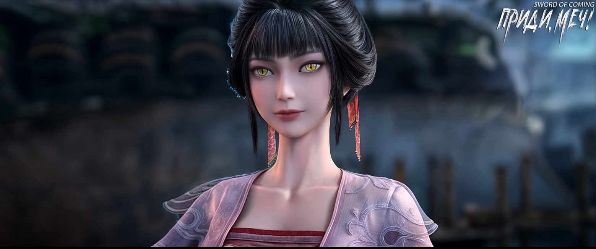

# Глава 10. Поглотить ци быка

П/п.: 食牛之气 — Поглощать энергию быка. Значение этого выражения — быть высокомерным, заносчивым, надменным или иметь завышенное самомнение. Оно происходит из древней китайской легенды о человеке по имени Чжао Гао, который был известен своей заносчивостью и однажды заявил, что он настолько могущественен, что может «проглотить быка целиком. Со временем эта фраза стала использоваться для описания людей с чрезмерной гордостью и самоуверенностью.

※※※※

Цай Цзиньцзянь шла задом наперед, и на самом деле, как только она наступила на это, она уже поняла, что дело плохо.

Конечно, еще более невыносимо, чем наступить в собачье дерьмо, было то, что кто-то еще это увидел. А еще хуже было то, что человек, который это увидел, еще и сказал тебе, что ты действительно наступил в собачье дерьмо.

Цай Цзиньцзянь не была поверхностной женщиной или избалованной хрупкой леди. То, что она смогла выделиться среди многочисленных потомков главы горы Облачной Зари и завоевать последнее место, говорило о многом. Гора Облачной Зари состояла из восемнадцати больших и малых пиков, постоянно окутанных туманом. Камень Корня Облаков, производимый там, был важным ингредиентом для изготовления внешних эликсиров в даосской школе Алхимического Котла[1]. Он был известен миру своей «безупречностью и чистотой» и был уникальным. Поэтому люди на горе Облачной Зари должны были быть чистыми и элегантными, и большинство из них имели манию чистоты. Цай Цзиньцзянь, конечно, не была исключением. Если бы не большая связь с маленьким городком, она никогда в жизни не ступила туда, не говоря уже о том, чтобы шагать по переулку Глиняных Кувшинов, полному куриного помета и собачьего дерьма.

[1] 丹鼎派 — школа Алхимического Котла. В целом иероглиф «丹» имеет несколько значений (киноварь, алый, эликсир), но в контексте даосских практик часто ассоциируется именно с алхимией и производством чудодейственных лекарств.

Самым неловким было то, что после прибытия сюда эти изначально высокомерные бессмертные стали похожи на рыбок, выброшенных на берег. Внезапно они лишились всех своих преимуществ: семейных владений в благословенных местах, сверхъестественных способностей перемещать горы и моря, летать по воздуху, чудесных талисманов для усмирения демонов и управления духами — все это исчезло. И вот теперь произошла сцена, где Цай Цзиньцзянь наступила в собачье дерьмо.

Фу Наньхуа сначала нашел это забавным. Кто бы поверил, что безупречная небожительница Цай с горы Облачной Зари испачкала сапог в вонючем собачьем дерьме?

Но в следующий момент Фу Наньхуа строго крикнул:

— Цай Цзиньцзянь, остановись!

У стоящего на глиняной стене Сун Цзисинь слегка сузили зрачки, и он крепко сжал в ладони зеленую нефритовую подвеску с резным драконом.

Цай Цзиньцзянь словно одним шагом оказалась перед Чэнь Пинъанем. Ее изящная рука, сияющая подобно нефриту, стремительно опустилась к его макушке. В тот момент, когда Фу Наньхуа попытался остановить ее, она внезапно замедлила движение и в итоге лишь легонько коснулась его головы. Завершив этот жест, напоминающий ласку старшего по отношению к младшему, она наклонилась и всмотрелась в глаза Чэнь Пинъаня. Они были подобны чистому, прозрачному роднику, в котором Цай Цзиньцзянь почти могла разглядеть свое отражение. К сожалению, ее настроение в тот момент было крайне скверным, и она сказала с натянутой улыбкой:

— Малыш, я знаю, что ты намеренно замедлил свою речь, когда говорил.

Фу Наньхуа с облегчением вздохнул. Если Цай Цзиньцзянь действительно осмелится совершить здесь убийство, его, скорее всего, изгонят из городка, и тогда вся гора Облачной Зари станет посмешищем для всей страны.

Нахмурившись, он официальным вежливым языком предупредил ее:

— Цай Цзиньцзянь, прошу тебя хорошо обдумать свои действия. Если ты продолжишь вести себя так импульсивно, мне, пожалуй, придется отказаться от нашего союза. Я не хочу, чтобы ты подвела меня и все пошло прахом.

Повернувшись спиной к Цай Цзиньцзянь, молодому господину Старого Города Дракона, Цай Цзиньцзянь быстро прошептала мантры:

— Высшие увидят Будду быстро, низшие увидят Будду медленней… Воистину есть Чистая Земля, воистину есть Лотосовый Пруд…

Затем она повернулась и с сожалением улыбнулась Фу Наньхуа:

— Я растеряла самообладание. Обещаю, что больше ничего подобного не произойдет.

Фу Наньхуа презрительно усмехнулся:

— Ты уверена?

Цай Цзиньцзянь проигнорировала его сомнения и, не давая никаких клятв, опустила взгляд на Чэнь Пинъаня и официальным изысканным языком продолжила:

— Я из школы одного из пяти буддийских учений горного хребта Облачной Зари, мы особенно ценим укрощение обезьяны ума и привязывание норовистого коня разума. Но перед тем, как прибыть сюда, я даже не могла понять, что это за явления, и старшие в моей семье тоже не хотели давать мне наставлений, лишь позволили мне самой искать ответы. Представить не могла, что именно здесь, в вашем переулке Глиняных Кувшинов, я наткнусь на кучу собачьих экскрементов, но это, тем не менее, позволило мне уловить некую подсказку…

Чэнь Пинъань напомнил:

— Сестрица, ты наступила в собачье дерьмо уже полдня назад. Почему до сих пор не счистила его?

Цай Цзиньцзянь, которая изначально чувствовала, что достигла буддийского состояния Чистой Земли, услышав эти слова, мгновенно потеряла свое просветление и вернулась в мирскую жизнь, ее лицо побледнело. Однако, помня предупреждение Фу Наньхуа, она лишь в порыве гнева слегка ткнула пальцем в лоб Чэнь Пинъаня и, уставившись на него, сказала:

— Разве тебя никто не учил, что своенравный характер в столь юном возрасте — это признак ранней смерти, а язвительные и саркастичные люди уменьшают свое счастье?!

Чэнь Пинъань, будучи толстокожим, не обратил на это внимания и лишь молча, но многозначительно посмотрел на стоявшего неподалеку Сун Цзисиня.

Последний, подпрыгнув, разразился бранью:

— Чэнь Пинъань, чего ты на меня смотришь? Какая неудача!

Фу Наньхуа с удивлением обнаружил, что, даже не войдя во двор Сун Цзисиня, он уже был недоволен и, не скрывая своего сарказма, сказал:

— Цай Цзиньцзянь! Как интересно, в мире еще есть люди, которые из-за кучки собачьего дерьма задерживают свои шаги на пути к бессмертию.

Цай Цзиньцзянь, вопреки обыкновению, не разозлилась, а лишь пристально посмотрела на ничем не примечательного Чэнь Пинъаня и повернулась, чтобы уйти.

Внезапно позади нее раздался тихий голос:

— Сестра, у тебя очень длинные ресницы.

Неужели этот невежественный мирской червь осмелился приставать к небесной деве? Цай Цзиньцзянь пришла в ярость и резко обернулась.

Она решила, что даже ценой потери части своей удачи, она проучит этого деревенского выскочку, который казался простодушным, но на самом деле был хитрым. Хотя Цай Цзиньцзянь и ее спутники, войдя в это место, были словно заключенные в темницу, скованные по рукам и ногам, лишенные возможности использовать свои духовные искусства и артефакты, но польза от ее многолетних тренировок все еще оставалась с ней. Эффект был не столь заметен, как у тех, кто посвятил себя боевым искусствам, но этого было достаточно, чтобы легко справиться с юношей, выросшим в грязи городских улиц.

Одним движением руки она могла нанести удар по важным акупунктурным точкам, посеяв семена болезни и сократив его жизнь. Однако в слегка затемненном переулке она увидела лишь смуглое лицо и пару ярких глаз.

Луна рождается над морем.

Цай Цзиньцзянь сначала прояснила свой взгляд, затем ее охватило врожденное женское сострадание, и, наконец, сожаление постепенно исчезло из ее прекрасных глаз. Ее улыбка становилась все ярче, и она внезапно все поняла.

Уничтожение своих внутренних демонов — это и есть возможность.

Следует знать, что школа горы Облачной Зари, близкая к буддизму и далекая от даосизма, начиная с ее основателя, старого бессмертного Облачной Зари, всегда придерживалась одной точки зрения: каждое начало и конец связи есть прохождение испытания. Конечно, этот метод прохождения испытаний не имеет фиксированных правил или предопределенного исхода, все зависит от того, как сам человек разгадает загадку и преодолеет препятствие. Как, например, сейчас Цай Цзиньцзянь.

Она почувствовала, что нашла обезьяну сердца и коня разума, которых нужно было усмирить и покорить, и это был тот самый юноша, казавшийся невинным, но на самом деле являвшийся препятствием. Поэтому она снова подняла руку и положила ее на грудь Чэнь Пинъаня, слегка надавив. Все эти движения были плавными и быстрыми, как молния. Даже если бы Чэнь Пинъань попытался отступить на полшага назад, он все равно не смог бы избежать ее прикосновения.

Фу Наньхуа пристально смотрел на ее соблазнительную изящную фигуру, но в его сердце не возникло ни малейшей волны нежности. Вместо этого, в нем закипала ярость и почти сформировалось железное сердце. Он постарался скрыть свои убийственные намерения и громко рассердился:

— Ранее, когда ты прикоснулась пальцем к его лбу, ты навлекла на него многолетние болезни, одного такого «наказания» уже достаточно! Зачем ты снова…

Цай Цзиньцзянь не обратила на него внимания. Фу Наньхуа понизил голос, вернув себе величественное спокойствие аристократа, и ухмыльнулся:

— Почтенная госпожа Цай Цзиньцзянь из горы Облачной Зари, неужели ты будешь так мелочно пререкаться с каким-то городским юношей? Если об этом узнают, разве это не опозорит тебя?

Цай Цзиньцзянь повернулась и улыбнулась:

— Этот маленький переулок просто удивительно связан со мной. Даже не ожидала, что здесь я смогу найти небольшое, но ценное благоприятное предзнаменование. Хотя оно и невелико, но воистину лучше, чем ничего. Это хороший знак! Я теперь еще больше верю в мальчика по имени Гу Цань!

Фу Наньхуа изумился. Неужели эта женщина действительно что-то постигла?

Цай Цзиньцзянь подняла ногу, увидела эту отвратительную и омерзительную грязь и с улыбкой сказала:

— Мне действительно повезло наступить в собачье дерьмо.

Лицо Сун Цзисиня было мрачным и нечитаемым, невозможно было понять изменения в его мыслях.

Служанка Чжигуй, на которую никто не обращал внимания, стояла на месте в полной тишине. В какой-то момент в ее глазах появились два бледно-золотых зрачка — по два зрачка в каждом глазу.

Фу Наньхуа смутно почувствовал что-то неладное и резко обернулся, быстро осматриваясь вокруг. Не заметив ничего необычного, он в конце концов внимательно осмотрел молодую служанку, но не нашел ничего подозрительного. Ему оставалось лишь списать это неприятное ощущение на действия Цай Цзиньцзянь, которые, возможно, привлекли внимание мудреца этого городка.

Настроение Цай Цзиньцзянь улучшилось, и все накопившиеся ранее мысли хлынули потоком, словно прорвав плотину. Разве это можно назвать лишь небольшой удачей?

Если бы гора Облачной Зари не страдала от внутренней пустоты, она действительно нуждалась бы в достаточно весомом «сверхъестественном артефакте», чтобы укротить постоянно утекающую духовную энергию своих храмов и упрочить ее положение будущего главы. В противном случае, Цай Цзиньцзянь предпочла бы немедленно покинуть это место и десятилетиями находиться в затворничестве на горе.

Цай Цзиньцзянь направилась к служанке из переулка, стоявшей за Фу Наньхуа. Стоявший позади Чэнь Пинъань спросил:

— Ты ведь сделала что-то со мной?

Цай Цзиньцзянь, даже не оборачиваясь, ответила:

— Мальчик, ты слишком много придумываешь.

Чэнь Пинъань замолчал. Цай Цзиньцзянь обернулась с кокетливой улыбкой:

— Ты умрешь максимум через полгода.

Чэнь Пинъань растерялся. Цай Цзиньцзянь ласково рассмеялась:

— Ах, ты и вправду поверил? Сестричка всего лишь пошутила!

Чэнь Пинъань тоже улыбнулся. И Цай Цзиньцзянь, и Фу Наньхуа почти одновременно подумали:

«Лягушка на дне колодца, муравей у подножия горы» [2].

[2] 井底之蛙 — «Лягушка на дне колодца»; 山下蝼蚁 — «Муравей у подножия горы». Поговорки используются для описания людей с ограниченным мировоззрением, которые не способны видеть полную картину мира или понимать масштаб вещей, находящихся за пределами их непосредственного опыта.

Сун Цзисинь, сидевший на стене и наблюдавший за происходящим, нахмурил брови, его обычно веселое лицо приняло на редкость серьезное выражение.

Даже после того, как Чжигуй уже повела эту своенравную старшую сестру искать сопливого Гу Цаня, а тот импульсивный молодой человек, готовый потратить целое состояние на пустяки, играя роль щедрого простака вошел во двор дома, проницательный Сун Цзисинь все еще сидел на корточках, погруженный в свои мысли. В его глазах стоял образ худощавого паренька, который, постояв посреди переулка Глиняных Кувшинов и недолго понаблюдав за удаляющейся фигурой высокой девушки, быстро отвел взгляд и направился к воротам своего дома, но так и не открыл деревянную дверь.

Сун Цзисинь терпеть не мог это чувство — когда человек обычно держится незаметно, но в определенные моменты становится как камень в выгребной яме: не уберешь — мозолит глаза, уберешь — испачкаешься. Из-за этого он даже не расслышал, что сказал ему Фу Наньхуа, стоявший позади.

Молодому господину Старого Города Дракона пришлось повторить:

— Сун Цзисинь, знаешь ли ты, что в этом мире есть люди, сильно отличающиеся от вас?

Сун Цзисинь наконец пришел в себя, повернулся, продолжая сидеть на корточках, и, глядя снизу вверх на Фу Наньхуа в его роскошной одежде и с величественной заколкой, равнодушно ответил:

— Знаю.

Фу Наньхуа пришлось проглотить слова, которые уже вертелись у него на языке, хотя он все еще чувствовал некоторое недовольство. Он с улыбкой спросил:

— Действительно знаешь?

Сун Цзисинь, человек с загадочным прошлым, холодно посмотрел на него и усмехнулся:

— Ты ведь хочешь сказать, что они рождаются и умирают, их плоть белеет, а кости остаются, они живут долго и видят многое, и их методы Дао безграничны?!

Фу Наньхуа кивнул, с удовлетворением сказав:

— Мы можем считаться наполовину друзьями по Дао.

Сун Цзисинь краем глаза взглянул на ворота соседнего двора, выглядя немного рассеянным.

Фу Наньхуа искренне сказал:

— Тогда я скажу прямо. Что бы у тебя ни было, если ты готов назвать цену, я продам все, что у меня есть, лишь бы купить это!

Сун Цзисинь с недоумением спросил:

— Я вижу, что твое семейное положение и статус выше, чем у той женщины. Раз уж она может так относиться к парню по соседству, почему ты готов относиться ко мне так…

Фу Наньхуа подхватил:

— На равных?

Сун Цзисинь кивнул и похвалил:

— Ты довольно сообразительный, с тобой легко разговаривать.

Фу Наньхуа не обращал внимания на то, ни на то, что Сун Цзисинь смотрел на него свысока, ни на его положение, ни на высокомерный тон разговора.

В отличие от Цай Цзиньцзянь, которая смотрела на Чэнь Пинъаня как на ничтожного червя, Фу Наньхуа не только чувствовал близость к Сун Цзисиню, но и испытывал необъяснимое благоговение перед всей территорией переулка Глиняных Кувшинов. Поэтому Фу Наньхуа действительно воспринимал стоящего перед ним юношу как единомышленника.

На этом великом пути, чем дальше идешь, тем больше осознаешь, что социальный статус, пол и возраст — все это иллюзорно и не имеет значения.

Сун Цзисинь спрыгнул со стены двора и тихо сказал:

— Пойдем в дом, поговорим.

Фу Наньхуа кивнул:

— Хорошо.

Когда Сун Цзисинь переступал порог, он небрежно спросил:

— Просто из любопытства, какие у тебя отношения с той сестрой, которая явно из хорошей семьи?

Фу Наньхуа без колебаний ответил:

— Сейчас мы заодно, но мы не на одном пути.

Сун Цзисинь издал звук «о» и сказал нечто загадочное:

— Тогда вы, ребята, слишком медлительны и нерешительны в своих действиях. Я слышал, что во внешнем мире, полном богов и демонов, странных и удивительных вещей, если у практикующих возникает вражда, разве они не должны искоренить ее, чтобы навсегда избавиться от будущих неприятностей?

Молодой господин семьи Фу, в конце концов, вырос в Старом Городе Дракона и был потомком бессмертных. Он повидал многое, поэтому, услышав эти слова, не выказал никаких эмоций на лице. Он с улыбкой спросил:

— У вас есть вражда между собой?

Сун Цзисинь широко раскрыл глаза, притворяясь удивленным:

— О чем ты говоришь?

Поняв, что мужчина перед ним явно не верит, Сун Цзисинь убрал с лица преувеличенное и притворное выражение. Он первым сел на стул в главном зале и жестом пригласил Фу Наньхуа тоже присесть. Затем он серьезно сказал:

— Веришь ты или нет, но мы с Чэнь Пинъанем, который потерял родителей в раннем возрасте, были соседями много лет и никогда не ссорились.

Фу Наньхуа мгновенно понял скрытый смысл слов Сун Цзисиня. Юноша по соседству был одинок, без поддержки, словно плавающий на воде лист без корней.

Если он умрет, то просто умрет, и никто не будет разбираться в этом деле.

Молодой господин Старого Города Дракона не знал, плакать ему или смеяться, внезапно осознав, насколько абсурдны и комичны события, происходящие в этом переулке.

Бедный юноша по соседству, можно сказать, навлек на себя неожиданную беду, пытаясь намеренно скрыть адрес Сун Цзисиня и его слуги, и мог даже поплатиться за это жизнью.

И как раз сейчас этот молодой человек из семьи Сун, казалось бы, выросший в богатстве и роскоши, хотел использовать чужие руки, чтобы убить человека. Одного удара недостаточно, нужен еще один.

Фу Наньхуа не мог не вздохнуть с восхищением, вспомнив слова из «Трактата Учителя Ши»[3]: «Тигр и леопард, даже не достигнув зрелости, уже обладают духом, способным пожирать быков».

[3] «Трактата Учителя Ши» или «Ши-цзы» (尸子) — это произведение, написанное Ши Цзяо (ок. 390–330 до н. э.). Трактат считается эклектическим текстом, поскольку он сочетает в себе идеи из различных философских школ, таких как конфуцианство, моизм, школа имен и легизм. Это ценный источник для изучения развития китайской философской мысли в период Сражающихся царств.

※※※※

Во дворе дома Гу Цаня, самого Гу Цаня уже заперла в комнатах его мать. Женщина сидела напротив пожилого человека, который называл себя «истинным господином».

Старик убрал свою ладонь с густыми пересекающимися линиями и улыбнулся:

— Главное уже решено.

Женщина с недоумением спросила:

— Не могли бы вы, уважаемый наставник, рассказать, что вы только что сделали, чтобы с этим Чэнь Пинъанем…

Но, не успев договорить, она заметила, что во взгляде старика внезапно вспыхнул острый блеск, и поспешно замолчала.

Старик посмотрел в сторону ворот двора и слегка взмахнул рукавом, вызвав легкий ветерок. Этот ветерок кружил по маленькому двору, не желая уходить. Только тогда старик сказал:

— Для человека моего положения, чем больше я вмешиваюсь в это дело, тем больше погружаюсь в безвыходную ситуацию, подобную глиняному Будде, переходящему реку. Хотя пока еще нельзя сказать, что я не могу защитить себя, но чем дольше это продолжается, тем больше… Хм, как сказал тот юноша Сун Цзисинь, это называется «тащить за собой грязь и воду». Можно лишь смешаться с толпой и в конце концов оказаться запятнанным последствиями своих действий. Хорошо то, что тот человек ненавидим небом и людьми. Даже если он отступит на шаг, все равно не сможет сохранить свою репутацию и не избежит катастрофы. Жаль, что ситуация, которая изначально обещала тысячелетнее поклонение, резко ухудшилась, и теперь невыносимо смотреть… Пользуясь этой возможностью, я смогу сделать некоторые приготовления для твоего сына. Посмотрим, удастся ли одновременно покончить с жизнью того юноши и обрубить нить, по которой в будущем некоторые мудрецы и бессмертные наставники могли бы добраться до истины. Это избавит от беспокойства о расплате в будущем. Таким образом, мой новый ученик сможет на пути к бессмертию, используя силу ветра и грома, в конечном итоге превратиться в дракона…

Женщина, сидевшая рядом, слушала прерывисто, обливаясь холодным потом.

Старик с улыбкой спросил:

— Разве не странно? Казалось бы, я человек, питающийся утренней зарей и росой, не обращающий внимания на мирские дела, находящийся вне этого мира. Почему же, усердно совершенствуясь в Дао, в конце концов я взрастил в себе лишь такую изворотливость и злобу? Чем я лучше тебя, невежественной деревенской женщины с ограниченным кругозором?

Женщина поспешно склонила голову и дрожащим голосом сказала:

— Я ни в коем случае не осмелюсь так думать!

Старик лишь усмехнулся и спокойно стал ждать, когда Цай Цзиньцзянь с горы Облачной Зари постучит в дверь.

На пути совершенствования техники безграничны, а чудесные способности бесконечны. Принципы бывают большими и малыми, а Дао — высоким и низким.

Цай Цзиньцзянь смотрит на всех, как на муравьев, так разве этот истинный господин не смотрит на нее и Фу Наньхуа, как на муравья?

О каких принципах можно говорить с муравьями под ногами?