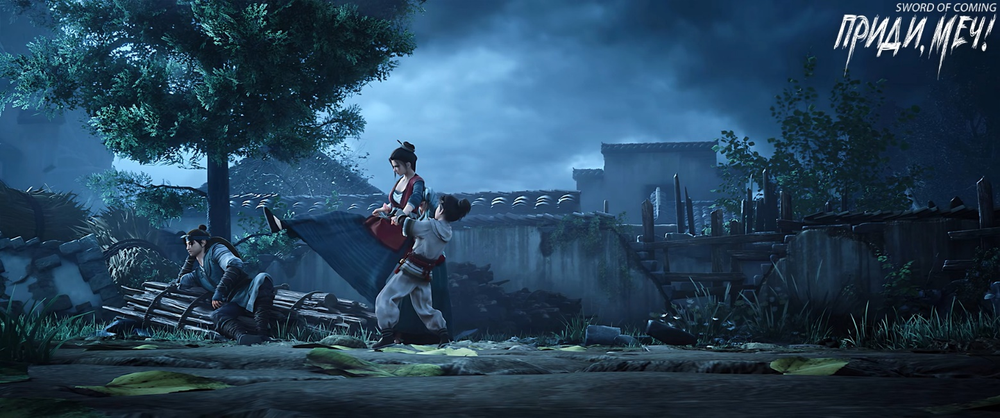
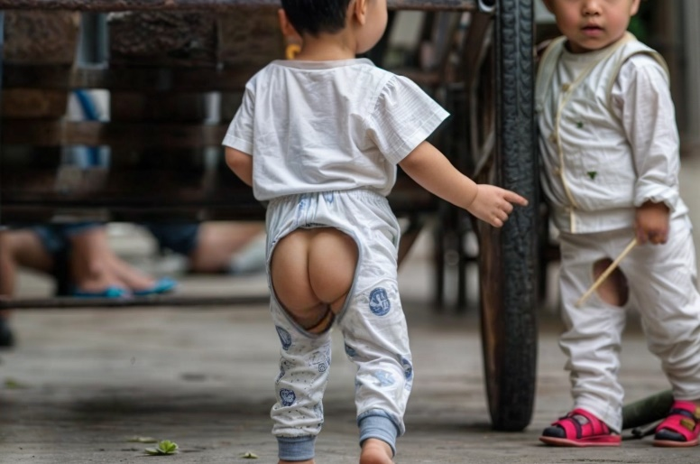
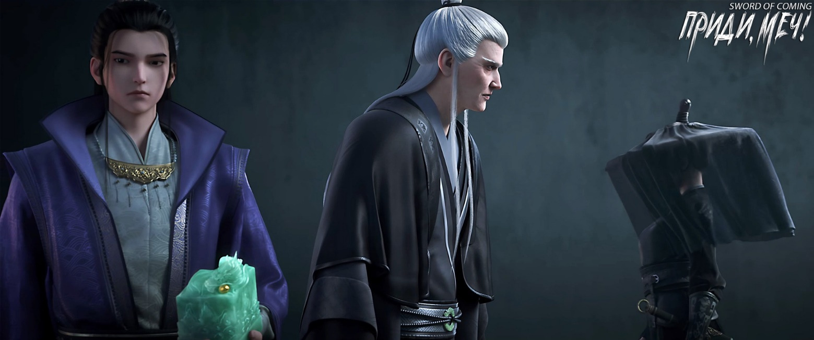

# Глава 11. Дева и летающий меч

Ученый муж с седыми висками в сопровождении юноши в синем одеянии покинул деревенскую школу и прибыл к подножию мемориальной арки. Тот самый образованный учитель в городке выглядел немного уставшим. Он указал рукой на табличку над головой и спросил:

— Как объяснить четыре иероглифа «В гуманности нельзя уступать»?

Юноша Чжао Яо, который был как учеником школы, так и помощником учителя Ци, поднял взгляд и без колебаний ответил:

— Наше конфуцианское учение основано на иероглифе «человеколюбие». Эти четыре иероглифа взяты из фразы «В гуманности нельзя уступать даже учителю». Это означает, что мы, ученые, должны уважать учителей и ценить знания, но в вопросах человеколюбия и морали нет необходимости быть скромным.

Учитель Ци спросил:

— Нет необходимости быть скромным? А если заменить на «нельзя», что тогда?

Чжао Яо обладал изящной внешностью, и в отличие от напористости и острого ума Сун Цзисиня, его характер был более мягким, сдержанным, естественно очаровательным, словно распускающийся лотос. Когда учитель задал этот вопрос с подтекстом, он не осмелился отнестись к нему легкомысленно. Тщательно обдумывая ответ, он понял, что учитель проверяет его знания, и как он мог отвечать небрежно?

Ци Цзинчунь[1], увидев, как его ученик напрягся, словно перед лицом грозного врага, понимающе улыбнулся и похлопал его по плечу:

— Это всего лишь случайный вопрос, не нужно так нервничать. Похоже, что раньше я слишком сдерживал твою природу, чрезмерно оттачивал тебя, заставляя жить как статую, выставленную в павильоне Вэньчан[2]. С серьезным лицом, везде соблюдая правила, все объясняя с точки зрения разума. Разве это не утомительно… Впрочем, сейчас это, похоже, оказалось к лучшему.

[1] Ци Цзинчунь (齐静春). Цзинчунь можно перевести как «Тихая весна».

[2] Павильон Вэньчан (文昌阁). Буквально, павильон «литературного процветания». Вэньчан — божество литературы и образования в китайской мифологии. Павильоны или храмы, посвященные Вэньчану, часто служили местом для проведения экзаменов и литературных собраний в древнем Китае.

Чжао Яо был немного озадачен, но Ци Цзинчунь уже повел его на другую сторону, все еще глядя вверх на четыре иероглифа на табличке. Выражение лица Ци Цзинчуня стало более расслабленным, и по какой-то причине этот обычно серьезный учитель начал рассказывать множество интересных историй, неторопливо объясняя своему ученику:

— Ранее надпись «В гуманности нельзя уступать» вызвала много споров. Человек, написавший эту табличку, был лучшим каллиграфом своего времени. Возникли дебаты о «структуре» и «духовном значении» каллиграфии, спор о достоинствах и недостатках «древней простоты» и «современной красоты», и до сих пор нет единого мнения по этому поводу. «Ритм, техника, смысл и стиль — четыре принципа каллиграфии. На протяжении тысячи лет этот человек занимал первое место в двух категориях, практически не оставляя шансов своим современникам-мастерам. Что касается надписи «Естественность в немногословности», то здесь есть нечто интересное. Если ты внимательно присмотришься, то сможешь заметить, что хотя все четыре иероглифа похожи по технике письма, структуре и духу, на самом деле они были написаны четырьмя великими даосскими мастерами из разных монастырей. В то время два старых бессмертных даже обменивались письмами, яростно споря, кто напишет самый загадочный и глубокий иероглиф «надежда», и никто не хотел писать самый обыденный и приземленный иероглиф «слово»…

Затем Ци Цзинчунь повел Чжао Яо к надписи «Не ищи вовне» и, оглядываясь по сторонам, задумчиво сказал:

— Та сельская школа, где ты учился, из-за отсутствия учителя скоро будет закрыта несколькими большими семьями. Возможно, ее даже снесут и построят на ее месте небольшой даосский храм или установят статую Будды для поклонения паломников. Там будет даос или монах, год за годом проводящий службы, до истечения шестидесятилетнего цикла. За это время они, вероятно, «поменяют человека» два-три раза, чтобы не вызывать подозрений у жителей городка, но это всего лишь грубый обман. Однако, если здесь освоить даже крошечное духовное умение, то за пределами этого места оно может произвести эффект подобный грому богов или весенней грозе, сотрясающей небо и землю…

К концу своей речи голос Ци Цзинчуня стал тихим, как жужжание комара, и Чжао Яо, напрягая слух, уже не мог разобрать его слов.

Ци Цзинчунь вздохнул, в его голосе чувствовались беспомощность и усталость:

— Многие вещи изначально были высшими тайнами, которые нельзя раскрывать. Теперь же это становится все менее важным. Но мы все же ученые люди и должны сохранять лицо. Тем более, если я, Ци Цзинчунь, первым нарушу правила, это будет равносильно воровству со стороны сторожа, и будет выглядеть очень некрасиво.

Чжао Яо внезапно набрался смелости и сказал:

— Учитель, я знаю, что вы необычный человек, и этот городок — необычное место.

Ци Цзинчунь с любопытством улыбнулся:

— Вот как? Расскажи подробнее.

Чжао Яо указал на величественную «двенадцатиногую» мемориальную арку:

— Это место, а также колодец с железной цепью в переулке Цветущих Абрикосов, крытый мост, под которым, по слухам, висят два железных меча, старая софора, персиковое дерево в переулке Персиковых Листьев, и улица Благоденствия и Достатка, где живет моя семья Чжао, ежегодные объявления о празднике Дождя и празднике Двойной Девятки[3] — все это очень странно.

[3] Гуюй (谷雨) — буквально переводится как «дождь для злаков» или «дождь для долин». Один из 24 сезонов китайского сельскохозяйственного календаря, обычно выпадает на 20–21 апреля. Чунъян (重阳) — праздник двойной девятки, отмечается на 9-й день 9-го месяца по лунному календарю. В это время люди чтят пожилых, наслаждаются осенней природой и участвуют в мероприятиях, призванных принести удачу и благополучие.

Ци Цзинчунь прервал Чжао Яо:

— Странно? Что в этом странного? Ты вырос здесь с детства и никогда не выходил за пределы городка. Разве ты видел пейзажи за его пределами? Без сравнения, откуда такие слова?

Чжао Яо тихо ответил:

— Содержание книг учителя я уже выучил наизусть. Цветы персика в переулке Персиковых Листьев сильно отличаются от описаний в стихах из книг. Кроме того, почему учитель преподает только три книги начального образования, делая упор на изучение иероглифов? Что нам читать после начального обучения? Для чего мы учимся? Что такое «государственная служба», упомянутая в книгах? Что значит «утром быть деревенским мальчишкой, а вечером войти во дворец Сына Неба[4]»? Что означает «Император ценит героев, литература учит вас»? Хотя два предыдущих надзирателя за гончарными мастерскими никогда не говорили о дворе, столице и делах Поднебесной, но…

[4] В древнем Китае «Сыном неба» называли правителя, который по воле Вечного Синего Неба правит Поднебесной, то есть Китаем. Сын неба — император.

Ци Цзинчунь удовлетворенно улыбнулся:

— Достаточно, нет смысла говорить больше.

Чжао Яо сразу же замолчал.

Ци Цзинчунь тихо сказал:

— Чжао Яо, в будущем тебе нужно быть осторожным в словах и поступках. Помни, что беда может прийти из-за необдуманных слов, поэтому многие мудрецы конфуцианства хранят молчание. Благородные мужи, стоящие выше мудрецов, говорят осторожно даже наедине с собой, следят за своим поведением, как за драгоценной яшмой, опасаясь малейшего изъяна. Что касается мудрецов, таких как главы семидесяти двух академий… Эти люди, подобно великим истинным мастерам[5] даосизма или буддийским архатам с золотым телом[6], могут одним словом создавать пророчества, и их слова становятся реальностью. Эти люди и выдающиеся личности из ста школ философской мысли, достигнув такого уровня, обычно называются земными бессмертными и считаются переступившими порог. Однако эти личности все подобны драконам: одни высоко вознесены и недостижимы, как божественные статуи в даосских и буддийских храмах. Другие же подобны драконам, у которых видна голова, но не виден хвост — обычные люди просто не могут их найти.

[5] Великий Истинный Человек (мастер) (大真人) — бессмертный в даосских легендах. В даосизме есть четыре великих истинных человека: Тунсюань, Чунсюй, Наньхуа и Дунлин. Данный термин в древнем даосизме относится к тем, кто достиг совершенства в самосовершенствовании и постиг Дао, проник в суть вселенной и истоки человеческой жизни, по-настоящему пробудился и просветлился. Часто используется как почетный титул.

[6] Арха́т (достойный) — в буддизме человек, достигший полного освобождения от омрачений (страстей) и вышедший из «колеса перерождений».

Чжао Яо слушал в замешательстве, словно окутанный туманом. Он не удержался и спросил:

— Учитель, почему вы сегодня рассказываете все это?

Ци Цзинчунь с просветленным выражением лица рассмеялся:

— У тебя есть учитель, и у меня, естественно, тоже есть учитель. А мой учитель… лучше не говорить об этом. В общем, я думал, что смогу протянуть еще несколько десятков лет, но внезапно обнаружил, что некоторые закулисные фигуры не хотят ждать даже этого короткого периода времени. Поэтому в этот раз я не смогу вывести тебя из городка, тебе придется выйти самому. Некоторые безобидные истины я должен тебе раскрыть, ты можешь воспринимать это просто как историю. Я лишь надеюсь, что ты поймешь один принцип: над небом есть небо, над людьми есть люди. Неважно, насколько ты, Чжао Яо, «исключительно одарен и невероятно удачлив», никогда не становись самодовольным и не теряй бдительности.

Падение уровня воды в колодце и опадание листьев софоры — все это предзнаменования.

Ци Цзинчунь напомнил:

— Чжао Яо, помнишь тот лист софоры, который я просил тебя сохранить?

Чжао Яо энергично кивнул:

— Я сохранил его вместе с печатью, которую вы мне подарили.

— Где в мире ты видел листья, которые, отделившись от ветки, остаются такими свежими и сочными, словно только что сорванные? Среди тысяч людей в городке лишь единицы удостоены такого «благословения». Этот лист софоры можно часто рассматривать, в будущем он может принести неожиданную удачу.

Взгляд Ци Цзинчуня стал проницательным.

— Кроме того, все эти годы я постоянно побуждал тебя совершать добрые дела в городке и завязывать хорошие отношения с людьми. Я учил тебя относиться ко всем с уважением и искренностью. Со временем ты поймешь скрытый смысл этого. Те мелочи, которые кажутся незначительными, подобно капле, точащей камень, в конечном итоге могут принести пользу не меньшую, чем изучение целого тома «Записей местного уезда».

Чжао Яо заметил желтую птицу, сидящую на каменной балке. Она время от времени подпрыгивала и щебетала. Ци Цзинчунь, заложив руки за спину, поднял голову, глядя на желтую птицу с серьезным выражением лица. Чжао Яо не заметил ничего необычного.

Ци Цзинчунь внезапно посмотрел в сторону переулка Глиняных Кувшинов, его брови нахмурились еще сильнее. Он тихо вздохнул:

— Спящие насекомые постепенно слышат звуки весны и выбираются из-под земли. Но разве для гостя не слишком самонадеянно вести себя скрытно и применять эти дьявольские трюки прямо под носом у хозяина? Неужели они действительно думают, что полагаясь на свою собственную небольшую власть, они могут делать все, что захотят?

Чжао Яо обеспокоенно спросил:

— Учитель?

Ци Цзинчунь махнул рукой, показывая, что это не касается его, и повел к последней табличке.

Юноша Чжао Яо, словно насекомое, внезапно услышавшее весенний гром, резко остановился, его взгляд застыл.

Неподалеку стояла девушка в черном одеянии и в вэймао[7], скрывающем ее лицо. Ее фигура была пропорциональной, не слишком худой и не слишком полной. На поясе висели длинный меч в снежно-белых ножнах и узкий клинок в зеленых ножнах. Она стояла под табличкой с надписью «Ци, устремленная к созвездию Северного Ковша» скрестив руки на груди и подняв голову.

[7] Вэймао (帷帽). Это тип головного убора, похожий на шляпу с вуалью или капюшон. Изначально женщины в древнем Китае носили мили (幂蓠) — широкополую шляпу с длинной вуалью до бедер или колен. Мили надевали во время путешествий для защиты от дорожной пыли, а также она служила показателем скромности носительницы. На основе мили в начале династии Тан появилась шляпа вэймао, отличавшаяся от мили более короткой вуалью, доходившей до плеч.

Ци Цзинчунь, находя ситуацию забавной, слегка кашлянул.

Чжао Яо стоял как вкопанный, совершенно не обращая внимания на предупреждение учителя о том, что «не следует смотреть на то, что неприлично».

Ци Цзинчунь понимающе улыбнулся и, вместо того чтобы отругать ученика, перестал кашлять, не желая портить момент, и позволил ему продолжать завороженно смотреть на девушку.

Казалось, девушка совсем не замечала взгляда юноши.

Похоже, что она особенно восхищалась четырьмя большими иероглифами «Ци, устремленная к созвездию Северного Ковша». По сравнению с торжественностью и строгостью трех других табличек, написанных уставным письмом, эта табличка была уникальной — ее большие иероглифы были выполнены полууставным стилем[8]. Их внутренняя энергия была почти безудержной и дерзкой. Ей это нравилось!

[8] Чжэнкай (正楷, «уставное письмо») — стандартизированный почерк с четкими правилами написания каждого штриха. Часто используется в официальных надписях. Синшу (行书, «бегущее письмо», «полууставное письмо») — один из основных стилей китайской каллиграфии, более свободный и динамичный по сравнению с уставным почерком. Его иероглифы как бы «бегут» по бумаге.

Чжао Яо внезапно очнулся, когда Ци Цзинчунь похлопал его по плечу и сказал с улыбкой:

— Чжао Яо, тебе пора вернуться в школу и собрать вещи домой.

Чжао Яо покраснел и, опустив голову, последовал за учителем обратно в школу.

Только тогда девушка медленно разжала пальцы, которыми сжимала рукоять меча.

Вдалеке Ци Цзинчунь шутливо сказал:

— Ах, Чжао Яо, Чжао Яо, я ведь спас тебе жизнь.

Чжао Яо удивленно воскликнул:

— Учитель?

Ци Цзинчунь, немного поколебавшись, серьезно сказал:

— В будущем, если увидишь ее, обязательно обходи стороной.

Утонченный юноша в синем одеянии был немного удивлен и разочарован:

— Учитель, почему?

Ци Цзинчунь подумал и сказал окончательное суждение:

— Хотя она и остра как меч, но ей суждено быть мечом без ножен.

Чжао Яо хотел что-то сказать, но сдержался.

Ци Цзинчунь улыбнулся:

— Конечно, если просто тайно кого-то любить, даже даосские патриархи и Будда не смогут помешать. Даже мы, ученые, с нашими многочисленными правилами — наш величайший учитель лишь предостерегал от неподобающих слов, взглядов, слушания и действий, но никогда не запрещал неподобающие мысли.

В этот момент Чжао Яо, словно одержимый, внезапно выпалил:

— От нее так приятно пахнет!

Как только эти слова слетели с его губ, он оторопел.

Ци Цзинчунь почувствовал некоторую головную боль, не от гнева, а от щекотливости ситуации. Он серьезно сказал:

— Чжао Яо, повернись спиной!

Чжао Яо инстинктивно повернулся, встав спиной к учителю.

Девушка под мемориальной аркой обернулась, источая убийственную ауру.

Сначала она опустила руки, большие пальцы каждой руки лежали на рукоятях меча и клинка. Затем она начала разбег мелкими шагами, и после четырех-пяти шагов внезапно напрягла руки и ноги. Трехфутовый меч в белоснежных ножнах и тонкий узкий клинок в зеленых ножнах покинули свои вместилища, устремившись вверх и вперед. Одновременно с этим она оттолкнулась от земли, быстро схватила меч и клинок обеими руками и, не говоря ни слова, нанесла рубящий удар сверху вниз!

Между девушкой в черном и учителем с учеником две не слишком крепкие руки растянулись, вспыхнув двумя сияющими дугами.

Это не было ни сверхъестественной силой, ни духовным искусством. Все дело было лишь в одном слове — «скорость»!

Ци Цзинчунь с непринужденным видом не выказал никакого намерения уклониться, лишь слегка топнул ногой, отчего во все стороны разошлись круги ряби.

В следующий момент тело девушки напряглось, а ее убийственное намерение усилилось.

Изначально неудержимые удары меча и клинка не только полностью прошли мимо цели, но и сама она оказалась стоящей на том же месте, где была в момент обнажения оружия.

Ци Цзинчунь с улыбкой сказал:

— Неплохо, даже лев использует всю свою силу, чтобы поймать зайца. Однако, возвращаясь к сути, мой ученик действительно оскорбил юную госпожу, но разве это преступление, достойное смерти?

Девушка намеренно сделала свой голос глубоким и зрелым, медленно вложила меч в ножны и, перейдя в позу с клинком в одной руке, направила его острие прямо на Ци Цзинчуня:

— Что ты «думаешь» — это твое дело, меня это не волнует. — Она сделала шаг вперед: — Как я поступлю — это мое дело. Конечно, ты можешь… попробовать вмешаться!

Сказав это, она стремительно бросилась вперед. Там, где ступали ее ноги, мгновенно образовались две небольшие ямки.

Ци Цзинчунь, держа одну руку за спиной, а другую — в виде свободно сжатого кулака на животе, с улыбкой сказал:

— В военном искусстве и боевых искусствах скорость — это ключ к победе. Жаль только, что в этом мире, даже если он находится сейчас на грани распада, до тех пор, пока этого не произойдет, даже если десять земных бессмертных объединят свои силы, чтобы сломать формацию, это будет все равно, что муравей попытается потрясти огромное дерево. Что уж говорить о тебе?

В следующий момент девушка снова появилась в десяти шагах слева от учителя Ци.

Она немного подумала и закрыла глаза.

Учитель Ци покачал головой и с улыбкой сказал:

— Это не иллюзия, как ты могла подумать. Этот мир подобен тому, что буддисты называют Малой Тысячей миров[9], и здесь я… А? — он вдруг удивленно воскликнул и прервал свою речь, мгновенно оказавшись рядом с девушкой, чтобы разобраться в ситуации, легко взял двумя пальцами кончик меча, и спросил: — Кто научил тебя этому искусству меча и техникам владения мечом?

[9] Мир, в тысячу раз больший обычного, называется «Малой Тысячей миров» (小千世界). «Малая Тысяча миров», умноженная на тысячу, называется «Средней Тысячей миров» (中千世界). «Средняя Тысяча миров», умноженная на тысячу, называется «Великой Тысячей миров» (大千世界). Изначально буддийский термин, обозначающий бесчисленное множество миров во Вселенной.

Девушка, не открывая глаз, схватила левой рукой рукоять только что вложенного в ножны меча. Холодный блеск пронесся горизонтально на уровне талии Ци Цзинчуня, пытаясь разрубить его пополам.

Ци Цзинчунь, зажав кончик клинка двумя пальцами, громко воскликнул:

— Назад!

На земле раздался шум осыпающихся камешков, взметнулась пыль. Через мгновение показался силуэт девушки в вэймао. Она встала, выставив одну ногу вперед, а другую назад. От ее ног до Ци Цзинчуня на земле образовалась борозда, словно проведенная плугом.

Руки девушки были в кровавых ранах.

И клинок, и меч были обнажены, но она оказалась в ситуации, когда ее оружие отобрали голыми руками. Более того, она прекрасно понимала, что противник, помимо владения «структурой» этого мира, все время сдерживал свою силу на уровне, равном ее собственному.

Это было не из-за недостатка совершенствования, а из-за того, что ее мастерство уступало его. Она была на грани неконтролируемой ярости.

Возможно, девушка сама не осознавала, что вокруг нее свет начал искажаться.

Этот школьный учитель, будучи самым рассудительным человеком, с пониманием посоветовал:

— Тебе пока лучше не сравнивать себя со мной, это может помешать твоему боевому духу. В достижении вершин боевых искусств крайне важно продвигаться постепенно.

В этот момент учитель выглядел немного странно, держа одной рукой кончик меча, а другой — его лезвие.

Он внезапно рассмеялся и, подражая манере речи девушки, «по-стариковски» сказал:

— Слушать или нет — это твоя свобода; говорить или нет — это уже мое дело.

Девушка помолчала некоторое время, а затем низким голосом произнесла:

— Благодарю за наставление!

Учитель Ци с улыбкой кивнул. Она не была просто высокомерной и дерзкой девушкой, и это хорошо. Он осторожно бросил ей клинок и сказал:

— Сейчас верну тебе меч.

Он опустил голову, глядя на кончик меча в своих руках, который слегка дрожал.

Голос молодого феникса чище, чем у старого.

Учитель Ци с сожалением сказал:

— Качество меча довольно неплохое, но до высшего уровня ему все еще далековато. Из-за этого он может вместить вес только двух иероглифов, и то с некоторым трудом. Иначе, с твоими природными задатками и «основой», не говоря уже о том, чтобы забрать все четыре иероглифа, трех было бы более чем достаточно…

Вздыхая, он поднял руку и тихо воскликнул:

— Повелеваю!

Два ярких сгустка света слетели с таблички «Ци, устремленная к созвездию Северного Ковша», он взмахнул рукавом и дважды ударил по ним, вбивая их в длинный меч.

На табличке иероглифы «ци» и «бык» все еще сохраняли свою силу, а «устремленный» и «созвездие» стали похожи на дряхлого старика на смертном одре, который после последней вспышки жизни окончательно потерял свою энергию и дух.

Учитель Ци небрежно встряхнул запястьем, и длинный меч в мгновение ока вернулся в ножны своей хозяйки. Поскольку меч был уже в ножнах, никто пока не знал, что по его лезвию блуждали две энергии, подобные водяным драконам.

Но следующая сцена потрясла даже много повидавшего учителя Ци.

Девушка медленно сняла ножны и небрежно отбросила их. Ножны наискось вонзились в желтую землю. Из-под тонкой вуали, свисающей с ее шляпы, виднелся решительный взгляд:

— Это не тот путь меча, к которому я стремлюсь.

Ци Цзинчунь бросил взгляд на меч, отвергнутый девушкой, и в глубине души почувствовал давно забытую тяжесть. Он не мог не задать вопрос, который не соответствовал его статусу:

— Ты знаешь, кто я?

Девушка кивнула, а затем покачала головой:

— Я слышала, что здесь каждые шестьдесят лет меняется мудрец из трех учений, который приходит управлять работой большой формации. Это продолжается уже несколько тысяч лет. Время от времени люди выходят отсюда либо с необычными сокровищами, либо с резко возросшим уровнем совершенствования, поэтому я решила прийти и посмотреть. Когда я увидела вас, то сразу поняла, кто вы, иначе, когда я атаковала, я не была бы такой несдержанной.

Учитель Ци снова спросил:

— А ты знаешь, от чего ты только что отказалась?

Девушка промолчала.

В ножнах на земле меч не переставал дрожать, словно красавица, способная свергнуть целое государство, горько рыдала, умоляя возлюбленного передумать.

Молодой ученик Чжао Яо уже давно тайком повернулся и осторожно смотрел на девушку вдалеке.

Учитель Ци, несмотря на свою глубокую эрудицию, все еще не мог понять происходящего. Однако он не мог просто насильно всучить девушке меч, содержащий огромную силу удачи. В конце концов, он лишь предупредил:

— Юная госпожа, лучше возьмите этот меч. В ближайшее время в городке будет… неспокойно. Лишнее средство защиты всегда пригодится.

Девушка, не говоря ни слова, повернулась и ушла, все еще не желая брать меч.

Учитель Ци, немного растерянный, взмахнул рукавом и вонзил меч высоко в каменный столб мемориальной арки. Если кто-то попытается силой вытащить его, это непременно потревожит его самого, находящегося в центре формации. Подобно тому, как «сказитель» ранее дважды действовал, один раз явно, другой раз скрыто, ничто не ускользало от его внимания.

Лично проводив Чжао Яо из школы до большого дома семьи Чжао на улице Благоденствия и Достатка, учитель Ци медленно пошел обратно. С каждым его шагом в некоторых укромных местах глубоко внутри высоких ворот больших особняков по обеим сторонам главной улицы мелькал неуловимый свет.

Учитель Ци пробормотал:

— Странно, откуда взялась эта девчонка? Уж не дочь ли бессмертного из-за пределов нашего континента?

Вернувшись в школу, он сел за стол, на котором лежал нефритовый жезл длиной около сорока сантиметров. На четырех углах жезла были вырезаны четыре горы-стража, символизирующие стабильность четырех сторон света. На лицевой стороне выгравированы плотные ряды надписей в стиле «малой печати»[10].

[10] Чжуаньшу (篆书) «иероглифы печати», в настоящее время употребляется на печатях. Существует два его основных варианта: «большая печать» (大篆, дачжуань) и «малая печать» (小篆, сяочжуань).

Согласно конфуцианским ритуалам, изначально только Сын Неба мог владеть таким жезлом. Это свидетельствовало о большом значении этого маленького городка.

На обратной стороне нефритового жезла было выгравировано всего два иероглифа. Почерк был строгим и в то же время уникальным по своей сущности, с сильными «корнями и костями» и глубоким духовным смыслом.

На письменном столе также лежало недавно полученное секретное письмо.

У учителя Ци с седыми висками слегка покраснели глаза:

— Учитель, ученик оказался бесполезен, и мог лишь беспомощно наблюдать, как вас унижают до такой степени… — Он посмотрел в окно без особой радости или печали, лишь с несколько одиноким выражением. — Ци Цзинчунь подвел своего наставника, прожив сто лет впустую, и теперь должен лишь умереть.

※※※※

Когда Сун Цзисинь что-то вынес из внутренней комнаты и положил на стол, Фу Наньхуа, как бы он ни старался, не мог скрыть безумной радости на своем лице.

Это был неприметный маленький чайник с подписью «Горный Демон» на дне.

Сун Цзисинь сложил руки на столе, наклонился вперед и с улыбкой спросил:

— Сколько стоит этот чайник?

Молодой господин Старого Города Дракона с трудом оторвал взгляд от маленького чайника и честно ответил:

— Если продавать его в обычном мирском царстве, он не стоил бы и ляна серебра. Но если его буду продавать я, то смогу купить целый город.

Сун Цзисинь спросил:

— Несколько десятков тысяч человек?

Фу Наньхуа показал три пальца.

Сун Цзисинь протянул «О», и скривил губы:

— Значит, триста тысяч.

Фу Наньхуа на мгновение опешил, а затем громко рассмеялся.

Он изначально думал, что Сун Цзисинь скажет тридцать тысяч человек.

※※※※

В переулке Цветущих Абрикосов появился неразговорчивый мужчина, который сидел на корточках у колодца с железной цепью, уставившись на железную цепь, привязанную намертво к основанию колеса, и как будто размышляя, как унести ее.

※※※※

Девушка в черном одеянии и вэймао, с холодным и строгим видом бесцельно бродила по маленькому городку. В этот момент на талии у нее висел только узкий клинок в зеленых ножнах, а руки были небрежно обмотаны полосками ткани.

Она только что вошла в какой-то безымянный переулок. Вдруг что-то со свистом пронеслось по воздуху и послушно остановилось позади нее, издавая гудящий звук.

Девушка нахмурила брови и, не оборачиваясь, процедила сквозь зубы одно слово:

— Прочь!

Снова раздался свист. Тот «летающий меч», который вылетел из ножен и долетел до этого места, испугавшись, действительно спрятался обратно в ножны.

Гордая девушка. Послушный летающий меч.