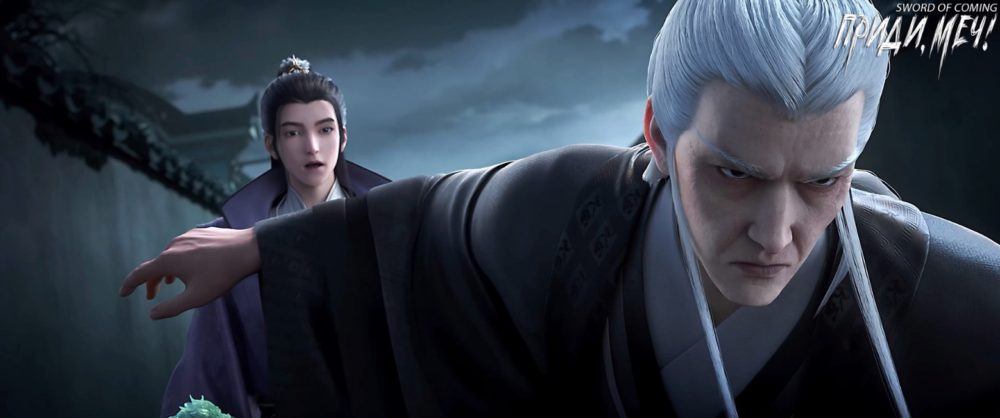
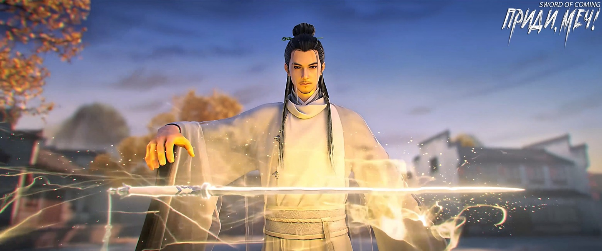

# Глава 12. Переулок

Девушка в черном одеянии направилась в глубину переулка, где изредка попадались дома с праздничными большими красными фонарями. В отличие от других людей, у нее не было никакой тщательной подготовки со стороны семьи, не было никаких далеко идущих планов, она просто в одиночку вторглась в городок.

Недалеко от переулка стоял юноша в парчовых одеждах, высоко держа в обеих руках нефритовую печать бирюзового цвета, размером с детскую ладонь, на которой были вырезаны свернувшийся дракон и притаившийся тигр. Под лучами солнца она ярко сияла, и внутри нее едва заметно мерцали тонкие нити розового света. Юноша, подняв голову и прищурив глаза, смотрел на это сокровище в своих руках с выражением полного восторга на лице. Рядом высокий старик, стоя на одном колене, тщательно вытирал рукавом грязь с его сапог.

Юноша краем глаза уже давно заметил странную девушку. Девушка носила вэймао в стиле «легкая роса»[1] на поясе у нее висел узкий клинок в зеленых ножнах, ее шаги были уверенными, и было очевидно, что она не местная жительница.

[1] Стиль «легкая роса» указывает на то, что этот конкретный вэймао был менее закрытым, чем обычно, позволяя видеть больше лица.

Однако юноша в парчовых одеждах не обращал на нее внимания, продолжая внимательно разглядывать древнюю нефритовую печать. В глубине души он даже надеялся, что у девушки возникнет мысль отобрать сокровище, иначе было бы слишком скучно.

В любом случае, он уже заполучил две вещи, и его добыча намного превзошла ожидания. Если он не найдет чем еще заняться, ему придется уйти вместе со старым слугой. Для него это означало бы, что чего-то не хватает.

Это было подобно тому, как в его доме, за тысячи ли от этого городка, он носил золотисто-желтый халат с девятью драконами, которым, к сожалению, всегда не хватало одного когтя[2].

[2] П/п.: Сыновья императора носили одеяние с вышитыми драконами, но с одним обязательным отличием — у драконов не хватало одного когтя. Если принц надевал одежду, на которой у вышитого дракона все когти — это считалось изменой.

Прибыв в этот городок, каждый избранный мог принести с собой три талисмана, помещенных в вышитые парчовые мешочки. Один мешочек нужно было отдать привратнику в качестве обязательной платы за проход. Независимо от статуса привратника, состояния городских ворот, будь то даже правитель страны или основатель школы, все должны честно следовать этому правилу. Остальные два вышитых мешочка означали, что можно вынести из городка максимум два сокровища. Даже если кто-то собрал бы здесь десять или сотню сокровищ, все равно пришлось бы вернуть их обратно.

В мешочках находились талисманы в виде трех особых типов медных монет: «монеты для подавления зла» используемые простыми людьми для празднования завершения строительства; «монеты приветствия весны», ежегодно вывешиваемые во дворце на персиковых табличках; и «монеты для подношения», которые держали в ладонях статуи бога города. Хотя их называли медными монетами, на самом деле они изготавливались из чрезвычайно редкого золотого сплава. Для большинства обычных людей «под горой» даже официальное серебро было редкостью, не говоря уже о мешочке тяжелого «золота». Этого действительно хватало, чтобы люди охотно приносили свои семейные реликвии на продажу.

Юноша в парчовой одежде изучал три вида медных монет, не упомянутых в официальных исторических записях, на протяжении всего пути, но не смог разгадать их секрет.

Впереди шла девушка, от которой исходила холодная аура. Она шла прямо вперед, не обращая никакого внимания на двух человек в переулке.

Юноша внезапно изменил свое намерение. Он убрал нефритовую печать, поместив ее в заранее подготовленный матерчатый мешочек, который повесил на пояс. Однако он продолжал стоять посреди переулка, не собираясь уступать дорогу.

Высокий светлокожий старик тоже встал. Его голос был мягким и тихим:

— Ваше Высочество, этот человек — опытный боец, нельзя недооценивать ее. Если бы мы были за пределами городка, естественно, не стоило бы беспокоиться. Но здесь, даже мое тело, следующее чисто по пути боевых искусств, постоянно подвергается подавлению этого мира, что очень неприятно. Если полностью активировать циркуляцию энергии и открыть все точки, это будет подобно обратному течению рек и морей. Меридианы и точки переполнятся, и ситуация выйдет из-под контроля. Моя смерть — мелочь, но безопасность Вашего Высочества — вот что важно. Если из-за моей небрежности в тысячелетнем плане Вашего Высочества по совершенствованию появится хоть малейший изъян, как я буду отчитываться перед Его Величеством и Ее Величеством по возвращении?

Юноша насмешливо сказал:

— Дедушка У, после того как ты покинул дворец, ты стал более разговорчивым. Раньше во дворце ты весь год повторял одни и те же фразы, даже глупый попугай моей сестры был красноречивее тебя.

Старик во всем проявлял раболепие, что выдавало в нем преданного евнуха из дворца.

Видя, что молодой господин, похоже, не понял его намека, он вынужден был сказать прямо:

— Ваше Высочество, присутствие этого человека в переулке уже может представлять угрозу для вас.

Юноша лениво усмехнулся:

— Хотя я давно слышал, что на пути совершенствования есть всевозможные люди, многие еретические и неортодоксальные учения. Но мы с ней просто случайно встретились, неужели она сразу захочет убить меня и отобрать сокровище? Это маловероятно, не так ли? Если бы все люди «на горе» были такими, разве не наступил бы хаос в мире?

Старик вздохнул. Царство «под горой» и бессмертные «на горе» лишь притворялись единым целым, на самом деле они презирали друг друга.

Юноша немного разочарованно сказал:

— Ладно, ладно, списывать эти неприятности на девушку — не поступок настоящего мужчины.

Девушка в черном подошла к нему, положив левую руку на рукоять меча.

Юноша в парчовых одеждах улыбнулся и отступил в сторону, жестом предлагая девушке пройти первой.

Девушка в черном тоже немного замедлила шаг и слегка повернулась. Взгляд из-под вуали был полон настороженности и бдительности.

Когда пожилой евнух заметил забинтованные хлопковой тканью раненые руки девушки, он не смог сдержать хмурого выражения лица.

— Как дерзко! — внезапно громко воскликнул он, словно гром среди ясного неба. Его ноги скользнули, и он заслонил собой юношу. Старый евнух слегка прислонился спиной, ловко оттолкнув юношу к стене переулка, одновременно раскрыв пальцы левой руки. В центре ладони раздался глухой удар.

Оказалось, кто-то использовал камень как скрытое оружие, метнув его в голову юноши. Звук был ошеломляющим, а сила удара была почти достаточной, чтобы пробить стену.

Старый евнух с грохотом раскрошил в ладони камень размером с кулак, но не бросился на убийцу, а вместо этого нанес правой рукой сокрушительный удар в сторону девушки в черном.

Девушка немного колебалась, подавив инстинктивное желание выхватить клинок из ножен, и отклонила голову, едва уворачиваясь от этого мощного и тяжелого удара. Сила удара была такова, что мгновенно растрепала тонкую вуаль на ее шляпе.

Старый евнух изменил прямой удар на боковой, направив кулак прямо в голову девушки. Движение кулака было плавным и непрерывным, без малейшей заминки.

Девушке пришлось быстро поднять обе руки, сложив их крест-накрест тыльными сторонами ладоней вместе, защищая область возле ушей, создавая тем самым крестообразную защитную позицию на пути удара.

В следующее мгновение девушка скользнула в сторону более чем на десять шагов. Она слегка выдохнула и подняла руку, на которой сквозь хлопковую повязку проступило больше крови, поправляя слегка покосившееся вэймао. Она была немного рассержена.

Девушка повернулась и, глядя на старого евнуха, который оглядывался по сторонам, четко произнесла:

— Если бы не я, он был бы уже мертв.

Старый евнух сделал вид, что не слышит. Однако, по сравнению с предыдущим моментом, этот опытный в делах убийств и покушений старый евнух уже снизил уровень опасности девушки до второго места. Первое место он отдал тому, кто атаковал с другой стороны переулка.

Конечно, в переулке, кроме господина и слуги, было только два настоящих посторонних человека.

На другой стороне переулка стоял высокий и худой человек в маске. Однако его руки были очень мускулистыми, мышцы выпирали, как железные шары.

На поясе у человека в маске висели два мешочка, наполненные круглыми предметами. Он стоял на месте, как будто говоря, что предыдущая атака была всего лишь предупреждением.

Когда его холодный взгляд скользнул по девушке, мужчина тайком ухмыльнулся, его глаза загорелись.

Девушка усмехнулась и произнесла два слова:

— Вернись!

Как только эти слова прозвучали, меч пронесся над головой. Мужчина мгновенно погиб.

Бессмысленное убийство, бессмысленная смерть. Самое быстрое оружие в мире для убийства врагов — летающий меч мастера меча.

Летящий меч вернулся к девушке, быстро кружась вокруг нее, словно ластящееся дитя.

Она раздраженно сказала:

— Прочь!

Летающий меч исчез в мгновение ока.

Господин и слуга застыли, словно деревянные куры.

Старый евнух был потрясен не самой техникой летающего меча. Вместо этого он искренне испугался, что девушка могла свободно управлять летающим мечом в этом городке. Это чувство на мгновение заставило старика почувствовать себя так, словно он вернулся в свою юность, когда он впервые вошел во дворец, трепеща от страха, и однажды издалека увидел одетого в ярко-красный халат с узором дракона старшего евнуха, идущего вдоль дворцовой стены. Конечно, он испытывал страх не перед самим евнухом, чьего имени даже не знал, а перед тем ослепительным ярко-красным цветом.

Юноша в парчовых одеждах, придя в себя, усмехнулся с самоиронией, сделал шаг вперед и с заботой спросил:

— Дедушка У, ты в порядке?

Седой старый евнух с мрачным выражением лица покачал головой и сказал:

— Лучше быть осторожным. Если совсем не получится, то я…

Юноша в парчовых одеждах поспешно замахал руками и спросил:

— Может, нам стоит извиниться?

Старый евнух был застигнут врасплох, а затем почувствовал горечь и самоосуждение. Когда господин опозорен, слуга должен умереть. Особенно в императорской семье!

Но юноша уже с улыбкой сказал:

— Дедушка У, что сложного в том, чтобы сказать «извините», если сделал что-то неправильно?

Старый евнух все еще считал этот поступок неуместным, но юноша уже направился к девушке. В этот момент старый евнух испытал смешанные чувства. Оказалось, что на спине юноши не было ни пылинки.