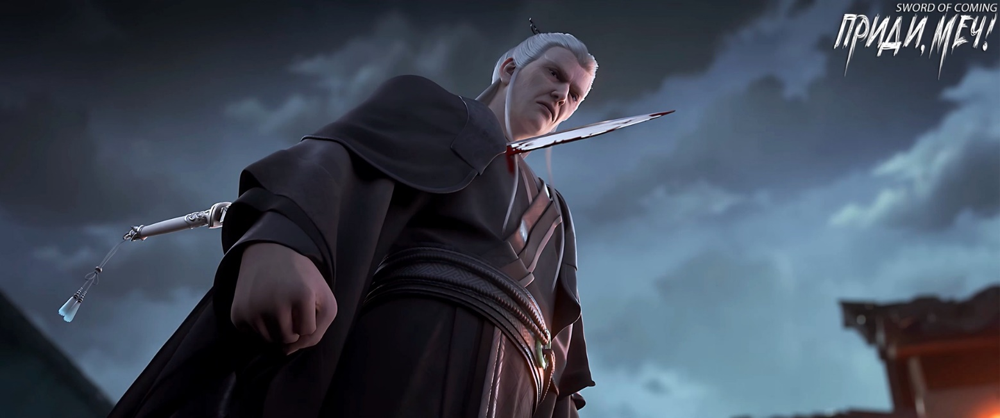
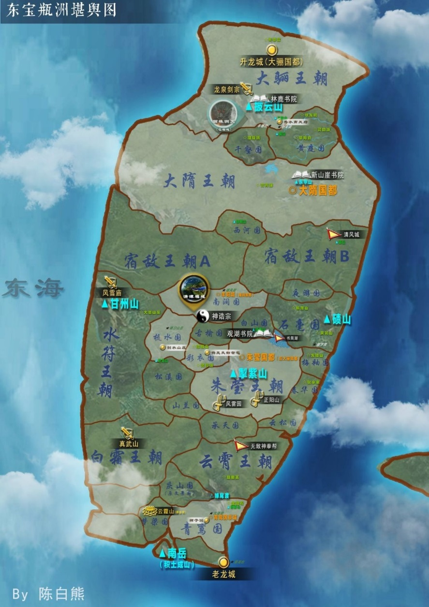

# Глава 13. Встреча

Девушка в вэймао не обратила внимания на юношу в парчовых одеждах, который направлялся к ней. Ее взгляд прошел мимо его плеча и остановился на высоком старике, следовавшем за ним шаг за шагом. Она мрачно произнесла:

— Хотя у тебя были свои причины, но недавно ты хотел убить человека без всяких разговоров, и я думаю, что это неправильно.

Юноша в парчовых одеждах остановился в семи-восьми шагах от холодной девушки и искренне сказал:

— Меня зовут Гао Чжэнь[1] я из округа Иян династии Великой Суй. Если дедушка У чем-то обидел вас, я готов принести извинения и возместить ущерб.

[1] Гао Чжэнь (高稹). Имя можно интерпретировать как «возвышенный и усердный» или «изобилующий талантами».稹 = «густой, плотный». Возможно, связь с устойчивостью.

Старый евнух стоял позади с противоречивыми чувствами. На самом деле, называть его отпрыском рода Гао из округа Иян царства Великой Суй было лишь сдержанным выражением. Династия Суй правила тысячу двести лет, и все, кто сидел на драконовом троне, носили фамилию Гао, а император-основатель как раз и происходил из округа Иян.

Девушка осталась равнодушной к этому. Она подняла обе руки, туго затянула повязки и сказала старому евнуху:

— Если бы мы были снаружи, и я столкнулась с таким мастером боевых искусств, который, весьма вероятно, уже достиг уровня «путешествия на ветру», я бы ни за что не сравнилась с тобой. Но здесь и сейчас, если я воспользуюсь летающим мечом, ты непременно умрешь.

Старый евнух холодно усмехнулся:

— Если бы тот убийца заранее знал о твоем козыре, то с его телосложением, достигшим пика малого мастерства, ему было бы достаточно защитить жизненно важные органы. Какая разница, проткнешь ты его десятью мечами или нет? Если даже он таков, то что уж говорить обо мне, который на два уровня выше него, причем один из этих уровней считается пропастью на пути боевых искусств. Маленькая госпожа, я не знаю, откуда у тебя такая уверенность, чтобы говорить «непременно умрешь».

Девушка слегка нахмурилась и незаметно положила руку на рукоять клинка:

— Я очень не люблю неприятности и еще больше не люблю спорить с людьми. Может, мы попробуем выяснить, кто прав на деле? Кто победит, тот и прав, как тебе?

Старый евнух, которому редко приходилось сталкиваться с угрозами, был несколько раздражен. Если бы не то, что они находились в этом проклятом богами и духами загадочном месте, то с уровнем совершенствования этой девушки, каким бы талантом она ни обладала, старик одной рукой мог бы сокрушить и уничтожить десяток таких, как она. С другой стороны, если бы не важная миссия, требующая заботы о юном господине, на которого возлагала большие надежды вся Великая Суй, старик, даже рискуя быть тяжело раненым подавляющей силой самовоспроизводящегося Дао этого места, непременно преподал бы хороший урок этой не знающей меры девушке. Молодой теленок не боится тигра, что достойно похвалы, но не более того. Однако это не означает, что свирепый тигр не сожрет теленка без остатка.

Юноша в парчовых одеждах, назвавшийся Гао Чжэнь, поспешил сгладить ситуацию:

— Если юная госпожа непременно хочет потребовать возмещения, я готов предложить эту вещь в качестве компенсации.

Гао Чжэнь опустил голову, открыл тканевый мешочек на поясе и достал нефритовую печать. Он держал ее одной рукой, протягивая в сторону девушки в вэймао:

— В знак искренности прошу вас не винить дедушку У за его ненамеренно нанесенную ранее обиду. Он действовал из верности и преданности, без намерения причинить вред.

Высокий старый евнух с седыми бровями и волосами внезапно вздрогнул, опустился на одно колено и тревожно произнес:

— Ваше Высочество, не надо! Этот старый слуга настолько ничтожен, а эта нефритовая печать — ваш шанс на удачу, редчайшее сокровище в мире, способное даже нести благословение народа. Как можно сравнивать эти две вещи? Ваше Высочество, вы же просто вынуждаете этого старого слугу умереть!

Лицо Гао Чжэня, рожденного в императорской семье, застыло.

Девушка, казалось, стала терять терпение и насмешливо улыбнулась:

— Лягушки на дне колодца, живущие в своем маленьком мирке, все любят хвалиться своим убогим имуществом. Забери свою нефритовую печать обратно. Мне всегда нравилось выражение: «Благородный человек не отнимает у других то, что им дорого».

Девушка решительно развернулась и ушла.

Гао Чжэнь с облегчением сказал:

— Встаньте, дедушка У, стоять на коленях неприлично. Двенадцать главных евнухов нашей Великой Суй преклоняют колени только перед императором. Если цензоры из Шести Ведомств[2] или люди из Министерства Ритуалов увидят это, они используют это против нас, и мы оба попадем в беду. Ладно, в этой поездке я получил благословение предков и успешно завершил миссию. Не будем создавать лишних проблем и быстро покинем это место. Даже когда мы встретимся со своими людьми снаружи, нельзя терять бдительность. Нужно помнить, что хотя среди шести великих опорных государств[3] династии Дали семьи Юань и Цао находятся в противоположных лагерях, но, к несчастью, эти две опоры Дали имеют кровную вражду с нашим родом Гао из Великой Суй. Если с вами, дедушка У, здесь что-то случится и ваша боевая сила пострадает, мне будет очень трудно благополучно вернуться в Суй.

[2] 六科言官 — Шесть цензоров. Группа официальных чиновников в императорском Китае, ответственные за надзор, критику и подачу советов императору и правительству.

[3] 六大柱国 — Шесть великих опор государства. Высший титул в некоторых древнекитайских государствах, обычно присваивался самым заслуженным сановникам. «柱国» буквально означает «государство-столп», то есть государство, поддерживающее центральную власть.

Старый евнух кивнул и медленно поднялся:

— Старый слуга понимает важность и срочность дела.

Когда старый евнух произнес слово «срочность», девушка в вэймао уже отошла более чем на двадцать шагов.

Мимо Гао Чжэня пронесся порыв свежего ветра, развевая пряди волос на висках и рукава его богато украшенной мантии.

Оказалось, что этот пожилой человек, обладающий огромной властью в Великой Суй, вовсе не собирался отпускать девушку. Он внезапно бросился вперед, первые три шага тяжело ступая по земле переулка, и глухой звук проникал на три метра под землю. На четвертом шаге старик уже высоко подпрыгнул, нанося удар кулаком в спину девушки.

Девушка резко развернулась в талии, опираясь на носок левой ноги, и правой рукой выхватила клинок из ножен. В переулке появилось белое сияние, более яркое, чем солнечный свет.

Старый евнух обрушился на девушку с подавляющей силой, нанеся прямой удар кулаком по лезвию ножа. На тыльной стороне его руки от острого края клинка осталась лишь тонкая кровавая полоса. После того как ноги старого евнуха с грохотом коснулись земли, он продолжил напирать вперед, заставляя девушку с кинжалом отступать. Затем он небрежно выбросил вперед ладонь, казалось бы, медленно и спокойно, но на самом деле молниеносно толкнул девушку в лоб. Старый евнух усилил давление, намереваясь одним ударом раздробить голову, скрытую под вэймао. Он поспешно переместился, сдвинувшись в сторону на одну стопу. Раздался хлюпающий звук, и, опустив взгляд, он увидел, что острое оружие пронзило его правую сторону груди со спины — это был кончик меча. Выражение лица старого евнуха не изменилось. Он сжал кончик острия двумя пальцами и толкнул назад, с силой выдавливая из своей груди этот острый летающий меч, прибывший сюда по воле девушки.

Из-за помехи, созданной летящим мечом, старому евнуху не удалось одним ударом ладони разбить голову девушки. Девушка, отлетевшая и упавшая в переулке, воспользовалась этой возможностью, чтобы перевести дыхание. Поднявшись, она с ловкостью дикой кошки быстро исчезла в одном из ответвлений переулка.

Лицо Гао Чжэня стало пугающе мрачным. Сжав кулаки и излучая гневную ауру, он с яростью сказал:

Лицо Гао Чжэня стало ужасающе мрачным, он сжал кулаки, излучая гневную ауру, и с яростью в голосе сказал: «Главный евнух императорской конюшни[4], У Юэ по прозвищу У Дяосы[5]! Почему ты не прислушался к моему намеку и действовал так упрямо? Неужели ты думаешь, что в этом маленьком городке только ты, У Дяосы, самый непобедимый в Поднебесной? Мы явно ошиблись первыми, а она потом даже не стала на нас давить и была готова уладить дело мирно. Почему же ты все равно действуешь так жестоко? Это уже слишком!

[4] Императорское Управление Коневодства (御马监) — ведомство, отвечавшее за разведение и содержание лошадей для императорского двора.

[5] У Юэ (吴钺). Имя «Юэ» означает «боевой топор» или «власть». Воинственный подтекст. У Дяосы (吴貂寺) — прозвище,貂 = куница. соболь (символ роскоши), 寺 = храм. Противоречивый образ.

Старый евнух отвел взгляд от направления, куда убежала девушка, повернулся и пошел обратно, выпрямив спину, что еще больше подчеркивало его величественную ауру. Он медленно шагал обратно, и каждый шаг тяжело отдавался в сердце.

Гао Чжэнь почувствовал этот удушающий натиск. Будучи подавленным слугой разозлило его еще больше. Он широко раскрыл глаза и, скрежеща зубами, сказал:

— У Дяосы из императорского Управления Коневодством, это смертельное преступление!

Старый евнух спокойно ответил:

— Ваше Высочество, смертельное преступление это или нет, должен решать лично Его Величество. С точки зрения этого слуги, безопасность Вашего Высочества имеет первостепенное значение. А само существование девушки, по мнению этого слуги, уже стало неотложной проблемой. Поэтому, чтобы действительно все уладить, нужно лишь безжалостно убить ее. Только когда она умрет, этот слуга сможет быть спокоен.

Увидев в глазах Гао Чжэня едва сдерживаемый яростный огонь, старый евнух вздохнул и тихо сказал:

— За более чем шестьдесят лет службы во дворце этот слуга повидал бесчисленное множество интриг: кровавых и бескровных. У этого слуги совершенно нет веры в человеческую натуру. Только во время сопровождения императора этот слуга лично предотвратил не менее тридцати больших и малых покушений. Ваше Высочество, коварство и хитрость убийц и наемников выходят за рамки воображения, особенно опасны некоторые безумные смертники, которых невозможно понять. Взять хотя бы недавнего убийцу в маске и девушку в вэймао…

Гао Чжэнь указал пальцем на старого евнуха с холодным выражением лица и гневно сказал:

— Молчи! Ты, старый евнух! Я не хочу слушать твою чушь! Я уверен только в том, что ты разрушил мои тщательно продуманные планы. Даже слепой заметил бы, насколько та девушка, способная управлять летающим мечом, одарена и талантлива! Такие личности — не говоря уже о Великой Суй или Дали, даже на всем Восточном континенте Водолея[6] является редкостью, подобно перу феникса или рогу единорога. Мне нужно было лишь воспитывать ее десять, максимум двадцать лет, и она стала бы самым могущественным убийцей, скрывающимся в тени за моей спиной! Что значат перед ней земные бессмертные или великие мастера боевых искусств?! И что в итоге? Я — Гао Чжэнь, будущий наследный принц династии Суй! Я твой хозяин, старый евнух У!

[6] Подробности в конце главы.

Странно, но пожилой евнух, много повидавший на своем веку, не только не разозлился, когда его раз за разом называли «старым евнухом», но и смотрел на юношу все более одобрительно. Когда запыхавшийся Гао Чжэнь закончил свою тираду и перестал ругаться, старик посмотрел на него с улыбкой сказал:

— Ваше Высочество, хотя, возможно, из-за того, что вы лично не сталкивались с некоторыми вещами, вы не знаете о непостоянстве мира и злобе человеческих сердец, но есть одна вещь, которую Ваше Высочество делает очень хорошо, прямо как Его Величество в свое время.

Атмосфера стала неловкой. Успокоившись, Гао Чжэнь, должно быть, осознал, что совершил большую ошибку, проявив такое неуважение к старику, который был главным евнухом императорских конюшен и одним из трех привратников императорского дворца Великой Суй, причем еще до того, как самого Гао Чжэня официально назначили наследным принцем. Более того, этот человек пользовался глубоким доверием как его императорского отца, так и матери.

Принц Гао Чжэнь открыл было рот, но увидел, как влиятельный старик, которого он обозвал «старым евнухом», улыбнулся и сказал:

— Ваше Высочество, запомните одну вещь: не извиняйтесь перед слугами по пустякам, в этом нет необходимости. Это лишь напрасно унижает ваш статус, да и слуги могут не оценить этого. Даже если в душе вы чувствуете вину, ее следует глубоко похоронить в сердце. Знайте, что императоры и монархи, которых называют истинными драконами среди людей, и их слова подобны небесным законам…

Гао Чжэнь ответил:

— Дедушка У, учитывая мое нынешнее положение, говорить об этом слишком рано.

Старый евнух внезапно напрягся, словно столкнувшись с могущественным врагом, и одним движением оттащил юношу за свою спину, а сам посмотрел в сторону трупа убийцы в маске.

На другом конце переулка неожиданно появился стройный мужчина средних лет в одеждах ученого. Он медленно вошел в переулок и подошел к телу убийцы. Присев на корточки, ученый снял с лица убийцы маску и увидел странное лицо: без бровей, с отрезанным носом и вырезанными на коже иероглифами. Несомненно, этот человек при жизни был преступником.

Ученый молчал. Очевидно, это было заранее спланировано, и, вероятно, этот план начался еще с того Храма Литературы[7].

[7] Храм Литературы (文庙). Конфуцианский храм, посвященный Конфуцию и другим великим мыслителям.

Гао Чжэнь с горящими глазами вышел из-за спины старого евнуха, поклонился, решив, что в любом случае сначала нужно проявить уважение, а уже потом заговорить. Затем он поднял голову и почтительно спросил:

— Осмелюсь спросить, не учитель ли Ци из академии академия Горного Утеса?

Ци Цзинчунь встал и сказал Гао Чжэню:

— Если бы ты первым не получил большую удачу, вам двоим не удалось бы сегодня так легко уйти.

Когда в маленьком городке чужаки убивали друг друга, согласно правилам, установленным четырьмя первыми мудрецами, наказание не было суровым, но и не могло считаться легким. В отличие от неизбежного изгнания за беспорядочное убийство обычных жителей городка, в борьбе между чужаками существовала явная «лазейка», позволяющая исправить ситуацию задним числом.

Три группы людей, включая Гао Чжэня, привели с собой по одному «сопровождающему» именно для того, чтобы подготовиться к худшему сценарию и в критический момент выставить их козлами отпущения. В противном случае, только за одно место пришлось бы потратить половину накоплений из личной казны императора династии Суй из рода Гао. Учитывая, что речь шла о личных сбережениях Его Величества могущественного государства, целая половина состояния представляла собой огромную сумму. Кто бы согласился без причины стать такой жертвой? Говоря проще, это было не что иное, как трата денег чтобы избежать беды. Однако расходы здесь можно было сравнить с опустошением целой горы золота и серебра. По сравнению с этим, так называемое «швыряние деньгами» в обычном мирском понимании казалось детской игрой.

Гао Чжэнь, несмотря на намек уйти, продолжал говорить:

— Учитель Ци, если в будущем представится возможность, не могли бы вы прочитать лекцию в академии нашей Великой Суй? Наша Великая Суй готова специально для вас, учитель, оставить вакантной должность «Наставника Государства»!

Старый евнух подумал и решил не останавливать юношу от дерзких слов. Если бы действительно удалось убедить этого ученого в будущем давать советы роду Гао из Суй, император был бы очень доволен.

Ци Цзинчунь улыбнулся, но ничего не ответил.

Старый евнух, который был безжалостен к незнакомой девушке, теперь проявил совершенно другое отношение к учителю Ци из академии Горного Утеса, который был опорой этого места. Опустив голову и сложив руки в жесте почтения, он сказал:

— Учитель Ци, прошу прощения за беспокойство и надеюсь на ваше великодушие. Недавнее нападение на юную особу было вынужденной мерой. Надеюсь, вы поймете тяжелое положение слуги семьи Гао, в котором я оказался.

Ци Цзинчунь взмахнул рукавом:

— Быстро уходите.

Гао Чжэнь и старый евнух были вынуждены откланяться и уйти, следуя по тому же пути, по которому отступила девушка.

Гао Чжэнь тихо спросил:

— Она умерла?

Старый евнух покачал головой:

— Определенно, ее жизнь на исходе. Летающий меч лишь продлил ей жизнь на мгновение, это ничего не изменит.

Гао Чжэнь немного поколебался, затем с любопытством спросил:

— Дедушка У, когда вы заметили, что ее управление летающим мечом на самом деле не так легко и непринужденно, как казалось на первый взгляд?

Старый евнух ответил:

— Чрезмерность так же плоха, как и недостаточность. Ее ранняя одаренность выдала ее.

Гао Чжэнь был удивлен и озадачен.

Старый евнух повел Гао Чжэня из первоначального переулка и тихо сказал:

— Этот слуга задаст Вашему Высочеству один вопрос. Ваше Высочество, видевшее множество редких и драгоценных вещей в мирской роскоши, все еще будет интересоваться обычной керамикой из маленького городка?

Гао Чжэнь похлопал по карману на поясе и сказал с улыбкой:

— Конечно, нет. Только эта нефритовая печать или что-то подобного уровня может меня порадовать.

Старый евнух кивнул и сказал:

— Верно. Когда та девушка убивала людей летающим мечом, ее сердце было спокойно, как стоячая вода, она была чрезвычайно хладнокровна и невозмутима, как будто… это было для нее так же обыденно, как еда, питье и другие повседневные дела. А когда она поняла мой истинный уровень в боевых искусствах, она решительно отказалась от мысли о борьбе. Особенно она боялась, что я увижу ее неуверенность, поэтому намеренно провоцировала нас. Ее истинным намерением было дать обеим сторонам возможность отступить, опасаясь, что я могу решить убить ее на всякий случай. Поэтому ей нужно было изменить ситуацию. Конечно, как показали события, у нее это не очень получилось. Но в целом, для ее возраста такие мысли уже впечатляют. Однако, чем более она талантлива, тем большую угрозу она может представлять для вас в будущем. Это тоже самое, если мы отпустим тигра обратно в горы и позволим ему окрепнуть.

Старый евнух с чувством добавил:

— Юноши и девушки в расцвете сил и полные энтузиазма. Если бы они убивали в порыве страсти или умирали с воодушевлением, я бы не удивился. Но умереть с невозмутимостью после долгих размышлений или убивать, не вызывая ни малейшей ряби на поверхности своего сердца — это очень необычно. Можно даже сказать, что такой характер может быть выкован только опытом, и он имеет мало общего с талантом или качествами человека. Будь то последователи духовных практик или воины, многие гении умирают молодыми из-за явных недостатков в характере, легко терпя неудачи при столкновении с трудностями.

Гао Чжэнь печально вздохнул:

— Как бы то ни было, это достойно сожаления.

Старый евнух наполовину в шутку, наполовину всерьез сказал:

— Ваше Высочество, если вы будете вздыхать каждый раз, когда решается вопрос жизни и смерти такого человека, то, когда вы действительно окажетесь на вершине, вы, вероятно, будете очень заняты.

Гао Чжэнь рассмеялся:

— Я в это не верю.

Старый евнух внезапно сказал:

— Не знаю, возможно, это просто ошибочное впечатление, но этому слуге кажется, что хотя учитель Ци обладает глубокими познаниями в совершенствовании, у него, похоже, возникла немалая проблема.

Этот принц династии Суй с безразличием на лице ответил:

— В любом случае, изначально нам нужно было только получить эту печать «Драконьи врата», чтобы считать миссию выполненной. Кто бы мог подумать, что эта бесценная печать «опустится» до роли небольшого дополнения к крупной сделке. Так что нам пора довольствоваться достигнутым. Говоря о том золотом карпе, я не могу не вспомнить того юношу в соломенных сандалиях…

Старый евнух усмехнулся:

— Ваше Высочество думает о том, чтобы в будущем найти возможность поблагодарить того юношу?

Гао Чжэнь покачал головой: 

— Вовсе нет, я переживаю за тот мешочек с медными монетами.

Старый евнух не смог сдержать смех. Возможно, в будущем у династии Суй будет бережливый император?

※※※※

В тихом переулке, идущем с севера на юг, слышался только звук колес.

Молодой даос сегодня рано закончил торговлю и толкал тележку, думая о том, как вернуться домой, собрать вещи и поскорее уехать. Он считал, что в эту неразбериху лучше не вмешиваться.

Внезапно из бокового переулка, идущего с востока на запад, шатаясь и спотыкаясь вышел стройный человек в черном. В конце концов, он прислонился к стене и медленно сполз по ней. Одной рукой он приподнял вуаль своего вэймао, изо всех сил зажимая рот, а другой указал на молодого даоса.

Даос быстро опустил голову и стал про себя повторять:

— Он меня не видит… Он меня не видит. Верховный Владыка Лао-цзюнь, помоги… Ладно, оставим это. Пусть лучше Будда благословит, а бодхисаттва явит свою чудесную силу…[8]

[8] Верховный Владыка Лао-цзюнь (太上老君) — божество в даосизме, обожествленная форма Лао-цзы, легендарного основателя даосизма.

В критический момент он обратился не к Трем Чистым, а к Будде и бодхисаттвам, что было довольно неуместно для даоса. Но, видимо, Будда и бодхисаттвы не захотели помогать последователю другой религии. Девушка в вэймао, собрав последние силы, шатаясь, бросилась к даосу и с глухим стуком тяжело упала, но одной рукой крепко ухватилась за его лодыжку.

Молодой даос, схватившись обеими руками за голову, с выражением полного краха на лице, будто взывая к небесам, воскликнул:

— Неужели такая гигантская карма, обрушившаяся на меня, это не все равно что вырезать на моем лбу слова «всем сердцем стремлюсь к смерти»? Все эти годы я, бедный даос, странствовал по свету, спал под звездами и ел с ветром, переходил горы и реки, меня даже собаки на улицах кусали… Это же адский труд! Еб вашу мать, клан Гао из Великой Суй, и ты, старый пес по фамилии У! Помяните мое слово — этот счет не закрыть и за пятьсот лет!.. Мои даосские достижения так ничтожны, я правда не могу тянуть такую ношу!..

Молодой даос, уже говоря бессвязно, опустил голову, чуть не плача:

— Девушка, прояви сострадание, пощади этого скромного даоса, хорошо? В ответ я найду для тебя красивое место с горами и реками, с отличным фэншуй, которое непременно принесет благословение твоим потомкам… О, нет, ты же еще незамужняя девица, тогда…

Девушка уже полностью потеряла сознание. Молодой даос, видя, что вокруг никого нет, присел и уже собирался потихоньку разжать ее пальцы.

Вжух! Летающий меч завис в воздухе, острие остановилось всего в десятке сантиметров от переносицы молодого даоса.

Молодой даос незаметно отпустил руку, его лицо выразило сострадание, и он с возвышенным видом сказал:

— Люди — не травы и деревья, как можно быть лишенным сочувствия?! Как я, человек чистой совести, могу оставить кого-то умирать?!

Даос сел, скрестив ноги, его красивое лицо сморщилось:

— Теперь вопрос: куда ее отвезти? Вот проблема.

Летающий меч, который все время находился у лба молодого даоса, резко приблизился.

Молодой даос терпеливо объяснил:

— Чтобы спасти твою хозяйку, мне нужен помощник. Вот что, слетай к старой софоре и принеси лист. Я сначала поддержу ее жизненную энергию. Твоя хозяйка особенная, я не хочу спасать ее необдуманно, чтобы случайно не помешать ее будущему развитию. Эта новая карма… опять заставляет меня думать о смерти как о решении всех проблем…

Меч, казалось, колебался, его острие слегка дрожало.

Молодой даос раздраженно крикнул:

— Чем быстрее ты отправишься, тем быстрее твоя хозяйка вернется с того света. Опоздаешь — все вместе пропадем!

В мгновение ока летающий меч исчез.

Молодой даос тихо и гневно сказал:

— Когда у юноши есть чувства, а у девушки есть намерения, только тогда они могут стать прекрасной парой. А вы, господин Ци Цзинчунь, великий учитель Ци, хороши — бездумно сводите пары, словно испражняетесь, не подтирая зад!

Молодой даос подпер щеку одной рукой, а другой стал гадать, загибая пальцы:

— Позволь этому бедному даосу посчитать, в семью какого дома в городке тебя отправить, чтобы ты смогла выжить, а они не потеряли свое состояние и близких. Начнем с семьи Лу… Нет, семья Лу не подойдет, они почти как семья Чжао, уже имеют свою судьбу. Тогда, может, семья Сун?

Не успел молодой даос в переулке договорить, как на улице Благоденствия и Достатка у ворот семьи Сун все изображения духов-хранителей, наклеенные на большие и малые двери, мгновенно потеряли свое сияние, потускнели, и поднялись струйки синего дыма, невидимые обычному человеческому глазу.

Из глубины двора, толкнув дверь вышел седой старик и, стоя босиком во дворе, гневно закричал, подпрыгивая:

— Какой сукин сын пытается навредить моему роду Сун?! Выходи на бой!

Молодой даос кашлянул и пробормотал себе под нос: Семья Лю с улицы Благоденствия и Достатка, похоже, процветает. Кажется, они смогут справиться с этим, давай попробуем?

Табличка в родовом зале семьи Лю, передававшаяся из поколения в поколение на протяжении тысячи лет, с грохотом раскололась, покрывшись ужасающими трещинами.

Пожилая женщина с густым и хриплым голосом сильно ударила своей тростью с драконьей головой о землю:

— Кто бы ты ни был, не мог бы ты показаться?!

Молодой даос сделал вид, будто ничего не произошло.

— Тогда, может, семья Вэй из переулка Персиковых Листьев? Видно, что ваша семья накопила много добрых дел и добродетели, вы точно сможете выдержать эту карму.

Вскоре некий старец использовал тайное искусство, чтобы передать свой гневный крик в сторону школы:

— Ци Цзинчунь! Ты не можешь с этим разобраться?! Если ты не можешь или не осмеливаешься этим заняться, то немедленно убирайся и уступи место Жуань Цюну[9]! Пусть он разберется с этим подозрительным типом! Или же все это — твоя личная месть, Ци Цзинчунь?

[9] Жуань Цюн (阮邛). Это редкое имя, оно может отражать связь с природой (горы, бамбук), историческую глубину или стойкость (как бамбук, гнущийся, но не ломающийся). Имя сочетает классическую фамилию с поэтичным географическим или историческим именем. Его можно перевести как: «Традиционный, как древняя лютня, и стойкий, как горы» или «Наследник истории царства».

У ручья к югу от крытого моста некий мужчина руководил рытьем колодца. Выпрямившись, он повернулся на север и слегка шевельнул губами. Над улицей Благоденствия и Достатка и переулком Персиковых Листьев, словно раскаты весеннего грома, прокатился голос:

— Довольно! Не смейте проявлять неуважение к учителю Ци! К тому же я, кузнец Жуань, ни в коем случае не буду вмешиваться в дела городка до весеннего равноденствия!

На мгновение все вокруг затихло, воцарилась полная тишина.

А виновник всего этого, сидевший рядом с тележкой в переулке, взял руку девушки в черном и положил на ее окровавленную ладонь изумрудно-зеленый лист софоры, принесенный летающим мечом.

Когда лист софоры коснулся раны на ладони девушки, он растаял, как снег, и мгновенно исчез.

Молодой даос вздохнул:

— Каждый раз, видя такую картину, я чувствую благодарность за это чудо природы…

Он долго подбирал слова, но так и не смог найти выражение, которое бы его удовлетворило.

Наконец, молодой даос опустил голову, глядя на девушку, чье лицо слегка порозовело, и озадаченно сказал:

— Поскольку судьба, в которую ты вовлечена, оказалась гораздо значительнее, чем я предполагал, придется действовать против течения. В этом городке шестьсот семей, их корни глубоко переплетены, поколениями впитывали энергию этого таинственного места. Если бы ты попросила меня найти кого-то, окруженного сильной судьбой, это было бы легко. Но найти бедняка здесь сложнее, чем подняться на небо. Это все равно, что найти в зале для аудиенций при дворе высокопоставленного чиновника — такое легко, но попробуй найти там нищего! И как, по-твоему, этот бедный даос должен его искать?

Молодой даос вдруг удивленно воскликнул. Он действительно нашел такого жалкого человека. Он не испытывал ни малейшей радости, напротив, его охватил ужас. Он закрыл глаза и стал глубоко копаться в своем сердце, а затем вздохнул:

— В любом случае, давай сначала посмотрим, какой выбор ты сделаешь. Я ни в коем случае не буду настаивать. Если ты не захочешь, я сам возьму на себя эту карму.

Наконец он сложил руки, как буддийский монах:

— Да благословит Будда, да явят бодхисаттвы свою силу, пусть помогут бедному даосу пережить это испытание.

В переулке Глиняных Кувшинов молодой даос, наклонившись, толкал двухколесную тележку. Он остановился у ворот одного двора, постучал и спросил:

— Чэнь Пинъань дома?

В углу тележки лежал длинный меч в белоснежных ножнах. Летающий меч внутри ножен выглядел болезненным, словно презирал молодого даоса за то, что тот нашел такого бедняка.

※※※※

[6] П/п.: Немного о мире и происхождении названия континента. Я не уверена, что в романе мир будет разделен именно такие территории, но так как весь роман крутится вокруг буддийской и конфуцианской традиции и в «Приди, меч!» полно материалов из реальных философских трактатов и древней китайской литературы, то данная информация вполне может пригодиться в будущем. Если смогу расшифровать надписи на карте, то, возможно, однажды переведу ее.

Название относится к одному из четырех континентов в буддийской космологии. В буддийской традиции мир разделен на четыре континента, расположенных вокруг горы Меру. Гора Меру (须弥山) находится в центре этой космологической системы и считается осью мира в буддийской и индуистской традициях.

Восточный континент: Пурвавидеха (东胜身洲) или Баопин (东宝瓶洲). Он же Восточный континент Водолея. 宝瓶 (Баопин) — драгоценный сосуд, ваза. Таким образом, можно перевести как «Восточный континент Драгоценной Вазы». В астрологическом контексте также может означать созвездие Водолея, что и отражается в названии. Однако стоит отметить, что более распространенным названием этого континента является Пурвавидеха, что переводится как «Восточный континент превосходного тела».

Южный континент: Джамбудвипа (南赡部洲, Южный континент дерева Джамбу). Это место где мы живем. Его название происходит от дерева Джамбу, которое, согласно легендам, растет на этом континенте.

Западный континент: Апарагодания (西牛贺洲). Название буквально переводится как «Западный континент изобилия скота». Согласно буддийским текстам, на этом континенте люди пасут скот и наслаждаются богатством и процветанием.

Северный континент: Уттаракуру (北俱卢洲). Этот континент считается местом, где люди живут без страданий и забот. Название может быть переведено как «Северный континент Куру». В китайской буддийской литературе часто ассоциируется с концепцией идеального места или утопического общества. Куру — санскритский термин, что были адаптированы в китайском языке путем фонетической транскрипции, когда значение передается звучанием, а не смыслом иероглифов.