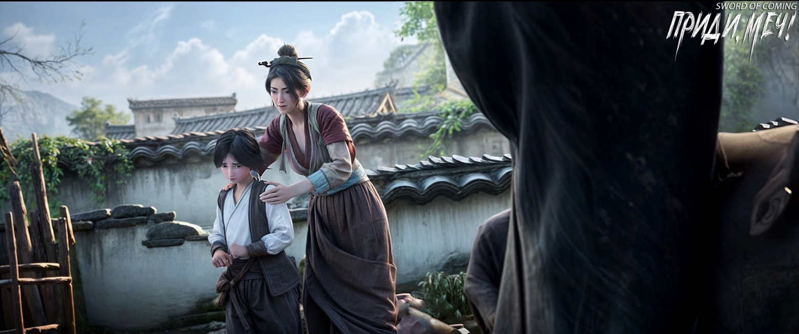

# Глава 14. Пятый день пятого месяца

Молодой даос уже приготовил множество фраз, чтобы ответить на вопрос Чэнь Пинъаня «Кто это?», но, неожиданно, ворота быстро открылись. Очевидно, Чэнь Пинъань просто пропустил этот этап.

Переулок Глиняных Кувшинов был самым узким и тесным переулком в городке. Двухколесная деревянная тележка даоса не могла быть оставлена снаружи и преграждать путь. К счастью, хотя Чэнь Пинъань выглядел тощим как щепка и казался слабаком, на самом деле он обладал немалой физической силой. Он помог молодому даосу втащить довольно тяжелую тележку во двор, и это не потребовало особых усилий. На протяжении всего этого времени он ничего не говорил, что заставило молодого даоса почувствовать себя несколько неловко после того, как они закрыли ворота. Это было похоже на ситуацию, когда человек, набравшись наглости, приходит просить денег взаймы, а хозяин радушно угощает его лучшим чаем, вином и мясом. Если у гостя осталась хоть капля совести, ему становится все труднее заговорить о своей просьбе.

Молодой даос подумал, что так или иначе ситуация неловкая, поэтому решил действовать напрямик. Он откинул хлопковое одеяло, покрывающее тележку, обнажив свернувшуюся на боку девушку в черном. Покосившееся, но не падающее вэймао все еще упрямо скрывало лицо хозяйки под вуалью. Почему-то, как только он снял тонкое одеяло, в лицо сразу ударил запах крови. Только тогда Чэнь Пинъань заметил, что сквозь черную одежду девушки просачивалась кровь. Он удивился, как такое маленькое одеяло могло полностью скрыть столь сильный запах, отступил на несколько шагов и спросил:

— Даос, что вы собираетесь делать?

Молодой даос ответил:

— Спасать человека! Она тяжело ранена, и никто в городке не хочет ее спасать. Нельзя винить их за то, что они заботятся только о себе. Поэтому этот бедный даос подумал и решил, что ты, возможно, будешь исключением.

Чэнь Пинъань сразу попал в точку, спросив:

— Как она получила травму?

Молодой даос, не краснея и не волнуясь, ответил:

— Когда этот бедный даос проезжал мимо мемориальной арки, я увидел эту молодую девушку из другого города. Она сказала, что собирается сделать копию надписи «Ци, устремленная к созвездию Северного Ковша». С собой у нее были принадлежности для снятия оттиска и кисти. Она быстро забралась наверх. Что касается снятия эстампов, как бы объяснить… Это своего рода копирование, обычно этим занимаются ученые от нечего делать. Я не могу точно объяснить, что это такое. В общем, девушка забралась наверх, наклонилась и села на перекладину. Я смотрел на это с замиранием сердца и остановился, время от времени предупреждая ее. Кто же мог подумать, что в конце концов она слишком увлечется и внезапно — бах! — упадет прямо на землю. Ты же знаешь, что земля у мемориальной арки не такая, как в вашем переулке Глиняных Кувшинов. Она твердая, почти как каменные плиты на улице Благоденствия и Достатка. И вот, похоже, при падении у нее повредились все внутренние органы. Этот бедный даос — монах, и должен быть милосердным, разве не так? Нельзя не помочь. По пути сюда все домохозяйства отвергали ее из-за окровавленной одежды. Ведь совсем недавно прошел Новый год, и это считается плохой приметой. Никто не хочет вносить ее в свой дом. Этот бедный даос понимает, что это обычное человеческое поведение, поэтому, не найдя другого выхода, пришел к тебе. Говоря прямо, если даже ты не захочешь ее приютить, этот бедный даос — не какое-нибудь божество, способное вытащить человека из врат ада. Тогда останется только ждать, пока эта девушка испустит последний вздох, а затем постараться найти место, выкопать яму, поставить надгробие, и на этом все закончится.

Молодой даос намеренно говорил очень быстро и нечетко, очевидно пытаясь запутать Чэнь Пинъаня, чтобы сначала как-нибудь выкрутиться. Начало всегда трудное, но стоит только начать, и дальше можно идти шаг за шагом. Небо не оставляет человека без выхода, всегда наступает момент, когда за мрачными ивами открывается светлая цветущая поляна.

Чэнь Пинъань посмотрел сложным взглядом, окинув глазами полного надежды молодого даоса, а затем бросил взгляд на безжизненную девушку в черном. После внутренней борьбы он кивнул и спросил:

— Как ее спасти?

Молодой даос тут же воспрянул духом:

— Отлично! С этими словами от тебя, Чэнь Пинъань, считай, половина дела сделана. Хотя ее травмы выглядят ужасно, что Владыка Ян уже вычеркнул ее имя из Книги Жизни и Смерти, на самом деле все не так плохо, как кажется… Конечно, все, что я сказал раньше — чистая правда, и здесь замешаны разные тайны. Например, у этой девушки очень сильное желание жить. Кроме того, похоже, у нее есть какие-то семейные секреты, которые защищают ее жизненно важные точки и энергетические центры. А еще наш городок — очень интересное место, здесь много странных вещей, которые, если их съесть или поймать, могут принести большую пользу.

Молодой даос опомнился, осознав, что выдал много тайн, и сухо рассмеялся:

— В любом случае, ты ведь все равно не понимаешь, верно?

Чэнь Пинъань серьезно ответил:

— Не понимаю, но большую часть могу запомнить.

Молодой даос осторожно спросил:

— Значит, услышав стук в дверь, ты сразу понял, что это я, гадатель, который раскладывает лоток на улице?

Чэнь Пинъань немного поколебался, затем сказал:

— Да.

Молодой даос с любопытством спросил:

— У тебя хорошая память? Насколько хорошая?

Чэнь Пинъань взглянул на едва дышащую девушку в черном, и молодой даос с улыбкой объяснил:

— Она сейчас находится в довольно таинственном состоянии, нельзя произвольно двигать ее тело, лучше немного подождать.

Чэнь Пинъань с сомнением ответил:

— Мне легче запоминать то, что я вижу, чем то, что слышу от других.

Молодой даос продолжил расспрашивать:

— Можешь привести пример?

Чэнь Пинъань подумал и сказал:

— Например, мастер Яо, главный в нашей драконовой печи. Его техника «прыгающего ножа» лучшая среди всех старых мастеров в городке. Я могу запомнить все детали, просто посмотрев один раз, но…

Молодой даос с улыбкой продолжил:

— Но твои руки и ноги все равно не успевают, верно?

Глаза Чэнь Пинъаня загорелись, и он энергично кивнул.

Молодой даос понимающе улыбнулся:

— А ты когда-нибудь задумывался, в чем на самом деле заключается мастерство старика Яо?

Лицо Чэнь Пинъаня помрачнело:

— Раньше я никак не мог понять, но потом Лю Сяньян сказал мне, что старик Яо говорил: «Чтобы достичь совершенства в технике «прыгающего ножа», нужно иметь спокойный ум, а не только твердую руку». Услышав это, я немного понял. Раньше я слишком торопился, чем больше нервничал, тем более неуклюжими становились мои руки, чем более неуклюжими они становились, тем больше ошибок я допускал. Я ясно видел свои ошибки, понимал, чем мои движения отличаются от движений старика Яо, и это заставляло меня еще больше нервничать. Поэтому в драконовой печи я всегда был худшим в лепке глиняных заготовок.

Молодой даос спокойно сказал:

— Есть старая поговорка: «Учитель может открыть дверь, но ученик должен сам войти в нее». Но если учитель даже не собирается открывать тебе дверь, как ты можешь совершенствоваться?

Чэнь Пинъань покачал головой:

— У меня неуклюжие руки и ноги. Я не говорю о сравнении с Лю Сяньяном, даже обычным ученикам я уступаю. Неудивительно, что старик Яо не обращал на меня внимания.

Молодой даос внезапно рассмеялся:

— Чэнь Пинъань, знаешь ли ты, как трудно постичь смысл слов «спокойное сердце»? Это очень сложно понять, поэтому не стоит недооценивать себя.

Чэнь Пинъань снова покачал головой:

— Это как ловить рыбу в ручье. Я стою там, где вода не доходит до колен, нагибаюсь и ловлю рыбу — это один способ. Есть люди, которые хорошо плавают, они ныряют в глубокую яму, задерживают дыхание на долгое время и тоже ловят рыбу — это другой способ. В обоих случаях рыба поймана, даос, но это разные вещи, верно?

Молодой даос громко рассмеялся, не выражая ни согласия, ни несогласия, и вдруг сказал:

— Мы можем начать спасать ее.

Чэнь Пинъань застыл на месте, а молодой даос тоже на мгновение растерялся:

— Чего ты стоишь? Отнеси девушку в дом на кровать!

Чэнь Пинъань не двинулся с места:

— А потом?

Молодой даос как само собой разумеющееся сказал:

— Конечно, сначала нужно переодеть ее в чистую одежду, затем сходить в аптеку за несколькими видами трав для укрепления ци и восстановления сил. К тому времени этому бедному даосу придется самому взяться за дело и показать свое мастерство.

Чэнь Пинъань мрачно спросил:

— Когда девушка очнется, она меня не убьет?

Молодой даос решительно ответил:

— Нет! Ты же ее спаситель, разве в мире есть такие неблагодарные люди?!

Чэнь Пинъань промолчал. Молодой даос кашлянул, и его уверенность заметно уменьшилась:

— Наверное, не убьет?

Чэнь Пинъань вздохнул и осторожно спросил:

— А что если попросить соседскую девушку по имени Чжигуй сделать все это?

Молодой даос беспомощно ответил:

— Нельзя, в этом-то и заключается проблема.

Чэнь Пинъань не стал настаивать, присел на корточки и обхватил голову руками.

Молодой даос внезапно спросил:

— Ты больше ничего не хочешь спросить? Если спросишь, этот бедный даос, возможно, не сможет ответить на все, но постарается выбрать то, на что ответить можно. Как тебе такое предложение?

Чэнь Пинъань вздохнул и, поднявшись, сказал:

— Давайте сначала спасем ее.

Лицо молодого даоса просияло:

— Отлично!

Он незаметно взмахнул рукавом, крепко удерживая в ножнах рвущийся наружу летающий меч.

Чэнь Пинъань взвалил девушку на спину и понес в дом, аккуратно положив ее на деревянную кровать, застеленную одеялами. Деревянная кровать, недавно сломанная Лю Сяньяном, была только что отремонтирована, а под ней была подставлена скамейка.

Молодой даос последовал за ним, переступив порог. Оглядевшись вокруг, он увидел, что дом почти пуст — ничего особенного.

Он хлопнул себя по лбу и вышел, чтобы принести бумагу и кисть, намереваясь выписать рецепт, по которому Чэнь Пинъань мог бы купить лекарства.

Вернувшись в дом, молодой даос покачал головой, намеренно не глядя в сторону деревянной кровати, думая, что этому бедному юноше теперь точно не избежать неприятностей. Оказалось, что Чэнь Пинъань, сидевший на краю кровати, уже снял вуаль с девушки в черном, открыв бледное, покрытое кровью лицо.

То, что называют «кровь течет из семи отверстий», вероятно, и было той картиной, которую Чэнь Пинъань видел перед собой.

Чэнь Пинъань поспешно встал, сначала взял табуретку возле стола и поставил ее рядом с кроватью, затем быстро подошел к углу, где была небольшая деревянная стойка с аккуратно расставленными горшками, мисками, ковшами и тазами. Рядом со стойкой стоял небольшой чан для воды, накрытый деревянной крышкой для защиты от комаров и мух, наполненный водой из колодца с железной цепью из переулка Цветущих Абрикосов. Чэнь Пинъань взял деревянный таз и ковш из тыквы-горлянки, присел у чана, быстро зачерпнул из него чистую воду и вылил в деревянный таз, затем положил на край таза чистую хлопковую ткань, поставил таз на табурет у кровати и сняв с девушки вэймао, начал вытирать кровь.

Молодой даос повернулся и помахал листком бумаги:

— На улице Благоденствия и Достатка есть небольшая аптека, возьми этот рецепт и иди туда за лекарствами.

Чэнь Пинъань с недоумением спросил:

— Разве даос раньше не говорил…

Молодой даос с невинным видом моргнул и сказал:

— Да, этот даос говорил, чтобы ты был осторожен, когда пойдешь за лекарствами, и не привлекал слишком много внимания, чтобы не вызвать сплетен по всему городу и не испортить репутацию девушки.

Чэнь Пинъань произнес «О» и, продолжая промывать хлопковую ткань, спросил:

— У даоса есть деньги на лекарства?

Молодой даос сразу занервничал:

— У тебя нет?

Чэнь Пинъань поставил деревянный таз на стол и, достав откуда-то золотую монету, осторожно положил ее на стол:

— Даос, я обменяю это на обычные медные монеты. Как именно обменять, решайте вы.

Молодой даос немного подумал:

— Монеты на столе хватит, чтобы купить все, что указано в рецепте. Я сейчас пойду и принесу тебе деньги.

Вскоре молодой даос вернулся с мешочком обычных медных монет и несколькими кусочками серебра, которые отдал Чэнь Пинъаню.

Чэнь Пинъань предупредил:

— Эту воду я вылью сам позже, даосу не нужно помогать. Сун Цзисинь, живущий по соседству, любит совать нос в чужие дела. Будет нехорошо, если он это увидит.

Молодой даос серьезно сказал:

— Неужели у тебя нет вопросов, которые ты хочешь задать?

Чэнь Пинъань стоял на месте, примерно взвешивая медные монеты и кусочки серебра. Убедившись, что все в порядке, он осторожно убрал их и взглядом показал, что хочет поговорить снаружи. Когда они вышли за порог, Чэнь Пинъань поднял голову и медленно сказал:

— Я знаю, что вы все необычные люди. Старик Яо однажды, будучи сильно пьяным, сказал, что наш городок необычный, все здесь странное, и люди тоже странные. Но в чем именно заключается эта странность, старик Яо и сам не мог объяснить, а я тем более не понимаю. В этот раз Гу Цань рассказал о сказителе, который из обычной белой чаши мог налить целый чан воды. Хотя Гу Цань довольно раздражающий, но в этом случае я знаю, что он не лгал. Это похоже на…

Он сделал паузу, а затем продолжил:

— Как сегодня, когда очень высокая женщина в переулке за дверью щелкнула меня пальцем по лбу, ударила ладонью по груди, и в конце сказала, что я скоро умру. Я знаю, что ее слова — правда.

Лицо молодого даоса помрачнело.

Чэнь Пинъань наконец сказал:

— Даос, вы говорили, что написанные вами талисманы, если их сжечь, принесут удачу моим родителям. Я действительно верю вам. Поэтому, когда вы пришли и попросили меня спасти кого-то, я ничего не сказал, но я надеюсь, что вы согласитесь выполнить одну мою просьбу. Если согласитесь, то что бы вы ни попросили меня сделать дальше, проблем не будет. Если не согласитесь, то после того, как я соберу травы и сварю их для вас, я попрошу вас уйти.

— Какое условие? Скажи, посмотрим.

Чэнь Пинъань, который всегда производил впечатление спокойного и опытного человека, вдруг занервничал.

— Мои родители умерли рано, тогда я был совсем маленьким. Не знаю почему, но многие события из детства я помню, а вот лица родителей всегда расплывчатые, никак не могу их четко вспомнить. Потом какое-то время я ел то, что давали разные семьи, выжил только благодаря соседям. Однажды я случайно услышал, как люди говорили, что я родился в день начала лета, пятого числа пятого месяца[1]. Судя по их тону, это был не очень благоприятный день, а сосед выразился еще более прямо и откровенно…

[1] П/п.: подробности в конце главы.

Чэнь Пинъань все ходил вокруг да около, затем ненадолго замолчал и, наконец, перешел к сути, опустив голову и мрачным тоном произнес:

— После того, как я помогу даосу спасти человека, если… я имею в виду, если вдруг в один прекрасный день я внезапно умру, не мог бы даос помочь мне в следующей жизни переродиться снова ребенком моих родителей?

Молодой даос молчал.

Чэнь Пинъань улыбнулся и почесал голову:

— Если нельзя, то ладно. Действительно, где в мире такое бывает? Я поставил вас в трудное положение.

Молодой даос горько усмехнулся:

— А как же та девушка?

Чэнь Пинъань резко повернулся спиной к молодому даосу, поднял кулак и махнул им, впервые пошутив:

— Она такая красивая, только дурак не станет ее спасать!

Молодой даос смотрел на удаляющегося юношу в соломенных сандалиях, который притворялся беззаботным.

Идя по переулку Глиняных Кувшинов, Чэнь Пинъань, казалось, вдруг кого-то вспомнил, и его лицо мгновенно залилось слезами.

※※※※

Дуань-у цзе (端午节, праздник драконьих лодок) — это один из самых древних и ярких праздников в Китае. Его отмечают в пятый день пятого лунного месяца, поэтому его еще называют праздником двойной пятерки. Праздник Драконьих Лодок традиционно связывают с поминовением знаменитого поэта Цюй Юаня, который утопился в реке в этот день.

В этот день принято состязаться в гребле на лодках, изображающих драконов и употреблять в пищу цзунцзы — клейкий рис с начинками, завернутый в бамбуковый, тростниковый или любой другой плоский лист, вареный на пару́.

Между прочим, праздник двойной пятерки выпадает на неблагоприятный с точки зрения китайской астрологии день. Это день, когда солнце находится в зените, а значит, излучает избыток силы ян. Переизбыток в организме сил ян, или духа огня, грозит заболеваниями кожи — дух огня выходит наружу через поражения кожи, например, лихорадка на губах, прыщики, ячмень на глазу, вздорное настроение, головную боль и прочие неприятности. Этого, конечно, надо стараться избегать. И на помощь приходят сянбао (ароматные мешочки), набитые специальными травами, способными нейтрализовать дух огня. Аромат этих травок успокаивает нервы и возвращает ровное настроение. Многие вешают сянбао на дверях своих домов, чтобы дома царили мир и благополучие.