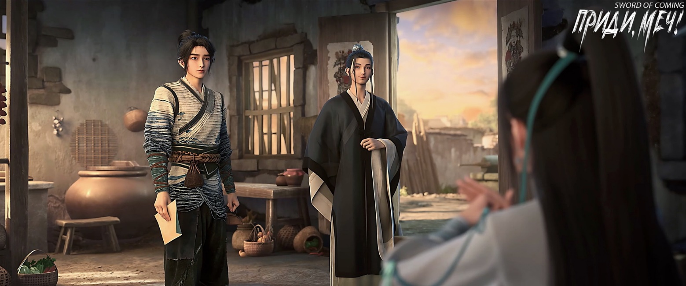
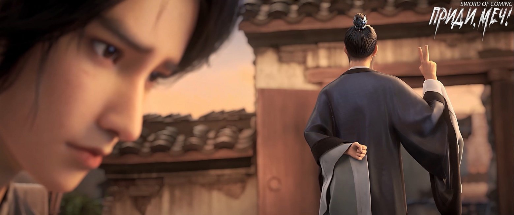

# Глава 16. И не мечтай!

Нин Яо никак не отреагировала, а Лу Чэнь не смог сдержаться и громко рассмеялся.

Внезапно осознав, что атмосфера стала немного неловкой, Лу Чэнь поспешил сменить тему:

— Молодые листья «чешуйчатого» кустарника из пруда Зеленой Воды, о, у нас их называют «весенней ивой», были собраны не вовремя, на семь-восемь дней позже. А этот пакет с травой «летящего дракона», в народе известной как «девичья талия», слишком небрежно измельчен в порошок. И эти «бумажные цветы» — лавка семьи Ян совсем обнаглела, договорились на три ляна, а не хватает целого цяня![1]

[1] П/п.: 3ляна = 113,3г, цянь = 3,74грамма.

Лу Чэнь говорил без умолку, выискивая множество недостатков, и, казалось, ни одна вещь его не устраивала. Создавалось впечатление, будто у него были какие-то личные счеты с аптекой семьи Ян. Однако в конце он сделал неожиданный вывод:

— У хозяина лавки совесть собаки съели, но лекарственных трав на столе достаточно, чтобы сварить отвар и спасти человека. Конечно, это в основном благодаря хорошему здоровью юной госпожи Нин Яо, а к аптеке Янов это имеет отношение разве что на полмедяка.

Лу Чэнь хлопнул себя по лбу, развернул лист белой бумаги и, взяв кисть, начал писать, одновременно наставляя:

— Чуть не забыл, я сейчас напишу тебе еще один рецепт для отвара. Это очень тонкая работа, Чэнь Пинъань, тут нельзя допускать небрежности. Этот рецепт не только лечит раны, но и укрепляет основу, питает жизненную энергию. Это как в военном деле: сначала занять неприступную позицию, а потом вести войну за счет войны — высший путь. К тому же, хорошо то, что состав мягкий, не вредит организму. Разве что потребуется больше времени и придется купить больше лекарственных трав, но это всего лишь вопрос дополнительных расходов. Когда использовать сильный огонь для быстрого кипячения, а когда слабый для медленного — я подробно описал на бумаге. Даже время суток приготовления лекарства имеет значение. В общем, Чэнь Пинъань, в ближайшие десять дней тебе придется потрудиться. Мужчина ведь создан, чтобы нести бремя, иначе откуда бы взялось выражение «мужчина подпирает небо и твердо стоит на земле»? Ни в коем случае не уклоняйся от ответственности, иначе юная госпожа будет смотреть на тебя свысока…

Произнося слова «подпирает небо и твердо стоит на земле», Лу Чэнь едва заметно покачал головой.

Рецепт лекарства занимал всего полстраницы, а инструкции по его приготовлению — целых две. Почерк был обычным мелким уставным, аккуратным и правильным.

Чэнь Пинъань немного встревожился и спросил:

— Неужели даос больше не будет этим заниматься? Разве в таком важном деле, как жизнь и смерть, не будет надежнее, если даос лично проследит?

Лу Чэнь с сожалением ответил:

— Я, бедный даос, сейчас собираюсь покинуть этот маленький городок. В пределах государства Наньцзянь[2] есть школа моей ветви учения, там будет проводиться церемония, и я, бедный даос, хочу пойти и лично это увидеть.

[2] Нань (南) — юг. Цзянь (涧) — горный ручей, овраг. Можно перевести как «Южный горный ручей» или «Южный овраг».

Чэнь Пинъань еще больше расстроился:

— Даос, но я же не умею читать!

Лу Чэнь на мгновение растерялся, потом улыбнулся:

— Ничего страшного, юная госпожа Нин умеет читать. Перед приготовлением лекарства просто спрашивай у нее обо всем, что нужно.

Девушка кивнула. Чэнь Пинъань хотел что-то сказать, но Лу Чэнь вдруг вспомнил об одном деле. Он достал из рукава маленькую изящную печать из зеленого нефрита, слегка подышал на нее и затем сильно прижал к бумаге с рецептом. Подняв печать, он остался доволен результатом. Спрятав печать обратно в рукав, Лу Чэнь передал оба листа Чэнь Пинъаню:

— Хорошо храни их. В городке большинство книг находится в частных коллекциях, тебе будет нелегко их купить. Если действительно хочешь научиться читать, можешь начать с этого рецепта.

Лу Чэнь улыбнулся Нин Яо:

— Лист ряски возвращается в большое море, в жизни мы можем встретиться где угодно. Юная госпожа Нин, тогда до следующей встречи?

Нин Яо серьезно сказала:

— Даос Лу, до следующей встречи! За великую милость не нужно благодарить словами. В будущем, если вам понадобится моя помощь, просто отправьте летающий меч с письмом на Перевернутую гору. Только не забудьте, обязательно подпишитесь «Лу Чэнь», иначе на Перевернутой горе могут не пропустить летящий меч через ворота.

Услышав название «Перевернутая гора», Лу Чэнь явно удивился и хотел что-то сказать, но Нин Яо слегка покачала головой. Он быстро понял ее намек и не стал расспрашивать дальше. Некоторые вещи находящемуся в комнате Чэнь Пинъаню, лучше не знать.

Лу Чэнь первым вышел из комнаты, не забыв взять Чэнь Пинъаня за руку:

— Этот даос хочет напоследок сказать тебе несколько слов.

Чэнь Пинъань сначала положил сверток на кровать, сказав Нин Яо, что это новая одежда.

Затем они вдвоем вышли во двор, где Лу Чэнь сразу тихо спросил:

— С твоей памятью ты, наверное, уже запомнил иероглифы из первого рецепта, к тому же по соседству живет образованный человек. «Неумение читать» — это не настоящая причина, по которой ты пытаешься удержать меня от ухода.

Чэнь Пинъань ответил:

— С вашими способностями, даос, вы наверняка знаете причину.

Лу Чэнь невольно усмехнулся:

— Ты думаешь, что непременно умрешь, и боишься, что некому будет позаботиться о девушке?

Чэнь Пинъань кивнул:

— Раз уж я открыл дверь, то должен нести ответственность до конца.

Лу Чэнь встал рядом с тележкой и, соединив два пальца, незаметно провел ими в воздухе. Длинный меч в белых ножнах, в который конфуцианский ученый Ци Цзинчунь вложил энергию ци двух иероглифов, тихо влетел в комнату. Нин Яо, вероятно, не желая напугать Чэнь Пинъаня, молча согласилась с этим дерзким поступком летающего меча. Лу Чэнь задумался на мгновение. Когда он размышлял над вопросом, то бессознательно протягивал палец и постукивал по заколке с лотосом на голове. Наконец, он сказал:

— Перед тем как прийти сюда, я слышал от одного старшего брата по учению, что в делах нужно руководствоваться разумом, а в отношениях с людьми — человечностью… Раз так, то и я не должен быть слишком строгим и требовательным. Хотя у каждого человека своя судьба, но поскольку основные учения школы, к которой принадлежит этот даос, изначально отличаются от принципов обычных даосских школ… Наша встреча уже предопределена судьбой, и это можно считать благим предзнаменованием. Я могу пойти навстречу обстоятельствам. Тубус для гадальных палочек и сто восемь палочек я не могу тебе подарить, это слишком запутает причинно-следственные связи, которые потом будет трудно распутать или разорвать, что очень проблематично. Что касается той личной печати, она слишком тяжела. Если я подарю ее тебе, то, как только в городке исчезнет защитный барьер, все станет явным при свете дня. Разве это не навредит тебе? Эх, неужели придется дарить немного золотых, серебряных и медных монет? Это было бы слишком небрежно и вульгарно. Этому даосу как-то неловко…

Чэнь Пинъань неожиданно решительно сказал:

— Даос Лу, дарить деньги — это очень продуманно и совсем не вульгарно!

Лу Чэнь с интересом улыбнулся:

— Ты не понял значения двух предыдущих предметов, но наверняка осознал их важность. Почему же ты не попросил их?

Чэнь Пинъань медленно сказал:

— Белая чаша, вмещающая как минимум целый чан воды; даос, способный сжигать бумажные талисманы для предков в загробном мире; странная девушка с тяжелыми ранениями; мешочек с двадцатью восемью медными монетами, сделанными из золота… Раньше только старик Яо говорил, что у нас здесь странно, но теперь я сам это увидел. Если бы я не встретил тех двух приезжих, мужчину и женщину, я бы определенно избегал вас всех и сегодня не открыл бы дверь.

Лу Чэнь, прислонившись к тележке, серьезно сказал:

— Та приезжая женщина коснулась пальцем твоей переносицы. Это низкий прием насильственного открытия энергетических точек человека. В боевых искусствах это называется «указание пальцем». Есть разные уровни мастерства и разные намерения при его использовании. Представь, что ворота твоего двора не очень прочные. А она намеренно ударила по ним железным молотком. Конечно, теперь через ворота можно войти, но при этом она разрушила фундамент. Подумай, что будет в будущем, когда наступят ветра, морозы, дожди и снега? Тот, кто открыл ворота, уже давно смазал пятки жиром и убежал, но что делать тебе, постоянному жителю этого двора?

Чэнь Пинъань немного поколебался:

— Я вполне могу терпеть трудности.

Глядя на Чэнь Пинъаня, который совсем не выглядел так, будто шутит, Лу Чэнь со смехом сказал:

— Это только первый раз, когда она навредила тебе. Если бы у тебя были крепкие мышцы и кости, обильная ци и кровь, тебе было бы нетрудно дожить до тридцати-сорока лет. Но затем она ударила ладонью по твоей груди, и это стало настоящей смертельной раной. Она не только повредила основу твоего тела, но и перекрыла путь к долголетию… Точнее говоря, у тебя оставался тонкий шанс, используя великие перемены этого мира, переворот неба и земли, возможно, ты мог бы продолжить путь совершенствования. Это похоже на бурный поток, в котором плавает множество драконов, рыб и креветок. Удачливые люди, конечно, получают большой улов, но даже самым неудачливым, когда другие ловят драконов и черепах, может повезти поймать хотя бы маленькую рыбку или креветку.

Чэнь Пинъань не выглядел ошеломленным или встревоженным, он спокойно стоял там, без малейших признаков притворного спокойствия.

Лу Чэнь, не выражая ни одобрения, ни осуждения, тихо вздохнул:

— Чэнь Пинъань, в таком юном возрасте равнодушно относиться к жизни и смерти — это не очень хорошо. Ты, наверное, думаешь, что лучше всего остаться в живых, но если действительно нет выхода и небеса не позволяют тебе жить, то умереть так умереть, и ты этого не боишься, верно? Потому что смерть для тебя на самом деле — это шанс на многообещающее воссоединение, не так ли?

Чэнь Пинъань не стал отрицать.

Лу Чэнь внезапно выругался:

— Ты когда-нибудь думал о том, что даже если тебе посчастливится встретиться со своими родителями в безбрежном царстве мертвых, какие чувства они испытают, увидев тебя?

Лу Чэнь говорил все более возмущенно, тыча пальцем в голову Чэнь Пинъаня, словно пытаясь пробудить его тупую черепушку:

— В народных сказаниях и придуманных историях есть Белый Безликий, с высокой белой шапкой на голове. Когда он приходит в мир живых, чтобы забрать души умерших, те могут ясно видеть четыре больших иероглифа на его шапке: «Ты тоже пришел!» Чэнь Пинъань! Я спрашиваю тебя, неужели твои родители, увидев тебя, радостно спросят: «Сын, ты тоже пришел?» Смогут ли они спокойно отправиться на перерождение? Ты действительно думаешь, что в мире много людей, настолько благословенных судьбой, что могут из жизни в жизнь быть детьми или супругами одних и тех же людей? Я тебе прямо скажу — и не мечтай! Даже те главы высших школ, чье слово может изменить горы и реки, не обладают такой способностью, не говоря уже о тебе, Чэнь Пинъане — нищем оборванце, который не уверен даже в завтрашнем дне и трех сытных трапезах!

К концу своей речи Лу Чэнь говорил резко и крайне серьезно.

Чэнь Пинъань растерялся и впал в оцепенение. Это был первый раз в его сознательной жизни, когда он почувствовал такой страх, его руки и ноги похолодели. Он присел на корточки, обхватив голову руками. На этот раз он не стал чесать голову.

Лу Чэнь посмотрел вниз на эту худенькую фигуру:

— Ладно, ладно. Чтобы спасти человека, этот даос задолжал тебе услугу. Я думал, лучше всего было бы не отдавать долг, или оставить часть на следующую жизнь. Но теперь вижу, что нужно вернуть все сразу, и мы будем в расчете. Я расскажу тебе о трех вещах, ты должен хорошенько их запомнить. Первое: когда юной госпоже Нин станет лучше, отведи ее к ручью на юге за пределами городка и найди там отца и дочь по фамилии Жуань. Запомни, ты должен пойти вместе с ней, иначе, даже если ты сам сходишь туда сто раз, это будет бесполезно. Когда придешь туда, даже если придется унижаться и умолять, постарайся стать их подмастерьем или учеником. Будь то рытье колодцев, перенос камней, ковка мечей или работа с железом — в любом случае это будет хорошее место, где можно остановиться. Таким образом, юная госпожа Нин тоже сможет отплатить тебе за твою доброту, и ты не должен чувствовать, что пользуешься чужой добротой. Второе: после пятого дня пятого месяца ты должен часто ходить к ручью под крытым мостом. Можешь собирать камни, ловить рыбу или креветок — как хочешь. Главное — ходи туда часто, особенно когда чувствуешь беспокойство или когда у тебя возникает какое-то предчувствие. Что касается результатов, то с твоей скудной удачей, кто знает… Но, по крайней мере, это будет «усердие компенсирует недостаток способностей». Если даже после этого ты ничего не получишь, тогда, парень, просто смирись со своей судьбой.

Сказав о двух вещах, Лу Чэнь начал толкать тележку. Увидев, что Чэнь Пинъань все еще сидит на корточках, повернувшись к нему лицом, он крикнул:

— Вставай и помоги!

Когда Чэнь Пинъань встал и начал помогать толкать тележку, он с любопытством спросил:

— Разве вы не говорили о трех вещах?

Лу Чэнь холодно фыркнул:

— Я уже сказал тебе — сам догадайся!

Чэнь Пинъань был ошеломлен. Затем Лу Чэнь дал еще несколько наставлений:

— Эти медные монеты довольно ценные, береги их хорошенько.

— В ближайшее время поменьше выходи из дома.

— Почаще улыбайся. Если будешь все время ходить с угрюмым лицом, да еще и не будучи красавцем, парень, на кого ты будешь похож?

Он говорил без умолку.

Лу Чэнь вел себя прямо как старший родственник.

Выкатив тележку со двора, Чэнь Пинъань сказал, что сам вывезет ее из переулка Глиняных Кувшинов. Лу Чэнь не стал возражать.

Идя по узкому переулку один впереди, другой позади, Лу Чэнь напоследок сказал:

— Есть еще одна вещь, которую я все же скажу. Согласно моим расчетам твоей судьбы, ранняя смерть твоих родителей не твоя вина.

Лу Чэнь долго молчал, и только когда тележка уже почти покинула переулок Глиняных Кувшинов, тихо добавил:

— Более того, твоя трудная жизнь в этом мире — это бремя, оставленное тебе твоими родителями.

Чэнь Пинъань промолчал.

В конце концов, Лу Чэнь настоял на том, чтобы Чэнь Пинъань не провожал его, и сам покатил тележку в сторону восточных ворот.

Оглянувшись, он увидел, что Чэнь Пинъань все еще стоит у входа в переулок и изо всех сил машет ему рукой, сияя улыбкой, совсем не похожий на человека, обреченного на смерть.