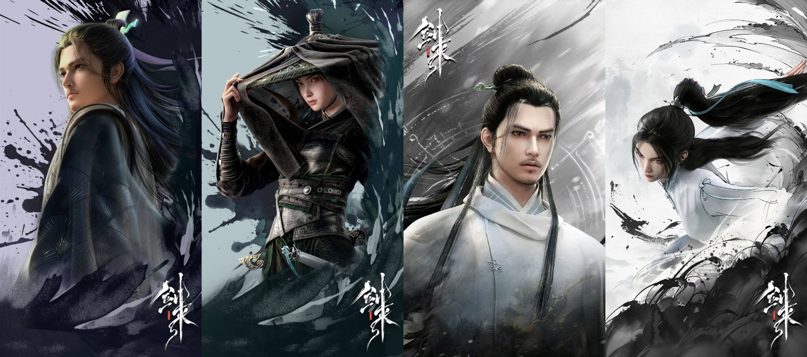
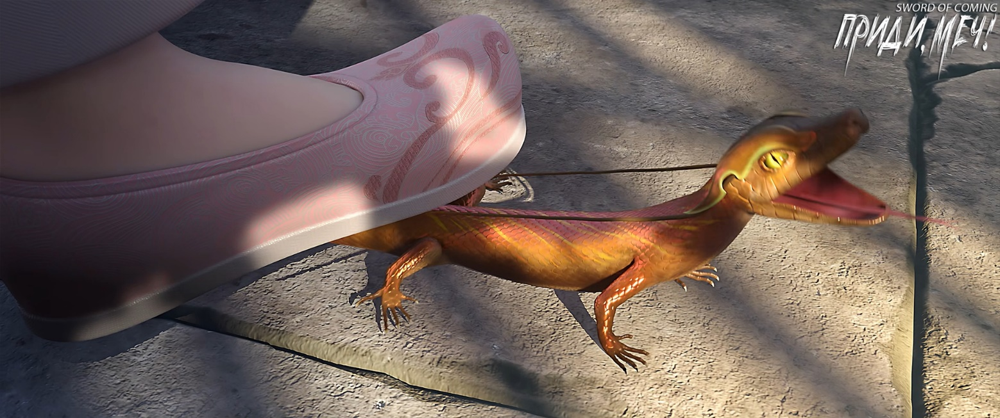
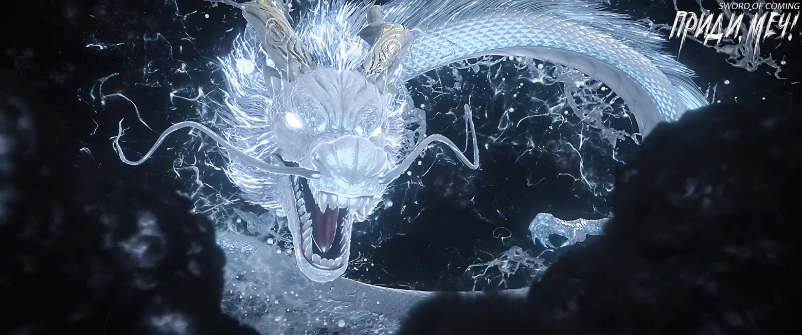
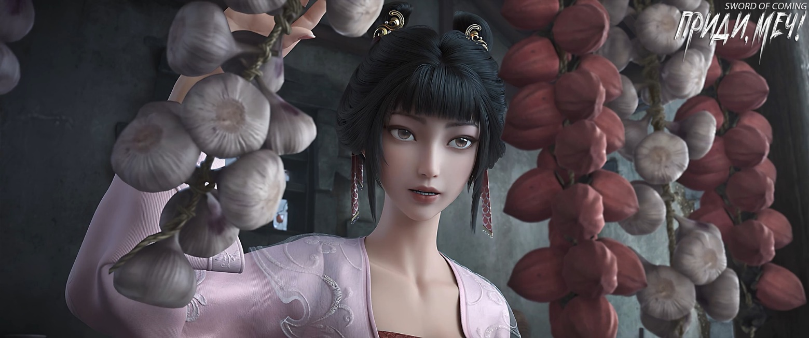

# Глава 18. Три из пяти

Когда Фу Наньхуа вышел из дома, он обнаружил, что та чистая и изящная служанка сидела на маленькой скамеечке во дворе. В руках она держала початок кукурузы и кормила кур. Старая наседка вместе с выводком пушистых желтых цыплят клевали корм, опустив головы.

Увидев ее, Фу Наньхуа слегка улыбнулся. Девушка, то ли от застенчивости, то ли от природной холодности, лишь слегка дернула уголком рта, что можно было считать ответным приветствием.

Открыв ворота двора, Фу Наньхуа обнаружил, что Цай Цзиньцзянь ждала его в переулке, явно не в восторге. Он повернулся, чтобы закрыть дверь, и сквозь сужающуюся щель увидел лицо, поднявшее взгляд в его сторону. Фу Наньхуа внезапно заметил, что у этой служанки, которая должна быть простой бедной девушкой, довольно необычные глаза, похожие на нежную зелень, распускающуюся ранней весной. Однако Фу Наньхуа не стал долго об этом размышлять. Красивые женщины, полные и стройные, грациозные и изящные, для него, младшего господина Старого Города Дракона, уже давно стали привычным зрелищем.

Идя бок о бок с Цай Цзиньцзянь, Фу Наньхуа спросил:

— Что случилось? Не получилось? Когда дело касается возможностей всегда бывают трудности, не всегда можно решить все с первого раза. Не стоит падать духом.

Цай Цзиньцзянь от природы обладала нежной и очаровательной внешностью. После совершенствования ее тело стало чистым, как хрусталь, что, конечно же, выделяло ее среди обычных женщин. На первый взгляд, женщины у подножия горы могли показаться ошеломляюще красивыми, но в конце концов, они были всего лишь бренной плотью.

Сейчас выражение лица небожительницы с горы Облачной Зари было не очень хорошим, что явно свидетельствовало о ее скверном настроении. В противном случае, она бы не выставляла это так явно напоказ. Видимо, ожидая в переулке, она уже накопила немало раздражения и теперь не могла не высказаться:

— Один высокопоставленный человек опередил нас. Это один из местных змеев озера Бамбукового Свитка, Истинный Господин, Рассекающий Реку Лю Чжимао[1]. Он не оставил никакой возможности для переговоров. При встрече он сразу же использовал авторитет моего учителя-патриарха с горы Облачной Зари, чтобы надавить на меня, младшее поколение. От начала до конца я сказала всего несколько фраз, прежде чем он выгнал меня со двора Гу Цаня.

[1] Лю Чжимао (刘志茂). Имя может интерпретироваться как «стремящийся к процветанию» или «пышные амбиции/стремления».

Фу Наньхуа задумчиво заметил:

— Давай поговорим об этом, когда выйдем из переулка Глиняных Кувшинов.

Цай Цзиньцзянь с недоумением спросила:

— Разве здесь не запрещено использование любой магии?

Фу Наньхуа улыбнулся:

— Кто из тех, кто пришел сюда в поисках возможностей, не имеет в запасе каких-то особых навыков? Возможно, молодым людям вроде нас это не так уж и важно. Согласно правилам городка, чем выше уровень совершенствования, тем сильнее подавляющая сила. Ниже уровня мудреца, чем ближе уровень совершенствования к уровню мудреца, тем слабее человек должен быть, как ребенок, верно? Но задумывалась ли ты о том, что если просветленный даос решит применить свои божественные способности, даже ценой ущерба своему совершенствованию, неужели он действительно будет слабее нас, молодого поколения?

Цай Цзиньцзянь возразила:

— Здесь же мудрец, посмеет ли этот Истинный Господин, Рассекающий Реку, открыто напасть на меня?

Фу Наньхуа убеждал:

— Мы пришли сюда искать благие возможности, а не создавать вражду. Даже если нет угрозы жизни, испортить отношения со старшими все равно нехорошо.

Цай Цзиньцзянь не была человеком, который упрямо стоит на своем. Она кивнула:

— Брат Фу говорит верно, это зрелое и разумное суждение.

Она печально сказала, выглядя трогательно и жалко:

— Но я действительно не могу смириться. Я уже отдала тебе десять камней Корня Облаков. Если все окажется напрасным, как я объяснюсь перед патриархами по возвращении?

После выхода из переулка Глиняных Кувшинов, Фу Наньхуа и Цай Цзиньцзянь почти одновременно воспрянули духом и почувствовали облегчение. Это было не просто из-за внезапно усилившегося освещения. Они посмотрели друг на друга, а затем быстро отвели взгляды.

Изначально очень взволнованный и возбужденный Фу Наньхуа тоже значительно успокоился. Он тщательно обдумал эту прогулку по переулку и союз с Цай Цзиньцзянь. Он был уверен, что не допустил никаких оплошностей. Сделка с юным Сун Цзисинем также прошла без сучка без задоринки. Это была справедливая сделка, соответствующая правилам. Неужели мудрец, наблюдающий за приходом и уходом ветров, приливом и отливом вод в этом месте, стал бы вмешиваться? Тогда откуда это давление? Неужели от того Истинного Господина, Рассекающего Реку, о котором он даже не слышал?

По сравнению с глубокими размышлениями Фу Наньхуа, мысли Цай Цзиньцзянь были проще. Она подумала, что Фу Наньхуа оказался прав, и Истинный Господин, Рассекающий Реку, действительно использовал какое-то божественное искусство, чтобы следить за ней. Она испытала запоздалый страх, радуясь, что только выразила свое недовольство, не сказав ничего резкого или гневного.

Двое, погруженные в свои мысли, шли по улице. Чем дальше они удалялись от переулка Глиняных Кувшинов, тем легче становилось у них на душе. Фу Наньхуа считал, что это было бремя возможностей и судьбы, а Цай Цзиньцзянь ощущала это как груз семейных обязательств.

Подняв голову и глядя на далекую мемориальную арку, Фу Наньхуа с любопытством спросил:

— Истинный Господин, Рассекающий Реку, с озера Бамбукового Свитка? Почему у меня совсем нет о нем воспоминаний? Хотя мой Старый Город Дракона и находится на крайнем юге континента, но титул Истинного Господина настолько знаменит, что даже я, при всем своем невежестве, должен о нем знать.

Цай Цзиньцзянь, понизив голос, холодно усмехнулась:

— Какой там Истинный Господин, он всего лишь Великий Истинный Мастер из неортодоксальной школы, занимающий довольно высокое положение. Он очень лицемерный и совершенно не достоин называться Истинным Господином. Это всего лишь лесть от людей, желающих ему угодить. Подумай, насколько проницателен император Юаньу[2]. Естественно, он не стал бы жаловать этому человеку титул Истинного Господина. Каждому свое место. Если отдать титул Истинного Господина, то, возможно, его не удастся вернуть в течение двухсот лет. К тому же, учитывая щедрость предков императора Юаньу, к его правлению осталось всего два свободных титула Истинного Господина. Он определенно не стал бы небрежно отдавать его какому-то самозванцу из неортодоксальной школы, который ищет славы и признания.

[2] Император Юаньу (元武帝). Имя можно перевести как «Первый Воинственный Император».

Фу Наньхуа понимающе кивнул:

— Вот оно что.

Каждый Истинный Господин, занимающий пост в династии, мог собирать, сдерживать и увеличивать удачу государства для монарха.

Положение Истинного Господина в даосизме можно считать вершиной для последователей даосских школ в светской династии, наряду с высшим генералом в военном деле и великим ученым в конфуцианстве.

Цай Цзиньцзянь как бы невзначай спросила:

— А что насчет того Сун Цзисиня?

Фу Наньхуа небрежно ответил:

— Этот юноша? Амбициозный, от природы умный, с неплохой поддержкой, только вот кругозор…

Цай Цзиньцзянь усмехнулась:

— Узкий?

Фу Наньхуа рассмеялся:

— Нельзя сказать, что узкий, просто недостаточно широкий.

Когда они подошли к мемориальной арке, Фу Наньхуа с воодушевлением пробормотал:

— Когда приходит время, небеса и земля объединяют свои силы.

Цай Цзиньцзянь, подняв голову и глядя на четыре иероглифа «Не ищи вовне», почувствовала пустоту в сердце и растерянность, словно озарение, полученное ранее в переулке Глиняных Кувшинов, было полностью возвращено этому городку. Это вызвало у нее необычайное раздражение.

※※※※

Дом Сун Цзисиня считался большим поместьем в переулке Глиняных Кувшинов. Помимо главного зала с висящей над ним табличкой, были также восточное и западное крыло.

Табличка в главном зале гласила «Зал мыслей о далеком», без подписи. Сун Цзисинь всегда чувствовал, что судя по почерку, это не была работа какого-то великого мастера.

Сейчас хозяин и слуга находились в главной комнате Сун Цзисиня. Он рылся в ящиках и шкафах, а Чжигуй стояла в дверях и мягко спросила:

— Молодой господин, сделка не удалась?

Сун Цзисинь положил связку колокольчиков и сел на единственный стул в комнате, заложив руки за голову и закинув ногу на ногу:

— Этот Фу Наньхуа из Старого Города Дракона не совсем дурак. С самого начала он не считал меня простаком, не знающим жизни. Просто он не настолько умен, раз думал, что сможет подружиться со мной. Забавно. Позже, когда я немного обманул его, он показал свой лисий хвост. Думал, что сможет запугать меня, используя таинственность и грозные методы, сочетая милость и угрозы. По сравнению с непостижимым учителем Ци, он отстает на десятки тысяч ли.

Чжигуй сказала:

— Десятки тысяч ли. Молодой господин, ты слишком преувеличиваешь.

Сун Цзисинь скорчил гримасу и ответил:

— Тогда он отстает на десять переулков Глиняных Кувшинов!

Сун Цзисинь бросил служанке мешочек:

— Смотри, это те самые медные монеты, о которых говорилось в тайном письме. Раньше сосед по фамилии Чэнь тоже получил такой мешочек. Я тогда подумал, что такая огромная удача, свалившаяся ему на голову, вряд ли обернется чем-то хорошим. И правда, разве это не разозлило ту парочку? Я думаю, что Чэню еще предстоит хлебнуть горя. Да, Чжигуй, я тебе скажу, тот, кто приходил к нам, назвался младшим господином Старого Города Дракона. Судя по его тону и манерам, он, по крайней мере, не просто красивая подушка для дивана. А еще эта нефритовая подвеска, которую он назвал «Старый Дракон Проливает Дождь», она определенно дорогая!

Сун Цзисинь похлопал по нефритовой подвеске приятного зеленого цвета, которую уже повесил себе на пояс. В глубине души Сун Цзисинь чувствовал, что сделал еще один большой шаг к тому, чтобы стать таким же ученым человеком, как учитель Ци.

Чжигуй открыла изящный вышитый мешочек и тихо спросила:

— Молодой господин, можно ли заработать побольше таких «медных монет»?

Сун Цзисинь с улыбкой спросил:

— Тебе нравятся?

Чжигуй взяла двумя пальцами золотистую медную монету, покачала ее и радостно сказала:

— Такие блестящие, выглядят очень празднично.

Сун Цзисинь рассмеялся:

— И это тебе нравится? Ладно, раз тебе нравится, я добуду еще несколько мешочков. Эти монеты снаружи называются по-разному: монеты для подавления зла, которые кладут на балки, монеты приветствия весны на персиковых табличках, монеты для подношения, которые кладут на живот или в руки статуй Будды. Однако у простых людей свои обычаи, а у бессмертных — свои представления.

Глаза Чжигуй сузились в улыбке, став похожими на два полумесяца, и она спросила:

— А мешочек Чэнь Пинъаня?

Сун Цзисинь нахмурился:

— Его?

Почувствовав необычные эмоции своего молодого господина, Чжигуй осторожно убрала медные монеты, затянула мешочек и тихо спросила:

— Что случилось?

Сун Цзисинь скривил губы, обхватил руками шею, покрутил ею и небрежно сказал:

— Ничего, просто вспомнил кое-какие неприятные вещи. Что касается господина Чэня, не стоит торопиться, чтобы не навлечь на себя неприятности. Его легко обмануть, я обязательно добуду для тебя мешочек.

Увидев некоторое недоумение Чжигуй, Сун Цзисинь не стал продолжать объяснения. Заметив, что у господина нет настроения разговаривать, Чжигуй не стала докапываться до сути.

Чжигуй вышла из комнаты во двор и увидела ту раздражающую четвероногую змею, которая полуживая лежала на земле, грелась на солнце и время от времени переворачивалась, выглядя очень довольной. Разозлившись, она быстро подошла и наступила ногой ей на голову, яростно вращая носком. Бедное маленькое существо жалобно закричало.

Чжигуй подняла ногу, и четвероногая змея стрелой рванула прочь, носясь по двору и постоянно врезаясь в стены.

Эта грязно-желтая четвероногая змея из их дома.

Золотой карп, по ошибке заплывший в рыбацкую корзину из-за своей прожорливости.

Черный вьюн, которого Гу Цань держал в бочке с водой.

Металл, дерево, вода, огонь, земля — три из пяти элементов уже есть.

Глядя на четвероногую змею с рогом на голове, Чжигуй ухмыльнулась с презрением:

— Глупое создание!

※※※※

Во дворе дома Гу Цаня Истинный Господин, Рассекающий Реку, Лю Чжимао и госпожа Гу по-прежнему сидели друг напротив друга. Он протянул руку, наблюдая за тем, как распространяются линии на его ладони, и почувствовал себя неспокойно.

Он убрал руку и, подняв голову, спросил:

— Госпожа Гу, много ли в городке женщин, подобных вам, вышедших замуж за мужчин из других мест?

Госпожа Гу покачала головой:

— Наверное, немного. По крайней мере, здесь, в переулке Глиняных Кувшинов и переулке Цветущих Абрикосов, я одна такая.

Лю Чжимао немного поколебался, но все же раскрыл ей некоторые небесные тайны:

— Шесть и двенадцать лет для девочек, девять и восемнадцать лет для мальчиков — это два больших порога. Первый нужно перешагнуть самостоятельно, а второй можно преодолеть с помощью внешней силы. После этого есть еще одна вещь, которая может дать больше уверенности. Чем богаче и знатнее семья, тем больше преимуществ. Открыть дверь, войти в зал и войти в комнату — три этапа. Первые два шага действительно зависят только от удачи и судьбы, особенно первый шаг. Успех или неудача зависят только от того, захочет ли Небо дать шанс.

Глаза госпожи Гу наполнились радостью:

— Если бессмертный мастер обратил на него внимание, значит ли это, что мой Гу Цань способен самостоятельно сделать первый шаг?

Лю Чжимао с загадочной улыбкой ответил:

— Любой ребенок, выросший в этом городке, на самом деле не обладает выдающимися врожденными качествами и талантами. Хотя вашему Гу Цаню еще нет девяти лет, он не исключение.

Лицо госпожи Гу мгновенно помрачнело.

Лю Чжимао поднял ногу, топнул по земле и улыбнулся:

— Не беспокойтесь, хорошие или плохие врожденные качества, конечно, важны, но не являются решающими. Если Небеса благоволят, даже собака у обочины или сорняк могут постепенно совершенствоваться, следуя великому Дао, и в конце концов вознестись в облака. В этот раз городок в виде исключения позволил войти стольким чужакам, потому что у него не было выбора. Даже самая плодородная земля после тысячелетий возделывания, обработки и сбора урожая, а также нескольких периодов безжалостной эксплуатации, придет в упадок и в конце концов станет полностью бесплодной. Фэншуй и скрытые ресурсы этого места наконец достигли своего последнего великого года. Когда человек находится на пороге смерти, происходит последняя вспышка жизненных сил, и в этот момент его дух становится особенно сильным. Ваш Гу Цань как раз пользуется этим преимуществом. Его возможности настолько велики, что превосходят все ожидания и далеко превосходят тех одаренных детей городка, которые были раньше.

Губы госпожи Гу задрожали, она изо всех сил пыталась сдержать свою радость, а глаза наполнились слезами, излучая несколько соблазнительное очарование.

Лю Чжимао бросил на нее взгляд и усмехнулся:

— Конечно, не будьте слишком жадной. Такую великую возможность получил не только ваш сын. Грубо говоря, на всем огромном Восточном континенте Водолея, даже если и есть человек, достойный единолично обладать этой удачей, он, вероятно, еще не родился.

Госпожа Гу прижала руки к груди и прошептала:

— Этого достаточно, достаточно.

Лю Чжимао, вспомнив о молодой женщине с горы Облачной Зари, насмешливо сказал:

— Суетятся, выбиваются из сил, гоняясь лишь за внешними вещами. Поистине, теряют арбуз, подбирая кунжут. Невероятная глупость.

Затем Лю Чжимао усмехнулся:

— Впрочем, это неудивительно. Эти старые пни с Облачной Зари никогда не отличались широтой взглядов. Иначе они не позволили бы мне, старику, получить это преимущество. Имея гору сокровищ, которая практически неисчерпаема, они должны были бы купаться в богатстве и процветать с каждым днем, а вместо этого опустились до того, что им приходится полагаться на какого-то ученика, чтобы поддерживать свою репутацию.

В комнате Гу Цань, долго колотивший кулаками и ногами в дверь, стоял на скамейке, прильнув к окну, и с несчастным видом умолял:

— Матушка, пожалуйста, выпусти меня, я обещаю слушаться!

Госпожа Гу взглянула на старого бессмертного мастера Лю Чжимао, и тот кивнул. Только тогда она открыла дверь и, взяв Гу Цаня за руку, вывела его во двор. С суровым лицом она тихо сказала:

— Сяо Цань[3], не смей шалить, понял? Матушка никогда не била тебя, но если ты осмелишься не послушаться, матушка действительно побьет тебя один раз. Гу Цань издал звук «о», повесил голову и выглядел вялым и больным.

[3] Префикс 小(сяо) является одним из вариантов образования ласковых имен. Типа «Саша-Сашенька». Часто используется как ласковое прозвище. Обращение возможно и между взрослыми в неформальном общении (например, среди друзей или коллег одного возраста).

Гу Цань принес маленькую скамеечку и сел сам по себе, образовав с матерью и Лю Чжимао треугольник. Он подпер щеки руками:

— Мама, о чем вы на самом деле говорили со сказителем только что? Я не мог расслышать в комнате. Расскажите мне еще раз.

Лю Чжимао удивленно воскликнул, немного подумал, затем взмахнул запястьем, и большая белая чаша снова появилась на его ладони. Он опустил голову и сосредоточенно посмотрел на нее, его глаза были темными и непроницаемыми. На поверхности воды в белой чаше появилась рябь, иногда всплескивали капли, черная линия быстро металась в белой чаше, время от времени ударяясь о ее стенки. Он пробормотал себе под нос:

— Ладно, ладно, пусть будет по-твоему.

Чтобы заполучить этого ученика, ранее в переулке Глиняных Кувшинов Лю Чжимао приложил все усилия и рискнул потерять десятки лет совершенствования, чтобы успешно вмешаться трижды. Первый раз он заставил Цай Цзиньцзянь наступить в собачьи экскременты. Последний раз он использовал тайное искусство, чтобы заставить ее поверить в свое просветление. Конечно, за пределами городка это было бы абсолютно невозможно. Даже настоящий даосский Истинный Господин не осмелился бы сделать такое. Но в городке Цай Цзиньцзянь была не более чем обычным человеком, поэтому у старика появилась возможность воспользоваться ситуацией, несмотря на огромную цену, которую ему пришлось заплатить. Второй раз был наиболее искусным, даже он сам считал это гениальным ходом — он заставил Цай Цзиньцзянь ошибочно принять доброе предупреждение Чэнь Пинъаня за хитрую месть. Он замедлил речь Чэнь Пинъаня и позволил Цай Цзиньцзянь заметить эту деталь. Это было тщательно продумано.

На пути совершенствования соратники балансируют на тонкой грани между добрыми связями и кармическими узами.

В этот момент сердце госпожи Гу, находившейся во дворе, заколотилось. Она боялась, что старый бессмертный мастер Лю Чжимао сообщит какие-то плохие новости.

Лю Чжимао дернул уголком рта. Краем глаза он заметил, как ребенок осторожно встал и бросился бежать к воротам двора. Госпожа Гу закричала.

Лю Чжимао, держа в руках белую чашу, неторопливо встал:

— Ученик, позволь учителю сначала показать тебе, насколько велики Небо и Земля, чтобы ты не пренебрегал последствиями и не разрушил наше великое дело, рассчитанное на тысячи лет!

У госпожи Гу потемнело в глазах, она потеряла сознание и упала на землю.

Лю Чжимао резко взмахнул рукавом. В следующий момент Гу Цань, только собиравшийся коснуться засова ворот, споткнулся и упал. Когда он понял, что что-то не так, он растерянно огляделся и, подняв голову, увидел стоящего рядом с ним сказителя:

— Где это мы?

Лю Чжимао, заложив руки за спину, спокойно ответил:

— Внутри чаши.

Гу Цань еще больше растерялся, но вдруг услышал громкий окрик Лю Чжимао:

— Встань!

Гу Цань инстинктивно встал, замер, и обнаружил, что стоит на краю обрыва, а прямо перед ним вдалеке простирается бескрайнее море облаков.

Затем его глаза расширились от ужаса, когда он увидел, как в белой дымке огромное тело прорывается сквозь облака и медленно движется. Но оно было настолько огромным, что невозможно разглядеть его полностью.

Гу Цань испугался и собирался отступить на шаг, но Лю Чжимао быстро положил руку ему на голову и сурово сказал:

— Если сейчас отступишь, то в будущем на пути совершенствования не сможешь сделать ни шагу! Стой твердо!

Гу Цань так испугался, что слезы сразу потекли из глаз. Этот обычно непослушный и своевольный ребенок даже плакать не смел вслух. Он совершенно не мог контролировать свое тело, его ноги дрожали, губы тряслись.

Вдалеке море облаков начало бурлить. Туманные белые облака, казалось, постепенно рассеивались.

Затем в небе появилось больше черноты, чрезвычайно длинной и огромной, как… маленький черный вьюн, которого он держал в чане для воды дома, после того как тот вырос до огромных размеров.

Эта мысль неожиданно возникла в голове Гу Цаня.

В тот момент Гу Цань был ошеломлен и невольно шагнул вперед, протягивая тонкие руки к небу. Огромная голова размером с горную вершину медленно выплыла из моря облаков.

Глаза Гу Цаня сверкали, он совершенно не боялся и даже помахал рукой, крикнув:

— Скорее иди сюда! Так вот насколько большим ты стал. Неудивительно, что я всегда замечал, как на следующий день в чане с водой пропадало много рыбы, креветок и крабов, которых я туда бросал.

Стоявший позади Гу Цаня Лю Чжимао с озера Бамбукового Свитка испытывал смешанные чувства: глубокое разочарование и зависть, но также и невольное удовлетворение.

Хотя он сам, несомненно, уже не мог иметь такой великой удачи, но обрести такого ученика было счастьем, и это путешествие определенно не было напрасным!

Лю Чжимао, своими глазами наблюдая приближение головы, прошептал:

— Чудо света.

※※※※

Чэнь Пинъань вдруг сказал Нин Яо, что ему нужно ненадолго зайти в дом. В итоге он присел в углу, спиной к ней, и спрятал что-то в ладони.

Выйдя из дома, он сообщил, что пойдет купить для нее глиняный горшок для отвара лекарств, которого не хватало в доме.

После того как он быстро ушел, Нин Яо бросила взгляд в темный угол, где стоял старый горшок.

На самом деле у нее был очень хороший слух. Предметом в ладони Чэнь Пинъаня был чрезвычайно острый осколок фарфора.