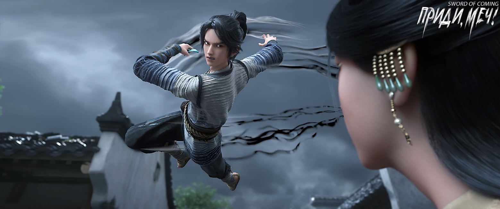
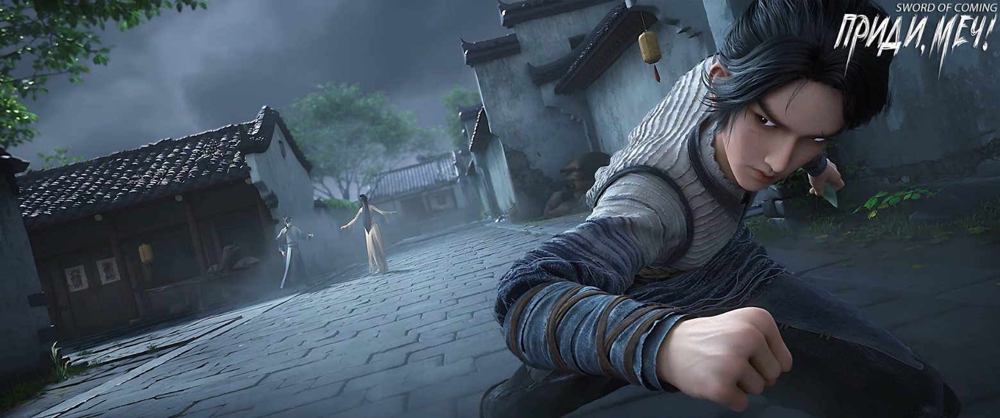

# Глава 20. Неожиданные осложнения

П/п.: Название главы «横生枝节» — это идиоматическое выражение, которое буквально можно перевести как «горизонтально растущие ветви и узлы». В переносном смысле оно означает «возникновение неожиданных проблем или осложнений», «появление непредвиденных трудностей». Это выражение часто используется для описания ситуаций, когда в, казалось бы, простом деле вдруг возникают неожиданные препятствия или сложности.

※※※※

Фу Наньхуа, видя, что настроение Цай Цзиньцзянь немного упало, повел ее прогуляться. Они шли бок о бок, просто чтобы развеяться, иногда обсуждая удивительные истории о южной части Восточного континента Водолея. Цай Цзиньцзянь все еще немного натянуто улыбалась, но по сравнению с раздражением, которое она испытывала после ухода из переулка Глиняных Кувшинов, ее настроение действительно улучшилось.

Ее впечатление об этом молодом господине Фу Наньхуа постепенно улучшалось. Хотя Старый Город Дракона славился глубокими традициями и выдающимися талантами, находясь всего в шаге от лучших школ, и теоретически превосходил гору Облачной Зари, которая находилась в нижней части второго эшелона. Однако такие ортодоксальные школы бессмертных, как гора Облачной Зари, с упорядоченной преемственностью и правильным происхождением, имели врожденное чувство превосходства над южными «варварами» вроде Старого Города Дракона. Раньше они бы, в лучшем случае, лишь не называли их вслух «южными варварами», и это считалось бы хорошими манерами.

Цай Цзиньцзянь горько сказала:

— Брат Фу, хотя камень Корня Облаков — это жизненная основа нашей горы, но раз уж мы договорились заранее, я не буду отказываться от своих обязательств. Даже если придется разориться, я верну долг брату Фу.

Фу Наньхуа утешил ее:

— Пока еще рано говорить, является ли возможность семьи Гу Цаня решенным делом.

Лицо Цай Цзиньцзянь помрачнело, и она покачала головой:

— Рассекающий Реку Истинный Господин, Лю Чжимао, хоть и имеет дурную славу, но его методы не слабы, иначе он не смог бы занять место на озере Бамбукового Свитка. Эту возможность уже не получить силой. Если разозлить Лю Чжимао, как я смогу противостоять влиянию Великого Истинного Человека из боковой ветви? Боюсь, что Лю Чжимао уже затаил на меня обиду, и как только мы покинем городок, без присмотра мудреца и ограничивающих правил, кто знает, на какие крайние меры он может пойти. Полагаю, брат Фу, вы тоже заметили некоторые признаки на границе. Сопровождающие, которых школа отправила со мной на поиски сокровищ, недостаточно сильны и совсем не ровня ему.

Фу Наньхуа улыбнулся:

— Не беспокойтесь, хотя бы ради тех десяти камней Корня Облаков, наш Старый Город Дракона обеспечит вам безопасное возвращение на гору Облачной Зари.

Цай Цзиньцзянь повернулась к нему с очаровательной улыбкой, ее осенние глаза были полны нежности.

Фу Наньхуа был весьма доволен собой и по привычке хотел погладить нефритовую подвеску, но нащупал пустоту. Только тогда он вспомнил, что уже отдал свою подвеску «Старый Дракон Проливает Дождь» юноше по имени Сун Цзисинь.

Цай Цзиньцзянь вздохнула с облегчением. Во время ходьбы она слегка наклонилась влево, так что ее плечо легко коснулось плеча Фу Наньхуа.

Во время визита в переулок Глиняных Кувшинов Цай Цзиньцзянь сделала незапланированную ставку. Это было спонтанное решение, но она тщательно взвесила его. Однако факты доказали, что она проиграла пари, и ценой стали десять бесценных камней Корня Облаков. Это наполнило ее тревогой относительно дальнейшего пребывания в городке и незаметно породило чувство зависимости от Фу Наньхуа. Или, можно сказать, у нее появился азарт игрока: если десять камней Корня Облаков — это ставка, разве пятьдесят не то же самое? Выиграешь — получишь огромную прибыль, проиграешь… Цай Цзиньцзянь была уверена, что не проиграет, абсолютно нет. В конце концов, она же Цай Цзиньцзянь, номер один по таланту к совершенствованию на горе Облачной Зари! На пути совершенствования все шло гладко, и ее уровень культивации рос, как по маслу. Цай Цзиньцзянь не верила, что потерпит неудачу в этой «сточной канаве».

Пока настроение Цай Цзиньцзянь улучшалось, Фу Наньхуа, чувствуя, что исход дела уже предрешен, позволил себе по-настоящему оценить красоту и фигуру бессмертной Цай. Нельзя отрицать, что она была прирожденной обольстительницей. Если бы удалось стать парой на пути Дао с такой женщиной, и проводить с ней дни и ночи, то можно постепенно достичь блаженства как в совершенствовании, так и в постели.

Цай Цзиньцзянь однажды была лично провозглашена уважаемым старейшиной как «ветер с горы Корня Облаков, обладающий небесной грацией», подразумевая, что она была исключительно редкой кандидатурой на роль спутницы на пути Дао. Патриархи горы Облачной Зари, привыкшие жить за счет горы и вести дела, в последние годы не жалели средств на воспитание Цай Цзиньцзянь, и у них были свои корыстные мотивы, чтобы продать ее подороже. Союз бессмертных семей был гораздо более серьезным делом, чем браки между знатными семьями в мирских империях, и рассматривался с более долгосрочной перспективой.

Однако у Фу Наньхуа не было особой симпатии к горе Облачной Зари. Возлагать судьбу целой школына плечи одной женщины казалось ему неразумным, и это было одной из причин его нелицеприятного мнения о горе Облачной Зари.

Фу Наньхуа предупредил:

— Если вдруг юноша, живущий по соседству с Сун Цзисинем, окажется избранником какой-то внешней силы и все еще хранит ту фарфоровую вещь с истинным именем, то твое вмешательство может навлечь неприятности. Легко будет проследить связь и найти гору Облачной Зари и тебя. Более того, Сун Цзисинь с его служанкой и Лю Чжимао тоже могут заметить это дело.

Цай Цзиньцзянь улыбнулась:

— Брат Фу, возможно, вы сосредоточены на поисках возможностей и не обратили внимания на некоторые неписаные правила этого места. Если местный мальчик к девяти годам не был выбран ждавшим почти десять лет «покупателем фарфора», и не покинул городок, это означает, что его врожденная основа недостаточно хороша, и он уже не представляет большой ценности. Чем старше он становится, тем дешевле. Для школ и кланов гораздо выгоднее вложить значительные средства в воспитание нескольких личных учеников, чем платить огромную сумму за «усыновление» и быть обманутыми.

Как только Цай Цзиньцзянь упомянула юношу в соломенных сандалиях, она выразила полное отвращение:

— Простолюдины должны знать свое место!

Фу Наньхуа, тщательно подбирая слова, попытался убедить ее:

— Это правда, но тот юноша неопытен и не знает о благородстве бессмертной госпожи Цай с горы Облачной Зари. Даже если он как-то оскорбил тебя, одного урока было бы достаточно. Зачем наказывать его дважды?

Фу Наньхуа чувствовал, что резкие действия Цай Цзиньцзянь были ненормальными и наверняка скрывали какую-то тайну, возможно, связанную с возможностью. Поэтому он надеялся выудить из нее какую-нибудь информацию, чтобы посмотреть, сможет ли он найти какие-нибудь подсказки. Он не хотел, чтобы получилось так, что пока богомол ловил цикаду, позади него притаился чиж. Он считал Цай Цзиньцзянь цикадой, но на самом деле она могла оказаться чижом.

Старый Город Дракона, пройдя через множество трудностей и предложив цену, намного превышающую предложения горы Истинного Ян и горы Облачной Зари, получил лишь обрывки тайных сведений. Именно из этих фрагментов Фу Наньхуа узнал, что за три тысячи лет существования городка после той душераздирающей и жестокой битвы, так называемые «возможности», на самом деле всегда были лишь духовными сокровищами и артефактами, оставленными здесь предками-патриархами, за исключением группы выдающихся детей из городка. Но когда это благословенное место оказалось на грани полного разрушения, все стало не так просто.

В конце правления династии, когда страна разваливается, обязательно появляются божественное оружие и могущественные артефакты, чтобы приветствовать новую династию и новую эпоху.

Цай Цзиньцзянь была немного подавлена:

— Не упоминай о нем. Думать о нем тошно.

Затем в ее осенних глазах мелькнул редкий след жестокости. Однако, не желая портить свой образ бессмертной девы в глазах Фу Наньхуа, она не высказала вслух свои мысли.

Если в будущем она встретит этого ничтожество за пределами городка, она обязательно предоставит ему быструю смерть, а не просто оставит его влачить жалкое существование в больном теле еще десять или двадцать лет.

Цай Цзиньцзянь особенно ненавидела глаза этого юноши. В глубине души у нее была навязчивая идея, о которой она никогда глубоко не задумывалась. За все годы совершенствования на горе Облачной Зари, славящейся своей «незапятнанной чистотой», такой чистый взгляд она видела всего несколько раз. Какое право имел этот бедный юноша из убогого переулка, изо дня в день, из года в год обладать такой красотой?

Цай Цзиньцзянь наклонила голову и потерла веко, этот жест сделал ее тонкие брови, подобные далеким горам, еще более изящными.

Фу Наньхуа, который все время осматривал окрестности, небрежно пошутил:

— В переулках нашего Старого Города Дракона есть широко распространенная поговорка: если дергается левый глаз — к деньгам, если правый — к беде. У тебя левый глаз дергается или правый?

Цай Цзиньцзянь, словно обжегшись, быстро убрала руку и бросила на него сердитый взгляд. Очевидно, у нее в тот момент дергалось правое веко.

Фу Наньхуа, попавший впросак, поспешил исправить ситуацию и с улыбкой сказал:

— Это просто глупые суеверия простолюдинов, не стоит им верить.

Цай Цзиньцзянь приподняла уголки губ, повернулась и, пристально глядя на профиль Фу Наньхуа, самодовольно произнесла:

— Попался, да?

Фу Наньхуа на мгновение растерялся. Глядя на кокетливо-наивное поведение Цай Цзиньцзянь, он почувствовал необъяснимое влечение.

Фу Наньхуа вдруг засомневался, его решимость убить Цай Цзиньцзянь пошатнулась. Он задумался, не будет ли более выгодным для планов Старого Города Дракона по продвижению на север, если они станут прекрасной божественной парой? Если Цай Цзиньцзянь успешно получит здесь возможность, то по возвращении в свою школу ее положение и влияние неизбежно возрастут. При правильном подходе у нее даже может появиться шанс стать хозяйкой горы Облачной Зари. В древней родословной горы Облачной Зари были прецеденты, когда женщины становились во главе. Таким образом, Старый Город Дракона получил бы плацдарм для законного проникновения на центральные территории Восточного континента Водолея. С этого момента они могли бы координировать действия на юге и севере, наступать и обороняться, что стало бы основой для создания империи. Это позволило бы Старому Городу Дракона выйти из неловкого положения, когда он, обладая реальной силой, мог только сохранять независимость в отдельном регионе, и избавиться от страданий отвержения на протяжении сотен лет.

Впереди, в нескольких шагах, находился перекресток, где пересекались два переулка.

Увидев этот перекресток, Фу Наньхуа внезапно очнулся, словно что-то осознав, и его взгляд снова стал решительным.

На лбу Фу Наньхуа мгновенно выступили мелкие капли пота.

«Тот, кто смущает мой разум, должен быть убит, чтобы укрепить мою решимость на пути Дао!»

В этот момент, когда Фу Наньхуа снова посмотрел на Цай Цзиньцзянь, его взгляд, манера и состояние души вернулись к прежней непринужденности, он просто любовался картиной — красавица и прекрасный пейзаж, оба радовали глаз. Сейчас он мог смотреть на нее столько, сколько возможно, ведь после того, как Цай Цзиньцзянь покинет городок, она неизбежно погибнет от его руки, словно нефритовая красавица, исчезнувшая в дыму благовоний.

— Убивающий людей и поджигающий дома носит золотой пояс, а строящий дороги и мосты не имеет даже костей[1]. Послушайте, некоторые поговорки простолюдинов действительно универсальны и применимы повсюду.

[1] 杀人放火金腰带，修路铺桥无骸骨. Это выражение отражает несправедливость в обществе. Оно указывает на то, что преступники и злодеи («убивающие людей и поджигающие дома») часто процветают и богатеют («носят золотой пояс»), в то время как те, кто делает полезную работу для общества («строящие дороги и мосты»), часто остаются бедными и не получают признания («не имеют даже костей» — то есть настолько бедны, что нечего даже похоронить). Вместе две части идиомы указывают на перевернутую систему ценностей, где зло вознаграждается, а добро остается без должного признания. Эта идиома часто используется для критики социальной несправедливости и призыва к восстановлению правильных моральных ориентиров в обществе.

Фу Наньхуа почувствовал, как его сердце наполнилось ясностью.

Цай Цзиньцзянь, повернувшись к нему, с улыбкой и нежностью в голосе спросила:

— Наньхуа, о чем ты думаешь, что так радуешься?

Она незаметно перешла на более интимное обращение.

Фу Наньхуа покачал головой и улыбнулся. Он уже собирался что-то сказать, когда краем глаза заметил черную тень.

Худощавый юноша, словно сделав всего один шаг, переместился из того поперечного переулка прямо перед Цай Цзиньцзянь. Его левая рука стремительно взметнулась вверх, и одновременно с этим правый кулак с огромной силой обрушился на живот Цай Цзиньцзянь. В момент удара на таком коротком расстоянии даже послышался свист рассекаемого воздуха, заставивший Цай Цзиньцзянь согнуться. Хотя сила в правой руке юноши уже намного превосходила силу его сверстников, на самом деле он был левшой, поэтому острое оружие, которое он держал в левой руке, полностью вошло в горло Цай Цзиньцзянь, пронзив нижнюю часть ротовой полости. Юноша не остановился на этом: его правый кулак ударил в грудь Цай Цзиньцзянь, а левая рука снова поднялась вверх. Это гарантировало, что в этом внезапном нападении не будет ни малейшей случайности.

В тот момент из тонкой белоснежной шеи Цай Цзиньцзянь хлынула кровь.

Затем юноша, напрягая поясницу и лодыжки, ударил плечом в область сердца Цай Цзиньцзянь, с силой отбросив ее всю в поперечный переулок.

Фу Наньхуа, молодой господин Старого Города Дракона, крепко стоял на месте, словно пустив корни в землю. Его голова была совершенно пуста.

