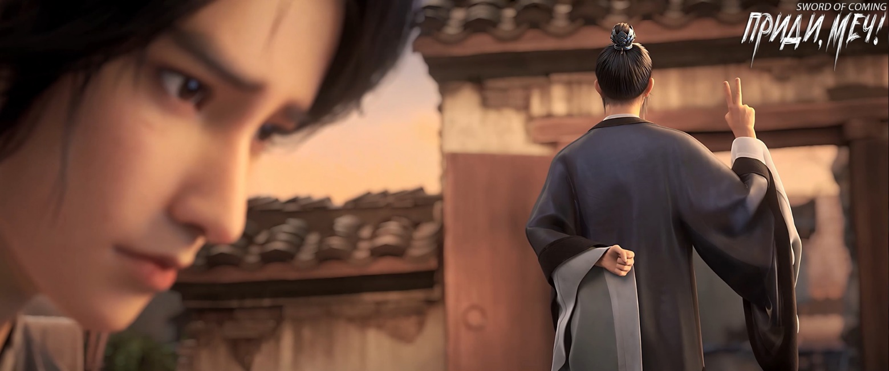
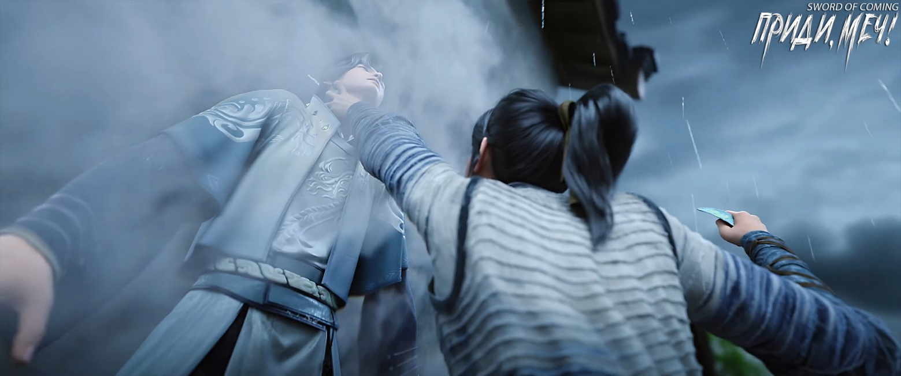

# Глава 22. Предел

П/п.: В даосизме концепция предела (止境) имеет несколько ключевых аспектов. Естественная граница: Предел рассматривается как естественное завершение или граница чего-либо. Состояние покоя: Достижение предела часто ассоциируется с обретением внутреннего покоя и гармонии. Недеяние: Предел связан с идеей недеяния, когда человек перестает бороться и позволяет вещам идти своим естественным путем. Познание Дао: Достижение предела может рассматриваться как приближение к пониманию Дао, основного принципа вселенной. Преодоление дуальности: На пределе противоположности сливаются, что отражает даосскую идею единства противоположностей. Цикличность: Предел может означать точку, где заканчивается один цикл и начинается другой. Эта концепция подчеркивает важность принятия естественных ограничений и нахождения баланса в жизни.

Буквальное значение: 止 — остановиться, прекратить, 境 — граница, сфера, состояние.

※※※※

В деревенской школе с соломенной крышей, на которой даже не было вывески, в библиотеке сидел в одиночестве учитель Ци Цзинчунь — конфуцианский ученый средних лет. Он разыгрывал партию в вэйци — не какую-то знаменитую, передававшуюся из поколения в поколение, и не повтор матча прославленных мастеров.

Он собирался поставить белый камень на доску, но внезапно заколебался, хотя позиция для него была заранее определена. После того как он убрал руку, камень все еще парил в воздухе, оставаясь на высоте более дюйма над доской.

Ци Цзинчунь продолжал сидеть прямо, сохраняя достоинство. Будучи нынешним мудрецом, ответственным за это место, и бывшим главой Академии Горного Утеса — одной из семидесяти двух конфуцианских академий, он оставался бесспорным истинным ученым своего времени, несмотря на то что был сослан сюда искупать вину заслугами.

Для обычных жителей городка время текло своим чередом: растения увядали и расцветали, шестидесятилетний цикл пролетал как мгновение, учителя сменяли друг друга. Они различались внешностью и возрастом, но всех объединяла неуловимая аура учености. Все они казались одинаковыми: строгими, требовательными, молчаливыми — словом, очень скучными. Никто не догадывался, что все эти приходящие и уходящие сельские учителя были одним и тем же человеком. Более того, за пределами городка, в большом мире, редко появлявшийся на публике учитель Ци когда-то занимал высокое положение и обладал непревзойденными божественными силами, наполненными праведностью.

В следующее мгновение душа Ци Цзинчуня покинула тело и отправилась в далекое путешествие. Подобно бессмертному в развевающихся белоснежных одеждах, он мгновенно освободился от оков физической оболочки и беспрепятственно направился в один из городских переулков.

В мгновение ока Ци Цзинчунь очутился в переулке. Первым делом он посмотрел на лежащую в луже крови женщину — Цай Цзиньцзянь с горы Облачной Зари. Ее три души и семь духов трепетали и рассеивались, словно пламя свечи на ветру.

Помедлив немного, Ци Цзинчунь приблизился к Фу Наньхуа и Чэнь Пинъаню.

Молодой господин Старого Города Дракона с высокой заколкой и с широкими рукавами слегка откинулся назад, приоткрыв рот. На его прекрасном лице с кожей, подобной нефриту, застыло сложное выражение — смесь шока, недоумения и отчаяния.

Чэнь Пинъань сохранял свою стремительную и свирепую позу, высоко подпрыгнув и бросившись вперед. В левой руке он сжимал острый, как лезвие, осколок фарфора. Даже в этот критический момент, балансируя между жизнью и смертью, паря в воздухе, он сохранял решительный взгляд и спокойное выражение лица. В нем не было ничего от невежественного юноши, рожденного в убогом переулке и выросшего в глуши.

Единственное, что соответствовало статусу юноши, была, пожалуй, безысходность, таившаяся в глубине его взгляда. Эта безысходность была хорошо знакома ученому, много лет назад покинувшему свой кабинет и академию. Она напоминала взгляд крестьянина, живущего милостью небес: тот сидит на корточках посреди высохшей, потрескавшейся борозды заброшенного поля в засушливый сезон и смотрит на палящее солнце. В этом взгляде не было душераздирающих эмоций — лишь глубокая беспомощность и растерянность.

Будучи временным хозяином этого мира, Ци Цзинчунь, конечно, знал историю семьи Чэнь Пинъаня, состоявшей из трех человек, и мог проследить их родословную на сотни и тысячи лет назад. Даже не видя предков Чэнь Пинъаня своими глазами, он мог в общих чертах восстановить их историю. Принцип был прост: подобно тому, как уездный начальник, желающий узнать родословную своих подданных, мог просто заглянуть в архивы отдела регистрации населения.

За более чем три тысячи лет развития городка его ветви и корни разрослись далеко за пределы, переплетаясь между собой. В каждом поколении было несколько выдающихся личностей, которые, хоть и не могли вернуться домой в шелках и парче, но тайно поддерживали свои семьи. В итоге это привело к формированию четырех фамилий и десяти кланов, которые ныне процветают в городке.

Семья Чэнь Пинъаня тоже имела долгую историю. Его предки некогда достигли славы и богатства, но после двух периодов взлетов и падений среди бесчисленных княжеств и династий Восточного континента Водолея постепенно пришли в упадок, уступив место другим фамилиям. За тысячу лет их положение неуклонно ухудшалось. К поколению отца Чэнь Пинъаня эта ветвь семьи Чэнь практически полностью захирела не только в городке, но и во всем Восточном континенте Водолея, не говоря уже о территории династии Ли. Они напоминали чиновников, которым императорский указ запретил занимать должности из поколения в поколение, — у семьи больше не было шансов на возрождение.

С тех пор как Ци Цзинчунь прибыл сюда управлять великой формацией, минуло более шестидесяти лет. Он строго придерживался четырех принципов учения: прямота, честность, умиротворение и гармония, никогда не меняя судьбы жителей городка по своему усмотрению. Иначе, по мнению этого ученого, некогда страстно ненавидевшего зло, в знатных семьях городка было бы слишком много скверны, а в бедных домах переулков — слишком много нищеты.

Однако Ци Цзинчунь, холодно наблюдая со стороны, видел, как знатные семьи терзались своими тщетными печалями, а простые люди проявляли крайнюю жестокость. Со временем он уподобился возвышающейся статуе божества, что не принимает ни благовоний, ни человеческой благодарности, а лишь сидит, сложив руки, безразличная к мирским делам.

Ци Цзинчунь слегка удивился, шагнул вперед и, внимательно посмотрев, едва заметно кивнул. Оказалось, что Чэнь Пинъань, демонстрировавший столь мощный напор и, казалось, полный решимости не успокоиться, пока не убьет Фу Наньхуа, в итоге лишь сильно ударил его запястьем по шее. Участь Фу Наньхуа оказалась намного лучше, чем у Цай Цзиньцзянь. После мощного удара он отлетел к стене, где Чэнь Пинъань одной рукой схватил его за горло, а другой приставил осколок фарфора к животу.

Ци Цзинчуню стало любопытно, почему Чэнь Пинъань не нанес смертельный удар — такая прекрасная возможность была мимолетной, а последствия могли быть бесконечными. Ци Цзинчунь был истинным конфуцианским ученым, строго соблюдающим правила и этикет, но не догматиком, не из тех педантичных книжников, которые только и умеют, что качать головой да сыпать цитатами.

Он слишком хорошо знал таких людей, как Фу Наньхуа, — их врожденные качества, характер и темперамент. Даже если сегодня в переулке Чэнь Пинъань угрозами временно заставил его отказаться от мести, для Фу Наньхуа это станет беспрецедентным позором и унижением, способным довести до одержимости и помешательства. К тому времени с Чэнь Пинъанем будет разбираться уже не сам Фу Наньхуа, а весь Старый Город Дракона — резиденция правителя Южного моря.

У Ци Цзинчуня были личные мотивы прийти сюда и помешать Чэнь Пинъаню продолжать убивать людей, но в большей степени он делал это ради справедливости. Сейчас маленький городок напоминал треснувший фарфор, готовый вот-вот разлететься на куски. Ци Цзинчунь должен был замедлить этот неудержимый процесс, чтобы организовать пути отступления для как можно большего числа людей, и в идеале спокойно, без происшествий передать все в руки кузнеца по имени «мастер Жуань». Если удастся продержаться последние шестьдесят лет, можно будет считать, что все остались довольны: люди на горе получат свой шанс, а люди под горой — спокойствие.

Стоит понимать, что для людей с гор в большинстве случаев жизни нескольких сотен или тысяч муравьев у подножия горы ничего не значили во времена, когда пути рушились, новое сменяло старое, возникали благоприятные возможности и появлялась надежда на долголетие. Бессердечие императорских династий мирского мира не стоило даже упоминания по сравнению с беспристрастностью Великого Дао, которому поклонялись многие совершенствующиеся.

Поразмыслив немного, Ци Цзинчунь бесшумно растворился в воздухе.

Небо и земля продолжали вращаться беспрепятственно. Предыдущий предел тихо разрушился и…

Запястье Чэнь Пинъаня «наконец» с силой ударило по шее Фу Наньхуа — голова последнего мотнулась, и он отлетел к стене переулка. Оглушенный мощным ударом, он едва понимал, где верх, где низ. Чэнь Пинъань, оказавшись на земле, стремительно приблизился к нему и нанес удар локтем в живот.

Фу Наньхуа не успел выпрямиться, прислонившись к стене. Удар локтем Чэнь Пинъаня был настолько силен, что он чуть не исторг желчь, его тело инстинктивно согнулось.

Чэнь Пинъань одной рукой схватил Фу Наньхуа за горло, а другой приставил осколок фарфора к животу молодого господина.

Фу Наньхуа с трудом мог представить, как этот тощий юноша, который был на голову ниже, мог обладать такой огромной силой в пальцах. Острота и холод фарфорового осколка у живота заставили младшего господина Старого Города Дракона снова ощутить приближение смерти — лишь тонкая грань отделяла мир живых от мира мертвых.

Фу Наньхуа, конечно, не мог знать, насколько удивителен был бесконечный потенциал, порожденный одержимостью сильнее стремления к выживанию, у ребенка, с юных лет бродившего по горам и долинам в поисках лекарственных трав.

Когда этот юноша по ошибке съел ядовитую траву и корчился от боли на улице переулка, его стремление было настолько сильным, что заставило ребенка, который должен был учиться в деревенской школе, ползти домой, чтобы вернуть бамбуковую корзину с целебными травами, спасающими жизнь.

Позже рубка дров, выжигание угля, формовка и обжиг керамики, копание глины и пробование почвы на вкус — не было ни одного дела, которое не испытывало бы силу и выносливость юноши.

За пределами городка Фу Наньхуа мог бы легко подавить сотню или тысячу юношей, просто применив немного даосской магии. Но выбрав схватку не на жизнь, а на смерть внутри городка, он действительно исчерпал свою удачу и наткнулся на непреодолимое препятствие.

Пораженный мучительной болью и унижением, Фу Наньхуа потерял голову и с искаженным лицом выкрикнул:

— Если ты убьешь меня, ты обречен! Если не убьешь меня, все равно не избежишь смерти! Маленький ублюдок, ты в любом случае покойник!

Чэнь Пинъань слегка запрокинул голову, глядя на этого мужчину с безумным выражением лица:

— Ты знаешь, я не хочу убивать тебя, у меня нет с тобой вражды, я только защищаюсь, потому что ты хотел причинить мне вред.

Фу Наньхуа злобно усмехнулся:

— Ничтожество, ты еще смеешь рассуждать о правилах с Фу Наньхуа?! — Он изо всех сил повысил голос: — Да кто ты такой?!

Чэнь Пинъань помолчал и спросил:

— Ты действительно хочешь убить меня?

Когда Фу Наньхуа увидел глаза смуглого юноши, он внезапно успокоился.

Лицо Фу Наньхуа, которого держали за горло, покраснело, быстро стало синим, а затем фиолетовым. Хотя Чэнь Пинъань не усиливал хватку, ее было достаточно, чтобы задушить крепкого молодого мужчину.

Фу Наньхуа с трудом произнес:

— Если я скажу, что не убью тебя, ты поверишь? — Он сильно дернулся.

Но Чэнь Пинъань почти одновременно усилил хватку, и рука Фу Наньхуа, слегка шевелившая пальцами, безвольно повисла.

Чэнь Пинъань покачал головой.

Фу Наньхуа чувствовал все большее головокружение и помутнение в глазах. Хотя в душе он жаждал одним ударом разбить голову этого ублюдка, внешне все еще старался сохранять дружелюбное выражение:

— А что, если я поклянусь небом? Такие люди, как мы, не могут давать клятвы просто так.

Фу Наньхуа прибегнул к хитрости. Буддийские обеты и клятвы, данные культиваторами от всего сердца, действительно имели огромную сдерживающую силу. Но он сказал лишь половину правды. Даже если бы он поклялся, то только на словах, а не тяжелой клятвой в сердце, которая «не записывается на бумаге, но вырезается киноварью на стенах в сердце». Поэтому соблюдение клятвы зависело бы только от его настроения. К тому же у последователей Дао есть способы нарушить клятвы, вопрос лишь в цене. В целом ее величина напрямую связана с уровнем культивации последователя Дао и серьезностью содержания клятвы.

Но Чэнь Пинъань неожиданно покачал головой.

Фу Наньхуа, которому становилось все труднее дышать, уже не имел сил торговаться и вдруг почувствовал замешательство.

Неужели он умрет? Точно так же, как та жалкая Цай Цзиньцзянь, и еще от руки какого-то мелкого ублюдка? Когда эта ужасная новость дойдет до Старого Города Дракона, не станет ли она предметом насмешек для всего города? У него даже не было возможности протянуть руку и активировать скрытый механизм на поясе. Белый нефритовый пояс на его талии на самом деле был остаточной душой существа, принадлежащего к роду земляных драконов.

— Достаточно.

Голос прозвучал в ушах обоих. Для Фу Наньхуа он был подобен небесной музыке, однако в этот момент он как раз потерял сознание и не был уверен, не привиделось ли ему это.

Чэнь Пинъань в изумлении обернулся и увидел учителя Ци — все тело его сияло ослепительным светом, а сам он казался эфемерным и нереальным. Учитель Ци молча улыбнулся.

Взгляд Чэнь Пинъаня вновь стал твердым и непоколебимым, пять пальцев правой руки так и не разжались.

Ци Цзинчунь не выказал ни раздражения от того, что его доброту приняли за ослиные потроха, ни радости от того, что увидел потенциал в этом материале. Он лишь слегка взмахнул рукавом в сторону Чэнь Пинъаня, словно «выудил» какой-то предмет в свою ладонь.

Этот конфуцианский мудрец раскрыл ладонь и, взглянув на нее, невольно усмехнулся. Там было грязное пятно, похожее на чернильную кляксу. Оказалось, что намерение, которое некто посеял в Чэнь Пинъане, потускнело и явно давно исчезло.

Снова подняв взгляд на юношу Чэнь Пинъаня, Ци Цзинчунь с некоторым сожалением вздохнул:

— Неудивительно, что учитель говорил, что для достижения успеха в мире выдающийся талант — лишь второстепенное, а непоколебимая воля — главное. Чэнь Пинъань, ты преподал мне еще один урок от имени учителя. Жаль только, что у меня, Ци Цзинчуня, уже нет возможности взять последнего ученика[1].

[1] Дословно «закрывающий двери ученик» (关门弟子) означает последнего и самого близкого ученика, которого учитель принимает перед завершением своей карьеры или жизни. Этот ученик обычно получает самые сокровенные знания и навыки, которые учитель накопил за всю свою жизнь, и считается наследником его мастерства и традиций школы.