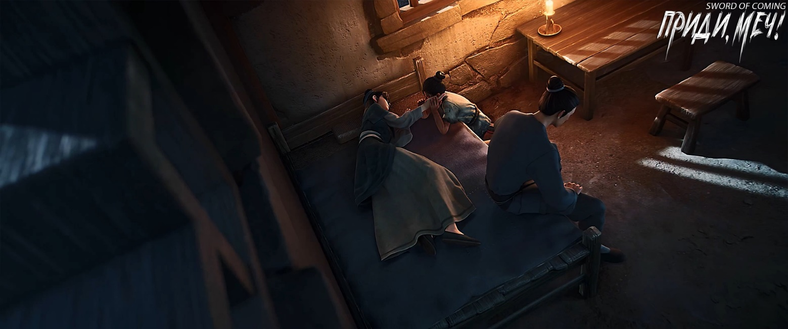
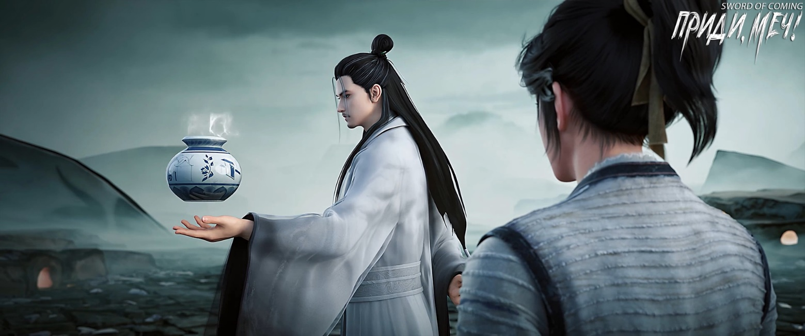
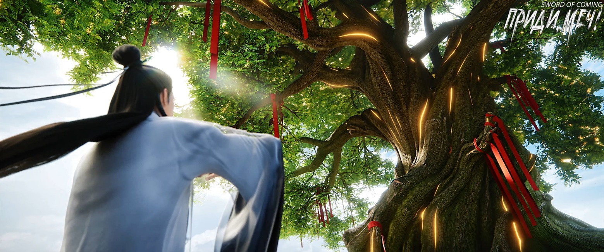
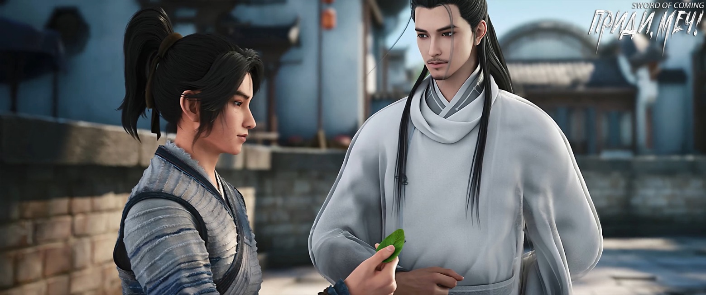

# Глава 23. Тень софоры

После этих слов Ци Цзинчунь самоиронично усмехнулся. Кто из его учеников сейчас был драгоценным и ценным? Комната, полная детей, изучающих начальную грамоту, каждый и которых платил за обучение всего триста монет в год, а некоторые бедные дети приносили лишь три полоски вяленого мяса.

Ци Цзинчунь посмотрел на Чэнь Пинъаня, который упорно держался своего мнения и не хотел отпускать руку, и спросил:

— В глубине души ты на самом деле не хочешь его убивать, но проблема в том, что этот человек, похоже, во что бы то ни стало хочет убить тебя. Так что? Убить его, покончить со всем этим, временно сохранить свою жизнь, а завтрашние проблемы решать завтра? Или ты надеешься уладить дело мирно, превратить большую проблему в маленькую, а маленькую свести на нет? Верно?

Чэнь Пинъань, часто подслушивавший, как соседские дети декламируют стихи и прозу, выпалил:

— Чему учитель хочет научить меня?

Ци Цзинчунь улыбнулся и сказал:

— Чэнь Пинъань, почему бы тебе сначала не попробовать разжать правую руку, а потом решить, хочешь ли ты пройтись со мной. Есть вещи, в которых я не могу не признать свою вину, и я должен дать тебе объяснение.

Чэнь Пинъань колебался мгновение, а затем разжал пальцы правой руки и вдруг обнаружил, что Фу Наньхуа не двигался совсем — его взгляд, волосы и дыхание были полностью неподвижны.

После того как Ци Цзинчунь активировал большую формацию, маленький городок вернулся в состояние покоя.

Ци Цзинчунь тихо сказал:

— Следуй за мной по пятам и старайся не отходить дальше десяти шагов.

Ци Цзинчунь, чьи одежды развевались, а тело казалось невесомым, первым направился к концу переулка, а Чэнь Пинъань последовал за ним. По пути он опустил взгляд на ладонь левой руки — она была изуродована, виднелась белая кость, но видимая кровь почему-то больше не текла.

Идя впереди, Ци Цзинчунь с улыбкой спросил:

— Чэнь Пинъань, веришь ли ты, что в этом мире существуют небожители, духи, демоны и призраки?

Чэнь Пинъань кивнул:

— Верю. Когда я был маленьким, моя мама часто рассказывала старые истории и говорила, чтобы я верил, что добро вознаграждается добром, а зло наказывается. Эту фразу мама повторяла чаще всего, поэтому я хорошо ее запомнил. Еще она говорила, что в ручьях живут водяные демоны, которые утаскивают детей, что в разрушенном храме к северу от города по ночам старый магистрат ведет судебные разбирательства, что боги-хранители дверей, которых мы вешаем, на самом деле оживают по ночам и защищают наш дом… Раньше я не очень-то в это верил, но… теперь я думаю, что большая часть этого — правда.

Ци Цзинчунь тихо сказал:

— Из того, что она говорила, что-то правда, а что-то нет. Что касается утверждения о воздаянии за добро и зло, трудно сделать однозначный вывод, потому что простые люди, императоры и бессмертные мудрецы имеют разные представления о добре и зле, поэтому выводы, к которым они приходят, сильно различаются.

Чэнь Пинъань спрятал осколок фарфора, ускорил шаг, поравнявшись с Ци Цзинчунем, и, подняв голову, спросил:

— Учитель Ци, могу я задать вопрос?

Ци Цзинчунь, словно прочитав его мысли, спокойно сказал:

— Этот маленький городок — место гибели и захоронения последнего настоящего дракона. Бесчисленные драконоподобные существа во всем мире полагают, что это место обладает самой сильной удачей и обязательно однажды «породит» дракона. На самом деле, за более чем три тысячи лет «рождение» дракона так и не произошло, но дети, рожденные в этом городке, действительно обладают гораздо лучшими врожденными качествами, характером и удачей, чем их сверстники в других местах. Даже потомки многих знаменитых бессмертных пар с Восточного континента Водолея не превосходят их. Конечно, не каждый ребенок в городке обладает выдающимся талантом.

Ци Цзинчунь слегка улыбнулся и не стал углубляться в подробности, вероятно, опасаясь задеть чувства Чэнь Пинъаня, и сменил тему:

— Почти все старшие практикующие, участвовавшие в той великой катастрофе убийства дракона, получили тяжелые ранения. Многие из них поселились здесь, построили хижины для совершенствования, можно сказать, спокойно ожидая смерти. Были и пары, которым посчастливилось выжить вместе, а некоторые, сражаясь бок о бок, естественным образом стали возлюбленными и соединили свои судьбы.

— После более чем трех тысяч лет развития и роста, городок достиг своих нынешних размеров. На карте династии Дали это место изначально называлось деревней Большого Болота. Позже оно было лично переименовано мудрецом в Драконью Пучину. Еще позже, из-за табу на иероглиф «пучина», который входил в имя одного из императоров Дали, название снова было изменено…

Чэнь Пинъань, долго сдерживавший свои слова, наконец не выдержал и тихо прервал речь Ци Цзинчуня. Сжав кулаки, с надеждой и ожиданием он спросил:

— Учитель, на самом деле я хотел спросить о моих родителях… Какими они были людьми?

Ци Цзинчунь погрузился в размышления:

— Поскольку странствующий даос Лу Чэнь уже раскрыл тебе некоторые сокровенные тайны, я тоже могу, следуя за проделанной им брешью, рассказать тебе кое-что. В моих воспоминаниях твой отец был простодушным и мягким человеком со средними талантами. Он не стоил того, чтобы его увезли из городка, и, естественно, он стал в глазах некоторых людей бесполезным[1], и рассматривался как убыточная сделка. Возможно, в порыве гнева, а может быть, из-за крайней нужды, в общем, торговец фарфором за городом подделал фарфоровое изделие, связанное с судьбой твоего отца. После этого не только его жизненный путь стал полон неудач и невзгод, но и ты с матерью оказались втянуты в эти страдания.

[1] 鸡肋 — дословно «куриные ребрышки», в переносном смысле означает что-то малоценное, бесполезное или обременительное. Эта идиома происходит из фразы «食之无味，弃之可惜» (есть — невкусно, а выбросить — жалко), описывающей нечто, от чего трудно отказаться, несмотря на его низкую ценность.

— Позже, по неизвестным причинам, он случайно узнал секрет фарфора судьбы. Он понял, что если этот фарфор будет обожжен в печи и увезен из городка, то человек, связанный с ним, всю жизнь будет марионеткой на ниточках. Поэтому он тайно разбил фарфоровое изделие, принадлежащее тебе. Если мне не изменяет память, это был фарфоровый пресс-папье[2].

[2] 瓷镇纸— фарфоровый пресс-папье, декоративное изделие, используемое для придавливания бумаг на столе.

Ци Цзинчунь продолжил серьезным тоном:

— Ты должен знать, что каждому младенцу, родившемуся в городке, присваивается кодовое имя, которое заносится в секретные архивы. В городке есть специальные люди, которые, используя уникальное тайное искусство, извлекают каплю крови из сердца и вливают ее в фарфор судьбы, который будет обожжен позже. Обжиг фарфора судьбы для девочек должен длиться шесть лет, а для мальчиков еще дольше — огонь в печи не должен гаснуть ни на день в течение девяти лет. Талант ребенка, как и качество обычного фарфора, обожженного в печи, зависит от воли небес и удачи. Однако ставки при «фарфоровых пари»[3] очень высоки. Хотя сейчас твои способности тоже весьма посредственны, можно себе представить, какой гнев испытал торговец фарфором за пределами городка, когда твой отец решительно разбил тот пресс-папье. Что касается твоей матери, она была женщиной с кротким нравом.

[3] 赌瓷 — «фарфоровые пари», азартная игра, в которой люди делают ставки на качество и ценность фарфора после обжига. Такие пари реально существуют в Китае.

Дойдя до этого момента, Ци Цзинчунь вдруг улыбнулся:

— Когда твоя мать вышла замуж за твоего отца, многие их сверстники в городке были очень расстроены. Но, честно говоря, если ты просишь меня рассказать подробности жизни твоих родителей, мне трудно это сделать. После того как я прибыл сюда, кроме преподавания, у меня было много других дел.

Чэнь Пинъань тихо ответил и слегка отвернул голову, небрежно вытирая лицо рукой. Он, должно быть, забыл о плохом состоянии своей левой руки и испачкал все лицо кровью, но ему было слишком жаль вытирать ее рукавом.

Они прошли мимо двенадцатиногой мемориальной арки.

Ци Цзинчунь, не глядя на Чэнь Пинъаня, откровенно сказал:

— Когда истинный дракон пал здесь, четыре мудреца лично явились и заключили договор, согласно которому каждые шестьдесят лет один человек должен оставаться здесь, чтобы помогать присматривать за остаточной удачей, оставшейся после смерти дракона. На самом деле, тогда были споры о том, следует ли полностью искоренить ее… Но рассказывать тебе об этих непроизносимых небесных тайнах значит навлечь на тебя беду.

— В целом, представители трех учений — конфуцианства, буддизма и даосизма, а также военной школы являются главными игроками. Кроме того, различные школы мысли Восточного континента Водолея, благословенные места, семьи бессмертных, могущественные кланы и другие — все имеют определенную долю и возможность получать выгоду отсюда. Смешно сказать, наличие или отсутствие квоты на «покупку фарфора» в течение ста лет стало почти признаком, определяющим, является ли школа или семья самой лучшей.

Чэнь Пинъань сказал:

— Учитель, я не понимаю всего, что вы говорите, но я запомнил. Однако сегодня я узнал, что мои родители были хорошими людьми, и этого мне достаточно.

Ци Цзинчунь улыбнулся:

— Я и не ожидаю, что ты сразу все поймешь. Это просто предисловие, иначе, если бы я просто посоветовал тебе не убивать Фу Наньхуа, ты бы точно не послушал. Причина, по которой я прошу тебя не убивать его, не в том, что я, Ци Цзинчунь, сочувствую ему как себе подобному или скорблю, как лиса по убитому зайцу. И не в том, что я надеюсь, что Фу Наньхуа и Старый Город Дракона будут благодарны мне за это, чтобы я мог получить какую-то выгоду в будущем. Дело не в этом.

— На самом деле, все как раз наоборот. Мы, ученики конфуцианства, выступаем за активное участие в мирских делах и больше всего противостоим безудержности практикующих. Обе стороны боролись открыто и тайно бесчисленные годы. Если бы я, Ци Цзинчунь, был в том возрасте, когда только поступил в Академию Горного Утеса, то ни у Истинного Господина, Рассекающего Реку, ни у молодого господина Старого Города Дракона, не было бы сейчас шанса выжить — я бы давно уничтожил их одним ударом ладони.

Чэнь Пинъань заметил, что, хотя учитель Ци говорил все так же мягко и двигался так же изящно, он казался совершенно другим человеком.

Это напомнило ему старика Яо, когда тот, напившись, говорил, что их фарфор предназначен для императора и кто может с ним сравниться?

Хотя тон учителя Ци, когда он говорил об уничтожении других одним ударом ладони, отличался от тона старика Яо в тот момент, выражение его лица было точно таким же.

Ци Цзинчунь нахмурился и поднял голову, глядя в сторону переулка Глиняных Кувшинов, словно прислушиваясь к чьим-то словам. Хотя он не выказывал явного недовольства, его взгляд не скрывал раздражения. Наконец он холодно произнес:

— Немедленно уходи!

Чэнь Пинъань выглядел растерянным.

Ци Цзинчунь объяснил:

— Тот сказитель, настоящее имя которого Лю Чжимао, с даосским титулом Истинный Господин, Рассекающий Реку, на самом деле даос из неортодоксальной школы. Его умения неплохи, но характер низкий. Вражда между тобой, Цай Цзиньцзянь и Фу Наньхуа была спровоцирована им. В конце он даже поместил в твое сердце еретический талисман — четырехсловную мантру «Всем сердцем искать смерти», тайно выгравированные в твоем сознании. Это крайне коварный и злонамеренный метод.

Чэнь Пинъань молча запомнил имя Лю Чжимао.

Ци Цзинчунь вздохнул и спросил:

— Тебе не интересно, почему я не вмешиваюсь?

Чэнь Пинъань покачал головой.

Ци Цзинчунь продолжил говорить сам с собой:

— Этот мир подобен старому фарфору, выветривавшемуся и выгоравшему на солнце три тысячи лет, он на грани разрушения. Вы все чужаки, защищенные большой формацией. Что бы вы ни делали, если не слишком усердствовать, этого недостаточно, чтобы разбить фарфор. Но я тот, кто держит этот фарфор в руках. Любое мое действие затронет трещины на нем. На самом деле, что бы я ни сделал, это только ускорит распространение этих трещин.

— Если бы дело было только в разбитом фарфоре, это бы еще ничего. Но судьбы пяти-шести тысяч жителей этого городка, их нынешние и будущие жизни, все в моих руках. Как я могу относиться к этому легкомысленно?

Однако эти слова, накопившиеся за многие годы и требующие выхода, учитель Ци произнес слишком тихо, и Чэнь Пинъань, даже навострив уши, не мог их разобрать.

Ци Цзинчунь посмотрел на Чэнь Пинъаня, который время от времени вытирал лицо правой рукой. Они уже подошли к колодцу с железной цепью в переулке Цветущих Абрикосов, где женщина наклонилась, чтобы набрать воды. Ци Цзинчунь спросил:

— Если незнакомец упадет в колодец, и ты умрешь, если попытаешься спасти его, будешь ли ты спасать?

Чэнь Пинъань подумал и спросил в ответ:

— Я хочу знать, действительно ли можно спасти этого человека?

Ци Цзинчунь не ответил на вопрос Чэнь Пинъаня, а только улыбнулся и сказал:

— Запомни, благородный муж не спасает.

Чэнь Пинъань удивился:

— Благородный муж?

Ци Цзинчунь заколебался на мгновение, присел, сначала поправил воротник Чэнь Пинъаня, а затем вытер кровь с его лица и мягко сказал:

— Столкнувшись с несчастьем, сперва прояви сострадание, но благородный муж не является человеком, слепо следующим правилам. Он может пойти к колодцу, чтобы спасти человека, но ни в коем случае не позволит себе оказаться в смертельной опасности.

Похоже, этот вопрос пробудил в нем какие-то мысли. Чэнь Пинъань серьезно спросил:

— Учитель, смогу ли я выжить сейчас? Если да, то как долго я смогу прожить?

Ци Цзинчунь тщательно обдумал вопрос, медленно встал и решительно сказал:

— Если ты не боишься трудностей на своем пути и готов к большим страданиям, то точно сможешь выжить.

Чэнь Пинъань тут же радостно улыбнулся и естественно ответил:

— Я совсем не боюсь трудностей!

Ци Цзинчунь, вспоминая спокойствие Чэнь Пинъаня на протяжении всего пути, успокоился:

— Пойдем, я отведу тебя в одно место. Хотя я, Ци Цзинчунь, не могу тебе особо помочь, но в данной ситуации помочь тебе пережить эту беду не будет нарушением правил. На самом деле, тебе и так полагалась компенсация в виде благоприятной возможности.

Чэнь Пинъань был в недоумении.

Они пришли к старой софоре. По какой-то причине внутри и снаружи городка было тихо, и только это старое дерево, казалось, было исключением — его листья слегка колыхались, грациозно покачиваясь.

Остановившись, Ци Цзинчунь с серьезным выражением лица поклонился и, подняв голову, спросил:

— Могу ли я, Ци Цзинчунь, попросить у вас лист софоры, чтобы Чэнь Пинъань мог спокойно покинуть городок в будущем и как минимум в течение трех лет не подвергался ответным бедствиям и несчастьям?

Тысячелетняя старая софора оставалась безмолвной.

Ци Цзинчунь снова спросил:

— Я, Ци Цзинчунь, охранял это место пятьдесят девять лет, и хотя у меня нет заслуг, я усердно трудился. Неужели я не могу попросить один лист софоры-хранителя? Тем более, Чэнь Пинъань — уроженец вашего городка. Почему вы, уважаемые предки, так скупы?

Старая софора по-прежнему не отвечала.

Тишина в этот момент казалась безмолвной насмешкой. Ты, Ци Цзинчунь, обладаешь великими способностями, но все же ты лишь часть этого мира, и к тому же тот несчастный, кто управляет ключевой формацией. Мы просто не хотим даром оказывать тебе эту милость, и что ты можешь с этим поделать?

Лицо Ци Цзинчуня то мрачнело, то светлело, наконец он лишь вздохнул и, опустив голову, посмотрел вниз с чувством глубокой вины.

Чэнь Пинъань ухмыльнулся и, наоборот, утешил его:

— Даос Лу сказал, что если я пойду на юг городка и найду кузнеца по фамилии Жуань, чтобы стать его учеником, у меня будет шанс выжить. Учитель Ци, думаю, и без этого… листа софоры все будет в порядке!

Ци Цзинчунь с улыбкой спросил:

— Это правда?

Чэнь Пинъань почесал голову и застенчиво сказал:

— Нет.

Ци Цзинчунь понимающе улыбнулся.

Внезапно с самой высокой части кроны дерева слетел свежий лист софоры, сочный до такой степени, что, казалось, с него капает роса.

Чэнь Пинъань просто протянул руку, и лист сам упал ему на ладонь.

На листе мелькнул и исчез золотой иероглиф.

Ци Цзинчунь был немного ошеломлен, но через мгновение серьезно сказал:

— Этот иероглиф — «Яо». Чэнь Пинъань, готов ли ты отблагодарить семью Яо, невзирая на жизнь или смерть?! Честно говоря, даже без этого листа у тебя все равно был бы шанс на выживание, это я могу тебе точно сказать. Поэтому ты должен хорошенько подумать!

Чэнь Пинъань спросил:

— Это тот же иероглиф «Яо», как в имени мастера Яо?

Ци Цзинчунь кивнул:

— Именно так.

Чэнь Пинъань сложил руки, бережно зажав лист софоры между ладонями, поднял голову и громко сказал:

— Пока я жив, любого человека с фамилией Яо, связанного с вами, как учитель Ци сказал ранее, даже если он упадет в колодец, даже если спасение означает верную смерть, я, Чэнь Пинъань, обязательно спасу его!

Небеса были безмолвны.

Ци Цзинчунь улыбнулся:

— Пойдем.

Уходя вместе с Чэнь Пинъанем, Ци Цзинчунь незаметно обернулся, посмотрел на самую верхушку софоры и на его лице промелькнула насмешка.

Листьев софоры с фамилией «Чэнь» было не так уж мало, на самом деле их было более чем достаточно. Однако в конце концов, хоть и было известно, что это место вот-вот разрушится, они предпочли искать других хозяев, даже если те не носили фамилию Чэнь. И все же ни одно из родовых благословений не пожелало присматривать за юношей в соломенных сандалиях из переулка Глиняных Кувшинов.

Ци Цзинчунь повернулся обратно, погладил Чэнь Пинъаня по голове и шутливо сказал:

— Если бы Сун Цзисинь, Чжао Яо или Гу Цань дали такой обет, как ты только что, возможно, это вызвало бы резонанс между небом и землей.

Чэнь Пинъань улыбнулся лучезарной улыбкой:

— Меня это не волнует, я просто делаю то, что должен.

Ци Цзинчунь снова спросил:

— На этот раз это правда?

Чэнь Пинъань с улыбкой ответил:

— Да!

※※※※

Немного интересных фактов. «Фарфор судьбы», «фарфор, предназначенный судьбой» или «фарфор жизненного предназначения» (本命瓷) — это особая традиция в Китае, связанная с коллекционированием фарфоровых изделий, соответствующих году рождения человека по китайскому зодиакальному календарю.

Астрологическая связь: Каждому году китайского зодиака соответствует определенный тип фарфора, который считается благоприятным для людей, рожденных в этот год.

Виды фарфора: Различные виды фарфора ассоциируются с разными животными китайского зодиака. Например, белый фарфор может быть связан с годом Крысы, а голубой — с годом Кролика.

Культурное значение: Считается, что использование «своего» фарфора может принести удачу, здоровье и благополучие.

Современное применение: Хотя эта традиция имеет древние корни, она остается популярной и в современном Китае, особенно среди тех, кто интересуется традиционной культурой и верит в астрологию.

Производство: Многие известные фарфоровые фабрики в Китае, особенно в Цзиндэчжэне, производят специальные линии фарфора судьбы. Также фарфор судьбы является предметом коллекционирования, а также его могут дарить на праздники и день рождения.