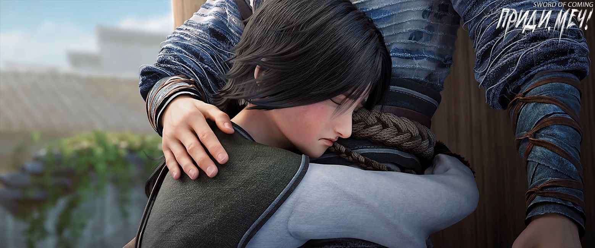
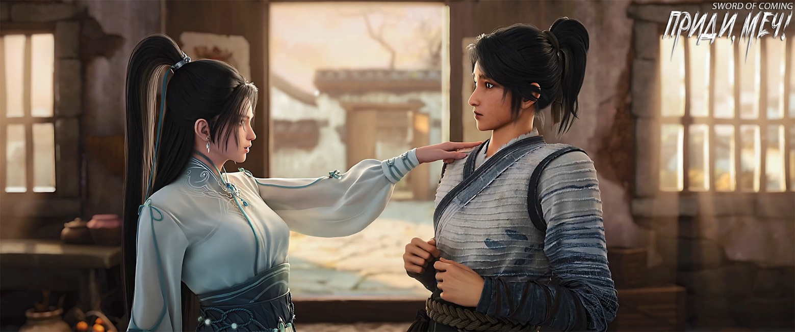

# Глава 25. Прощание

Снаружи дома в переулке Глиняных Кувшинов озорной мальчишка Гу Цань, с двумя сопливыми «червячками» под носом, яростно пинал дверь и ругался, разбрызгивая слюну:

— Чэнь Пинъань! Если не выйдешь, я позову людей зарубить тебя и разгромлю весь твой хлам! Я знаю, что ты дома! Чем ты там занят? Неужели кувыркаешься с женушкой Сун Цзисиня, с Чжигуй? Средь бела дня! И совсем не думаешь о чувствах Сун Цзисиня? Ладно-ладно-ладно, не выходишь, значит? Я ухожу, правда ухожу! Если я уйду, ты меня больше никогда не увидишь! Все мои сокровища, которые я хотел оставить тебе… Чэнь Пинъань! Выходи скорее!

Почему-то под конец в голосе Гу Цаня появились плачущие нотки, и он резко втянул две сопли обратно.

Внезапно он почувствовал острую боль в голове и быстро обернулся. Увидев знакомое лицо, он разразился бранью:

— Чэнь Пинъань! Твою…

Чэнь Пинъань выглядел недовольным, и Гу Цань поспешно сменил тон:

— Как твое здоровье?

Переход получился плавным и естественным, без малейшей неловкости.

Привыкший к бессердечности этого негодяя, Чэнь Пинъань, держа новый глиняный кувшин, раздраженно бросил:

— Разве ты не знаешь, хорошо это или нет?

Гу Цань, осознав, что у него есть срочное дело, быстро потянул Чэнь Пинъаня к воротам двора. Затем сунул ему в руки два искусно вышитых мешочка и, понизив голос, спросил:

— Помнишь того маленького вьюна, которого я просил у тебя в прошлом году?

Чэнь Пинъань недоуменно держал тяжелые мешочки. Ему тут же вспомнился тот юноша в роскошной одежде, который некогда насильно купил золотого карпа и впоследствии прислал мешочек с медными монетами. Чэнь Пинъань огляделся — в обоих концах переулка Глиняных Кувшинов не было ни души.

Он поспешно затащил Гу Цаня во двор, отставил кувшин в сторону и прямо спросил:

— Какой-то приезжий хочет купить у тебя того вьюна, верно?! Гу Цань, умоляю, не продавай! Ни за что! Разве ты не хочешь, чтобы твоя мать в будущем жила в довольстве? Ты обязательно должен оставить его себе, понимаешь?!

Гу Цань разразился громким плачем, схватил Чэнь Пинъаня за рукав и, всхлипывая, проговорил:

— Я хотел вернуть тебе вьюна, но мама не позволила и даже дала мне пощечину. Мама никогда прежде не била меня. А еще тот сказитель — не то божество, не то демон — был ужасен. Сначала он перенес меня в белую чашу, а потом тот вьюн вдруг стал огромным, намного толще бочки для воды в нашем доме…

Чэнь Пинъань резко зажал рот Гу Цаня рукой, с серьезным выражением лица и выпученными глазами воскликнул:

— Вьюн — подарок тебе, он твой! Гу Цань, ты хочешь, чтобы твоя мать жила в роскоши? Чтобы она могла каждый день есть мясо, использовать румяна и пудру, носить изысканные шелковые наряды?

Гу Цань шмыгнул носом и энергично закивал.

Чэнь Пинъань убрал руку, присел на корточки и спросил:

— А что с этими двумя мешочками денег, ты их тайком взял?

Гу Цань закатил глаза, собираясь соврать, но Чэнь Пинъань слишком хорошо его знал. Стоило этому маленькому негоднику задумать какую-нибудь проделку, как Чэнь Пинъань сразу угадывал его намерения. Он тут же наградил Гу Цаня щелчком по лбу и строго сказал:

— Верни обратно!

— Не верну! — упрямо ответил Гу Цань.

Чэнь Пинъань побагровел от гнева и уже занес руку для подзатыльника, но, увидев упрямое выражение лица Гу Цаня, немного смягчился. Он умерил тон и задумчиво спросил:

— Что же все-таки произошло? Расскажи мне.

Гу Цань подробно изложил всю историю. Нельзя отрицать, что этот ребенок обычно раздражал до зубовного скрежета, но был не по годам смышленым. От старой софоры до колодца с железной цепью, а затем до двора в переулке Глиняных Кувшинов он ясно и четко рассказал Чэнь Пинъаню о своем удивительном приключении, когда сказитель хотел взять его в ученики. В этот момент Чэнь Пинъань примерно понял ситуацию: Гу Цань, вероятно, был одним из тех в городке, кто получил благословенный лист софоры от предков.

Будь то дым над могилой предков или, как говорили учитель Ци и даос Лу, удача и благословение — похоже, сказитель собирался увести Гу Цаня из городка. Но при мысли об Истинном Господине, Рассекающем Реку, сердце Чэнь Пинъаня сжималось. По словам учителя Ци, этот человек был крайне низкого морального облика и даже хотел быстрее избавиться от Чэнь Пинъаня, не гнушаясь использовать божественные силы, чтобы навредить ему и Цай Цзиньцзянь.

Будет ли хорошо, если Гу Цань признает этого человека своим учителем? Однако, с другой стороны, если этот человек хотел взять Гу Цаня в ученики, а не обманывать или принуждать его, не означало ли это, что жизни Гу Цаня пока ничего не угрожает?

Хитрый и проворный Гу Цань быстро завертел глазами и, пока Чэнь Пинъань размышлял, внезапно выхватил у него из рук два мешочка с деньгами и швырнул их в дом, а затем стремительно бросился наутек. Но Чэнь Пинъань схватил его за воротник и притянул обратно.

Гу Цань обхватил голову руками, выглядя жалким и несчастным.

Хотя Чэнь Пинъань силой вернул Гу Цаня, он колебался, не зная, как поступить. Дело было слишком серьезным, и он очень боялся принять неверное решение, которое могло бы навредить Гу Цаню и его матери. Будь речь только о нем самом, этот одинокий юноша в соломенных сандалиях, вероятно, действовал бы гораздо решительнее.

Нин Яо, неизвестно когда уже вставшая с постели, стояла за порогом:

— Моя мать однажды говаривала: у каждого своя судьба. Этот ребенок с первого взгляда похож на того, кто будет причинять несчастья на протяжении тысячи лет, но в будущем ему не будет недоставать удачи.

Глаза Гу Цаня загорелись, он быстро вытер сопли, ухмыльнулся, обнажив щербатую улыбку, и льстиво проговорил:

— Сестра, ты просто красавица, точь-в-точь как моя вторая сестра! Здесь тесновато, может, пройдемся до моего дома?

Чэнь Пинъань беспомощно заметил:

— И когда это твоя мама успела снова выйти замуж за твоего отца?

Разоблаченный Гу Цань тут же закатил глаза, сменил выражение лица и тон, и щелкнул языком:

— Чэнь Пинъань, ловко, ловко! Когда это ты успел заманить в дом женщину? Свадьбу, что ли, справлять будешь? Жаль, что я не смогу присутствовать, иначе обязательно примостился бы у стены и послушал, как вы, словно небожители, в постели сражаетесь…

Чэнь Пинъань положил ладонь на голову Гу Цаня и извиняющимся тоном сказал Нин Яо:

— Он всегда такой, не сердись.

— Медвежьи повадки! — бросила Нин Яо.

Гу Цань уже собирался проявить свой фамильный талант, но почувствовал, что ладонь на его голове слегка усилила давление. Он сразу поник и слабо произнес:

— Сестра, ты такая свежая и красивая, что бы ты ни сказала — все верно.

Нин Яо не обратила внимания на Гу Цаня и повернулась к Чэнь Пинъаню, многозначительно заметив:

— Те два мешочка медных монет тебе лучше принять, иначе в будущем вы можете стать врагами. Кроме того, если этот ребенок преуспеет в совершенствовании, а ты сегодня не позволишь ему испытывать меньше чувства вины, весьма вероятно, что это нарушит стабильность его сознания Дао и позволит внешним демонам воспользоваться слабостью.

Гу Цаню понравились эти слова, и он показал Нин Яо большой палец:

— Длинные волосы, большой ум — надежнее, чем некоторые девчонки по соседству!

Нин Яо приподняла бровь и, к удивлению, приняла комплимент.

Вдалеке в переулке Глиняных Кувшинов раздался яростный крик:

— Гу Цань!

Лицо Гу Цаня слегка побледнело:

— Ухожу, ухожу, Чэнь Пинъань, я ухожу!

Говоря, что уходит, Гу Цань даже не осознавал, что все крепче сжимает пальцы Чэнь Пинъаня. Возможно, в подсознании Гу Цань уже давно считал Чэнь Пинъаня единственным близким человеком после матери.

Чэнь Пинъань вывел Гу Цаня из двора, присел и тихо сказал:

— Гу Цань, помни: будь осторожен со своим учителем. И еще — хорошо заботься о матери. Ты мужчина, теперь она может полагаться только на тебя. Не заставляй ее постоянно беспокоиться.

Гу Цань кивнул.

Чэнь Пинъань продолжил:

— Когда будешь в чужих краях, больше делай и меньше говори, следи за своим языком. Если придется немного потерпеть — потерпи, не пытайся всегда брать верх на словах. Люди там не такие, как мы, они могут быть очень злопамятными.

У Гу Цаня покраснели глаза, и он возразил:

— Люди здесь тоже очень злопамятные, только ты — нет.

Чэнь Пинъань не знал, смеяться ему или плакать, и на мгновение лишился дара речи.

Внезапно он встрепенулся и серьезно спросил:

— Гу Цань, ты получил лист софоры?

Если нет, значит Гу Цаню не выпала божественная удача, и, возможно, появление сказителя было просто смертным приговором.

Услышав это, Гу Цань разозлился и вытащил из кармана целую горсть листьев, по привычке ругаясь:

— Не знаю, какой проклятый негодяй тайком напихал мне в карман столько этого мусора! Я обнаружил их, когда прятал те два мешочка с деньгами, тайком выбираясь из дома. Если не толстячок Чжао[1], то та девчонка Лю Мэй[1]! Если бы мать увидела это при стирке, она бы снова ругала меня за непутевость! Хорошо, что я уезжаю, иначе я бы тайком бросал камни в их отхожее место…

[1] Толстячок Чжао (赵小胖). Буквальный перевод «маленький толстяк», однако в данном случае иероглиф «小» (сяо) используется не для обозначения размера, а как уменьшительно-ласкательный суффикс, придающий имени дружеский, неформальный оттенок.

[2] Лю Мэй (刘梅). Мэй означает «слива» или «цветок сливы».

Пока Гу Цань увлеченно ругался, Чэнь Пинъань сначала оторопел, а затем почувствовал облегчение. Увидев, что парень собирается выбросить листья на землю, он поспешно остановил его и очень серьезно сказал:

— Гу Цань, сохрани их! Обязательно сохрани! Если возможно, не показывай эти листья даже матери — это, вероятно, для ее же блага.

Гу Цань был озадачен, но все же кивнул:

— Хорошо.

Чэнь Пинъань глубоко вздохнул и пробормотал себе под нос:

— Теперь я действительно могу быть спокоен.

Вдруг Гу Цань наклонился вперед и сильно стукнулся лбом о голову Чэнь Пинъаня, всхлипывая:

— Прости!

Чэнь Пинъань потер его маленькую голову и со смехом выругался:

— Дурачок!

Внезапно Гу Цань что-то прошептал ему на ухо. Чэнь Пинъань застыл на месте.

Гу Цань повернулся и побежал, на бегу оборачиваясь и махая рукой:

— Старик сказал, что поведет меня и мою мать на остров Лазурного Ущелья на озере Бамбукового Свитка. Если потом станешь таким бедным, что не сможешь жениться, приходи ко мне. Не хвастаюсь, но таких вонючих баб, как соседка Чжигуй, я тебе сразу семнадцать-восемнадцать пришлю!

Чэнь Пинъань стоял на месте, кивнул и почувствовал легкую грусть.

В конце концов, этот мальчишка был как его младший брат, и Чэнь Пинъань всегда был готов уступать Гу Цаню во всем.

Он смотрел на постепенно удаляющуюся фигуру Гу Цаня, погрузившись в раздумья. Его жизнь всегда была такой: тех, кто действительно важен для него, казалось, никак не удержать. Чэнь Пинъань усмехнулся. Небеса были довольно скупы.

Дверь соседнего двора тихо открылась, и вышла служанка Чжигуй, стройная и изящная, словно лотос в пруду.

Чэнь Пинъань спросил:

— Ты слышала, как Гу Цань только что говорил о тебе гадости?

Она моргнула своими длинными осенними глазами и ответила:

— Сделаю вид, что не слышала. Я любом случае не могу перекричать их, мать и сына, в споре.

Чэнь Пинъань почувствовал некоторую неловкость и попытался сгладить ситуацию, заступаясь за Гу Цаня:

— На самом деле у него доброе сердце, просто он говорит немного грубо.

Чжигуй без выражения слегка скривила губы:

— Доброе ли у Гу Цаня сердце, я не знаю, но то, что его мать-вдова — непростая женщина, уверена.

Чэнь Пинъань не знал, что ответить, и решил последовать ее примеру, притворившись, что ничего не слышал.

Чжигуй внезапно задала странный вопрос:

— Чэнь Пинъань, ты действительно не жалеешь?

— О чем? — растерялся он.

Чжигуй, видя, что он не притворяется, вздохнула, повернулась и вернулась во двор, плотно закрыв деревянную дверь.

Обладающий отличным зрением Чэнь Пинъань продолжал стоять в переулке, пока не увидел, как вдалеке открылась дверь дома Гу Цаня. Мать и сын несли на спинах большие и маленькие узлы, медленно направляясь к другому концу переулка Глиняных Кувшинов. Чэнь Пинъань даже ясно разглядел, как сказитель обернулся и бросил на него взгляд с игривой улыбкой.

После того, как три фигуры исчезли в конце переулка, Чэнь Пинъань вернулся во двор и увидел, что Нин Яо уже сидит на пороге. Неужели ее тело сделано из железа?

Сначала он положил на стол нефритовую шпильку, подаренную учителем Ци, и два мешочка с медными монетами, принесенные Гу Цанем. Затем начал кипятить воду, отмерять травы и варить лекарство. Делал все привычно и умело, совсем не похоже на гончара, а скорее как опытный подмастерье, проработавший много лет в аптеке.

Нин Яо была немного озадачена, но не стала спрашивать. От скуки она встала и подошла к столу, подумала и сама достала мешочек с деньгами, который Чэнь Пинъань спрятал в кувшине.

Сев, она увидела на столе три мешочка с деньгами и нефритовую шпильку, а также духовный длинный меч, который «съежился» в углу, проявляя благоразумие.

Чэнь Пинъань не помешал ей взять деньги, но повернулся и предупредил:

— Нефритовую шпильку мне подарил учитель Ци, госпожа Нин, будь с ней осторожна.

Видимо, опасаясь, что Нин Яо не отнесется к этому серьезно, Чэнь Пинъань, смущаясь, снова напомнил:

— Правда, будь осторожна.

Нин Яо закатила глаза.

Три мешочка с эссенцией золота в медных монетах: монета приветствия весны, монета для подношения и монета для подавления зла — удивительным образом собрались вместе.

Нин Яо, подперев щеку рукой, другой рукой перебирала три медные монеты и небрежно спросила:

— Как твои дела? Можешь рассказать мне?

Чэнь Пинъань, сидя на корточках у окна и внимательно следя за огнем, время от времени просматривая три рецепта лекарств, услышав вопрос, ответил:

— Уместно ли об этом говорить?

Нин Яо нахмурилась:

— Ты уже в таком жалком положении, и все еще беспокоишься, что кто-то убьет меня, чтобы заставить молчать после того, как я услышу твой секрет? Чэнь Пинъань, не то чтобы я тебя критиковала, но с такой чрезмерной добротой я советую тебе никогда не покидать этот городок, иначе ты даже не узнаешь, как умрешь.

Нин Яо очень сожалела о его несчастьях и злилась на его неспособность постоять за себя.

Такой консервативный юноша, даже будь он могущественным мечником, обладающим золотым телом архата и даосскими искусствами небесного правителя, если бы оказался в ее родных краях, он непременно умер бы в течение года, не оставив даже костей.

Чэнь Пинъань весело сказал:

— Тогда, может, я тебе расскажу?

Нин Яо прижала тремя пальцами три медные монеты и стала водить ими по столу:

— Говори, если хочешь.

Чэнь Пинъань рассказал Нин Яо о событиях, произошедших до появления учителя Ци, а о последующих событиях рассказал выборочно.

Выслушав это, Нин Яо спокойно сказала:

— Очевидно, что главный виновник — Лю Чжимао, но и Цай Цзиньцзянь с Фу Наньхуа тоже не лучше. Если бы не вмешательство учителя Ци, даже убежав на край света, ты бы не смог избежать облавы и убийства от этих трех сил. Говоря прямо, убить тебя было бы очень легко. Если бы не этот маленький городок, не то что Лю Чжимао, даже та женщина с горы Облачной Зари могла бы одним пальцем уничтожить тебя так, что твоя душа рассеялась бы.

Чэнь Пинъань кивнул:

— Я знаю.

Нин Яо рассерженно воскликнула:

— Ни черта ты не знаешь![3]

[3] Фраза «你知道个屁» буквально переводится как «Ты знаешь [лишь] пердеж!» Фраза «знать пердеж» означает «ничего не знать» или «нести чушь».

Чэнь Пинъань не стал возражать и продолжил готовить лекарство.

Она спросила:

— Все твои беды из-за того вьюна, почему бы не рассказать правду этому ребенку?

На этот раз Чэнь Пинъань не промолчал и, не поворачиваясь, сидя на маленькой скамеечке и глядя на сине-красное пламя, тихо сказал:

— Так поступать неправильно.

Нин Яо хотела что-то сказать, но в итоге промолчала. Глядя на худощавую спину, она с чувством произнесла:

— Ты знаешь, если твои кулаки недостаточно крепки, никто не будет обращать внимания на то, прав ты или нет.

Чэнь Пинъань покачал головой и сказал:

— Неважно, слушают ли другие, истина остается истиной.

Он, казалось, был не совсем уверен, поэтому обернулся и с улыбкой спросил:

— Ведь так?

Нин Яо гневно посмотрела на него:

— Ага, конечно, так, ты, болван!

Чэнь Пинъань смущенно отвернулся и продолжил варить лекарство.

Нин Яо взяла нефритовую шпильку и внимательно посмотрела на нее, обнаружив выгравированную строку мелких иероглифов.

Она бросила взгляд на Чэнь Пинъаня.

На шпильке было восемь иероглифов, и даже он, едва грамотный, нашел их очень трогательными: «Думая о благородном муже, я чувствую его тепло, словно от нефрита»[4].

[4] 言念君子，温其如玉 — эта фраза представляет собой цитату из древнекитайского текста «Ши цзин» («Книга песен») и отражает конфуцианский идеал благородного мужа (君子). Она означает, что размышления о добродетельном и нравственном человеке вызывают теплые чувства, подобные прикосновению к нефриту, который в китайской культуре символизирует красоту, чистоту и моральные качества. Также нефрит дает максимальную тепловую отдачу, то есть способен долгое время сохранять тепло, что способствует проявлению его лечебных свойств.