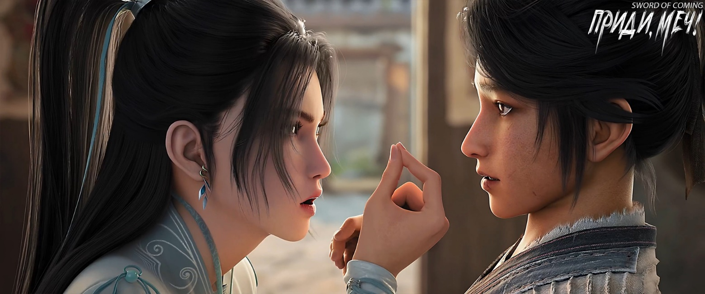

# Глава 26. Легко договориться

Приготовление лекарственного отвара было делом тонким, подобным продеванию нити в игольное ушко. Чэнь Пинъань выполнял его со знанием дела, погрузившись в процесс, и от него исходила какая-то необъяснимая радость.

Однако Нин Яо не отличалась терпением. На самом деле, кроме тренировок с кинжалом и мечом, мало что могло по-настоящему заинтересовать ее. В юном возрасте покинув родной дом, она самостоятельно путешествовала по свету, живя довольно грубой жизнью. Поэтому в скромном жилище юноши, где почти не было никакой мебели, она не чувствовала никакого дискомфорта. Дело в том, что сама она слишком часто ела и спала под открытым небом, странствуя в ветер и дождь. Даже самый изысканный и требовательный человек в таких условиях становится неприхотливым.

Нин Яо спросила:

— С твоей левой рукой все в порядке?

Чэнь Пинъань, чья левая рука была перевязана хлопковой тканью, подал ей чашу с лекарством обеими руками и, улыбнувшись, ответил:

— Все в порядке. Перед возвращением я нашел немного лечебных трав, растолок их и приложил к ране. Раньше, когда я работал в гончарной мастерской и получал ушибы или порезы, я всегда использовал это средство, и оно никогда не подводило. Это секретный рецепт, который мне давно рассказал один старик из лавки семьи Ян. Правда, я обещал ему не распространять этот секрет, иначе он мог бы пригодиться юной госпоже Нин в ее странствиях по свету.

— Но, если ты хочешь, я могу попробовать найти того старика и попросить у него разрешения. Просто сегодня я спешил в аптеку и не видел его. Надеюсь, он просто временно отлучился.

Когда Нин Яо пила лекарство, ее длинные брови, похожие не на ивовые листья, а на узкие клинки, слегка нахмурились, но она допила отвар, не изменившись в лице. Вернув фарфоровую чашу ожидавшему рядом Чэнь Пинъаню, она пробормотала:

— Бескорыстный добряк, неудивительно, что ты так беден. Сам виноват, что тебя обижают.

Не дав Чэнь Пинъаню опомниться, она добавила:

— Не обижайся, я просто человек прямолинейный.

Вероятно, Нин Яо не понимала, что эта последняя фраза ранила еще сильнее.

Чэнь Пинъань хотел что-то сказать, но промолчал.

Нин Яо большим пальцем стерла остатки отвара с уголков рта, затем выпрямилась и серьезно сказала:

— Мудрец, который сейчас управляет этими землями, то есть тот учитель из школы, о котором ты говорил, хоть и хочет помочь тебе уладить дела, чтобы обезопасить твою жизнь в будущем, но ты должен понимать, что человеческие возможности не безграничны, и даже мудрецы — не исключение. Тем более, положение учителя Ци не очень хорошее, он похож на глиняного Будду, переправляющегося через реку — сам себя с трудом может спасти. Боюсь, что в будущем он не сможет защитить твою жизнь. Я, Нин Яо, в своих поступках на каплю доброты отвечаю потоком, а за косой взгляд отплачу, даже если придется ждать годами!

«Человеческие возможности ограничены», «отвечать потоком на каплю», «мстить за малейшую обиду», «глиняный Будда, переправляющийся через реку»…

В этот момент Нин Яо была полна скрытой гордости.

«Послушай, разве мои слова не звучат очень учено?» — думала она.

К сожалению, по соседству с Чэнь Пинъанем жил довольно образованный молодой человек, который почти каждый день утром и вечером декламировал труды мудрецов для самосовершенствования. По словам самого Сун Цзисиня, он «усердно взращивал в себе праведную ци». Поэтому, хоть Чэнь Пиньань и не ел свинину, он видел, как бегают свиньи[1], когда речь об ученых людях и их высокопарных высказываниях. Даже если некоторые выражения были неясны, он мог понять их смысл из контекста.

[1] Идиома «没吃过猪肉也见过猪跑» буквально переводится как «не ел свинину, но видел, как бегают свиньи». Она означает, что даже если у человека нет личного опыта в каком-то деле, он все равно может иметь об этом представление или знания, наблюдая за другими или получая информацию из других источников.

Нин Яо пристально смотрела на Чэнь Пинъаня, пытаясь разглядеть на его лице признаки удивления, восхищения или недоумения, но у него было раздражающее выражение лица, говорящее: «Я все понял, продолжайте, юная госпожа».

Нин Яо была очень разочарована, ее первоначальный воодушевленный вид поблек. Она раздраженно сказала:

— Например, ты спас мне жизнь, и я потом помогу тебе убить Фу Наньхуа из Старого Города Дракона, или Лю Чжимао с озера Бамбукового Свитка. Но если ты хочешь убить обоих, чтобы навсегда избавиться от проблем, тебе придется раскошелиться. Ведь мы с тобой случайные знакомые, и между нами нет глубоких отношений, поэтому тебе нужно будет заплатить мешочком монет из эссенции золота в качестве вознаграждения.

Нин Яо быстро указала пальцем на мешочек с монетами приветствия весны:

— Этот мешочек мне очень нравится. Другие два мешочка с монетами для подношения и монетами для подавления зла не так красивы, и надписи на них мне не по душе.

Затем Нин Яо слегка подняла подбородок:

— Если помимо этой сделки ты готов заплатить мне еще два мешочка монет, я помогу тебе уладить дела в Старом Городе Дракона и на горе Облачной Зари. Конечно, если я раньше погибну от руки Лю Чжимао, то все будет бессмысленно. В конце концов, мой уровень развития сейчас невысок. Из девяти уровней боевых искусств я достигла только шестого, и выносливость моего тела как чистого воина еще не выросла до значительного уровня. Что касается пятнадцати ступеней восхождения в совершенствовании, подобных пятнадцати этажам башни, то я достигла только среднего пятого уровня — Драконьих Врат. В киноварной комнате у меня есть шесть картин, которые я еще не закончила, не смогла нарисовать зрачки дракону, и не смогла заставить небесную деву взлететь…

На этот раз Чэнь Пинъань действительно запутался и ничего не понял[2].

[2]. П/п.: думаю, не только Пинъань не понял многих подробностей. Там много интересного, потому все пояснения — в конце главы.

Нин Яо от смущения внезапно разозлилась. Низкий уровень развития всегда был для нее позором, и выражение лица Чэнь Пинъаня, говорящее «юная госпожа, объясните мне еще раз», несомненно, задело ее за живое.

Увидев мрачное выражение лица Нин Яо, даже глупец понял бы, что ситуация неблагоприятна. Чэнь Пинъань поспешил сменить тему:

— Юная госпожа, почему ты была так сильно ранена раньше, а теперь выглядишь почти выздоровевшей?

Нин Яо немного опустила взгляд, скрестила руки на груди и хрипло сказала:

— Тогда я действительно была на грани смерти. Если бы даос Лу не спас меня, я бы… В любом случае, я в неоплатном долгу перед тобой. Мне не следовало пользоваться ситуацией и просить у тебя три мешочка монет из эссенции золота. Моя жизнь не сравнится с жизнью таких, как Лю Чжимао. Так что я была неправа. Просто притворись, что я ничего не говорила. После того, как я покину этот городок, я сделаю все возможное, чтобы помочь тебе решить эти проблемы. Но говорю заранее, я, Нин Яо, буду действовать только в пределах своих возможностей. Я не стану жертвовать жизнью в безнадежной схватке, зная, что обречена на смерть.

Вероятно, из-за того, что ей так редко приходилось признавать свои ошибки, Нин Яо чувствовала себя крайне подавленно.

Чэнь Пинъань спросил:

— Какой из мешочков с монетами для подношения?

Нин Яо указала на один из золотистых вышитых мешочков.

Чэнь Пинъань достал оттуда три монеты, зажал их в ладони, а затем придвинул все три мешочка к девушке и с улыбкой сказал:

— Это все тебе.

Нин Яо застыла в изумлении. Придя в себя через некоторое время, она спросила:

— Чэнь Пинъань, тебя в детстве дверью по голове не ударило?

Чэнь Пинъань беспомощно ответил:

— Нет, но когда я в детстве пас коров, меня часто хлестали коровьи хвосты.

Нин Яо внезапно разозлилась, хлопнула по столу и спросила:

— Ты что, влюбился в меня?!

Чэнь Пинъань застыл как истукан.

Нин Яо широко улыбнулась и, показав Чэнь Пинъаню большой палец, сказала:

— У тебя хороший вкус!

Затем она повернула ладонь, указывая на себя большим пальцем, и с воодушевлением сказала:

— Но я не соглашусь. Мужчина, которого полюбит Нин Яо, должен быть самым могущественным мастером меча во всем мире. Во всем мире! Самым могущественным! Великим мастером меча! Перед его мечом даже даосские патриархи, буддийские святые и конфуцианские мудрецы должны склонять головы и уступать дорогу!

Чэнь Пинъань покраснел и, почесав голову, сказал:

— Юная госпожа Нин, ты неправильно поняла, ты мне не нравишься…

Нин Яо изогнула бровь, подумала, наклонилась вперед, прищурила один глаз, подняла руку, оставив между большим и указательным пальцами расстояние около дюйма, и неуверенно спросила:

— Даже вот настолько не нравлюсь?

Чэнь Пинъань решительно и твердо ответил:

— Нет! Юная госпожа Нин, не беспокойся!

Нин Яо опустила руку, тяжело вздохнула и с сочувствием сказала:

— Чэнь Пинъань, даже если в будущем тебе повезет жениться, твоя жена, скорее всего, будет не в своем уме.

Чэнь Пинъань, сидя напротив, радостно улыбнулся:

— Главное, чтобы она была хорошим человеком.

Нин Яо никак не прокомментировала это.

Жить без забот, довольствоваться малым богатством или стремиться к высотам — как говорила ее мать, у каждого своя судьба, и не обязательно есть разница в их ценности. Однако ее отец имел другое мнение: если чему-то не суждено случиться, не стоит настаивать. Но отсутствие настойчивости не означает полного отказа от стремлений. Стремиться все же нужно, а если в итоге не получится — это уже другое дело. Конечно, отец никогда не осмелился бы сказать это матери в лицо.

Чэнь Пинъань небрежно спросил:

— Юная госпожа Нин тоже пришла в наш городок в поисках удачи?

Нин Яо, ничего не скрывая, ответила:

— Я потратила все накопленное состояние от прошлых удачных встреч, плюс одну услугу, чтобы получить право войти в этот городок. Но я отличаюсь от других людей — я не ищу удачи или благоприятной судьбы. Я просто хочу, чтобы кое-кто выковал для меня меч, желательно такой, который бы соответствовал моим желаниям. А насколько он будет острым или сможет ли вместить огромное количество ци меча — это второстепенные вопросы.

Чэнь Пинъань удивленно спросил:

— Выковать меч?

Нин Яо сказала:

— Это тот кузнец, мастер Жуань. Он очень известен в вашем городке и у него есть незыблемое правило — ковать только один меч каждые тридцать лет. Он согласился приехать сюда, чтобы заменить Ци Цзинчуня, потому что считает это место подходящим для разжигания печи и ковки меча. Я пришла попытать счастья, посмотреть, не согласится ли он выковать меч для меня. Если не получится, то ничего не поделаешь, буду считать, что мне не повезло.

Чэнь Пинъань улыбнулся:

— Хорошим людям воздастся добром.

Нин Яо устало ответила:

— Ничего не поделаешь.

Она искоса взглянула на Чэнь Пинъаня:

— Твоя левая рука не болит?

Чэнь Пинъань удивился:

— Болит, конечно.

Она с подозрением спросила:

— Тогда почему ты не выглядишь так, будто тебе больно?

Чэнь Пинъань ответил, как само собой разумеющееся:

— Даже если я буду кататься по полу и кричать, боль от этого не пройдет.

Нин Яо хлопнула себя по лбу:

— Действительно, ничего не поделаешь. Ты прямо как мой отец, только твои способности намного хуже.

Чэнь Пинъань улыбнулся и замолчал, спокойно глядя во двор за окном. Нин Яо придвинула три мешочка с монетами обратно:

— Мне это не нужно.

Чэнь Пинъань отвел взгляд и тихо сказал:

— Юная госпожа Нин, ты когда-нибудь думала, что если я оставлю их себе, это может быть не очень хорошо? После встречи с учителем Ци я еще больше в этом уверен.

Нин Яо, приняв решение, никогда его не меняла. Она покачала головой:

— Это уже твое дело, меня это не касается. Я решила, что обязательно отплачу за спасение моей жизни, и сделаю это без всяких уловок, чтобы оправдать имя «Нин Яо»! Но в ближайшие годы ты должен хорошо о себе заботиться, не умри по неосторожности. Тебе нужно только пережить этот период…

Чэнь Пинъань, обычно очень сговорчивый, впервые прервал Нин Яо:

— Юная госпожа Нин, тебя спас даос Лу, поэтому не нужно чувствовать себя в долгу передо мной. Если бы я тогда не думал, что обречен на смерть и не хотел, чтобы даос Лу сделал что-нибудь для моих родителей, я бы вообще не открыл дверь.

Нин Яо холодно фыркнула:

— Это твое дело!

Чэнь Пинъань с улыбкой повторил ее слова:

— Это твое дело.

Они уставились друг на друга, глаза в глаза.

Нин Яо неожиданно первой сдалась и, жалуясь самой себе, сказала:

— Если бы ты и правда любил меня, я все равно не смогла бы ответить тебе взаимностью.

Чэнь Пинъань обхватил голову руками. Он тоже не знал, что делать с такой упрямой и странной девушкой.

В этот момент кто-то перелез через стену во двор. Такое мог сделать только Лю Сяньян. Он подбежал к порогу и уже собирался что-то крикнуть, но вдруг словно кто-то сжал ему горло, и он не смог произнести ни слова.

Чэнь Пинъань быстро встал и, подойдя к Лю Сяньяну, тихо спросил:

— Могу я пожить у тебя пару дней? Эта юная госпожа, возможно, останется здесь.

Лю Сяньян оттолкнул голову Чэнь Пинъаня и, потирая руки, как муха, с подобострастием сказал:

— Юная госпожа, мой дом большой, и там есть все необходимое. Если вы не против, почему бы вам не остановиться у меня?

Нин Яо, стоя спиной к ним, равнодушно ответила:

— Против.

Лю Сяньян скривился, глядя на хрупкую фигуру с мечом на поясе, и не сдаваясь, сказал:

— Юная госпожа, вы не знаете, но раньше две группы людей останавливали меня на крытом мосту, плача и умоляя продать им мою фамильную ценность. Я не согласился. К несчастью, из-за этих людей мастер Жуань чуть не отругал меня до смерти. Юная госпожа, вы ведь тоже приехали в городок попытать удачи, верно? Хоть я, Лю Сяньян, возможно, и не продам вам ценность, но точно позволю взглянуть на нее и расширить кругозор!

Нин Яо все так же холодно ответила:

— Не нужно.

Лю Сяньян сел на место, где раньше сидел Чэнь Пинъань, и, увидев лицо Нин Яо, сказал с сияющими глазами:

— Юная госпожа, не будьте такой отчужденной. Мы с Чэнь Пинъанем потеснимся в этой развалюхе, а вы пойдете в мой большой дом и не будете чувствовать себя скованно, будто вам некуда деть руки и ноги.

Нин Яо ответила с каменным лицом:

— Благодарю за добрые намерения, а теперь проваливай!

Лю Сяньян нисколько не смутился и, вставая, сказал:

— Ладно, золотое и серебряное гнездо не сравнится с собственным соломенным[3]. Понял, понял.

[3] 金窝银窝不如自家的草窝 — смысл поговорки в том, что даже скромный, но собственный дом лучше роскошного, но чужого. Подчеркивает ценность своего дома, какой бы простой он ни был.

Лю Сяньян вытащил Чэнь Пинъаня за порог и толкнул его локтем:

— Что происходит?

Чэнь Пинъань с затруднением ответил:

— Сложно объяснить сразу. Просто скажи, могу ли я пожить у тебя?

Лю Сяньян закатил глаза:

— Да какие тут могу-не могу, но ты должен пообещать мне присматривать за Чжигуй. Ни в коем случае не позволяй этому паршивцу Сун Цзисиню насильно опорочить ее. Ты должен помочь мне сохранить честь моей будущей жены!

Чэнь Пинъань без колебаний ответил:

— И не мечтай!

Лю Сяньян похлопал Чэнь Пинъаня по плечу и многозначительно сказал:

— Буду считать, что ты согласился.

Внутри дома Нин Яо внезапно повернулась и сказала:

— Ты знаешь, что от рождения предназначен для меча? Покупатель фарфора не забрал тебя в девять лет, вероятно потому, что хотел, чтобы ты впитал здесь больше духовной ци. Это было правильное решение. Поэтому ты обязательно должен воспользоваться шансом у мастера Жуаня и стать его учеником. Запомни, как минимум учеником внутреннего круга, а лучше прямым наследником. О том, чтобы стать единственным учеником, даже не мечтай — твои врожденные способности не настолько выдающиеся.

Лю Сяньян с улыбкой энергично закивал, говоря «хорошо, хорошо», затем обернулся к Чэнь Пинъаню, указал на Нин Яо внутри комнаты, а потом постучал себя по голове.

Чэнь Пинъань сказал:

— Она говорит правду, ты должен отнестись к этому серьезно.

Лю Сяньян перестал ухмыляться, замолчал и тихо произнес:

— Я думаю, что дело нечисто. Как ты думаешь, кто возглавлял две группы людей на крытом мосту? Это был тот подонок Лу Чжэнчунь с улицы Благоденствия и Достатка! Разве это не похоже на то, как хорек приходит поздравлять кур с Новым годом? Я же не выжил из ума, с чего бы мне вести с ними дела? К тому же, этот доспех — семейная реликвия, передававшаяся из поколения в поколение. Если я его продам, то потом, когда приснится мой дедушка, он меня до полусмерти отругает!

Услышав все это, Чэнь Пинъань насторожился:

— Тебе нужно быть осторожным, Лу Чжэнчунь и те чужаки — люди опасные!

Чэнь Пинъань повернулся и спросил:

— Юная госпожа Нин, ты знаешь, кто эти люди?

Нин Яо кивнула:

— Старик и маленькая девочка пришли с горы Истинного Ян, они считаются представителями известной праведной школы вашего Восточного континента Водолея. Старик — не человек… В общем, он в сто раз сильнее, чем Фу Наньхуа или Цай Цзиньцзянь. Женщина и ее сын тоже непростые. На самом деле, те, кто смогли вместе войти в городок, конечно же, не являются обычными богачами. У той женщины очень глубокие замыслы, а мальчик тоже не похож на того, у кого добрые намерения. Поэтому я советую твоему другу поскорее стать учеником мастера Жуаня, это будет как талисман, защищающий жизнь. В городке, неважно, насколько высоки твои связи или насколько влиятельна твоя семья, никто не осмелится тягаться с мудрецом.

Чэнь Пинъань снова спросил Лю Сяньяна:

— У тебя есть шансы стать учеником этого мастера Жуаня?

Лю Сяньян, немного колеблясь, запинаясь, ответил:

— В первый день, когда я пришел работать подмастерьем, мастер Жуань смотрел на меня так же, как в свое время старик Яо. Думаю, он будет какое-то время наблюдать за мной, прежде чем решит, брать ли меня в ученики. Только вот…

Чэнь Пинъань сердито уставился на него.

Лю Сяньян смущенно усмехнулся:

— Только вот у мастера Жуаня есть драгоценная дочь, которая очень много ест. Меня это настолько поразило, что я немного пошутил над этим. Кто же знал, что, когда эта девушка кует железо, она так мощно и властно размахивает молотом, хотя обычно она очень застенчивая и робкая. Откуда мне было знать, что она так плохо воспринимает шутки? Я довел ее до слез, и как назло, ее отец застал это. Он посмотрел на меня недобрым взглядом, так что можно быть уверенным, что о принятии в ученики не может быть и речи. Но, в любом случае, я и не собирался быть чьим-то слугой или учеником. Мне хватило одного старика Яо со странным характером. Я просто хотел заработать миску риса в кузнице…

Чэнь Пинъань поднял голову, мрачно глядя на него. Лю Сяньян, который был на полголовы выше него, опустил голову, не осмеливаясь смотреть ему прямо в глаза.

Эта сцена озадачила Нин Яо.

Это был первый раз, когда Нин Яо увидела Чэнь Пинъаня по-настоящему рассерженным.

Чэнь Пинъань тихо спросил:

— Когда ты проходил мимо старой софоры, не появились ли на тебе неожиданно какие-нибудь листья софоры?

Лю Сяньян покачал головой и сказал:

— Нет, но тот гадатель-даос, который любит подглядывать за женщинами, наговорил мне всякой чепухи. Я чуть не разнес его лоток.

Лицо Чэнь Пинъаня слегка изменилось, брови нахмурились. Он повернулся к комнате и спросил:

— Юная госпожа Нин, в качестве обмена, подойдут ли три мешка монет из эссенции золота? И еще, не будет ли у тебя больших проблем? Пожалуйста, обязательно скажи об этом заранее.

Нин Яо тщательно подумала:

— Проблемы немалые, но ничего серьезного. Однако в ближайшие дни нужно быть осторожным. Пусть твой друг не слоняется по улицам, ведь моя ситуация сейчас не очень хорошая.

Она добавила:

— Две группы людей — два мешочка денег. За то, чтобы мастер Жуань взял ученика — еще один мешочек. В общем, сколько дел сделаю, столько мешочков и возьму. Не волнуйся, раз уж я согласилась, то как минимум два мешочка я заработаю.

Чэнь Пинъань забежал в комнату и быстро вынес два мешочка денег, включая монеты приветствия весны, и поспешно протянул их Нин Яо:

— Возьми.

Нин Яо, по природе не склонная к промедлению, не отказалась. Забрав два мешочка медных монет, она с натянутой улыбкой сказала:

— В этом мире полно людей, которые любят набивать свои карманы деньгами, а ты, оказывается, из тех, кто любит раздавать богатства направо и налево?

На этот раз Чэнь Пинъань не стал возражать, кивнул и с улыбкой ответил:

— Деньги очень важны, очень-очень важны.

Лю Сяньян, который все это время оставался в неведении, взволнованно воскликнул:

— Чэнь Пинъань, ты с ума сошел? Зачем ты отдал ей деньги? Целых два мешка медных монет, на сколько бы тебе хватило?

Чэнь Пинъань раздраженно ответил:

— Это мои деньги, какое тебе до них дело?

Лю Сяньян уверенно парировал:

— Твои деньги — разве это не мои деньги? Подумай, если я у тебя займу, у тебя хватит наглости требовать их обратно?

Чэнь Пинъань замолчал, погрузившись в раздумья. Лю Сяньян тоже осознал, что его шутки неуместны, и закрыл рот. На некоторое время в комнате воцарилась тяжелая атмосфера.

Чэнь Пинъань заговорил:

— Юная госпожа Нин, ты точно не попадешь из-за этого в…

Нин Яо бросила взгляд на длинный меч в белых ножнах на столе и кивнула:

— Никаких проблем!

Затем она не смогла сдержаться и сказала:

— Ты такой нерешительный, тебе самому не надоело? И ты еще говоришь, что не добряк?

Чэнь Пинъань слегка улыбнулся. Лю Сяньян задумался, но промолчал. В конце концов, Лю Сяньян оставил свои мысли при себе, подумав:

«Юная госпожа, похоже, ты еще не видела другую сторону этого парня».

Чэнь Пинъань редко бывал несговорчивым, но если уж он становился таким, то с ним действительно было трудно иметь дело.

Он, Лю Сяньян, видел это. Сосед Сун Цзисинь, вероятно, тоже видел.

※※※※

П/п.: Нарисовать зрачки дракону (画龙点睛). Дословно «нарисовать дракона и поставить точку в глазах» — идиома, означающая добавление завершающего штриха, который делает работу идеальной или придает ей жизнь.

Происхождение идиомы связано с легендой о художнике Чжан Сэнъяо, жившем в эпоху Южных династий (420-589 гг.). Согласно легенде, он нарисовал четырех драконов на стене храма, но не дорисовал зрачки. Когда его спросили о причине, он ответил, что, если дорисовать зрачки, драконы оживут и улетят. Чтобы доказать свое мастерство, он дорисовал зрачки двум драконам, и они действительно ожили и улетели в небо.

※※※※

Киноварная комната (丹室), или «киноварная палата», «комната алхимии», место, где создают алхимические эликсиры. Но в контексте даосской алхимии и культивации этот термин относится к внутреннему пространству или «комнате» в теле практикующего, где формируется и хранится эликсир бессмертия.

Золотой эликсир (金丹) — в даосизме и китайской алхимии это легендарное вещество, которое, как считается, дарует бессмертие или продлевает жизнь.

※※※※

Уровень Врат Дракона (龙门境). «Стать адептом золотого эликсира — это наш путь». Это также описывается как «завершающий штрих» после того, как «карп перепрыгивает через Врата Дракона». Все море ци человека сливается и концентрируется в золотой эликсир. У культиваторов бывают разные проявления их внутренне сформированного эликсира. Некоторые культиваторы одарены, и эликсир формируется с грандиозным пылом, даже привлекая различные вселенские явления. Культиваторы, очищающие ци, сильно различаются по размерам своих «киноварных комнат» у некоторых они лучше или хуже, чем у других. Но есть также исключительные случаи «обширных и пустых» или «малых и тонких». Воля Небес трудна для понимания, вот и все.

«Врата Дракона» (龙门, Лунмэнь) — отсылка к китайской легенде о карпе, который должен преодолеть водопад и прыгнуть через врата, чтобы превратиться в дракона. Это метафора для преодоления трудностей, достижения успеха и высокого уровня мастерства.