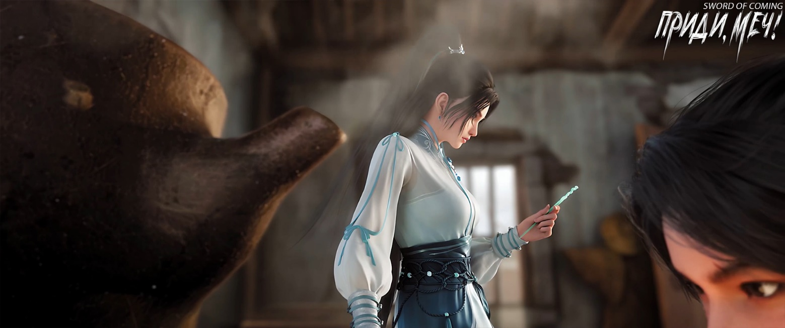
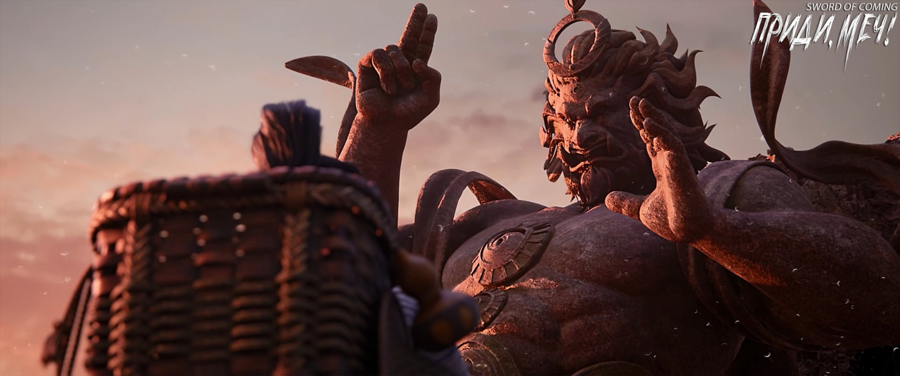
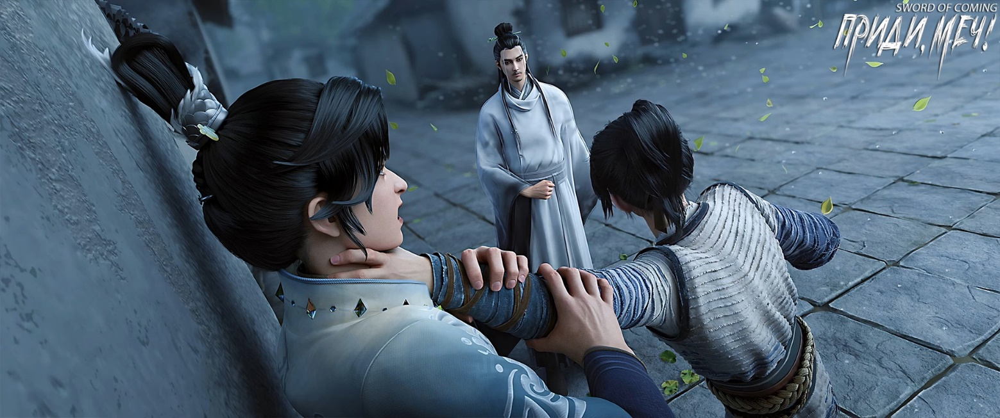

# Глава 27. Завершающий штрих

П/п.: Название главы «点睛» — дословно «поставить точку в глазу дракона».

※※※※

Вскоре после того, как Лю Сяньян прибыл в переулок Глиняных Кувшинов, туда пожаловал еще один редкий гость — изящный молодой ученый в синем халате по имени Чжао Яо, который имел некоторое сходство с учителем Ци Цзинчунем.

Чжао Яо был старшим внуком главной ветви семьи Чжао, одной из четырех великих семей городка. В отличие от таких праздных богатых юношей вроде Лу Чжэнчуня, Чжао Яо, также происходивший из богатой и знатной семьи, имел очень хорошую репутацию. Многие одинокие старики в городке получали от него помощь. Если сказать, что это была описанная в книгах тактика так называемого «благородного мужа, зарабатывающего уважение в народе», то это было бы слишком высокой оценкой устремлений Чжао Яо и немного походило бы на измерение благородного мужа мерками низкого человека. Ведь юноша с десяти лет проявлял такую доброту к людям, год за годом, нисколько не ослабевая. Даже старики с улицы Благоденствия и Достатка, которые видели, как рос молодой человек, поднимали большие пальцы вверх. Каждый раз, ругая своих детей, они приводили Чжао Яо в пример, что привело к тому, что у того было мало близких друзей среди сверстников.

Люди вроде Лу Чжэнчуня были свободолюбивы по натуре и не любили иметь дело с книжными червями, которые целыми днями говорили высокопарные слова. Представьте себе, все с энтузиазмом лезут на стену, чтобы подглядывать за хорошенькой вдовушкой, а кто-то рядом бубнит о неподобающем поведении — разве это не испортит все веселье? В общем, юный Чжао Яо в эти годы предпочитал общаться с людьми за пределами улицы Благоденствия и Достатка. Он обошел почти все большие и малые переулки, кроме переулка Глиняных Кувшинов. Все потому, что там жил Сун Цзисинь, ровесник, рядом с которым Чжао Яо часто чувствовал себя неполноценным.

Однако если говорить о друзьях, то, вероятно, он считал своим другом только Сун Цзисиня — партнера по игре в вэйци. Хотя за все эти годы он постоянно проигрывал, но дух соперничества — это дух соперничества, а стремление к победе — это стремление к победе. На самом деле, Чжао Яо в глубине души всегда восхищался выдающимся талантом Сун Цзисиня. Однако чувствовал и некоторое разочарование, потому что интуиция подсказывала, что хотя Сун Цзисинь и общался с ним непринужденно и близко, но, похоже, никогда не считал его настоящим другом.

Хотя Чжао Яо раньше не бывал в доме Сун Цзисиня, но как только он увидел определенный дом, то сразу понял, что это, несомненно, его дом. Это было из-за парных надписей, наклеенных на входе. Иероглифов было очень много, и с первого взгляда было ясно, что это почерк Сун Цзисиня. Причина была проста — стиль был слишком разнообразным, почти каждый иероглиф отличался от других. Например, два иероглифа «укрощать ветер» были написаны на одном дыхании, свободно, с ощущением легкости. Иероглиф «бездна» с ключом «вода» был особенно глубоким и протяжным. Иероглиф «удивительный» был написан с большим размахом, с огромной силой, подобно грому и молнии! А иероглиф «государство» написан правильно и гармонично, словно мудрец, сидящий прямо, без единого изъяна.

Чжао Яо стоял у ворот, почти забыв постучать, наклонившись вперед и очарованно глядя на эти иероглифы. Потеряв душу, он почувствовал, что у него почти не хватает смелости постучать в дверь. Именно потому, что он усердно практиковался в каллиграфии и копировал многочисленные образцы, он еще больше осознавал огромную силу, вес и величие духа, заключенные в этих иероглифах.

Чжао Яо был подавлен и опечален. Он достал мешочек с деньгами, наклонился, положил его у двери и собрался уйти, не попрощавшись.

В этот момент ворота внезапно открылись, и Чжао Яо поднял голову. Сун Цзисинь, казалось, собирался выйти вместе со своей служанкой Чжигуй, они весело разговаривали и смеялись.

Сун Цзисинь притворился удивленным и шутливо спросил:

— Чжао Яо, ты оказываешь такие почести, чего ты хочешь добиться?

Чжао Яо смущенно поднял кошелек и уже собирался объяснить причину, но Сун Цзисинь быстро забрал у него вышитый мешочек и с улыбкой сказал:

— Ого, Чжао Яо пришел с подарком! Принимаю, принимаю. Но заранее предупреждаю, я из бедной семьи и у меня нет достойного подарка для брата Чжао. Придется нарушить правила приличия и не отдаривать в ответ.

Чжао Яо горько улыбнулся:

— Пусть этот мешочек с монетами для подавления зла будет моим прощальным подарком, не нужно ничего дарить в ответ.

Сун Цзисинь повернулся к своей служанке с понимающей улыбкой и передал ей мешочек:

— Видишь, я же говорил, что Чжао Яо — самый воспитанный ученый в нашем городке, ну как?

Чжигуй, приняв мешочек, прижала его к груди и улыбнулась, прищурив глаза от радости. Она слегка наклонилась в поклоне и сказала:

— Благодарю молодого господина Чжао. Мой хозяин говорил, что у добродетельной семьи будет счастье в избытке, а у того, кто творит добро, будет благодатное поле. Позвольте служанке пожелать молодому господину Чжао высокого положения и великих свершений.

Чжао Яо поспешно ответил на приветствие и поклонился:

— Благодарю юную госпожу Чжигуй за добрые слова.

Сун Цзисинь, почесывая затылок и зевая, сказал:

— Вы не устали?

Чжигуй с улыбкой ответила:

— Если бы каждый раз можно было получить мешочек денег, эта служанка не устала бы и от десяти тысяч поклонов.

Чжао Яо смущенно произнес:

— Боюсь, юной госпоже Чжигуй придется разочароваться.

Сун Цзисинь махнул рукой:

— Пойдем, выпьем!

Чжао Яо выглядел озадаченным, и Сун Цзисинь подначил его:

— Ты просто мешок с соломой! Читаешь книги, но усваиваешь только мертвые правила, не понимая духа ученого-свободомыслящего. Как так можно?

Чжао Яо осторожно спросил:

— Может, немного выпить для поднятия настроения?

Сун Цзисинь закатил глаза:

— Нет, напиться до беспамятства!

Чжао Яо хотел что-то сказать, но Сун Цзисинь обхватил его за шею и потащил прочь.

Когда служанка Чжигуй запирала дверь, четвероногая змея попыталась незаметно выскользнуть, но она пнула ее обратно во двор.

Проходя мимо соседнего дома, она осторожно приподнялась на цыпочки и искоса взглянула несколько раз, увидев высокую фигуру Лю Сяньяна. Тот тоже заметил ее и сразу же расплылся в сияющей улыбке. Лю Сяньян хотел было поздороваться с ней, но она уже отвела взгляд и быстро ушла.

В городке была винная лавка, хоть и небольшая, но расходы на ее содержание были немалыми. Однако Чжао Яо все же являлся отпрыском семьи Чжао и имел хорошую репутацию. Хозяин ресторана, известный своей скупостью, сегодня почему-то повел себя необычно. Он ударил себя в грудь и заявил, что не возьмет ни копейки, сказав, что для его заведения большая честь принимать двух ученых мужей, и что это они должны брать с него деньги. Сун Цзисинь тут же с улыбкой протянул руку, требуя серебра. Хозяин, чувствуя себя неловко, попытался найти выход из ситуации, сказав:

— Давайте запишем в долг, а завтра я пришлю молодому господину Сун несколько кувшинов хорошего вина.

В тот момент Чжао Яо был готов провалиться сквозь землю. Хозяин, хорошо знавший странный характер молодого господина Суна из переулка Глиняных Кувшинов, на самом деле не рассердился и лично нашел для троих тихое место у окна на втором этаже.

Сун Цзисинь и Чжао Яо мало разговаривали, и Сун Цзисинь не настаивал на том, чтобы пить, что показалось Чжао Яо, который был готов к худшему, очень странным.

Из окна второго этажа винной лавки можно было как раз увидеть одну из табличек на двенадцатиногой мемориальной арке: «В гуманности нельзя уступать».

Сун Цзисинь спросил:

— Учитель Ци действительно не уезжает с тобой из городка?

Чжао Яо кивнул:

— Учитель внезапно изменил свои планы. Он сказал, что останется в школе, чтобы закончить преподавание предпоследней главы «Знание ритуалов».

Сун Цзисинь задумчиво произнес:

— Значит, учитель Ци собирается преподать важный урок, передавая учение величайшего мудреца конфуцианства людям. Он расскажет нам, что изначально в мире не было законов, и мудрецы использовали ритуалы для просвещения всех живых существ. В те времена правители почитали ритуалы, считая, что нарушение принципов приводит к наказанию. Так появились законы, ритуалы и законы, сначала ритуалы, затем законы…

Чжао Яо, уже слегка опьяневший и с нечеткой речью, спросил:

— Ты считаешь это правильным? И почему учитель не преподает сразу последнюю главу «Строгое соблюдение ритуалов»?

Сун Цзисинь ответил не по существу:

— Перед тем как покинуть городок, помни: горные демоны и водяные, небожители и духи — если веришь, они существуют, если не веришь — их нет. Что касается того, как учитель Ци преподает и как ученики слушают, пусть каждый следует своей судьбе.

Служанка Чжигуй тоже выпила бокал вина и выглядела очаровательно в своем слегка опьяневшем состоянии. Она ни разу не взглянула на величественную мемориальную арку.

Двенадцатиногая мемориальная арка имела каменные основания колонн в виде девяти разных мифических существ, известных как девять сыновей дракона, а также Белого Тигра, Черного Воина и Красной Птицы. Местные жители, поколениями живущие здесь, давно привыкли к этому зрелищу.

Чжао Яо не удержался и икнул, пошатываясь встал и сказал:

— Прощаюсь с тобой, надеюсь на новую встречу.

Сун Цзисинь, подумав, тоже встал и с улыбкой произнес:

— Мы обязательно встретимся снова. Чжао Яо, не печалься, что на пути впереди нет единомышленников.

Чжао Яо, у которого уже двоилось в глазах, прикусив язык, искренне сказал:

— Сун Цзисинь, ты тоже скорее покинь городок. Кто в Поднебесной не знает тебя? У тебя обязательно все получится!

Сун Цзисинь явно не воспринял это всерьез и махнул рукой:

— Иди уже, иди. Пьяные речи сплошной позор для ученого мужа.

После того как Чжао Яо и Сун Цзисинь вышли из ресторана, они разошлись в разные стороны. Перед уходом Чжао Яо, видимо набравшись храбрости от выпитого, спросил:

— Сун Цзисинь, не хочешь ли взглянуть на резиденцию смотрителя гончарных мастерских? Я могу уговорить привратника…

Сун Цзисинь с холодным лицом процедил сквозь зубы одно слово:

— Проваливай!

Чжао Яо удалился с унылым видом.

Служанка Чжигуй, глядя вслед уходящему, тихо сказала:

— Молодой господин, он ведь из лучших побуждений.

Сун Цзисинь холодно усмехнулся:

— Разве мало в мире случаев, когда добрые намерения хороших людей в итоге приводят к плохим делам и дурным последствиям?

Она задумалась и, решив, что это действительно скучная, но верная истина, не стала настаивать.

Улица Благоденствия и Достатка, где жил Чжао Яо, находилась в северной части городка, а переулок Глиняных Кувшинов — в западной части, где селились бедняки. Когда Сун Цзисинь и служанка Чжигуй проходили рядом с мемориальной аркой, Чжигуй подняла голову и увидела, что табличка с надписью «Ци, достигающая созвездия Северного Ковша» уже выглядит как дряхлый старик. Она, чье настоящее имя было Ван Чжу, улыбнулась, не показывая зубов.

Когда Чжао Яо вернулся в родовое поместье на улице Благоденствия и Достатка, слуга сообщил ему, что почтенный предок ждет его в кабинете, и он должен немедленно идти туда, не задерживаясь ни на минуту. Молодой ученый, от которого разило алкоголем, сразу почувствовал себя неловко, но все же направился в кабинет.

Семья Чжао в городке держалась скромно, не выставляя напоказ свое богатство, в отличие от семьи Лу с их показной роскошью. Чжао гордились своими учеными традициями, поэтому кабинет был оформлен в старинном стиле.

Старуха с тростью стояла у письменного стола, поглаживая столешницу. На ее испещренном морщинами лице отражалась печальная ностальгия.

Почуяв сильный запах алкоголя от старшего внука, старуха не рассердилась, а с улыбкой поманила его:

— Яо, заходи, чего стоишь в дверях? Подумаешь, мужчина выпил немного, это же не лошадиная моча, нечего стыдиться!

Чжао Яо с горькой улыбкой переступил порог и почтительно поклонился почтенной прародительнице. Старуха нетерпеливо сказала:

— Вот что плохо в чрезмерном чтении книг — слишком много правил и ограничений. Из-за этого ученые люди всю жизнь словно ходят по кругу, это так утомительно. Взять хотя бы твоего деда — во всем был лучшим, но когда начинал рассуждать о великих истинах, становился таким занудным, просто невыносимо. Особенно его манеры и выражение лица, ух, так и хотелось стукнуть. Но я никак не могла переспорить его, прямо хотелось огреть тростью…

Старуха вдруг рассмеялась над собой:

— Ой, чуть не забыла, тогда-то мне трость и не нужна была.

Она с улыбкой спросила:

— Что, пил с этим неблагодарным щенком из семьи Сун?

Чжао Яо беспомощно ответил:

— Бабушка, сколько раз я тебе говорил, Сун Цзисинь очень талантлив, у него острый ум, он всегда на шаг впереди других в учебе.

Старуха презрительно усмехнулась:

— Он-то, конечно, умнее всех, но твой дед еще при жизни разгадал этого малого, хочешь знать, что он сказал?

Чжао Яо поспешно ответил:

— Внук не хочет знать!

Старухе было все равно, хочет ли любимый внук слушать или нет, и она продолжала:

— Твой дед сказал: «В таком юном возрасте, а уже такой хитрый и расчетливый. Жаль только, что именно он погубит репутацию предков».

Затем она указала на Чжао Яо:

— А о тебе твой дед сказал: «Кроткий, добрый, почтительный и скромный, хоть и ничем не выдающийся, но именно он укрепит дух потомков нашего рода!»

Закончив, старуха усмехнулась:

— Старый хрыч всю жизнь был таким язвительным, но под конец наконец-то сказал что-то приятное.

Озадаченный Чжао Яо только хотел что-то сказать, как услышал, что бабушка вздохнула:

— Ох, стара я стала, стара!

Чжао Яо пришлось промолчать и с улыбкой подойти, чтобы поддержать бабушку под руку:

— Бабушка, вы еще очень молоды, пусть ваша жизнь будет долгой, как Южные горы.

Старуха погладила своей сухой рукой тыльную сторону ладони любимого внука:

— Лучше твоего деда. Не только умеешь говорить о всяких глупых принципах, но и приятные слова сказать можешь.

Чжао Яо с улыбкой сказал:

— Дедушка действительно был очень образованным. Учитель Ци тоже говорил, что у деда был правильный подход к учению, особенно в понимании иероглифа «долг».

Не в силах скрыть самодовольства, старуха тут же выдала себя, хотя и попыталась притвориться равнодушной:

— А как же иначе! Не зря же я выбрала такого мужчину!

Чжао Яо плотно сжал губы, сдерживая смех.

Старуха подвела Чжао Яо к стулу за письменным столом. Чжао Яо заметил, что на столе стоит очень реалистичная деревянная статуэтка дракона. Однако, присмотревшись внимательнее, он обнаружил, что у зеленого деревянного дракона были глаза, но не было зрачков.

Старуха взяла кисть, уже обильно смоченную тушью. Это была новая тонкая кисть с ручкой из ветки старой софоры. Она протянула ее слегка дрожащими руками своему старшему внуку.

Когда Чжао Яо, ничего не понимая, взял кисть, он почувствовал тяжесть на плечах — это бабушка положила руку ему на плечо. Он сел на место, предназначенное только для главы семьи Чжао.

Старуха отступила на шаг назад и с величайшей торжественностью произнесла:

— Чжао Яо, садись! Сегодня ты от имени всех предков семьи Чжао нарисуешь дракону зрачки!

※※※※

Многочисленные разрушенные глиняные статуи богов в беспорядке лежали на земле, заросшей сорняками, и никто не обращал на них внимания. Так было на протяжении тысячелетий, и сюда постоянно попадали новые глиняные изваяния. Жители городка не только привыкли ко многим странным вещам, но и давно уже не испытывали особого почтения к этим статуям.

Старики иногда ворчали, говоря своим детям не играть в этом месте, но малыши все равно любили приходить сюда, чтобы играть в прятки, ловить сверчков и заниматься другими забавами. Возможно, когда эти дети вырастут и состарятся, они тоже будут говорить своим детям не играть здесь. Так продолжалось из поколения в поколение, без каких-либо потрясений или волнений, обыденно и непримечательно.

Здесь можно было увидеть раскатившиеся головы, разбитые туловища, отделенные руки, которые, казалось, кто-то с трудом пытался собрать вместе, чтобы хоть как-то сохранить их первоначальный вид. Но даже это едва ли спасало их достоинство.

Чэнь Пинъань прибежал сюда второпях из переулка Глиняных Кувшинов. В его руке были крепко зажаты три монеты для подношения. Прибыв на место, он долго ходил кругами, что-то бормоча себе под нос, а затем с удивительной ловкостью нашел одну из статуй. Он присел, огляделся вокруг, и, убедившись, что никого нет, тихонько положил монету в трещину разбитой статуи. Затем он встал и проделал то же самое со второй и третьей статуями.

Перед уходом Чэнь Пинъань остановился один посреди густой зеленой травы, сложил руки и, склонив голову, прошептал:

— Мира и спокойствия, мира и спокойствия из года в год[1]. Пожалуйста, благословите моих родителей, чтобы в следующей жизни им не пришлось страдать… И если можно, передайте им, что сейчас у меня все хорошо, пусть не беспокоятся…

[1] «碎» (суй) — это омофон (слово, одинаково звучащее) иероглифа «岁» (суй), означающего «год». Когда что-то разбивается, люди говорят «碎碎平安» (суй-суй пинъань), чтобы утешить человека, чья вещь разбилась. Это созвучно с «岁岁平安» (суй-суй пинъань), что означает «мир и благополучие из года в год». Также во время Нового года, когда что-то разбивается, чтобы не накликать беду, люди произносят эту фразу. Ну и имя Чэнь Пинъаня тоже так звучит, и его можно более «литературно» перевести как «Безмятежный».