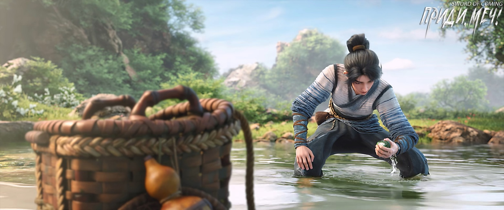

# Глава 29. Лисье очарование

Чэнь Пинъань шел по тропинке, усыпанной мелкими звездными бликами, и вышел из городка, направляясь к ручью. Хотя было темно, Чэнь Пинъань бежал не медленнее, чем днем. Он намеренно обошел крытый мост, где вода была намного выше, чем в других местах. Чэнь Пинъань выбрал участок ручья, где вода доходила лишь до колен, снял с спины большую плетеную корзину из бамбука, наклонился и достал спрятанную внутри маленькую бамбуковую корзинку, крепко привязал ее к поясу, снял соломенные сандалии, закатал штанины и только тогда вошел в воду, чтобы искать камни.

Рана на его левой руке, порезанной осколком фарфора, все еще болела, поэтому он не мог погружать ее в воду и использовал только правую руку, чтобы переворачивать и выбирать камни в ручье. На самом деле, камни в высохшем русле реки было собирать легче всего, но, как сказал Лю Сяньян, их цвет сильно выцветал. Теперь Чэнь Пинъань узнал от Нин Яо кое-какие секреты и понял, что эти камешки были похожи на почву с различных горных вершин, которую он пробовал на вкус в ранние годы, когда путешествовал через горы и долины со стариком Яо. Казалось бы, обычная земля, но в некоторых местах, даже если их разделяла всего одна гора, во рту она имела совершенно разный вкус.

Старик Яо говорил, что это называется «дерево пересадишь — умрет, человека переселишь — оживет, а глина, сменив место, станет Буддой»[1]. Горсть земли, взятая в руку, как только покидает родную почву, быстро меняет свой вкус.

[1] Идиома, означающая, что изменение обстоятельств может полностью изменить сущность вещей.

У ручья не было названия, а камешки в нем, размером от кулака до большого пальца, были всех цветов радуги. Но жители городка, поколение за поколением привыкшие видеть их спокойно лежащими в прозрачной воде, естественно, не считали их чем-то особенным. Если бы кто-то стал таскать эти камни домой, его бы точно сочли дураком, у которого от безделья крыша поехала. Если есть силы, лучше бы больше работал в поле, а не занимался глупостями.

Чэнь Пинъань, нагнувшись и бродя по воде, постоянно отодвигал и переворачивал большие камни на дне. Он уже собрал семь-восемь камешков разного размера и цвета в бамбуковую корзинку. Некоторые были золотисто-желтыми, как осенние апельсины, висящие на ветвях, некоторые — белыми и нежными, как кожа младенца, некоторые — черными и блестящими, как смоль, а некоторые — ярко-красными, как персиковый цвет. Больше всего было камней цвета «спинки креветки»[2]. Все они были разными.

[2]Фраза «虾背青» означает сине-зеленый или цвет морской волны.

Камешки, которые местные жители называли «змеиной желчью», в основном были небольшими, скользкими и тяжелыми на ощупь. Если поднять их высоко на солнце днем или осветить свечой глубокой ночью, можно разглядеть внутреннюю текстуру камня до мельчайших деталей. Узоры напоминали тончайшие шелковые нити или извивающихся змей и рыб. Если посмотреть с небольшого расстояния, их поверхность блестела, как рыбья или змеиная чешуя.

Примерно через час рыбацкая корзина на поясе Чэнь Пинъаня была почти полна. Он вернулся к тому месту на берегу, где оставил большую корзину и соломенные сандалии. Сначала он набрал на берегу несколько пучков тростника, дикого сельдерея и травы «собачий хвост» и выстелил ими дно большой корзины, а затем осторожно, один за другим, переложил в нее камни. Взяв сандалии в руку, привязав рыбацкую корзину к поясу и взвалив большую корзину на спину, он поднялся на берег и пошел дальше. Дойдя до того места на берегу, где он ранее повернул обратно, он снова отложил сандалии и корзину и снова спустился в ручей, чтобы продолжить переворачивать камни.

Набрав полкорзины, Чэнь Пинъань выпрямился и поднял голову, глядя на звездное небо в надежде увидеть падающую звезду, пересекающую ночное небо. Однако сегодня ему явно не так повезло. Придя в себя, Чэнь Пинъань, полагаясь на слабый свет звезд и свое превосходное зрение, продолжил делать то, что должен делать одержимый деньгами человек.

Каждый раз, когда ему удавалось найти подходящий камешек, его охватывала радость. Для него каждый камешек был словно частичка надежды.

Незаметно для себя Чэнь Пинъань уже собрал большую часть корзины камней, всего более восьмидесяти штук. Самый большой из них был крупнее его кулака, практически без трещин и изъянов, с очень яркой окраской, напоминающий сгусток куриной крови. Цвет был насыщенным и правильным, но при этом не вызывал неприятных ощущений. Теперь Чэнь Пинъань шел по берегу к следующему участку ручья, играя в руке камешком «змеиной желчи» среднего размера. Он был светло-зеленого цвета, намного бледнее, чем цвет «зеленой сливы» на фарфоре городка. Камень был круглым и гладким, очень милым, и Чэнь Пинъань сразу же полюбил его.

Он направился к огромной зеленой скале на берегу. У подножия вода была особенно глубокой. Самая глубокая яма достигала высоты двух Чэнь Пинъаней — это было второе по глубине место в ручье после омута под крытым мостом. В знойные летние дни дети из городка часто купались тут, а хорошо плавающие юноши любили соревноваться, кто дольше продержится на дне ямы.

Чэнь Пинъань выбрал это место потому, что раньше, когда они с Лю Сяньяном купались здесь, они обнаружили, что на дне лежит множество камней «змеиной желчи». Однажды Лю Сяньян, чтобы похвастаться своими плавательными способностями, даже намеренно всплыл, зажав под мышкой один из таких камней. Чэнь Пинъань помнил, что тот камень был размером как минимум с голову Гу Цаня, слегка белый и прозрачный, а внутри него были тонкие красные точки, похожие на замороженные лепестки цветков персика.

Лю Сяньян тогда посчитал это значимым и попросил Чэнь Пинъаня помочь ему отнести такой большой камень домой. Однако, когда они дошли до городка, непостоянный Лю Сяньян снова потерял интерес и предложил Чэнь Пинъаню самому решить, что делать с находкой. Когда Чэнь Пинъань только вошел в переулок Глиняных Кувшинов, он обнаружил, что Чжигуй из соседнего дома почему-то следует за ним, не говоря ни слова и пристально глядя на камень в его руках. Ее взгляд был похож на тот, с которым Чэнь Пинъань смотрел на мясные пирожки, продаваемые в переулке Цветущих Абрикосов. Чэнь Пинъань не мог выдержать ее жадного взгляда и отдал камень ей. Однако сначала она не могла его поднять и чуть не уронила себе на ногу. Пришлось отнести камень во двор дома Сун Цзисиня. Что случилось с камнем после этого, Чэнь Пинъань не знал.

Камень был чист и прозрачен, как вода, а персиковые лепестки, казалось, плавали внутри него. Прямо как персиковые цветы после дождя в переулке Персиковых Листьев, с их ярким и свежим цветом.

Даже если до сегодняшнего дня Чэнь Пинъань совершенно не понимал тайны этих камней, он всегда искренне считал, что тот большой камень был действительно красивым.

Чэнь Пинъань вздохнул и внезапно остановился.

В тридцати шагах от него, на скале у ручья, сидела девушка в зеленой одежде. Ее щеки были надуты, но она все еще продолжала запихивать что-то себе в рот.

Первая мысль, пришедшая в голову Чэнь Пинъаню, была о том, что девушка, должно быть, переродилась из голодного духа, раз уж она так жалко проголодалась посреди ночи.

Подумав, Чэнь Пинъань решил не подходить ближе, опасаясь нарушить настроение девушки во время ее полуночной трапезы. Однако он и не повернул назад, ведь уже твердо решил, что сегодня ночью обязательно попытает удачу в той яме. Хотя Чэнь Пинъань плавал не так хорошо, как Лю Сяньян, но и не так уж плохо. Если каждый раз доставать со дна один-два камня, то при достаточном количестве попыток в конце концов добьешься успеха. Кроме того, камни «змеиной желчи» в этой яме были больше и, казалось, ярче по цвету, чем в других местах ручья.

Чэнь Пинъань не ожидал, что незнакомая девушка, закончив есть одно, тут же возьмет другое, не давая себе передышки, и ее щеки постоянно были надуты. Чэнь Пинъань, неся на спине тяжелую корзину, наполовину заполненную камнями, подумал, что ему предстоит физическая работа по поиску камней в воде, и повернулся, чтобы снять корзину и поставить ее на землю.

Но он недооценил слух незнакомки. Как только он тихо опустил корзину, девушка внезапно навострила уши, и ее взгляд мгновенно метнулся в его сторону.

Чэнь Пинъаню было неловко сказать: «Юная госпожа, не торопитесь, ешьте спокойно», поэтому он только смущенно улыбнулся.

Выражение лица девушки было несколько ошеломленным. Она дважды громко рыгнула, а затем, похоже, подавилась. Она быстро выпрямилась и начала изо всех сил хлопать себя по груди.

Только тогда Чэнь Пинъань заметил, что хотя девушка весьма юная, пейзаж ниже ее шеи поистине впечатляющий. Одежда на ее груди была сильно натянута, не уступая многим женщинам, уже родившим детей.

Чэнь Пинъань поспешно отвел взгляд, не позволяя себе никаких непристойных мыслей.

Девушка в зеленом вспомнила, что у нее есть фляга с водой. Она не забыла повернуться спиной к Чэнь Пинъаню, запрокинула голову и сделала большой глоток воды, после чего ее дыхание наконец пришло в норму.

Чэнь Пинъань, державший в руках соломенные сандалии, в тот момент подумал лишь об одном: ткань одежды девушки определенно не дешевая, иначе бы не выдержала такого напряжения.

Девушка в зеленом одеянии продолжала есть, на этот раз более сдержанно, по крайней мере, ее щеки не были так заметно раздуты. Она опустила голову и откусывала маленькими кусочками, время от времени искоса поглядывая на странного юношу из городка. Ее узкие вытянутые глаза, похожие на цветки персика, с чуть приподнятыми уголками, делали ее похожей на молодую лисичку-оборотня.

Казалось, своим взглядом она спрашивала Чэнь Пинъаня: что случилось, почему не продолжаешь свой путь?

Чэнь Пинъань с беспомощным выражением лица указал рукой на ручей за скалой и воскликнул:

— Я здесь не просто проходил мимо, я хочу перейти на ту сторону, к ручью.

Девушка молча смотрела на худощавого Чэнь Пинъаня.

Чэнь Пинъань поспешно достал камешек из корзины и продолжил объяснять:

— Я хочу пойти к ручью, чтобы собирать эти камни.

Девушка, словно внезапно вспомнив о чем-то важном, приложила палец к губам, призывая Чэнь Пинъаня к молчанию, затем подвинулась, очевидно, позволяя ему пройти, и показывая, что не будет мешать ему собирать камни в воде.

Чэнь Пинъаню пришлось взвалить корзину на спину и, собравшись с духом, пройти мимо. К счастью, зеленая скала была достаточно большой и могла вместить более десяти человек. К тому же девушка уже сама пересела к краю и, в отличие от прежней позы с вытянутыми ногами, теперь сидела чинно, скрестив ноги. На ее коленях лежал развернутый сверток, доверху наполненный разнообразными пирожными и закусками, напоминая маленькую гору. На данный момент девушка съела лишь верхушку этой маленькой горы.

Чэнь Пинъань положил соломенные сандалии, большую корзину и бамбуковую корзинку. Изначально он планировал раздеться до пояса и войти в воду глубокой ночью, но теперь об этом не могло быть и речи. Рядом сидела незнакомая юная девушка желтого цветка[3], и дело было не только в том, что она могла закричать — если бы ее старшие родственники увидели или услышали об этом, Чэнь Пинъань полагал, что ему бы совершенно заслуженно переломали обе ноги.

[3] Девушка желтого цветка (黄花大闺女)— это почтительное и поэтичное обращение к молодой незамужней девушке, подчеркивающее ее красоту, невинность и готовность к браку. Это выражение часто используется в классической китайской литературе и поэзии. Желтый цветок (黄花) — символизирует чистоту и невинность. 大闺女 — взрослая девушка, достигшая брачного возраста. В древнем Китае девушки обычно выходили замуж в возрасте от 15 до 20 лет.

Чэнь Пинъань подошел к краю скалы и, нырнув головой вперед, погрузился на дно водоема. Вскоре он нащупал камень размером с ладонь, но, к сожалению, это был не камень «змеиной желчи». Вытерев лицо, он продолжил нырять. После третьей попытки наконец нащупал сине-черный камень. Весь мокрый, он взобрался на скалу, положил камень в корзину, а затем снова нырнул в воду.

Все это время девушка сидела спиной к нему, занятая едой.

Менее чем за полчаса Чэнь Пинъань нашел семь или восемь камней. За исключением первого, который был темноватым, остальные были крупными и яркими.

В последний раз нырнув, он поднялся на поверхность не с камнем, а с живой рыбой длиной с ладонь, которую в городке называли каменной рыбой[4]. Ее мясо было очень вкусным, но при виде людей она обычно пряталась под камнями. Как правило, такие рыбы были чуть длиннее пальца, редко встречались такие крупные экземпляры, как тот, что держал Чэнь Пинъань. Раньше он уже нащупывал несколько таких рыб в щелях между камнями на дне, но тогда отпускал их, так как был занят поиском цветных камешков.

[4] 石板鱼 — каменный окунь, плоская рыба. Возможно речь о групперах, или каком-то виде окуней.

В этот раз его осенило: он внезапно подумал, что если поймать сегодня ночью с десяток рыб и завтра сварить рыбный суп для юной госпожи Нин, это было бы неплохо.

Выбравшись на берег, Чэнь Пинъань небрежно бросил рыбу в бамбуковую корзину.

Когда он во второй раз поймал рыбу и вышел на берег, то внезапно заметил, что девушка присела рядом с корзиной. Глядя на одиноко лежащую там рыбу, ее лицо просияло — почти так же, как когда-то у Чжигуй, увидевшей тот камень в переулке.

Чэнь Пинъань бросил вторую каменную рыбу в бамбуковую корзину.

Девушка медленно подняла голову. Босой Чэнь Пинъань уже развернулся и быстрым шагом направился обратно, снова спускаясь в ручей.

Услышав всплеск от прыжка Чэнь Пинъаня, девушка быстро схватила обеими руками по рыбе из корзины. Глядя на все еще трепыхающихся рыбешек, она серьезно кивнула и сказала:

— Потрясающе, просто потрясающе!

Девушка в зеленом знала, что в этом маленьком городке много странных вещей: в переулке Цветущих Абрикосов находился колодец с железной цепью, длину которой никто не знал; неподалеку стоял крытый мост, прежде бывший каменным арочным мостом, что пересекал ручей уже три тысячи лет, а под мостом лежал покрытый ржавчиной железный меч, острие которого указывало на бездонный изумрудный пруд Зеленой Воды. Была еще Крабовая арка на двенадцати ножках-колоннах; в траве возле родового храма валялись разбросанные в беспорядке разрушенные глиняные статуи; на севере располагалась Фарфоровая гора, где громоздились разбитые вдребезги изделия всех династий, которые на протяжении многих династий чиновники по надзору за производством признали бракованными, и так далее.

Она даже знала причины появления большинства этих явлений.

С раннего возраста она следовала за своим отцом, путешествуя по югу и северу, поэтому ее по праву можно было назвать человеком, повидавшим мир.

Когда Чэнь Пинъань в третий раз вышел на берег с пойманной рыбой, девушка, чьи руки теперь были пусты, все еще сидела на корточках возле корзины, лишь украдкой вытирая ладони о края одежды. Она подняла голову, глядя на приближающегося Чэнь Пинъаня взглядом, каким простые люди смотрят на небожителей.

Чэнь Пинъань, чувствуя себя неловко от ее странного взгляда, осторожно спросил:

— Ты хочешь эту рыбу?

Девушка инстинктивно энергично закивала.

Чэнь Пинъань улыбнулся и сказал:

— Тогда забирай все три. Я потом еще наловлю.

Девушка моргнула, а затем радостно улыбнулась, похожая на очаровательную лисичку-оборотня.