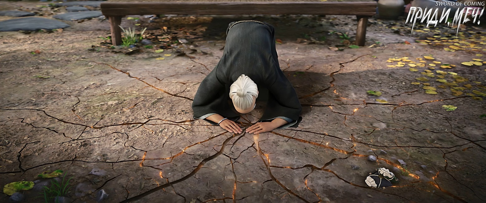

# Глава 30. Темная комната

Чэнь Пинъань был хорошо знаком с таким взглядом — точно таким же он сам смотрел в детстве на Лю Сяньяна. В то время Лю Сяньян был заводилой среди детей в переулках Цветущих Абрикосов и Глиняных Кувшинов. Он ловил змей, птиц и рыбу, и казалось, не существует ничего в мире, чего бы он не умел.

Позже те сверстники, что раньше следовали за Лю Сяньяном как свита, разошлись разными путями: некоторые пошли учениками в драконову печь, большинство устроились подмастерьями в городские лавки или помогали родственникам вести счета. Были и такие, о ком говорил Сун Цзисинь, — самые никчемные люди, что пошли копаться в полях ради пропитания. В итоге рядом с Лю Сяньяном остался только он один.

Чэнь Пинъань нанизал три пойманные плоские рыбы на несколько травинок, продев их через жабры, и протянул девушке. Она взяла связку рыб, взвесила в руке и поняла, что улов легковат — явно недостаточно для целой тарелки жареной рыбы с зеленым перцем. Девушка склонила голову и с надеждой посмотрела на небольшую заводь.

Чэнь Пинъань понял ее без слов и извиняющимся тоном сказал:

— Рыба, которую я еще поймаю, нужна мне для супа, чтобы подкрепить силы друга. Я не смогу ее тебе отдать.

Девушка указала на открытую упаковку неподалеку, намекая, что может обменять пирожные на рыбу. Чэнь Пинъань, улыбаясь, покачал головой:

— Нет, пирожные вкусные и могут насытить желудок, но они не так полезны для здоровья, как рыбный суп.

Девушка кивнула, не настаивая. Молча вернувшись на свое место, она осторожно положила рыбу у ног и продолжила свое великое дело — «сидеть и опустошать гору»[1].

[1] 坐吃山空 — идиома, дословно: сидя, поглощать гору. В переносном смысле: бездельничать и проматывать состояние.

Хотя Чэнь Пинъань был заинтригован ее личностью, он не стал расспрашивать. Судя по одежде, она не походила на юную госпожу с улицы Благоденствия и Достатка или переулка Персиковых Листьев, а больше напоминала соседку Чжигуй — изящную и утонченную, но неразговорчивую.

Внезапно Чэнь Пинъаня охватило беспокойство: не могла ли она быть служанкой, которая украла еду из дома, чтобы поесть? Он знал, что правила в больших особняках очень строги. Лю Сяньян и Сун Цзисинь всегда любили говорить обратное тому, что думали, но в этом вопросе были единодушны.

Лю Сяньян рассказывал страшные вещи. По его словам, в домах с высокими стенами управляющий с глазами хищной птицы может приказать сломать служанке ноги и выбросить ее за стену умирать, если она идет неправильной походкой. Сун Цзисинь возражал, что Лю Сяньян преувеличивает и распускает ложные слухи. Просто служанки в богатых домах ходят тихо, словно кошки.

В тот момент Лю Сяньян заметил, что служанка Чжигуй тайком посмеивается, и тут же от стыда разгневался, громко ругая Сун Цзисиня:

— Какой еще гусь? Разве гуси в твоем доме умеют говорить?

В конце концов Чэнь Пинъань поймал семь-восемь каменных рыб, и бамбуковая корзина раскачивалась от их ударов. Лицо юноши стало мертвенно-бледным — он знал, что почти достиг своего предела. Весенняя вода пронизывала до костей, но главное, что его раненая рука уже не выдерживала.

После последнего выхода на берег Чэнь Пинъань быстро спрыгнул с зеленого каменного утеса, нырнул в заросли травы у ручья, производя шуршащие звуки, и вскоре вытащил три-четыре вида растений. На многих корнях осталась земля, и в его ладони оказалась большая горсть.

Он подобрал обычный камешек и, вернувшись к скале, нашел на ней естественное углубление размером с ладонь. Тщательно вытерев и очистив его, начал осторожно толочь травы. Вскоре они превратились в зеленую кашицу, сок которой источал уникальный весенний аромат прибрежных диких трав.

Повернувшись спиной к девушке, Чэнь Пинъань глубоко вдохнул, стиснул зубы и начал разматывать хлопковую ткань на левой руке. На его лбу быстро выступил пот, смешиваясь с холодной водой ручья, стекавшей с волос. Уродливая рана, хоть и выглядела чуть лучше, чем когда были видны кости, но по-прежнему производила ужасающее впечатление.

Чэнь Пинъань не предполагал, что его левая рука коснется воды, поэтому не приготовил полоски хлопковой ткани. Раньше он думал только о том, как заработать на камне «змеиной желчи» и сварить рыбный суп. Теперь он осознал, что совершил большую ошибку.

Внезапно перед его глазами появилась ладонь с несколькими сухими чистыми полосками ткани. Оказалось, девушка в зеленом одеянии незаметно оторвала часть своего рукава. Чэнь Пинъань горько улыбнулся и, не церемонясь, нанес травяную мазь на рану, зажал один конец ткани зубами, правой рукой натянул ее и ловким движением обернул вокруг тыльной стороны ладони. Его движения были одновременно методичными и изящными, словно бабочка, порхающая вокруг ветки, что вызвало головокружение у наблюдателя.

Закончив перевязку, Чэнь Пинъань медленно поднял правую руку, чтобы вытереть пот с лица. Обе его руки продолжали дрожать, не поддаваясь контролю.

Девушка в зеленом, сидевшая рядом на корточках, показала ему большой палец с выражением лица, говорящим «ты молодец».

Чэнь Пинъань указал правой рукой на глаза и горько усмехнулся:

— На самом деле, от боли у меня даже слезы потекли.

Девушка бросила взгляд на большую плетеную корзину и бамбуковую корзину для рыбы, которые сплел Чэнь Пинъань, и выглядела немного озадаченной.

Чэнь Пинъань смущенно объяснил:

— На этих камнях можно заработать, да и ловить рыбу тоже очень важно.

Девушка выглядела растерянной, но по-прежнему не проронила ни слова. Ее взгляд немного расфокусировался, и она повернула голову, устремив глаза на сверкающую воду ручья. Журчащий поток обтекал выступающие камни, создавая тихую мелодию.

В тот момент звезды сияли ярко, мир был необъятно тих и пуст, и казалось, что во вселенной существуют только эти юноша и девушка.

Тело Чэнь Пинъаня постепенно успокоилось и пришло в равновесие. Его прежде учащенное дыхание непроизвольно замедлялось, становясь глубоким и протяжным. Словно бурный горный поток превращался в тонкий ручеек в засушливый осенний сезон.

Эти постепенные изменения Чэнь Пинъань совершенно не заметил — они произошли естественно и непринужденно, подобно воде, спокойно текущей по руслу.

Чэнь Пинъань понимал, что промок насквозь и не может долго находиться под холодным весенним ветром. Ему необходимо было быстро вернуться в городок и переодеться. Хотя он не был сведущ в медицинских трактатах о здоровье, но, смертельно боясь заболеть, развил острую интуицию в отношении смены сезонов и адаптации собственного тела.

Он быстро надел соломенные сандалии, привязал к поясу корзинку для рыбы, взвалил на спину большую корзину, помахал рукой девушке в зеленом и улыбнулся:

— Юная госпожа, я пошел. Ты тоже постарайся вернуться домой пораньше.

Спускаясь со скалы, Чэнь Пинъань обернулся и предупредил:

— Возле крытого моста вода особенно глубокая. Будь очень осторожна, чтобы не поскользнуться. Когда будешь возвращаться домой, держись ближе к рисовым полям. Даже если упадешь, лучше испачкаться в грязи, чем свалиться в ручей…

Говоря это, Чэнь Пинъань внезапно осознал, что его слова звучат неудачно, а не как добрые пожелания — скорее похожи на проклятия, которыми славилась мать Гу Цаня из переулка Глиняных Кувшинов. Поэтому он быстро закрыл рот и ускорил шаг, бегом направляясь на север, к городку.

Корзина была тяжелой, но Чэнь Пинъань чувствовал необыкновенное счастье.

После того как он распутал почти неразрешимый узел в своем сердце, Чэнь Пинъань впервые по-настоящему ощутил вкус к жизни и желание жить.

Например, ему хотелось иметь деньги! Чтобы купить парные надписи с изысканным ароматом туши, красочные изображения духов-хранителей дверей, позволить себе мясные пирожки из лавки тетушки Мао, а еще лучше — купить корову и, подобно соседу Сун Цзисиню, завести целый выводок кур…

Девушка в зеленом продолжала неутомимо «раскапывать гору» — с предельно серьезным выражением лица. Каждую сладость она воспринимала как смертельного врага.

Когда она боролась с куском персикового пирожного, ее тело внезапно напряглось. Поняв, что дела плохи, она не попыталась убежать, а широко раскрыла рот и проглотила большую часть пирожного целиком. Затем отряхнула руки и села, готовая сдаться.

Неизвестно когда рядом появился мужчина — невысокого роста, но производивший впечатление крепкого и основательного человека. Однако его нельзя было принять за простого крестьянина: взгляд был настолько пронзительным, что люди не осмеливались встретиться с ним глазами.

Мужчина посмотрел на узелок с цветочным узором, от которого осталось лишь «подножье горы», и выглядел совершенно беспомощным. Он хотел отругать дочь, но не мог заставить себя это сделать. Молча глядя на ее упрямое лицо — готовое признать ошибку и понести наказание, — он испытывал такую жалость, что сам казался виноватым.

Мужчина очень хотел сказать что-нибудь, чтобы разрядить атмосферу, например: «Доченька, если ты голодна, можешь поесть в соломенной хижине у печи для мечей, а завтра папа снова купит тебе сладости в городке». Но когда слова были готовы сорваться с губ, от природы сдержанный мужчина не смог их произнести — словно каждое слово весило тысячу цзиней и придавило его язык. Он совершенно не знал, как утешить дочь.

В этот момент мужчина почувствовал, что даже тот юноша в соломенных сандалиях был способнее его — по крайней мере, рядом с ним дочь не была бы такой напряженной.

Девушка в зеленом вдруг подняла голову и спросила:

— Папа, почему ты тогда не взял его в ученики?

То, что дочь заговорила первой, принесло мужчине огромное облегчение.

Мужчина, хоть и сохранял серьезное выражение лица, уселся рядом с дочерью и принялся объяснять:

— Тот юноша от природы добр, но у него слабые способности. Даже если бы я взял его учеником, он бы быстро отстал от других. Сколько бы ни старался, он мог бы только наблюдать, как разрыв между ним и остальными увеличивается. К чему допускать ситуацию, когда появится еще один такой, как старший брат Лю?

Девушка в синем одеянии помрачнела — то ли из-за упоминания «старшего брата Лю», то ли оттого, что юноша в соломенных сандалиях прошел мимо.

Мужчина немного поколебался, но все же решил не скрывать истину, чтобы дочь не сбилась с пути:

— Кроме того, этот юноша слишком обычный, хотя в маленьком городке это, наоборот, делает его особенным. Сю-эр[2], ты, вероятно, не знаешь, что фарфор судьбы этого ребенка был разбит очень давно, поэтому он стал подобен бесприютной душе, лишенной защиты предков. С ним происходят странные вещи, и именно поэтому Сун Цзисинь и та женщина решили стать его соседями. Иначе как мог бы Сун Цзисинь со своим статусом жить на улице Благоденствия и Достатка? Это невозможно.

[2] Жуань Сю (阮秀). Имя «Сю» означает «изящная», «элегантная», «красивая». «Сю-эр» — это китайское слово, которое обычно используется для описания человека или предмета, обладающего красивой внешностью, выдающимися качествами или превосходными характеристиками. Это слово часто используется для восхваления или комплимента чьей-либо внешности или таланта. Также суффикс «эр» используется в Китае для того, чтобы придать имени ласкательный оттенок.

Девушка серьезно задумалась:

— Отец, ты имеешь в виду, что он вроде как наживка для рыбы?

Мужчина погладил ее по голове:

— Примерно так.

Затем он улыбнулся и сказал:

— Если бы мы с тобой не были мастерами меча, меньше всего заботящимися о внешних вещах, удаче и судьбе, возможно, я бы тоже оставил его рядом, чтобы посмотреть, не принесет ли он тебе какую-либо пользу.

Юная девушка в зеленом одеянии выглядела подавленной, ее настроение было неважным.

Мужчина вздохнул и сказал:

— Сю-эр, слова отца могут быть грубыми, но смысл их верен. Не обижайся на резкие слова.

Девушка в зеленом одеянии все еще выглядела вялой и подавленной.

Мужчина помолчал, затем указал на далекий крытый мост, который, словно черный дракон, пересекал ручей:

— Строительство этого моста было грандиозным проектом, на который династия Дали потратила невероятное количество сил и средств. И все это лишь для того, чтобы подавить некогда могущественный железный меч. Подумай: даже спустя три тысячи лет, чтобы сдержать крошечную мощь меча с почти исчезнувшей первозданной душой, у которого больше нет хозяина, целой династии приходится платить баснословную цену. И все, чего они добиваются, — это позволить ему ненадолго передохнуть…

Девушка опустила голову, краем глаза поглядывая на «подножие горы», и рассеянно согласилась:

— Впечатляюще, впечатляюще.

Мужчина не знал, то ли смеяться, то ли плакать, и потер лоб. Небо велико, земля обширна, но еда — превыше всего[3]. Однако мать этого ребенка была совсем другой женщиной, так в кого же пошла эта дочь?

[3] Идиома, означающая, что базовые потребности важнее всего)

Отец похлопал дочь по плечу и мягко сказал:

— Я пойду кое с кем повидаться, а ты ешь потихоньку, не торопясь. Никто не отнимет у тебя еду.

Девушка внезапно подняла голову и схватила отца за руку. На ее запястье сверкал ярко-красный браслет, изображавший дракона, кусающего собственный хвост. Казалось, словно маленький живой огненный дракон обвился вокруг ее руки.

— Наконец-то проявила немного совести, — с облегчением сказал отец. — Ладно, не волнуйся. Я иду на встречу с учителем Ци.

Девушка отпустила его руку и тут же жадно схватила пирожное.

Отец с трудом сдерживал раздражение. Наконец не выдержал и пробормотал:

— Нельзя сказать, что этот паршивец Лю не заслуживает порки, но, кажется, он прав. Кто же после этого захочет на тебе жениться? Неужели отцу придется искать зятя, который войдет в нашу семью?

Девушка перестала есть, держа пирожное обеими руками, и была готова расплакаться.

Мужчина поспешно ретировался, но, отвернувшись от дочери, не забыл дать себе пощечину. Каждый раз одно и то же, все усилия насмарку.

※※※※

Глубокой ночью Чэнь Пинъань бежал обратно к дому Лю Сяньяна. Когда он открыл дверь, услышал громогласный храп хозяина.

Какой же беззаботный. Будь это Чэнь Пинъань, он бы точно не смог спокойно спать этой ночью.

Сначала он поставил корзины в летнюю кухню во дворе, а затем прошел в боковую комнату справа, выделенную ему Лю Сяньяном. Быстро переодевшись, вернулся во двор и начал разделывать каменных рыб. Осторожно потрошил их, промывал и аккуратно укладывал на чистую фарфоровую тарелку, накрывая сверху другой тарелкой, чтобы защитить от змей, крыс и насекомых.

Затем Чэнь Пинъань выбрал пять-шесть понравившихся камней «змеиной желчи» из корзины и перенес их в свою комнату.

Заодно он взглянул на длинный меч, который юная госпожа Нин ранее положила на шкаф. Клинок по-прежнему неподвижно лежал на месте.

Закончив все дела, Чэнь Пинъань наконец смог лечь в постель. Его тело постепенно согревалось, но глаза оставались широко открытыми. С одной стороны, левая рука болезненно покалывала, с другой — он совсем не чувствовал сонливости. Истинная причина бессонницы заключалась в том, что Чэнь Пинъань лучше Лю Сяньяна понимал, насколько «неразумными» могут быть эти чужаки.

Он не решался крепко заснуть и всю ночь прислушивался к малейшим звукам у ворот и входной двери.

На рассвете Чэнь Пинъань встал и направился в летнюю кухню. Взяв коромысло, он собрался идти к колодцу с железной цепью в переулке Цветущих Абрикосов, чтобы набрать два ведра воды.

Сонный Лю Сяньян, высунув из-под одеяла только голову, сонно спросил:

— Чэнь Пинъань, ты так рано встал? Куда ты собрался?

— За водой! — раздраженно ответил Чэнь Пинъань.

— Если встретишь Чжигуй, передай ей привет от меня, — крикнул Лю Сяньян.

Чэнь Пинъань не удостоил его ответом.

Уже собираясь выйти из двора, он услышал:

— Чэнь Пинъань, если поможешь мне, я потом помогу тебе искать камни в пруду!

— Хорошо! — радостно откликнулся Чэнь Пинъань.

Лю Сяньян закатил глаза, спрятал голову под одеяло и пробормотал:

— Бессовестный тип, знал, что только это сработает.

※※※※

На каменных ступенях крытого моста в одиночестве сидел ученый средних лет. Он просидел там до самого рассвета.

Когда появился первый луч утренней зари, он поднял голову и тихо засмеялся:

— Тысячелетиями темная комната освещается одной свечой[4].

[4] Идиома «千年暗室，一灯即明» означает, что даже небольшое количество света способно рассеять многовековую тьму. Метафорически — даже малые усилия могут решить сложную проблему или пролить свет истины.

