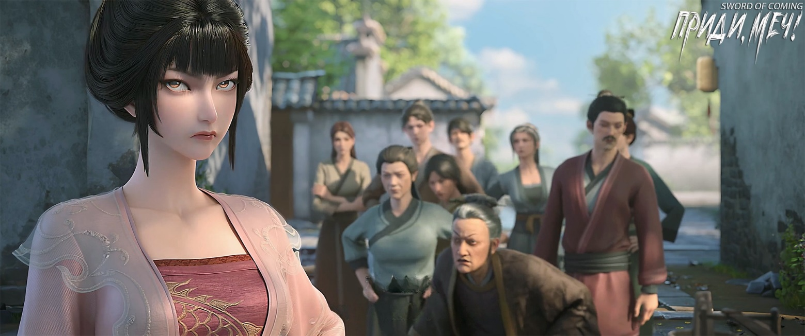
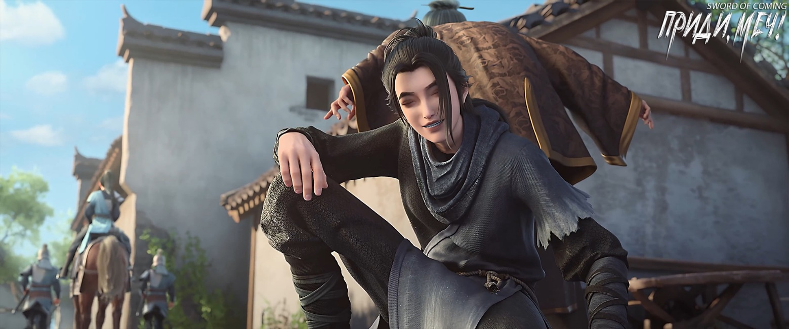
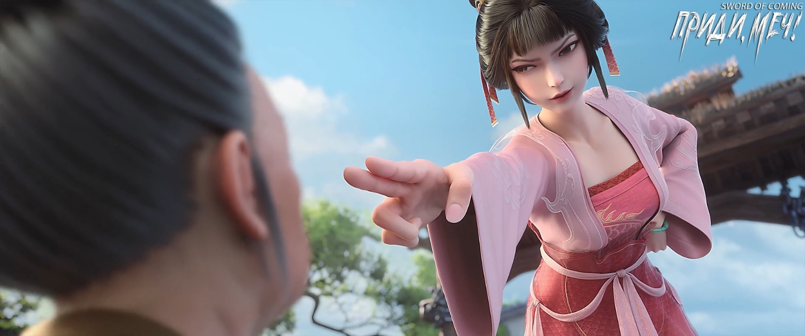

# Глава 31. Стучать по горе

Когда Чэнь Пинъань с коромыслом пришел к колодцу с железной цепью, он проходил мимо нескольких лавок с утренними закусками в переулке Цветущих Абрикосов, и его живот, не спрашивая разрешения, начал урчать от голода. Но из-за стесненности в средствах ему оставалось лишь, стиснув зубы, встать в очередь за водой. Перед ним было еще три семьи, и когда подошла его очередь, Чжигуй внезапно влезла с маленьким ведром, чем сразу вызвала недовольство людей позади. Хотя до ругани не дошло, но слова звучали неприятные, особенно от сгорбленной старухи, которую все звали бабушка Ма.

Ее два сына достигли немалого успеха — каждый владел своей драконовой печью. Хоть эти печи и занимали последние места среди тридцати с лишним подобных, в переулке Цветущих Абрикосов такое владение считалось верхом богатства и знатности. По какой-то причине старуха не находила общего языка с обеими невестками, потому сыновья с женами давно перебрались в переулок Персиковых Листьев, а она продолжала жить одна в родовом доме в переулке Цветущих Абрикосов.

Для Чэнь Пинъаня и его ровесников, таких как Лю Сяньян, бабушка Ма представлялась пугающей особой: она жестоко ругалась и была очень скупой и мелочной, и даже зимой старательно сгребала снег с улицы себе во двор. Стоило детям затеять игру в снежки, используя снег у ее ворот, или сбить сосульки с карниза ее дома, как старуха, не чувствуя усталости, могла преследовать их с метлой через несколько улиц, осыпая бранью.

В западных переулках городка лишь мать Гу Цаня могла усмирить спесь бабушки Ма. Теперь, по слухам, вдова Гу уехала на родину покойного мужа с его дальними родственниками. Бабушка Ма, немного смягчившаяся в последние годы, тут же воспрянула духом и «вернулась на реки и озера»[1], придираясь к каждому встречному.

[1] Образное выражение: снова стала активной.

В этот раз, когда служанка Сун Цзисиня решила пролезть без очереди, бабушка Ма тут же начала язвить. Ее голос был негромким, но слова звучали колко. Она нарочно обращалась к соседке, как будто заводя непринужденный разговор:

— Некоторые девицы наконец-то могут показать свое лицо и ходить свободно, хотя уже и не могут сводить ноги вместе при ходьбе. Это большая радость, наконец-то не нужно иметь тело девушки и судьбу служанки, можно открыто называться госпожой[2].

[2] П.п.: Тут несколько устаревших выражений и метафор, связанных с традиционным китайским обществом и браком. Суть в том, что девушка из хорошей семьи, выходя замуж, наконец обретает уважаемый статус замужней женщины, хотя и теряет девичью невинность. Ранее незамужняя девушка, даже из приличной семьи, имела низкое положение, сравнимое со служанкой. Замужество давало ей возможность открыто показываться и с гордостью носить титул «жены» (т.е. госпожи 夫人).

У Чэнь Пинъаня от этих слов волосы встали дыбом, но прогнать Чжигуй, первую нарушившую порядок, он не мог — все-таки они были соседями уже много лет. Наполнив свои два ведра водой, он поспешно набрал еще одно для Чжигуй, стремясь поскорее покинуть толпу сплетничающих женщин. Бабушка Ма, заметив, что «ничтожная служанка» из дома Сун притворяется глухой, разъярилась еще сильнее.

Так случается, когда мастера меряются силами: больше всего страшит, когда противник вовсе не принимает вызов. И тогда, несмотря на все свое боевое мастерство, некуда его применить[3].

[3] 却无处落脚 — «но некуда поставить ногу». В переносном смысле — некуда применить свое мастерство. Означает, что человек не может показать свои таланты, если другая сторона не реагирует должным образом.

В прошлом, когда бабушка Ма ругалась с вдовой Гу, этой «развратной лисой», то даже проигрывая, чувствовала рост своего мастерства и верила, что в следующий раз непременно отыграется. Но эта потаскушка из переулка Глиняных Кувшинов всякий раз намеренно хранила молчание, бросая напоследок такой взгляд, что бабушку Ма передергивало от злости. Она скрежетала зубами, мечтая расцарапать той лицо, чтобы юноши и молодые мужчины из окрестных переулков не мечтали повесить свои души на талию этой бесстыжей служанки.

Особенно ее внук — хоть в глазах других он всегда был дурачком, но в последнее время даже она, его бабушка, чувствовала, что ребенок действительно сошел с ума. Он с утра до ночи нес чепуху, постоянно говорил, что в будущем женится на этой служанке из переулка Глиняных Кувшинов, а потом одним ударом пробьет дыру в небесах.

Заметив безразличие ненавистной служанки, бабушка Ма цокая языком переключила внимание на бедного юношу:

— Жалкий, никчемный глиняный горшок! Даже погубив родителей, не стыдишься жить на свете. Знаешь, что тебе никогда не хватит сил жениться, так теперь бессовестно увиваешься за чужой служанкой. Вы и правда созданы друг для друга, пара пса и суки. Так и живите вместе, в переулке Глиняных Кувшинов одно отребье да мусор обитает. Может, и детей заведете, которые в этом переулке королями станут.

Чэнь Пинъань задумался и наклонился, собираясь опустить коромысло с плеч, но Чжигуй уже давно поставила ведра с водой и большими шагами направилась к бесстрашной бабушке Ма. Без лишних слов она влепила той пощечину. Старуха закружилась на месте, ошеломленная, и лишь благодаря поддержке окружающих женщин устояла на ногах. Не дав опомниться, Чжигуй шагнула вперед и с силой отвесила еще одну оплеуху, ругаясь:

— Старая карга, я уже давно тебя терплю!

Старуха Ма покачала головой, она была так зла, что дым валил из всех семи отверстий. Она хотела дать сдачи, но то ли это было ощущением, то ли помощь двух женщин рядом с ней и правда была слишком усердной, но она не могла вырваться ни на мгновение. В результате она подверглась третьему унижению — служанка снова протянула руку, согнула пальцы и с силой стукнула ее по лбу:

— Если еще раз осмелишься ругаться, я вырву твой длинный язык! За каждое бранное слово воткну в тебя по игле!

От испуга старуха забыла, как открывать рот, не говоря уже о том, чтобы ответить.

Чжигуй развернулась и направилась прочь, заметив, что Чэнь Пинъань уже несет ее ведро с водой. Улыбнувшись, она пошла рядом с ним.

— Не благодари меня, — опередила она его слова, — то, что я ругалась, не имеет к тебе никакого отношения.

Чэнь Пинъань не нашелся что ответить.

Чжигуй шла с пустыми руками, что-то бормоча себе под нос, даже не пытаясь забрать у соседа ведро.

Возле ворота колодца с железной цепью бабушка Ма сидела на земле, причитая:

— Чтоб в тебя тысяча ножей воткнулась, маленькая дешевая служанка[4], да настигнет тебя небесная кара… Горька моя судьба, небеса слепы, почему молния не ударит и не убьет эту потаскуху?..

[4] Дешевая служанка (贱婢) — уничижительный термин для таких женщин, как служанки, наложницы и проститутки.

Чжигуй весело шагала, то и дело поднимая руки к небу и делая странные жесты. Чэнь Пинъань, за годы соседства привыкший к ее манерам, не находил в этом ничего необычного.

Проходя мимо лавки с завтраками, он заметил знакомый силуэт. Невысокая девушка в зеленом одеянии покупала свежие мясные баоцзы — их пар и аромат разносились по всей улице.

Чэнь Пинъань улыбнулся, вспомнив поговорку из родных мест: «Хороший аппетит — это счастье».

Этим утром небо незаметно затянули низкие облака, плотные, точно одеяло богача, расстеленное для просушки на солнце.

Над городком прогремел гром.

Бабушка Ма, сидевшая у колодца с железной цепью, проворно вскочила и поспешно побежала домой. Маленькое ведро раскачивалось, расплескивая воду, и, вероятно, к тому времени, как она дойдет до дома, в нем не останется и половины.

Видимо, бабушка Ма прекрасно понимала: если небеса прозреют, первая молния непременно ударит в нее.

Услышав гром, Чэнь Пинъань недоуменно посмотрел вверх — ничто не предвещало дождя.

— Мой молодой господин рассказывал, что читал в книгах предание, — улыбнулась Чжигуй. — Каждой ранней весной небесное божество в золотых доспехах бьет в облаках в барабаны, провожая старое и встречая новое, устрашая нечисть и возвещая приход весны.

— Твой молодой господин действительно много читает, — отметил Чэнь Пинъань.

— Он во всем хорош, только немного ленив, да еще любит ругать небеса. Мне кажется, это нехорошо, — вздохнула Чжигуй.

У Чэнь Пинъаня не было привычки обсуждать людей за их спиной, поэтому он промолчал. У соседа Сун Цзисиня, как и у бабушки Ма, имелась странная многолетняя привычка ругать небеса. Однако, будучи образованным человеком, он следовал своим правилам: не бранился в снежные ночи, в грозу и когда небо украшали разноцветные облака. Говорил, что ругает небеса только во время их дремоты — тогда они не услышат и не разгневаются, а он сможет облегчить душу, достигая двух целей разом.

Видя, что Чэнь Пинъань не поддерживает разговор, Чжигуй как бы между прочим сказала:

— Ты вчера не ночевал дома, ходил к Лю Сяньяну?

— Дома были гости, неудобно, — кивнул Чэнь Пинъань.

Чжигуй неожиданно спросила:

— Кстати, учитель Ци ведь встречался с тобой? О чем вы говорили?

— Почему ты спрашиваешь?

— Просто так, — невинно улыбнулась Чжигуй. — Когда я сегодня шла за водой, встретила учителя Ци. Он сказал, что вышел на утреннюю прогулку, и спрашивал, дома ли ты. Я честно ответила.

— Я недавно случайно встретил учителя Ци, — улыбнулся Чэнь Пинъань. — Он расспрашивал о житье-бытье, говорил, что мне следовало учиться в школе вместе с Лю Сяньяном. Я мог лишь сослаться на бедность семьи, хотя, конечно, тоже хотел учиться.

— И это все? — недоуменно спросила Чжигуй.

— А ты думала, что? — с улыбкой посмотрел ей в глаза Чэнь Пинъань.

Она только улыбнулась в ответ.

На углу улицы они разошлись: Чжигуй, забрав ведро, направилась в переулок Глиняных Кувшинов, а Чэнь Пинъань вернулся в дом Лю Сяньяна. После этого ему предстояло идти к восточным воротам города забирать письма — по монете за каждое. Имей он такой заработок раньше, то с его способностью обегать все окрестные горы в радиусе ста ли, уже накопил бы себе на невесту.

У входа в переулок Глиняных Кувшинов Чжигуй увидела своего зевающего молодого господина.

Она быстро подошла и с любопытством спросила:

— Молодой господин, почему вы вышли? — поспешила она спросить.

— Дома скучно, — лениво потянулся Сун Цзисинь.

— Молодой господин, когда новый надзирающий чиновник вернется в городок? — тихо спросила она. — После этого мы сможем отправиться в столицу?

— Думаю, в течение декады, — задумался Сун Цзисинь.

Чжигуй заколебалась, и ведро в ее руках тоже закачалось.

— Что такое? Что беспокоит? — с улыбкой спросил Сун Цзисинь.

— Молодой господин, можно взять почитать «Записи местного уезда»? — робко спросила она. — Всего на пару вечеров. Хочу научиться узнавать иероглифы, чтобы в столице надо мной не смеялись и чтобы не опозорить вас.

Сун Цзисинь рассмеялся:

— Чего тут стесняться? Только помни — прежде чем листать книгу, вымой руки, чтобы не запачкать страницы, и будь осторожна с воском от свечи. Больше ни о чем беспокоиться не нужно, это всего лишь никчемная книга.

— Служанка благодарит молодого господина! — радостно улыбнулась Чжигуй.

— Иди сюда, молодой господин поможет тебе нести воду, — развеселился Сун Цзисинь.

— Молодой господин! — отстранилась Чжигуй. — Разве мы не договорились, что благородный муж держится подальше от кухни?[5] Как вы можете прикасаться к таким мелочам? Если соседи узнают, они осудят меня!

[5] 君子远庖厨 — древняя поговорка, означающая, что благородный человек не должен заниматься низкой работой.

— Правила, принципы, этикет — всем этим можно дурачить и пугать других, но я, молодой господин… — тут ученый, выросший в бедном переулке, замолчал.

— Что вы хотели сказать о себе, молодой господин? — с любопытством спросила Чжигуй.

Сун Цзисинь вернул себе обычную несерьезную улыбку:

— Я, молодой господин, на самом деле просто крестьянин. Разделяю поле на грядки и ряды, позволяю людям сеять семена, направляю воду для полива, а потом просто жду урожая. Год за годом, вот и все!

Чжигуй выглядела озадаченной.

Сун Цзисинь рассмеялся, но вдруг посерьезнел:

— Чжигуй, этот Чэнь всю дорогу нес твое ведро с водой?

Чжигуй невинно кивнула.

— Один мудрец однажды сказал: неправильно считать малейшую доброту незнакомца редким сокровищем, но при этом принимать как должное и не замечать всю самоотдачу близких людей.

— А? — Чжигуй растерялась еще больше.

— И как она не поняла намека? — пробормотал Сун Цзисинь, потирая подбородок. — Как теперь молодому господину продолжить разговор? Может, когда приедем в столицу, найти более умную, сообразительную и понимающую хорошенькую служанку?

Чжигуй рассмеялась, не принимая всерьез угрозу:

— На самом деле молодой господин ждал, что я спрошу, кто этот великий мудрец? Я поняла — это же вы!

— Воистину, Чжигуй понимает меня! — радостно рассмеялся Сун Цзисинь.

※※※※

В школьной комнате Ци Цзинчунь сидел с прямой осанкой. Черные и белые камни на доске для вэйци перед ним рассыпались в пыль под раскаты весеннего грома.

Дети в городке ловили рыбу в ручье особым способом: ударяли железным молотком по камням в воде, и оглушенная рыба, прятавшаяся под ними, всплывала на поверхность. Это напоминало описанное в книгах «стучать по горе, чтобы напугать тигра»[6].

Но если нужно было предостеречь мудреца не идти против воли небес и не отворачивался от великого Дао, то, вероятно, единственным подходящим для этого инструментом во всем мире мог стать лишь величественный небесный гром.

[6] Идиома, означающая «непрямое предупреждение».