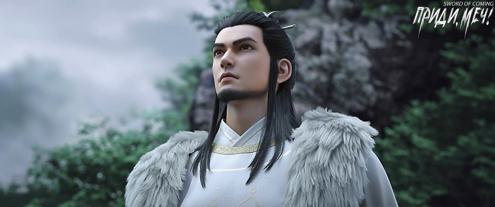
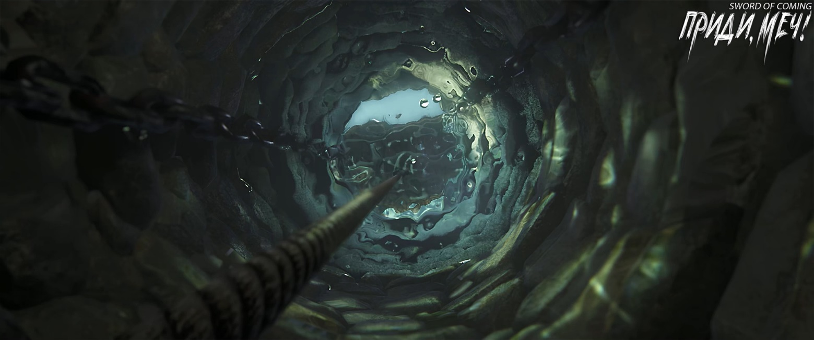

# Глава 32. Персиковые листья

Чэнь Пинъань принес воду во двор дома Лю Сяньяна, вылил ее в чан на кухне, затем подбежал к двери и крикнул:

— Сяньян, я собираюсь воспользоваться дровами, маслом и солью из твоего дома. Хочу приготовить юной госпоже Нин рыбный суп для укрепления здоровья, можно?

Разбуженный среди сладкого утреннего сна Лю Сяньян в ярости заорал:

— Чэнь! Ты достал меня! Мне только приснилось, как Чжигуй улыбнулась! Верни мне мою Чжигуй!

Чэнь Пинъань покачал головой и виновато произнес:

— Я только что встретил Чжигуй у колодца с железной цепью, но бабушка Ма прервала нас, и я забыл передать от тебя привет. Когда пойду относить рыбный суп юной госпоже Нин, обязательно передам ей твои слова.

Лю Сяньян вскочил как карп из воды, быстро оделся, выбежал и сел на порог главного зала. Глядя на худощавую фигуру, хлопочущую на кухне, он с ухмылкой произнес:

— Я пойду с тобой относить суп. Кстати, Чжигуй сегодня в той красной юбке с гранатами? Или в светло-зеленой? Эх, вот накоплю еще двести вэней, смогу купить ту серебряную пудреницу с драконами за сто с лишним вэней. Я знаю, она давно на нее заглядывается, просто жалко денег тратить. Во всем виноват этот нищеброд Сун Цзисинь! Такой скряга! Сам одевается как всякая шваль с улицы Благоденствия и Достатка, а бедная Чжигуй за целый год и пары новых нарядов не получает. Будь я молодым господином в ее семье, обязательно позволил бы ей покупать все, что захочет. Жила бы богаче барышень с улицы Благоденствия и Достатка, я бы превратил ее в благородную госпожу с десятью тысячами золотых!

Чэнь Пинъань не стал обращать внимания на пустые мечты друга. Он не понимал, почему Лю Сяньян так сильно любил именно Чжигуй. Дело не в презрении к ее происхождению служанки Сун Цзисиня и не в том, что считал Чжигуй некрасивой — просто он чувствовал отсутствие судьбы между ними.

— Почему ты тоже зовешь ее Чжигуй, а не Ван Чжу? — с любопытством спросил Чэнь Пинъань.

— После того как я узнал, что ты тоже не знаешь, как пишутся иероглифы «Чжигуй», мне уже все равно, — ухмыльнулся Лю Сяньян.

— Какой смысл сравнивать меня с тобой? Сравнивай себя с Сун Цзисинем, ведь Чжигуй не моя служанка, — беспомощно ответил Чэнь Пинъань.

Лю Сяньян презрительно усмехнулся:

— Этот парень не во всем лучше тебя. Например, звал ли он кого-нибудь в своей жизни «отцом» или «матерью»? Нет, верно? Вот в этом он и уступает тебе, Чэнь Пинъань! Неудивительно, что мать Гу Цаня и бабушка Ма с другими женщинами так злословят. Сун Цзисинь совсем не из порядочной семьи, иначе почему бы ему не жить открыто в той резиденции надзирающего чиновника, а прозябать в вашем переулке Глиняных Кувшинов? И этот тип еще смеет смотреть на других свысока, так что поделом ему, когда его поливают грязью и обзывают безродным.

Чэнь Пинъань встал и подошел к двери кухни:

— Лю Сяньян, хотя мы с Сун Цзисинем и не друзья, но так говорить о человеке…

Лю Сяньян поспешно поднял руки, решительно не давая Чэнь Пинъаню продолжать, и хитро сказал:

— Я больше не буду, хорошо? Чэнь Пинъань, в кого ты такой упрямый? Мой дед говорил, что твои родители отличались покладистым нравом, особенно мать — говорила тихо и мягко, любила улыбаться, характер у нее был просто замечательный. Дед рассказывал, что в те годы бабушка Ма ругала почти всех в окрестных переулках, но только не твою мать — не придиралась к ней, даже улыбалась при встрече.

Чэнь Пинъань расплылся в улыбке.

— Давай-давай, иди вари суп своей будущей женушке, — махнул рукой Лю Сяньян, прогоняя его.

— А ты бы осмелился сказать такое в лицо юной госпоже Нин? — закатил глаза Чэнь Пинъань.

— Я, в отличие от тебя, не дурак, — усмехнулся Лю Сяньян.

Вскоре Чэнь Пинъань вынес маленький глиняный горшок, они заперли двери дома и двора и вместе направились в переулок Глиняных Кувшинов. У ворот двора Лю Сяньян наблюдал, как Чэнь Пинъань стучится в дверь, и только тогда понял — этот парень отдал все ключи от дома Нин Яо.

«Безнадежен», — подумал Лю Сяньян.

Нин Яо, находясь дома, не носила вэймао, и когда открыла дверь, показалось ее свежее чистое лицо. В глубине души Лю Сяньян побаивался этой серьезной девушки, хотя и не понимал причины. Соседка Чжигуй отличалась даже большей замкнутостью, но к ней он приставал без стеснения. Дело не в том, что Нин Яо носила меч — ведь даже когда богатые сынки с улицы Благоденствия и Достатка преследовали его, и он убегал как бродячий пес, в душе он их не боялся. Но эта приезжая девушка вызывала в нем необъяснимый страх.

Когда Нин Яо села за стол и открыла горшок, почувствовав аромат, она слегка прищурила длинные глаза и мягко произнесла:

— Спасибо.

Чэнь Пинъань, отличаясь наблюдательностью, понял — это означало хорошее настроение обычно холодной девушки.

Чэнь Пинъань сначала помог ей поставить кашу на огонь, попросил следить за готовкой, а затем сказал Лю Сяньяну:

— Сам будешь ждать, когда Чжигуй выйдет? Мне нужно идти доставлять письма.

— Занимайся своими делами! — раздраженно ответил Лю Сяньян, сидевший на пороге и напрягавший уши, чтобы уловить хоть какой-нибудь звук «сражения небожителей»[1].

[1] П/п.: В общем, подслушивал, не занимаются ли соседи любовью.

Когда Чэнь Пинъань покинул двор и почти добежал до входа в переулок Глиняных Кувшинов, впереди внезапно потемнело. Подняв голову, он увидел высокого мужчину в белоснежном халате. Тот держал одну руку за спиной, а другую положил на белый нефритовый пояс на животе. Он смотрел вдаль. Видимо, осознав, что преграждает путь в узком переулке, мужчина слегка улыбнулся и отступил в сторону, пропуская Чэнь Пинъаня.

Чэнь Пинъань, полный недоумения, ускорил шаг и ушел. Оглянувшись, он увидел, как мужчина медленно входит в переулок Глиняных Кувшинов.

Даже при беглом взгляде Чэнь Пинъань заметил, что на безупречно белом одеянии, спереди и сзади, вышитые золотыми нитями складывались в два рисунка, где таинственные существа двигались среди горных туманов и облаков — удивительное зрелище. Чэнь Пинъань не стал долго размышлять об этом, решив, что это просто еще один приезжий, вроде Фу Наньхуа, пришедший искать удачу в переулке Глиняных Кувшинов. После того дня, когда он прошел мимо старой софоры вместе с учителем Ци, он перестал тревожиться, полагая — пока учитель Ци в городке, даже если случится что-то плохое, можно добиться справедливости.

Пробегая легкой трусцой мимо переулка Цветущих Абрикосов, он увидел встреченную вчера вечером девушку в зеленом одеянии. Она по-прежнему сидела в лавке вонтонов[2]. Держа в каждой руке по палочке для еды, она постукивала ими по столу, а ее круглое, по-детски пухлое личико сияло от восторга. Ее взгляд приковывали вонтоны, варившиеся в горячем котле, и она совершенно не замечала Чэнь Пинъаня, стоявшего в пяти-шести шагах. Для девушки в зеленом, когда перед ней вкусная еда, даже если небо обрушится, она сначала доест, а потом убежит!

[2] Вонтоны (馄饨) — это пельмени. Традиционное блюдо китайской кухни из тонкого теста с начинкой из свинины, креветок или овощей.

Чэнь Пинъань искренне восхищался этой незнакомой девушкой и, не став ее беспокоить, с улыбкой побежал дальше на восток городка.

Некоторые люди и вещи, даже если это просто пейзаж у дороги, стоит лишь взглянуть на них — и они заставят почувствовать, что жизнь прекрасна.

Когда Чэнь Пинъань добрался до восточных ворот с частоколом, неопрятный мужчина стоял на пне на цыпочках, всматриваясь на восток, словно ожидая важную персону.

Чэнь Пинъань раньше слышал, как старики болтали у старой софоры о первом прибытии в городок нынешнего надзирающего чиновника. Старейшины из четырех фамилий и десяти кланов почти все вышли встречать «высокого гостя» у восточных ворот. Однако после нескольких часов ожидания под палящим солнцем прибежал запыхавшийся управляющий из резиденции и сообщил — господин надзиратель только что проснулся после полуденного сна в задних покоях и просит всех прийти прямо туда для встречи. Это так разозлило богатых старейшин, что они чуть не лопнули от гнева[3]. Но говорят, после того как они вошли в ворота резиденции, никто не осмелился никто не осмелился выпустить ни единого пука, и каждый из них улыбался, как послушный внук.

[3] Буквально «один Будда вышел в мир, второй Будда вознесся на небеса» — идиома, означающая крайнюю степень гнева.

Чэнь Пинъаню всегда казалось странным, как эти старики рассказывали истории, словно сами все видели своими глазами. Каждый раз, делясь сплетнями с улицы Благоденствия и Достатка и переулка Персиковых Листьев, их рассказы звучали правдивее самой правды. Например, повествуя о том, как вторую тетушку Лу застали с начальником охраны, они в мельчайших подробностях описывали, как в панике тетушка пыталась прикрыть свою пышную грудь одеждой. Рассказчик говорил так, будто сам был тем начальником охраны.

Лю Сяньян каждый раз слушал, сглатывая слюну. Сун Цзисинь иногда тоже приходил, но без Чжигуй, и улыбался сдержаннее Лю Сяньяна. Однако, присоединяясь к остальным и тайком подбадривая их, он проявлял особое рвение — громче, чем когда читал книги мудрецов по утрам и вечерам.

Чэнь Пинъань присел на корточки рядом с пнем, терпеливо ожидая привратника городка.

Привратник выругался, спрыгнул с пня и, увидев Чэнь Пинъаня, молча пошел в соломенную хижину, откуда принес стопку писем — шесть штук, но дал только пять медных монет по одному вэню.

Чэнь Пинъань бегло просмотрел адреса на письмах и промолчал — два письма предназначались соседям с улицы Благоденствия и Достатка. Он не хотел наживаться на этом, хотя, прояви привратник небывалую щедрость и дай сразу шесть монет, точно не стал бы отказываться.

Решив порядок доставки, Чэнь Пинъань между делом спросил:

— Кого-то ждете?

— Жду большого господина! — раздраженно бросил привратник, глядя на широкую дорогу на востоке.

Чэнь Пинъань не хотел оставаться и быть козлом отпущения, поэтому поспешил уйти.

— Ого, а у него есть немного проницательности, — зло рассмеялся привратник.

Он взглянул на небо — раскаты грома давно стихли, а низкие облака, почти касавшиеся крыш, постепенно рассеивались.

— Когда небожители сражаются, простые смертные страдают, — вздохнул привратник, плюхнувшись на пень.

※※※※

Из шести писем четыре адресовались большим семьям с улицы Благоденствия и Достатка — Лу, Ли, Чжао и Сун, а два — в переулок Персиковых Листьев. По удивительному совпадению, одно предназначалось тому приветливому старику, и еще удивительнее — дверь открыл он сам. Увидев Чэнь Пинъаня, он узнал юношу в соломенных сандалиях и пошутил:

— Дитя, точно не зайдешь воды попить?

Чэнь Пинъань застенчиво улыбнулся и покачал головой.

Старик не удивился, просто достал из рукава горсть медных монет и протянул Чэнь Пинъаню, с улыбкой объясняя:

— Сегодня в доме радостное событие, и эти деньги на счастье — каждый, кто их получит, будет иметь свою долю удачи. Это просто для благополучия, не много, всего десять с лишним монет, так что можешь смело брать.

— Спасибо, дедушка Вэй! — улыбнулся Чэнь Пинъань, принимая монеты.

Старик кивнул и вдруг сказал:

— Дитя, в последнее время, когда делать нечего, почаще сиди под софорой. Увидишь на земле листья софоры, ветки — забирай домой и храни, они отпугивают муравьев и сороконожек. Хорошо ведь, и денег тратить не нужно.

Чэнь Пинъань, стоя у подножия лестницы, поклонился старику в благодарность.

— Иди-иди, весна — начало года, для молодого человека полезно больше двигаться и укреплять тело, — улыбнулся старик.

Чэнь Пинъань убежал из переулка Персиковых Листьев, где дороги выложены каменными плитами.

Старик долго стоял у ворот, глядя на персиковые деревья по обеим сторонам. Изящная молодая служанка подошла к нему и тихо спросила:

— Почтенный предок, на что смотрите? На улице холодно, как бы вы не простудились.

Служанка прислуживала старику уже несколько лет и знала о его добром, как у Бодхисаттвы, сердце. Она уважала старика, но не боялась его, поэтому с очаровательной улыбкой игриво спросила:

— Почтенный предок, уж не вспомнили ли вы девушку, встреченную в юности? Ту, что стояла под персиковым деревом?

— Таоя, ты, как и тот юноша, разносящий письма — «человек с чутким сердцем», — улыбнулся седовласый старик.

Служанка, получив похвалу, застенчиво улыбнулась.

— В ближайшие дни нас навестит дальний родственник, — вдруг сказал старик. — Тогда ты, Таоя, вместе с другими детьми из семьи покинешь городок.

Служанка застыла в недоумении, ее глаза мгновенно покраснели:

— Почтенный предок, я не хочу уезжать отсюда, — проговорила она сквозь слезы.

— Я еще немного полюбуюсь видом переулка, а ты иди. Таоя, будь послушной, иначе я рассержусь, — махнул рукой обычно покладистый старик.

Служанке пришлось робко удалиться, то и дело оглядываясь.

В переулке Персиковых Листьев листва густая, но персиковых цветов еще нет.

Старик тихо выдохнул, переступил через порог, спустился по ступеням и подошел к ближайшему персиковому дереву. Встав под ним, он с грустью произнес:

— Персик в цвету, как ярки его цветы. И правда, больше их не увидеть[4].

[4] «桃之夭夭，灼灼其华», строка из «Книги песен» (诗经·桃夭), воспевающая красоту цветущего персикового дерева и женскую молодость. Имя Таоя означает «Персиковый Росток», и старик, вероятно, сожалеет о том, что больше никогда ее не увидит.

Старик оглянулся на свой дом и пробормотал:

— Уникальное положение городка изначально противоречило великому Дао. Мудрецы насильно изменили порядок вещей, и мы наслаждались благоприятной судьбой три тысячи лет. Многие, покинувшие городок, расселились по всему Восточному континенту Водолея. Но Небесный Владыка мудр, и настало время подвести итоги и взыскать с нас плату. Вы, дети, если не уйдете отсюда поскорее, неужели хотите вместе с нами, уже разбитым вдребезги старым фарфором, ждать смерти? Поймите: смерть бывает разной, и гибель нескольких тысяч человек в нашем городке станет той большой смертью, после которой не будет даже следующей жизни. Поэтому сейчас, пока Небеса смотрят сквозь пальцы, нужно спасти столько людей, сколько возможно.

Старик протянул иссохшую руку и оперся на ветку персикового дерева:

— Человек с чутким сердцем, человек с чутким сердцем… Надеюсь, Небеса действительно не подведут.

Незаметно подошла старуха с тростью — бабушка молодого ученого Чжао Яо:

— Уже одной ногой в могиле, а все такой же наивный, словно старуха, намазавшаяся румянами — отвратительное зрелище. Думаешь, эту катастрофу можно хоть немного твоим добрым сердцем?

Старик рассеянно посмотрел на такую же седовласую старуху и почему-то сказал:

— А, ты пришла.

Старуха сначала опешила, а затем, рассердившись от смущения, замахнулась тростью:

— Бесстыжий старый негодяй, в таком возрасте еще смеешь заигрывать?!

Удары трости сыпались градом, и старику оставалось лишь спасаться бегством, громко смеясь.

Старуха стояла под персиковым деревом, не в силах унять раздражение. Она жалела, что поддалась минутной слабости и пришла в переулок Персиковых Листьев. Наконец она подняла голову и посмотрела на персиковые ветви с пробивающимися молодыми почками.

Шаг за шагом старуха возвращалась на улицу Благоденствия и Достатка, и ее трость мерно стучала по каменным плитам.

Маленький мирный городок процветал тысячу лет. Кто бы мог подумать, что в конце концов все его жители станут несчастными людьми без будущей жизни и перерождения?

Неужели действительно не осталось ни единого шанса на спасение?

※※※※

Вода в ручье мелела, в колодце холодела, старая софора становилась еще старее, железная цепь ржавела, тяжелые облака нависали низко.

В этом году персиковые листья не увидят персиковых цветов.