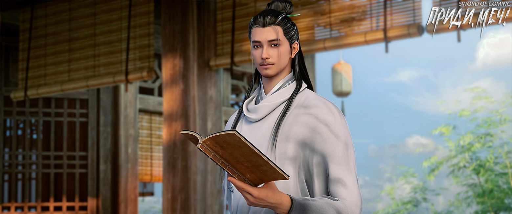

# Глава 33. Белый дракон в рыбьей чешуе

П/п.: Белый дракон в рыбьей одежде — это чэнъюй (фразеологизм), происходящий из мифов и легенд. Выражение впервые появилось в древнем тексте «Шо Юань» в разделе «Чжэн Цзянь».

Этот фразеологизм описывает ситуацию, когда знатный или богатый человек, путешествуя инкогнито, попадает в опасную ситуацию. В современном использовании чаще означает добровольное принижение своего статуса и готовность терпеть унижения.

※※※※

Чэнь Пинъань снова увидел девушку в зеленом одеянии. Она молча следовала за мужчиной средних лет, опустив голову и жуя лепешку с луком и яйцом. Мужчина выглядел потерявшим всякую надежду.

Увидев Чэнь Пинъаня, мужчина остановился и спросил:

— Ты случайно не тот мальчишка, которого я прогнал в прошлый раз?

Мужчина получил сильный толчок в спину — девушка в зеленом, врезавшаяся в эту «стену», подняла голову с растерянным видом. Внезапно увидев Чэнь Пинъаня, она хотела улыбнуться, но резко повернулась к нему спиной и торопливо начала вытирать уголки рта.

Чэнь Пинъань сдержал улыбку и кивнул мужчине:

— Здравствуйте, мастер Жуань.

По всей видимости, эта юная госпожа приходилась дочерью мастеру Жуаню.

Отец и дочь совершенно не походили друг на друга внешне, и это, пожалуй, к лучшему.

Мужчина, которого Чэнь Пинъань назвал мастером Жуанем, оказался тем самым кузнецом, недавно прибывшим в городок и поселившимся у маленького ручья на юге. Он спросил:

— Почему Лю Сяньян последние два дня не приходил ковать?

Чэнь Пинъань только собрался объяснить причину, как мужчина холодно произнес:

— Передай этому парню, если сегодня он не появится перед этим господином, завтра может не приходить в мою мастерскую.

— Мастер Жуань, у него дома случились неотложные дела… — поспешно начал Чэнь Пинъань.

— Какое отношение это имеет к моей заднице?![1] — грубо перебил мужчина.

[1] Идиома «关我屁事» означает «Какое мне дело?», или «это меня не колышет».

Чэнь Пинъань, не отличавшийся красноречием, застыл на месте. Его лицо покраснело от волнения, и он молчал, боясь только ухудшить ситуацию. Он уже знал по собственному опыту о прямолинейном характере мастера Жуаня.

Девушка в зеленом одеянии попыталась вступиться за Чэнь Пинъаня, но отец, как никто другой знавший свою дочь, заранее отчитал ее:

— Ешь свою лепешку!

Девушка, полная обиды, внезапно ускорила шаг, изо всех сил наступила отцу на ногу и умчалась прочь.

Мужчина горестно вздохнул, оставил Чэнь Пинъаня и продолжил путь.

Чэнь Пинъань тоже вздохнул, побежал в лавку с закусками, купил корзинку с шестью паровыми булочками и поспешил в переулок Глиняных Кувшинов. У своего дома он увидел Лю Сяньяна — тот сидел на корточках на стене, наполовину свесившись во двор дома Сун Цзисиня, полностью поглощенный подслушиванием.

Иногда Чэнь Пинъань думал, что Лю Сяньян действительно заслуживает хорошей взбучки. Ему пришлось напомнить:

— Я только что встретил мастера Жуаня. Он сказал, чтобы ты сегодня пришел помогать в кузнице. Если он не увидит тебя сегодня, то выгонит.

— К чему спешить? — рассеянно ответил Лю Сяньян. — Такого ученика, как я, и ловкого, и трудолюбивого, даже с фонарем трудно найти. Мастер Жуань просто пугает, ничего страшного, если я пойду завтра.

— Я уверен, что мастер Жуань совсем не шутил, — покачал головой Чэнь Пинъань.

— Схожу попозже, не мешай мне заниматься важным делом, — раздраженно бросил Лю Сяньян.

Чэнь Пинъань отнес завтрак Нин Яо, сразу отдал три булочки Лю Сяньяну, а себе взял только одну.

Лю Сяньян быстро расправился со всеми мясными булочками и, вытирая рот, тихо сказал:

— Только что к Сун Цзисиню пришел гость. Сразу видно — важная персона. Если я не ошибаюсь, это нынешний главный надзиратель государственных печей. В прошлый раз, когда он приходил к нашей драконовой печи в официальном одеянии, старик Яо посчитал вас, никчемных учеников, помехой и даже не дал показаться на глаза и набраться опыта. Со мной все было иначе — старик Яо даже позволил мне продемонстрировать уважаемому господину, что такое «прыгающий нож».

— То, что нынешний главный надзиратель благоволит Сун Цзисиню, знают все в городке. Чего ты попусту паникуешь? — с улыбкой заметил Чэнь Пинъань.

— Такой смазливый Сун Цзисинь точно не сможет со мной тягаться, — с тревогой проговорил Лю Сяньян, — но что если Чжигуй влюбится в этого благородного чиновника? Тогда у меня совсем мало шансов! Что мне делать, если твоя будущая невестка сбежит с другим? Как быть тебе? Как быть мне?

Чэнь Пинъань просто вернулся в комнату, оставив Лю Сяньяна сидеть на стене в самобичевании.

Нин Яо сидела за столом с прямой спиной, одной рукой сжимая рукоять ножа, словно готовясь к большой битве. На ее лбу выступил пот.

Чэнь Пинъань впервые видел ее в таком состоянии. Хотя тело выдавало напряжение и настороженность, глаза ярко блестели в предвкушении.

Чэнь Пинъань отступил к порогу, и она спросила:

— Знаешь, кто этот гость по соседству?

— По словам Лю Сяньяна, это нынешний главный надзиратель государственных печей нашего городка. Человек довольно приветливый, в начале переулка даже уступил мне дорогу.

— Такие люди как раз самые опасные, — холодно усмехнулась Нин Яо.

Чэнь Пинъань был озадачен.

— Когда человек идет по дороге и видит муравья, наступит ли он на него? — спросила она.

— Гу Цань точно наступит, он часто поливает муравейники водой или закрывает входы камнями. Лю Сяньян, наверное, тоже наступит, если будет не в духе.

Нин Яо осталась без слов.

— Я понял, что ты имеешь в виду, госпожа Нин, — широко улыбнулся Чэнь Пинъань.

— Правда?

— Я думаю, ты хотела сказать две вещи, — кивнул Чэнь Пинъань. — Первое — в глазах вас, приезжих, мы, простые жители городка, все равно что муравьи, снующие под ногами. Во-вторых, среди приезжих есть разные люди: Фу Наньхуа и Цай Цзиньцзянь подобны детям вроде Гу Цаня, которым интересно распоряжаться жизнью и смертью муравьев, или они считают их помехой. Но тот чиновник, что пришел в наш переулок Глиняных Кувшинов, другой — его слова и поступки соответствуют его положению, поэтому он кажется особенно вежливым. Я прав, госпожа Нин?

— Как ты до этого додумался?

— Видимо, после того, как я едва не распрощался с жизнью, кажется, мой разум стал более проницательным, — шутливо ответил Чэнь Пинъань.

— Что ты видел перед смертью? — серьезно спросила Нин Яо.

— Я ничего не видел, — озадаченно ответил Чэнь Пинъань, но все же честно продолжил. — На самом деле в том переулке я вообще ни о чем особо не думал. Этот вопрос лучше задать Фу Наньхуа и Цай Цзиньцзянь, возможно, они что-то видели.

— Ого, какие громкие слова! — холодно хмыкнула Нин Яо.

Сказав это, она вдруг пристально уставилась на Чэнь Пинъаня. У Чэнь Пинъаня от ее взгляда забилось сердце:

— Что такое?

Нин Яо нахмурилась и с досадой пробормотала на родном диалекте:

— Искусство меча моей семьи, будь то техники владения мечом или методы закалки тела и души — все это секретные знания, передающиеся только внутри семьи. Я сама не все освоила, как же я могу учить других? К тому же я не изучала те простые вещи, которым учат в других местах, иначе могла бы указать ему правильный путь, хотя бы для укрепления тела и продления жизни. Где же мне теперь найти самое простое руководство для начинающих?

Глаза Нин Яо загорелись:

— Ограбить? Нет-нет, не ограбить, а одолжить у кого-нибудь руководство, ведь взятое в долг возвращают!

Но вскоре ее лицо помрачнело:

— Проклятый старый евнух! Погоди у меня, я весь ваш дворец вверх дном переверну.

С унылым видом она печально добавила:

— Неужели придется идти к этому мастеру-оружейнику по фамилии Жуань? Я еще могу как-то справиться с убийством, ведь я наполовину овладела истинным искусством моей матери. Но просить кого-то о помощи я совсем не умею.

Чэнь Пинъань сидел на пороге и смотрел на девушку, которая разговаривала сама с собой, а ее настроение менялось, как облака на горизонте.

※※※※

Красивый мужчина в белом халате с нефритовым поясом стоял в комнате Сун Цзисиня, оглядывая все вокруг и слегка хмурясь:

— Этот Сун поселил тебя в таком убогом месте?

Сун Цзисинь поджал губы и промолчал.

Служанка Чжигуй понимала ситуацию и уже скрылась в своей боковой комнате.

Согласно самой распространенной в городке версии, предыдущий главный надзиратель господин Сун не справился с обязанностями и не смог изготовить императорский фарфор, который удовлетворил бы двор. Оставив после себя лишь крытый мост в качестве плода своих трудов, он вернулся на службу в столицу. Конечно, он также оставил Сун Цзисиня, своего незаконнорожденного сына, купив ему служанку для ухода и «доверив опеку» своему другу — новому главному надзирателю, который, как говорили, тоже носил фамилию Сун. Но какова истинная правда — участники событий пребывали в замешательстве, а сторонние наблюдатели не обязательно знали больше.

Сун Цзисинь не понимал, какие отношения связывали стоящего перед ним человека с тем мужчиной по фамилии Сун. Близкие коллеги по службе? Старые друзья по учебе? Или соперники из других фракций в столичных храмах? Перед отъездом тот Сун вскользь упомянул, что новый главный надзиратель вскоре после прибытия в городок заберет его с собой в столицу, и что Сун Цзисинь должен относиться к нему с величайшим почтением, не проявляя ни малейшей небрежности.

Сун Цзисинь не испытывал симпатии к этому властному столичному мужчине — возможно, из-за того, что неприязнь к одному переносилась и на другого.

Его уверенность в себе, проявленная перед служанкой Чжигуй, и спокойствие по поводу предстоящего отъезда из родных мест были лишь проявлением гордости.

— Ладно уж, — усмехнулся мужчина, — этот кислый книжник такой осторожный и щепетильный, больше похож не на важного господина, а на бабу, иначе не отправил бы его сюда присматривать за тобой.

Лицо Сун Цзисиня помрачнело. Мужчина небрежно взглянул на большой сундук с вещами Сун Цзисиня и, презрительно скривив губы, медленно произнес:

— Перед тем как прийти сюда, я уже виделся с Фу Наньхуа из Старого Города Дракона. Вот уж неудачник — чуть не потерял здесь свою решимость следовать Дао. Ты сам несешь ответственность за прибыли и убытки, я не собираюсь вмешиваться в дела размером с кунжут и бобы. Но перед отъездом ты должен пойти со мной к крытому мосту и совершить несколько поклонов. После этого тебя больше ничто не будет касаться. Вернешься со мной домой, будешь делать то, что должен, сидеть там, где положено, и исполнять свои обязанности. Все просто. Ты понял?

— Понять-то понял, слова господина Суна не так уж сложны, — с насмешкой сказал Сун Цзисинь. — Только почему я должен это делать?

Мужчина рассмеялся и, повернувшись, впервые посмотрел прямо на Сун Цзисиня:

— Тот женоподобный Сун говорил, что у тебя выдающийся талант — такая оценка, того и гляди, язык вывихнешь. Может, попробуешь угадать причину моих поступков?

При внимательном взгляде между ними проступало явное сходство во внешности и манерах. Гнев Сун Цзисиня нарастал, хотя он пока сдерживался.

Мужчина оставил намеки и насмешливо произнес:

— Почему? Да просто я — первейший неудачник под небесами, раз уж оказался твоим родным дядей.

Сун Цзисинь внутренне содрогнулся, его лицо слегка побледнело.

Мужчина в белом халате, не обращая на это внимания, положил руки на нефритовый пояс и, глядя в окно на небо, с улыбкой сказал:

— А еще потому, принц, что я — первый в боевых искусствах династии Дали.

Эту фразу можно сформулировать иначе, что произвело бы более сильное впечатление. Но мужчина предпочитал оставаться первым среди простых людей, а не последним среди выдающихся. Он полагал: если отстаешь от других хоть на шаг-другой, хвастаться нечем.

Вспомнив о присутствующем здесь конфуцианском мудреце, мужчина презрительно скривил губы и холодно фыркнул:

— Не будь это место особенным, я бы одной рукой уничтожил таких небожителей трех учений, как ты, Ци Цзинчунь.

※※※※

В школе с соломенной крышей учитель Ци сидел с безупречно прямой осанкой, слушая, как юные ученики нараспев читают книги.

Даже таким способным ученикам, как Сун Цзисинь и Чжао Яо, было трудно постичь истинное значение «сидеть с безупречно прямой осанкой».

В конфуцианстве есть классический текст «Великий ритуал», лежащий в основе учения. В главе «О совершенствовании себя» говорится, что благородный муж должен сидеть как покойник, ибо покойник подобен божественному образу, и такая поза исполнена торжественности и благоговения.

В этот момент Ци Цзинчунь, уловив мысли человека в белом халате, безмятежно улыбнулся и сказал:

— Воин управляет государством — как необычно, как необычно. Но белый дракон в рыбьей чешуе — не доброе предзнаменование.