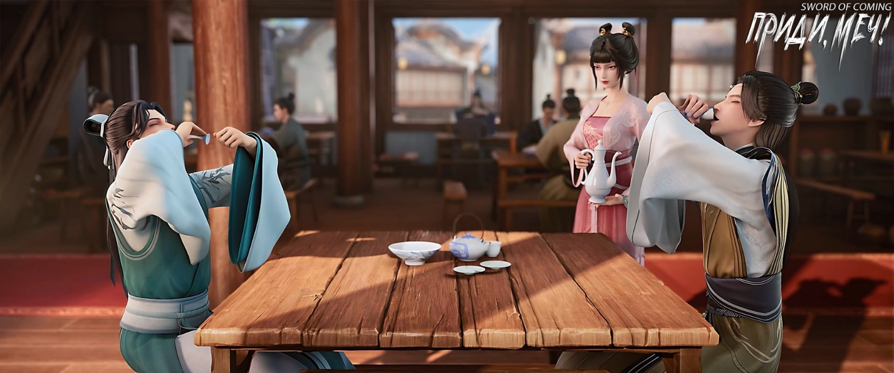
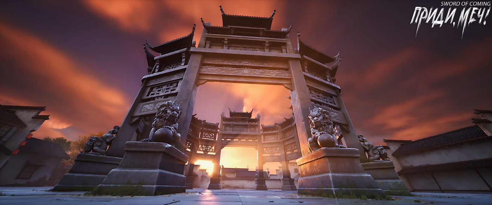
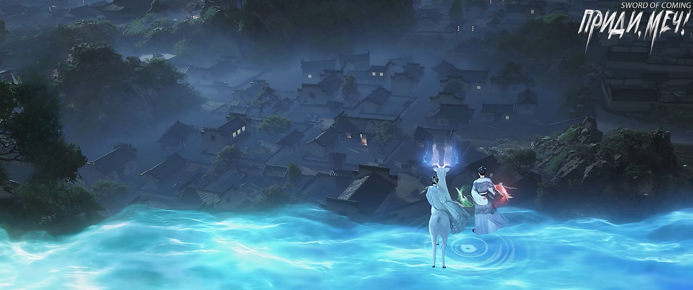

# Глава 34. Собраться вместе

Со стороны ворот дома Сун Цзисиня послышались шаги. Лю Сяньян собирался спрыгнуть со стены, но прежде чем увидел человека, услышал его голос. Кто-то мягко рассмеялся и спросил:

— Ты случайно не ученик старика Яо из печи у Драгоценной реки? По фамилии Лю?

Это оказался тот самый инспектор гончарных мастерских — мужчина в белых одеждах с нефритовым поясом на талии. Он широкими шагами вышел за порог и с улыбкой посмотрел в сторону стены.

Лю Сяньян замер, обнаружив, что не может спрыгнуть со стены. Он виновато усмехнулся и сказал:

— Отвечаю господину: это я. Когда господин приходил на открытие нашей драконовой печи, учитель велел мне продемонстрировать господину несколько приемов работы.

Мужчина кивнул, окинул взглядом Лю Сяньяна и прямо спросил:

— Мальчик, хочешь отправиться во внешний мир? Например, пойти в армию, сражаться на поле битвы. Я гарантирую, что если ты выдержишь десять лет, то сможешь стать высокопоставленным чиновником. Тогда я лично устрою для тебя праздничный пир в столице, чтобы отметить твои заслуги. Как тебе?

Сун Цзисинь, стоявший позади мужчины, мрачно сжал в руке нефритовый медальон «Старый Дракон Проливает Дождь», подаренный Фу Наньхуа.

Этот отмеченный клеймом «незаконнорожденный» и «ублюдок» подающий надежды ученик теперь знал истинную личность стоящего рядом мужчины и оттого еще лучше понимал вес его слов. Фраза «лично устрою пир» могла стать сильнейшим оберегом в Дали и самой длинной лестницей к успеху в чиновничьей карьере.

Лю Сяньян, с трудом подбирая витиеватые слова, запинаясь, ответил:

— Благодарю господина инспектора за милость, не смею… просто я уже пообещал стать учеником в кузнице мастера Жуаня и не могу нарушить слово, прошу господина не… господина не винить…

Слова застряли у него в горле, он никак не мог их вспомнить, и от волнения его лицо полностью покраснело.

Сун Цзисинь, казалось, понимающе подсказал:

— Господин не считает ошибки маленького человека[1].

[1] Идиома «大人不记小人过» означает, что высокопоставленный человек великодушно прощает ошибки простолюдина.

Человек в белом халате усмехнулся и небрежно сказал:

— Ничего страшного. Когда появится возможность покинуть городок, отправляйся к ближайшему перевалу Даньян и найди воина по имени Лю Линьси[2]. Найди там воина по имени Лю Линьси и скажи ему, что тебя направил к нему Сун Чанцзин[3] из столицы, чтобы вступить в армию. Если он не поверит, напомни ему, что тот самый Сун Чанцзин говорил, что Лю Линьси все еще должен ему головы тридцати тысяч пограничных всадников Великой Суй.

[2] Лю Линьси (刘临溪). Имя может означать «у горного ручья».

[3] Сун Чанцзин (宋长镜). Имя Чанцзин означает «Длинное зеркало» или «большое зеркало», что может символизировать мудрость, проницательность или способность человека ясно видеть и понимать вещи. Или «Вечное отражение», что может указывать на стремление человека оставить после себя долгую память или наследие.

Лю Сяньян рассеянно кивнул:

— Хорошо.

Мужчина ушел с улыбкой. Сун Цзисинь проводил его до ворот двора и хотел остановиться, но мужчина, предугадав его мысли, не оборачиваясь, сказал:

— Пойдем со мной в канцелярию надзирателя, я познакомлю тебя с одним человеком.

Сун Цзисинь замер на месте и мрачно ответил:

— Я не пойду!

То место, которое для простых жителей городка казалось недосягаемым, для Сун Цзисиня, выросшего среди постоянных сплетен и слухов, представлялось логовом драконов и тигров, преградой, которую он не мог преодолеть.

Сун Чанцзин, обычно решительный и властный во внешнем мире, не разозлился на неуместное поведение Сун Цзисиня и не остановился, но его тон стал намного мягче:

— Согласно записям шпионов и осведомителей канцелярии, ты уже встречался с тем принцем Гао из династии Суй, верно? Знаешь ли ты, что род Гао из Суй и наш род Сун из Дали — заклятые враги на протяжении тысячи лет? Будучи принцем, он осмелился прийти в этот городок, расположенный в глубине территории враждебной страны Дали. А ты, Сун Цзисинь, тоже принц, но не смеешь пойти в небольшую резиденцию чиновника на территории своей собственной страны?

Сун Цзисинь не стал обдумывать глубокий смысл этих слов, а мгновенно повернул голову к Лю Сяньяну. Высокий юноша все еще сидел на стене, растирая руки и похлопывая себя по ногам, будто совершенно не слышал слов Сун Чанцзина.

Идущий по переулку Глиняных Кувшинов могущественный князь в белых одеждах, первый мастер боевых искусств Дали, усмехнулся — он получил неожиданное удовольствие.

«И правда, достойное семя нашего рода Сун», — подумал он.

Однако стоило ему вспомнить, что Сун Цзисинь все же сын той женщины, даже этот могущественный князь, первый мастер боевых искусств Дали, ощутил раздражение и неловкость.

Сун Цзисинь стиснул зубы и, повернувшись к стоявшей у дверей дома Чжигуй, сказал:

— Я скоро вернусь, не нужно готовить для меня обед.

Едва выйдя за ворота, он снова обернулся с улыбкой:

— Возьми мешочек с серебряными монетами у моей кровати и пойди в лавку семьи Ду. Купи те парные ароматные подвески с драконом и фениксом[4]. В конце концов, нам больше не нужно копить деньги.

[4] Драконы и фениксы в китайской культуре являются символами императора и императрицы, а также символизируют гармонию между мужчиной и женщиной. «香佩» — это традиционные китайские ароматические подвески, которые носили как украшение.

Чжигуй кивнула и сделала незаметный жест на языке глухонемых. Сун Цзисинь радостно улыбнулся и непринужденно ушел.

Когда Сун Цзисинь отошел достаточно далеко, сидевший на стене Лю Сяньян осторожно спросил:

— Чжигуй, какие же отношения между Сун Цзисинем и господином надзирателем?

Чжигуй посмотрела на Лю Сяньяна с жалостью.

Лю Сяньян терпеть не мог такой взгляд.

— Что такого? Подумаешь, знаком с каким-то чиновником, который следит за обжигом фарфора, велика важность?

Чжигуй скривила уголки губ и, не обращая на него внимания, пошла в дом за едой, чтобы покормить старую курицу-наседку и пушистых цыплят.

Лю Сяньян вдруг почувствовал уныние и, спрыгнув со стены, крикнул в сторону дома:

— Эй, Чэнь! Пойдем в кузницу! Нечего терпеть такое унижение!

Чжигуй, стоя спиной к соседскому двору за стеной, насмешливо сказала:

— Человек борется за глоток воздуха, Будда борется за благовония в курильнице, а никчемный человек имеет только полное брюхо трусости[5].

[5] «人争一口气，佛争一炉香» — «Человек борется за глоток воздуха (достоинство), как Будда борется за благовония в курильнице». Это означает, что человек, живущий в этом мире, должен отстаивать свою честь и достоинство, подобно тому, как статуя Будды в храме должна получить свою долю благовоний (поклонения). Пословица подчеркивает контраст между теми, кто стремится к своим целям и идеалам (Будда и обычные люди), и теми, кто не имеет никаких стремлений и амбиций (никчемные люди, неудачники).

У Лю Сяньяна кровь прилила к голове, даже уши покраснели. Подойдя к глиняной стене, он с силой ударил по ней кулаком:

— Ван Чжу! Если смелая, повтори еще раз!

Чжигуй бросила всю кукурузу и листья овощей, отряхнула руки и с улыбкой повернулась:

— Ты кем себя возомнил? Думаешь, я буду повторять по твоему приказу?

Лю Сяньян, глядя на Чжигуй, которая становилась все стройнее и красивее, не мог вымолвить ни слова. Он чувствовал пустоту внутри, словно фарфоровая чаша в его сердце разбилась вдребезги.

Чэнь Пинъань на самом деле уже давно стоял у порога и, увидев эту сцену, быстро подошел к двору и тихо сказал:

— Пойдем.

Когда два юноши шли бок о бок по переулку, Лю Сяньян внезапно спросил:

— Чэнь Пинъань, я правда такой никчемный?

Чэнь Пинъань подумал и серьезно ответил:

— Соседи в переулке всегда говорят, что моя мать очень хорошая, а отец известен как молчун, поэтому я думаю: нравишься ты кому-то или нет, возможно, не имеет большого отношения к тому, никчемный ты или нет.

Лю Сяньян с убитым видом сказал:

— Тогда мне еще хуже! Даже если я в будущем заработаю на собственную драконову печь или освою все мастерство учителя Жуаня, она все равно не полюбит меня!

Чэнь Пинъань тактично промолчал, чтобы не подливать масла в огонь.

Идя по знакомому переулку, он вдруг вспомнил одну сцену. В ранние годы, следуя за стариком Яо вдоль ручья в глубокие горы, он увидел маленького оленя, пьющего воду. Олень не испугался его. Напившись, он низко опустил голову и долго смотрел на воду ручья, не уходя. На поверхности воды, кроме отражения оленя, кружилась рыбка, не уплывая прочь.

Перед тем как покинуть родовой дом, юная госпожа Нин посоветовала ему, раз у него есть лист софоры, поскорее покинуть городок. С невидимой защитой родового листа софоры с ним не должно случиться ничего серьезного, и лучше не задерживаться, поскольку она не знала, не затронут ли его последствия дела Лю Сяньяна. Но Чэнь Пинъань настаивал, чтобы лично увидеть, как мастер Жуань примет Лю Сяньяна в ученики, и только тогда он сможет спокойно уйти. Потому что, если бы не Лю Сяньян в те годы, он бы давно умер от голода.

Конечно, в глубине души Чэнь Пинъань также надеялся увидеть, как юная госпожа Нин поправится от ран в его доме, но тогда он не осмелился сказать об этом, опасаясь, что она сочтет это неприличным.

Чэнь Пинъань внезапно спросил:

— Тот драгоценный доспех, что оставил тебе твой дед, ты ведь точно никогда не продашь его чужакам?

Лю Сяньян с выражением полной очевидности ответил:

— Что за глупости, конечно, умру, но не продам! — Он шутливо ударил кулаком по плечу идущего рядом Чэнь Пинъаня: — Я же не такой помешанный на деньгах, как ты.

Заложив руки за голову, Лю Сяньян добавил:

— Некоторые вещи, которых нет сейчас, можно потом купить за деньги, но есть вещи, которые если потеряешь, то в этой жизни уже не вернешь.

Чэнь Пинъань пробормотал себе под нос:

— Понятно.

Когда они почти дошли до входа в переулок Глиняных Кувшинов, Лю Сяньян выругался. Чэнь Пинъань прервал свои размышления, поднял голову и посмотрел вперед, и его настроение сразу стало тяжелым.

Это оказался молодой господин Лу Чжэнчунь с улицы Благоденствия и Достатка. Именно он когда-то со своими прихвостнями загнал Лю Сяньяна в этот переулок и чуть не забил до смерти. Если бы не Чэнь Пинъань, побежавший звать на помощь, Лю Сяньян, у которого не осталось ни старших родственников, ни близких, возможно, оказался бы на кладбище для бедняков.

Сун Цзисинь тогда сидел на стене и наблюдал за происходящим, даже подстрекая их, а потом сказал все еще напуганному Чэнь Пинъаню, что за пределами городка такое поведение Лу Чжэнчуня и его компании называется «действовать по справедливости ради репутации».

Лу Чжэнчунь преградил путь Лю Сяньяну и с натянутой улыбкой сказал:

— Не волнуйся, сегодня я пришел не сводить старые счеты, а…

Лю Сяньян перебил молодого господина Лу:

— Опять за свое? Хороший пес не преграждает дорогу, прочь с пути!

Лу Чжэнчунь смутился, но продолжал натужно улыбаться:

— Лю Сяньян, на этот раз я действительно хочу кое-что с тобой обсудить. В прошлый раз ты убежал, не дослушав нас до конца, так нельзя. Ты хотя бы выслушай условия, которые я предлагаю, хорошо? Если уж говорить начистоту, мы, братья, можно сказать, подружились после драки. Нет необходимости быть такими враждебными. Я и те гости очень искренни!

Лю Сяньян склонил голову набок и насмешливо сказал:

— Что, тебе так понравилось быть сводником? Удивительно. Ты, Лу Чжэнчунь, все-таки внук самой богатой семьи в нашем городке, как же тебе так полюбилось быть прихвостнем у чужаков?

Лицо Лу Чжэнчуня посинело от гнева, но он все еще пытался сохранить улыбку, отчего выглядел нелепо и смешно. Почти умоляюще он произнес:

— Лю Сяньян, стоит тебе только сказать, чего ты хочешь, они постараются выполнить любое твое желание. Например, медные монеты? Назови сумму, как тебе… сто пятьдесят связок? Или… даже двести связок, я могу поторговаться за тебя. Двести связок! На эти деньги ты сможешь купить половину дома на нашей улице Благоденствия и Достатка.

Лю Сяньян, пристально глядя в глаза стоящего перед ним юношу, презрительно сказал:

— Двести связок? Ты нищего решил облагодетельствовать? И это ты называешь искренностью? Не морочь мне голову, у меня есть дела поважнее. Проваливай!

За углом у переулка Глиняных Кувшинов миловидная маленькая девочка сидела на плечах крепкого старика, а мальчика в ярко-красном халате за руку держала женщина. В возрасте, когда еще должна сохраняться детская непосредственность, на его лице уже появилось не соответствующее годам зловещее выражение. Он сказал на диалекте своей родины:

— Этот человек из семьи Лу что, совсем глуп? Зачем он вообще нужен…

Женщина покачала головой и мягко рассмеялась:

— Оказывая милость людям, нужно понимать, что за милость величиной с горсть риса можно получить вражду величиной с целое ведро риса[6]. В торговых делах, чтобы получить максимальную выгоду, нужно действовать как Лу Чжэнчунь — сначала прощупать нижний предел цены, которую готов принять противник.

[6] «斗米恩升米仇» — Смысл идиомы в том, что даже небольшая оказанная услуга может привести к большой вражде или неблагодарности. Это предостережение быть осторожным, оказывая милость другим, потому что люди могут не оценить добро и отплатить злом.

— Ведя дела с этими простолюдинами, тоже нужно быть таким хитрым? — с недоумением спросил мальчик.

— Человеческая натура сложна, а сердце темно, и это не зависит от уровня совершенствования, — ответила женщина с улыбкой. — Люди из маленьких мест, хоть и ограничены в кругозоре, но не все глупцы. Если станешь так думать, рано или поздно потерпишь неудачу.

— О… Раз матушка так хорошо понимает людские сердца, почему не поговорить с ним напрямую? — протянул мальчик.

— Посмотри на нашу одежду, — терпеливо объяснила женщина. — В какую бы лавку мы ни пошли, любой смышленый продавец постарается содрать с нас втридорога.

— Но такое притворство очень неприятно, — вздохнул мальчик.

Женщина присела на корточки, обхватила ладонями лицо ребенка и, глядя на черты, так похожие на его отца, серьезно сказала:

— Запомни: совершенствование сердца — это тоже часть практики. В благоприятных условиях совершенствуй силу, в неблагоприятных — сердце. Нельзя упускать ни того, ни другого.

Мальчик мотнул головой, освобождаясь от рук женщины.

— Опять эти пустые поучения, как надоело, — раздраженно бросил он.

Женщина почувствовала некоторую беспомощность, но не стала продолжать нравоучения.

«У моего ребенка хороший талант, прекрасные задатки, и за спиной поддержка двух знатных фамилий, поэтому впереди долгий путь, — подумала она. — Хоть характер его мрачный и упрямый, лучше дать ему созреть медленно, как на малом огне. Торопить рост — самая большая ошибка».

Слушая неинтересный разговор в переулке, девочка обеспокоенно спросила:

— Дедушка Юань, что нам делать, если он ни за что не захочет продавать?

Старик с длинными, как у обезьяны, руками улыбнулся:

— Тогда пусть умрет. Старый слуга пришел сюда именно для этого — справиться с наихудшей ситуацией. Иначе деньги окажутся водой, брошенной в пустоту, даже всплеска не будет. Однако в таком случае безопасность юной госпожи может оказаться под угрозой. Видимо, придется доверить ее семье Сун или семье Ли.

Отбросив все остальное, даже если за убийство мудрецы изгонят старика за пределы страны, это по сравнению с бесследным исчезновением денег походило бы на бросок камня в воду — хотя бы брызги поднялись бы. Однако без крайней необходимости старик никогда не прибег бы к такому решению. Как бы ни ценился тот «Канон Меча» на горе Истинного Ян, по сравнению с путем к бессмертию юной госпожи, находившейся на его попечении, все это казалось менее значимым — по крайней мере, так считал сам старик.

В городке четыре фамилии и десять кланов возглавлял род Лу. Однако за пределами городка все обстояло иначе — род Лу находился на самом дне. Это случилось после того, как династию, которой правила основная ветвь рода Лу, уничтожили объединенные силы двух пограничных армий Дали, и положение рода Лу на Восточном континенте Водолея стало крайне шатким.

В переулке Лю Сяньян, слушая рассказы Лу Чжэнчуня о высоких чинах и богатых наградах, о поясах, набитых золотом, и красавицах, подобных облакам, разозлился. Лу Чжэнчунь напоминал хвастливого Сун Цзисиня. Лю Сяньян шагнул вперед и, указывая пальцем на нос Лу Чжэнчуня, решительно произнес:

— Эти доспехи — наследство моей семьи Лю, и деньги тут ни при чем! Даже если ты сегодня предложишь мне переехать в твой дом, и ты, Лу Чжэнчунь, станешь каждый день называть меня дедушкой, мне все равно будет неинтересно! Эй, Лу, ты понял?!

Лу Чжэнчунь одиноко стоял у входа в переулок Глиняных Кувшинов и пристально смотрел на отчаянного Лю Сяньяна, который явно походил на босяка, не боящегося обутых и ему хотелось биться головой об стену.

Раньше, когда он выступал посредником у крытого моста, преграждая Лю Сяньяну путь в кузницу, попытка провалилась. Вернувшись в особняк на улице Благоденствия и Достатка после приема дедом высокопоставленных гостей, он тихо последовал за ним в потайную комнату. Не говоря ни жестоких слов, ни высокопарных речей о делах семьи, дед просто указал на тело под белой тканью:

— Чжэнчунь, у деда нет других просьб. Только надеюсь, что твой младший брат не умрет с открытыми глазами, и надеюсь, что к седьмому дню после его смерти ты уже покинешь городок — считай, что посмотришь окрестности вместо него.

У Лу Чжэнчуня увлажнились глаза.

— Лю Сяньян, умоляю тебя, хорошо? — всхлипывая, произнес он дрожащим голосом.

Лю Сяньян остолбенел.

Молодой человек, выросший в роскоши, становился все более хрупким и беспомощным. Его губы дрожали.

— Хорошо? Я встану перед тобой на колени, признаю свою вину, ладно? — рыдая, проговорил он.

С глухим стуком Лу Чжэнчунь упал на колени на грязную землю переулка Глиняных Кувшинов и начал отбивать поклоны.

Под коленями мужчины золото[7]. Но Лу Чжэнчунь бил поклоны решительно, с громким стуком.

[7] Идиома означает, что мужчина не должен легко становиться на колени.

У стены за пределами переулка Глиняных Кувшинов маленькая девочка легонько пинала ножками грудь старика, размышляя, какие горы приглянулись ей по пути и какую из них лучше забрать домой.

— Матушка, может этот Лу сошел с ума? — со злорадством небрежно спросил мальчик. — Неужели нам потом придется покидать городок с сумасшедшим? Это же так позорно!

Лицо женщины выражало сложные эмоции. Вспомнив многие странные вещи, свидетелем которых она стала, она хотела что-то сказать, но остановилась и покачала головой:

— Нет, не придется.

Лю Сяньян растерялся. Он не мог представить, что Лу Чжэнчунь поступит так. Старший внук самой богатой семьи в городке стоит на коленях и бьет поклоны у его ног?

Когда лицо Лю Сяньяна исказилось от смятения, Чэнь Пинъань, все это время наблюдавший за ними, внезапно потянул его за рукав и тихо покачал головой.

— Это уже слишком… — произнес Лю Сяньян, не в силах вынести происходящее.

Взгляд Чэнь Пинъаня был решительным, и все стало понятно без слов.

Прямодушный Лю Сяньян уже начал проявлять признаки мягкосердечия. Однако Чэнь Пинъань, которого Нин Яо считала чересчур добрым, в этот момент казался крайне жестокосердным.

Интуиция подсказывала Чэнь Пинъаню: если бы Лю Сяньян согласился на сделку до того, как Лу Чжэнчунь встал на колени, возможно, он отделался бы легкими неприятностями. Но теперь Лю Сяньян попал в такую же ситуацию, в которой когда-то оказался сам Чэнь Пинъань. Тогда, если бы не вмешательство учителя Ци, его судьбой стало бы убить Фу Наньхуа, а затем погибнуть от рук людей с горы Облачной Зари или из Старого Города Дракона. И что еще фатальнее, согласно правилам, о которых рассказала юная госпожа Нин, если Лу Чжэнчунь или семья Лу они захотят убить Лю Сяньяна, их не сможет остановить даже учитель Ци, ведь они местные жители городка.

Чэнь Пинъань, поразмыслив, воспользовался тем, что Лу Чжэнчунь продолжал усердно бить поклоны, и тихо сказал Лю Сяньяну:

— Если ничего не получится, просто притворись, что согласен с ним. Давай сначала встретимся с мастером Жуанем, а потом поговорим, когда тебя примут в ученики.

Лю Сяньян кивнул и обратился к Лу Чжэнчуню:

— Братец, тебе лучше сначала встать. Вставай и поговорим! Какого черта ты так делаешь!

Лу Чжэнчунь не поднялся, только вскинул голову — его опухший лоб покрывала грязь.

— Но тебе нужно сначала вернуться и хорошенько все обсудить с ними, договориться о справедливой цене, — беспомощно произнес Лю Сяньян. — Хватит меня дурачить, я же не дурак. Что это за двести связок медных монет? Не говоря уже о том, буду ли я в убытке, неужели эти благородные господа не боятся уронить свое достоинство?

Лу Чжэнчунь медленно поднялся.

— Вот это правильно! Главное, что ты согласен, — улыбнулся он. — Лю Сяньян, отныне я, Лу Чжэнчунь, твой брат! Неважно, признаешь ты меня или нет, я все равно признаю тебя!

Лю Сяньян подошел, обнял Лу Чжэнчуня за плечи, и они вместе направились к входу в переулок.

— Старина Лу, в будущем ты должен разделить свою удачу с братом. Когда эта сделка состоится, я обязательно угощу тебя хорошей выпивкой.

Лу Чжэнчунь, вытирая лоб, радостно рассмеялся:

— Выпить — это просто, что тут сложного, и к тому же я угощаю, как я могу позволить тебе тратиться? Так и порешим, иначе я, твой старший брат, рассержусь.

— Я так и знал, что ты, старина Лу, порядочный человек. В будущем, если я буду с тобой, точно не ошибусь! — расхохотался Лю Сяньян.

Чэнь Пинъань следовал позади этих двоих, слегка прижимаясь к стене переулка и пристально наблюдая за происходящим у входа.

※※※※

Сун Чанцзин в сопровождении юного Сун Цзисиня и пожилого управляющего направлялся в заднюю часть официальной резиденции надзирающего чиновника. Управляющий сообщил, что господин Цуй из академии, прибывший издалека, прождал здесь около получаса, после чего отправился в школу навестить старейшину конфуцианской школы.

Сун Чанцзин никак это не прокомментировал, лишь спросил:

— Выяснили, чьей пешкой был убийца, умерший в переулке?

Управляющий замялся.

— Что? — нахмурился Сун Чанцзин.

— Это был человек семьи Сун с улицы Благоденствия и Достатка, — поспешно склонился пожилой управляющий, отвечая с трепетом.

— Они даже не знают, как доставить князю хоть немного удовольствия! — холодно усмехнулся Сун Чанцзин.

Пожилой управляющий покрылся холодным потом. Сун Цзисинь молчал, его глаза горели.

※※※※

В школе Ци Цзинчунь тихо отложил книгу и повернул голову — в дверях, молча улыбаясь, стоял красивый молодой человек в конфуцианском одеянии и с высокой заколкой в волосах. Лицо Ци Цзинчуня оставалось спокойным и серьезным.

В городке шел босиком лысый мужчина с изможденным лицом и в странной одежде. Он подошел к колодцу с железной цепью, посмотрел в его глубину, сложил руки и тихо произнес с закрытыми глазами:

— Будда созерцает в одной чаше воды сто восемь тысяч существ[8].

[8] «佛观一钵水，十万八千虫». Число 108 000 в буддизме символизирует бесчисленное множество живых существ (насекомых). Эта фраза подчеркивает, что Будда обладает безграничной мудростью и состраданием, позволяющими ему видеть и осознавать присутствие всех живых существ, даже мельчайших насекомых в чаше воды.

За пределами городка, на вершине горы, кто-то стоял на толстой ветке возвышающегося до небес древнего дерева, и смотрел на очертания городка. На поясе у него висела нефритовая печать в форме тигра, а за спиной — длинный меч.

За пределами этого мира на длинной дороге, наклонно уходящей вверх и словно достигающей небес, клубились облака и туман, не позволяя разглядеть никаких пейзажей. Молодая даосская монахиня в желтой высокой заколке для волос, медленно поднималась верхом на белом олене. Рядом с ней шел даос с лицом прекрасным, как нефрит. Его походка казалась легкой и плавной, словно течение облаков и воды, а вокруг него кружили две большие рыбы с длинными усами — красная и синяя. Конфуцианцы, буддисты, даосы и воины — три учения как одна семья — вскоре должны были собраться в городке.

※※※※

В кузнице на берегу ручья к югу от городка отец и дочь ковали железо, искры разлетались, как великолепный огненный дождь. Мужчина, держа в руках заготовку для меча, сказал девушке с конским хвостиком, которая размахивала молотом:

— В ближайшие дни не ходи в городок.

Сила в руках девушки тут же значительно ослабла, словно вся энергия утекла вместе с мыслями о закусках и сладостях из городка.

— Ну и дела! — рассмеялся мужчина.

Девушка превратила свое горе и негодование в силу и тяжело замахнулась молотом, изо всех сил ударив по раскаленной полоске меча. В отблесках ярких искр девушка походила на снизошедшую в мир богиню огня.