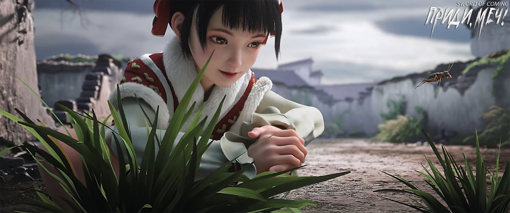
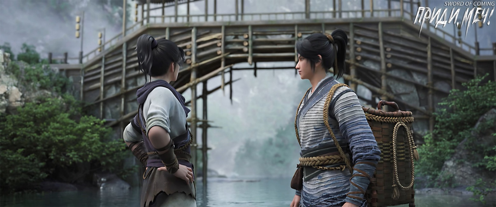

# Глава 35. Солодка

П/п.: Солодка (草) — трава, используемая в традиционной китайской медицине.

※※※※

Выйдя из переулка Глиняных Кувшинов, Лю Сяньян и Чэнь Пинъань увидели по обе стороны дороги две группы людей. Маленькая девочка сидела на шее могучего старика, а надменный мальчик в ярко-красном халате стоял рядом с женщиной благородной внешности. Когда Лю Сяньян проходил между ними, он держался непринужденно, и в глазах седовласого старика это выглядело величественно, в то время как старательно скрываемые Чэнь Пинъанем осторожность и скованность совершенно не впечатлили его.

После прощания с ними Лу Чжэнчунь остался на месте, дрожа от волнения, и осторожно доложил:

— Лю Сяньян предлагает почтенным мастерам назвать подходящую цену, и в следующий раз он, скрепя сердце, продаст семейную реликвию.

Женщина посмотрела на седовласого старика с горы Истинного Ян и с улыбкой спросила:

— Что думает почтенный Юань?

Старик немного подумал и серьезно сказал:

— Дело не должно повториться трижды. До этого момента поступим как говорит Лю Сяньян — дадим ему безграничное богатство. Гора Истинного Ян может дать этому юноше статус истинного ученика школы, кроме того, я лично одолжу ему духовный артефакт сроком на сто лет. Что касается семьи Сюй из города Чистого Ветра, решайте сами.

— Статус истинного ученика горы Истинного Ян уже является высочайшей честью! — потрясенно воскликнула женщина. — Неужели почтенный Юань еще собирается выделить духовный артефакт? Неужели этот юноша из семьи Лю — гений совершенствования, которого в возрасте девяти лет упустил торговец фарфором?

Старик словно не услышал ее и только с улыбкой сказал своей маленькой хозяйке:

— В этом городке много лавок, у каждой своя история и происхождение. Юная госпожа может прогуляться, возможно, найдет какую-нибудь редкость.

— Вперед, вперед, вперед! — по-детски весело кричала маленькая девочка, а старик, являвшийся главным почетным старейшиной горы Истинного Ян, громко рассмеялся и начал медленно бежать, словно двигающаяся гора.

— Гора Истинного Ян действительно очень влиятельна! — усмехнулся мальчик.

Женщина жестом предложила Лу Чжэнчуню идти домой, а сама неспешно пошла по улице с сыном, объясняя:

— Кроме обычной главной дороги, ведущей на гору Истинного Ян, существует особый «Путь Меча». За всю историю существования было проложено шесть путей к вершине — это значит, что на горе Истинного Ян появилось шесть настоящих бессмертных мечников, достигших Дао.

Мальчик презрительно усмехнулся:

— Какой толк от старых заслуг? Сколько можно жить прошлыми достижениями? У каждой семьи совершенствующихся, прибывших в городок, даже среди тех, кто появился позже нас, найдутся славные предки.

Женщина, держа мальчика за руку, улыбнулась:

— А знаешь ли ты, что за последние сто лет два совершенно новых Пути Меча почти достигли вершины горы Истинного Ян? Удивительность этой маленькой девочки, твоей ровесницы, в том, что она может свободно передвигаться и подолгу оставаться на той «вершине мечей», где пересекаются энергии. Время ее пребывания там не уступает даже нескольким старейшинам горы Истинного Ян.

Мальчик на мгновение опешил, затем остановился и раздраженно воскликнул:

— Раз эта глупая девчонка имеет такое незаурядное происхождение, почему матушка не сказала мне раньше? Тогда я не стал бы ей противостоять, из-за чего она при каждом удобном случае перечит мне. Если бы через несколько лет я взял ее в жены, и мы естественным образом стали бы парой совершенствующихся, разве это не принесло бы огромную выгоду нашему городу Чистого Ветра?!

Женщина, глядя на красивое лицо сына, хранившее детские черты и пылающее гневом, как у молодого тигренка, рассмеялась вместо того, чтобы разозлиться:

— Вы оба с этой девочкой — выдающиеся таланты, способные достичь пяти высших сфер, поэтому нити ваших судеб будут намного сложнее и изменчивее. Действовать своевольно и преднамеренно — не лучший путь. Неужели ты думаешь, что сейчас эта девочка просто всем сердцем ненавидит тебя?

Мальчик нахмурился:

— А разве нет?

Женщина мягко ответила:

— Пусть все идет своим чередом.

Мальчик вдруг серьезно произнес:

— Матушка, мне не нравится тот, кто следует за Лю Сяньяном. С первого взгляда очень не понравился!

Женщина с любопытством спросила:

— Почему?

Мальчик, помедлив, ответил:

— Этот человек какой-то странный, он не похож ни на все понимающего Лу Чжэнчуня, ни на ничего не смыслящего Лю Сяньяна. И особенно мне не нравятся его глаза!

Женщина, считая, что сын снова проявляет детскую капризность, утешила его:

— В городке нельзя делать все, что вздумается, но подумай, разве тебе не станет легче, если ты представишь, какая участь ждет этих людей после крушения этого мира?

Мальчик кивнул и неосознанно повторил слова, сказанные при первой встрече с Чэнь Пинъанем:

— Ничтожество!

※※※※

Выйдя из городка, Чэнь Пинъань и Лю Сяньян вскоре увидели крытый мост. Лю Сяньян небрежно спросил:

— Как думаешь, почему отец Сун Цзисиня построил этот крытый мост? Ладно, построил, но зачем накрывать прежний каменный арочный мост? Говорят, старый мост даже не разобрали, а словно надели на него одежду. Интересно, не будет ли жарко летом, ха-ха-ха… — к концу фразы Лю Сяньян рассмеялся над собственной шуткой.

На этом конце крытого моста висела золотая табличка с четырьмя большими иероглифами «Ветер рождается, вода поднимается», написанными неизвестно чьей рукой.

[1] «Ветер рождается, вода поднимается» (风生水起) — идиома, означающая ситуацию, когда дела идут живо и процветают. Образ основан на ветре, создающем рябь на водной глади. Используется для описания стремительного развития и впечатляющих достижений за короткий срок.

Поднимаясь по ступеням, Лю Сяньян несколько раз сильно топнул ногой и таинственно произнес:

— Старик Яо как-то рассказывал мне, что под этими ступенями есть что-то странное. Говорил, когда только построили крытый мост, однажды глубокой ночью отец Сун Цзисиня приказал людям выкопать здесь большую яму и зарыть огромный фарфоровый кувшин высотой с человека. Тебе не страшно?

Чэнь Пинъань раздраженно ответил:

— Чего тут бояться?

Когда они вошли в прохладу крытого моста, Лю Сяньян тихо сказал:

— Как думаешь, может, это из-за того, что в глубоком пруду под мостом утонуло несколько человек, и пришлось пригласить монахов и даосов для изгнания злых духов?

Чэнь Пинъань никогда не говорил необдуманно о призраках и духах. Не получив ответа, Лю Сяньян потерял интерес.

От недавно построенного деревянного моста исходил легкий аромат древесины и запах лака. Основные балки и столбы сделали из деревьев, срубленных в глубоких горных лесах, закрытых долгие годы. Вывезти оттуда древесину было крайне сложно. Ручей, огибающий гору, обычно имел низкий уровень воды, недостаточный для сплава огромных бревен, поэтому приходилось ждать ливней. Но в такую погоду горные тропы становились скользкими от грязи, и одно неверное движение могло привести к падению в бурный поток. К счастью, никто из молодых крестьян не утонул. Говорили, что во время перевозки леса наставник из школы Ци Цзинчунь лично помогал и учил людей, как действовать, поэтому благодаря учителю Ци все прошло благополучно.

У северных ступеней крытого моста Лю Сяньян внезапно плюхнулся на огромный зеленый камень, и Чэнь Пинъаню пришлось присесть рядом.

Лю Сяньян с улыбкой спросил:

— Если бы не я, вы с Сун Цзисинем могли бы стать хорошими друзьями?

Чэнь Пинъань покачал головой:

— Возможно, отношения стали бы немного лучше, но ненамного.

— Почему? — с любопытством спросил Лю Сяньян. — Вы же соседи и примерно одного возраста. Честно говоря, хоть Сун Цзисинь и любит щеголять ученостью, и речи его неприятны, но вроде бы он не делал ничего ужасного. А ты человек покладистый, почему же не получается?

Чэнь Пинъань улыбнулся:

— Не будем об этом. Когда придем в кузницу, ты ни в коем случае не веди себя легкомысленно. Сохранишь ли ты свой драгоценный доспех, зависит от того, примет ли тебя мастер Жуань в ученики.

— Знаю, знаю! Чэнь Пинъань, честно говоря, твоя привычка постоянно ворчать — тебе стоит над этим поработать, иначе можно с ума сойти от раздражения.

Лю Сяньян откинулся назад, лег затылком на верхнюю ступеньку крытого моста, и, глядя в лазурное небо, спросил:

— Ты ходил со стариком Яо очень далеко, забирался высоко в горы. Какие пейзажи ты видел на самом дальнем расстоянии?

Чэнь Пинъань небрежно выдернул стебель солодки, стряхнул с него пыль и начал жевать, невнятно говоря:

— Самое дальнее путешествие было, наверное, два года назад. Мы со стариком Яо прошли туда и обратно за десять дней, обошли больше десятка запретных горных вершин. В конце концов дошли до одной очень странной, пугающе высокой горы. Ты, может, не поверишь, но когда мы поднялись до середины, куда ни глянь — везде были только облака и туман. Наконец мы с огромным трудом добрались до вершины, и тогда…

Лю Сяньян долго ждал продолжения, но так и не дождавшись, повернул голову и со смехом сказал:

— Нельзя же так — посрать лишь наполовину и уже натягивать штаны![2]

[2] Идиома: нельзя начать рассказывать/начать дело, и бросить на половине.

Чэнь Пинъань с грустью тихо сказал:

— Ты же знаешь, что старик Яо был невысокого мнения обо мне, почти никогда не учил житейской мудрости и не хотел обучать настоящему мастерству обжига фарфора. Каждый раз, когда мы шли в горы, старик Яо не любил разговаривать, обычно с момента выхода и до возвращения к драконовой печи он произносил всего несколько фраз. Но в тот раз, когда мы достигли вершины, старик Яо, видимо, пребывал в хорошем настроении и сказал больше обычного. Он велел мне посмотреть на пейзаж вдали, увидеть и забыть, а после спуска с горы держать язык за зубами. Сказал, что человек должен просто усердно работать, а если только болтать языком, то даже покинув городок, останешься никем.

Лю Сяньян утешил:

— Не то чтобы я защищал старика Яо, но он тебя не то чтобы не любил, просто и не питал симпатии. Он со всеми такой ворчливый, только со мной немного получше.

Чэнь Пинъань кивнул:

— Поэтому в глубине души я очень благодарен старику Яо.

Лю Сяньян внезапно рассердился:

— Столько болтаешь, а так и не сказал, что же ты там увидел!

Чэнь Пинъань указал рукой на восток:

— Та гора, на которую мы поднялись, оказалась очень высокой, но когда я смотрел с вершины, далеко на востоке возвышалась еще одна, настолько высокая, что я даже не могу описать.

Лю Сяньян проворчал:

— Подумаешь, увидел высокую гору! А я-то думал, ты там бессмертных на облаках увидел!

Чэнь Пинъань задумчиво произнес:

— Кто знает, может быть, на той горе действительно живут бессмертные?

Лю Сяньян с улыбкой спросил:

— Чэнь Пинъань, как думаешь, бессмертным тоже нужно есть, пить и срать?

Чэнь Пинъань потер подбородок:

— Если бессмертным тоже нужно гадить, это как-то не очень солидно.

Лю Сяньян сильно хлопнул Чэнь Пинъаня по голове и побежал прочь:

— Вот тебе бессмертный и навалил прямо на голову!

Лю Сяньян не рассчитал силу, и от удара у Чэнь Пинъаня слегка зазвенело в ушах. Не став гнаться за Лю Сяньяном, он встал и пробормотал себе под нос:

— Гром — это, наверное, храп спящих бессмертных? А дождь уж точно не должен быть их мочой, иначе нам совсем плохо придется…

Чэнь Пинъань ускорил шаг и вскоре догнал Лю Сяньяна.

После шутливой потасовки они наконец добрались до кузницы у ручья. Вместе с глинобитными домами и соломенными хижинами там возвышалось семь или восемь строений, и в глазах Чэнь Пинъаня все они стоили целое состояние.

Большая группа юношей и молодых мужчин из городка копала колодец. Большинство сверстников, как и Лю Сяньян, прежде работали у драконовой печи. После того как все они лишились «фарфоровой чашки с рисом» от императора, уже считалось большой удачей получить в кузнице «железную чашку с рисом». Впрочем, по словам Лю Сяньяна, большинство помощников оставались временными разнорабочими, так как мастер Жуань сказал, что возьмет самое большее несколько учеников, а остальные в лучшем случае станут постоянными рабочими.

Лю Сяньян махнул рукой:

— Подожди здесь, я пойду поздороваюсь с мастером Жуанем, посмотрю, смогу ли показать тебе, как куют железо. Тц-тц, если ты увидишь, как его дочь размахивает молотом и бьет по железу, гарантирую — умрешь от испуга!

Чэнь Пинъань остался стоять на месте, не двигаясь без надобности.

Оглядевшись, он заметил семь заложенных колодцев, у их устьев все еще стояли деревянные вороты и ограждения. Из некоторых колодцев то и дело появлялись люди с корзинами на головах.

Глядя на людей, занятых рытьем колодцев, Чэнь Пинъань привычно присел на корточки, зачерпнул горсть земли и медленно растер между пальцами. На ощупь она казалась довольно влажной, но на самом деле это оказалась не водная почва, а наоборот — огненная, причем последний из видов огненной почвы. По словам старика Яо, она называлась «почвой уходящего огня седьмого месяца»[3]. Такая почва самопроизвольно становилась прохладной, не слишком сухой, хорошо поддавалась формовке, а это означало, что при укреплении стенки колодца вряд ли обвалятся — хороший знак.

[3] «七月流火» — «в седьмом месяце огонь утекает». Это выражение описывает природное явление, когда в седьмом месяце по лунному календарю, в сумерках, можно наблюдать, как звезда Огня (альфа созвездия Скорпиона) заходит на западе. Это образное выражение используется для описания смены сезонов и наступления осенней прохлады.

Очевидно, кузнец мастер Жуань, даже не будучи специалистом по рытью колодцев, определенно не являлся новичком в этом деле. Только Чэнь Пинъань не совсем понимал, зачем на таком маленьком участке рыть столько колодцев.

Чэнь Пинъань повернул голову в сторону ручья и усмехнулся. Теперь этот безымянный ручей в его глазах превратился в сокровищницу, полную золота, серебра и медных монет.

Только после того, как этой ночью он достанет камень змеиной желчи, Чэнь Пинъань должен будет тайно отправиться в переулок Глиняных Кувшинов. Согласно тому, что Гу Цань шепнул ему перед отъездом из городка, нужно выкопать что-то под большим чаном с водой в его доме. Гу Цань тогда уезжал в спешке и толком ничего не объяснил, только сказал, что это сокровище его семьи, и даже его мать не знала о тайнике.

Чэнь Пинъань не мог сдержать улыбку, вспоминая этого сопляка.

Раньше Чэнь Пинъань был хвостиком, следующим за задницей Лю Сяньяна, помогая ловить рыбу, змей и разорять птичьи гнезда. Когда повзрослел, у него появился свой маленький последователь.

Для Чэнь Пинъаня, у которого не было ни семьи, ни поддержки, один был как старший брат, другой — как младший. Одному он должен был отплатить благодарностью, о другом — заботиться. Поэтому все эти годы жизнь Чэнь Пинъаня оставалась трудной, но не горькой.